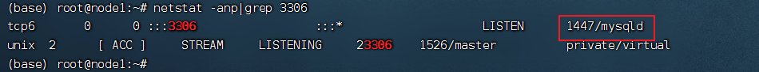
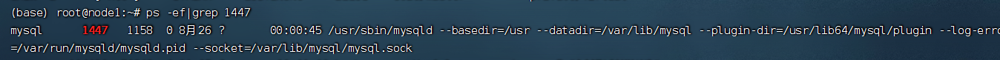
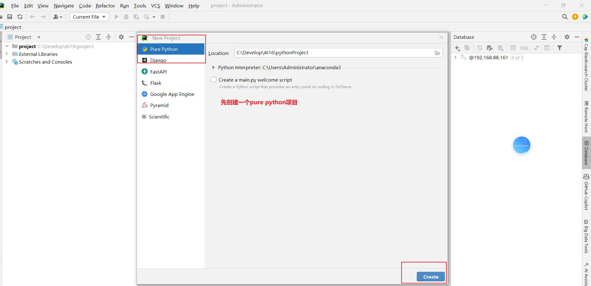
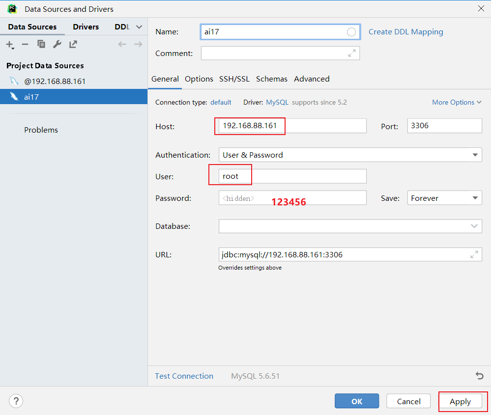
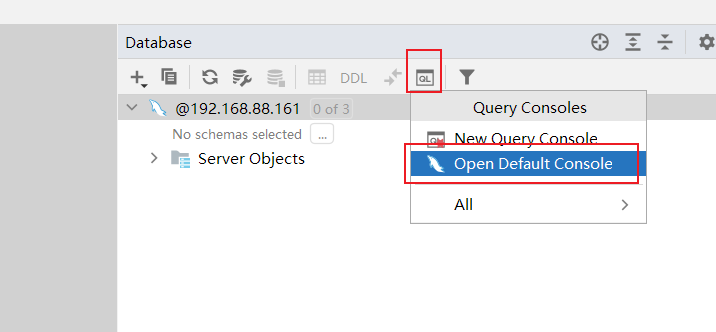

## 1. Linux 使用技巧

### 1.1 常用快捷键

| 快捷键       | 功能说明                    |
| :----------- | :-------------------------- |
| `Ctrl + C`   | 强制停止当前命令            |
| `Ctrl + D`   | 退出/登出当前会话           |
| `Ctrl + R`   | 搜索历史命令                |
| `Ctrl + A`   | 光标移动到命令开始          |
| `Ctrl + E`   | 光标移动到命令结束          |
| `Ctrl + ←/→` | 光标左右跳转到单词边界      |
| `Ctrl + L`   | 清屏（等效于 `clear` 命令） |

**命令行快捷操作：**

- `history`：查看完整历史命令列表
- `!命令前缀`：自动执行最近一条匹配前缀的命令


### 1.2 软件包管理（apt）

使用 **`apt`** 进行软件包管理：`apt` 是 Debian/Ubuntu 系统的软件包管理工具，可自动解决依赖关系。

```shell
# 更新软件源列表（安装/升级前必须执行，通过更新软件源，系统可以获取到最新的软件包信息和版本。）
sudo apt update

# 软件包管理
sudo apt install package_name              # 安装单个软件包
sudo apt install pkg1 pkg2                 # 安装多个软件包
sudo apt install /path/to/file.deb         # 安装本地 deb 文件
sudo apt remove package_name               # 移除软件包（保留配置）
sudo apt remove package1 package2          # 删除指定多个包，以空格分隔
sudo apt purge package_name                # 彻底移除（包含配置）
sudo apt upgrade                           # 升级所有已安装软件包
sudo apt upgrade package_name              # 升级指定软件包

# 查询软件包
sudo apt list                             # 列出所有可用包
sudo apt list --installed                 # 列出已安装包
sudo apt search keyword                   # 搜索软件包
```


### 1.3 服务管理（systemctl）

`Linux`系统很多软件（内置或第三方）均支持使用`systemctl`命令控制：启动、停止、开机自启。能够被`systemctl`管理的软件，一般也称之为：服务

```shell
systemctl start|stop|restart|status|enable|disable 服务名
```

| 子命令    | 功能         |
| :-------- | :----------- |
| `start`   | 启动服务     |
| `stop`    | 停止服务     |
| `restart` | 重启服务     |
| `status`  | 查看服务状态 |
| `enable`  | 设置开机自启 |
| `disable` | 禁用开机自启 |

**常用服务示例：**

- `NetworkManager`：主网络服务
- `ufw`：防火墙服务
- `ssh`：SSH 远程登录服务

**💡 应用场景：** 修改网络配置后，需重启网络服务：`systemctl restart NetworkManager`


### 1.4 符号链接（软连接）

创建文件的快捷方式，类似于 Windows 的快捷方式。

**语法：** `ln -s 源路径 目标路径`

```shell
# 示例：为 /var/www/html 创建软链接到当前用户目录
ln -s /var/www/html ~/webroot

# 访问 ~/webroot 即等同于访问 /var/www/html
```

**⚠️ 注意事项：**

- 源路径建议使用绝对路径，避免因相对路径导致链接失效
- 删除软链接不会影响原文件


### 1.5 IP地址/域名解析/主机名

想联网访问互联网, 必须有IP地址：ip地址两个版本 ipv4、ipv6。

#### IP 地址

- **IPv4 格式：** `a.b.c.d`（每组 0-255）
- **特殊 IP 地址：**
  - `127.0.0.1`：本地回环地址，表示本机
  - `0.0.0.0`：可表示本机或任意 IP（常用于白名单配置）


#### 域名解析

通过域名访问网络服务, 先要进行域名解析，系统按以下顺序查找域名对应 IP：

| 解析方式            | 文件路径/地址                                                | 说明                   |
| :------------------ | :----------------------------------------------------------- | :--------------------- |
| **本地 hosts 文件** | Linux: `/etc/hosts`<br>Windows: `C:\Windows\System32\drivers\etc\hosts` | 优先级最高，可手动配置 |
| **DNS 服务器**      | `8.8.8.8` (Google)<br>`114.114.114.114` (国内通用)           | 网络级域名解析         |


#### 主机名管理

```shell
hostname                                # 查看当前主机名
sudo hostnamectl set-hostname 新主机名   # 永久修改主机名（需 root 权限）
```


#### 固定 IP 配置（可选）

虚拟机默认通过 DHCP 动态获取 IP，可能导致 IP 频繁变更。如需固定 IP 以便远程连接，可在网络设置中手动配置静态 IP（固体步骤用到了查看，现在看对学习没有很大用处。）。


### 1.6 网络操作与文件下载

#### 连通性测试（ping）

```shell
ping 192.168.88.2        # 测试局域网连通性
ping baidu.com           # 测试互联网连通性
```

#### 文件下载

```shell
# wget - 非交互式下载器，可以在命令行内下载网络文件。语法：`wget  [-b]  url`
wget https://example.com/file.zip          # 前台下载
wget -b https://example.com/large-file.iso # 后台下载（日志写入 wget-log）

# curl - HTTP 客户端工具，可用于：下载文件、获取信息等。语法：`curl [-o] url`
curl https://api.example.com/data          # 获取内容并输出到终端
curl -O https://example.com/file.zip       # 下载并保存文件（大写 O）
```


### 1.8 端口占用查看/进程查询	

**端口**：是设备与外界通讯交流的出入口。端口可以分为**物理端口**和**虚拟端口**两类。

- 物理端口：又可称之为接口，是可见的端口，如USB接口，HDMI端口等。
- 虚拟端口：是指计算机内部的端口，是不可见的，是用来操作系统和外部进行交互使用的。
  - 虚拟端口的作用：计算机程序之间的通讯，通过IP只能锁定计算机，但是无法锁定具体的程序。通过端口可以锁定计算机上具体的程序，确保程序之间进行沟通

- `Linux`系统可以支持65535个端口，这6万多个端口分为3类进行使用：
  - 公认端口：1~1023，通常用于一些系统内置或知名程序的预留使用，如SSH服务的22端口，HTTPS服务的443端口，**非特殊需要，不要占用这个范围的端口**
  - 注册端口：1024~49151，通常可以随意使用，用于松散的绑定一些程序\服务
  - 动态端口：49152~65535，通常不会固定绑定程序，而是当程序对外进行网络链接时，用于临时使用。


**查看端口占用**

- 可以通过使用nmap命令查看端口的占用情况。
  - 语法：`nmap 被查看的ip地址`。例如：`nmap 127.0.0.1`
- 可以通过netstat命令，查看指定端口的占用情况
  - 语法：`netstat -anp | grep 端口号`
  - 可以查看指定端口被占用的情况 获取占用端口的进程ID




**查看进程**

为管理运行的程序，每一个程序在运行的时候，便被操作系统注册为系统中的一个**进程**。并会为每一个进程都分配一个独有的：进程ID（进程号），可以用过`ps`命令查看Linux系统中的进程信息。

- 语法：**ps -ef**    查看进程相关的所有信息

  - 选项：`-e`，显示出全部的进程

  - 选项：`-f`，以完全格式化的形式展示信息（展示全部信息）

    

  - 从左到右分别是：

    - **UID**：进程所属的用户**ID**
    - **PID**：进程的进程号**ID**
    - **PPID**：进程的父**ID**（启动此进程的其它进程）
    - **C**：此进程的**CPU**占用率（百分比）
    - **STIME**：进程的启动时间
    - **TTY**：启动此进程的终端序号，如显示**?**，表示非终端启动
    - **TIME**：进程占用**CPU**的时间
    - **CMD**：进程对应的名称或启动路径或启动命令

- 查看指定进程
  - 语法：`ps -ef |grep tail`，过滤不仅仅过滤名称，进程号，用户ID等等，都可以被grep过滤哦。




**关闭进程**

语法：`kill [-9] 进程id`，选项：-9，表示强制关闭进程

查询出1447是mysql占用之后, 可以根据当前情况判断

- 如果端口冲突, 可以选择换端口
- kill -9 1447


**端口冲突**

- 获取占用端口的进程编号： `netstat -anp | grep 端口号`

- 查询进程相关的详细信息：  `ps -ef | grep 进程编号`

- `kill -9 进程编号`

  

### 1.9 环境变量

环境变量是一组信息记录，类型是KeyValue型（名称=值），用于操作系统运行的时候记录关键信息

- 配置环境变量的时候, 主要就是配置PATH
- PATH 是一系列的**文件夹**, 多个文件夹之间用 **:** 隔开
- 配置了PATH之后, 在PATH中的可执行文件, 在任何一个工作目录下敲文件名就可以直接执行了


**$**符号：在Linux系统中，**$**符号被用于取”变量”的值，如`echo $PATH`，又或者：`echo ${PATH}ABC`，当和其它内容混合在一起的时候，可以通过{}来标注取的变量是谁。


**`Linux` 配置环境变量**

- 临时设置：
  - 语法：**`export 变量名=变量值`**      或者       **`变量名=变量值`**
  - `export PATH=$PATH:/home/itheima/myenv`
  - 直到当前 Shell 会话结束（关闭终端或退出 Shell），若使用 `export`，变量对当前 Shell **及其启动的子进程**可见。若未使用 `export`，变量仅对当前 Shell 有效，子进程无法继承。
- 永久生效：
  - 针对当前用户：~/.bashrc文件中配置
  - 针对全部用户：/etc/profile文件中配置
  - 配置完成，可以通过source命令立刻生效

```shell
source /etc/profile
source ~/.bashrc
```


### 1.10 上传、下载

宿主机与虚拟机之间的文件交换：

- FinalShell软件的下方窗体中，提供了Linux的文件系统视图，可以方便的上传下载
- 可以通过rz、sz命令进行文件传输
  - 上传命令，语法：`rz`
  - 下载命令，语法：`sz 要下载的文件`
  - 文件会自动下载到桌面的：fsdownload文件夹中


### 1.11 压缩解压缩

以下为`Linux`系统常用的压缩格式：tar、gzip、zip


**tar命令**

- 压缩文件后缀名：.tar及.gz
  - .tar，称之为tarball，归档文件，即简单的将文件组装到一个.tar的文件内，并没有太多文件体积的减少，仅仅是简单的封装
  - .gz，也常见为.tar.gz，gzip格式压缩文件，使用gzip压缩算法将文件压缩到一个文件内，可以极大的减少压缩后的体积

- 语法：`tar [-c -v -x -f -z -C] 参数1 参数2 ... 参数N`
  - -c，创建压缩文件，用于压缩模式

  - -x，解压模式

    

  - -v，显示压缩、解压过程，用于查看进度

  - -f，要创建的文件，或要解压的文件，-f选项必须在所有选项中位置处于最后一个


  - -z，gzip模式，不使用-z就是普通的tarball格式

    

  - -C，选择解压的目的地，用于解压模式

示例：tar/tar.gz

- 打tar包：`tar -cvf xxxx.tar 文件名`

- 打 tar.gz包：`tar -zcvf xxxx.tar 文件名`

- 解开tar包：`tar -xvf xxxx.tar -C 要解开的目的地路径`

- 解开tar.gz包：`tar -zxvf xxxx.tar -C 要解开的目的地路径`

- 注意：

  - -f选项，必须在选项组合体的最后一位
  
  - -z选项，建议在开头位置
  
  - -C选项单独使用，和解压所需的其它参数分开


**zip** **命令**

- 压缩语法：`zip [-r] 参数1 参数2 ... 参数N`
  - -r，被压缩的包含文件夹的时候，需要使用-r选项，和rm、cp等命令的-r效果一致
- 解压语法：unzip [-d] 参数
  - -d，指定要解压去的位置，同tar的-C选项
  - 参数，被解压的zip压缩包文件


示例：zip

- 打包zip：`zip [-r] XXX.zip  要打包的文件 .....`

- 解压zip：`unzip xxx.zip -d 指定要解压的目录`


## 2、Mysql

### 2.1 **开发环境配置：**

- 下载并且激活pycharm(百度网盘里面有)

- 先创建一个python的项目




- 找到 Database 工具栏(界面右边栏也能找到)


- 配置mysql 链接, 这里使用ubantu虚拟机上安装的MySQL (连之前ubantu一定要打开)
  - ip  192.168.58.128
  - 用户名 root
  - 密码 12345678




- 配置好Mysql连接之后, 打开默认控制台, 可以在里面写SQL




### 2.2 数据库简介

数据库就是存储数据的仓库，用户可以对数据库中的数据进行**增**、**删**、**改**、**查**操作。数据库分为**关系型数据库**和**非关系型数据库**。


#### 2.2.1 **关系型数据库（RDBMS）**

**核心特点**

1. **结构化数据存储**
   - 数据以表格（二维结构）形式存储，预定义严格的模式（Schema）。
   - 支持主键、外键约束，保证数据完整性。
2. **SQL 支持**
   - 通过 SQL 实现复杂查询（如 JOIN、子查询、聚合函数）。
   - 适合需要多表关联和事务管理的场景（如金融系统）。
3. **ACID 事务**
   - 保证事务的原子性（Atomicity）、一致性（Consistency）、隔离性（Isolation）、持久性（Durability）。
4. **垂直扩展为主**
   - 通过增加 CPU、内存等硬件提升性能，但成本较高。

**适用场景**

- 银行系统（需强一致性）

- ERP、CRM（复杂业务逻辑）

- 需要频繁 JOIN 操作的场景

  

#### 2.2.2 **非关系型数据库（NoSQL）**

**核心特点**

1. **灵活的数据模型**
   - **文档型**（如 MongoDB）：JSON/BSON 格式存储。
   - **键值型**（如 Redis）：简单键值对，适合缓存。
   - **列存储**（如 Cassandra）：按列族组织数据，适合分析。
   - **图数据库**（如 Neo4j）：存储节点和关系，适合社交网络。
2. **高扩展性**
   - 天然支持分布式架构，通过添加节点实现水平扩展。
   - 适合处理海量数据（如日志、物联网设备数据）。
3. **最终一致性（BASE）**
   - 遵循 BASE（Basically Available, Soft-state, Eventually Consistent）原则，牺牲强一致性以提升可用性。
4. **高性能**
   - 针对特定场景优化（如 Redis 的毫秒级响应）。

**适用场景**

- 实时大数据处理（如用户行为日志）
- 高并发读写（如电商秒杀）
- 动态数据结构（如内容管理系统）


#### **2.2.3 核心差异**

| **特性**     | **关系型数据库**                      | **非关系型数据库**                                    |
| :----------- | :------------------------------------ | ----------------------------------------------------- |
| **数据模型** | 基于表格（行和列）的严格结构          | 灵活的数据模型（文档、键值、图等）                    |
| **查询语言** | 使用标准化的 SQL（结构化查询语言）    | 无统一语言，API或特定查询语法                         |
| **扩展性**   | 垂直扩展（升级硬件）                  | 水平扩展（分布式集群）                                |
| **事务支持** | 强 ACID（原子性、一致性等）           | 通常 BASE（最终一致性）                               |
| **适用场景** | 结构化数据、复杂查询、高一致性        | 半/非结构化数据、高并发、灵活性                       |
| **典型产品** | MySQL、Oracle、DB2、SQLserver、sqlite | MongoDB（文档型）、Redis（键值）、Cassandra（列存储） |


### 2.3 Mysql 简介

MySQL的特点：免费，支持大型数据库，标准的SQL语言形式，跨平台。

MySQL登录的两种方式：

```shell
mysql -u root -p 12345678  # 本地登录
mysql --host=192.168.88.161 --user=root --password=12345678  # 远程登陆
```


### 2.4 SQL 语言介绍

- 结构化查询语言(`Structured Query Language`)简称SQL，是关系型数据库管理系统都需要遵循的规范，是数据库认识的语句。不同的数据库生产厂商都支持SQL语句，但都有自己特有内容。

  

- 标准SQL 

  - Mysql 支持的SQL 可以看做是标准SQL的方言 (大多数都一样, 少部分区别)

  - Oracle 支持的SQL 可以看做是标准SQL的方言

    

- SQL 的分类

  - 操作数据库数据表  DDL
  - 对数据进行增加删除修改 DML
  - 对数据库进行**查询 DQL**
  - DCL  权限控制, 用户创建管理 ，不涉及(DBA 管理)


- SQL 注释

```mysql
/*多行注释，在注释区域内可以随意换行*/
-- # ：单行注释，写在语句开头，换行后注释截止。单行注释快捷键：ctrl+/
```


- 常用的数据类型：
  - 字符：char，varchar
  - 整数：int
  - 浮点型：float，double，decimal
  - 日期型：date，datetime


### 2.5 SQL语言的DDL

**操作数据流程**：DDL 建库建表 →DML 向表中写入数据(增、删、改) → DQL(数据查询)


#### 2.5.1 **数据库操作**

```sql
-- DDL语句 

create database if not exists ai_db charset =utf8;  # 创建数据库，create database 数据库名;

show databases;  # 查看数据库，show databases;

drop database ai_db;  # 删除数据库，drop database 数据库名;

use ai_db;  # 使用数据库，use 数据库名;（选中一个数据库, 后续操作, 都在这个数据库中进行）
```


#### 2.5.2 **数据表操作**

```sql
-- 选中一个数据库, 后续操作, 都在这个数据库中进行
use ai_db;

-- DDL 对数据表的操作

create table category(cid varchar(20) primary key not null ,cname varchar(100));  # 创建数据表，create table 表名(字段名 类型 [约束]…)

show tables;  # 查看当前数据库有哪些数据表，show tables;

desc category;  # 查看表结构，desc 表名;

drop table category;  # 删除表，drop table 表名;

-- 添加字段, 需要注意这里添加的字段的名字和sql的关键字冲突了,如果非要使用SQL的关键字作为字段名 需要添加 ``
-- alter table 表名 add 列名 类型 [约束]; 增加一列
alter table category add `desc` varchar(20);

alter table category add num varchar(20);

-- 修改字段名字  alter table 表名 change 老字段名 新字段名字 类型 [约束]; 修改一列名字
alter table category change `desc` description varchar(20);

-- 删除字段 alter table 表名 drop 字段名; 删除一列
alter table category drop description;

-- rename table 表名 to 新表名; 修改表名
rename table category to category2;
```


### 2.6 SQL语言的DML

```sql
-- DML
-- 插入数据 insert into：
-- insert into 表 (字段1,字段2,字段3...) values(值1,值2,值3...),(值1,值2,值3...)…;
insert into category values ('c001','电器');

insert into category2 values ('c002','衣服',3);
insert into category2(cid,cname) values ('c001','电器');
insert into category2 (cid, cname) values('03','化妆品'),('04','书籍'),('05',null);


-- 修改数据 update
-- 格式：update 表名 set 字段名=值,字段名=值,... where 条件
update category2 set cname = '家电';

update category2 set cname='水果' where cid='c001';

-- 删除记录 delete from 或 truncate category;
delete from category2 where cid='c002';
delete from category;  # 可以不接where条件（不指定 WHERE 时删除所有行，但保留表结构）

-- truncate只能清除全表数据
truncate category2;
```

>在SQL使用到的数据，除了数字，都需要双引号。
