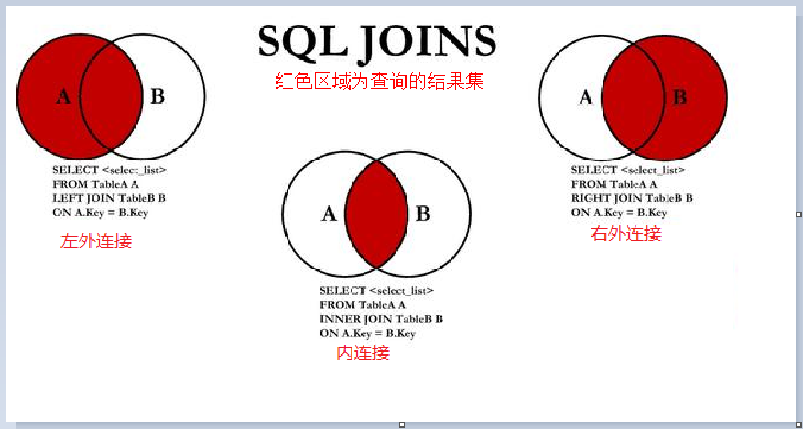
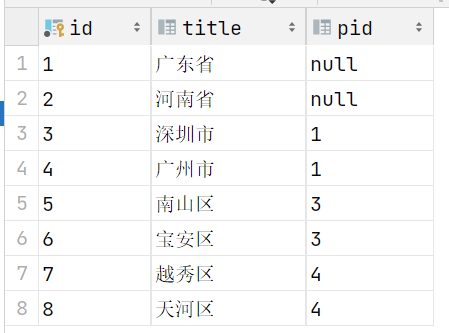
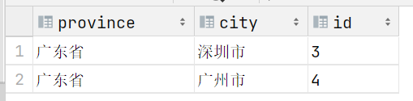
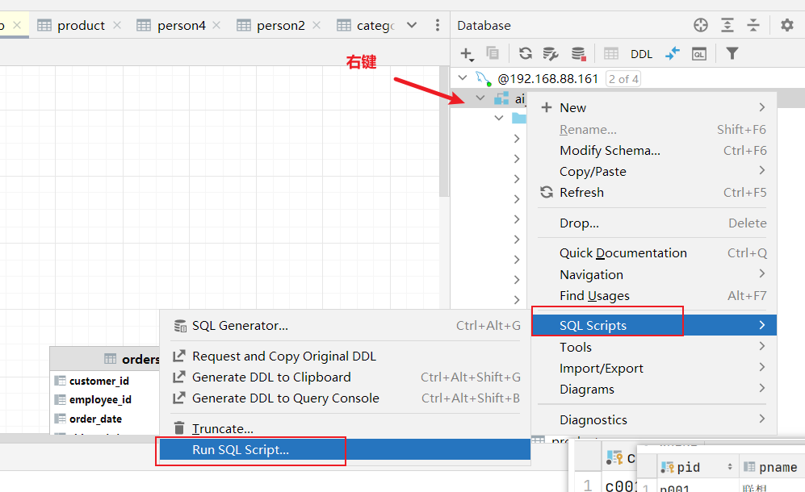

## 1. 数据库约束 (Constraints)

### 1.1 约束概述

约束（Constraint）是用于限制表中数据的规则，确保数据库中数据的**准确性**和**可靠性**。MySQL支持以下六大核心约束类型：

| 约束类型        | 功能描述                                        | 适用场景                             |
| :-------------- | :---------------------------------------------- | :----------------------------------- |
| **PRIMARY KEY** | 主键约束，唯一标识每条记录（NOT NULL + UNIQUE） | 每条记录必须唯一识别的场景           |
| **NOT NULL**    | 非空约束，确保列不能存储NULL值                  | 必填字段（如用户名、密码）           |
| **UNIQUE**      | 唯一约束，确保列中所有值都不同                  | 不可重复的业务字段（如邮箱、手机号） |
| **FOREIGN KEY** | 外键约束，维护表间数据参照完整性                | 关联表之间的数据一致性保证           |
| **DEFAULT**     | 默认值约束，未指定值时自动填充                  | 减少数据录入工作量的场景             |
| **CHECK**       | 检查约束，确保值满足特定条件                    | 业务规则校验（如年龄≥18）            |


### 1.2 核心约束详解

#### 主键约束（PRIMARY KEY）

主键是表设计的核心，应遵循以下**黄金法则**：

- **无意义性**：主键应对用户透明，仅作技术标识
- **不可变性**：主键值一旦确定，**永不更新**
- **稳定性**：不应包含动态变化的数据（如时间戳、创建时间）
- **自动化**：推荐使用`AUTO_INCREMENT`自动生成

```sql
-- 示例1：单列主键 + 自动增长（最常用）
CREATE TABLE person(
    id INT PRIMARY KEY AUTO_INCREMENT,  -- 主键且自动递增，无需人工维护
    last_name VARCHAR(100),
    first_name VARCHAR(100)
);

-- 示例2：复合主键（多个列组合唯一）
-- 适用场景：当单个字段无法唯一标识记录时（如订单明细表）
-- 特性：所有组成列均不允许NULL，组合值必须唯一
CREATE TABLE order_items (
    order_id INT NOT NULL,              -- 订单ID（外键）
    product_id INT NOT NULL,            -- 商品ID（外键）
    quantity INT,
    PRIMARY KEY (order_id, product_id)  -- 复合主键：同一订单中相同商品只能有一条记录
);
```

#### 其他核心约束

```sql
-- NOT NULL约束：确保必填字段
CREATE TABLE users (
    user_id INT PRIMARY KEY AUTO_INCREMENT,
    username VARCHAR(50) NOT NULL,      -- 用户名必须填写，不能为NULL
    email VARCHAR(100) NOT NULL         -- 邮箱必须填写，不能为NULL
);

-- UNIQUE约束：确保字段唯一性
-- 方式一：列级定义
CREATE TABLE members (
    member_id INT PRIMARY KEY AUTO_INCREMENT,
    phone VARCHAR(20) UNIQUE            -- 手机号必须唯一
);

-- 方式二：表级定义（推荐，可定义多个列的组合唯一）
CREATE TABLE products (
    product_id INT PRIMARY KEY AUTO_INCREMENT,
    product_code VARCHAR(50) NOT NULL,
    category_id INT,
    UNIQUE (product_code, category_id)  -- 同一分类下商品编码唯一
);

-- DEFAULT约束：提供默认值
CREATE TABLE orders (
    order_id INT PRIMARY KEY AUTO_INCREMENT,
    order_status VARCHAR(20) DEFAULT 'pending',  -- 默认状态为'pending'
    create_time TIMESTAMP DEFAULT CURRENT_TIMESTAMP  -- 默认当前时间
);

-- CHECK约束：MySQL 8.0.16+版本有效
CREATE TABLE employees (
    emp_id INT PRIMARY KEY AUTO_INCREMENT,
    emp_name VARCHAR(50) NOT NULL,
    age INT CHECK (age >= 18 AND age <= 65)  -- 年龄必须在18-65岁之间
);
```


### 1.3 约束的DDL操作

#### 添加约束（ALTER TABLE）

```sql
-- 添加主键约束（通常在建表时定义，后期添加较少见）
ALTER TABLE students ADD PRIMARY KEY (student_id);

-- 添加外键约束（需确保引用表存在且字段类型匹配）
ALTER TABLE orders
ADD CONSTRAINT fk_orders_customer  -- 指定约束名称，便于后续管理
FOREIGN KEY (customer_id) REFERENCES customers(customer_id);

-- 添加CHECK约束
ALTER TABLE employees ADD CHECK (salary >= 3000);

-- 添加DEFAULT约束
ALTER TABLE employees ALTER city SET DEFAULT 'Beijing';
```

#### 删除约束（ALTER TABLE）

```sql
-- 删除主键约束
ALTER TABLE students DROP PRIMARY KEY;

-- 删除外键约束（必须知道约束名称）
ALTER TABLE orders DROP FOREIGN KEY fk_orders_customer;

-- 删除DEFAULT约束
ALTER TABLE employees ALTER city DROP DEFAULT;
```


### 1.4 外键约束深度解析

外键是实现**参照完整性**的核心机制，其工作原理如下：

```sql
-- 主表（一）：分类表
CREATE TABLE category (
    cid VARCHAR(32) PRIMARY KEY,
    cname VARCHAR(100)
);

-- 从表（多）：商品表
CREATE TABLE products (
    pid VARCHAR(32) PRIMARY KEY,
    pname VARCHAR(40),
    price DOUBLE,
    category_id VARCHAR(32),
    -- 外键约束：category_id必须引用category表的cid字段
    FOREIGN KEY (category_id) REFERENCES category(cid)
);

-- 数据操作演示
INSERT INTO category (cid, cname) VALUES('c001', '家电');  -- 必须先插入主表数据

-- 合法操作：外键值为NULL（表示未分类）
INSERT INTO products (pid, pname) VALUES('p001', '商品名称');

-- 合法操作：外键值在主表中存在
INSERT INTO products (pid, pname, category_id) VALUES('p002', '商品名称2', 'c001');

-- ❌ 非法操作：外键值在主表中不存在（会抛出异常）
-- INSERT INTO products (pid, pname, category_id) VALUES('p003', '商品名称2', 'c999');

-- ❌ 非法操作：删除已被引用的主表数据（会抛出异常）
-- DELETE FROM category WHERE cid = 'c001';
```

**外键约束核心规则**：

1. **插入规则**：从表的外键值必须为NULL或在主表中存在
2. **删除规则**：主表中被引用的记录**无法直接删除**（需先删除从表关联记录或使用级联删除）


## 2. `DQL` 单表查询

### 2.1 基础查询语法

```sql
SELECT *|字段名 FROM 表名 WHERE 条件;
```

```sql
-- 查询所有字段和记录
SELECT * FROM 表名;

-- 查询指定字段
SELECT pname, price FROM product;

-- 字段运算（查询时动态计算）
SELECT pname, price + 10 AS new_price FROM product;  -- 所有商品价格+10元显示

-- 条件查询（WHERE子句）
SELECT pname, price FROM product 
WHERE price BETWEEN 200 AND 800;  -- 查询价格在200-800之间的商品
select * from product where  price>=200 and price <=800; -- 下面这句相当于 between 200 and 800

-- IN查询：枚举具体取值（非范围）
SELECT pname, price FROM product 
WHERE price IN (200, 800);  -- 精确匹配200或800的商品
select * from product where  price=200 or price =800; -- 下面这句相当于 in (200, 800)


-- 非空查询
select * from product where product.category_id is not null ;

-- 模糊查询：在 SQL 的模糊查询中，LIKE 关键字配合通配符使用，主要涉及 % 和 _ 两个通配符（注意 * 不是模糊查询的通配符）
-- % 作用：匹配任意长度的字符串（包括零个字符）；_ 作用：匹配单个任意字符。
select * from product where pname like '香%';
select * from product where pname like '_想%';


select pname,price from product where price!=800;
select * from product where  not (price=200);
```

### 2.2 结果排序（ORDER BY）

```sql
SELECT * FROM 表名 ORDER BY 排序字段 ASC|DESC;  -- ASC 升序 / DESC 降序
```

```sql
-- 单列排序：默认ASC升序，DESC为降序
SELECT * FROM product ORDER BY price DESC;  -- 按价格从高到低排序

-- 多列排序：先按第一字段排序，相同则按第二字段排序
SELECT * FROM product 
ORDER BY price DESC, category_id DESC;  -- 价格相同再按分类降序

-- 💡 技巧：多字段排序时，只有第一字段有重复值，第二字段排序才生效
```

### 2.3 聚合函数

| 函数      | 功能描述                         | 是否忽略NULL |
| :-------- | :------------------------------- | :----------- |
| `COUNT()` | 统计行数或指定字段的非NULL值数量 | ✅            |
| `SUM()`   | 计算数值列总和                   | ✅            |
| `MAX()`   | 获取最大值                       | ✅            |
| `MIN()`   | 获取最小值                       | ✅            |
| `AVG()`   | 计算平均值                       | ✅            |

```sql
-- 统计所有商品数量
SELECT COUNT(*) FROM product;

-- 统计价格>200的商品数量
SELECT COUNT(*) FROM product WHERE price > 200;

-- 统计c001分类商品的总价和均价
SELECT 
    SUM(price) AS total_price,
    AVG(price) AS avg_price
FROM product 
WHERE category_id = 'c001';

-- 获取价格极值
SELECT MAX(price) AS max_price, MIN(price) AS min_price FROM product;
```

### 2.4 分组统计（GROUP BY & HAVING）

```sql
SELECT 字段1, 字段2... FROM 表名 GROUP BY 分组字段 HAVING 分组条件;  -- HAVING 用于分组后过滤
```

```sql
-- 基础分组：统计每个分类的商品数量
SELECT category_id, COUNT(*) AS product_count
FROM product
GROUP BY category_id;

-- 分组后筛选：统计商品数>2的分类
SELECT category_id, COUNT(*) AS product_count
FROM product
GROUP BY category_id
HAVING product_count > 2;  -- HAVING用于分组后的条件过滤

-- ⚠️ 注意：WHERE用于分组前过滤，HAVING用于分组后过滤
```

### 2.5 分页查询（LIMIT）

```sql
SELECT 字段1, 字段2... FROM 表名 LIMIT M, N;  -- M: 起始索引，N: 查询条数
```

```sql
-- LIMIT语法：LIMIT 起始索引, 每页条数
-- 起始索引 = (页码 - 1) × 每页条数

-- 查询第1页，每页5条
SELECT * FROM product LIMIT 0, 5;

-- 查询第2页，每页5条
SELECT * FROM product LIMIT 5, 5;

-- 查询第3页，每页10条
SELECT * FROM product LIMIT 20, 10;
```

### 2.6 完整查询执行顺序

```sql
SELECT [DISTINCT] 列名1, 列名2, ...    -- 1. 选择字段（去重）
FROM 表名                           -- 2. 指定数据源
[WHERE 条件]                        -- 3. 原始数据过滤
[GROUP BY 分组列]                   -- 4. 数据分组
[HAVING 分组条件]                   -- 5. 分组结果过滤
[ORDER BY 排序列 [ASC|DESC]]        -- 6. 结果排序
[LIMIT [偏移量,] 行数];              -- 7. 结果分页

-- 执行优先级：WHERE → GROUP BY → HAVING → ORDER BY → LIMIT
```

### 2.7 单表查询综合示例

```sql
-- 1. 创建示例表（商品表）
CREATE TABLE product (
    pid INT PRIMARY KEY AUTO_INCREMENT,
    pname VARCHAR(20) NOT NULL,
    price DOUBLE NOT NULL,
    category_id VARCHAR(32)
);

-- 2. 插入测试数据（共13条）
INSERT INTO product VALUES
(1, '联想', 5000, 'c001'), (2, '海尔', 3000, 'c001'),
(3, '雷神', 5000, 'c001'), (4, '杰克琼斯', 800, 'c002'),
(5, '真维斯', 200, 'c002'), (6, '花花公子', 440, 'c002'),
(7, '劲霸', 2000, 'c002'), (8, '香奈儿', 800, 'c003'),
(9, '相宜本草', 200, 'c003'), (10, '面霸', 5, 'c003'),
(11, '好想你枣', 56, 'c004'), (12, '香飘飘奶茶', 1, 'c005'),
(13, '海澜之家', 1, 'c002');

-- 3. 综合查询示例
-- 查询：每个上架分类的商品数量，按数量降序，显示前3个分类
SELECT 
    category_id,
    COUNT(*) AS product_count
FROM product
WHERE category_id IS NOT NULL  -- 过滤未分类商品
GROUP BY category_id
HAVING product_count >= 2      -- 只显示商品数≥2的分类
ORDER BY product_count DESC
LIMIT 0, 3;
```


## 3. `DQL` 多表查询

### 3.1 表关系设计

实际业务中，数据分散在多个表中，通过**主键**和**外键**建立关联关系，实现数据完整性与查询灵活性。

#### 一对一关系（One-to-One）

**定义**：一个表中的一条记录对应另一个表中的唯一一条记录。

**适用场景**：将大表垂直拆分（如用户基本信息 vs 用户敏感信息），提高查询效率与安全性。

**实现方式**：

- 在任意一表中添加外键，并设置为唯一约束（`UNIQUE`）。
- 或直接将主键作为外键。

```sql
-- 主表：用户基础信息
CREATE TABLE user (
    user_id INT PRIMARY KEY AUTO_INCREMENT,
    username VARCHAR(50) NOT NULL
);

-- 从表：用户详情（通过主键作为外键实现一对一）
CREATE TABLE user_detail (
    user_id INT PRIMARY KEY,  -- 既是主键也是外键
    address VARCHAR(100),
    phone VARCHAR(20),
    id_card VARCHAR(18),
    FOREIGN KEY (user_id) REFERENCES user(user_id)  -- 外键约束保证一对一
);
```


#### 一对多关系（One-to-Many）

**定义**：一个表中的一条记录对应另一个表中的多条记录。

**适用场景**：最常见关系（如部门与员工、用户与订单），**在"多"的一方添加外键**。

**实现方式**：

- 在“多”的一方表中添加外键，指向“一”的一方的主键。从表外键的值是对主表主键的引用。从表外键类型，必须与主表主键类型一致。

```sql
-- 主表（一）：部门表
CREATE TABLE department (
    dept_id INT PRIMARY KEY AUTO_INCREMENT,
    dept_name VARCHAR(50) NOT NULL UNIQUE
);

-- 从表（多）：员工表
CREATE TABLE employee (
    emp_id INT PRIMARY KEY AUTO_INCREMENT,
    emp_name VARCHAR(50) NOT NULL,
    salary DECIMAL(10,2),
    dept_id INT,  -- 外键字段
    FOREIGN KEY (dept_id) REFERENCES department(dept_id)  -- 引用部门ID
);
```


#### 多对多关系（Many-to-Many）

**定义**：一个表中的多条记录可以关联另一个表中的多条记录。

**适用场景**：学生选课、用户角色、订单商品等复杂关系，**通过中间表实现**。

**实现方式**：

- 通过**中间表（关联表）**实现，中间表包含两个外键，分别指向两个主表的主键。
- 中间表的主键可以是复合主键（两个外键的组合）。

```sql
-- 表1：学生表
CREATE TABLE student (
    student_id INT PRIMARY KEY AUTO_INCREMENT,
    student_name VARCHAR(50) NOT NULL
);

-- 表2：课程表
CREATE TABLE course (
    course_id INT PRIMARY KEY AUTO_INCREMENT,
    course_name VARCHAR(50) NOT NULL
);

-- 中间表：选课记录（复合主键保证不重复选课）
CREATE TABLE student_course (
    student_id INT NOT NULL,
    course_id INT NOT NULL,
    enrollment_date DATE,
    PRIMARY KEY (student_id, course_id),  -- 复合主键：同一学生不能重复选同一门课
    FOREIGN KEY (student_id) REFERENCES student(student_id),
    FOREIGN KEY (course_id) REFERENCES course(course_id)
);
```


### 3.2 连接查询方式


#### 3.2 多表查询, 不同的连接方式



```sql
-- 多表查询
-- 内连接, 左连接, 右连接

-- 数据准备
CREATE TABLE hero(
	hid INT PRIMARY KEY,
	hname VARCHAR(255),
	kongfu_id INT);
	
CREATE TABLE kongfu(
	kid INT PRIMARY KEY,
	kname VARCHAR(255));

# 插入hero数据
INSERT INTO hero VALUES(1, '鸠摩智', 9),(3, '乔峰', 1),(4, '虚竹', 4),(5, '段誉', 12);

# 插入kongfu数据
INSERT INTO kongfu VALUES(1, '降龙十八掌'),(2, '乾坤大挪移'),(3, '猴子偷桃'),(4, '天山折梅手');

-- 内连接 inner join
SELECT hname,kname FROM hero INNER JOIN kongfu ON hero.kongfu_id=kongfu.kid;
-- 如果直接写join 没有其它修饰词 就是内连接
SELECT hname,kname FROM hero JOIN kongfu ON hero.kongfu_id=kongfu.kid;

-- 左外连接 也叫左连接
SELECT hname,kname FROM hero LEFT OUTER JOIN kongfu ON hero.kongfu_id=kongfu.kid;
SELECT hname,kname FROM hero LEFT JOIN kongfu ON hero.kongfu_id=kongfu.kid;

-- 右外连接  也叫右连接  OUTER 写不写都可以
SELECT hname,kname FROM hero RIGHT OUTER JOIN kongfu ON hero.kongfu_id=kongfu.kid;
SELECT hname,kname FROM hero RIGHT JOIN kongfu ON hero.kongfu_id=kongfu.kid;
```

>join  内连接  保留的是交集，left join  左连接  左表的信息会完整的保留，right join  右连接  右表的信息会完整的保留
>


**内连接/左连接/右连接如何选择：**

- 内连接  两个表关联的字段 公共的部分会保留在结果中
- 左连接  在查询结果中, 想把哪张表的结果完整保留下来, 这个表就是左表


交叉连接, 两表相乘

```sql
select * from hero,kongfu;
```

>把两张表相乘, hero4条数据  kongfu4条数据  4*4 16条数据, 把所有可能的组合都列出来了


#### 3.3 多表查询 练习

```sql
CREATE TABLE category (
  cid VARCHAR(32) PRIMARY KEY ,
  cname VARCHAR(50)
);

CREATE TABLE products(
  pid VARCHAR(32) PRIMARY KEY ,
  pname VARCHAR(50),
  price INT,
  flag VARCHAR(2),    #是否上架标记为：1表示上架、0表示下架
  category_id VARCHAR(32),
  CONSTRAINT products_fk FOREIGN KEY (category_id) REFERENCES category (cid)
);

INSERT INTO category(cid,cname) VALUES('c001','家电');
INSERT INTO category(cid,cname) VALUES('c002','服饰');
INSERT INTO category(cid,cname) VALUES('c003','化妆品');
INSERT INTO category(cid,cname) VALUES('c004','奢侈品');


INSERT INTO products(pid, pname,price,flag,category_id) VALUES('p001','联想',5000,'1','c001');
INSERT INTO products(pid, pname,price,flag,category_id) VALUES('p002','海尔',3000,'1','c001');
INSERT INTO products(pid, pname,price,flag,category_id) VALUES('p003','雷神',5000,'1','c001');
INSERT INTO products (pid, pname,price,flag,category_id) VALUES('p004','JACK JONES',800,'1','c002');
INSERT INTO products (pid, pname,price,flag,category_id) VALUES('p005','真维斯',200,'1','c002');
INSERT INTO products (pid, pname,price,flag,category_id) VALUES('p006','花花公子',440,'1','c002');
INSERT INTO products (pid, pname,price,flag,category_id) VALUES('p007','劲霸',2000,'1','c002');
INSERT INTO products (pid, pname,price,flag,category_id) VALUES('p008','香奈儿',800,'1','c003');
INSERT INTO products (pid, pname,price,flag,category_id) VALUES('p009','相宜本草',200,'1','c003');


select distinct c.cname from category as c inner join products p on c.cid = p.category_id where p.flag='1';

-- 所有分类商品的个数
select cname , count(category_id) from category c left join products p on c.cid = p.category_id group by cname;

select cname , category_id from category c left join products p on c.cid = p.category_id;
```

>在关联查询的时候,  两个表进行关联, 表名比较长可以起别名
>
> from category as c inner join products p    as 可以写也可以省略掉
>
>在关联查询的时候, 需要想清楚, 以哪张表为主表(要保留哪张表的完整信息)
>
>当前的案例, 要查询的是类别信息的情况, 所以以category 作为左表 做left join


**子查询：**

- 一个select语句的结果可以作为 另外一个查询的条件

  ```sql
  -- 一个select语句的结果 是作为另外一个select 条件取值
  select * from products where category_id =
  (select cid from category where cname='化妆品');
  ```

- 一个select语句的结果也可以做为一张临时表, 和另外一张表进行关联查询

  ```sql
  select * from products p, (select * from category where cname = '化妆品') c where p.category_id=c.cid;
  ```


**自连接：**

- 两张表进行join 这两张表实际上来自同一张表 就是自连接

```sql
CREATE TABLE tb_areas (id VARCHAR(30) NOT NULL PRIMARY KEY, title VARCHAR(30),pid VARCHAR(30));
INSERT INTO tb_areas (id, title, pid) VALUES ('1', '广东省', 'null');
INSERT INTO tb_areas (id, title, pid) VALUES ('2', '河南省', 'null');
INSERT INTO tb_areas (id, title, pid) VALUES ('3', '深圳市', '1');
INSERT INTO tb_areas (id, title, pid) VALUES ('4', '广州市', '1');
INSERT INTO tb_areas (id, title, pid) VALUES ('5', '南山区', '3');
INSERT INTO tb_areas (id, title, pid) VALUES ('6', '宝安区', '3');
INSERT INTO tb_areas (id, title, pid) VALUES ('7', '越秀区', '4');
INSERT INTO tb_areas (id, title, pid) VALUES ('8', '天河区', '4');
```



把省市区放到一张表中展示：

```sql
select p.title province,c.title city, c.id from tb_areas as c join tb_areas as p on c.pid=p.id where p.title = '广东省';
```

>上面的SQL 实际上就是自连接的关联查询, 两张表都是tb_areas  利用城市的pid = 省份的id这个条件做自关联
>
>

在上面SQL 基础之上, 再做一次关联查询, 把tb_areas中 区的信息在关联起来

- 区的pid = 市的id

```sql
select a.province 省, a.city 市 ,d.title 区 from (
select p.title province,c.title city, c.id from tb_areas as c join tb_areas as p on c.pid=p.id where p.title = '广东省') a join tb_areas d on d.pid = a.id;
```

>子查询作为一张表来使用的时候, 需要起别名


### 4、SQL 报表

数据导入



弹出对话框中选择对应的`.sql`文件


**`SQL` 分组聚合：**

- 当需求中出现， 每一个/每一种/每一组/每一类 这样的字样, 考虑使用group by 分组

- 日期时间类型  如果数据中有日期时间类型, 可以做日期大小判断


**count(*)  和 count(字段) 区别：**

- 如果所有字段都没有null  count(*) count(字段) 取值都一样, 在这个条件下, 分组之后, count任何一个字段取值都相同。
- 如果 某个字段中包含了null   count(字段) 不统计null值的 , count(*)  会统计null


**CASE WHEN：** 

可以把连续的取值的一列, 变成类别型

- 运费 根据运费的多少 → 高运费 中档运费 低运费
- 年龄 根据年龄的大小 → 青少年 , 青年, 中年, 老年

```sql
CASE WHEN 字段  条件 THEN 取值 WHEN 字段 条件 THEN 取值 ELSE 取值 END (AS) 新列别名
```

```sql
select customer_id,company_name, country,
CASE WHEN country IN ('Germany','Switzerland','Austria') THEN 'German'
     WHEN country IN ('UK', 'Canada', 'USA', 'Ireland') THEN 'English'
     ELSE 'Other' END language
from customers;
```


**判断条件中关键字`WHERE`、`ON`、`HAVING` 的 核心使用场景和区别：**

| 关键词     | 作用阶段                  | 用途                                                         | 能否用聚合函数？ |
| :--------- | :------------------------ | :----------------------------------------------------------- | :--------------- |
| **ON**     | 表连接时（`JOIN` 阶段）   | **指定表之间的连接条件**（如 `suppliers.supplier_id = products.supplier_id`） | ❌ 否             |
| **WHERE**  | 数据筛选（`GROUP BY` 前） | **过滤原始数据行**（如筛选价格 > 100 的产品）                | ❌ 否             |
| **HAVING** | 数据筛选（`GROUP BY` 后） | **过滤分组后的结果**（如筛选分组后数量 > 3 的供应商）        | ✔️ 是             |

**优先级**：`ON` → `WHERE` → `GROUP BY` → `HAVING` → `ORDER BY` → `LIMIT`。
