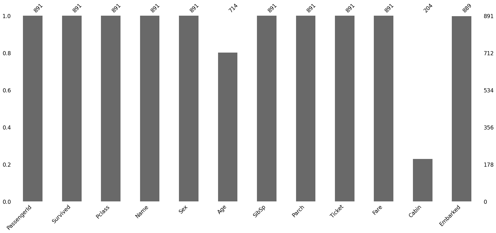
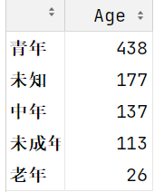

## 1、租房数据练习

### 1.1 数据加载与初步探索

加载数据后，使用以下方法了解数据基本情况：

```python
df.head()  # 查看前5行数据
df.info()  # 查看数据结构和数据类型
df.describe()  # 获取数值列的统计摘要
```

### 1.2 分组聚合操作

**基础分组计数**

```python
house_data.groupby('view_num', as_index=False)['district'].count()
```

**参数说明：**

- `as_index=False`：`as_index` 默认是True , 分组字段会作为分组结果的索引, 把它改成False之后, 分组字段作为普通列而非索引（等效于`groupby().reset_index()`）
- 计数注意事项：
  - 当数据无缺失值时，对任意列计数结果相同
  - 存在缺失值时需明确指定计数列


**多字段聚合**

```python
house_data.groupby('house_type').agg(
    {'view_num': 'sum',   # 浏览量求和
     'price': 'mean'}     # 价格求均值
)
```

**语法解析：**

- 使用字典格式 `{'字段': '聚合方法'}`
- 支持不同字段应用不同聚合方法
- 常用聚合函数：`sum`, `mean`, `count`, `max`, `min`


### 1.3 数据可视化

**中文显示配置**

pandas的`Plot()` 实际上调用的是**matplotlib**，matplotlib 中文显示问题解决方案：

```py
import matplotlib.pyplot as plt

# 解决中文显示问题
plt.rcParams['font.sans-serif'] = [
    'Noto Sans CJK JP', 
    'WenQuanYi Micro Hei', 
    'SimHei'
] 

# 解决负号显示问题
plt.rcParams['axes.unicode_minus'] = False
```

**条形图绘制**

```py
house_data.groupby('house_type')['district']      # 按户型分组
    .count()                                      # 计数
    .sort_values(ascending=False)                 # 降序排序
    .plot(kind='bar', figsize=(16, 8))            # 创建条形图
```

**plot参数详解：**

| 参数      | 说明     | 示例值                            |
| :-------- | :------- | :-------------------------------- |
| `kind`    | 图表类型 | `'bar'`(条形图), `'line'`(折线图) |
| `figsize` | 图像尺寸 | `(宽度, 高度)` 单位英寸           |


## 2、DataFrame数据组合

### 2.1 concat连接

**应用场景**

适用于**结构相同**的 DataFrame 连接：

- 列名一致 → 纵向堆叠（行增加）
- 行索引一致 → 横向拼接（列增加）


典型场景,  每个df 记录了一天的数据, 记录的列名都一致, 把n天的数据放到一起分析

```python
pd.concat(
    [df1, df2, df3],     # 需要连接的DataFrame列表
    ignore_index=False,  # 是否重建索引
    axis=0               # 连接方向
)
```

**参数说明**

| 参数           | 说明         | 默认值  | 注意事项                   |
| :------------- | :----------- | :------ | :------------------------- |
| `ignore_index` | 是否重建索引 | `False` | True 时创建 0-N 的新索引   |
| `axis`         | 连接方向     | `0`     | `0`=纵向(行), `1`=横向(列) |

> 上下连接, 如果列名不一致, 会多出列, 出现NaN；左右连接, 如果行索引不一致, 会多出行, 出现NaN

> **重要提示**：`df.append()` 方法已在新版 Pandas 中弃用，推荐统一使用 `concat()`


### 2.2 merge连接 (相当于SQL 的join)

**连接原理**：基于**键值列**匹配数据，类似 SQL JOIN 操作


```python
import sqlite3
# 创建和SQLlite数据库之间的连接  sqlite数据库,一个数据库对应一个文件 chinook.db
con = sqlite3.connect('data/chinook.db')
# tracks 记录了 不同的音乐/视频  对应的类型, 价格, 时长, 大小(多少字节), 艺术家, 专辑, 类型信息
tracks = pd.read_sql_query("select * from tracks",con)
# 音乐/视频作品的类型  摇滚/爵士/.....歌剧/喜剧
genres = pd.read_sql_query('select * from genres',con)
```


```python
tracks_subset = tracks.loc[[0,62,76,98,110,193,204,281,322,359]]
# Sql join  在pandas里用merge   how 连接方式  on 连接的字段
# how inner outer left right
genres.merge(tracks_subset,how='outer',on='GenreId')
```


**how 参数（连接类型）**

| 类型    | SQL 等效         | 说明                        |
| :------ | :--------------- | :-------------------------- |
| `inner` | INNER JOIN       | 仅保留左右两侧都有的key     |
| `left`  | LEFT OUTER JOIN  | 保留左侧表中的所有key       |
| `right` | RIGHT OUTER JOIN | 保留右侧表中的所有key       |
| `outer` | FULL OUTER JOIN  | 保留左右两侧侧表中的所有key |


**on参数（键值匹配方式）：**

```python
# 单键匹配（连接的字段, 如果左右两张表 连接的字段名字相同直接使用on）
df1.merge(df2, on='id')

# 多键匹配
df1.merge(df2, on=['country', 'city'])

# 异名列匹配(如果名字不同，left_on、right_on)
df1.merge(
    df2, 
    left_on='employee_id', 
    right_on='staff_id'
)

# 使用pd.merge()
result = pd.merge(
    left, 
    right, 
    left_on='key_left', 
    right_on='key_right', 
    how='inner'
)
```


**列名冲突处理**

连接之后, 两张表中如果有相同名字的字段, 默认会加上后缀 默认值\_x,\_y。可以通过_`suffixes=("_ x", "_ y")`参数来修改

```python
# 默认后缀处理
   id  value_x  value_y
0   1      100      200

# 自定义后缀
df1.merge(df2, on='id', suffixes=('_left', '_right'))
```


### 2.3 join连接（索引对齐-了解）

**核心特性**

- 默认基于**行索引**匹配
- 本质是 `merge()` 的简化版
- 适合索引对齐的快速合并


**场景1：索引对齐连接**

类似于concat，但是只能是左右连接, 不能上下连接 使用index(行索引) 对齐

```python
stock_2016 = pd.read_csv('data/stocks_2016.csv')
stock_2017 = pd.read_csv('data/stocks_2017.csv')
stock_2018 = pd.read_csv('data/stocks_2018.csv')
stock_2016.join(stock_2017,lsuffix='_2016',rsuffix='_2017',how='outer')
```

**参数解释：**

- stock_2016 直接 `join` stock_2017，两张表index相同的部分会连在一起
- 如果两张表有同名字段, 必须指定 lsuffix 左表后缀  rsuffix 右表后缀
- how 连接方式 inner outer left right 默认inner


**场景2：列与索引匹配**

df的一列跟右表的index(行索引) 的值进行关联

```python
stock_2016.join(stock_2018.set_index('Symbol'),lsuffix='_2016',rsuffix='_2018',on='Symbol')
```

- **核心逻辑**：左表 `stock_2016` 的 `Symbol` 列与右表 `stock_2018` 的行索引（由 `set_index('Symbol')` 生成）进行关联。
- **关键点**：`on='Symbol'` 指定左表的列，右表需提前将匹配字段设为索引。

这种用法可以用concat / merge 替换

- merge 把 stock_2018 和 stock_2016 要连接的列, 通过`reset_index` 都变成一列
- cancat 把 stock_2016 的 Symbel 通过`set_index` 也设置为Index


**核心区别对比**

| **特性**     | **`pd.concat()`**                      | **`pd.merge()`**                           | **`df.join()`**                 |
| :----------- | :------------------------------------- | :----------------------------------------- | :------------------------------ |
| **设计目标** | 沿轴（行或列）**堆叠数据**             | 基于**列值**关联（类似SQL JOIN）           | 基于**索引**关联（简化版merge） |
| **主要轴向** | 支持`axis=0`（纵向）和`axis=1`（横向） | 仅横向合并（列扩展）                       | 仅横向合并（列扩展）            |
| **键值匹配** | 不需要键值，直接拼接                   | 必须指定`on`（列名）或`left_on`/`right_on` | 基于索引（默认）或列名          |
| **索引处理** | 保留原始索引或生成新索引               | 默认生成新索引                             | 默认保留左索引                  |
| **适用场景** | 简单堆叠数据                           | 复杂键值关联                               | 索引对齐的快速合并              |


**适用场景总结**

| **场景**                           | **推荐方法**     | **原因**                         |
| :--------------------------------- | :--------------- | :------------------------------- |
| 合并多个同结构的表格（行或列堆叠） | `concat`         | 直接拼接，无需键值匹配           |
| 基于列值的复杂关联（如SQL JOIN）   | `merge`          | 灵活支持多种连接方式和多键合并   |
| 快速基于索引合并                   | `join`           | 语法简洁，适合索引对齐的简单场景 |
| 横向合并不同特征（相同索引）       | `concat(axis=1)` | 无需键值，直接扩展列             |
| 处理列名不一致的合并               | `concat`         | 自动填充`NaN`，保留所有列        |


## 3、缺失值处理

### 3.1 缺失值简介与判断方法

数据中出现缺失值是数据分析中的常见现象，主要来源包括：

- 数据合并操作（如两个表 JOIN）可能产生缺失
- 原始数据本身包含缺失值

在数据处理和模型训练前，通常需要先处理缺失值。**判断缺失值**的常用方法：

```python
# Pandas提供的缺失值检测方法
pd.isnull()  # 检查是否为缺失值
pd.isna()    # 功能同上
pd.notnull() # 检查是否非缺失值
pd.notna()   # 功能同上
```

⚠️ 特殊注意事项

NumPy中的缺失值 `np.nan`、`np.NAN`、`np.NaN` 具有特殊性质：

- **不能通过 `==` 运算符直接判断**，只能通过API来判断
- 缺失值之间互不相等

```python
import numpy as np

# 缺失值与其他值的比较
print(np.NAN == True)   # False
print(np.NAN == False)  # False
print(np.NAN == '')     # False
print(np.NAN == 0)      # False

# 缺失值之间的比较
print(np.NAN == np.NaN)  # False
print(np.NAN == np.nan)  # False
print(np.NaN == np.nan)  # False

# 正确检测方法
import pandas as pd
print(pd.isnull(np.NAN))  # True
print(pd.isnull(np.nan))  # True
print(pd.isnull(''))      # False

print(pd.notnull(np.NAN))  # False
print(pd.notnull(np.nan))  # False
print(pd.notnull(''))      # True
```


### 3.2 读取包含缺失值的数据

Pandas 提供灵活的缺失值处理选项：

```python
# 读取CSV时处理缺失值
df = pd.read_csv(
    'data/survey_visited1.csv',
    na_values=['?'],      # 指定额外缺失值标识符
    keep_default_na=False # 是否保留默认缺失值识别
)
```

参数说明：

- `na_values`：除空白值外，额外视为缺失值的符号（如 `?`），上面传入了`?`，说明数据中的`?`加载之后会用 NaN 来表示
- `keep_default_na`：是否将空白内容识别为缺失值（默认True）


### 3.3 缺失值处理技术

**缺失值检测**

```python
titanic = pd.read_csv('data/titanic_train.csv')
titanic.head()

# 统计各列缺失值数量
titanic.isnull().sum()
```


**缺失值可视化**

使用 `missingno` 库直观展示缺失情况：

```bash
pip install missingno
```

```python
import missingno as msno

# 缺失值条形图
msno.bar(titanic)
```



```python
# 绘制缺失值热力图, 发现缺失值之间是否有关联, 是不是A这一列确实, B这一列也会确实
msno.heatmap(titanic)
```


#### 3.3.1 **缺失值删除**

```python
titanic.dropna(
    subset=None,    # 指定检查缺失的列（默认所有列）
    how='any',      # 删除条件：'any'（有缺失即删）/ 'all'（全缺失才删）
    inplace=False,  # 是否修改原数据
    axis=0          # 操作轴向：0=行，1=列
)
```

**参数说明：**

**`subset`**

- 默认值：`None`（检查所有列，即有缺失值的行, 就会被删除）
- 功能：指定需要检查缺失值的列
- 示例：

```python
subset=['Age']  # 仅当'Age'列有缺失时删除该行
```


**`how`**：可选值

- `'any'`：行/列中**任一**缺失即删除（默认）
- `'all'`：行/列**全部**缺失才删除


**`inplace`**：通用参数，控制是否直接修改原数据

- `False`：返回新对象（默认）
- `True`：原地修改，不返回新对象


**`axis`**：通用参数，指定操作方向：

- `0` 或 `'index'`：按行删除（默认）
- `1` 或 `'columns'`：按列删除


#### 3.3.2 **缺失值填充**：

**🧾 非时序数据填充**

**方法**：直接使用 `fillna(值, inplace=True)`

**常用填充策略**：

- 统计量填充：众数、平均值、中位数等
- 也可以使用默认值来填充 

```python
# 示例：用年龄平均值填充缺失值
titanic1['Age'].fillna(titanic1['Age'].mean(), inplace=True)
```


**⏳ 时序数据填充**

**场景**：与时间相关的数值变化（如气温/天气情况/用电量等）

```python
# 加载时序数据并解析日期
# parse_dates 解析日期, 指定日期列 Date 加载的时候自动会把它处理成日期时间类型
city_day = pd.read_csv('data/city_day.csv', 
                      parse_dates=['Date'],  # 自动转换日期格式
                      index_col='Date')     # 设日期为索引

# 提取部分数据（索引50-64行）
city_day['Xylene'][50:64]
```

**填充方法**：

```python
city_day['Xylene'][50:64].fillna(method='ffill') # 使用缺失值前面的有效值来填充
city_day['Xylene'][50:64].fillna(method='bfill') # 使用缺失值后面的有效值来填充

# 线性插值,利用缺失值前面和后面两个有效值连线, 填充的缺失值从线上找
city_day['Xylene'][50:64].interpolate(limit_direction='both')
```


### 3.4 小结

缺失值处理的套路：

- 能不删就不删 , 如果某列数据, 除非有大量的缺失值(50% 以上是缺失值, 具体情况具体分析)
- 如果是类别型的, 可以考虑使用 '缺失' 来进行填充
- 如果是数值型 可以用一些统计量 (均值/中位数/众数) 或者业务的默认值来填充


## 4、Apply 自定义函数

**应用场景**：当 Pandas 内置 API 无法满足需求时，我们需要遍历 Series 中的每个数据点或 DataFrame 中的列/行数据执行相同的自定义处理逻辑，此时可以使用 Apply 自定义函数。

### 4.1 Series的apply方法

```python
import pandas as pd

# 创建示例 DataFrame
df = pd.DataFrame({
    'a': [10, 20, 30],
    'b': [20, 30, 40]
})
```

创建一个方法, 接收一个参数(一个值), 也可以接收多个参数(使用的时候, 第一个参数来自Series，后面的参数可以自己传递)

```python
# 单参数函数
def my_sq(x):
    """计算平方值"""
    return x ** 2

# 多参数函数
def my_sq2(x, e):
    """计算任意指数幂"""
    return x ** e
```

**series 调用apply**

```python
# 应用单参数函数
df['a_squared'] = df['a'].apply(my_sq)

# 应用多参数函数（传递额外参数）
df['a_cubed'] = df['a'].apply(my_sq2, e=3)
```

>**关键说明**：
>
>- `apply` 接收函数名而非函数调用（即 `my_sq` 而非 `my_sq()`）
>- `apply` 遍历 Series 中的每个值，将其传入自定义函数
>- 函数返回值会被整合为新的 Series


### 4.2 DataFrame的apply方法

**`df.apply(func, axis=)`**

- **axis=0**：按列操作（传入整列数据作为 Series）
- **axis=1**：按行操作（传入整行数据作为 Series）


### 4.3 实战案例：泰坦尼克数据集分析

#### **案例 1：年龄分段处理**

把titanic 的数据中, 年龄替换成年龄段

```python
def cut_age(age):
    if age<18:
        return '未成年'
    elif 18<=age<40:
        return '青年'
    elif 40<=age<60:
        return '中年'
    elif 60<=age<81:
        return '老年'
    else:
        return '未知'
```

```python
titanic['Age'].apply(cut_age).value_counts()
```



#### **案例 2：VIP 乘客识别**

创建一个字段 vip 

- Pclass  = 1
- 名字 Name 包含特殊称呼 Master , Dr, Sir

```python
# Pclass = 1 并且 Name中 包含了Master/Dr/Sir
def get_vip(x):
    if x['Pclass'] ==1 and ('Master' in x['Name'] or 'Dr' in x['Name'] or 'Sir' in x['Name'] ):
        return 'VIP'
    else:
        return 'Normal'
```

```python
titanic['vip'] = titanic.apply(get_vip,axis=1)
titanic['vip'].value_counts()
```


其他：pycharm链接sqlite数据库文件


