1. ## 今日重点


### 1、向量化函数/lambda表达式

```python
def avg_test(x,y):
    if x==20:
        return np.NaN
    else:
        return (x+y)/2
avg_test(df['a'],df['b'])
```

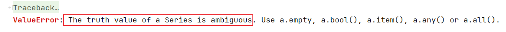

> 上面的方法调用之所以报错，就是因为 if 需要传入的是一个True/False , 但是我们传入的是一个True/False 组成的Series。此时if不能做出判断, 抛出了错误。想让上面的代码正常的执行, 我们需要把 Series里的每一个值遍历的传递给if做多次判断, 此时必须要自己写for循环, 可以通过 `np.vectorize(avg_test2)` 这种方式, 把这个方法变成一个向量化的方法(会遍历每一个值(分量)，多次调用这个方法)。
>

**`np.vectorize` 两种用法**

- **方法1：**

```python
import numpy as np
def avg_test(x,y):
    if x==20:
        return np.NaN
    else:
        return (x+y)/2
avg_vec = np.vectorize(avg_test)
```

- **方法2：**通过装饰器来调用的方式

```python
@np.vectorize
def avg_test(x,y):
    if x==20:
        return np.NaN
    else:
        return (x+y)/2
avg_test(df['a'],df['b'])
```


#### 拓展：**装饰器**

1.**什么是装饰器？**

装饰器是一种**高阶函数**，它接受一个函数作为参数，并返回一个新的函数。通过装饰器，我们可以在不修改原函数代码的前提下，动态地为其添加额外的功能。
简单来说，装饰器就是**函数的包装器**，它可以在函数执行前后添加一些操作。

2.装饰器的基本语法

在Python中，装饰器通常使用 `@` 符号来应用于函数或类。下面是一个简单的装饰器示例：

```python
def my_decorator(func):
    def wrapper():
        print("函数执行前的操作")
        func()
        print("函数执行后的操作")
    return wrapper

@my_decorator
def say_hello():
    print("Hello!")

say_hello()
```

**输出：**

```she
函数执行前的操作
Hello!
函数执行后的操作
```

在这个例子中：

- `my_decorator` 是一个装饰器，它接受一个函数 `func` 作为参数。
- `wrapper` 是一个内部函数，它在调用 `func` 前后添加了额外的打印操作。
- `@my_decorator` 将 `say_hello` 函数传递给装饰器，并将返回的 `wrapper` 函数重新赋值给 `say_hello`。
- 因此，当我们调用 `say_hello()` 时，实际执行的是 `wrapper()` 函数。


**lambda表达式**

使用`apply`的时候, 如果自定义处理逻辑比较简单, 一行代码就可以搞定, 可以使用`lambda`, 不用再`def` 一个起名字的函数, 使用`lambda` 创建一个匿名函数就可以了

```python
df.apply(lambda x:x.isnull().sum())
```


### 2、数据分组

#### 2.1 分组聚合

分组聚合函数语法：

```python
# 分组之后，对一个字段进行聚合
df.groupby('分组字段')['聚合字段'].count()

# 分组之后，对多个字段进行聚合
df.groupby('分组字段')[['聚合字段1','聚合字段2']].count()

# 不同字段按照不同方式进行聚合
df.groupby('year').agg({'lifeExp':'mean','pop':'median','gdpPercap':'max'})
```


分组之后想调用非**Pandas**的聚合函数, 需要使用**agg**|**aggregate** 方法, 聚合函数可以自定义：

```python
import numpy as np
df.groupby('continent')['lifeExp'].aggregate(np.mean)

# 自定义聚合函数
def my_mean_diff(s,global_mean):
    return s.mean() - global_mean

global_mean = df['lifeExp'].mean()
df.groupby('continent')['lifeExp'].agg(my_mean_diff,global_mean = global_mean)
```


#### 2.2 分组转换

- 数据准备工作

```python
# 加载小费数据集
tips = pd.read_csv('data/tips.csv')

#random_state 具体的取值没有啥意义, 但是把这个值固定下来, 多次运行采样的代码, 采样出来的数据是一样的
tips_10 = tips.sample(10,random_state=42) # sample采样 

import numpy as np

#np.random.permutation(tips_10.index) 将index随机打乱 随机找了4条数据 给tip复制为nan
tips_10.loc[np.random.permutation(tips_10.index)[:4],'tip'] = np.NAN 
```

- 编写自定义函数，用来填充缺失值

```python
def fillna_mean(x):
    # 计算每组的小费平均值 利用均值填充缺失值
    return x.fillna(x.mean())
```

- 分组转换，调用编写的自定义函数

```python
tips_10.groupby('sex')['tip'].transform(fillna_mean)
```

>不同性别填充的缺失值, 是各自性别的小费平均值。


在 pandas 中，**分组转换（ Group By  + Transform）** 是一种常用的操作，用于对分组后的数据应用函数，并返回与原数据相同形状的结果。（类似与`SQL`中的**窗口函数**）

- **基本用法**

`transform()` 方法会对每个分组应用一个函数，并将结果广播到原数据的每一行，保持形状一致。

```python
import pandas as pd

df = pd.DataFrame({
    'Group': ['A', 'A', 'B', 'B', 'B'],
    'Value': [10, 20, 30, 40, 50]
})

# 计算每组的均值，并返回与原数据相同长度的结果
df['GroupMean'] = df.groupby('Group')['Value'].transform('mean')
```

- **常见场景**

```python
# 场景 1：标准化（Z-Score）

# 按组标准化： (x - 组均值) / 组标准差
df['Z-Score'] = df.groupby('Group')['Value'].transform(
    lambda x: (x - x.mean()) / x.std()
)

# 场景 2：填充缺失值

# 用组中位数填充缺失值
df['Filled'] = df.groupby('Group')['Value'].transform(
    lambda x: x.fillna(x.median())
)

# 场景 3：排名

# 计算每组内的排名
df['Rank'] = df.groupby('Group')['Value'].transform('rank', ascending=False)
```

- 与 `apply` 的区别
  - `transform` 要求输出与输入**形状相同**，适合逐元素操作。
  - `apply` 更灵活，可以返回任意形状的结果（但需手动对齐）。

通过 `groupby.transform`，你可以高效实现按组计算并保持数据对齐的需求。


#### 2.3 分组转换练习

**任务：比较Bob 和 Amy 1-4月每月减重效果**


- **第一步：**加载减重数据

数据中包含了Bob和Amy 从1月到4月每周的体重数据(每个月4周, 一共32条数据)

```python
# 数据中包含了Bob和Amy 从1月到4月每周的体重数据(每个月4周, 一共32条数据)
weight_loss = pd.read_csv('data/weight_loss.csv')
```

- **第二步：**编写减重函数

我们要使用分组转换来计算Bob和Amy每个月的减重效果 (每个月每周的体重减去当月第一周的体重), 定义一个自定义函数

```python
# 计算减重的比例
def find_perc_loss(s):
    # s.iloc[0] 每个月的第一周, 体重
    return (s.iloc[0]-s)/s.iloc[0]
```

- **第三步：**分组转换，调用编写的减重函数

按姓名和月份分组转换，计算Bob和Amy每个月中每周的减重效果

```python
# 想清楚需要用什么数据代入减重函数，就能准确写好用什么字段groupby
weight_loss['减重比例'] = weight_loss.groupby(['Name','Month'])['Weight'].transform(find_perc_loss)
```

- **第四步：**比较减重效果

```python
# 提取第4周的数据用于比较， 看谁的减重效果更明显
week4_result = weight_loss.query('Week=="Week 4"')[['Name','Month','减重比例']]
week4_amy = week4_result[week4_result['Name']=='Amy']
week4_bob = week4_result.query("Name=='Bob'")

# 将月份设置为行索引, 方便两份数据进行计算
week4_bob[['Month','减重比例']].set_index('Month') - week4_amy[['Month','减重比例']].set_index('Month')
```

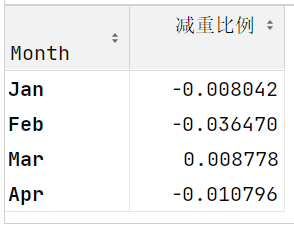

从数据中, 看出bob- Amy  三个月的数据是负值, 说明 amy 的减重比例高于bob,  amy 减重效果更好。


**query方法**

`query()`是**pandas**中一个非常实用的 **`DataFrame`** 方法，它允许你使用字符串表达式来筛选数据（如果条件中还有字符串, 需要用不同类型的引号进行区分），类似于SQL中的WHERE子句。

 ```python
 import pandas as pd
 
 df = pd.DataFrame({
     'A': range(1, 6),
     'B': range(10, 60, 10),
     'C': list('abcde')
 })
 
 # 使用query筛选
 result = df.query('A > 2')
 ```


**pandas中query方法与布尔索引的对比**

`query()`方法和布尔索引是**pandas**中两种常用的数据筛选方式，它们各有优缺点。下面从多个维度进行对比分析：

**1. 语法对比**

```python
# 布尔索引  需要全部用小括号包起来
df[(df['A'] > 2) & (df['B'] < 50) | (df['C'] == 'a')]

# query方法
df.query('A > 2 and B < 50 or C == "a"')
```

**对比**：

- query语法更简洁，更接近自然语言
- 布尔索引需要使用`&`、`|`等运算符，而query可以使用`and`、`or`
- 布尔索引需要重复写**`DataFrame`**名称，**`query`**不需要


**2.可读性对比**

简单条件：两者可读性相当

```python
# 布尔索引
df[df['A'] > 2]

# query
df.query('A > 2')
```

复杂条件：query明显更易读

```python
# 布尔索引
df[(df['A'] > 2) & (df['B'].isin([10, 30])) | (df['C'].str.startswith('a'))]

# query
df.query('A > 2 and B in [10, 30] or C.str.startswith("a")')
```

**3.列名处理**

```python
# 布尔索引 - 列名中有空格也能正常工作
df[df['column with space'] > 10]

# query - 需要反引号
df.query('`column with space` > 10')
```

布尔索引处理特殊列名更方便

```python
col = 'A'
# 布尔索引
df[df[col] > 2]

# query - 需要使用@语法
df.query(f'{col} > 2')  # 或者 df.query('@col > 2')
```

布尔索引处理动态列名更直接


#### 2.4 分组过滤

**groupby** 分组之后, 接 **filter** 方法, 传入一个返回 **True** / **False** 的方法, 当数据传入这个方法中,返回True的会被留下, 返回False的会被过滤掉。

```python
# 使用就餐人数进行分组, 过滤掉条目数少于5条的组
tips.groupby('size').filter(lambda x:x['size'].count()>5)
```


#### 2.5 DataFrameGroupby对象

DataFrameGroupBy对象是pandas中分组操作的核心，它由`groupby()`方法创建，提供了强大的数据分组和聚合功能。

```python
grouped = tips_10.groupby('sex')

# 返回了分组的情况 {'组中的取值':[取值对应的条目索引列表]}
grouped.groups  # {'Female': [198, 124, 101], 'Male': [24, 6, 153, 211, 176, 192, 9]}

# 可以获取每组中的数据 (DataFrame)
grouped.get_group('Female')
```

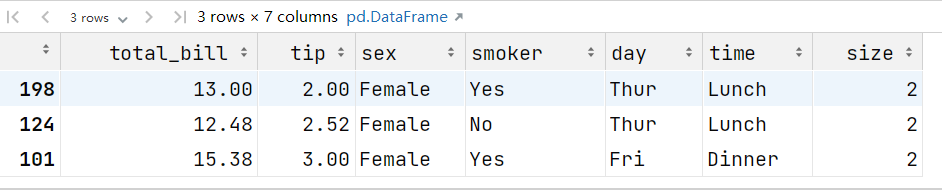

```python
# 可以遍历这个DataFrameGroupby对象，每个group 都是一个元组 (分组的值, 这一组对应数据的DataFrame)
for group in grouped:
    # print(group)
    print(type(group[1]))
```


**复合索引(MultiIndex)**

```python
# 多字段分组的时候, 返回的是复合索引
result = tips_10.groupby(['sex','time'])['size'].mean()
result.loc[('Female', 'Dinner')] # 获取复合索引后, 需要使用索引对应的元组才能获取到对应行的数据

# 将复合索引变成普通的索引
result.reset_index()
tips_10.groupby(['sex','time'],as_index = False)
```


### 3、会员分析和数据透视表

**任务：分析会员运营的基本情况**

- 从量的角度分析会员运营情况：
  - 整体会员运营情况（存量，增量）
  - 不同渠道（线上，线下）的会员运营情况
  - 线下业务，拆解到不同的地区、门店会员运营情况

- 从质的角度分析会员运营情况：
  - 会销比 会员消费占整体消费的占比
  - 连带率 是不是每次购买商品的时候, 都购买一件以上
  - 复购率 是不是买了之后, 又来买


**透视表：**

```python
df.pivot_table(index= , columns = , values= , aggfunc= )
```

- **index**：行索引，传入原始数据的列名， 这一列中每一个取值会作为透视表结果的一个行索引；

- **columns**：列索引，传入原始数据的列名,  这一列中每一个取值会作为透视表结果的一列；

- **values**: 要做聚合操作的列名；

- **aggfunc**：聚合函数；


**累计求和：**

```py
df['列名'].cumsum()
```


**strftime 时间类型格式化：**将注册年月转换成年月的形式展示

参数：

**年份表示：**

| 代码 | 说明     | 示例 |
| :--- | :------- | :--- |
| `%Y` | 四位年份 | 2023 |
| `%y` | 两位年份 | 23   |

**月份表示：**

| 代码 | 说明             | 示例     |
| :--- | :--------------- | :------- |
| `%m` | 数字月份（补零） | 01-12    |
| `%b` | 缩写的月份名称   | Jan, Feb |
| `%B` | 完整的月份名称   | January  |

**日期表示：**

| 代码 | 说明                 | 示例    |
| :--- | :------------------- | :------ |
| `%d` | 月份中的天数（补零） | 01-31   |
| `%j` | 年中的第几天（补零） | 001-366 |


#### 3.1 会员增量和存量分析

```python
import pandas as pd
customer_info = pd.read_excel('data/会员信息查询.xlsx')
customer_info.head()
customer_info.info()
```


-  **会员增量分析：**注册年月分组, 对会员卡号计数

```python
customer_info.loc[:,'注册年月'] = customer_info['注册时间'].apply(lambda x:x.strftime('%Y-%m'))

month_count = customer_info.groupby('注册年月')[['会员卡号']].count()
# DataFrame修改列名
month_count.columns = ['月增量']

# Series修改列名
mouth_count.name = '月增量'
```

绘制会员增量曲线

```python
import matplotlib.pyplot as plt
plt.rcParams['font.sans-serif'] = ['Noto Sans CJK JP', 'WenQuanYi Micro Hei', 'SimHei'] # 正常显示汉字
plt.rcParams['axes.unicode_minus'] = False # 正常显示负号
customer_info.groupby('注册年月')['会员卡号'].count()[1:].plot(figsize=(16,8))
```

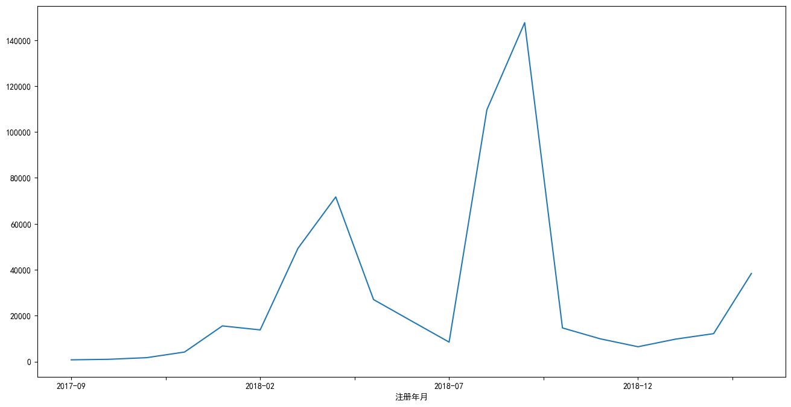


**通过透视表计算月增量**

```python
# index 在透视表结果中, 哪一列数据作为行索引  columns 在透视表结果中, 哪一列数据作为列名 values 对哪一个字段进行统计 aggfunc 聚合方式
customer_info.pivot_table(index='注册年月',values='会员卡号',aggfunc='count')
```


- **会员存量分析：**对月增量字段累计求和计算月存量

```python
month_count.loc[:,'会员存量']=month_count['月增量'].cumsum()
```


将月增量和月存量进行可视化

```python
month_count['月增量'].plot(figsize=(16,8),color = 'red',secondary_y = True)
month_count['会员存量'].plot(kind = 'bar',figsize=(16,8))
```

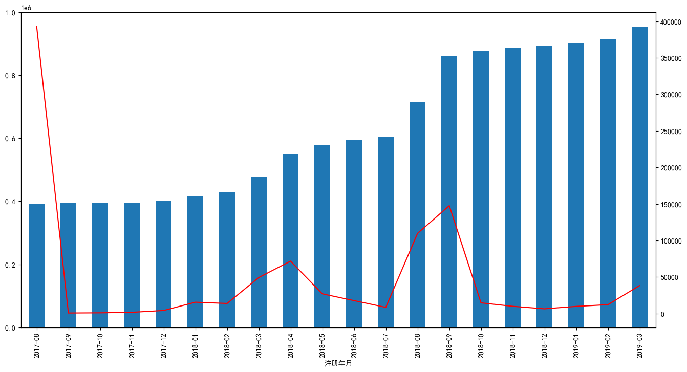


#### **3.2 统计月增量会员中的会员等级分布**

```python
# unstack()是pandas中一个用于重塑数据的重要方法，它可以将多级索引的行转换为列，实现数据的"旋转"或"透视"。
customer_info.groupby(['注册年月','会员等级'])['会员卡号'].count().unstack()
member_level = customer_info.pivot_table(index='注册年月',columns='会员等级',values='会员卡号',aggfunc='count')
member_level = member_level[1:]
```


可视化：

```python
import matplotlib.pyplot as plt

# plt.subplots 创建了一个绘图区域 fig 和坐标系 ax1
fig,ax1 = plt.subplots(figsize=(20,8))

# 通过ax1 创建了一个共享x轴的坐标系 ax2
ax2 = ax1.twinx() 

# grid=True 添加网格线  xlabel/ylabel x轴y轴 起名  legend 图例
member_level[['白银会员','黄金会员']].plot.bar(ax=ax1,grid=True,xlabel='年月',ylabel='白银黄金',legend= True)
member_level[['铂金会员','钻石会员']].plot(ax=ax2,color=['red','gray'],ylabel='铂金钻石',legend= True)

# 把ax2 坐标系 图例显示的地方调整到左上角
ax2.legend(loc='upper left')

plt.title('会员增量等级分布')
plt.show()
```

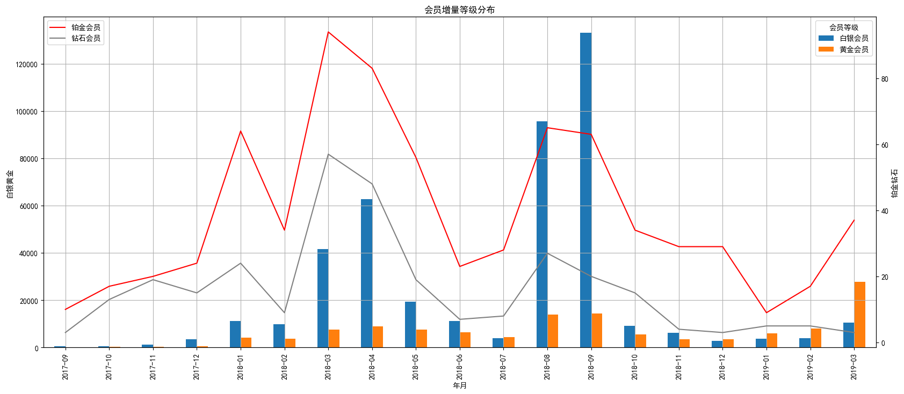

计算不同等级会员占比

```python
member_level.loc[:,'总计'] = member_level.sum(axis=1)
member_level.loc[:,'白银会员占比'] = member_level['白银会员']/member_level['总计']
member_level.loc[:,'黄金会员占比'] = member_level['黄金会员']/member_level['总计']
```


黄金白银会员占比可视化

```python
member_level[['白银会员占比','黄金会员占比']].plot(color=['r','g'],ylabel='占比',figsize=(16,8),grid=True)
```

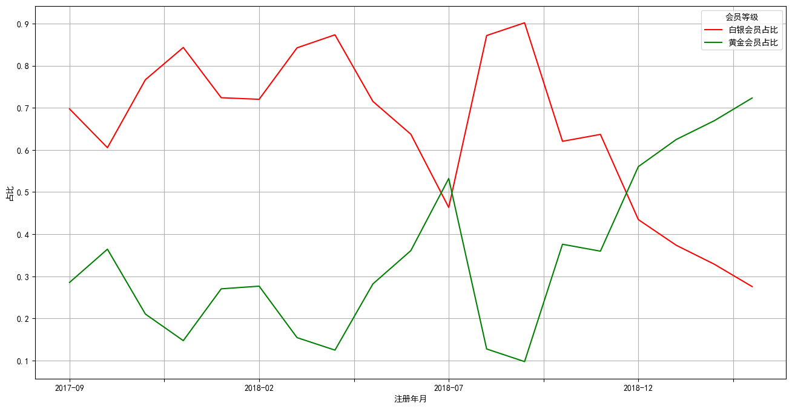

####  3.3 整体等级分布      

```python
ratio = customer_info.groupby('会员等级')[['会员卡号']].count()
customer_info.pivot_table(index='会员等级',values='会员卡号',aggfunc='count')
ratio.columns=['会员数']
ratio['占比'] = ratio['会员数']/ratio['会员数'].sum()
ratio
```

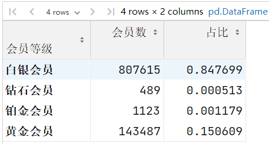

绘制饼图

```python
ratio.loc[['白银会员','铂金会员','黄金会员','钻石会员'],'占比'].plot.pie(figsize=(16,8),autopct='%.2f%%',fontsize=16)
```

>由于铂金会员/钻石会员占比较低, 绘图之前先调整在数据中的顺序, 让铂金会员和钻石会员在数据中不要挨着
>
>pie 绘制饼图
>
>autopct 控制显示饼图的占比数据图例   .2f% 表示保留两位有效数字
>
>fontsize = 16 控制字体大小

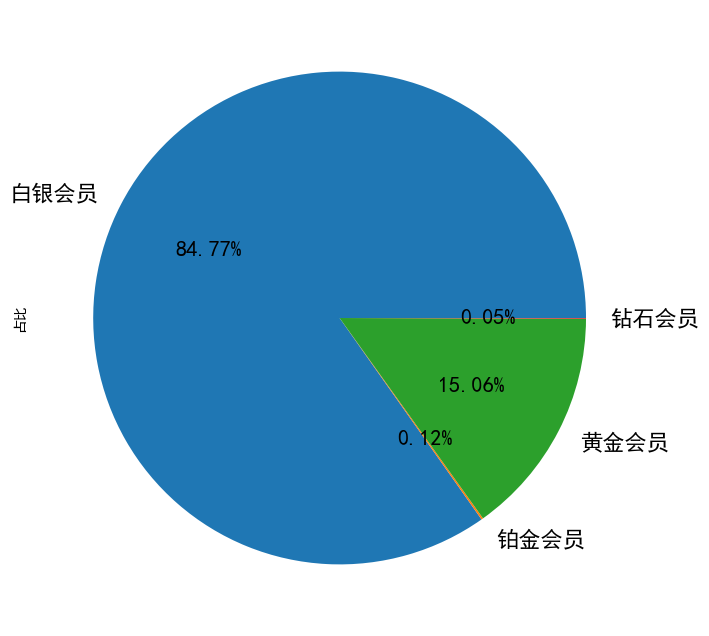

##### 线上线下会员增量分析      

```python
customer_info['会员来源'].value_counts()
```

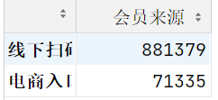

从数据中看出, 主要来线下扫码

- 计算每个月 线上线下的会员增量

```python
customer_info.groupby(['注册年月','会员来源'])['会员卡号'].count().unstack()
online_offline = customer_info.pivot_table(index='注册年月',columns='会员来源',values='会员卡号',aggfunc='count')
```

数据可视化

```python
online_offline[1:].plot(figsize=(16,8),grid=True)
plt.title('线上线下会员增量分析')
plt.show()
```

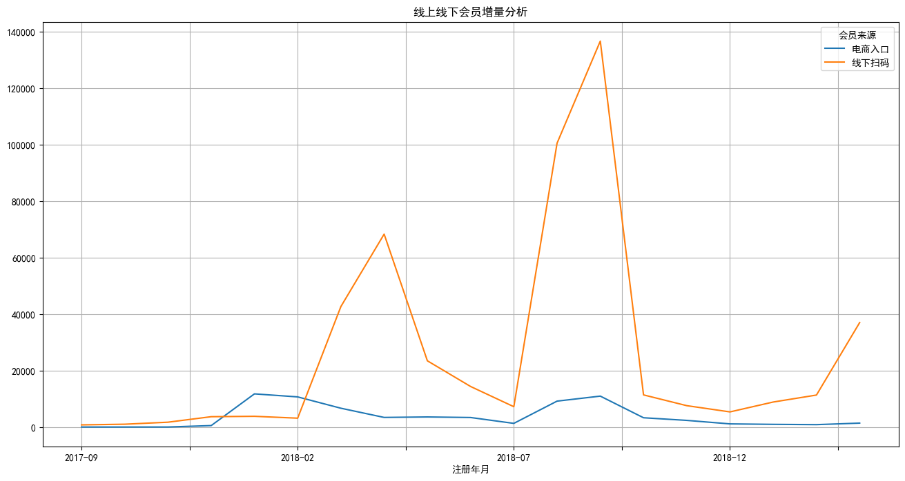

##### 按地区统计会员数量

```python
store_info = pd.read_excel('data/门店信息表.xlsx')
store_info.head()
```

将门店信息跟会员数据连接到一起

```python
customer_info1 = customer_info.merge(store_info[['店铺代码','地区编码']],left_on='所属店铺编码',right_on='店铺代码',how='left')
```

>会员信息作为左表
>
>left_on 所属门店编码 (customer_info1 表中字段)
>
>right_on='店铺代码' (store_info 表中字段)
>
>how='left' 左连接, 以用户信息表为主

```python
# 统计每个地区会员数量 去掉线上数据  GBL6D01线上电商数据
customer_info2 = customer_info1[customer_info1['地区编码']!='GBL6D01']
# 统计每个地区会员数量
district_count = customer_info2.groupby('地区编码')[['会员卡号']].count()
district_count.columns =['会员数量']
# 统计每个地区店铺数量
district_shop_count = customer_info2[['地区编码','所属店铺编码']].drop_duplicates().groupby('地区编码')['所属店铺编码'].count()
district_shop_count.name = '店铺数量'
# 将会员数量跟店铺数量数据连接起来
district = pd.concat([district_count,district_shop_count],axis=1)
```

>最后的连接使用join也可以
>
>district_count.join(district_shop_count)

计算店均会员数 和 总平均会员数

```python
district['地区店均会员数'] = round(district['会员数量'].div(district['店铺数量']))
district['总平均会员数'] = round(district['会员数量'].sum()/district['店铺数量'].sum())
district = district.sort_values(by='地区店均会员数',ascending=False)
```

可视化

```python
district['地区店均会员数'].plot.bar(figsize=(16,8),color='r',legend=True,grid=True)
district['总平均会员数'].plot(color='g',legend=True,grid=True)
plt.title('地区店均会员分析')
plt.show()
```

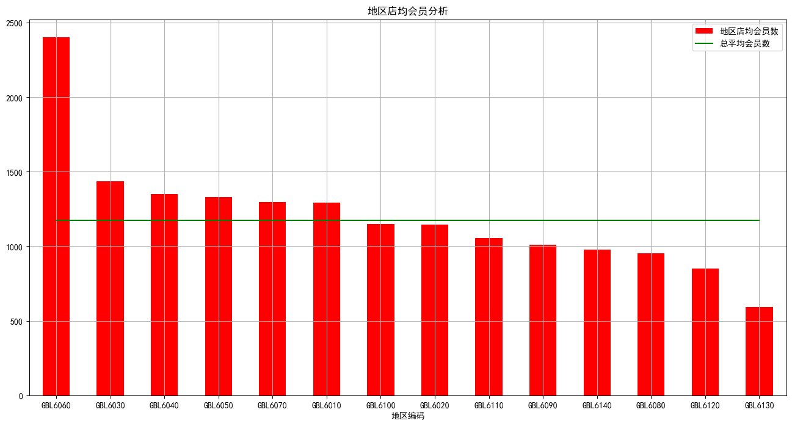

##### 各地区会销比

- 加载数据

```python
custom_consume=pd.read_excel('data/会员消费报表.xlsx')
all_orders=pd.read_excel('data/全国销售订单数量表.xlsx')
```

- 将订单日期字段转换为日期时间类型

```python
custom_consume['订单日期'] = pd.to_datetime(custom_consume['订单日期'])
```

- 从订单日期中提取年月数据, 并转换成数值类型方便与另一张表合并

```python
custom_consume['年月'] = custom_consume['订单日期'].apply(lambda x: x.strftime('%Y%m')).astype(int)
```

- 计算各地区会销比,先计算各地区的会员销量

```python
#将销售数据跟地区信息关联起来
member_orders = custom_consume.merge(store_info[['店铺代码','地区编码']],on='店铺代码',how='left')
# 去掉电商数据
member_orders =member_orders[member_orders['地区编码']!='GBL6D01']
# 创建数据透视表 计算每个月每个地区会员的订单数
area_sales= member_orders.pivot_table(index='地区编码',columns='年月',values='消费数量',aggfunc=sum,margins=True,margins_name='汇总')
area_sales
```

- 计算各地区每个月的总销量

```python
country_sales = all_orders.pivot_table(index='地区代码',columns='年月',values='全部订单数',aggfunc=sum,margins=True,margins_name='汇总')
country_sales
```

两张表相除得到会销比

```python
area_sales/country_sales
```


## 今日小结

数据分组

df.groupby().agg()

df.groupby().transform()

df.groupby().filter()

数据透视表

df.pivot_table(index= columns=  values=  aggfunc=,margins=True , margins_name)

cumsum() 累计求和

绘图

s.plot.bar() #条形图

s.plot.pie() # 饼图

- figsize = () 画布大小
- grid= True 网格线
- legend = True 显示图例
- color=['r','g']  # 控制颜色
- xlabel /ylabel  x.y轴标签


concat/merge 区别

