## 1、人工智能三大概念

### 1.1 知道人工智能（AI）

- 定义：

  - Artificial Intelligence（人工智能）

  - *"AI is the field that studies the synthesis and analysis of computational agents that act intelligently"*

    > 人工智能是研究智能行为计算代理的合成和分析的学科

  - *AI is to use computers to analog and instead of human brain*

- 核心解释：
  - 仿智系统：像人一样机器智能的综合与分析；
  - 双重特性：
    ✅ 像人一样理性思考（思维层面）
    ✅ 像人一样合理行动（行为层面）


### 1.2 知道机器学习（ML）

- 定义：

  - Machine Learning（机器学习）
  - *"Field of study that gives computers the ability to learn without being explicitly programmed"*
  - 让机器从数据中自动学习规律，而非依赖预设规则（不依赖特定规则编程）

- 关键对比：

  | **人类识别**                     | **机器学习识别**                 |
  | :------------------------------- | :------------------------------- |
  | 观察特征 → 归纳规律 → 预测新样本 | 分析数据 → 生成模型 → 预测新数据 |


> 人类识别车：根据车的特征归纳出车的规律；来了一个新的图片，判断预测是否是车；机器学习识别车: 从数据中获取规律；来了一个新的数据，产生一个新的预测


### 1.3 知道深度学习（DL）

- 定义：
  - Deep Learning（深度学习）
  - 通过多层神经网络模拟人脑结构，实现复杂模式识别
- 核心原理：
  - 仿生设计：分层神经元网络模拟万物关联
  - 能力特点：自动提取高阶抽象特征


### 1.4 三者关系


- 层级关系：
  - 机器学习是实现人工智能的核心路径
  - 深度学习是机器学习的高级方法
  
  > 基于统计学的传统机器学习方法；基于神经网络的深度学习方法


### 1.5 学习方式对比

#### 1.5.1 基于规则的学习（Rule-Based）

- **原理**：人工编写 `if-else` 决策树

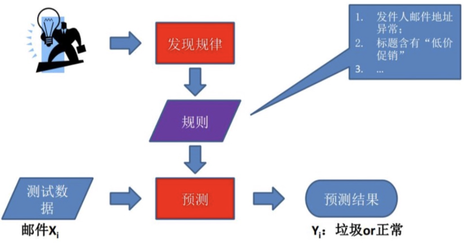


- **局限性**：
  - 难以处理复杂模式（如图像/语音识别）
  - 无法覆盖海量场景（如大象识别案例，有的是实物，有的是雕塑，有的是画，我们无法通过创建一套规则的方式让计算机准确识别下面每一头大象）

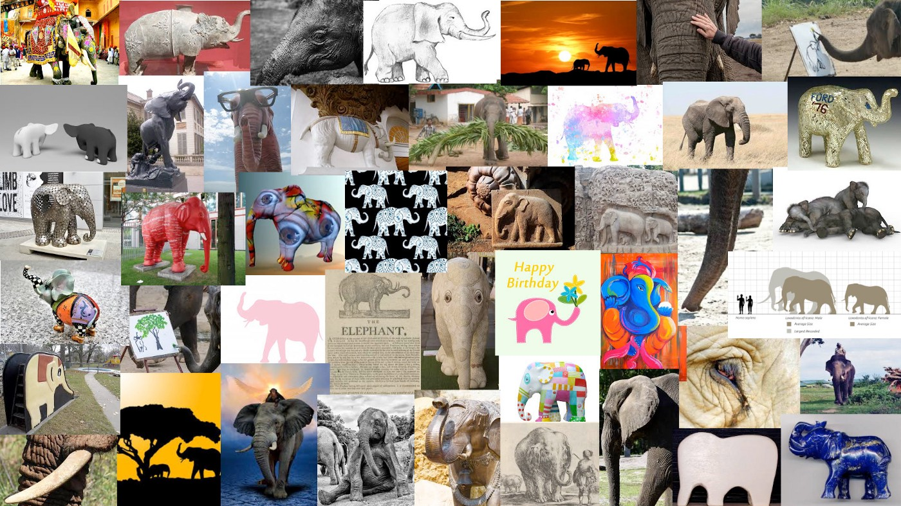

> 案例说明：大象的形态差异使规则难以穷举
>


#### 1.5.2 基于模型的学习（Model-Based）

- **突破点**：算法**自主从数据中学习规律**
- **关键流程**：

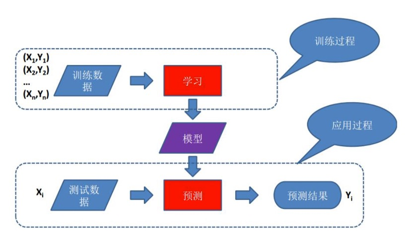


- **典型案例**：房价预测

  

  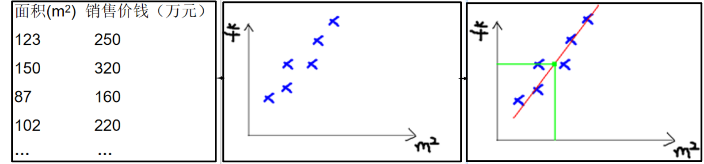

  - 模型：`y = ax + b`（线性关系），机器学习中a,b称为 参数 ，y=ax+b称为 模型 。通常a,b未知，是我们需要求解的量。
  - 参数：通过数据自动求解 `a`, `b`


## 2、人工智能应用领域和发展史

### 2.1 人工智能应用领域

人工智能技术已广泛应用于各行各业，以下是一些主要领域：

- 用户分析 (User Analytics):
  - 社交网络行为分析
  - 影评、商品评论情感分析
- 搜索引擎 (Search Engines):
  - 网页搜索
  - 图片搜索
  - 视频搜索
  - 新闻搜索
  - 学术搜索
  - 地图搜索
- 信息推荐 (Recommendation Systems):
  - 新闻推荐
  - 商品推荐 (电商)
  - 游戏推荐
  - 书籍推荐
- 计算机视觉 (Computer Vision - 图片识别):
  - 人像识别
  - 物品/用品识别
  - 动物识别
  - 交通工具识别
  - ... (人脸识别、自动驾驶、医学影像分析等)
- 自然语言处理 (Natural Language Processing - NLP):
  - 机器翻译
  - 摘要生成
  - 聊天机器人
  - 文本情感分析
- **生物信息学 (Bioinformatics):** 基因序列分析、蛋白质结构预测等。
- **多模态学习 (Multimodal Learning):** 结合文本、图像、音频等多种信息源进行分析。
- **增强现实/虚拟现实 (AR/VR):** 场景理解、物体追踪、交互体验优化。
- **... ... (其他领域):** 金融风控、智能制造、智慧农业、药物研发等。


### 2.2 人工智能/机器学习发展史


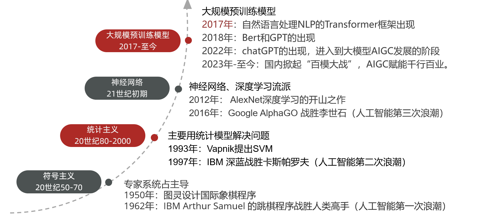


- **起源与奠基 (1950s):**
  - **1950年：** 艾伦·图灵 (Alan Turing) 提出著名的 **“图灵测试”** 概念，并设计国际象棋程序（理论构想）。
  - **1956年夏 (里程碑)：** 达特茅斯会议 (Dartmouth Workshop)。约翰·麦卡锡 (John McCarthy)、马文·明斯基 (Marvin Minsky)、克劳德·香农 (Claude Shannon) 等科学家首次正式提出 **“人工智能” (AI)** 术语。这标志着人工智能作为一门学科的诞生，**1956年被称为“人工智能元年”**。


- **⌛ 第一次浪潮：符号主义 (1950s - 1970s)**
  - **主导流派：符号主义 (Symbolicism)** - 基于逻辑推理和知识表示。
  - **关键技术：专家系统 (Expert Systems)** - 将人类专家的知识规则化。
  - **标志性事件 (1962)：** IBM 的亚瑟·塞缪尔 (Arthur Samuel) 开发的 **跳棋程序** 战胜了人类州冠军（人工智能在特定任务上首次超越人类高手）。


- **低谷与转向 (1970s - 1980s):** “AI寒冬” - 早期期望过高，遇到技术瓶颈和计算能力限制，资金投入减少。


- **⌛ 第二次浪潮：统计学习兴起 (1980s - 2000s)**
  - **主导流派：统计主义 (Connectionism 早期 / 统计学习)** - 利用数据和概率统计模型。
  - **关键技术：** 支持向量机 (SVM)、贝叶斯网络等。
  - **重要突破 (1993)：** 弗拉基米尔·万普尼克 (Vladimir Vapnik) 提出 **支持向量机 (SVM)** 理论。
  - **标志性事件 (1997)：** IBM **“深蓝” (Deep Blue)** 计算机击败国际象棋世界冠军加里·卡斯帕罗夫 (Garry Kasparov)。


- **⌛ 第三次浪潮：深度学习爆发 (2010s - 2017)**
  - **主导技术：深度学习 (Deep Learning)** - 基于多层（深度）神经网络。
  - **关键突破 (2012)：** Alex Krizhevsky 等提出的 **AlexNet** 模型在 ImageNet 图像识别竞赛中以巨大优势夺冠，**点燃了深度学习革命**。
  - **标志性事件 (2016)：** Google DeepMind 的 **AlphaGo** 击败世界围棋冠军李世石。展示了深度学习在复杂决策问题上的强大能力。


- **大规模预训练模型时代 (2017 - 至今)**
  - **核心技术：** Transformer 架构、大语言模型 (LLMs)、生成式 AI (AIGC)。
  - **关键突破 (2017)：** Google 提出 **Transformer** 模型架构，成为 NLP 领域的基石。
  - **重要里程碑 (2018)：** Google 发布 **BERT**，OpenAI 发布初代 **GPT**，大模型能力显著提升。
  - **现象级应用 (2022)：** OpenAI 发布 **ChatGPT**，引发全球关注，标志着 **AIGC (生成式人工智能)** 进入大众视野和应用爆发期。
  - 当前态势 (2023 - 至今)：
    - 中国国内掀起 **“百模大战”**，各大科技公司纷纷推出自研大模型。
    - **AIGC 技术 (文本、图像、音频、视频生成)** 正在**赋能千行百业**，深刻改变生产力和创造力。


### 2.3 机器学习发展三要素 

数据、算法、算力三要素相互作用，是AI发展的基石

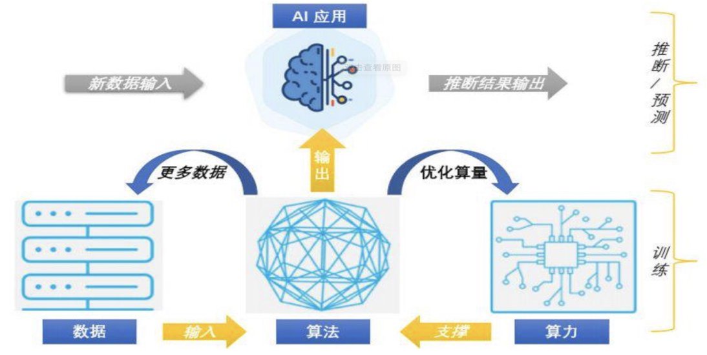


1. **数据 (Data):**
   - 海量、高质量的数据是训练和优化模型的“燃料”。
   - 数据规模、多样性、标注质量直接影响模型性能。
2. **算法 (Algorithm):**
   - 创新的模型架构（如深度学习网络、Transformer）和学习方法是智能的“引擎”。
   - 算法的效率、鲁棒性、可解释性至关重要。
3. **算力 (Computing Power):**
   - 强大的计算硬件是处理海量数据和复杂算法的“基石”。
   - **CPU :** 通用处理器，擅长逻辑控制和任务调度，适合 **I/O密集型** 任务。
   - **GPU :** 图形处理器，拥有大量核心，高度并行，极其适合 **计算密集型** 任务（尤其是大规模的矩阵运算，即深度学习训练的核心）。
   - **TPU :** Google 专门为 **神经网络训练** 设计的处理器 (Tensor 指张量，神经网络计算的基本单位)，在特定AI任务上效率更高。

> **三者关系：** 更多、更好的数据驱动更复杂、更强大的算法设计，而更强大的算法需要更先进的算力来支撑其训练和部署；反过来，算力的提升使得处理更大规模数据和运行更复杂算法成为可能，从而产生更好的模型和应用。三者相互促进，共同构成了AI发展的基石。


## 3、常见术语

### 3.1 **样本 (Sample)**

- **定义**：一行数据代表一个样本（也称“记录”）。
- **作用**：多个样本组成数据集，用于训练或测试模型。
- **示例**：

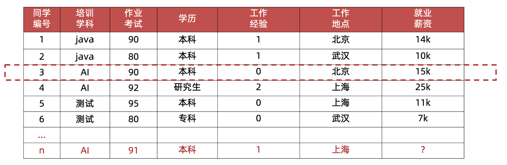


### 3.2 **特征 (Feature)**

- **定义**：一列数据代表一个特征（也称“属性”）。
- **作用**：从数据中抽取的、对预测结果有用的信息。
- **示例：**
  - 房价预测：房屋面积、楼层、地理位置等。
  - 图像识别：图片像素值、颜色分布等。
  - **就业薪资场景**：`培训学科`、`作业考试`、`学历`、`工作经验`、`工作地点`（共5个特征）。

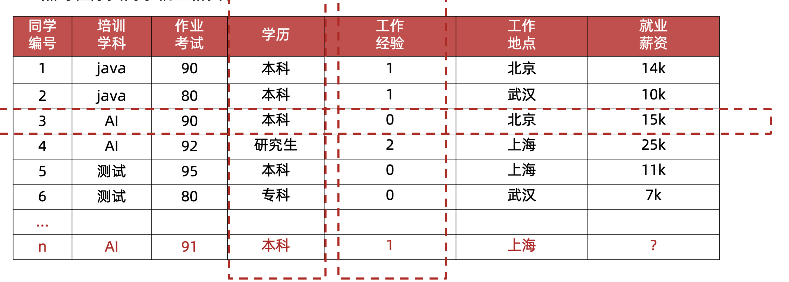


### 3.3 **标签/目标值 (Label/Target)**

- **定义**：模型需要预测的那一列数据。
- **示例：**
  - 就业薪资预测中的 `就业薪资` 列。
  - 房价预测中的 `房价`。

 

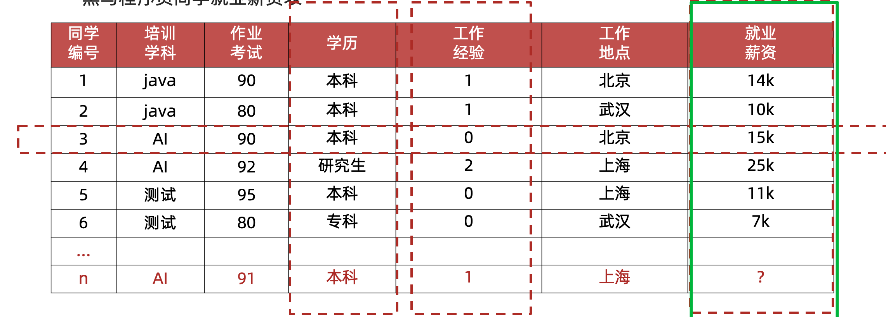


### 3.4 **数据集划分**

#### 1. **训练集 (Training Set)**

- **作用**：用于训练模型，学习特征与标签之间的关系。
- **占比**：通常占数据集的 **70%~80%**（如 7:3 或 8:2）。

#### 2. **测试集 (Testing Set)**

- **作用**：评估模型在未知数据上的泛化能力（不参与训练）。
- **占比**：通常占数据集的 **20%~30%**。

> **划分意义**
>
> - 避免模型过拟合训练数据，确保其能处理新数据。
> - 比例需根据数据规模调整（大数据集可降低测试集比例）。


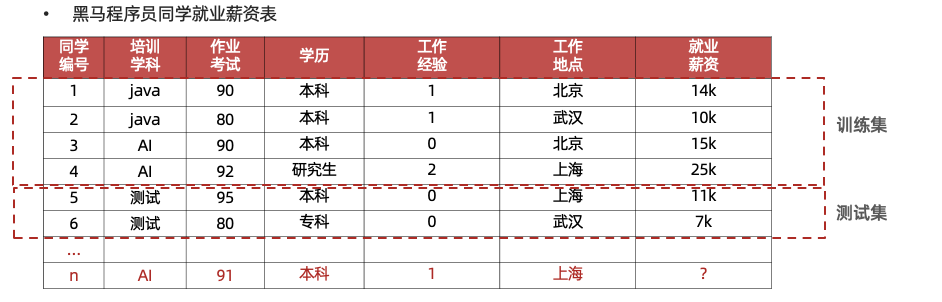


### **3.5 核心总结**

1. **数据组成**：`特征` + `标签` → 构成 `样本` → 组成 `数据集`。
2. **特征本质**：影响预测结果的变量（如学历、工作经验决定薪资）。
3. 划分逻辑：
   - **训练集** = 课本（学习知识）
   - **测试集** = 期末考试（检验学习效果）


## 4、算法分类

### **4.1 有监督学习**

- **定义**：输入数据包含特征值 + 目标值（标签），训练数据有明确标注。

- **数据集特点**：需人工标注标签。

- **核心任务：**

  - 分类任务

    - 目标值离散（不连续）

    - 类型：二分类（如猫/狗）、多分类（如手写数字识别）

      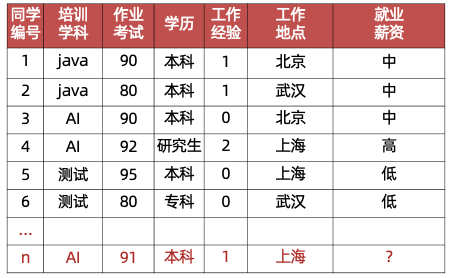

  - 回归任务

    - 目标值连续（如房价预测）

    - 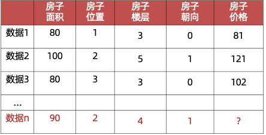


### **4.2 无监督学习**

- **定义**：输入数据无标签，通过样本相似性聚类，发现数据内在结构。
- **数据集特点**：无需人工标注。
- **核心特点：**
  - 训练数据无标签
  - 基于相似性聚类（如客户分群）
    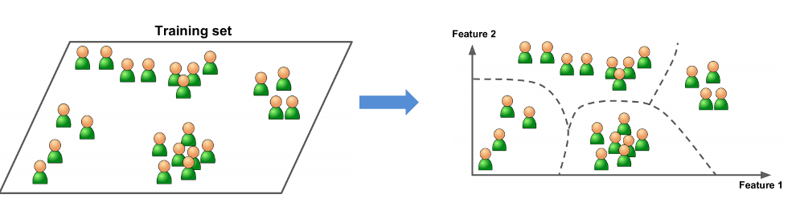


### **4.3 半监督学习**

- **工作原理：**
  1. 标注少量数据 → 训练初始模型
  2. 模型预测未标注数据
  3. 专家对比结果并修正模型 → 提升准确性
- **核心价值**：大幅降低数据标注成本
  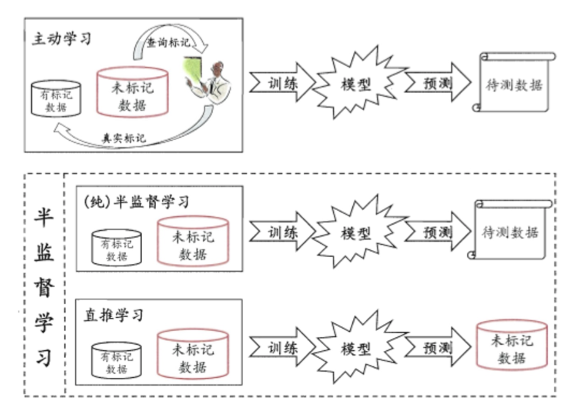


### **4.4 强化学习**

- **应用场景**：游戏AI（AlphaGo）、自动驾驶、智能决策。
- **四要素：**
  - **Agent**（智能体）
  - **环境状态**
  - **行动**
  - **奖励机制**
- **原理**：Agent根据环境状态进行行动获取奖励，学习最大化累计奖励的策略。
- 示例（小孩学走路，小孩就是 agent）：
  - 行动：尝试行走 → 状态：步伐变化
  - 奖励：成功几步 → 给巧克力；失败 → 无奖励
    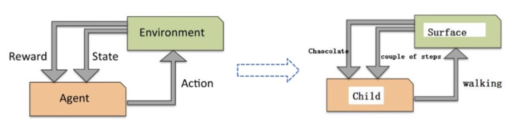


### 4.5 总结

**四大类型对比表**

| **类型**   | **数据标签要求**    | **核心任务**   | 核心特点                  | **典型场景**           |
| :--------- | :------------------ | :------------- | ------------------------- | :--------------------- |
| 有监督学习 | 需全部标注          | 分类、回归     | 预测结果                  | 猫狗分类、房价预测     |
| 无监督学习 | 无需标注            | 聚类、降维     | 通过样本相似性发现结构    | 用户分群               |
| 半监督学习 | 少量标注+大量未标注 | 混合优化       | 降低标注成本              | 医学图像分析、文本分类 |
| 强化学习   | 无静态标签          | 长期利益最大化 | Agent通过奖励学习最优策略 | 游戏AI、自动驾驶       |


## 5、机器学习的建模流程


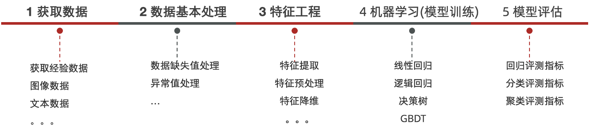


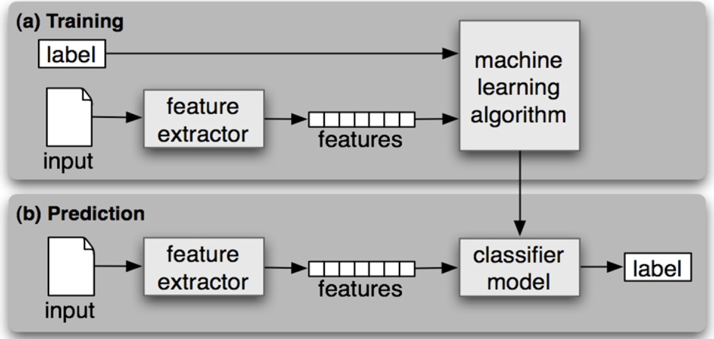


## 6、特征工程

### 6.1 特征工程核心概念

- **定义**：运用专业知识和技巧处理数据，使机器学习算法达到最优效果的过程
- **重要性**：
  - 数据和特征决定模型性能上限，而模型和算法只是逼近这个上限而已。
  - 耗时且需专业知识，是应用机器学习的核心
- **关键理解**：
  - 数据视角：每列数据即为特征
  - 模型视角：对预测结果有贡献的属性才是有效特征

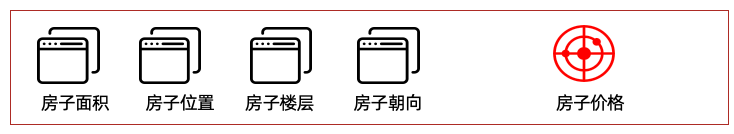

*“**Coming up with features is difficult, time-consuming, requires expert knowledge. “Applied machine learning” is basically feature engineering.** ”*

> 释义：特征工程是困难、耗时、需要专业知识。应用机器学习基础就是特征工程    


### 6.2 特征处理五大技术

#### 1. 特征提取（Feature Extraction）

- **核心任务**：将非结构化数据转换为结构化特征向量
- **应用场景**：
  - 文本数据 → 词频向量
  - 图像数据 → 像素特征矩阵
- **关键点**：完成转换后，每列代表一个特征维度
- **处理流程**：
  原始数据 → 特征提取 → 特征向量（行列形式）

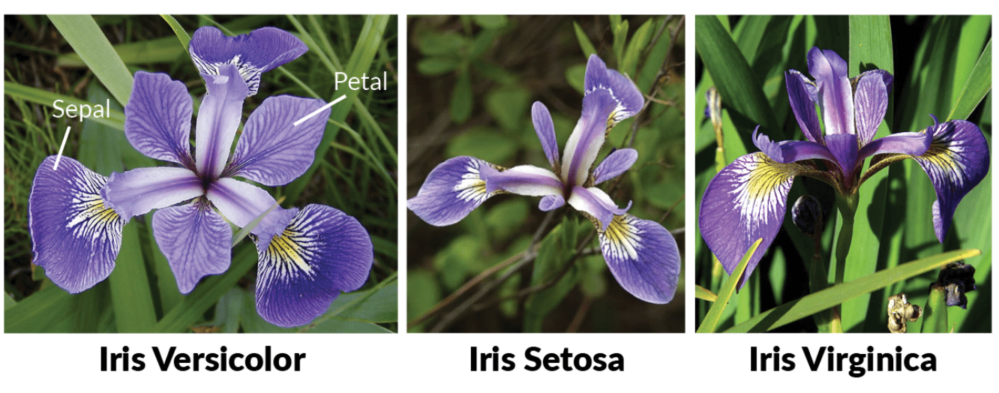


#### 2. 特征预处理（Feature Preprocessing）

- **核心任务**：消除特征间的量纲差异
- **必要性**：不同量纲特征对模型影响不均衡
- **主要方法**：
  - 归一化（Min-Max Scaling）
  - 标准化（Z-Score Normalization）
- **目标**：使所有特征在相同数值范围内发挥作用

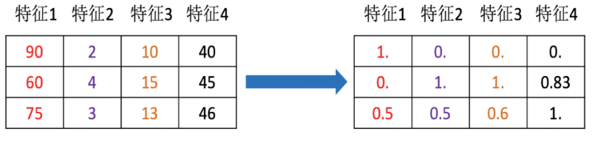


#### 3. 特征降维（Dimensionality Reduction）

- **核心任务**：减少特征维度，保留主要信息
- **技术特点**：
  - 会损失部分信息
  - 新特征可能失去原始含义
- **典型算法**：
  - PCA（主成分分析）
  - t-SNE（流形学习）
- **适用场景**：高维数据可视化与去噪

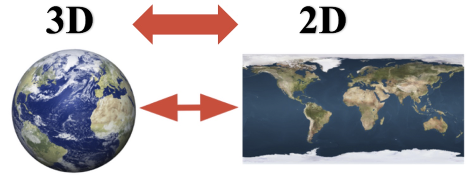


#### 4. 特征选择（Feature Selection）

- **核心任务**：筛选对任务最相关的特征子集
- **技术特点**：
  - 不改变原始特征值
  - 基于统计指标选择特征
- **选择依据**：
  - 特征重要性评分
  - 与目标变量的相关性
- **优势**：提升模型效率，降低过拟合风险

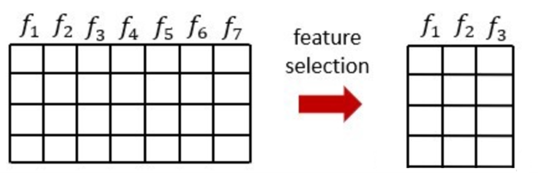


#### 5. 特征组合（Feature Combination）

- **核心任务**：通过运算创建新特征
- **组合方式**：
  - 加法组合：特征A + 特征B
  - 乘法组合：特征A × 特征B
  - 多项式组合：特征A²
- **典型应用**：
  - 组合长度和宽度生成面积特征
  - 时间特征组合（年+月→年月标识）

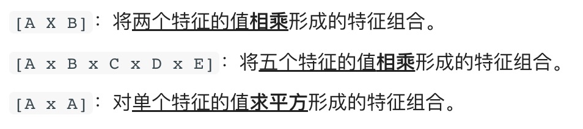


### 6.3 技术对比与应用场景

| **技术**   | **核心功能**        | **是否改变数据** | **典型应用场景**  |
| :--------- | :------------------ | :--------------- | :---------------- |
| 特征提取   | 非结构化→结构化转换 | 是               | 文本/图像数据处理 |
| 特征预处理 | 消除量纲差异        | 是               | 多源数据融合      |
| 特征降维   | 压缩维度保留主信息  | 是               | 高维数据可视化    |
| 特征选择   | 筛选相关特征子集    | 否               | 提升模型效率      |
| 特征组合   | 通过运算生成新特征  | 是               | 增强特征表达能力  |


## 7、模型拟合问题

### **7.1 拟合的本质**

- **定义**：模型对训练数据的**拟合程度**，反映模型对样本规律的捕捉能力
- **评估依据**：训练集与测试集的预测表现对比
- **核心目标**：在**模型复杂度**与**数据规律**间找到平衡点

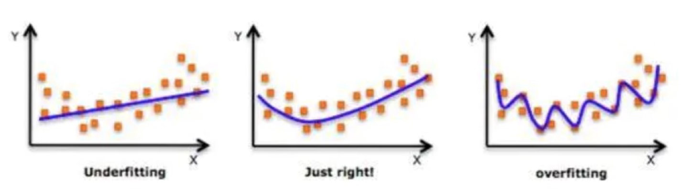

> *图示说明：理想拟合（中）在训练/测试集表现均衡；欠拟合（左）无法捕捉规律；过拟合（右）过度适应噪声*


### **7.2 欠拟合（Underfitting）**

| **维度**     | **说明**                                            |
| :----------- | :-------------------------------------------------- |
| **表现**     | ▶ 训练集表现差 ▶ 测试集表现差                       |
| **根本原因** | 模型过于简单，无法捕捉数据内在规律                  |
| **典型场景** | 线性模型拟合非线性数据（如用直线拟合正弦曲线）      |
| **解决方案** | ▶ 增加模型复杂度（如添加多项式特征） ▶ 延长训练时间 |


### **7.3 过拟合（Overfitting）**

| **维度**     | **说明**                                                     |
| :----------- | :----------------------------------------------------------- |
| **表现**     | ▶ 训练集表现极好 ▶ 测试集表现显著下降                        |
| **根本原因** | ▶ 模型过度复杂（过度匹配噪声） ▶ 训练数据量不足 ▶ 数据噪声大（不纯净） |
| **典型场景** | 深度神经网络在小数据集训练后泛化能力差                       |
| **解决方案** | ▶ 增加训练数据量（数据增强） ▶ 降低模型复杂度                |


### **7.4 泛化能力（Generalization）**

- **定义**：模型在**未见过的数据**上的预测能力

- **评估标准**：测试集或验证集的表现

- **核心原则**：

  - **奥卡姆剃刀定律**：相同泛化能力下，优先选择更简单的模型

  > *"如无必要，勿增实体" —— 避免不必要的复杂度引入噪声风险*

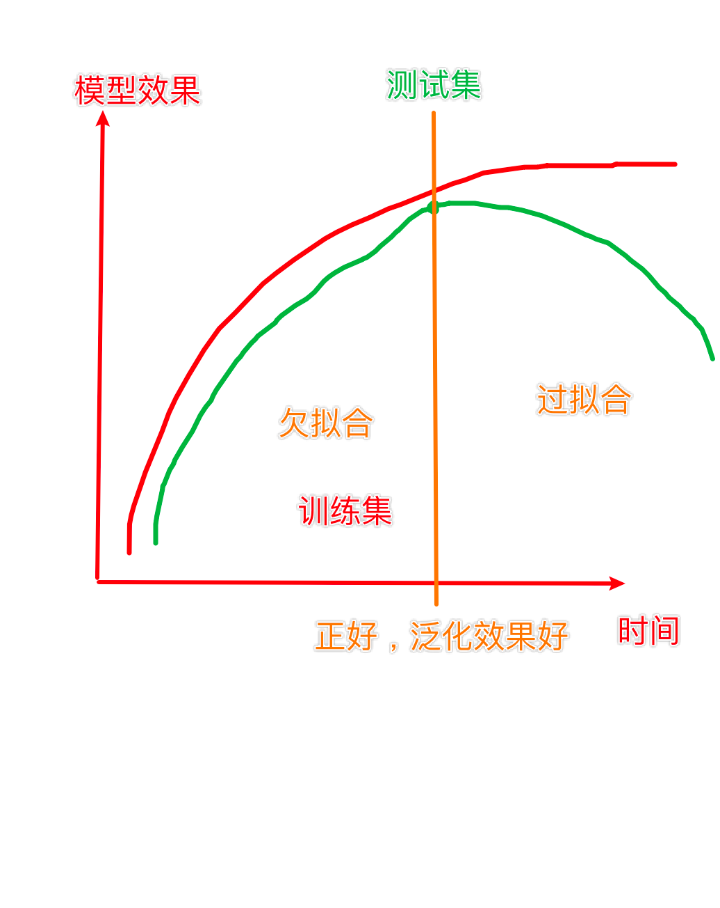

**关键问题对比表**

| **问题类型** | **训练集表现** | **测试集表现** | **模型状态**       | **解决方向**           |
| :----------- | :------------- | :------------- | :----------------- | :--------------------- |
| **欠拟合**   | 差             | 差             | 过于简单           | 增加复杂度/特征工程    |
| **理想拟合** | 良好           | 良好           | 复杂度匹配数据规律 | 保持当前策略           |
| **过拟合**   | 极佳           | 差             | 过于复杂           | 简化模型/正则化/扩数据 |


## 8、机器学习开发环境

基于Python的 scikit-learn 库：

- 简单高效的数据挖掘和数据分析工具
- 可供大家使用，可在各种环境中重复使用
- 建立在NumPy，SciPy和matplotlib上
- 开源，可商业使用-获取BSD许可证

```python
pip install scikit-learn
```


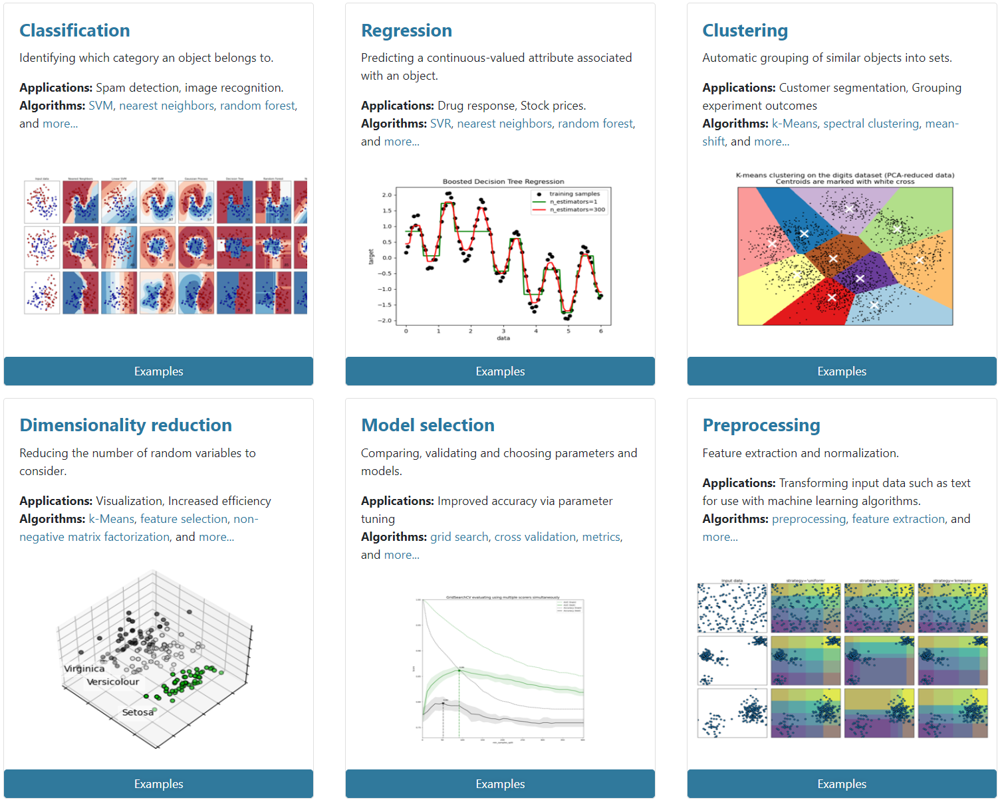
<br />
<br />
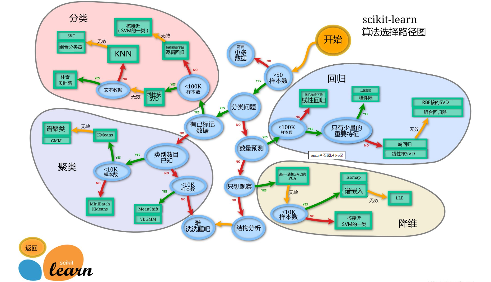
