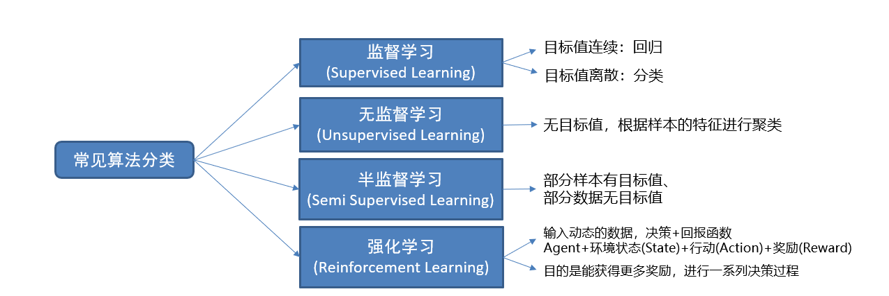
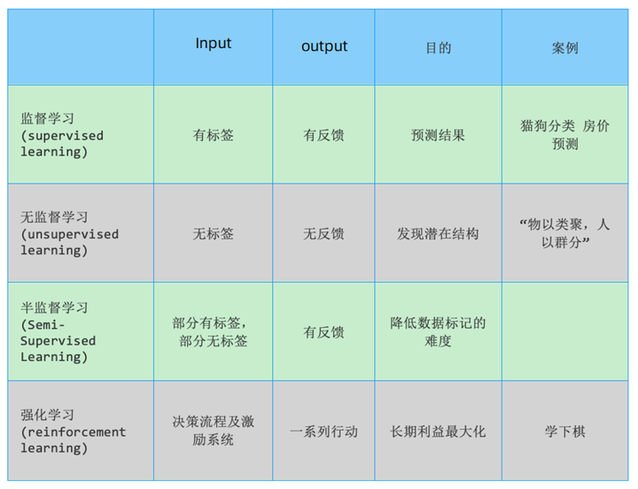

## 1、人工智能三大概念

### 1.1 知道人工智能（AI）

- 定义：

  - Artificial Intelligence（人工智能）

  - *"AI is the field that studies the synthesis and analysis of computational agents that act intelligently"*

    > 人工智能是研究智能行为计算代理的合成和分析的学科

  - *AI is to use computers to analog and instead of human brain*

- 核心解释：
  - 仿智系统：像人一样机器智能的综合与分析；
  - 双重特性：
    ✅ 像人一样理性思考（思维层面）
    ✅ 像人一样合理行动（行为层面）


### 1.2 知道机器学习（ML）

- 定义：

  - Machine Learning（机器学习）
  - *"Field of study that gives computers the ability to learn without being explicitly programmed"*
  - 让机器从数据中自动学习规律，而非依赖预设规则（不依赖特定规则编程）

- 关键对比：

  | **人类识别**                     | **机器学习识别**                 |
  | :------------------------------- | :------------------------------- |
  | 观察特征 → 归纳规律 → 预测新样本 | 分析数据 → 生成模型 → 预测新数据 |


> 人类识别车：根据车的特征归纳出车的规律；来了一个新的图片，判断预测是否是车；机器学习识别车: 从数据中获取规律；来了一个新的数据，产生一个新的预测


### 1.3 知道深度学习（DL）

- 定义：
  - Deep Learning（深度学习）
  - 通过多层神经网络模拟人脑结构，实现复杂模式识别
- 核心原理：
  - 仿生设计：分层神经元网络模拟万物关联
  - 能力特点：自动提取高阶抽象特征


### 1.4 三者关系


- 层级关系：
  - 机器学习是实现人工智能的核心路径
  - 深度学习是机器学习的高级方法


### 1.5 学习方式对比

#### 1.5.1 基于规则的学习（Rule-Based）

- **原理**：人工编写 `if-else` 决策树


- **局限性**：
  - 难以处理复杂模式（如图像/语音识别）
  - 无法覆盖海量场景（如大象识别案例，有的是实物，有的是雕塑，有的是画，我们无法通过创建一套规则的方式让计算机准确识别下面每一头大象）


> 案例说明：大象的形态差异使规则难以穷举
>


#### 1.5.2 基于模型的学习（Model-Based）

- **突破点**：算法**自主从数据中学习规律**
- **关键流程**：


- **典型案例**：房价预测

  

  

  - 模型：`y = ax + b`（线性关系），机器学习中a,b称为 参数 ，y=ax+b称为 模型 。通常a,b未知，是我们需要求解的量。
  - 参数：通过数据自动求解 `a`, `b`


## 2、人工智能应用领域和发展史

### 2.1 人工智能应用领域

人工智能技术已广泛应用于各行各业，以下是一些主要领域：

- 用户分析 (User Analytics):
  - 社交网络行为分析
  - 影评、商品评论情感分析
- 搜索引擎 (Search Engines):
  - 网页搜索
  - 图片搜索
  - 视频搜索
  - 新闻搜索
  - 学术搜索
  - 地图搜索
- 信息推荐 (Recommendation Systems):
  - 新闻推荐
  - 商品推荐 (电商)
  - 游戏推荐
  - 书籍推荐
- 计算机视觉 (Computer Vision - 图片识别):
  - 人像识别
  - 物品/用品识别
  - 动物识别
  - 交通工具识别
  - ... (人脸识别、自动驾驶、医学影像分析等)
- 自然语言处理 (Natural Language Processing - NLP):
  - 机器翻译
  - 摘要生成
  - 聊天机器人
  - 文本情感分析
- **生物信息学 (Bioinformatics):** 基因序列分析、蛋白质结构预测等。
- **多模态学习 (Multimodal Learning):** 结合文本、图像、音频等多种信息源进行分析。
- **增强现实/虚拟现实 (AR/VR):** 场景理解、物体追踪、交互体验优化。
- **... ... (其他领域):** 金融风控、智能制造、智慧农业、药物研发等。


### 2.2 人工智能/机器学习发展史


- **起源与奠基 (1950s):**
  - **1950年：** 艾伦·图灵 (Alan Turing) 提出著名的 **“图灵测试”** 概念，并设计国际象棋程序（理论构想）。
  - **1956年夏 (里程碑)：** 达特茅斯会议 (Dartmouth Workshop)。约翰·麦卡锡 (John McCarthy)、马文·明斯基 (Marvin Minsky)、克劳德·香农 (Claude Shannon) 等科学家首次正式提出 **“人工智能” (AI)** 术语。这标志着人工智能作为一门学科的诞生，**1956年被称为“人工智能元年”**。


- **⌛ 第一次浪潮：符号主义 (1950s - 1970s)**
  - **主导流派：符号主义 (Symbolicism)** - 基于逻辑推理和知识表示。
  - **关键技术：专家系统 (Expert Systems)** - 将人类专家的知识规则化。
  - **标志性事件 (1962)：** IBM 的亚瑟·塞缪尔 (Arthur Samuel) 开发的 **跳棋程序** 战胜了人类州冠军（人工智能在特定任务上首次超越人类高手）。


- **低谷与转向 (1970s - 1980s):** “AI寒冬” - 早期期望过高，遇到技术瓶颈和计算能力限制，资金投入减少。


- **⌛ 第二次浪潮：统计学习兴起 (1980s - 2000s)**
  - **主导流派：统计主义 (Connectionism 早期 / 统计学习)** - 利用数据和概率统计模型。
  - **关键技术：** 支持向量机 (SVM)、贝叶斯网络等。
  - **重要突破 (1993)：** 弗拉基米尔·万普尼克 (Vladimir Vapnik) 提出 **支持向量机 (SVM)** 理论。
  - **标志性事件 (1997)：** IBM **“深蓝” (Deep Blue)** 计算机击败国际象棋世界冠军加里·卡斯帕罗夫 (Garry Kasparov)。


- **⌛ 第三次浪潮：深度学习爆发 (2010s - 2017)**
  - **主导技术：深度学习 (Deep Learning)** - 基于多层（深度）神经网络。
  - **关键突破 (2012)：** Alex Krizhevsky 等提出的 **AlexNet** 模型在 ImageNet 图像识别竞赛中以巨大优势夺冠，**点燃了深度学习革命**。
  - **标志性事件 (2016)：** Google DeepMind 的 **AlphaGo** 击败世界围棋冠军李世石。展示了深度学习在复杂决策问题上的强大能力。


- **大规模预训练模型时代 (2017 - 至今)**
  - **核心技术：** Transformer 架构、大语言模型 (LLMs)、生成式 AI (AIGC)。
  - **关键突破 (2017)：** Google 提出 **Transformer** 模型架构，成为 NLP 领域的基石。
  - **重要里程碑 (2018)：** Google 发布 **BERT**，OpenAI 发布初代 **GPT**，大模型能力显著提升。
  - **现象级应用 (2022)：** OpenAI 发布 **ChatGPT**，引发全球关注，标志着 **AIGC (生成式人工智能)** 进入大众视野和应用爆发期。
  - 当前态势 (2023 - 至今)：
    - 中国国内掀起 **“百模大战”**，各大科技公司纷纷推出自研大模型。
    - **AIGC 技术 (文本、图像、音频、视频生成)** 正在**赋能千行百业**，深刻改变生产力和创造力。


### 2.3 机器学习发展三要素 

数据、算法、算力三要素相互作用，是AI发展的基石


1. **数据 (Data):**
   - 海量、高质量的数据是训练和优化模型的“燃料”。
   - 数据规模、多样性、标注质量直接影响模型性能。
2. **算法 (Algorithm):**
   - 创新的模型架构（如深度学习网络、Transformer）和学习方法是智能的“引擎”。
   - 算法的效率、鲁棒性、可解释性至关重要。
3. **算力 (Computing Power):**
   - 强大的计算硬件是处理海量数据和复杂算法的“基石”。
   - **CPU :** 通用处理器，擅长逻辑控制和任务调度，适合 **I/O密集型** 任务。
   - **GPU :** 图形处理器，拥有大量核心，高度并行，极其适合 **计算密集型** 任务（尤其是大规模的矩阵运算，即深度学习训练的核心）。
   - **TPU :** Google 专门为 **神经网络训练** 设计的处理器 (Tensor 指张量，神经网络计算的基本单位)，在特定AI任务上效率更高。

> **三者关系：** 更多、更好的数据驱动更复杂、更强大的算法设计，而更强大的算法需要更先进的算力来支撑其训练和部署；反过来，算力的提升使得处理更大规模数据和运行更复杂算法成为可能，从而产生更好的模型和应用。三者相互促进，共同构成了AI发展的基石。


## 3、常见术语

学习目标：

1.知道样本是什么？

2.知道特征是什么？

3.知道标签/目标值是什么？

4.理解数据集划分的方法

### 掌握样本，特征，标签/目标值


样本(sample) ：一行数据就是一个样本；多个样本组成数据集；有时一条样本被叫成一条记录


特征(feature) ：一列数据一个特征，有时也被称为属性

 


标签/目标(label/target) ：模型要预测的那一列数据。本场景是就业薪资


就业薪资 与 培训学科、作业考试、学历、工作经验、工作地点 5个特征有关系

特征如何理解（重点）：特征是从数据中抽取出来的，对结果预测有用的信息  eg:房价预测、车图片识别

### 掌握数据集划分


数据集可划分两部分：训练集、测试集  比例：8 : 2，7 : 3 

训练集(training set) ：用来训练模型（model）的数据集

测试集(testing set)：用来测试模型的数据集


## 算法分类

学习目标

1.知道有监督学习是什么？

2.知道无监督学习是什么？

3.知道半监督学习是什么？

4.了解强化学习是什么？

5.能掌握监督学习、无监督学习的数学表示

### 掌握有监督学习

- 定义：输入数据是由输入特征值和目标值所组成，即输入的训练数据有标签的

- 数据集：需要人工标注数据

  

#### 掌握分类

- 目标值（标签值）是不连续的

- 分类种类：二分类、多分类任务、


#### 掌握回归

目标值（标签值）是连续的


### 熟悉无监督学习

- 定义：输入数据没有被标记，即样本数据类别未知，没有标签，根据样本间的相似性，对样本集聚类，以发现事物内部 结构及相互关系。

- 数据集：不需要标注数据


无监督学习特点：

 1 训练数据无标签

 2 根据样本间的相似性对样本集进行聚类，发现事物内部结构及相互关系


### 了解半监督学习

工作原理：

1 让专家标注少量数据，利用已经标记的数据（也就

  是带有类标签）训练出一个模型

2 再利用该模型去套用未标记的数据

3 通过询问领域专家分类结果与模型分类结果做对比，

   从而对模型做进一步改善和提高


半监督学习方式可大幅降低标记成本

### 了解强化学习

1 强化学习（Reinforcement Learning）：机器学习的一个重要分支

2 应用场景：里程碑AlphaGo围棋、各类游戏、对抗比赛、无人驾驶场景

3 基本原理：基本原理：通过构建四个要素：agent，环境状态，行动，奖励，

 agent根据环境状态进行行动获得最多的累计奖励。。


小孩子学走路：

​    (1) 小孩就是 agent，他试图通过采取行（即行走）来操纵环境（地面），

​    (2) 并且从一个状态转变到另一个状态（即他走的每一步），

​    (3) 当他完成任务的子任务（即走了几步）时，孩子得到奖励（给巧克力吃），

​    (4) 并且当他不能走路时，就不会给巧克力。


### 总结






## 知道机器学习的建模流程


## 特征工程

学习目标：

1.知道特征工程是什么？

2.理解特征提取的作用

3.理解特征预处理的作用

4.了解特征降维、特征选择、特征组合

### 知道特征工程


从数据集角度来看：    一列一列的数据为特征。

从模型训练角度来看： 对预测结果有用的属性为特征

特征工程是：利用专业背景知识和技巧处理数据，让机器学习算法效果最好。这个过程就是特征工程

Coming up with features is difficult, time-consuming, requires expert knowledge. “Applied machine learning” is basically feature engineering. ”

释义：特征工程是困难、耗时、需要专业知识。应用机器学习基础就是特征工程                             

理解数据和特征决定了机器学习的上限，而模型和算法只是逼近这个上限而已。

### 理解特征提取

从原始数据中提取与任务相关的特征，构成特征向量


对于文本、图片这种非行列形式的数据行列形式转换，

一旦转换成行列形式一列就是特征

### 理解特征预处理

特征对模型产生影响；因量纲问题，有些特征对模型影响大、有些影响小


将不同的单位的特征数据转换成同一个范围内

使训练数据中不同特征对模型产生较为一致的影响

### 了解特征降维

将原始数据的维度降低，叫做特征降维


会丢失部分信息。降维就需要保证数据的主要信息要保留下来

原始数据会发生变化，不需要了解数据本身是什么含义，它保留了最主要的信息

### 了解特征选择

原始数据特征很多，但是对任务相关是其中一个特征集合子集。


从特征中选择出一些重要特征（选择就需要根据一些指标来选择）

特征选择不会改变原来的数据

### 了解特征组合

把多个的特征合并成一个特征。


通过加法、乘法等方法将特征值合并


## 掌握模型拟合问题

学习目标：

1.知道拟合是什么？

2.理解过拟合、欠拟合是什么？

3.知道过拟合、欠拟合出现的原因

4.理解泛化是什么？


拟合：用来表示模型对样本点的拟合情况


欠拟合：模型在训练集上表现很差、在测试集表现也很差

原因：模型过于简单


过拟合：模型在训练集上表现很好、在测试集表现很差

原因：模型太过于复杂、数据不纯、训练数据太少


泛化：模型在新数据集（非训练数据）上的表现好坏的能力

奥卡姆剃刀原则：给定两个具有相同泛化误差的模型，较简单的模型比较复杂的模型更可取

(如无必要，勿增实体/简单有效原理)


## 实操机器学习开发环境

基于Python的 scikit-learn 库：

1. 简单高效的数据挖掘和数据分析工具
2. 可供大家使用，可在各种环境中重复使用
3. 建立在NumPy，SciPy和matplotlib上
4. 开源，可商业使用-获取BSD许可证

```python
pip install scikit-learn
```


<br />
<br />


## 作业

1.完成机器学习概述部分的思维导图


2.说明有监督学习和无监督学习的各自的特点及区别


3.说明下机器学习的建模流程


4.谈一下你对特征工程的理解


5.说下模型拟合问题及产生的原因


6.安装机器学习部分的开发环境


