## 1、KNN算法简介

### 1.1 KNN算法思想

- **核心原理**：若一个样本在特征空间中的 **k 个最邻近样本** 中，多数属于某个类别，则该样本也属于该类别。
- **别称**：K-近邻算法（K Nearest Neighbors）
- **相似性度量**：样本间距离越近越相似 → **欧氏距离** 是常用度量标准。


### **1.2 欧氏距离公式**

欧氏距离是几何空间中两点之间的直线距离，基于勾股定理推广而来。两个 n 维向量点 $a(x_{11}, x_{12}, \ldots, x_{1n})$ 和$b(x_{21}, x_{22}, \ldots, x_{2n})$的距离：
$$
d_{ab} = \sqrt{\sum_{k=1}^n (x_{1k} - x_{2k})^2}
$$
**常见场景简化**

| 维度 | 公式                                                         |
| :--- | :----------------------------------------------------------- |
| 二维 | $d_{ab} = \sqrt{(x_1 - x_2)^2 + (y_1 - y_2)^2}$              |
| 三维 | $d_{ab} = \sqrt{(x_1 - x_2)^2 + (y_1 - y_2)^2 + (z_1 - z_2)^2}$ |


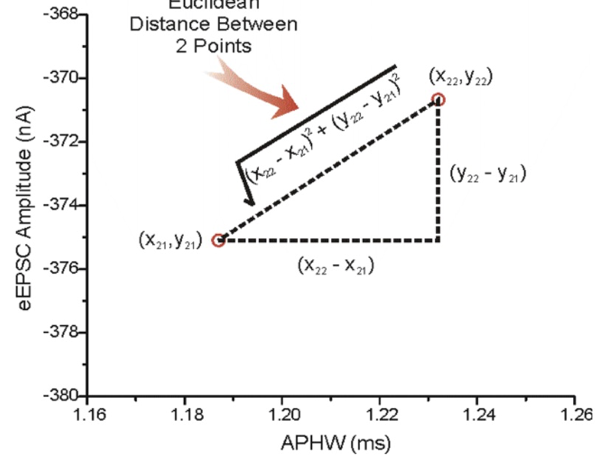

> 欧式距离示意图
>


### **1.3 K值选择策略**

- **过小 K 值**：模型对噪声敏感，易过拟合（决策边界崎岖）→ 高方差风险。
- **过大 K 值**：忽略局部特征，模型趋向简单（决策边界平滑）→ 高偏差风险。
- **平衡建议**：通过交叉验证选择最佳K值，平衡偏差与方差。（通常取奇数避免平票）。


### **1.4 应用场景与流程**

#### **1. 分类问题流程**

1. **📏 计算距离**：未知样本到所有训练样本的欧氏距离。
2. **⬆️ 升序排序**：按距离从小到大排列训练样本。
3. **🔍 选取邻居**：取前 K 个最近邻样本。
4. **🗳️ 多数表决**：统计 K 个样本中频次最高的类别。
5. **🏷️ 归类**：将未知样本划入最高频类别。


#### **2. 回归问题流程**

1. **📏→⬆️→🔍**：同分类步骤 1-3（计算距离、排序、取 K 近邻）。
2. **🧮 均值预测**：计算 K 个邻居目标值的算术平均。
3. **📊 输出**：该平均值作为未知样本的预测值。


## 2、API介绍

### 2.1 核心API分类

| **任务类型** | **API**                  | **关键参数**    | **说明**            |
| :----------- | :----------------------- | :-------------- | :------------------ |
| **分类任务** | `KNeighborsClassifier` 🏷️ | `n_neighbors=5` | 查询邻居数（默认5） |
| **回归任务** | `KNeighborsRegressor` 📈  | `n_neighbors=5` | 查询邻居数（默认5） |


### 2.2 使用流程对比


### 2.3 关键代码示例

#### 1. 分类任务 (整数标签)

```py
# 1. 导入工具包
from sklearn.neighbors import KNeighborsClassifier

# 2. 准备数据
X = [[0,2,3], [1,3,4], [3,5,6], [4,7,8]]  # 特征
y = [0, 0, 1, 1]                           # 整数标签 → 分类

# 3. 实例化 & 训练
model = KNeighborsClassifier(n_neighbors=3)
model.fit(X, y)

# 4. 预测
print(model.predict([[2,3,4]]))  # 输出类别标签
```


#### 2. 回归任务 (浮点标签)

```python
# 1. 导入工具包
from sklearn.neighbors import KNeighborsRegressor

# 2. 准备数据
X = [[0,1,2], [1,2,3], [2,3,4], [3,4,5]]  # 特征
y = [0.1, 0.2, 0.3, 0.4]                  # 浮点标签 → 回归

# 3. 实例化 & 训练
model = KNeighborsRegressor(n_neighbors=3)
model.fit(X, y)

# 4. 预测
print(model.predict([[4,4,5]]))  # 输出连续值
```


**数据格式要求**

| **组件**   | **分类任务**               | **回归任务**             |
| :--------- | :------------------------- | :----------------------- |
| 特征 `x`   | 二维数组（如列表嵌套）     | 同分类 ✅                 |
| 目标值 `y` | **整型标签**（0/1）        | **浮点数值**（0.1, 0.2） |
| 预测输入   | 二维结构（如`[ [样本] ]`） | 同分类 ✅                 |

> 💡 关键区别：目标值 `y` 的数据类型决定任务类型！
>
> - 整型 → 分类（`Classifier`）
> - 浮点型 → 回归（`Regressor`）


#### ⚠️ 核心区别总结

| **特征**     | 分类任务 (Classifier)   | 回归任务 (Regressor)      |
| :----------- | :---------------------- | :------------------------ |
| **标签类型** | 整数 (`[0, 1, 2,...]`)  | 浮点数 (`[0.1, 1.5,...]`) |
| **输出结果** | 离散类别标签            | 连续数值                  |
| **适用场景** | 图像识别/垃圾邮件分类 ✉️ | 房价预测/销量预估 🏠       |

> 💡 **Tips**：
>
> - 通过`n_neighbors`调整模型复杂度（值越小模型越复杂）
> - 回归任务输出结果为邻居标签的**平均值**
> - 分类任务输出结果为邻居标签的**众数**


## 3、距离度量方法

### 3.1 常见距离度量对比

两个 n 维向量点 $a(x_{11}, x_{12}, \ldots, x_{1n})$ 和$b(x_{21}, x_{22}, \ldots, x_{2n})$的距离

| **距离类型**     | **公式**                                           | **示意图**   | **特点**             | **应用场景**           |
| :--------------- | :------------------------------------------------- | :----------- | :------------------- | :--------------------- |
| **欧式距离**     | $d_{ab} = \sqrt{\sum_{k=1}^n (x_{1k} - x_{2k})^2}$ | 直线距离     | 旋转不变性、各向同性 | 空间几何、聚类分析     |
| **曼哈顿距离**   | $d = \sum_{i=1}^n |x_{1k} - x_{2k}|$               | 城市街区距离 | 沿坐标轴路径求和     | 网格路径规划、特征选择 |
| **切比雪夫距离** | $d = \max (|x_{1k} - x_{2k}|)$                     | 棋盘距离     | 关注最大维度差异     | 图像处理、棋盘游戏     |


### 3.2 闵氏距离

统一化公式：$d_{\text{mink}}(x,y) = \left( \sum_{i=1}^{n} |x_i - y_i|^p \right)^{\frac{1}{p}}$

| **参数 `p`** | **对应距离** | **数学关系**                                       |
| :----------- | :----------- | :------------------------------------------------- |
| `p=1`        | 曼哈顿距离   | $d = \sum_{i=1}^n|x_{1k} - x_{2k}| $               |
| `p=2`        | 欧式距离     | $d_{ab} = \sqrt{\sum_{k=1}^n (x_{1k} - x_{2k})^2}$ |
| `p→∞`        | 切比雪夫距离 | $d = \max (|x_{1k} - x_{2k}|)$                     |

> 💡 **核心特点**：
>
> - **泛化框架**：通过参数 `p` 统一多种距离
> - **几何意义**：`p` 值控制维度差异的权重分布
> - **计算特性**：`p` 越大，大值差异主导性越强


#### 闵氏距离当 p→∞ 等价于切比雪夫距离的数学证明

设向量 **x** = (x₁, x₂, ..., xₙ) 和 **y** = (y₁, y₂, ..., yₙ)，闵氏距离定义为：

```math
d_p(\mathbf{x}, \mathbf{y}) = \left( \sum_{i=1}^n |x_i - y_i|^p \right)^{1/p}
```

令 M = max(|x₁ - y₁|, |x₂ - y₂|, ..., |xₙ - yₙ|)，即切比雪夫距离。

#### 步骤1：建立不等式关系

由于 M 是最大的分量绝对值，有：

```math
M^p \leq \sum_{i=1}^n |x_i - y_i|^p \leq n \cdot M^p
```

#### 步骤2：两边取p次方根

```math
M \leq \left( \sum_{i=1}^n |x_i - y_i|^p \right)^{1/p} \leq n^{1/p} \cdot M
```

#### 步骤3：取极限 p→∞

当 p→∞ 时：

```math
\lim_{p \to \infty} n^{1/p} = 1
```

因为：

```math
n^{1/p} = e^{\frac{\ln n}{p}} \xrightarrow{p \to \infty} e^0 = 1
```

#### 步骤4：应用夹逼定理

由不等式：

```math
M \leq d_p(\mathbf{x}, \mathbf{y}) \leq n^{1/p} \cdot M
```


当 p→∞ 时，两边都趋于 M：

```math
\lim_{p \to \infty} d_p(\mathbf{x}, \mathbf{y}) = M
```

### 3.3 距离选择指南

| **需求场景**      | **推荐距离** | **原因**              |
| :---------------- | :----------- | :-------------------- |
| 需要精确空间距离  | 欧式距离     | 符合物理空间认知 🌍    |
| 高维数据/效率优先 | 曼哈顿距离   | 计算复杂度低 ⚡        |
| 关注最大维度差异  | 切比雪夫距离 | 强化极端维度影响 ⚠️    |
| 灵活调节维度权重  | 闵氏距离     | 通过 `p` 值自由控制 🎚️ |


## 4、特征预处理

### 4.1 预处理必要性

特征的**单位或者大小相差较大，或者某特征的方差相比其他的特征要大出几个数量级**，**容易影响（支配）目标结果**，使得一些模型（算法）无法学习到其它的特征。

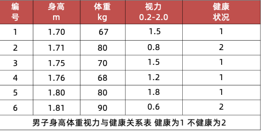

| **问题**               | **影响**               | **解决方案**  |
| :--------------------- | :--------------------- | :------------ |
| 特征尺度差异大 📏       | 大尺度特征支配模型结果 | 归一化/标准化 |
| 特征方差数量级差异大 📈 | 模型忽略小方差特征     | 标准化        |


### 4.2 归一化 vs 标准化

#### 1. 归一化

通过对原始数据进行变换把数据映射到(默认为[0,1])之间：

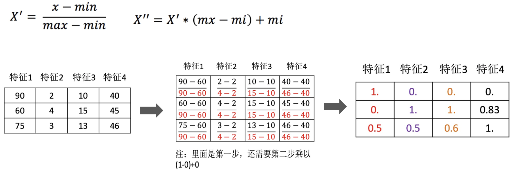

**数据归一化的API实现：**

##### a、核心 API 说明

```python
from sklearn.preprocessing import MinMaxScaler

# 创建归一化器实例
scaler = MinMaxScaler(feature_range=(0, 1))  # 默认缩放到 [0,1] 区间
```

| **参数/方法**      | **类型** | **说明**                 | **默认值** |
| :----------------- | :------- | :----------------------- | :--------- |
| `feature_range`    | tuple    | 缩放目标区间             | `(0, 1)`   |
| `fit_transform(X)` | 方法     | 拟合数据并转换           | -          |
| `transform(X)`     | 方法     | 应用已有缩放器转换新数据 | -          |
| `min_`             | 属性     | 每个特征的最小值         | 计算后生成 |
| `scale_`           | 属性     | 缩放比例因子             | 计算后生成 |

> 💡 **提示**：`feature_range` 可自定义缩放范围，如 `(-1, 1)`

##### b、完整使用流程

```python
# 1. 导入工具包
from sklearn.preprocessing import MinMaxScaler

# 2. 准备数据
data = [[90, 2, 10], 
        [60, 4, 15], 
        [75, 3, 13]]

# 3. 实例化归一化器
scaler = MinMaxScaler(feature_range=(0, 1))

# 4. 拟合并转换数据
scaled_data = scaler.fit_transform(data)

print("归一化结果:")
print(scaled_data)
```

**输出示例**：

```tex
归一化结果:
[[1.         0.         0.        ]
 [0.         1.         1.        ]
 [0.5        0.5        0.6       ]]
```

##### c、关键属性说明

```python
# 查看计算参数
print("各特征最小值:", scaler.min_)
print("缩放比例:", scaler.scale_)
print("数据范围:", scaler.data_min_, "~", scaler.data_max_)
```

**输出示例**：

```tex
各特征最小值: [-90.  -2. -10.]
缩放比例: [0.03333333 0.5        0.2       ]
数据范围: [60  2 10] ~ [90  4 15]
```

##### d、新数据转换方法

```python
# 转换新数据（使用已拟合的缩放器）
new_data = [[85, 3.5, 12]]
scaled_new = scaler.transform(new_data)

print("新数据归一化结果:")
print(scaled_new)
```

**输出示例**：

```tex
新数据归一化结果:
[[0.83333333 0.75       0.4       ]]
```

##### e、重要注意事项

- **拟合与转换分离**：
  - 训练集：使用 `fit_transform()`
  - 测试集：使用 `transform()`（**禁止**用 `fit_transform`）
- **异常值影响**：

```python
# 含异常值的数据
outlier_data = [[200, 10, 30],  # 异常点
               [60, 4, 15],
               [75, 3, 13]]

scaler_outlier = MinMaxScaler().fit_transform(outlier_data)
print("含异常值归一化:", scaler_outlier[0])  # [1. 1. 1.]
```

**结果说明**：异常值会挤压正常数据的分布空间

3. **适用场景**：

- ✅ 图像处理（像素值归一化）
- ✅ 无显著异常值的小数据集
- ❌ 包含显著异常值的数据

> 归一化受到最大值与最小值的影响，这种方法容易受到异常数据的影响, 鲁棒性较差，适合传统精确小数据场景
>


#### 2. 标准化

通过对原始数据进行标准化，转换为均值为0、标准差为1的标准正态分布的数据

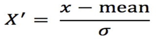

* mean 为特征的平均值
* σ 为特征的标准差


**数据标准化的API实现：**

##### a、核心 API 说明

```python
from sklearn.preprocessing import StandardScaler

# 创建标准化器实例
scaler = StandardScaler()  # 转换为均值为0，标准差为1
```

| **参数/方法**      | **类型** | **说明**          | **数学原理**                                        |
| :----------------- | :------- | :---------------- | :-------------------------------------------------- |
| `fit_transform(X)` | 方法     | 拟合数据并转换    | $X_{\text{std}} = \frac{X - \mu}{\sigma}$           |
| `transform(X)`     | 方法     | 应用已有转换器    | 使用训练集的 $\mu$ 和 $\sigma$                      |
| `mean_`            | 属性     | 每个特征的均值    | $\mu = \frac{1}{n}\sum_{i=1}^{n}x_i$                |
| `var_`             | 属性     | 每个特征的方差    | $\sigma^2 = \frac{1}{n}\sum_{i=1}^{n}(x_i - \mu)^2$ |
| `scale_`           | 属性     | 标准差 ($\sigma$) | $\sigma = \sqrt{\text{var}}$                        |

##### b、完整使用流程

```python
# 1. 导入工具包
from sklearn.preprocessing import StandardScaler

# 2. 准备数据
data = [[90, 2, 10], 
        [60, 4, 15], 
        [75, 3, 13]]

# 3. 实例化标准化器
scaler = StandardScaler()

# 4. 拟合并转换数据
scaled_data = scaler.fit_transform(data)

print("标准化结果:")
print(scaled_data)
```

**输出示例**：

```tex
标准化结果:
[[ 1.22474487 -1.22474487 -1.13554995]
 [-1.22474487  1.22474487  1.29777108]
 [ 0.          0.         -0.16222113]]
```

> 💡 **验证**：每列均值为0，标准差为1
>
> ```python
> print("均值:", scaled_data.mean(axis=0))  # [0., 0., 0.]
> print("标准差:", scaled_data.std(axis=0))  # [1., 1., 1.]
> ```

##### c、关键属性说明

```python
# 查看计算参数
print("特征均值:", scaler.mean_)  # [75., 3., 12.66666667]
print("特征方差:", scaler.var_)   # [150. 1. 4.22222222]
print("特征标准差:", scaler.scale_) # [12.24744871 1. 2.05480467]
```

##### d、新数据转换方法

```python
# 转换新数据（使用训练集的统计量）
new_data = [[85, 3.5, 12]]
scaled_new = scaler.transform(new_data)

print("新数据标准化结果:")
print(scaled_new)
```

**输出示例**：

```tex
新数据标准化结果:
[[ 0.81649658  0.5        -0.32444227]]
```

**计算验证**：

```tex
第一个特征: (85 - 75)/12.247 ≈ 0.816
第二个特征: (3.5 - 3)/1 = 0.5
第三个特征: (12 - 12.666)/2.055 ≈ -0.324
```

> 对于标准化来说，如果出现异常点，由于具有一定数据量，少量的异常点对于平均值的影响并不大


#### 3. 标准化 vs 归一化 区别

| **特性**         | **标准化**         | **归一化**         |
| :--------------- | :----------------- | :----------------- |
| **异常值鲁棒性** | ✅ 抗异常值能力强   | ❌ 对异常值敏感     |
| **输出范围**     | 无固定范围         | 固定范围 (如[0,1]) |
| **数据分布**     | 保持原始分布       | 改变原始分布       |
| **适用场景**     | 大多数机器学习算法 | 图像处理、神经网络 |
| **计算复杂度**   | 需计算均值和方差   | 只需最小最大值     |

| **方法**             | **公式**                                                    | **API**          | **特点**                        | **适用场景**          |
| :------------------- | :---------------------------------------------------------- | :--------------- | :------------------------------ | :-------------------- |
| **归一化** (Min-Max) | $X_{\text{new}} = \frac{X - X_{\min}}{X_{\max} - X_{\min}}$ | `MinMaxScaler`   | ✅ 固定区间范围 ❌ 对异常值敏感   | 无异常值的小数据集    |
| **标准化** (Z-Score) | $X_{\text{std}} = \frac{X - \mu}{\sigma}$                   | `StandardScaler` | ✅ 保留数据分布 ✅ 抗异常值能力强 | 大数据集/含轻微异常值 |


### 4.3 利用KNN算法进行鸢尾花分类

鸢尾花Iris Dataset数据集是机器学习领域经典数据集，鸢尾花数据集包含了150条鸢尾花信息，每50条取自三个鸢尾花中之一：Versicolour、Setosa和Virginica

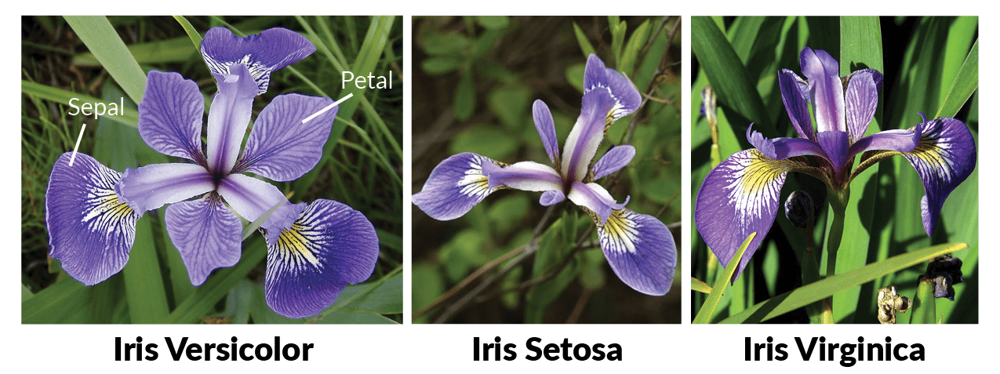

每个花的特征用如下属性描述：

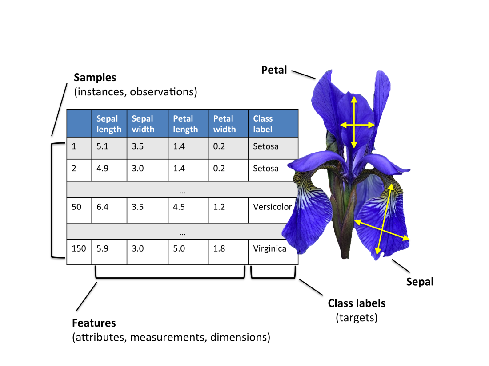

#### a、实现流程与关键步骤

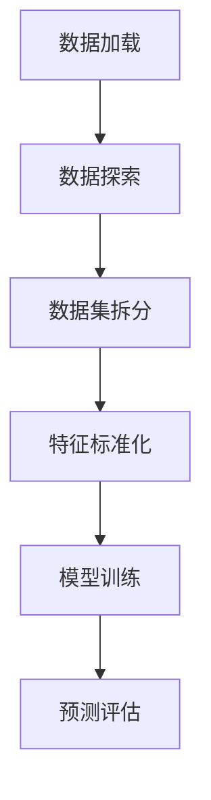

#### b、数据加载与探索

```python
from sklearn.datasets import load_iris
import pandas as pd

# 加载数据集
iris_data = load_iris()

# 创建DataFrame
iris_df = pd.DataFrame(iris_data.data, columns=iris_data.feature_names)
iris_df['label'] = iris_data.target

# 可视化探索（可选）
# sns.lmplot(x='sepal length (cm)', y='sepal width (cm)', data=iris_df, hue='label')
# plt.show()
```

#### c、数据集拆分

| **参数**       | **值** | **作用**       |
| :------------- | :----- | :------------- |
| `test_size`    | 0.3    | 测试集比例30%  |
| `random_state` | 22     | 确保结果可复现 |

```python
from sklearn.model_selection import train_test_split

x_train, x_test, y_train, y_test = train_test_split(
    iris_data.data, 
    iris_data.target, 
    test_size=0.3, 
    random_state=22
)
```

#### d、特征标准化

| **处理方式** | **API**           | **注意事项**     |
| :----------- | :---------------- | :--------------- |
| 训练集       | `fit_transform()` | 计算并应用转换   |
| 测试集       | `transform()`     | 使用训练集的参数 |

```python
from sklearn.preprocessing import StandardScaler

# 标准化处理
scaler = StandardScaler()
x_train_scaled = scaler.fit_transform(x_train)
x_test_scaled = scaler.transform(x_test)  # 使用训练集的均值和标准差
```

#### e、模型训练与预测

| **组件** | **API**                | **参数**        |
| :------- | :--------------------- | :-------------- |
| 分类器   | `KNeighborsClassifier` | `n_neighbors=3` |
| 预测方法 | `predict()`            | 返回类别标签    |
| 概率预测 | `predict_proba()`      | 返回各类别概率  |

```python
from sklearn.neighbors import KNeighborsClassifier

# 模型训练
model = KNeighborsClassifier(n_neighbors=3)
model.fit(x_train_scaled, y_train)

# 单样本预测
sample = [[5.1, 3.5, 1.4, 0.2]]
sample_scaled = scaler.transform(sample)  # 必须使用相同标准化
print("预测概率:", model.predict_proba(sample_scaled))

# 测试集预测
y_pred = model.predict(x_test_scaled)
```

#### f、模型评估

| **评估方法** | **API**                              | **输出**       |
| :----------- | :----------------------------------- | :------------- |
| 准确率计算1  | `accuracy_score(y_test, y_pred)`     | 0.0-1.0        |
| 准确率计算2  | `model.score(x_test_scaled, y_test)` | 0.0-1.0        |
| **核心指标** | 准确率(Accuracy)                     | 正确预测的比例 |

```python
from sklearn.metrics import accuracy_score

# 方法1：使用accuracy_score
acc1 = accuracy_score(y_test, y_pred)

# 方法2：直接使用模型score方法
acc2 = model.score(x_test_scaled, y_test)

print(f"模型准确率: {acc1:.2f} (两种方法结果一致)")
```

| **要点**       | **正确做法**       | **错误做法**     |
| :------------- | :----------------- | :--------------- |
| **预处理顺序** | 先拆分后标准化     | 先标准化后拆分   |
| **测试集处理** | 使用训练集的转换器 | 对测试集单独fit  |
| **新样本预测** | 必须应用相同标准化 | 原始数据直接预测 |
| **随机种子**   | 固定random_state   | 不设置随机种子   |
| **特征顺序**   | 保持特征顺序一致   | 打乱特征顺序     |

> 💡 **最佳实践建议**：
>
> 1. 使用`Pipeline`整合预处理和模型
> 2. 通过交叉验证选择最佳K值
> 3. 探索特征间的相关性（如花瓣长度与类别强相关）
> 4. 可视化决策边界辅助理解模型行为


```python
# 0.导入工具包
from sklearn.datasets import load_iris
import seaborn as sns
import matplotlib.pyplot as plt
import pandas as pd
from sklearn.model_selection import train_test_split
from sklearn.preprocessing import StandardScaler
from sklearn.neighbors import KNeighborsClassifier
from sklearn.metrics import accuracy_score

# 1.加载数据集
iris_data = load_iris()
# print(iris_data)
# print(iris_data.target)


# 2.数据展示
iris_df = pd.DataFrame(iris_data['data'], columns=iris_data.feature_names)
iris_df['label'] = iris_data.target
# print(iris_data.feature_names)
# sns.lmplot(x='sepal length (cm)',y='sepal width (cm)',data = iris_df,hue='label')
# plt.show()


# 3.特征工程(预处理-标准化)
# 3.1 数据集划分
x_train, x_test, y_train, y_test = train_test_split(iris_data.data, iris_data.target, test_size=0.3, random_state=22)
print(len(iris_data.data))
print(len(x_train))
# 3.2 标准化
process = StandardScaler()
x_train = process.fit_transform(x_train)
x_test = process.transform(x_test)
# 4.模型训练
# 4.1 实例化
model = KNeighborsClassifier(n_neighbors=3)
# 4.2 调用fit法
model.fit(x_train,y_train)
# 5.模型预测
x = [[5.1, 3.5, 1.4, 0.2]]
x=process.transform(x)
y_predict =model.predict(x_test)
print(model.predict_proba(x))

# 6.模型评估(准确率)
# 6.1 使用预测结果
acc =accuracy_score(y_test,y_predict)
print(acc)

# 6.2 直接计算
acc = model.score(x_test,y_test)
print(acc)

```


## 超参数选择的方法


### 交叉验证

交叉验证是一种数据集的分割方法，将训练集划分为 n 份，其中一份做验证集、其他n-1份做训练集集 

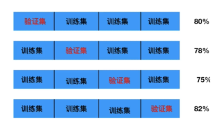

**交叉验证法原理**：将数据集划分为 cv=10 份：

1.第一次：把第一份数据做验证集，其他数据做训练

2.第二次：把第二份数据做验证集，其他数据做训练

3.... 以此类推，总共训练10次，评估10次。

4.使用训练集+验证集多次评估模型，取平均值做交叉验证为模型得分

5.若k=5模型得分最好，再使用全部训练集(训练集+验证集) 对k=5模型再训练一边，再使用测试集对k=5模型做评估


### 网格搜索

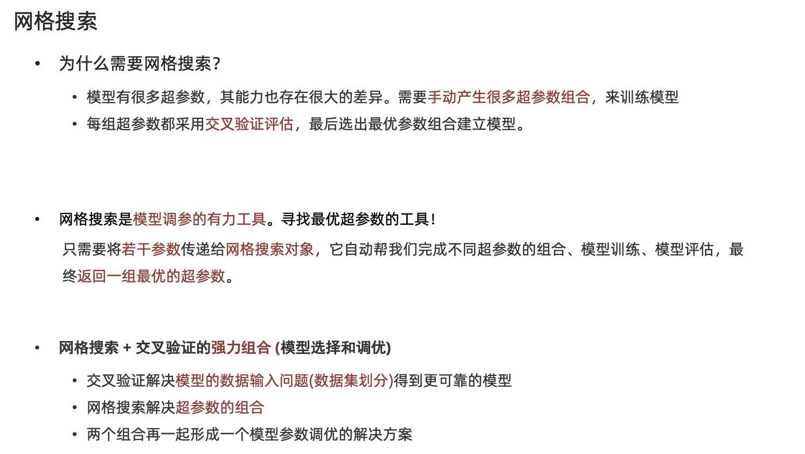

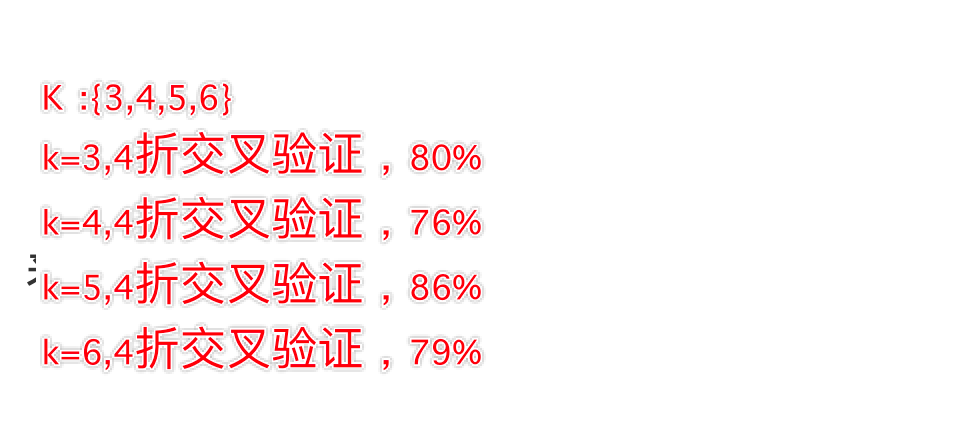

交叉验证网格搜索的API:

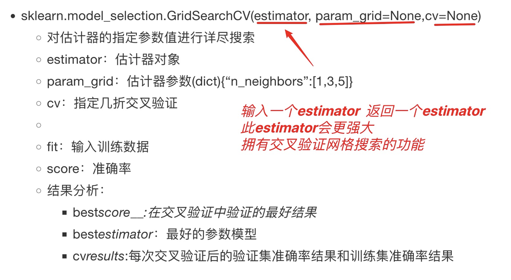


交叉验证网格搜索在鸢尾花分类中的应用：

```python
# 0.导入工具包
from sklearn.datasets import load_iris
from sklearn.model_selection import train_test_split,GridSearchCV
from sklearn.preprocessing import StandardScaler
from sklearn.neighbors import KNeighborsClassifier
from sklearn.metrics import accuracy_score

# 1.加载数据
data = load_iris()

# 2 数据集划分
x_train,x_test,y_train,y_test=train_test_split(data.data,data.target,test_size=0.2,random_state=22)

# 3.特征预处理
pre = StandardScaler()
x_train=pre.fit_transform(x_train)
x_test=pre.transform(x_test)

# 4.模型实例化+交叉验证+网格搜索
model = KNeighborsClassifier(n_neighbors=1)
paras_grid = {'n_neighbors':[4,5,7,9]}
# estimator =GridSearchCV(estimator=model,param_grid=paras_grid,cv=4)
# estimator.fit(x_train,y_train)
# 此时estimator为最后的一个模型
# print(estimator.best_score_)
# print(estimator.best_estimator_)
# print(estimator.cv_results_)

model = KNeighborsClassifier(n_neighbors=7)
model.fit(x_train,y_train)
x = [[5.1, 3.5, 1.4, 0.2]]
x=pre.transform(x)
y_prdict=model.predict(x_test)

print(accuracy_score(y_test,y_prdict))


```


### 利用KNN算法实现手写数字识别

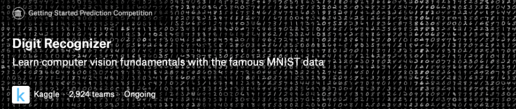

MNIST手写数字识别 是计算机视觉领域中 "hello world"级别的数据集

- 1999年发布，成为分类算法基准测试的基础
- 随着新的机器学习技术的出现，MNIST仍然是研究人员和学习者的可靠资源。

本次案例中，我们的目标是从数万个手写图像的数据集中正确识别数字。

### 数据介绍

数据文件 train.csv 和 test.csv 包含从 0 到 9 的手绘数字的灰度图像。

- 每个图像高 28 像素，宽28 像素，共784个像素。

- 每个像素取值范围[0,255]，取值越大意味着该像素颜色越深

- 训练数据集（train.csv）共785列。第一列为 "标签"，为该图片对应的手写数字。其余784列为该图像的像素值

- 训练集中的特征名称均有pixel前缀，后面的数字（[0,783])代表了像素的序号。

像素组成图像如下：

```python
000 001 002 003 ... 026 027
028 029 030 031 ... 054 055
056 057 058 059 ... 082 083
 | | | | ...... | |
728 729 730 731 ... 754 755
756 757 758 759 ... 782 783
```

数据集示例如下:


```

```


## 作业

1.完成KNN算法部分的思维导图


2.说明常见的距离度量方法


3.说明特征预处理的方法


4.编写KNN代码实现鸢尾花分类案例


5.编写KNN代码实现手写数字识别（特征预处理，交叉验证网格搜索）