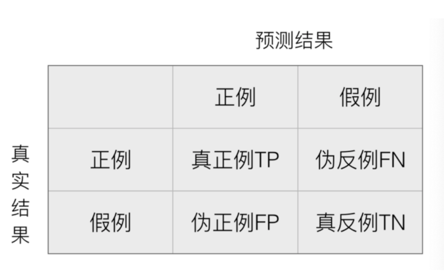
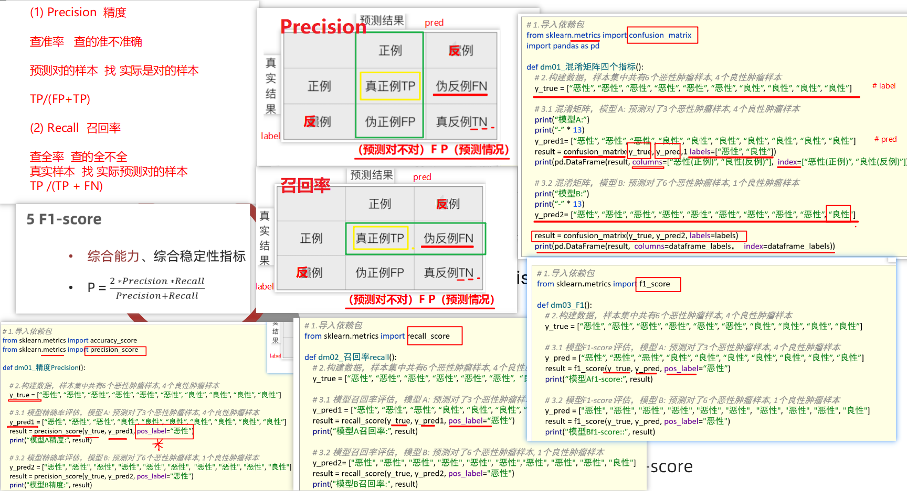
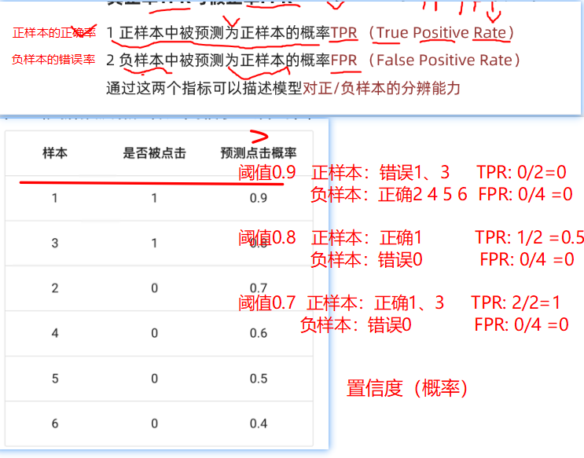
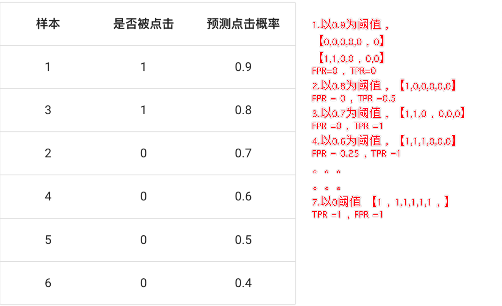

## 1、逻辑回归简介

### 1.1 应用场景

逻辑回归（Logistic Regression）是一种广泛应用于**分类问题**的统计学习方法，尤其适用于**二分类**问题（也可以扩展到多分类）


### 1.2 数学知识

#### 1.2.1 sigmoid函数


**求导过程：**

> **步骤 1：改写函数形式**
>
> 将 Sigmoid 函数改写为指数形式：
>
> $$
> \sigma(z) = (1 + e^{-z})^{-1}
> $$
>
> **步骤 2：应用链式法则求导**
>
> 对 $\sigma(z)$ 关于 $z$ 求导：
>
> $$
> \begin{aligned}
> \frac{d}{dz}\sigma(z) &= \frac{d}{dz} \left(1 + e^{-z}\right)^{-1} \\
> &= -1 \cdot \left(1 + e^{-z}\right)^{-2} \cdot \frac{d}{dz}(1 + e^{-z}) \quad \text{(链式法则)} \\
> &= -\left(1 + e^{-z}\right)^{-2} \cdot (-e^{-z}) \\
> &= \frac{e^{-z}}{(1 + e^{-z})^2}
> \end{aligned}
> $$
>
> **步骤 3：化简导数表达式**
>
> 将导数表示为 Sigmoid 函数本身：
>
> $$
> \begin{aligned}
> \sigma'(z) &= \frac{e^{-z}}{(1 + e^{-z})^2} \\
> &= \left(\frac{1}{1 + e^{-z}}\right) \cdot \left(\frac{e^{-z}}{1 + e^{-z}}\right) \\
> &= \sigma(z) \cdot \left(1 - \sigma(z)\right) \quad \text{因为 } \frac{e^{-z}}{1 + e^{-z}} = 1 - \frac{1}{1 + e^{-z}}
> \end{aligned}
> $$
>


#### 1.2.2 概率

##### 1. 基本概念定义

###### a、概率

- **定义**：衡量某事件发生的可能性大小的数值，取值范围 [0,1]
- **示例**：
  - 北京早上堵车概率：P(A) = 0.7
  - 中午堵车概率：P(B) = 0.3
  - 晚上堵车概率：P(C) = 0.4


###### b、联合概率 

- **定义**：两个或多个事件同时发生的概率
- **计算公式**（独立事件）：$  P(A \cap B) = P(A) \times P(B)$
- **示例**：
  - 周一早上和周二早上都堵车的概率：$P(A_1 \cap A_2) = 0.7 \times 0.7 = 0.49$


###### c、条件概率

**定义**：在已知事件B发生的情况下，事件A发生的概率  

**计算公式**：  

$$
P(A|B) = \frac{P(A \cap B)}{P(B)}
$$

**关键点**：  

- 描述事件间的依赖关系  
- 当A、B独立时，$P(A|B) = P(A)$  


##### 2. 概念对比与示例分析

| 概念     | 符号表示 | 计算公式            | 独立性影响         |
| :------- | :------- | :------------------ | :----------------- |
| 联合概率 | P(A∩B)   | P(A)×P(B)（独立时） | 独立事件可直接相乘 |
| 条件概率 | P(A\|B)  | P(A∩B)/P(B)         | 独立时P(A\|B)=P(A) |


##### 3. 典型案例分析  
**场景：北京堵车概率**  

- 早上堵车 P(A) = 0.7  
- 中午堵车 P(B) = 0.3  

---

**案例1（联合概率正确应用）**  

**事件**：周一早上和周二早上都堵车  

**公式**：  
$$
P(A_1 \cap A_2) = 0.7 \times 0.7 = 0.49
$$
**解释**：两事件独立，联合概率为概率乘积。  

---

**案例2（条件概率常见误区纠正）**  

**错误理解**：  
$$
P(\text{中午} \mid \text{早上}) = 0.7 \times 0.3 = 0.21 \quad ❌  
$$

**正确分析**：  
1. **若早晚堵车独立**：  
   $$
   P(B \mid A) = P(B) = 0.3  
   $$
2. **若存在依赖关系**（需额外信息）：  假设早上堵车使中午概率升至 0.5：  
   $$
   P(B \mid A) = 0.5  
   $$
   **关键点**：条件概率不等于联合概率，需明确事件是否独立或依赖。 


#### 1.2.3 极大似然估计

**核心思想**

在模型参数 $w$ 的所有可能取值中，选择使当前观测样本出现概率最大的那个值作为参数的估计值。
**直观理解**：在所有可能的参数中，找出“看起来最像”能产生当前数据的那个参数。


**示例：不均匀硬币的极大似然估计**

**问题描述**：

-  硬币正面概率 $\theta$，反面概率 $1-\theta$  
- 独立抛掷6次，观测结果为 $D = \{\text{正面}, \text{反面}, \text{反面}, \text{正面}, \text{正面}, \text{正面}\}$  
- 目标：基于观测数据 $D$，估计参数 $\theta$


**步骤解析**：  

- **写出似然函数**（观测数据出现的概率）：
   $$
   P(D|\theta) = \theta \times (1-\theta) \times (1-\theta) \times \theta \times \theta \times \theta = \theta^4 (1-\theta)^2
   $$

- **问题转化**：  求函数 $P(D|\theta) = \theta^4 (1-\theta)^2$ 的极大值对应的 $\theta$

- **求解方法**：  
   - 对似然函数取对数（简化计算）：
     $$
     \ln P(D|\theta) = 4 \ln \theta + 2 \ln (1-\theta)
     $$
   - 对 $\theta$ 求导并令导数为零：
     $$
     \frac{d}{d\theta} \ln P(D|\theta) = \frac{4}{\theta} - \frac{2}{1-\theta} = 0
     $$
   - 解得：
     $$
     \theta = \frac{2}{3}
     $$

**结论**：  极大似然估计值为 $\hat{\theta} = \frac{2}{3}$


#### 1.2.4 对数函数

**对数函数：** 

如果 $a^b = N$（$a > 0$，$a \neq 1$），那么 $b$ 叫做以 $a$ 为底 $N$ 的对数，记为 $b = \log_a N$。

**示例**：  

- $\log_{10} 100 = 2$  
- $\log_2 16 = 4$  

**注意**：  $a > 1$ 和 $0 < a < 1$ 时对数函数图像的性质不同。


**对数函数性质**  

1. **积的对数**：  $\log_a MN = \log_a M + \log_a N$  
   
2. **商的对数**：  $\log_a \frac{M}{N} = \log_a M - \log_a N$  
   
3. **幂的对数**：  $\log_a M^n = n \log_a M$  

**条件**：  $a > 0$，$a \neq 1$，$M > 0$，$N > 0$。

**应用**：  利用对数运算性质，可将多个概率连乘的式子转换为对数相加的形式。


## 2、逻辑回归原理

### 2.1 原理

**逻辑回归概念(Logistic Regression)**  
-  一种分类模型，把线性回归的输出，作为逻辑回归的输入  
- 输出范围：(0,1)之间的概率值  

**基本思想**  
1. 线性模型计算：`f(x) = wx + b`  
2. Sigmoid函数映射：将`f(x)`转换为概率值  
   - 阈值判定（如0.5）：  
     - 概率 > 0.5 → 分类为1  
     - 概率 ≤ 0.5 → 分类为0  

**假设函数**  `h(w) = sigmoid(wx + b)`  

  

**在逻辑回归中，当预测结果不对的时候，我们该怎么衡量其损失呢？**

我们来看下图(下图中，设置阈值为0.6)，

 

那么如何去衡量逻辑回归的预测结果与真实结果的差异？


### 2.2 损失函数


## 逻辑回归API

**学习目标：**

1.知道逻辑回归的API

2.动手实现癌症分类案例

### API介绍

```python
sklearn.linear_model.LogisticRegression(solver='liblinear', penalty=‘l2’, C = 1.0)
```

**solver** **损失函数优化方法**:

训练速度:liblinear 对小数据集场景训练速度更快，sag 和 saga 对大数据集更快一些。 2 正则化:

1. newton-cg、lbfgs、sag、saga 支持 L2 正则化或者没有正则化
2. 2liblinear 和 saga 支持 L1 正则化

**penalty**:正则化的种类，l1 或者 l2

**C**:正则化力度

默认将类别数量少的当做正例


### 癌症分类案例

- 数据介绍

（1）699条样本，共11列数据，第一列用语检索的id，后9列分别是与肿瘤相关的医学特征，

​     最后一列表示肿瘤类型的数值。

（2）包含16个缺失值，用”?”标出。

（3）2表示良性，4表示恶性

> 数据描述
>
> （1）699条样本，共11列数据，第一列用语检索的id，后9列分别是与肿瘤
>
> 相关的医学特征，最后一列表示肿瘤类型的数值。
>
> （2）包含16个缺失值，用”?”标出。

​	

- 案例分析

```
1.获取数据
2.基本数据处理
2.1 缺失值处理
2.2 确定特征值,目标值
2.3 分割数据
3.特征工程(标准化)
4.机器学习(逻辑回归)
5.模型评估
```

- 代码实现

```python
# 0.导包
import pandas as pd
from sklearn.model_selection import train_test_split
from sklearn.preprocessing import StandardScaler
from sklearn.linear_model import LogisticRegression
from sklearn.metrics import accuracy_score
import numpy as np

# 1.加载数据
data =pd.read_csv('breast-cancer-wisconsin.csv')
# print(data.info())
# 2.数据处理
# 2.1 缺失值
data =data.replace(to_replace='?',value=np.NAN)
data=data.dropna()

# 2.2 获取特征和目标值
X = data.iloc[:,1:-1]
y = data['Class']

# 2.3 数据划分
x_train,x_test,y_train,y_test=train_test_split(X,y,test_size=0.2,random_state=22)
# 3.特征工程(标准化)
pre =StandardScaler()
x_train=pre.fit_transform(x_train)
x_test=pre.transform(x_test)

# 4.模型训练
model=LogisticRegression()
model.fit(x_train,y_train)

# 5.模型预测和评估
y_predict =model.predict(x_test)
print(y_predict)
print(accuracy_score(y_test,y_predict))

```


## 分类评估方法

**学习目标：**

1.理解混淆矩阵的构建方法

2.掌握精确率，召回率和F1score的计算方法

3.知道ROC曲线和AUC指标

### 混淆矩阵



混淆矩阵作用在测试集样本集中：

1. 真实值是 **正例** 的样本中，被分类为 **正例** 的样本数量有多少，这部分样本叫做真正例（TP，True Positive）
2. 真实值是 **正例** 的样本中，被分类为 **假例** 的样本数量有多少，这部分样本叫做伪反例（FN，False Negative）
3. 真实值是 **假例** 的样本中，被分类为 **正例** 的样本数量有多少，这部分样本叫做伪正例（FP，False Positive）
4. 真实值是 **假例** 的样本中，被分类为 **假例** 的样本数量有多少，这部分样本叫做真反例（TN，True Negative）


> True Positive ：表示样本真实的类别
> Positive ：表示样本被预测为的类别


### Precision（精确率）


精确率也叫做查准率，指的是对正例样本的预测准确率。比如：我们把恶性肿瘤当做正例样本，则我们就需要知道模型对恶性肿瘤的预测准确率。


### Recall（召回率）


召回率也叫做查全率，指的是预测为真正例样本占所有真实正例样本的比重。例如：我们把恶性肿瘤当做正例样本，则我们想知道模型是否能把所有的恶性肿瘤患者都预测出来。


###  F1-score

如果我们对模型的精度、召回率都有要求，希望知道模型在这两个评估方向的综合预测能力如何？则可以使用 F1-score 指标。


**Precision / Recall /F1-score**




###  ROC曲线和AUC指标

####  ROC 曲线

ROC曲线代表的意义？

ROC 曲线：我们分别考虑正负样本的情况：

1. 正样本中被预测为正样本的概率，即：TPR （True Positive Rate）
2. 负样本中被预测为正样本的概率，即：FPR （False Positive Rate）


ROC 曲线图像中，4 个特殊点的含义：


1. (0, 0) 表示所有的正样本都预测为错误，所有的负样本都预测正确
2. (1, 0) 表示所有的正样本都预测错误，所有的负样本都预测错误
3. (1, 1) 表示所有的正样本都预测正确，所有的负样本都预测错误
4. (0, 1) 表示所有的正样本都预测正确，所有的负样本都预测正确



#### 绘制 ROC 曲线

假设：在网页某个位置有一个广告图片或者文字，该广告共被展示了 6 次，有 2 次被浏览者点击了。每次点击的概率如下：

| 样本 | 是否被点击 | 预测点击概率 |
| :--: | :--------: | :----------: |
|  1   |     1      |     0.9      |
|  2   |     0      |     0.7      |
|  3   |     1      |     0.8      |
|  4   |     0      |     0.6      |
|  5   |     0      |     0.5      |
|  6   |     0      |     0.4      |

根据预测点击概率排序之后：

| 样本 | 是否被点击 | 预测点击概率 |
| :--: | :--------: | :----------: |
|  1   |     1      |     0.9      |
|  3   |     1      |     0.8      |
|  2   |     0      |     0.7      |
|  4   |     0      |     0.6      |
|  5   |     0      |     0.5      |
|  6   |     0      |     0.4      |

绘制 ROC 曲线：

**阈值：0.9**

1. 原本为正例的 1、3 号的样本中 3 号样本被分类错误，则 TPR = 1/2 = 0.5
2. 原本为负例的 2、4、5、6 号样本没有一个被分为正例，则 FPR = 0

**阈值：0.8**

1. 原本为正例的 1、3 号样本被分类正确，则 TPR = 2/2 = 1
2. 原本为负例的 2、4、5、6 号样本没有一个被分为正例，则 FPR = 0

**阈值：0.7**

1. 原本为正例的 1、3 号样本被分类正确，则 TPR = 2/2 = 1
2. 原本为负类的 2、4、5、6 号样本中 2 号样本被分类错误，则 FPR = 1/4 = 0.25

**阈值：0.6**

1. 原本为正例的 1、3 号样本被分类正确，则 TPR = 2/2 = 1
2. 原本为负类的 2、4、5、6 号样本中 2、4 号样本被分类错误，则 FPR = 2/4 = 0.5

**阈值：0.5**

1. 原本为正例的 1、3 号样本被分类正确，则 TPR = 2/2 = 1
2. 原本为负类的 2、4、5、6 号样本中 2、4、5 号样本被分类错误，则 FPR = 3/4 = 0.75

**阈值 0.4**

1. 原本为正例的 1、3 号样本被分类正确，则 TPR = 2/2 = 1
2. 原本为负类的 2、4、5、6 号样本全部被分类错误，则 FPR = 4/4 = 1


(0, 0.5)、(0, 1)、(0.25, 1)、(0.5, 1)、(0.75, 1)、(1, 1)


由 TPR 和 FPR 构成的 ROC 图像为：





#### AUC 值


1. 我们发现：图像越靠近 (0,1) 点则模型对正负样本的辨别能力就越强
2. 我们发现：图像越靠近 (0, 1) 点则 ROC 曲线下面的面积就会越大
3. AUC 是 ROC 曲线下面的面积，该值越大，则模型的辨别能力就越强
4. AUC  范围在 [0, 1] 之间
5. 当 AUC= 1 时，该模型被认为是完美的分类器，但是几乎不存在完美分类器

> AUC 值主要评估模型对正例样本、负例样本的辨别能力.


####  **分类评估报告api**

```python
sklearn.metrics.classification_report(y_true, y_pred, labels=[], target_names=None )
  '''
  y_true：真实目标值
  y_pred：估计器预测目标值
  labels:指定类别对应的数字
  target_names：目标类别名称
  return：每个类别精确率与召回率
  '''
```


####  **AUC计算API**

```
from sklearn.metrics import roc_auc_score
  sklearn.metrics.roc_auc_score(y_true, y_score)
    计算ROC曲线面积，即AUC值
    y_true：每个样本的真实类别，必须为0(反例),1(正例)标记
    y_score：预测得分，可以是正例的估计概率、置信值或者分类器方法的返回值
```


## 电信客户流失预测

**学习目标：**

1.了解案例的背景信息

2.知道案例的处理流程

3.动手实现电信客户流失案例的代码


### 数据集介绍

- 流失用户指的使用过产品因为某些原因不再使用该产品。随着产品的更新迭代，都会存在一定的流失情况，这时正常现象。流失用户的比例和变化趋势能够反映该产品当前是否存在问题以及未来的发展趋势。
- 当用户群体庞大时，有限的人力和精力不能为每个用户都投入大量的时间。如果公司可以预测哪些用户可能提前流失，这样就能将主要精力聚焦于这些用户，实施有效的用户挽留策略，提高用户粘性。
- 本项目旨在通过分析特征属性确定用户流失的原因，以及哪些因素可能导致用户流失。建立预测模型来判断用户是否流失，并提出用户流失预警策略。
- 具体数据说明如下：数据集中总计7043条数据，21个特征字段，最终分类特征为Churn：用户是否流失，具体内容如下所示：
  customerID：用户ID
  gender：性别
  SeniorCitizen：是否是老人
  Partner：是否有伴侣
  Dependents：是否有需要抚养的孩子
  tenure：任职
  PhoneService：是否办理电话服务
  MultipleLines：是否开通了多条线路
  InternetService：是否开通网络服务和开通的服务类型（光纤、电话拨号）
  TechSupport：是否办理技术支持服务
  OnlineBackup：是否办理在线备份服务
  OnlineSecurity：是否办理在线安全服务
  DeviceProtection：是否办理设备保护服务
  StreamingTV：是否办理电视服务
  StreamingMovies：是否办理电影服务
  Contract：签订合约的时长
  PaperlessBilling：是否申请了无纸化账单
  PaymentMethod：付款方式（电子支票、邮寄支票、银行自动转账、信用卡自动转账）
  MonthlyCharges：月消费
  TotalCharges：总消费
  Churn：用户是否流失


### 处理流程

1、数据基本处理

 	查看数据的基本信息

​	对类别数据数据进行one-hot处理

​	查看标签分布情况

2、特征筛选

​	分析哪些特征对标签值影响大

​	初步筛选出对标签影响比较大的特征，形成x、y

3、模型训练

​	模型训练

​	交叉验证网格搜索等

4、模型评估

​	精确率

​	Roc_AUC指标计算

###  案例实现


## 作业

1. 使用思维导图总结逻辑回归的内容


2. 理解分类评估方法并进行详细的描述


3.动手实现癌症分类和电信用户流失案例(数据处理，特征工程，CV。。。。)