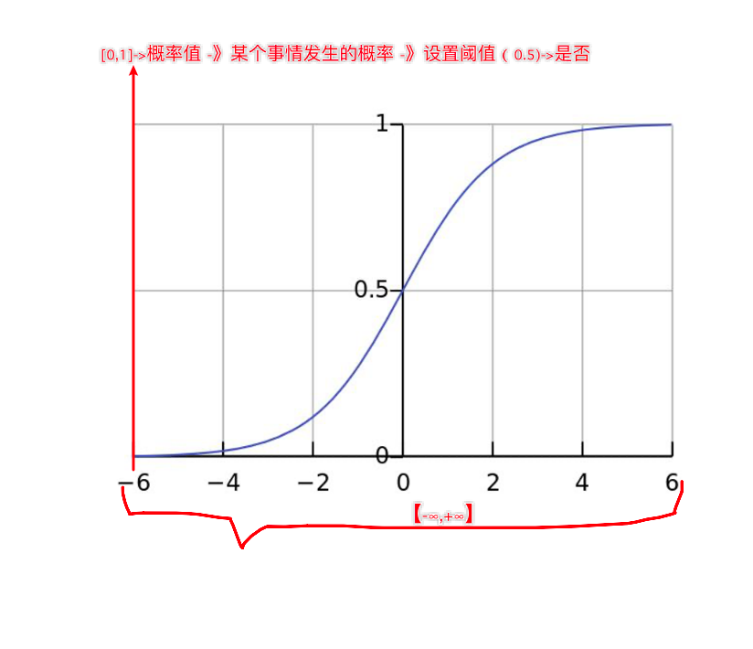
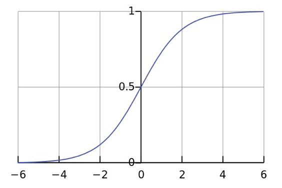
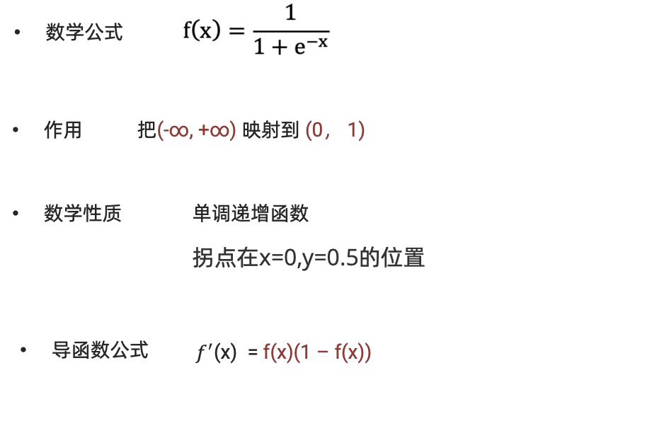
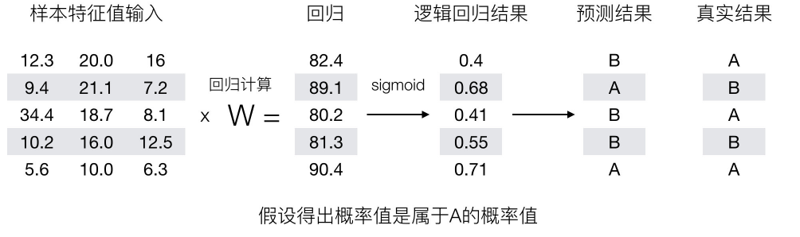
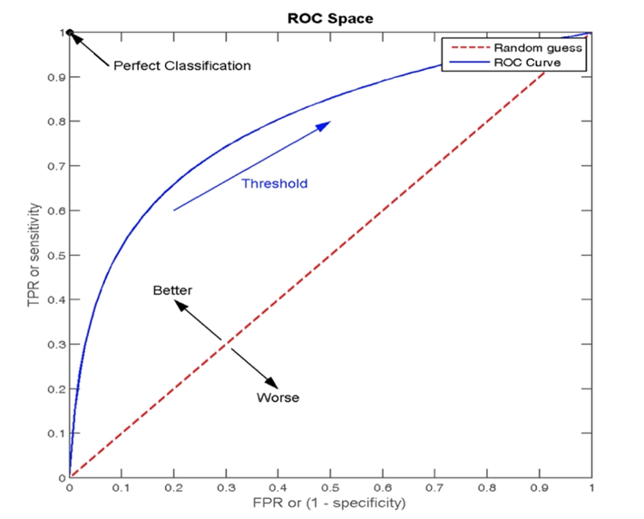
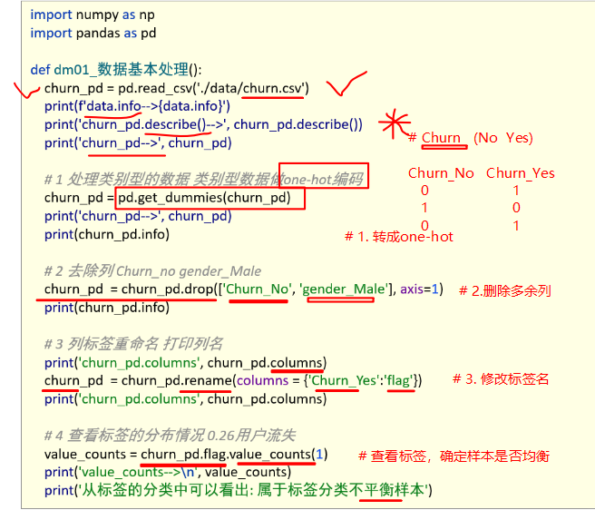

## 1、逻辑回归简介

### 1.1 应用场景

逻辑回归（Logistic Regression）是一种广泛应用于**分类问题**的统计学习方法，尤其适用于**二分类**问题（也可以扩展到多分类）


### 1.2 数学知识

#### 1.2.1 sigmoid函数







**求导过程：**

> **步骤 1：改写函数形式**
>
> 将 Sigmoid 函数改写为指数形式：
>
> $$
> \sigma(z) = (1 + e^{-z})^{-1}
> $$
>
> **步骤 2：应用链式法则求导**
>
> 对 $\sigma(z)$ 关于 $z$ 求导：
>
> $$
> \begin{aligned}
> \frac{d}{dz}\sigma(z) &= \frac{d}{dz} \left(1 + e^{-z}\right)^{-1} \\
> &= -1 \cdot \left(1 + e^{-z}\right)^{-2} \cdot \frac{d}{dz}(1 + e^{-z}) \quad \text{(链式法则)} \\
> &= -\left(1 + e^{-z}\right)^{-2} \cdot (-e^{-z}) \\
> &= \frac{e^{-z}}{(1 + e^{-z})^2}
> \end{aligned}
> $$
>
> **步骤 3：化简导数表达式**
>
> 将导数表示为 Sigmoid 函数本身：
>
> $$
> \begin{aligned}
> \sigma'(z) &= \frac{e^{-z}}{(1 + e^{-z})^2} \\
> &= \left(\frac{1}{1 + e^{-z}}\right) \cdot \left(\frac{e^{-z}}{1 + e^{-z}}\right) \\
> &= \sigma(z) \cdot \left(1 - \sigma(z)\right) \quad \text{因为 } \frac{e^{-z}}{1 + e^{-z}} = 1 - \frac{1}{1 + e^{-z}}
> \end{aligned}
> $$
>


#### 1.2.2 概率

##### 1. 基本概念定义

###### a、概率

- **定义**：衡量某事件发生的可能性大小的数值，取值范围 [0,1]
- **示例**：
  - 北京早上堵车概率：P(A) = 0.7
  - 中午堵车概率：P(B) = 0.3
  - 晚上堵车概率：P(C) = 0.4


###### b、联合概率 

- **定义**：两个或多个事件同时发生的概率
- **计算公式**（独立事件）：$  P(A \cap B) = P(A) \times P(B)$
- **示例**：
  - 周一早上和周二早上都堵车的概率：$P(A_1 \cap A_2) = 0.7 \times 0.7 = 0.49$


###### c、条件概率

**定义**：在已知事件B发生的情况下，事件A发生的概率  

**计算公式**：  

$$
P(A|B) = \frac{P(A \cap B)}{P(B)}
$$

**关键点**：  

- 描述事件间的依赖关系  
- 当A、B独立时，$P(A|B) = P(A)$  


##### 2. 概念对比与示例分析

| 概念     | 符号表示 | 计算公式            | 独立性影响         |
| :------- | :------- | :------------------ | :----------------- |
| 联合概率 | P(A∩B)   | P(A)×P(B)（独立时） | 独立事件可直接相乘 |
| 条件概率 | P(A\|B)  | P(A∩B)/P(B)         | 独立时P(A\|B)=P(A) |


##### 3. 典型案例分析  
**场景：北京堵车概率**  

- 早上堵车 P(A) = 0.7  
- 中午堵车 P(B) = 0.3  

---

**案例1（联合概率正确应用）**  

**事件**：周一早上和周二早上都堵车  

**公式**：  
$$
P(A_1 \cap A_2) = 0.7 \times 0.7 = 0.49
$$
**解释**：两事件独立，联合概率为概率乘积。  

---

**案例2（条件概率常见误区纠正）**  

**错误理解**：  
$$
P(\text{中午} \mid \text{早上}) = 0.7 \times 0.3 = 0.21 \quad ❌  
$$

**正确分析**：  
1. **若早晚堵车独立**：  
   $$
   P(B \mid A) = P(B) = 0.3  
   $$
2. **若存在依赖关系**（需额外信息）：  假设早上堵车使中午概率升至 0.5：  
   $$
   P(B \mid A) = 0.5  
   $$
   **关键点**：条件概率不等于联合概率，需明确事件是否独立或依赖。 


#### 1.2.3 极大似然估计

**核心思想**

在模型参数 $w$ 的所有可能取值中，选择使当前观测样本出现概率最大的那个值作为参数的估计值。
**直观理解**：在所有可能的参数中，找出“看起来最像”能产生当前数据的那个参数。


**示例：不均匀硬币的极大似然估计**

**问题描述**：

-  硬币正面概率 $\theta$，反面概率 $1-\theta$  
- 独立抛掷6次，观测结果为 $D = \{\text{正面}, \text{反面}, \text{反面}, \text{正面}, \text{正面}, \text{正面}\}$  
- 目标：基于观测数据 $D$，估计参数 $\theta$


**步骤解析**：  

- **写出似然函数**（观测数据出现的概率）：
   $$
   P(D|\theta) = \theta \times (1-\theta) \times (1-\theta) \times \theta \times \theta \times \theta = \theta^4 (1-\theta)^2
   $$

- **问题转化**：  求函数 $P(D|\theta) = \theta^4 (1-\theta)^2$ 的极大值对应的 $\theta$

- **求解方法**：  
   - 对似然函数取对数（简化计算）：
     $$
     \ln P(D|\theta) = 4 \ln \theta + 2 \ln (1-\theta)
     $$
   - 对 $\theta$ 求导并令导数为零：
     $$
     \frac{d}{d\theta} \ln P(D|\theta) = \frac{4}{\theta} - \frac{2}{1-\theta} = 0
     $$
   - 解得：
     $$
     \theta = \frac{2}{3}
     $$

**结论**：  极大似然估计值为 $\hat{\theta} = \frac{2}{3}$


#### 1.2.4 对数函数

**对数函数：** 

如果 $a^b = N$（$a > 0$，$a \neq 1$），那么 $b$ 叫做以 $a$ 为底 $N$ 的对数，记为 $b = \log_a N$。

**示例**：  

- $\log_{10} 100 = 2$  
- $\log_2 16 = 4$  

**注意**：  $a > 1$ 和 $0 < a < 1$ 时对数函数图像的性质不同。


**对数函数性质**  

1. **积的对数**：  $\log_a MN = \log_a M + \log_a N$  
   
2. **商的对数**：  $\log_a \frac{M}{N} = \log_a M - \log_a N$  
   
3. **幂的对数**：  $\log_a M^n = n \log_a M$  

**条件**：  $a > 0$，$a \neq 1$，$M > 0$，$N > 0$。

**应用**：  利用对数运算性质，可将多个概率连乘的式子转换为对数相加的形式。


## 2、逻辑回归原理

### 2.1 原理

**逻辑回归概念(Logistic Regression)**  
-  一种分类模型，把线性回归的输出，作为逻辑回归的输入  
- 输出范围：(0,1)之间的概率值  

**基本思想**  
1. 线性模型计算：`f(x) = wx + b`  
2. Sigmoid函数映射：将`f(x)`转换为概率值  
   - 阈值判定（如0.5）：  
     - 概率 > 0.5 → 分类为1  
     - 概率 ≤ 0.5 → 分类为0  

**假设函数**  `h(w) = sigmoid(wx + b)`  

  

**在逻辑回归中，当预测结果不对的时候，我们该怎么衡量其损失呢？**

我们来看下图(下图中，设置阈值为0.6)，

 

那么如何去衡量逻辑回归的预测结果与真实结果的差异？


### 2.2 损失函数


## 3、逻辑回归API

### 3.1 API介绍

```python
sklearn.linear_model.LogisticRegression(solver='liblinear', penalty='l2', C=1.0)
```

**参数说明**：

- **solver**（优化算法）：
  - `liblinear`：适合小数据集，训练速度更快
  - `sag`和`saga`：适合大数据集，训练速度更快
  - 支持情况：
    - `newton-cg`、`lbfgs`、`sag`：仅支持L2正则化或无正则化
    - `liblinear`和`saga`：支持L1正则化和L2正则化
- **penalty**：正则化种类（`l1`或`l2`）
- **C**：正则化力度（默认1.0）

> 注意：默认将类别数量少的作为正例


### 3.2 癌症分类案例

#### 3.2.1 数据介绍

- **样本量**：699条样本，11列数据
- **数据结构**：
  - 第1列：检索ID
  - 第2-10列：与肿瘤相关的医学特征
  - 第11列：肿瘤类型数值（2=良性，4=恶性）
- **缺失值**：包含16个缺失值，标记为"?"


#### 3.2.2 分析流程

- 获取数据
- 基本数据处理：
  - 缺失值处理
  - 确定特征值和目标值
  - 数据分割
- 特征工程（标准化）
- 机器学习（逻辑回归）
- 模型评估


#### 3.2.3 代码实现

```python
# 0. 导入库
import pandas as pd
from sklearn.model_selection import train_test_split
from sklearn.preprocessing import StandardScaler
from sklearn.linear_model import LogisticRegression
from sklearn.metrics import accuracy_score
import numpy as np

# 1. 加载数据
data = pd.read_csv('breast-cancer-wisconsin.csv')

# 2. 数据处理
# 2.1 缺失值处理
data = data.replace(to_replace='?', value=np.NAN)
data = data.dropna()

# 2.2 获取特征和目标值
X = data.iloc[:, 1:-1]  # 特征：第2到倒数第2列
y = data['Class']       # 目标：最后一列

# 2.3 数据划分
x_train, x_test, y_train, y_test = train_test_split(X, y, test_size=0.2, random_state=22)

# 3. 特征工程（标准化）
pre = StandardScaler()
x_train = pre.fit_transform(x_train)
x_test = pre.transform(x_test)

# 4. 模型训练
model = LogisticRegression()
model.fit(x_train, y_train)

# 5. 模型预测和评估
y_predict = model.predict(x_test)
print("预测结果:", y_predict)
print("准确率:", accuracy_score(y_test, y_predict))
```


## 4、分类评估方法

### 4.1 混淆矩阵


#### **4.1.1 基本概念**

混淆矩阵是用于评估分类模型性能的N×N表格（二分类时为2×2），直观展示预测结果与实际类别的对比关系。

| 实际\预测      | 预测为正类(Positive) | 预测为负类(Negative) | 总计  |
| :------------- | :------------------- | :------------------- | :---- |
| **实际为正类** | TP (真正例)          | FN (伪反例)          | P     |
| **实际为负类** | FP (伪正例)          | TN (真反例)          | N     |
| **总计**       | P'                   | N'                   | Total |


**核心指标解析：**

- 真实值是 **正例** 的样本中，被分类为 **正例** 的样本数量有多少，这部分样本叫做真正例（TP，True Positive）
- 真实值是 **正例** 的样本中，被分类为 **假例** 的样本数量有多少，这部分样本叫做伪反例（FN，False Negative）
- 真实值是 **假例** 的样本中，被分类为 **正例** 的样本数量有多少，这部分样本叫做伪正例（FP，False Positive）
- 真实值是 **假例** 的样本中，被分类为 **假例** 的样本数量有多少，这部分样本叫做真反例（TN，True Negative）

| 术语组成              | 含义说明                                  |
| :-------------------- | :---------------------------------------- |
| **True/False**        | 表示预测是否正确（True=正确，False=错误） |
| **Positive/Negative** | 表示模型的预测结果                        |


#### 4.1.2 衍生评估指标

基于混淆矩阵可计算多个重要指标：


##### a、Precision（精确率）


精确率也叫做查准率，指的是**对正例样本的预测准确率**。比如：我们把恶性肿瘤当做正例样本，则我们就需要知道模型对恶性肿瘤的预测准确率。

$$
P=\frac{TP}{TP+FP}
$$


##### b、Recall（召回率）

召回率也叫做查全率，指的是**预测为真正例样本占所有真实正例样本的比重**。例如：我们把恶性肿瘤当做正例样本，则我们想知道模型是否能把所有的恶性肿瘤患者都预测出来。
$$
R=\frac{TP}{TP + FN}
$$


#####  c、F1-score

如果我们对模型的精度、召回率都有要求，希望知道模型在这两个评估方向的综合预测能力如何？则可以使用 F1-score 指标。
$$
F1=\frac{2 \times Precision \times Recall}{Precision + Recall}
$$


**指标说明表：**

| 指标名称   | 别名                | 公式                                                         | 应用场景                               |
| :--------- | :------------------ | :----------------------------------------------------------- | :------------------------------------- |
| **准确率** | Accuracy            | $\frac{TP + TN}{Total}$                                      | 平衡数据集整体评估                     |
| **精确率** | Precision           | $\frac{TP}{TP + FP}$                                         | 重视预测准确性的场景（如垃圾邮件分类） |
| **召回率** | Recall, Sensitivity | $\frac{TP}{TP + FN}$                                         | 重视检出率的场景（如疾病诊断）         |
| **F1分数** | F1-Measure          | $\frac{2 \times Precision \times Recall}{Precision + Recall}$ | 需要平衡精确率和召回率                 |


##### **d、代码实现**

```python
# 1.导入依赖包
from sklearn.metrics import confusion_matrix, precision_score, recall_score, f1_score
import pandas as pd

# 2.构建数据:真实值,预测值
y_true = ['恶性', '恶性', '恶性', '恶性', '恶性', '恶性', '良性', '良性', '良性', '良性']
y_pre_A = ['恶性', '恶性', '恶性', '良性', '良性', '良性', '良性', '良性', '良性', '良性']
y_pre_B = ['恶性', '恶性', '恶性', '恶性', '恶性', '恶性', '恶性', '恶性', '恶性', '良性']

# 3.1 混淆矩阵
# labels=['恶性', '良性']表示混淆矩阵的行和列顺序分别对应“恶性”和“良性”这两个类别。这样可以确保输出矩阵的结构和类别顺序与你的需求一致
A = confusion_matrix(y_true, y_pre_A, labels=['恶性', '良性'])  
print(pd.DataFrame(A, columns=['恶性(正例)', '良性(反例)'], index=['恶性(正例)', '良性(反例)']))

# B = confusion_matrix(y_true, y_pre_B, labels=['恶性', '良性'])
# print(pd.DataFrame(B, columns=['恶性(正例)', '良性(反例)'], index=['恶性(正例)', '良性(反例)']))

# 3.2 精确率
# 通过设置 pos_label='恶性'，函数会将“恶性”视为正类,计算其精确率。选择正类不同，计算结果不同
print(precision_score(y_true, y_pre_A, pos_label='恶性'))  
print(precision_score(y_true, y_pre_B, pos_label='恶性'))

# 3.3 召回率
print(recall_score(y_true, y_pre_A, pos_label='恶性'))
print(recall_score(y_true, y_pre_B, pos_label='恶性'))

# 3.4 f1-score
print(f1_score(y_true, y_pre_A, pos_label='恶性'))
print(f1_score(y_true, y_pre_B, pos_label='恶性'))
```


###  4.2 ROC曲线和AUC指标

####  4.2.1 ROC 曲线

ROC曲线（Receiver Operating Characteristic Curve）是评估二分类模型性能的重要工具，通过展示不同阈值下的分类表现来反映模型的判别能力。

**核心指标定义：**

```python
TPR = TP / (TP + FN)  # 真正例率（True Positive Rate）
FPR = FP / (FP + TN)  # 假正例率（False Positive Rate）
```




**ROC曲线特征点解析：**

| 坐标点     | FPR  | TPR  | 分类器表现                                                   |
| :--------- | :--- | :--- | :----------------------------------------------------------- |
| **(0, 0)** | 0%   | 0%   | 全部预测为负类（最保守）    -所有的正样本都预测为错误，所有的负样本都预测正确 |
| **(1, 0)** | 100% | 0%   | 完全错误分类                           -所有的正样本都预测错误，所有的负样本都预测错误 |
| **(1, 1)** | 100% | 100% | 全部预测为正类（最激进）    -所有的正样本都预测正确，所有的负样本都预测错误 |
| **(0, 1)** | 0%   | 100% | 完美分类器（理想状态）        -所有的正样本都预测正确，所有的负样本都预测正确 |


#### 4.2.2 绘制 ROC 曲线

假设：在网页某个位置有一个广告图片或者文字，该广告共被展示了 6 次，有 2 次被浏览者点击了。每次点击的概率如下：

| 样本 | 是否被点击 | 预测点击概率 |
| :--: | :--------: | :----------: |
|  1   |     1      |     0.9      |
|  2   |     0      |     0.7      |
|  3   |     1      |     0.8      |
|  4   |     0      |     0.6      |
|  5   |     0      |     0.5      |
|  6   |     0      |     0.4      |

根据预测点击概率排序之后：

| 样本 | 是否被点击 | 预测点击概率 |
| :--: | :--------: | :----------: |
|  1   |     1      |     0.9      |
|  3   |     1      |     0.8      |
|  2   |     0      |     0.7      |
|  4   |     0      |     0.6      |
|  5   |     0      |     0.5      |
|  6   |     0      |     0.4      |


**不同阈值下的TPR/FPR计算**

| 阈值    | TPR计算                              | FPR计算                                    | 坐标点(FPR, TPR) |
| :------ | :----------------------------------- | :----------------------------------------- | :--------------- |
| **0.9** | TPR = 1/2 = 0.5 (3号被错误分类)      | FPR = 0/4 = 0 (无负样本被误判)             | (0, 0.5)         |
| **0.8** | TPR = 2/2 = 1.0 (所有正样本正确分类) | FPR = 0/4 = 0 (无负样本被误判)             | (0, 1)           |
| **0.7** | TPR = 2/2 = 1.0                      | FPR = 1/4 = 0.25 (2号被错误分类)           | (0.25, 1)        |
| **0.6** | TPR = 2/2 = 1.0                      | FPR = 2/4 = 0.5 (2号、4号被错误分类)       | (0.5, 1)         |
| **0.5** | TPR = 2/2 = 1.0                      | FPR = 3/4 = 0.75 (2号、4号、5号被错误分类) | (0.75, 1)        |
| **0.4** | TPR = 2/2 = 1.0                      | FPR = 4/4 = 1.0 (所有负样本被错误分类)     | (1, 1)           |


#### 4.2.3 AUC 值

**数学定义：**

AUC（Area Under Curve）是ROC曲线下的面积，量化评估分类模型的整体判别能力：

| 情况         | AUC值   | 原因分析                |
| :----------- | :------ | :---------------------- |
| 完美分类     | 1.0     | 所有正样本得分>负样本   |
| 完全反向预测 | 0.0     | 只需反转预测结果可得1.0 |
| 随机猜测     | 0.5     | 无判别能力              |
| 部分重叠分布 | 0.6-0.8 | 需改进特征工程          |

评估等级标准

| AUC范围 | 模型能力评估 | 业务适用性                 |
| :------ | :----------- | :------------------------- |
| 0.9~1.0 | 极强         | 关键任务系统（如医疗诊断） |
| 0.8~0.9 | 优秀         | 商业级应用                 |
| 0.7~0.8 | 良好         | 一般业务场景               |
| 0.6~0.7 | 一般         | 需优化                     |
| 0.5~0.6 | 弱           | 基本无效                   |
| =0.5    | 无判别力     | 等同随机猜测               |


**AUC计算API**

```python
# y_true：每个样本的真实类别，必须为0(反例),1(正例)标记
from sklearn.metrics import roc_auc_score
roc_auc_score(y_true, y_pre_A)
```


####  **4.2.4 分类评估报告api**

```python
sklearn.metrics.classification_report(y_true, y_pred, labels=[], target_names=None )
  '''
  y_true：真实目标值
  y_pred：估计器预测目标值
  labels:指定类别对应的数字
  target_names：目标类别名称
  return：每个类别精确率与召回率
  '''
```


## 5、电信客户流失预测


### 5.1 数据集介绍

- 流失用户指的使用过产品因为某些原因不再使用该产品。随着产品的更新迭代，都会存在一定的流失情况，这时正常现象。流失用户的比例和变化趋势能够反映该产品当前是否存在问题以及未来的发展趋势。
- 当用户群体庞大时，有限的人力和精力不能为每个用户都投入大量的时间。如果公司可以预测哪些用户可能提前流失，这样就能将主要精力聚焦于这些用户，实施有效的用户挽留策略，提高用户粘性。
- 本项目旨在通过分析特征属性确定用户流失的原因，以及哪些因素可能导致用户流失。建立预测模型来判断用户是否流失，并提出用户流失预警策略。
- 具体数据说明如下：数据集中总计7043条数据，21个特征字段，最终分类特征为Churn：用户是否流失，具体内容如下所示：
  customerID：用户ID
  gender：性别
  SeniorCitizen：是否是老人
  Partner：是否有伴侣
  Dependents：是否有需要抚养的孩子
  tenure：任职
  PhoneService：是否办理电话服务
  MultipleLines：是否开通了多条线路
  InternetService：是否开通网络服务和开通的服务类型（光纤、电话拨号）
  TechSupport：是否办理技术支持服务
  OnlineBackup：是否办理在线备份服务
  OnlineSecurity：是否办理在线安全服务
  DeviceProtection：是否办理设备保护服务
  StreamingTV：是否办理电视服务
  StreamingMovies：是否办理电影服务
  Contract：签订合约的时长
  PaperlessBilling：是否申请了无纸化账单
  PaymentMethod：付款方式（电子支票、邮寄支票、银行自动转账、信用卡自动转账）
  MonthlyCharges：月消费
  TotalCharges：总消费
  Churn：用户是否流失



### 处理流程

1、数据基本处理

 	查看数据的基本信息

​	对类别数据数据进行one-hot处理

​	查看标签分布情况

2、特征筛选

​	分析哪些特征对标签值影响大

​	初步筛选出对标签影响比较大的特征，形成x、y

3、模型训练

​	模型训练

​	交叉验证网格搜索等

4、模型评估

​	精确率

​	Roc_AUC指标计算

###  案例实现


## 作业

1. 使用思维导图总结逻辑回归的内容


2. 理解分类评估方法并进行详细的描述


3.动手实现癌症分类和电信用户流失案例(数据处理，特征工程，CV。。。。)