## 1、决策树简介

### 1.1 决策树例子

**决策树(Decision Tree)**是一种监督学习算法，通过树状结构对数据进行分类或回归。其核心思想源于人类日常决策过程中的if-else逻辑判断。


以相亲决策为例，比如：你母亲要给你介绍男朋友，是这么来对话的：

女儿：多大年纪了？

母亲：26。

女儿：长的帅不帅？

母亲：挺帅的。

女儿：收入高不？

母亲：不算很高，中等情况。

女儿：是公务员不？

母亲：是，在税务局上班呢。

女儿：那好，我去见见。

于是你在脑袋里面就有了下面这张图：

 ```mermaid
flowchart TD
    A[年龄 > 30岁?] -->|是| B[不见]
    A -->|否| C[长相帅吗?]
    C -->|不帅| D[不见]
    C -->|帅| E[收入高吗?]
    E -->|高| F[见]
    E -->|中等| G[是公务员吗?]
    G -->|是| H[见]
    G -->|否| I[不见]
 ```

 作为女孩的你在决策过程就是典型的分类树决策。相当于通过年龄、长相、收入和是否公务员对将男人分为两个类别：见和不见。


### 1.2 决策树简介

#### **1.2.1 决策树简介**

**定义**：决策树是一种树形结构，其中：

- **内部节点**：表示对某一特征的判断
- **分支**：代表判断结果的输出
- **叶子节点**：对应最终的分类结果


#### **1.2.2 决策树的建立过程**

- **特征选择**
  - 目标：选取分类能力强的特征（如通过信息增益、信息增益率，基尼系数等指标评估）。
- **决策树生成**
  - 递归划分数据，生成树结构，直到满足停止条件（如节点纯度达标、深度限制等）。
- **剪枝（Pruning）**
  - **目的**：缓解过拟合，提升模型泛化能力。
  - **方法**：预剪枝（提前终止分裂）或后剪枝（生成树后剪枝）。


## 2、ID3决策树

### 2.1 信息熵

#### **2.1.1 信息熵的定义**

- **概念**：信息熵（**Entropy**）度量随机变量的不确定性，熵越大，数据越混乱；熵越小，数据越纯净。

- **公式**：
  $$
  \large
  H = -\sum_{i=1}^{k}p_i\log_2(p_i)
  $$

  - $p_i$：第 $i$ 类样本所占比例
  - $k$：类别总数


#### **2.1.2 熵的计算示例**

| **数据分布**                                   | **熵值**                                                     |
| :--------------------------------------------- | :----------------------------------------------------------- |
| 假如有三个类别，分别占比为：{1/3,1/3,1/3}      | 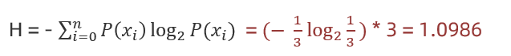 |
| 假如有三个类别，分别占比为：{1/10, 2/10, 7/10} | 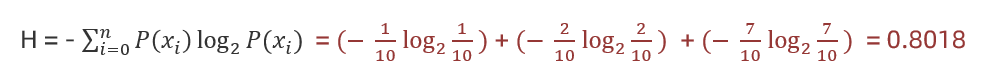 |
| 假如有三个类别，分别占比为：{1,0,0}            | 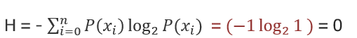 |

**结论**：

- 熵的范围：$0 \leq H(X) \leq \log_2(k)$
- **熵越低**，数据分类越明确；**熵越高**，数据越混乱。


**证明：熵的范围：$$0 \leq H(X) \leq \log_2(k)$$**

> **下界证明 $$(H(X) \geq 0)$$**  
>
> - 当数据完全确定时（某类别概率=1，其余=0）：  
>   - 由熵公式：$$H(X) = -\sum p_i \log_2 p_i$$  
>   - 对于 $$p_i = 1$$，有 $$\log_2 1 = 0$$；对于 $$p_i = 0$$，约定 $$0 \log_2 0 = 0$$  
>   - 因此 $$H(X) = 0$$  
>
> - 其他情况：概率 $$p_i \in (0, 1)$$，故 $$-\log_2 p_i > 0$$，熵值非负。  
>
> 
>
> **上界证明 $$(H(X) \leq \log_2 k)$$**  
>
> - 均匀分布的熵最大：  
>   - 当所有类别概率相等（$$p_i = \frac{1}{k}$$）时：  
>     $$
>     H(X) = -\sum_{i=1}^{k} \frac{1}{k} \log_2 \frac{1}{k} = \log_2 k
>     $$


### 2.2 信息增益

**定义：**特征 $A$ 对训练数据集 $D$ 的信息增益 $g(D,A)$，定义为集合 $D$ 的熵 $H(D)$ 与特征 $A$ 给定条件下的熵 $H(D∣A)$ 之差：
$$
\large
g(D,A)=H(D)-H(D|A)
$$

**作用**：表示由于特征 $A$ 而使得对数据 $D$ 的分类不确定性减少的程度。

**选择特征的方法**

- 计算每个特征的信息增益。
- 选择信息增益最大的特征进行划分。


**示例分析**

**数据集**（特征 $a$ 与目标值）：

| 特征 $a$ | 目标值 |
| :------- | :----- |
| α        | A      |
| α        | A      |
| β        | B      |
| α        | A      |
| β        | B      |
| α        | B      |


**计算步骤：**

- **计算熵 $H(D)$**：

   - 目标值分布：3个A，3个B

   $$
   H(D) = -\left(\frac{3}{6} \log_2 \frac{3}{6} + \frac{3}{6} \log_2 \frac{3}{6}\right) = 1
   $$

- **计算条件熵 $H(D|a)$**：
   - **特征 $a = α$**（4个样本）：3A, 1B
   $$
   H(D|α) = -\left(\frac{3}{4} \log_2 \frac{3}{4} + \frac{1}{4} \log_2 \frac{1}{4}\right) = 0.81
   $$
   - **特征 $a = β$**（2个样本）：2B
   $$
   H(D|β) = -\left(\frac{2}{2} \log_2 \frac{2}{2}\right) = 0
   $$
   - **加权平均**：

   $$
   H(D|a) = \frac{4}{6} \times 0.81 + \frac{2}{6} \times 0 = 0.54
   $$

- **计算信息增益 $g(D, a)$**：
   $$
   g(D, a) = H(D) - H(D|a) = 1 - 0.54 = 0.46
   $$


> 关键点总结
>
> - **熵 $H(D)$**：衡量数据集的混乱程度
> - **条件熵 $H(D|A)$**：在已知特征 $A$ 的条件下，数据集的混乱程度
> - **信息增益**：通过引入特征 $A$，分类不确定性的减少量。值越大，特征越重要


### 2.3 ID3树构建流程

#### 2.3.1 基本概念

ID3算法是一种经典的决策树学习算法，通过计算信息增益来选择特征进行节点分裂。


#### 2.3.2 构建流程

- 计算每个特征的信息增益
- 使用信息增益最大的特征将数据集 $S$ 拆分为子集
- 使用该特征（信息增益最大的特征）作为决策树的一个节点
- 递归进行上述过程直到满足停止条件


#### 2.3.3 案例分析：论坛用户流失预测

已知：某一个论坛客户流失率数据

需求：考察性别、活跃度特征哪一个特征对流失率的影响更大


分析：15条样本：5正样本、10个负样本

- 计算熵

- 计算性别信息增益

- 计算活跃度信息增益

- 比较两个特征的信息增益 

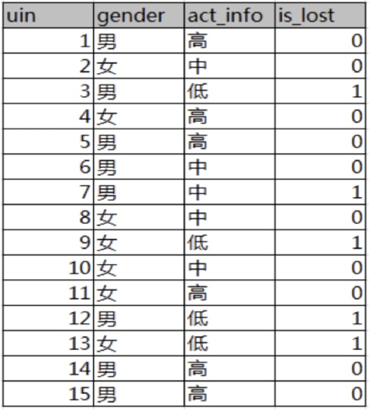

数据样本

| uin  | gender | act_info | is_lost           |
| :--- | :----- | :------- | :---------------- |
| 1-15 | 男/女  | 高/中/低 | 0(未流失)/1(流失) |


数据统计

| 类别 | positive(流失) | negative(未流失) | 汇总 |
| :--- | :------------- | :--------------- | :--- |
| 整体 | 5              | 10               | 15   |
| 男性 | 3              | 5                | 8    |
| 女性 | 2              | 5                | 7    |
| 高   | 0              | 6                | 6    |
| 中   | 1              | 4                | 5    |
| 低   | 4              | 0                | 4    |


**关键计算步骤**

- 计算整体信息熵 H(D)

$$
H(D) = -\left(\frac{5}{15}\log_2\frac{5}{15} + \frac{10}{15}\log_2\frac{10}{15}\right) \approx 0.9812
$$

- 计算性别特征的信息增益

$$
 H(D|gender) = \frac{8}{15}\left(-\frac{3}{8}\log_2\frac{3}{8}-\frac{5}{8}\log_2\frac{5}{8}\right) + \frac{7}{15}\left(-\frac{2}{7}\log_2\frac{2}{7}-\frac{5}{7}\log_2\frac{5}{7}\right) \approx 0.9748 
$$

$$
g(D,gender) = H(D)-H(D|gender) \approx 0.0064
$$

- 计算活跃度特征的信息增益

$$
H(D|act) = \frac{6}{15}(0) + \frac{5}{15}\left(-\frac{1}{5}\log_2\frac{1}{5}-\frac{4}{5}\log_2\frac{4}{5}\right) + \frac{4}{15}(0) \approx 0.3036
$$

$$
g(D,act) = H(D)-H(D|act) \approx 0.6776
$$


**结果分析**

- 活跃度特征的信息增益(0.6776)远大于性别特征(0.0064)，对用户流失的影响比性别大。

- **根节点**：因此，第一层分裂应选择"活跃度"作为决策节点
- **分支**：
   - 高活跃度：不流失(6个样本全部为0)
   - 中活跃度：继续分裂(1流失/4未流失)
   - 低活跃度：流失(4个样本全部为1)

> 实际应用中可能需要考虑信息增益比来避免偏向取值多的特征
>
> 连续值特征需要先进行离散化处理


## 3、C4.5决策树

### 3.1 信息增益率

**计算公式**  
$$
\text{Gain\_Ratio}(D, a) = \frac{\text{Gain}(D, a)}{IV(a)}
$$

其中：  
- $\text{Gain\_Ratio}$：信息增益率  
- $\text{Gain}(D, a)$：特征 **$a$** 的信息增益  
- $IV(a)$：分裂信息（内在信息）  


**内在信息(IV)计算**  
$$
IV(a) = -\sum_{v=1}^{V} \frac{D^v}{D} \log_2 \frac{D^v}{D}
$$


**关键特性**  

- 特征值种类越多，内在信息值越大（除以的系数越大）  
- 特征值种类越少，内在信息值越小（除以的系数越小）  


**本质：**  信息增益比是在信息增益基础上**乘以**一个惩罚参数：  

- 特征个数较多时，惩罚参数较小  
- 特征个数较少时，惩罚参数较大  

惩罚参数是数据集以特征A作为随机变量的熵的倒数。


### 3.2 C4.5树构建示例

示例据集  

| 特征a | 特征b | 目标值 |
| ----- | ----- | ------ |
| α     | 1     | A      |
| α     | 2     | A      |
| β     | 3     | B      |
| α     | 4     | A      |
| β     | 5     | B      |
| α     | 6     | B      |


**特征a的信息增益率计算**  

- **信息增益**：  

$$
(-\frac{3}{6} \log_2 \frac{3}{6} - \frac{3}{6} \log_2 \frac{3}{6}) - (\frac{4}{6} \times (-\frac{3}{4} \log_2 \frac{3}{4} - \frac{1}{4} \log_2 \frac{1}{4}) + \frac{2}{6} \times 0) = 1-0.54 = 0.46
$$

- **IV信息熵**：  

$$
-\frac{4}{6}\log_2\frac{4}{6} - \frac{2}{6}\log_2\frac{2}{6} = 0.92
$$

- **信息增益率**：  

$$
\frac{0.46}{0.92} = 0.5
$$


**特征b的信息增益率计算**  

1. **信息增益**：  
$$
(-\frac{3}{6} \log_2 \frac{3}{6} - \frac{3}{6} \log_2 \frac{3}{6}) - 6*0 = 1
$$

2. **IV信息熵**：  
$$
-6 \times \left(\frac{1}{6}\log_2\frac{1}{6}\right) = 2.58
$$

3. **信息增益率**：  

$$
\frac{1}{2.58} \approx 0.39
$$


**结果分析：**  特征a的信息增益率(0.5) > 特征b的信息增益率(0.39)，因此应选择特征a作为分裂特征。  

**总结：**  C4.5决策树通过引入信息增益率，有效解决了ID3算法中偏向选择取值较多特征的问题。它通过内在信息(IV)对信息增益进行归一化，使得决策树构建更加合理。


## 4、CART决策树

### 4.1 Cart树简介

**CART**（Classification and Regression Trees）是一种二叉树结构，可用于分类和回归任务。其主要特点：

- 每个非叶节点只有两个分支（二叉树结构）
- **Cart回归树**使用**平方误差最小化策略**作为特征选择标准，**Cart分类生成树**采用的**基尼指数最小化策略**作为特征选择标准
- 能够处理连续型和离散型特征


###  4.2 基尼指数计算方法


**基尼不纯度公式：**
$$
\text{Gini}(D) = 1 - \sum_{i=1}^{k} p_i^2
$$
其中$p_i$是第i类样本在数据集D中的比例


**特征基尼指数：**
$$
\text{Gini\_index}(D, a) = \sum_{v=1}^{V} \frac{D^v}{D} \text{Gini}(D^v)
$$


**总结：**

- 信息增益（ID3）、信息增益率值越大（C4.5），则说明优先选择该特征。

- 基尼指数值越小（cart），则说明优先选择该特征。


###  4.3 基尼指数计算举例

| 样本 | 是否有房 | 婚姻状况 | 年收入(千) | 是否违约 |
| ---- | -------- | -------- | ---------- | -------- |
| 1    | yes      | single   | 125        | no       |
| 2    | no       | married  | 100        | no       |
| 3    | no       | single   | 70         | no       |
| 4    | yes      | married  | 120        | no       |
| 5    | no       | divorced | 95         | yes      |
| 6    | no       | married  | 60         | no       |
| 7    | yes      | divorced | 220        | no       |
| 8    | no       | single   | 85         | yes      |
| 9    | no       | married  | 75         | no       |
| 10   | no       | single   | 90         | yes      |


**计算步骤：**

#### **a、是否有房特征计算：**

- **有房子集**(1,4,7)：3个no

$$
Gini = 1 - (0/3)^2 - (3/3)^2 = 0
$$

- **无房子集**(其他)：4个no, 3个yes


$$
Gini =1 - (3/7)^2 - (4/7)^2 ≈ 0.4898
$$

- **总体基尼指数：**


$$
Gini\_index =\frac{3}{10}×0 + \frac{7}{10}×0.4898 ≈ 0.343
$$


#### **b、婚姻状况特征计算**

**方案1：married | (single + divorced)**

| 婚姻状态        | 样本数 | no数量 | yes数量 | Gini值 |
| :-------------- | :----- | :----- | :------ | :----- |
| married         | 4      | 4      | 0       | 0      |
| single+divorced | 6      | 3      | 3       | 0.5    |

- **married组**
  

$$
Gini = 1 - (0/4)^2 - (4/4)^2 = 0
$$

- **single/divorced组**


$$
Gini = 1 - (3/6)^2 - (3/6)^2 = 0.5
$$

- **总体基尼指数**：

$$
Gini\_index =\frac{4}{10}×0 + \frac{6}{10}×0.5 = 0.3
$$


**方案2：single | (married + divorced)**

| 婚姻状态           | 样本数 | no数量 | yes数量 | Gini值 |
| :----------------- | :----- | :----- | :------ | :----- |
| single             | 4      | 2      | 2       | 0.5    |
| married + divorced | 6      | 5      | 1       | 0.278  |

- **single组**
  

$$
Gini(D_{single}) = 1 - \left(\frac{2}{4}\right)^2 - \left(\frac{2}{4}\right)^2 = 0.5
$$

- **married+divorced组**


$$
Gini(D_{married+divorced}) = 1 - \left(\frac{5}{6}\right)^2 - \left(\frac{1}{6}\right)^2 \approx 0.278
$$

- **综合基尼指数**：

$$
Gini\_index = \frac{4}{10} \times 0.5 + \frac{6}{10} \times 0.278 \approx 0.3668
$$

**方案3：divorced | (single + married)**

| 婚姻状态       | 样本数 | no数量 | yes数量 | Gini值 |
| :------------- | :----- | :----- | :------ | :----- |
| divorced       | 2      | 1      | 1       | 0.5    |
| single+married | 8      | 6      | 2       | 0.375  |

1. **divorced组**（2个样本）：
   $$
   Gini(D_{divorced}) = 1 - \left(\frac{1}{2}\right)^2 - \left(\frac{1}{2}\right)^2 = 0.5
   $$

2. **single+married组**（8个样本）：
   $$
   Gini(D_{single+married}) = 1 - \left(\frac{6}{8}\right)^2 - \left(\frac{2}{8}\right)^2 = 0.375
   $$

3. **综合基尼指数**：
   $$
   Gini_{index} = \frac{2}{10} \times 0.5 + \frac{8}{10} \times 0.375 = 0.4
   $$


**完整方案比较**

| 分裂方案                     | 基尼指数 |
| ---------------------------- | -------- |
| married \| (single+divorced) | 0.3      |
| single \| (married+divorced) | 0.367    |
| divorced \| (single+married) | 0.4      |

**最优分裂方案**：`married | (single+divorced)`（基尼指数0.3）


#### **c、年收入连续特征计算**

**连续属性分裂点选择步骤**

- **排序属性值**：将数值型属性按升序排列  
- **计算相邻中点**：计算相邻属性值的中间值作为候选分裂点  
- **计算基尼指数**：对每个候选分裂点，将样本划分为两部分，分别计算两部分的基尼不纯度，加权求和得到分裂点的基尼指数  
- **选择最优分裂点**：选择基尼指数最小的分裂点 


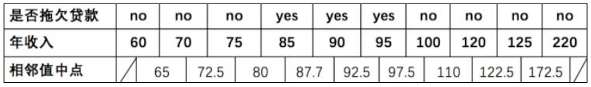

> 候选分裂点计算，相邻值中点：65, 72.5, 80, 87.5, 92.5, 97.5, 110, 122.5, 172.5


**基尼指数公式**

对于分裂点$s$：
$$
Gini_{index}(s) = \frac{D_1}{D}Gini(D_1) + \frac{D_2}{D}Gini(D_2)
$$
其中：
$$
Gini(D) = 1 - \sum_{k=1}^K p_k^2
$$

以年收入65将样本分成两部分，计算基尼指数：


- **左子集Gini(D₁)**：  
  $$
  Gini(D₁) = 1 - \left( \frac{1}{1} \right)^2 - \left( \frac{0}{1} \right)^2 = 0
  $$
  
- **右子集Gini(D₂)**：  
  $$
  Gini(D₂) = 1 - \left( \frac{6}{9} \right)^2 - \left( \frac{3}{9} \right)^2 = 1 - \frac{36}{81} - \frac{9}{81} = \frac{36}{81} \approx 0.444
  $$

- **加权基尼指数：**

$$
Gini_{split}(65) = \frac{|D₁|}{|D|} \cdot Gini(D₁) + \frac{|D₂|}{|D|} \cdot Gini(D₂) = \frac{1}{10} \times 0 + \frac{9}{10} \times 0.444 \approx 0.4
$$


以此类推，得出以下计算结果：

| 分裂点 | 65   | 72.5  | 80    | 87.5  | 92.5 | 97.5 | 110   | 122.5 | 172.5 |
| ------ | ---- | ----- | ----- | ----- | ---- | ---- | ----- | ----- | ----- |
| Gini   | 0.4  | 0.375 | 0.343 | 0.417 | 0.4  | 0.3  | 0.343 | 0.375 | 0.4   |

**最优分裂点**：**97.5**（对应最小基尼指数0.3）


此时，我们发现：

- 以是否有房作为分裂点的基尼指数为：0.343
- 以婚姻状况为分裂特征、以 married 作为分裂点的基尼指数为：0.3
- 以年收入作为分裂特征、以 97.5 作为分裂点的的基尼指数为：0.3

在同样的基尼指数的情况下，两个特征都可以选择作为根节点。通常会选择更简单或更易解释的特征，分类变量通常在解释性上更有优势。

重复上面步骤，直到每个叶子结点纯度达到最高。


### 4.4 比较

| **名称** | **提出时间** | **分支方式** | **特点**                                                     |
| -------- | ------------ | ------------ | ------------------------------------------------------------ |
| ID3      | 1975         | 信息增益     | 1.ID3只能对离散属性的数据集构成决策树  2.倾向于选择取值较多的属性 |
| C4.5     | 1993         | 信息增益率   | 1.缓解了ID3分支过程中总喜欢偏向选择值较多的属性  2.可处理连续数值型属性，也增加了对缺失值的处理方法  3.只适合于能够驻留于内存的数据集,大数据集无能为力 |
| CART     | 1984         | 基尼指数     | 1.可以进行分类和回归，可处理离散属性，也可以处理连续属性  2.采用基尼指数，计算量减小  3.一定是二叉树 |


## 5、泰坦尼克号生存案例

### 5.1 案例背景

泰坦尼克号沉没是历史上最著名的沉船事件。1912年4月15日，在她的处女航中，泰坦尼克号在与冰山相撞后沉没，在2224名乘客和船员中造成1502人死亡。这场耸人听闻的悲剧震惊了国际社会，并为船舶制定了更好的安全规定。 造成海难失事的原因之一是乘客和船员没有足够的救生艇。尽管幸存下来有一些运气因素，但有些人比其他人更容易生存，例如妇女，儿童和社会地位较高的人群。 在这个案例中，我们要求您完成对哪些人可能存活的分析。


### 5.2 数据集特征

| 字段名      | 说明                | 示例值                       |
| ----------- | ------------------- | ---------------------------- |
| PassengerId | 乘客ID              | 1, 2, 3...                   |
| Survived    | 是否存活（0/1）     | 0=遇难, 1=存活               |
| Pclass      | 舱位等级（1-3）     | 1=头等舱, 3=三等舱           |
| Name        | 乘客姓名            | "Braund, Mr. Owen Harris"    |
| Sex         | 性别                | male/female                  |
| Age         | 年龄                | 22, 38, 26...                |
| SibSp       | 同船兄弟姐妹/配偶数 | 0, 1...                      |
| Parch       | 同船父母/子女数     | 0, 1...                      |
| Ticket      | 船票编号            | A/5 21171                    |
| Fare        | 票价                | 7.25, 71.28...               |
| Cabin       | 船舱号              | C85, NaN（缺失）             |
| Embarked    | 登船港口            | S(Southampton), C(Cherbourg) |


### 5.3 决策树API关键参数
```python
sklearn.tree.DecisionTreeClassifier(
    criterion='gini',      # 分裂标准：基尼系数("gini")或信息增益("entropy")。一默认"gini"，即CART算法。
    max_depth=None,        # 树的最大深度（控制过拟合）
    # 
  	min_samples_split=2,   # 节点继续分裂的最小样本数，这个值限制了子树继续划分的条件，如果某节点的样本数少于min_samples_split，则不会继续再尝试选择最优特征来进行划分。 默认是2.如果样本量不大，不需要管这个值。如果样本量数量级非常大，则推荐增大这个值。
    min_samples_leaf=1,    # 叶节点最小样本数，这个值限制了叶子节点最少的样本数，如果某叶子节点数目小于样本数，则会和兄弟节点一起被剪枝。 默认是1,可以输入最少的样本数的整数，或者最少样本数占样本总数的百分比。如果样本量不大，不需要管这个值。如果样本量数量级非常大，则推荐增大这个值。
    random_state=None      # 随机种子（确保结果可复现）
)
```

**参数详解**

| 参数                  | 作用                                   | 推荐设置                            |
| :-------------------- | :------------------------------------- | :---------------------------------- |
| **criterion**         | 分裂质量评估标准                       | 小数据集选"entropy"，大数据选"gini" |
| **max_depth**         | 限制树深度防止过拟合                   | 通常设为3-10                        |
| **min_samples_split** | 节点分裂的最小样本数（值越大树越简单） | 大数据集建议≥10                     |
| **min_samples_leaf**  | 叶节点最小样本数（避免异常值分裂）     | 大数据集建议≥5                      |
| **random_state**      | 固定随机种子                           | 设为任意整数（如42）                |


### 5.4 案例实现

```python
# 1.导入依赖包
import pandas as pd
from sklearn.model_selection import train_test_split
from sklearn.tree import DecisionTreeClassifier
from sklearn.metrics import classification_report
from sklearn.tree import plot_tree
import matplotlib.pyplot as plt


# 2.读取数据及预处理
# 2.1 读取数据
data =pd.read_csv('./titanic/train.csv')

# 2.2 数据处理
# x = data[['Pclass','Sex','Age']] 这样从原始 DataFrame 选取部分列时，x 可能是原数据的“视图”或“副本”，Pandas 无法保证后续对 x 的修改是否会影响原始数据。当你对 x['Age'] 赋值时，就可能触发该警告。为了避免预警，建议使用 .copy() 显式创建副本：
x = data[['Pclass','Sex','Age']].copy()  
y = data['Survived'].copy()

x['Age'].fillna(x['Age'].mean(),inplace = True)
x=pd.get_dummies(x)

x_train,x_test,y_train,y_test=train_test_split(x,y,test_size=0.2)

# 3.模型训练
model =DecisionTreeClassifier()
model.fit(x_train,y_train)

# 4.模型预测与评估
# 4.1 模型预测
y_pre = model.predict(x_test)
# 4.2 模型评估
print(classification_report(y_true=y_test,y_pred=y_pre))
# 4.3 可视化
plot_tree(model)
plt.show()
```

相比其他学习模型，决策树在模型描述上有巨大的优势，决策树的逻辑推断非常直观，具有清晰的可解释性，也有很方便的模型的可视化。在决策树的使用中，无需考虑对数据量化和标准化，就能达到比较好的识别率。


## 6、回归决策树

### 6.1 回归决策树构建原理

**CART回归树 vs 分类树**

| 对比维度       | CART分类树         | CART回归树 |
| :------------- | :----------------- | :--------- |
| 预测输出       | 离散值             | 连续值     |
| 划分依据       | 基尼指数           | 平方损失   |
| 叶子节点预测值 | 出现次数最多的类别 | 样本均值   |


**CART 回归树构建核心公式**

平方损失函数：
$$
\operatorname{Loss}(y, f(x))=(f(x)-y)^{2}
$$


**构建流程（单特征示例）**

假设：数据集只有 1 个特征 x, 目标值值为 y，如下图所示：

| x    | 1    | 2    | 3    | 4    | 5    | 6    | 7    | 8    | 9    | 10   |
| ---- | ---- | ---- | ---- | ---- | ---- | ---- | ---- | ---- | ---- | ---- |
| y    | 5.56 | 5.7  | 5.91 | 6.4  | 6.8  | 7.05 | 8.9  | 8.7  | 9    | 9.05 |

由于只有 1 个特征，所以只需要选择该特征的最优划分点，并不需要计算其他特征。


- **先将特征 x 的值排序，并取相邻元素均值作为待划分点，如下图所示：**

| s    | 1.5  | 2.5  | 3.5  | 4.5  | 5.5  | 6.5  | 7.5  | 8.5  | 9.5  |
| ---- | ---- | ---- | ---- | ---- | ---- | ---- | ---- | ---- | ---- |


- **计算每一个划分点的平方损失，例如：1.5 的平方损失计算过程为：**

R1 为 小于 1.5 的样本个数，样本数量为：1，其输出值为：5.56

R2 为 大于 1.5 的样本个数，样本数量为：9 ，其输出值为：7.50

该划分点的平方损失

**R1损失**：
$$
\sum_{x_i < 1.5}(y_i - c_1)^2 = (5.56 - 5.56)^2 = 0
$$
**R2损失**：
$$
\begin{aligned}
&(5.7-7.5)^2 + (5.91-7.5)^2 + (6.4-7.5)^2 \\
+ &(6.8-7.5)^2 + (7.05-7.5)^2 + (8.9-7.5)^2 \\
+ &(8.7-7.5)^2 + (9-7.5)^2 + (9.05-7.5)^2 \\
= &3.24 + 2.53 + 1.21 + 0.49 + 0.20 + 1.96 + 1.44 + 2.25 + 2.40 \\
= &15.72
\end{aligned}
$$
**总损失**：
$$
m(1.5) = 0 + 15.72 = 15.72
$$


- **以此方式计算 2.5、3.5... 等划分点的平方损失，结果如下所示：**

| s    | 1.5   | 2.5   | 3.5  | 4.5  | 5.5  | 6.5      | 7.5  | 8.5   | 9.5   |
| ---- | ----- | ----- | ---- | ---- | ---- | -------- | ---- | ----- | ----- |
| m(s) | 15.72 | 12.07 | 8.36 | 5.78 | 3.91 | **1.93** | 8.01 | 11.73 | 15.74 |


- **当划分点 s=6.5 时，m(s) 最小。因此，第一个划分变量：特征为 X, 切分点为 6.5，即：j=x,  s=6.5**

   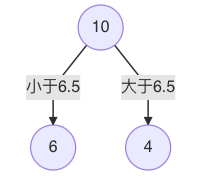

   

- **对左子树的 6 个结点计算每个划分点的平方式损失，找出最优划分点：**

   | x    | 1    | 2    | 3    | 4    | 5    | 6    |
   | ---- | ---- | ---- | ---- | ---- | ---- | ---- |
   | y    | 5.56 | 5.7  | 5.91 | 6.4  | 6.8  | 7.05 |

   | s    | 1.5  | 2.5  | 3.5  | 4.5  | 5.5  |
   | ---- | ---- | ---- | ---- | ---- | ---- |
   | c1   | 5.56 | 5.63 | 5.72 | 5.89 | 6.07 |
   | c2   | 6.37 | 6.54 | 6.75 | 6.93 | 7.05 |

   | s    | 1.5    | 2.5   | 3.5    | 4.5    | 5.5    |
   | ---- | ------ | ----- | ------ | ------ | ------ |
   | m(s) | 1.3087 | 0.754 | 0.2771 | 0.4368 | 1.0644 |

   

- **s=3.5时，m(s) 最小，所以左子树继续以 3.5 进行分裂:**

   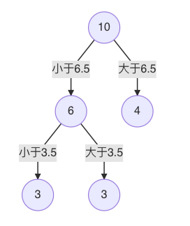

   

- **假设在生成3个区域** 之后停止划分，以上就是回归树。每一个叶子结点的输出为：挂在该结点上的所有样本均值。

| x    | 1    | 2    | 3    | 4    | 5    | 6    | 7    | 8    | 9    | 10   |
| ---- | ---- | ---- | ---- | ---- | ---- | ---- | ---- | ---- | ---- | ---- |
| y    | 5.56 | 5.7  | 5.91 | 6.4  | 6.8  | 7.05 | 8.9  | 8.7  | 9    | 9.05 |


**最终模型预测：**
$$
f(x) = 
\begin{cases} 
5.72 & \text{if } x \leq 3.5 \\
6.42 & \text{if } 3.5 < x \leq 6.5 \\
8.91 & \text{if } x > 6.5
\end{cases}
$$


**CART 回归树构建过程如下：**

1. 选择第一个特征，将该特征的值进行排序，取相邻点计算均值作为待划分点
2. 根据所有划分点，将数据集分成两部分：R1、R2
3. R1 和 R2 两部分的平方损失相加作为该切分点平方损失
4. 取最小的平方损失的划分点，作为当前特征的划分点
5. 以此计算其他特征的最优划分点、以及该划分点对应的损失值
6. 在所有的特征的划分点中，选择出最小平方损失的划分点，作为当前树的分裂点
7. 递归处理子区域，直到满足停止条件


### 6.2 回归决策树实践

已知数据：

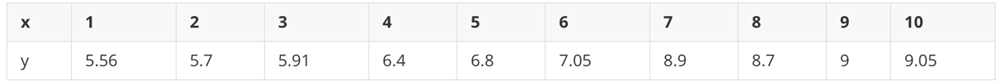

分别训练线性回归、回归决策树模型，并使用1000个[0.0, 10]之间的数据，让模型预测，画出预测值图线

```python
# 1.导入依赖包
import numpy as np
from sklearn.tree import DecisionTreeRegressor
from sklearn.linear_model import LinearRegression
import matplotlib.pyplot as plt

# 2.获取数据
x = np.array(list(range(1,11))).reshape(-1,1)
y = np.array([5.56, 5.70, 5.91, 6.40, 6.80, 7.05, 8.90, 8.70, 9.00, 9.05])


# 3.模型训练
model1 = DecisionTreeRegressor(max_depth=1)
model2 = DecisionTreeRegressor(max_depth=3)
model3 = LinearRegression()

model1.fit(x,y)
model2.fit(x,y)
model3.fit(x,y)


# 4.模型预测
# 4.1 模型预测
x_test = np.arange(0.0, 10.0, 0.01).reshape(-1, 1)
y_pre1 = model1.predict(x_test)
y_pre2 = model2.predict(x_test)
y_pre3 = model3.predict(x_test)


# 4.2 可视化
plt.figure(figsize=(10, 6), dpi=100)
plt.scatter(x, y, label='data')
plt.plot(x_test, y_pre1,label='max_depth=1')  # 深度1层
plt.plot(x_test, y_pre2, label='max_depth=3')   # 深度3层
plt.plot(x_test, y_pre3, label='linear')
plt.xlabel('data')
plt.ylabel('target')
plt.title('DecisionTreeRegressor')
plt.legend()
plt.show()
```


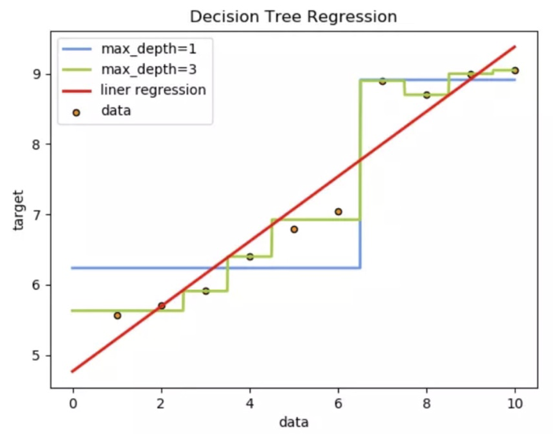

从预测效果来看：

- 线性回归是一条直线


- 决策树是曲线


- 树的拟合能力是很强的，易过拟合


## 7、决策树剪枝

### 7.1 剪枝的基本概念

**定义**：剪枝（Pruning）是决策树算法中用于防止过拟合的核心技术  

**核心目的**：通过主动移除部分分支结构，提升模型的泛化能力  

> 在决策树学习中，为了尽可能正确分类训练样本，结点划分过程将不断重复，有时会造成决策树分支过多，这时就可能因训练样本学得"太好"了，以致于把训练集特有噪声当作所有数据都具有的一般性质而导致过拟合。因此，可通过主动去掉一些分支来降低过拟合的风险。


剪枝是指将一颗子树的子节点全部删掉，利用叶子节点替换子树(实质上是后剪枝技术)，也可以（假定当前对以root为根的子树进行剪枝）只保留根节点本身而删除所有的叶子，以下图为例：

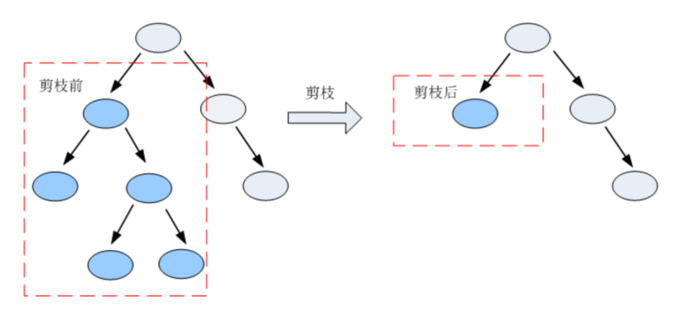 


### 7.2 常见减枝方法汇总

决策树剪枝的基本策略有"预剪枝" (pre-pruning）和"后剪枝"（post- pruning) 。

- 预剪枝是指在决策树生成过程中，对每个结点在划分前先进行估计，若当前结点的划分不能带来决策树泛化性能提升，则停止划分并将当前结点标记为叶结点;

- 后剪枝则是先从训练集生成一棵完整的决策树，然后自底向上地对非叶结点进行考察，若将该结点对应的子树替换为叶结点能带来决策树泛化性能提升，则将该子树替换为叶结点。


**关键对比：预剪枝 vs 后剪枝**

| 对比维度 | 预剪枝                   | 后剪枝                         |
| :------- | :----------------------- | :----------------------------- |
| 执行时机 | 建树过程中               | 建树完成后                     |
| 判断依据 | 节点分裂前的评估         | 整体性能评估                   |
| 计算成本 | 较低                     | 较高                           |
| 常见方法 | 最大深度限制、最小样本数 | 错误率降低剪枝、代价复杂度剪枝 |


### 7.3 例子

在构建树时, 为了能够实现剪枝, 可预留一部分数据用作 "验证集" 以进行性能评估。我们的训练集如下:

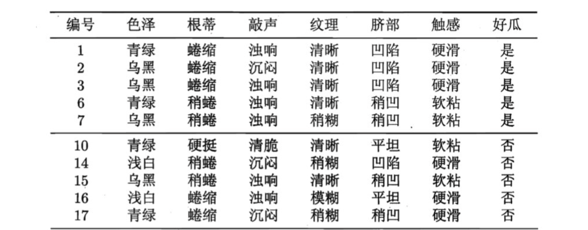


#### 7.3.1 预剪枝


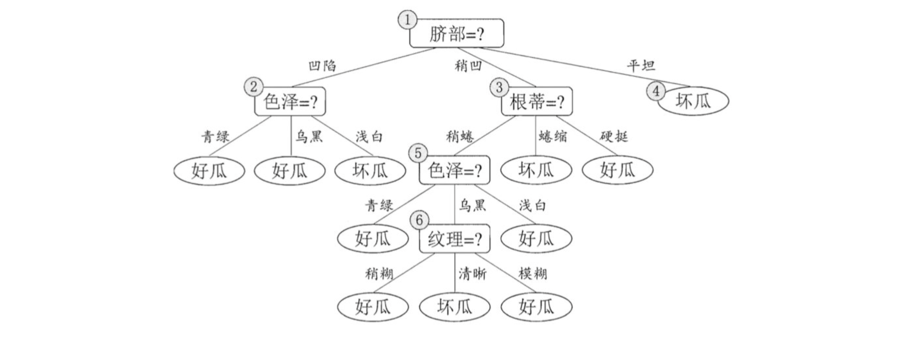

1. 假设: 当前树只有一个结点, 即编号为1的结点. 此时, 所有的样本预测类别为: 其类别标记为训练样例数最多的类别，假设我们将这个叶结点标记为 "好瓜"。此时, 在验证集上所有的样本都会被预测为 "好瓜", 此时的准确率为: 3/7

2. 如果进行此次分裂, 则树的深度为 2, 有三个分支. 在用属性"脐部"划分之后，上图中的结点2、3、4分别包含编号为 {1，2，3， 14}、 {6，7， 15， 17}、 {10， 16} 的训练样例，因此这 3 个结点分别被标记为叶结点"好瓜"、 "好瓜"、 "坏瓜"。此时, 在验证集上 4、5、8、11、12 样本预测正确，准确率为: 5/7。很显然, 通过此次分裂准确率有所提升, 值得分裂.

3. 接下来，对结点2进行划分，基于信息增益准则将挑选出划分属性"色泽"。然而，在使用"色泽"划分后，编号为 {5} 的验证集样本分类结果会由正确转为错误，使得验证集精度下降为 57.1%。于是，预剪枝策略将禁止结点2被划分。

4. 对结点3，最优划分属性为"根蒂"，划分后验证集精度仍为 5/7. 这个 划分不能提升验证集精度，于是，预剪枝策略禁止结点3被划分。

5. 对结点4，其所含训练样例己属于同一类，不再进行划分.

于是，基于预剪枝策略从上表数据所生成的决策树如上图所示，其验证集精度为 71.4%. 这是一棵仅有一层划分的决策树。

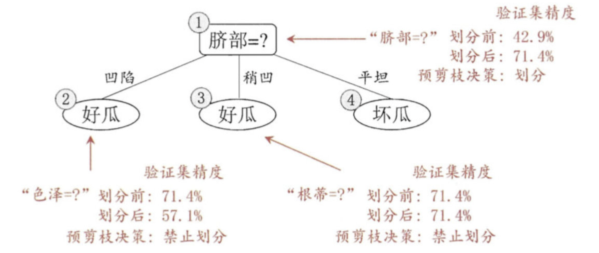


####  7.3.2 后剪枝

后剪枝先从训练集生成一棵完整决策树，继续使用上面的案例，从前面计算，我们知前面构造的决策树的验证集精度为42.9%。

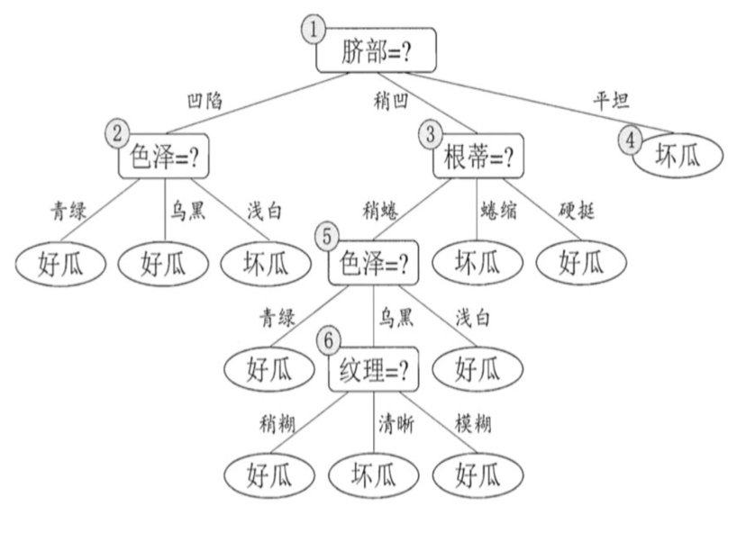

1. 首先考察结点6，若将其领衔的分支剪除则相当于把6替换为叶结点。替换后的叶结点包含编号为 {7， 15} 的训练样本，于是该叶结点的类别标记为"好瓜", 此时决策树的验证集精度提高至 57.1%。

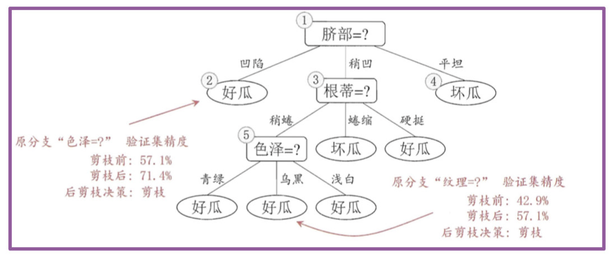

2. 然后考察结点5，若将其领衔的子树替换为叶结点，则替换后的叶结点包含编号为 {6，7，15}的训练样例，叶结点类别标记为"好瓜'；此时决策树验证集精度仍为 57.1%. 于是，可以不进行剪枝.
3. 对结点2，若将其领衔的子树替换为叶结点，则替换后的叶结点包含编号 为 {1， 2， 3， 14} 的训练样例，叶结点标记为"好瓜"此时决策树的验证集精度提高至 71.4%. 于是，后剪枝策略决定剪枝.
4. 对结点3和1，若将其领衔的子树替换为叶结点，则所得决策树的验证集 精度分别为 71.4% 与 42.9%，均未得到提高，于是它们被保留。
5. 最终, 基于后剪枝策略生成的决策树如上图所示, 其验证集精度为 71.4%。


### 7.4 剪枝方法对比

| **对比维度**   | **预剪枝 (Pre-pruning)**                                     | **后剪枝 (Post-pruning)**                                    |
| :------------- | :----------------------------------------------------------- | :----------------------------------------------------------- |
| **执行时机**   | **决策树构建过程中**，在**结点分裂前**进行判断               | **决策树完全生成后**，自底向上剪枝                           |
| **代表方法**   | - 最大深度（`max_depth`） <br />- 最小样本分裂（`min_samples_split`） <br />- 信息增益阈值 | - 错误率降低剪枝（REP） <br />- 悲观剪枝（PEP, C4.5） <br />- 代价复杂度剪枝（CCP, CART） |
| **优点**       | ✅ **训练速度快**（提前终止分支生长） <br />✅ **降低过拟合风险**（避免过度细分） <br />✅ **实现简单**（参数可控） | ✅ **泛化能力更强**（保留更多有效分支） <br />✅ **欠拟合风险低**（基于完整树优化） <br />✅ **决策更全局化**（避免局部最优） |
| **缺点**       | ❌ **可能欠拟合**（过早停止分裂） <br />❌ **依赖验证集**（早期决策可能不准） <br />❌ **可能错过最优分支** | ❌ **计算成本高**（需生成完整树再剪枝） <br />❌ **存储开销大**（需保存整棵树） <br />❌ **实现较复杂**（需设计剪枝准则） |
| **适用场景**   | - 大数据集（训练效率优先） <br />- 实时性要求高（在线学习） <br />- 数据噪声较多（防止过拟合） | - 小/中型数据集（精度优先） <br />- 计算资源充足 <br />- 需要最优泛化性能 |
| **典型库参数** | `max_depth`, `min_samples_split`, `min_impurity_decrease`    | `ccp_alpha`（CART）, 自定义剪枝策略                          |

> 补充：
>
> - 预剪枝缺点：有些分支的当前划分虽不能提升泛化性能，甚至会导致泛化性能降低，但在其基础上进行的后续划分却有可能导致性能的显著提高
