## 1、集成学习简介

### 1.1 什么是集成学习？

集成学习是一种机器学习思想，通过组合多个模型（称为弱学习器或基学习器）来形成一个精度更高的集成模型。训练时，依次训练这些弱学习器；预测时，联合使用它们进行预测。	


**核心思想**

- **传统机器学习**：寻找单一最优分类器（如决策树、逻辑回归）以尽可能将训练数据分开。
- **集成学习**：组合多个分类器，形成预测效果更好的集成分类器。
- **类比**：“三个臭皮匠，赛过诸葛亮”——通过多个弱模型的协作提升整体性能。


**工作原理**

- **生成模型**：独立训练多个分类器/模型。

- **独立预测**：每个模型对未知样本做出预测。

- **组合结果**：综合各模型的预测结果，形成更优的最终预测。


 


### 1.2 集成学习分类

集成学习算法主要分为两类：

| **类型**     | **Bagging（装袋法）**        | **Boosting（提升法）**         |
| :----------- | :--------------------------- | :----------------------------- |
| **核心思想** | 有放回采样生成差异化的训练集 | 关注前序模型的不足进行迭代优化 |
| **样本采样** | 有放回随机采样               | 根据前序模型错误调整样本权重   |
| **训练方式** | 并行独立训练基学习器         | 串行顺序训练基学习器           |
| **结果聚合** | 平均投票或多数表决           | 加权组合预测结果               |
| **典型算法** | 随机森林（Random Forest）    | AdaBoost, GBDT, XGBoost        |


### 1.3 bagging集成

#### 1.3.1 工作流程

- **有放回采样**
  - 通过自助采样法（Bootstrap）从原始训练集中生成多个差异化子数据集。
- **训练基学习器**
  - 每个子数据集独立训练一个基学习器（如决策树）。
- **聚合预测结果**
  - 分类任务：多数投票法
  - 回归任务：平均法

> **核心特点**
>
> - **降低方差**：通过聚合多个模型减少过拟合风险。
> - **并行化**：基学习器训练相互独立，可并行加速。


#### 1.3.2 **例子：**把下面的圈和方块进行分类


### 1.4 boosting集成

通过**串行训练弱学习器**，让后续模型重点关注前一个训练器不足的地方进行训练，最终通过加权投票提升整体预测能力。

> 📌 核心特点：每加入一个新弱学习器，整体性能提升


#### 1.4.1 **工作流程**

Boosting是一组可将弱学习器升为强学习器算法。这类算法的工作机制类似：

- **初始训练**
  从训练集训练第一个基学习器
- **样本调整**
  根据当前学习器错误调整样本分布 → 后续模型更关注错误样本
- **迭代训练**
  基于新样本分布训练下一个基学习器
- **终止条件**
  重复直至达到预设的基学习器数量
- **集成输出**
  加权结合所有基学习器形成强学习器


#### **1.4.2 Boosting vs Bagging 关键对比**

| **维度**       | **Bagging**            | **Boosting**                   |
| :------------- | :--------------------- | :----------------------------- |
| **数据采样**   | 有放回随机采样         | 使用全部数据集                 |
| **样本关注点** | 平等对待所有样本       | 动态调整权重，聚焦前序错误样本 |
| **投票机制**   | 平权投票               | 加权投票（按模型性能赋权）     |
| **训练顺序**   | ⚡️ 并行训练（无依赖性） | ⚡️ 串行训练（强依赖性）         |
| **典型算法**   | 随机森林               | AdaBoost, GBDT, XGBoost        |


## 2、随机森林

### 2.1 算法思想

基于 **Bagging 集成思想** + **决策树基学习器**，通过双重随机性（数据随机+特征随机）构建高独立性弱学习器群体。

**核心优势**

✅ 天然抗过拟合（双重随机性保障）
✅ 高并行效率（树之间无依赖）
✅ 处理高维特征（特征随机选择）


#### 2.1.1 **分步详解**

- **数据采样（行随机）**

  - 有放回抽取 m 条数据（Bootstrap 采样）
  - 允许重复样本，保证每棵树训练集差异

- **特征选择（列随机）**

  - 随机选择 k 个特征（k < 总特征数）
  - 典型设置：k = $\sqrt{总特征数}$

  - 使用 **CART** 算法生成**不剪枝**的决策树
  - 节点分裂时仅考虑随机选择的 k 个特征

- **集成预测**

  - 所有树平权投票（多数表决）

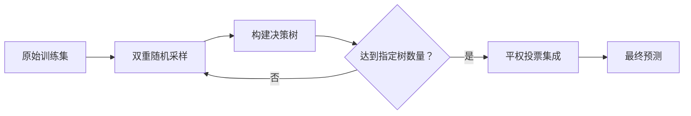


#### **2.1.2 关键机制解析**

**双重随机性设计**

| 随机类型     | 实现方式                 | 核心作用                 |
| :----------- | :----------------------- | :----------------------- |
| **数据随机** | 有放回 Bootstrap 采样    | 打破树间数据一致性       |
| **特征随机** | 节点分裂时随机选特征子集 | 增强树独立性，降低相关性 |


**抗过拟合原理**

> 🌳 **双重随机性** → 🌲 **树高度独立** → 🛡️ **即使单树不剪枝也不易过拟合**


**核心参数说明**

| 参数                            | 作用                   | 典型设置建议                                         |
| :------------------------------ | :--------------------- | :--------------------------------------------------- |
| **树数量 (n_estimators)**       | 森林中决策树总数       | ≥100（越多效果越稳定）                               |
| **特征子集大小 (max_features)** | 每棵树随机选择的特征数 | $\sqrt{总特征数}$（分类问题） 总特征数/3（回归问题） |


#### **2.1.3 关键问题解答**

##### ❓ **为何必须随机抽样？**

> 若所有树使用相同训练集 → 产生高度相似的树 → 集成效果退化为单棵树

##### ❓ **为何采用有放回抽样？**

> - **无放回**：每棵树训练集完全不同 → 单树偏差过大
> - **有放回**：训练集存在重叠但不同 → 平衡**树间差异性**与**单树稳定性**

##### ❓ **为何特征随机选择？**

> 避免少数强特征主导所有树 → 增强模型鲁棒性和泛化能力


**随机森林 vs 标准Bagging**

| 维度         | 随机森林                   | 标准Bagging    |
| :----------- | :------------------------- | :------------- |
| **基学习器** | 必须是决策树               | 任意模型       |
| **特征处理** | 双重随机（数据+特征）      | 仅数据随机     |
| **计算效率** | 更高（特征子集降低计算量） | 取决于基学习器 |

> 💡 **实践提示**：随机森林是实际应用中效果最好的机器学习算法之一，尤其适合结构化数据分类问题。


### **2.2 随机森林 API**

```python
from sklearn.ensemble import RandomForestClassifier
rf = RandomForestClassifier(
    n_estimators=100, 
    criterion='gini',
    max_depth=None,
    max_features='auto',
    bootstrap=True,
    min_samples_split=2,
    min_samples_leaf=1,
    min_impurity_split=1e-7
)
```

**关键参数功能说明**

| 参数                     | 默认值 | 功能说明                                                     | 典型设置建议                                                 |
| :----------------------- | :----- | :----------------------------------------------------------- | :----------------------------------------------------------- |
| **`n_estimators`**       | 10     | 森林中决策树的数量                                           | ▶️ **≥100** <br />▶️ 计算资源允许下越多越好                    |
| **`criterion`**          | `gini` | 分裂质量评估标准                                             | ▶️ `gini`（基尼系数） <br />▶️ `entropy`（信息增益）           |
| **`max_depth`**          | None   | 树的最大深度                                                 | ▶️ None（不限制） <br />▶️ 过拟合时设置5-15                    |
| **`max_features`**       | `auto` | 节点分裂时的特征采样数                                       | ▶️ `auto`=$\sqrt{n\text{-}features}$<br />▶️ `sqrt`=$\sqrt{n\text{-}features}$ <br />▶️ `log2`=$\log_2n\text-features$  <br />▶️ `None`=n-features<br />▶️ 浮点数（比例）<br/>▶️ 整数（绝对数量） |
| **`bootstrap`**          | True   | 是否使用有放回抽样                                           | ▶️ **True**（标准随机森林） <br />▶️ False（使用全体数据）     |
| **`min_samples_split`**  | 2      | 节点分裂所需最小样本数                                       | ▶️ 小数据集：保持默认 <br />▶️ 大数据集：增大（如50+）         |
| **`min_samples_leaf`**   | 1      | 叶节点最小样本数，<br />如果某叶子节点数目小于样本数，则会和兄弟节点一起被剪枝. | ▶️ **≥1** <br />                                              |
| **`min_impurity_split`** | 1e-7   | 节点分裂最小不纯度阈值<br />如果某节点的不纯度(基尼系数，均方差)小于这个阈值，<br />则该节点不再生成子节点，并变为叶子节点. | ▶️ 不建议修改 <br />▶️ 需调整时参考：0.01-0.001                |


#### **2.2.1 重点参数详解**

##### 1.  **`max_features` 特征采样策略**

| 选项              | 计算公式       | 适用场景                |
| :---------------- | :------------- | :---------------------- |
| **'auto'/'sqrt'** | √总特征数      | 分类问题默认选择        |
| **'log2'**        | log₂(总特征数) | 高维特征（特征数>1000） |
| **None**          | 使用全部特征   | 特征数少时（<50）       |
| **浮点数**        | 总特征数×比例  | 精细控制特征子集大小    |

> ⚠️ **注意**：此参数是随机森林**区别于普通Bagging的核心**，直接影响模型多样性和泛化能力


##### 2.  **树生长控制参数**

| 参数                      | 过拟合风险 | 欠拟合风险 | 调整优先级 |
| :------------------------ | :--------- | :--------- | :--------- |
| `max_depth=None`          | ↑↑↑        | ↓          | 高         |
| `min_samples_split=2`     | ↑↑         | ↓          | 中         |
| `min_samples_leaf=1`      | ↑↑         | ↓          | 中         |
| `min_impurity_split=1e-7` | ↑          | ↓          | 低         |

> 💡 **调参口诀**：防过拟合优先调整 `max_depth` 和 `min_samples_leaf`


##### **3. `bootstrap` 的特殊作用**

- **True（默认）**：
  ✅ 实现Bagging的样本随机性
  ✅ 支持OOB（Out-of-Bag）误差估计
- **False**：
  ⚠️ 失去随机森林的双重随机性特征
  ⚠️ 可能降低模型泛化能力


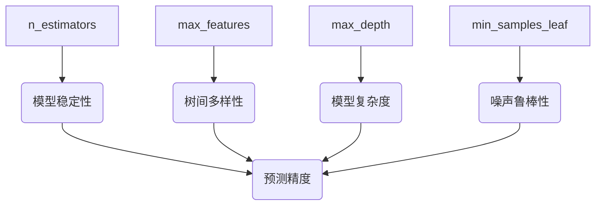


###  2.3 随机森林泰坦尼克号生存预测

这泰坦尼克号案例实战：

``` python
#1.数据导入
#1.1导入数据
import pandas as pd
#1.2.利用pandas的read.csv模块从互联网中收集泰坦尼克号数据集
titanic=pd.read_csv("data/泰坦尼克号.csv")
titanic.info() #查看信息
#2人工选择特征pclass,age,sex
X=titanic[['Pclass','Age','Sex']]
y=titanic['Survived']
#3.特征工程
#数据的填补
X['Age'].fillna(X['Age'].mean(),inplace=True)
X = pd.get_dummies(X)
#数据的切分
from sklearn.model_selection import train_test_split
X_train, X_test, y_train, y_test =train_test_split(X,y,test_size=0.25,random_state=22)


#4.使用单一的决策树进行模型的训练及预测分析
from sklearn.tree import DecisionTreeClassifier
dtc=DecisionTreeClassifier()
dtc.fit(X_train,y_train)
dtc_y_pred=dtc.predict(X_test)
dtc.score(X_test,y_test)

#5.随机森林进行模型的训练和预测分析
from sklearn.ensemble import RandomForestClassifier
rfc=RandomForestClassifier(max_depth=6,random_state=9)
rfc.fit(X_train,y_train)
rfc_y_pred=rfc.predict(X_test)
rfc.score(X_test,y_test)

#6.性能评估
from sklearn.metrics import classification_report
print("dtc_report:",classification_report(dtc_y_pred,y_test))
print("rfc_report:",classification_report(rfc_y_pred,y_test))
```

超参数选择代码:

```python
# 随机森林去进行预测
# 1 实例化随机森林
rf = RandomForestClassifier()
# 2 定义超参数的选择列表
param={"n_estimators":[80,100,200], "max_depth": [2,4,6,8,10,12],"random_state":[9]}
# 超参数调优
# 3 使用GridSearchCV进行网格搜索
from sklearn.model_selection import GridSearchCV
gc = GridSearchCV(rf, param_grid=param, cv=2)
gc.fit(X_train, y_train)
print("随机森林预测的准确率为：", gc.score(X_test, y_test))
```


## 3、Adaboost

### adaboost算法简介

Adaptive Boosting(自适应提升)基于 Boosting思想实现的一种集成学习算法核心思想是通过逐步提高那些被前一步分类错误的样本的权重来训练一个强分类器。弱分类器的性能比随机猜测强就行，即可构造出一个非常准确的强分类器。其特点是：**训练时，样本具有权重，并且在训练过程中动态调整。被分错的样本的样本会加大权重，算法更加关注难分的样本。**

Adaboost自适应在于：“关注”被错分的样本，“器重”性能好的弱分类器:**（观察下图）**

 （1）不同的训练集--->调整样本权重

 （2）“关注”--->增加错分样本权重

 （3）“器重”--->好的分类器权重大

 （4） 样本权重间接影响分类器权重

主要过程演示如下：


AdaBoost算法的两个核心步骤：

**权值调整：** AdaBoost算法提高那些被前一轮基分类器错误分类样本的权值，而降低那些被正确分类样本的权值。从而使得那些没有得到正确分类的样本，由于权值的加大而受到后一轮基分类器的更大关注。

**基分类器组合：** AdaBoost采用加权多数表决的方法。

- 分类误差率较小的弱分类器的权值大，在表决中起较大作用。

- 分类误差率较大的弱分类器的权值小，在表决中起较小作用。

 

###  AdaBoost算法推导

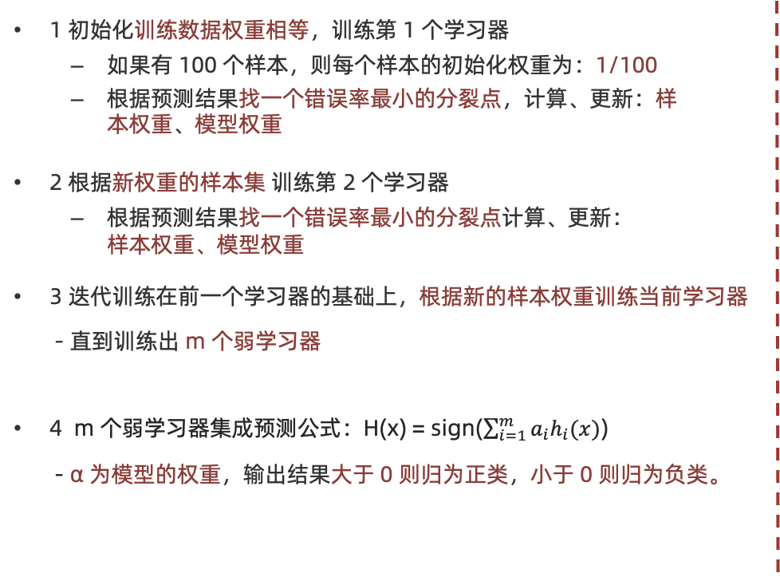

AdaBoost 模型公式中


1. α 为模型的权重
2. m 为弱学习器数量
3. h<sub>i</sub>(x) 表示弱学习器
4. H(x) 输出结果大于 0 则归为正类，小于 0 则归为负类。

**AdaBoost 权重更新公式:**


ε<sub>t</sub> 表示第 t 个弱学习器的错误率

**AdaBoost 样本权重更新公式:**


1. Z<sub>t</sub> 为归一化值（所有样本权重的总和）
2. D<sub>t</sub>(x) 为样本权重
3. α<sub>t</sub> 为模型权重。


###  AdaBoost 构建过程

下面为训练数数据，假设弱分类器由 x 产生，其阈值 v 使该分类器在训练数据集上的分类误差率最低，试用 Adaboost 算法学习一个强分类器。


- 构建第一个弱学习器

1. 初始化工作：初始化 10 个样本的权重，每个样本的权重为：0.1

2. 构建第一个基学习器：

   1. 寻找最优分裂点

      1. 对特征值 x 进行排序，确定分裂点为：0.5、1.5、2.5、3.5、4.5、5.5、6.5、7.5、8.5
      2. 当以 0.5 为分裂点时，有 5 个样本分类错误
      3. 当以 1.5 为分裂点时，有 4 个样本分类错误
      4. 当以 2.5 为分裂点时，有 3 个样本分类错误
      5. 当以 3.5 为分裂点时，有 4 个样本分类错误
      6. 当以 4.5 为分裂点时，有 5 个样本分类错误
      7. 当以 5.5 为分裂点时，有 4 个样本分类错误
      8. 当以 6.5 为分裂点时，有 5 个样本分类错误
      9. 当以 7.5 为分裂点时，有 4 个样本分类错误
      10. 当以 8.5 为分裂点时，有 3 个样本分类错误
      11. 最终，选择以 2.5 作为分裂点，计算得出基学习器错误率为：3/10=0.3

   2. 计算模型权重: `1/2 * np.log((1-0.3)/0.3)=0.4236`

   3. 更新样本权重：

      1. 分类正确样本为：1、2、3、4、5、6、10 共 7 个，其计算公式为：e<sup>-α<sub>t</sub></sup>，则正确样本权重变化系数为：e<sup>-0.4236</sup> = 0.6547
      2. 分类错误样本为：7、8、9 共 3 个，其计算公式为：e<sup>α<sub>t</sub></sup>，则错误样本权重变化系数为：e<sup>0.4236</sup> = 1.5275
      3. 样本 1、2、3、4、5、6、10  权重值为：`0.06547`
      4. 样本 7、8、9  的样本权重值为：`0.15275`
      5. 归一化 Z<sub>t</sub>  值为：`0.06547 * 7 + 0.15275 * 3 = 0.9165 `
      6. 样本 1、2、3、4、5、6、10  最终权重值为： `0.07143`
      7. 样本 7、8、9  的样本权重值为：`0.1667`

   4. 此时得到：

    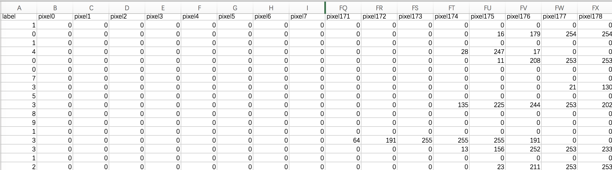
    

- 构建第二个弱学习器

1. 寻找最优分裂点：

   1. 对特征值 x 进行排序，确定分裂点为：0.5、1.5、2.5、3.5、4.5、5.5、6.5、7.5、8.5

   2. 当以 0.5 为分裂点时，有 5 个样本分类错误，错误率为：**0.07143 * 5 = 0.35715**

   3. 当以 1.5 为分裂点时，有 4 个样本分类错误，错误率为：**0.07143 * 1 + 0.16667 * 3 = 0.57144**       

   4. 当以 2.5 为分裂点时，有 3 个样本分类错误，错误率为：**0.16667 * 3 = 0.57144**

      。。。 。。。

   5. 当以 8.5 为分裂点时，有 3 个样本分类错误，错误率为：**0.07143 * 3  = 0.21429**

   6. 最终，选择以 8.5 作为分裂点，计算得出基学习器错误率为：0.21429

2. 计算模型权重：`1/2 * np.log((1-0.21429)/0.21429)=0.64963`

3. 分类正确的样本：1、2、3、7、8、9、10，其权重调整系数为：0.5222

4. 分类错误的样本：4、5、6，其权重调整系数为：1.9148

5. 分类正确样本权重值：

   1. 样本 1、2、3、10 为：0.0373
   2. 样本 7、8、9 为：0.087

6. 分类错误样本权重值：0.1368

7. 归一化 Z<sub>t</sub>  值为：`0.0373 * 4 + 0.087 * 3 + 0.1368 * 3 = 0.8206 `

8. 最终权重：

   1. 样本 1、2、3、10 为 ：0.0455
   2. 样本 7、8、9  为：0.1060
   3. 样本 4、5、6 为：0.1667

9. 此时得到：


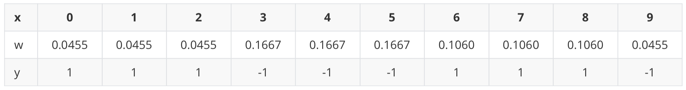

- 构建第三个弱学习器

错误率：0.1820，模型权重：0.7514


- 强学习器


### AdaBoost实战葡萄酒数据

 葡萄酒分为白葡萄酒和红葡萄酒两类。 
该分析涉及白葡萄酒，并基于数据集中显示的13个变量/特征：
固定酸度，挥发性酸度，柠檬酸，残留糖，氯化物，游离二氧化硫，总二氧化硫，密度，pH值，硫酸盐，酒精，质量等。为了评估葡萄酒的质量，我们提出的方法就是根据酒的物理化学性质与质量的关系，找出高品质的葡萄酒具体与什么性质密切相关，这些性质又是如何影响葡萄酒的质量。

```python
# 获取数据
import pandas as pd
df_wine = pd.read_csv('data/wine.data')
# 修改列名
df_wine.columns = ['Class label', 'Alcohol', 'Malic acid', 'Ash', 'Alcalinity of ash', 'Magnesium', 'Total phenols',
'Flavanoids', 'Nonflavanoid phenols', 'Proanthocyanins', 'Color intensity', 'Hue', 'OD280/OD315 of diluted wines',
'Proline']
# 去掉一类(1,2，3)
df_wine = df_wine[df_wine['Class label'] != 1]
# 获取特征值和目标值
X = df_wine[['Alcohol', 'Hue']].values
y = df_wine['Class label'].values

from sklearn.preprocessing import LabelEncoder
from sklearn.model_selection import train_test_split
# 类别转化 (2,3)=>(0,1)
le = LabelEncoder()
y = le.fit_transform(y)
# 划分训练集和测试集
X_train,X_test,y_train,y_test = train_test_split(X,y,test_size=0.4,random_state=1)

from sklearn.tree import DecisionTreeClassifier
from sklearn.ensemble import AdaBoostClassifier
# 机器学习(决策树和AdaBoost)
tree = DecisionTreeClassifier(criterion='entropy',max_depth=1,random_state=0)
ada= AdaBoostClassifier(base_estimator=tree,n_estimators=500,learning_rate=0.1,random_state=0)
from sklearn.metrics import accuracy_score
# 决策树和AdaBoost分类器性能评估
# 决策树性能评估
tree = tree.fit(X_train,y_train)
y_train_pred = tree.predict(X_train)
y_test_pred = tree.predict(X_test)
tree_train = accuracy_score(y_train,y_train_pred)
tree_test = accuracy_score(y_test,y_test_pred)
print('Decision tree train/test accuracies %.3f/%.3f' % (tree_train,tree_test))
# Decision tree train/test accuracies 0.845/0.854

# AdaBoost性能评估
ada = ada.fit(X_train,y_train)
y_train_pred = ada.predict(X_train)
y_test_pred = ada.predict(X_test)
ada_train = accuracy_score(y_train,y_train_pred)
ada_test = accuracy_score(y_test,y_test_pred)
print('Adaboost train/test accuracies %.3f/%.3f' % (ada_train,ada_test))
# Adaboost train/test accuracies 1/0.875 
```

总结：AdaBosst预测准确了所有的训练集类标，与单层决策树相比，它在测试机上表现稍微好一些。单决策树对于训练数据过拟合的程度更加严重一些。总之，我们可以发现Adaboost分类器能够些许提高分类器性能，并且与bagging分类器的准确率接近.


## GBDT 

**学习目标：**

1. 掌握提升树的算法原理思想
2. 了解梯度提升树的原理思想

###  提升树（Boosting Tree）

梯度提升树（Gradient Boosting Decision Tre）是提升树（Boosting Decision Tree）的一种改进算法，所以在讲梯度提升树之前先来介绍一下提升树。

假如有个人30岁，我们首先用20岁去拟合，发现损失有10岁，这时我们用6岁去拟合剩下的损失，发现差距还有4岁，第三轮我们用3岁拟合剩下的差距，差距就只有一岁了。如果我们的迭代轮数还没有完，可以继续迭代下面，每一轮迭代，拟合的岁数误差都会减小。最后将每次拟合的岁数加起来便是模型输出的结果。


### 梯度提升树

梯度提升树不再使用拟合残差，而是利用最速下降的近似方法，利用损失函数的负梯度作为提升树算法中的残差近似值。

假设:

1. 我们前一轮迭代得到的强学习器是：f<sub>i-1</sub>(x)
2. 损失函数是：L(y,f<sub>​i−1</sub>(x))
3. 本轮迭代的目标是找到一个弱学习器：h<sub>i</sub>(x)
4. 让本轮的损失最小化: L(y, f<sub>i</sub>(x))=L(y, f<sub>i−1</sub>(x)) + h<sub>i</sub>(x))

当采用平方损失函数时:


则:


损失函数为平方损失, 则每个样本要拟合的负梯度为:


此时, 我们发现 GBDT 拟合的负梯度就是残差，或者说对于回归问题，拟合的目标值就是残差。

如果我们的 GBDT 进行的是分类问题，则损失函数变为 logloss，此时拟合的目标值就是该损失函数的负梯度值。

### GBDT例子

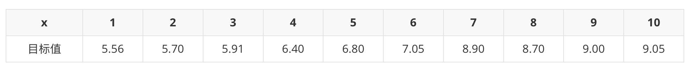

- 初始化弱学习器（CART树）

我们通过计算当模型预测值为何值时，会使得第一个基学习器的平方误差最小，即：求损失函数对 f(x<sub>i</sub>) 的导数，并令导数为0.

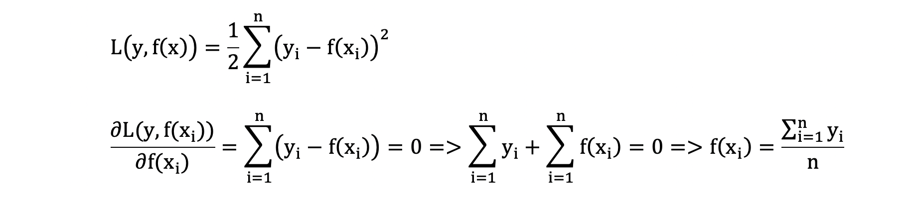


- 构建第一个弱学习器（CART树）

由于我们拟合的是样本的负梯度，即：


由此得到数据表如下：

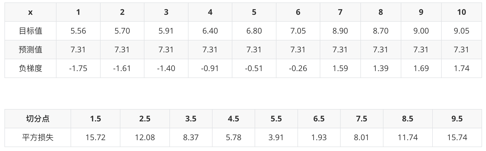

>上表中平方损失计算过程说明（以切分点1.5为例）：
>
>1. 切分点1.5 将数据集分成两份 [5.56],[5.56 5.7  5.91 6.4  6.8  7.05 8.9  8.7  9.   9.05]
>
>2. 第一份的平均值为5.56  第二份数据的平均值为（5.7+5.91+6.4+6.8+7.05+8.9+8.7+9+9.05）/9 =  7.5011
>
>3. 由于是回归树，每份数据的平均值即为预测值，则可以计算误差，第一份数据的误差为0，第二份数据的平方误差为 :
>
>  $(5.70-7.5011)^2+(5.91-7.5011)^2+...+(9.05-7.5011)^2 = 15.72308$

以 6.5 作为切分点损失最小，构建决策树如下：


- 构建第二个弱学习器（CART树）

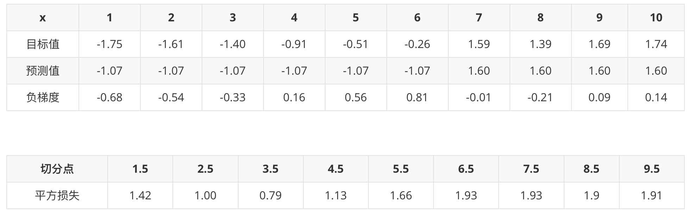

以 3.5 作为切分点损失最小，构建决策树如下：


- 构建第三个弱学习器（CART树）

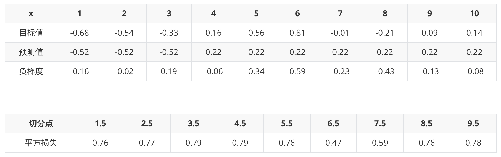

以 6.5 作为切分点损失最小，构建决策树如下：


-  最终强学习器


- GBDT算法流程

1 初始化弱学习器（目标值的均值作为预测值）

2 迭代构建学习器，每一个学习器拟合上一个学习器的负梯度

3 直到达到指定的学习器个数

4 当输入未知样本时，将所有弱学习器的输出结果组合起来作为强学习器的输出

### 泰坦尼克号案例实战

该案例是在随机森林的基础上修改的，可以对比理解

```python
#1.数据导入
#1.1导入数据
import  pandas as pd
#1.2.利用pandas的read.csv模块泰坦尼克号数据集
titanic=pd.read_csv("../data/泰坦尼克号数据集.csv")
titanic.info() #查看信息
#2人工选择特征pclass,age,sex
X=titanic[['Pclass','Age','Sex']]
y=titanic['Survived']
#3.特征工程
#数据的填补
X['Age'].fillna(X['Age'].mean(),inplace=True)
#数据的切分
from sklearn.model_selection import train_test_split
X_train, X_test, y_train, y_test =train_test_split(X,y,test_size=0.25,random_state=22)
#将数据转化为特征向量
from sklearn.feature_extraction import DictVectorizer
vec=DictVectorizer(sparse=False)
X_train=vec.fit_transform(X_train.to_dict(orient='records'))
X_test=vec.transform(X_test.to_dict(orient='records'))
#4.使用单一的决策树进行模型的训练及预测分析
from sklearn.tree import DecisionTreeClassifier
dtc=DecisionTreeClassifier()
dtc.fit(X_train,y_train)
dtc_y_pred=dtc.predict(X_test)
print("score",dtc.score(X_test,y_test))
#5.随机森林进行模型的训练和预测分析
from sklearn.ensemble import RandomForestClassifier
rfc=RandomForestClassifier(random_state=9)
rfc.fit(X_train,y_train)
rfc_y_pred=rfc.predict(X_test)
print("score:forest",rfc.score(X_test,y_test))
#6.GBDT进行模型的训练和预测分析
from sklearn.ensemble import GradientBoostingClassifier
gbc=GradientBoostingClassifier()
gbc.fit(X_train,y_train)
gbc_y_pred=gbc.predict(X_test)
print("score:GradientBoosting",gbc.score(X_test,y_test))
#7.性能评估
from sklearn.metrics import classification_report
print("dtc_report:",classification_report(dtc_y_pred,y_test))
print("rfc_report:",classification_report(rfc_y_pred,y_test))
print("gbc_report:",classification_report(gbc_y_pred,y_test))
```

## XGBoost

**学习目标：**

1.知道XGBoost算法的思想

2.理解XGBoost目标函数

3.了解XGBoost的算法API

4.实现红酒品质预测案例


XGBoost（Extreme Gradient Boosting）全名叫极端梯度提升树，XGBoost是集成学习方法的王牌，在Kaggle数据挖掘比赛中，大部分获胜者用了XGBoost。

XGBoost在绝大多数的回归和分类问题上表现的十分顶尖

### XGBoost算法思想

XGBoost 是对GBDT的改进：

1. 求解损失函数极值时使用泰勒二阶展开
2. 在损失函数中加入了正则化项
3. XGB 自创一个树节点分裂指标。这个分裂指标就是从损失函数推导出来的。XGB 分裂树时考虑到了树的复杂度。

构建最优模型的方法是**最小化训练数据的损失函数** 。


预测值和真实值经过某个函数计算出损失，并求解所有样本的平均损失，并且使得损失最小。这种方法训练得到的模型复杂度较高，很容易出现过拟合。因此，为了降低模型的复杂度，在损失函数中添加了正则化项，如下所示：：


提高模型对未知数据的泛化能力。


### XGboost的目标函数

XGBoost（Extreme Gradient Boosting）是对梯度提升树的改进，并且在损失函数中加入了正则化项。


目标函数的第一项表示整个强学习器的损失，第二部分表示强学习器中 K 个弱学习器的复杂度。

xgboost 每一个弱学习器的复杂度主要从两个方面来考量：


1. γT 中的 T 表示一棵树的叶子结点数量，γ 是对该项的调节系数
2. λ||w||<sup>2</sup> 中的 w 表示叶子结点输出值组成的向量，λ 是对该项的调节系数

- 模型复杂度的介绍

假设我们要预测一家人对电子游戏的喜好程度，考虑到年轻和年老相比，年轻更可能喜欢电子游戏，以及男性和女性相比，男性更喜欢电子游戏，故先根据年龄大小区分小孩和大人，然后再通过性别区分开是男是女，逐一给各人在电子游戏喜好程度上打分，如下图所示：

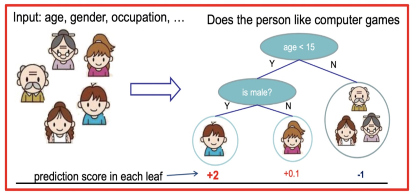

就这样，训练出了2棵树tree1和tree2，类似之前gbdt的原理，两棵树的结论累加起来便是最终的结论，所以：

- 小男孩的预测分数就是两棵树中小孩所落到的结点的分数相加：2 + 0.9 = 2.9。
- 爷爷的预测分数同理：-1 + 0.9 = -0.1。

具体如下图所示：


如下树tree1的复杂度表示为：


-  泰勒公式展开

我们直接对目标函数求解比较困难，通过泰勒展开将目标函数换一种近似的表示方式。接下来对 y<sub>i</sub><sup>(t-1)</sup> 进行泰勒二阶展开，得到如下近似表示的公式：


其中，g<sub>i</sub> 和 h<sub>i</sub> 的分别为损失函数的一阶导、二阶导：


-  化简目标函数

我们观察目标函数，发现以下两项都是常数项，我们可以将其去掉。

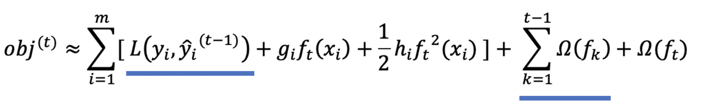

为什么说是常数项呢？这是因为当前学习器之前的学习器都已经训练完了，可以直接通过样本得出结果。化简之后的结果为：


我们再将 Ω(f<sub>t</sub>) 展开，结果如下：


这个公式中只有 f<sub>t</sub> ，该公式可以理解为，当前这棵树如何构建能够降低损失。

-  问题再次转换

我们再次理解下这个公式表示的含义：

1. g<sub>i</sub> 表示每个样本的一阶导，h<sub>i</sub> 表示每个样本的二阶导
2. f<sub>t</sub>(x<sub>i</sub>) 表示样本的预测值
3. T 表示叶子结点的数目
4. ||w||<sup>2</sup> 由叶子结点值组成向量的模

现在，我们发现公式的各个部分考虑的角度不同，有的从样本角度来看，例如：f<sub>t</sub>(x<sub>i</sub>) ，有的从叶子结点的角度来看，例如：T、||w||<sup>2</sup>。我们下面就要将其转换为相同角度的问题，这样方便进一步合并项、化简公式。我们统一将其转换为从叶子角度的问题：


例如：10 个样本，落在 D 结点 3 个样本，落在 E 结点 2 个样本，落在 F 结点 2 个样本，落在 G 结点 3 个样本

1. D 结点计算： w1 * gi1 + w1 * gi2 + w1 * gi3 = (gi1 + gi2 + gi3) * w1 

2. E 结点计算： w2 * gi4 + w2 * gi5 = (gi4 + gi5) * w2 

3. F 结点计算： w3 * gi6 + w3 * gi6 = (gi6 + gi7) * w3 
4. G 节点计算：w4 * gi8 + w4 * gi9 + w4 * gi10 = (gi8 + gi9 + gi10) * w4


g<sub>i</sub> f<sub>t</sub>(x<sub>i</sub>)  表示样本的预测值，我们将其转换为如下形式：


* w<sub>j</sub> 表示第 j 个叶子结点的值
* g<sub>i</sub> 表示每个样本的一阶导

h<sub>i</sub>f<sub>t</sub><sup>2</sup>(x<sub>i</sub>) 转换从叶子结点的问题，如下：


λ||w||<sup>2</sup> 由于本身就是从叶子角度来看，我们将其转换一种表示形式：


我们重新梳理下整理后的公式，如下：


上面的公式太复杂了，我们令：


Gi 表示样本的一阶导之和，Hi 表示样本的二阶导之和，当确定损失函数时，就可以通过计算得到结果。

现在我们的公式变为：


- 对叶子结点求导

此时，公式可以看作是关于叶子结点 w 的一元二次函数，我们可以对 w 求导并令其等于 0，可得到 w 的最优值，将其代入到公式中，即可再次化简上面的公式。


将 w<sub>j</sub> 代入到公式中，即可得到：


-  XGBoost的树构建方法

该公式也叫做打分函数 (scoring function)，它可以从树的损失函数、树的复杂度两个角度来衡量一棵树的优劣。

这个公式，我们怎么用呢？

当我们构建树时，可以用来选择树的最佳划分点。


其过程如下：

1. 对树中的每个叶子结点尝试进行分裂
2. 计算分裂前 - 分裂后的分数：
   1. 如果gain > 0，则分裂之后树的损失更小，我们会考虑此次分裂
   2. 如果gain< 0，说明分裂后的分数比分裂前的分数大，此时不建议分裂
3. 当触发以下条件时停止分裂：
   1. 达到最大深度
   2. 叶子结点样本数量低于某个阈值
   3. 等等...


### XGboost API


```python
bst = XGBClassifier(n_estimators, max_depth, learning_rate, objective)
```


### 红酒品质预测

#### 数据集介绍

数据集共包含 11 个特征，共计 3269 条数据. 我们通过训练模型来预测红酒的品质, 品质共有 6 个各类别，分别使用数字: 1、2、3、4、5 来表示。


#### 案例实现

-  导入需要的库文件

```python
import joblib
import numpy as np
import xgboost as xgb
import pandas as pd
import numpy as np
from collections import Counter
from sklearn.model_selection import train_test_split
from sklearn.metrics import classification_report
from sklearn.model_selection import StratifiedKFold
```

-  数据基本处理

```python
def test01():

    # 1. 加载训练数据
    data = pd.read_csv('data/红酒品质分类.csv')
    x = data.iloc[:, :-1]
    y = data.iloc[:, -1] - 3

    # 2. 数据集分割
    x_train, x_valid, y_train, y_valid = train_test_split(x, y, test_size=0.2, stratify=y, random_state=22)

    # 3. 存储数据
    pd.concat([x_train, y_train], axis=1).to_csv('data/红酒品质分类-train.csv')
    pd.concat([x_valid, y_valid], axis=1).to_csv('data/红酒品质分类-valid.csv')
```

- 模型基本训练

```python
def test02():

    # 1. 加载训练数据
    train_data = pd.read_csv('data/红酒品质分类-train.csv')
    valid_data = pd.read_csv('data/红酒品质分类-valid.csv')

    # 训练集
    x_train = train_data.iloc[:, :-1]
    y_train = train_data.iloc[:, -1]

    # 测试集
    x_valid = valid_data.iloc[:, :-1]
    y_valid = valid_data.iloc[:, -1]

    # 2. XGBoost模型训练
    estimator = xgb.XGBClassifier(n_estimators=100,
                                  objective='multi:softmax',
                                  eval_metric='merror',
                                  eta=0.1,
                                  use_label_encoder=False,
                                  random_state=22)
    estimator.fit(x_train, y_train)

    # 3. 模型评估
    y_pred = estimator.predict(x_valid)
    print(classification_report(y_true=y_valid, y_pred=y_pred))

    # 4. 模型保存
    joblib.dump(estimator, 'model/xgboost.pth')
```

- 模型参数调优

```python
# 样本不均衡问题处理
from sklearn.utils import class_weight
classes_weights = class_weight.compute_sample_weight(class_weight='balanced',y=y_train)
# 训练的时候，指定样本的权重
estimator.fit(x_train, y_train,sample_weight = classes_weights)
y_pred = estimator.predict(x_valid)
print(classification_report(y_true=y_valid, y_pred=y_pred))

# 交叉验证，网格搜索
train_data = pd.read_csv('data/红酒品质分类-train.csv')
valid_data = pd.read_csv('data/红酒品质分类-valid.csv')

# 训练集
x_train = train_data.iloc[:, :-1]
y_train = train_data.iloc[:, -1]

# 测试集
x_valid = valid_data.iloc[:, :-1]
y_valid = valid_data.iloc[:, -1]

spliter = StratifiedKFold(n_splits=5, shuffle=True)
# 2. 定义超参数
param_grid = {'max_depth': np.arange(3, 5, 1),
              'n_estimators': np.arange(50, 150, 50),
              'eta': np.arange(0.1, 1, 0.3)}
estimator = xgb.XGBClassifier(n_estimators=100,
                              objective='multi:softmax',
                              eval_metric='merror',
                              eta=0.1,
                              use_label_encoder=False,
                              random_state=22)
cv = GridSearchCV(estimator,param_grid,cv=spliter)
y_pred = cv.predict(x_valid)
print(classification_report(y_true=y_valid, y_pred=y_pred))
```

## 作业

1.使用思维导图总结集成学习部分的内容


2.说明集成学习的方式


3.实现本部分所有的案例


## 课堂笔记


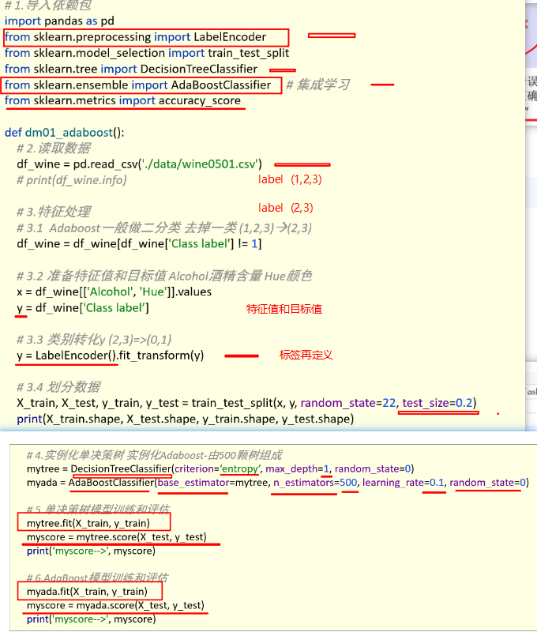


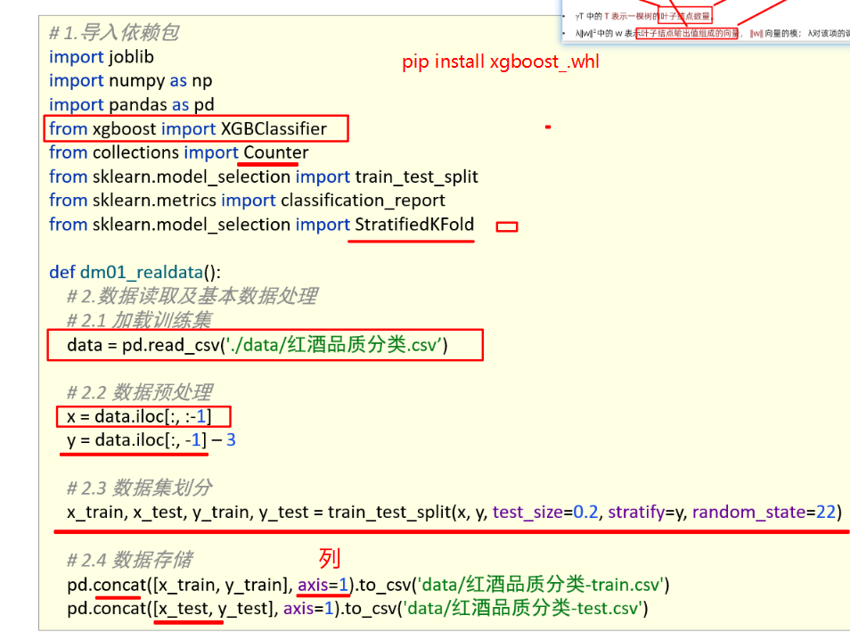

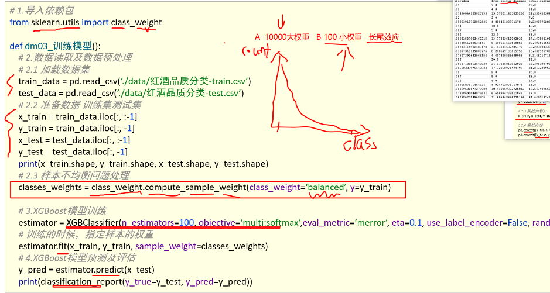

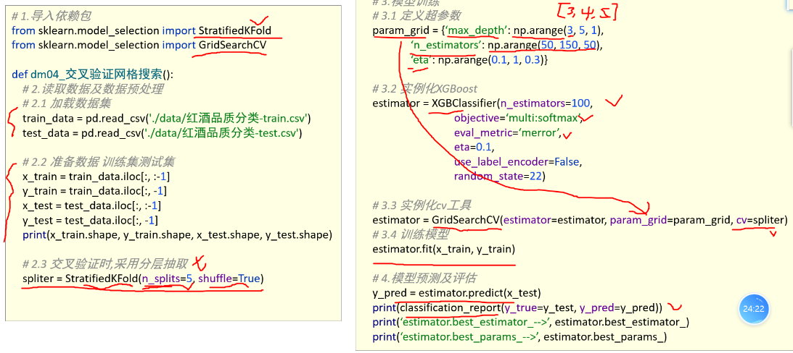