## 1、集成学习简介

### 1.1 什么是集成学习？

集成学习是一种机器学习思想，通过组合多个模型（称为弱学习器或基学习器）来形成一个精度更高的集成模型。训练时，依次训练这些弱学习器；预测时，联合使用它们进行预测。	


**核心思想**

- **传统机器学习**：寻找单一最优分类器（如决策树、逻辑回归）以尽可能将训练数据分开。
- **集成学习**：组合多个分类器，形成预测效果更好的集成分类器。
- **类比**：“三个臭皮匠，赛过诸葛亮”——通过多个弱模型的协作提升整体性能。


**工作原理**

- **生成模型**：独立训练多个分类器/模型。

- **独立预测**：每个模型对未知样本做出预测。

- **组合结果**：综合各模型的预测结果，形成更优的最终预测。


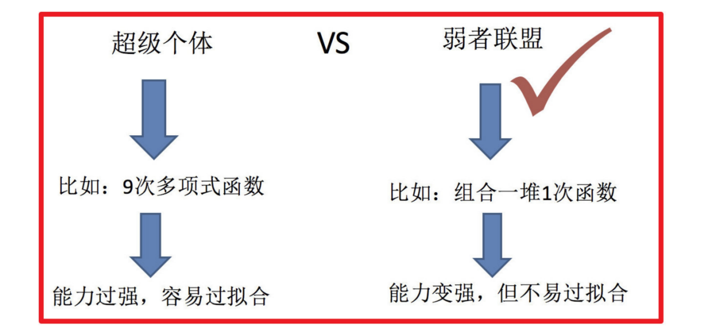 


### 1.2 集成学习分类

集成学习算法主要分为两类：

| **类型**     | **Bagging（装袋法）**        | **Boosting（提升法）**         |
| :----------- | :--------------------------- | :----------------------------- |
| **核心思想** | 有放回采样生成差异化的训练集 | 关注前序模型的不足进行迭代优化 |
| **样本采样** | 有放回随机采样               | 根据前序模型错误调整样本权重   |
| **训练方式** | 并行独立训练基学习器         | 串行顺序训练基学习器           |
| **结果聚合** | 平均投票或多数表决           | 加权组合预测结果               |
| **典型算法** | 随机森林（Random Forest）    | AdaBoost, GBDT, XGBoost        |

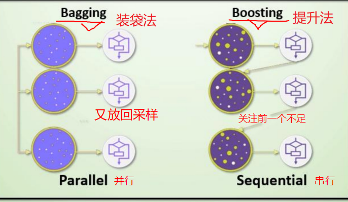

### 1.3 bagging集成

#### 1.3.1 工作流程

- **有放回采样**
  - 通过自助采样法（Bootstrap）从原始训练集中生成多个差异化子数据集。
- **训练基学习器**
  - 每个子数据集独立训练一个基学习器（如决策树）。
- **聚合预测结果**
  - 分类任务：多数投票法
  - 回归任务：平均法

> **核心特点**
>
> - **降低方差**：通过聚合多个模型减少过拟合风险。
> - **并行化**：基学习器训练相互独立，可并行加速。

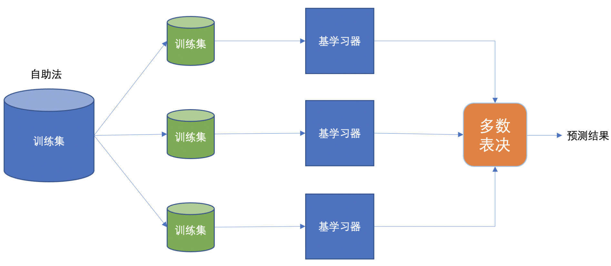

#### 1.3.2 **例子：**把下面的圈和方块进行分类

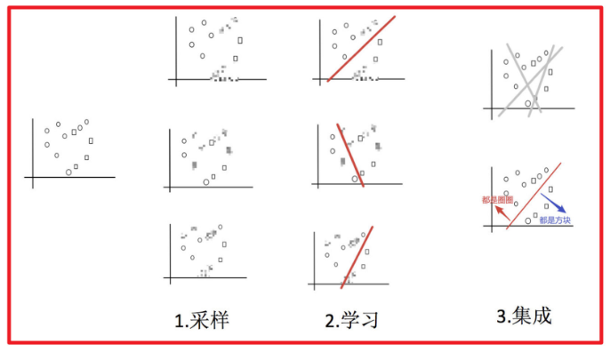


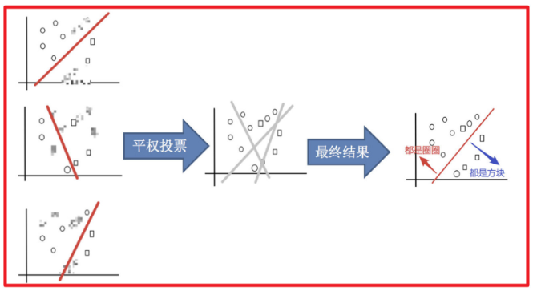


### 1.4 boosting集成

通过**串行训练弱学习器**，让后续模型重点关注前一个训练器不足的地方进行训练，最终通过加权投票提升整体预测能力。

> 📌 核心特点：每加入一个新弱学习器，整体性能提升


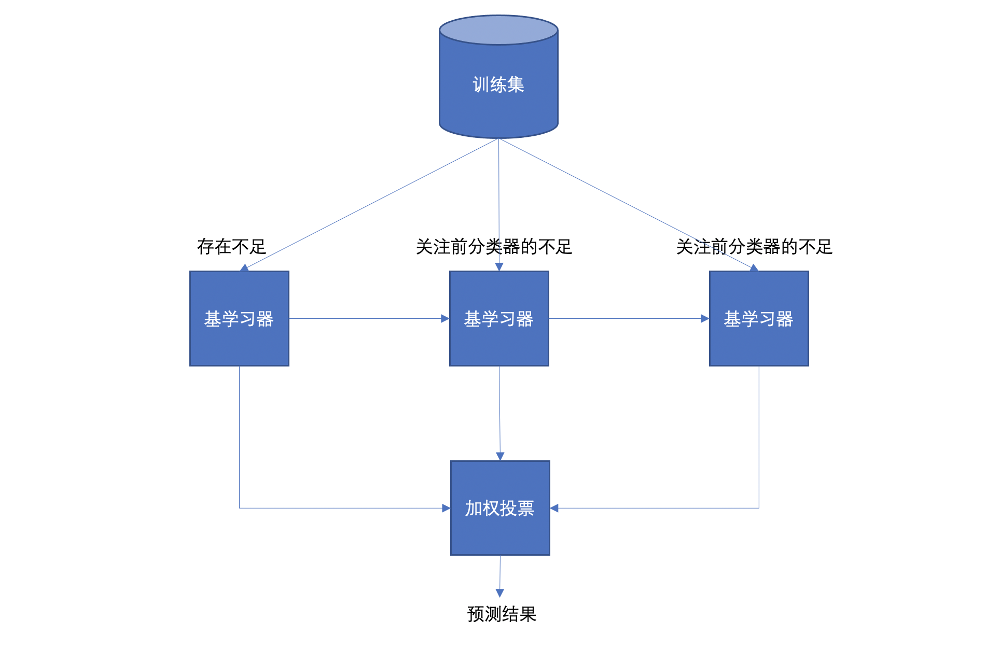

#### 1.4.1 **工作流程**

Boosting是一组可将弱学习器升为强学习器算法。这类算法的工作机制类似：

- **初始训练**
  从训练集训练第一个基学习器
- **样本调整**
  根据当前学习器错误调整样本分布 → 后续模型更关注错误样本
- **迭代训练**
  基于新样本分布训练下一个基学习器
- **终止条件**
  重复直至达到预设的基学习器数量
- **集成输出**
  加权结合所有基学习器形成强学习器


```mermaid
graph LR
    A[初始训练集] --> B[基学习器1]
    B -- 错误样本加权 --> C[调整样本分布]
    C --> D[基学习器2]
    D -- 继续聚焦错误 --> E[基学习器3]
    E --> F[加权投票集成]
    F --> G[最终预测结果]
```


#### **1.4.2 Boosting vs Bagging 关键对比**

| **维度**       | **Bagging**            | **Boosting**                   |
| :------------- | :--------------------- | :----------------------------- |
| **数据采样**   | 有放回随机采样         | 使用全部数据集                 |
| **样本关注点** | 平等对待所有样本       | 动态调整权重，聚焦前序错误样本 |
| **投票机制**   | 平权投票               | 加权投票（按模型性能赋权）     |
| **训练顺序**   | ⚡️ 并行训练（无依赖性） | ⚡️ 串行训练（强依赖性）         |
| **典型算法**   | 随机森林               | AdaBoost, GBDT, XGBoost        |


## 2、随机森林

### 2.1 算法思想

基于 **Bagging 集成思想** + **决策树基学习器**，通过双重随机性（数据随机+特征随机）构建高独立性弱学习器群体。

**核心优势**

✅ 天然抗过拟合（双重随机性保障）
✅ 高并行效率（树之间无依赖）
✅ 处理高维特征（特征随机选择）


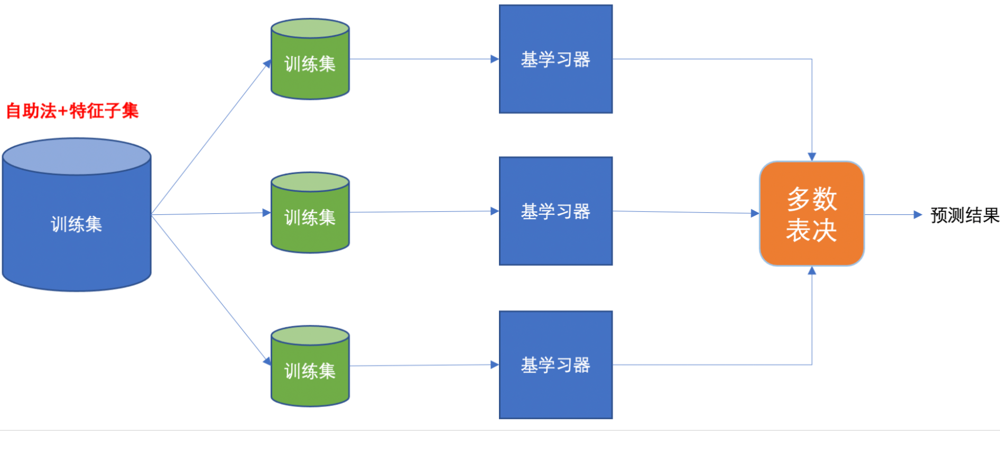

#### 2.1.1 **分步详解**

- **数据采样（行随机）**

  - 有放回抽取 m 条数据（Bootstrap 采样）
  - 允许重复样本，保证每棵树训练集差异

- **特征选择（列随机）**

  - 随机选择 k 个特征（k < 总特征数）
  - 典型设置：k = $\sqrt{总特征数}$

  - 使用 **CART** 算法生成**不剪枝**的决策树
  - 节点分裂时仅考虑随机选择的 k 个特征

- **集成预测**

  - 所有树平权投票（多数表决）

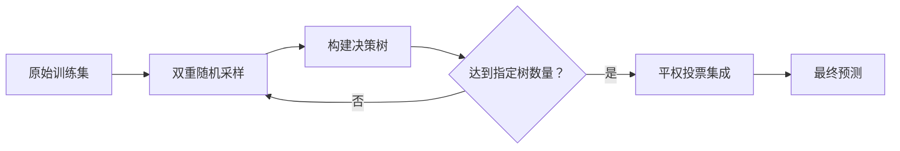
```mermaid
graph LR
A[原始训练集] --> B[双重随机采样]
B --> C[构建决策树]
C --> D{达到指定树数量？}
D -- 否 --> B
D -- 是 --> E[平权投票集成]
E --> F[最终预测]
```


#### **2.1.2 关键机制解析**

**双重随机性设计**

| 随机类型     | 实现方式                 | 核心作用                 |
| :----------- | :----------------------- | :----------------------- |
| **数据随机** | 有放回 Bootstrap 采样    | 打破树间数据一致性       |
| **特征随机** | 节点分裂时随机选特征子集 | 增强树独立性，降低相关性 |


**抗过拟合原理**

> 🌳 **双重随机性** → 🌲 **树高度独立** → 🛡️ **即使单树不剪枝也不易过拟合**


**核心参数说明**

| 参数                            | 作用                   | 典型设置建议                                         |
| :------------------------------ | :--------------------- | :--------------------------------------------------- |
| **树数量 (n_estimators)**       | 森林中决策树总数       | ≥100（越多效果越稳定）                               |
| **特征子集大小 (max_features)** | 每棵树随机选择的特征数 | $\sqrt{总特征数}$（分类问题） 总特征数/3（回归问题） |


#### **2.1.3 关键问题解答**

##### ❓ **为何必须随机抽样？**

> 若所有树使用相同训练集 → 产生高度相似的树 → 集成效果退化为单棵树

##### ❓ **为何采用有放回抽样？**

> - **无放回**：每棵树训练集完全不同 → 单树偏差过大
> - **有放回**：训练集存在重叠但不同 → 平衡**树间差异性**与**单树稳定性**

##### ❓ **为何特征随机选择？**

> 避免少数强特征主导所有树 → 增强模型鲁棒性和泛化能力


**随机森林 vs 标准Bagging**

| 维度         | 随机森林                   | 标准Bagging    |
| :----------- | :------------------------- | :------------- |
| **基学习器** | 必须是决策树               | 任意模型       |
| **特征处理** | 双重随机（数据+特征）      | 仅数据随机     |
| **计算效率** | 更高（特征子集降低计算量） | 取决于基学习器 |

> 💡 **实践提示**：随机森林是实际应用中效果最好的机器学习算法之一，尤其适合结构化数据分类问题。


### **2.2 随机森林 API**

```python
from sklearn.ensemble import RandomForestClassifier
rf = RandomForestClassifier(
    n_estimators=100, 
    criterion='gini',
    max_depth=None,
    max_features='auto',
    bootstrap=True,
    min_samples_split=2,
    min_samples_leaf=1,
    min_impurity_split=1e-7
)
```

**关键参数功能说明**

| 参数                     | 默认值 | 功能说明                                                     | 典型设置建议                                                 |
| :----------------------- | :----- | :----------------------------------------------------------- | :----------------------------------------------------------- |
| **`n_estimators`**       | 10     | 森林中决策树的数量                                           | ▶️ **≥100** <br />▶️ 计算资源允许下越多越好                    |
| **`criterion`**          | `gini` | 分裂质量评估标准                                             | ▶️ `gini`（基尼系数） <br />▶️ `entropy`（信息增益）           |
| **`max_depth`**          | None   | 树的最大深度                                                 | ▶️ None（不限制） <br />▶️ 过拟合时设置5-15                    |
| **`max_features`**       | `auto` | 节点分裂时的特征采样数                                       | ▶️ `auto`=$\sqrt{n\text{-}features}$<br />▶️ `sqrt`=$\sqrt{n\text{-}features}$ <br />▶️ `log2`=$\log_2n\text-features$  <br />▶️ `None`=n-features<br />▶️ 浮点数（比例）<br/>▶️ 整数（绝对数量） |
| **`bootstrap`**          | True   | 是否使用有放回抽样                                           | ▶️ **True**（标准随机森林） <br />▶️ False（使用全体数据）     |
| **`min_samples_split`**  | 2      | 节点分裂所需最小样本数                                       | ▶️ 小数据集：保持默认 <br />▶️ 大数据集：增大（如50+）         |
| **`min_samples_leaf`**   | 1      | 叶节点最小样本数，<br />如果某叶子节点数目小于样本数，则会和兄弟节点一起被剪枝. | ▶️ **≥1** <br />                                              |
| **`min_impurity_split`** | 1e-7   | 节点分裂最小不纯度阈值<br />如果某节点的不纯度(基尼系数，均方差)小于这个阈值，<br />则该节点不再生成子节点，并变为叶子节点. | ▶️ 不建议修改 <br />▶️ 需调整时参考：0.01-0.001                |


#### **2.2.1 重点参数详解**

##### 1.  **`max_features` 特征采样策略**

| 选项              | 计算公式       | 适用场景                |
| :---------------- | :------------- | :---------------------- |
| **'auto'/'sqrt'** | √总特征数      | 分类问题默认选择        |
| **'log2'**        | log₂(总特征数) | 高维特征（特征数>1000） |
| **None**          | 使用全部特征   | 特征数少时（<50）       |
| **浮点数**        | 总特征数×比例  | 精细控制特征子集大小    |

> ⚠️ **注意**：此参数是随机森林**区别于普通Bagging的核心**，直接影响模型多样性和泛化能力


##### 2.  **树生长控制参数**

| 参数                      | 过拟合风险 | 欠拟合风险 | 调整优先级 |
| :------------------------ | :--------- | :--------- | :--------- |
| `max_depth=None`          | ↑↑↑        | ↓          | 高         |
| `min_samples_split=2`     | ↑↑         | ↓          | 中         |
| `min_samples_leaf=1`      | ↑↑         | ↓          | 中         |
| `min_impurity_split=1e-7` | ↑          | ↓          | 低         |

> 💡 **调参口诀**：防过拟合优先调整 `max_depth` 和 `min_samples_leaf`


##### **3. `bootstrap` 的特殊作用**

- **True（默认）**：
  ✅ 实现Bagging的样本随机性
  ✅ 支持OOB（Out-of-Bag）误差估计
- **False**：
  ⚠️ 失去随机森林的双重随机性特征
  ⚠️ 可能降低模型泛化能力


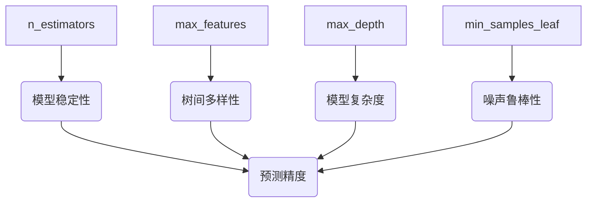
```mermaid
graph TD
    A[n_estimators] --> B(模型稳定性)
    C[max_features] --> D(树间多样性)
    E[max_depth] --> F(模型复杂度)
    G[min_samples_leaf] --> H(噪声鲁棒性)
    B --> I(预测精度)
    D --> I
    F --> I
    H --> I
```


###  2.3 随机森林泰坦尼克号生存预测

``` python
#1.数据加载与探索
#1.1导入数据
import pandas as pd
titanic=pd.read_csv("data/泰坦尼克号.csv")
titanic.info() #查看信息

#2人工选择特征pclass,age,sex
X=titanic[['Pclass','Age','Sex']].copy()
y=titanic['Survived'].copy()

#3.特征工程
#数据的填补
X['Age'].fillna(X['Age'].mean(),inplace=True)
X = pd.get_dummies(X)

#数据的切分
from sklearn.model_selection import train_test_split
X_train, X_test, y_train, y_test =train_test_split(X,y,test_size=0.25,random_state=22)

#4.使用单一的决策树进行模型的训练及预测分析
from sklearn.tree import DecisionTreeClassifier
dtc=DecisionTreeClassifier()
dtc.fit(X_train,y_train)	
dtc_y_pred=dtc.predict(X_test)
dtc.score(X_test,y_test)

#5.随机森林进行模型的训练和预测分析
from sklearn.ensemble import RandomForestClassifier
rfc=RandomForestClassifier(max_depth=6,random_state=9)
rfc.fit(X_train,y_train)
rfc_y_pred=rfc.predict(X_test)
rfc.score(X_test,y_test)

#6.性能评估
from sklearn.metrics import classification_report
print(classification_report(y_test, dtc_y_predict, target_names=['died', 'survived']))  # classification_report 会按照标签的顺序（即 0、1）依次使用 target_names 列表中的名称。
print(classification_report(y_test, rfc_y_predict, target_names=['died', 'survived']))
```

超参数选择代码:

```python
# 随机森林去进行预测
# 1 实例化随机森林
rf = RandomForestClassifier()
# 2 定义超参数的选择列表
param={"n_estimators":[80,100,200], "max_depth": [2,4,6,8,10,12],"random_state":[9]}
# 超参数调优
# 3 使用GridSearchCV进行网格搜索
from sklearn.model_selection import GridSearchCV
gc = GridSearchCV(rf, param_grid=param, cv=2)
gc.fit(X_train, y_train)
print("随机森林预测的准确率为：", gc.score(X_test, y_test))
```


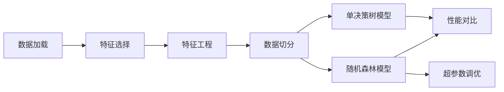
```mermaid
graph LR
    A[数据加载] --> B[特征选择]
    B --> C[特征工程]
    C --> D[数据切分]
    D --> E[单决策树模型]
    D --> F[随机森林模型]
    E --> G[性能对比]
    F --> G
    F --> H[超参数调优]
```


## 3、Adaboost

### 3.1 AdaBoost算法简介


#### 1.1 核心思想

- **Adaptive Boosting（自适应提升）**：基于Boosting思想实现的集成学习算法
- **核心机制**：逐步提高被前一步分类错误样本的权重，训练强分类器
- **特点**：
  - 训练时样本具有权重，动态调整
  - 被分错的样本会加大权重，算法更关注难分样本
  - 性能好的弱分类器获得更大权重


#### 1.2 自适应机制

- "关注"被错分的样本 → 增加错分样本权重
- "器重"性能好的弱分类器 → 增大优秀分类器权重
- 样本权重间接影响分类器权重


Adaboost自适应在于：“关注”被错分的样本，“器重”性能好的弱分类器:**（观察下图）**


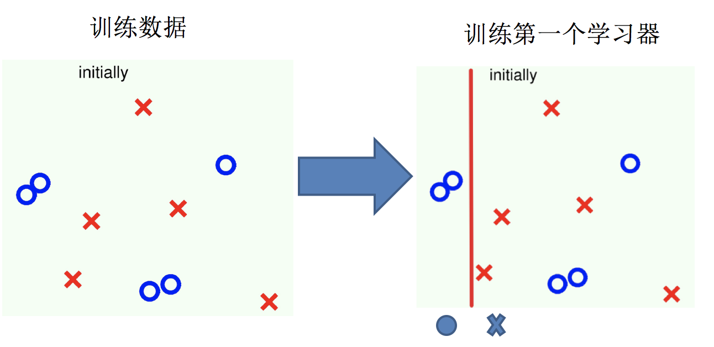

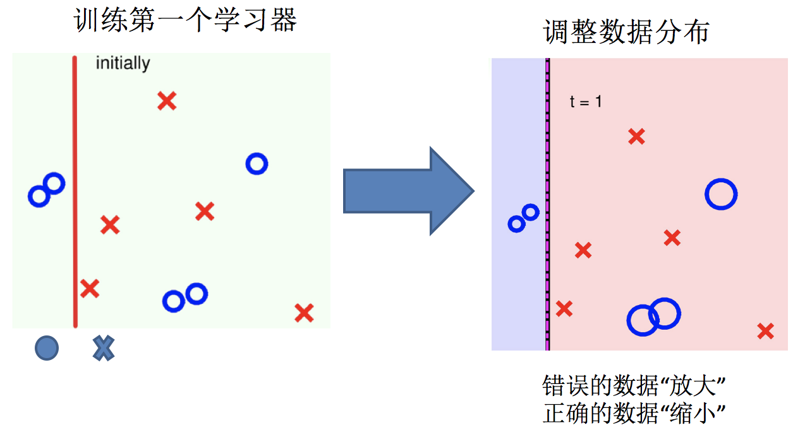

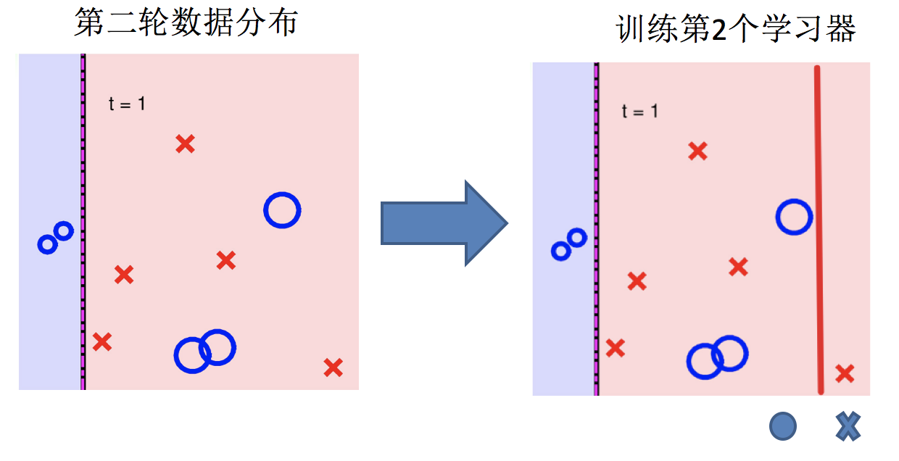

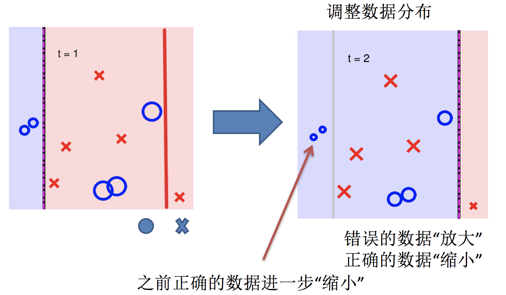

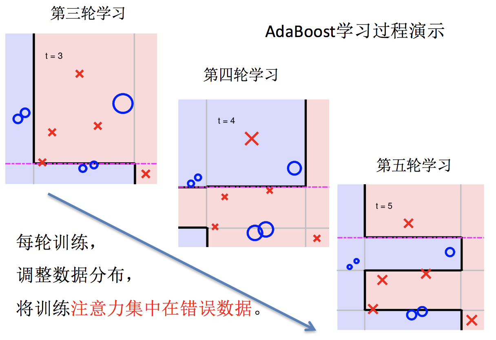


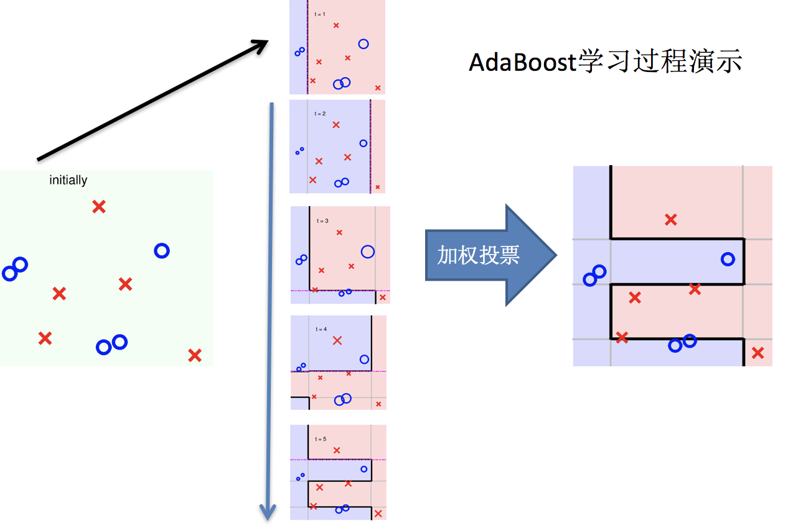

#### 1.3 核心步骤

- **权值调整**：提高前一轮错误分类样本的权值，降低正确分类样本的权值。从而使得那些没有得到正确分类的样本，由于权值的加大而受到后一轮基分类器的更大关注。
- **基分类器组合**：采用加权多数表决方法
  - 误差率小的弱分类器权值大，在表决中起较大作用。
  - 误差率大的弱分类器权值小，在表决中起较小作用。

 

###  3.2 AdaBoost算法推导

#### 1. 初始化训练数据权重相等，训练第1个学习器  

- 如果有100个样本，则每个样本的初始化权重为：`1/100`  
- 根据预测结果找一个错误率最小的分裂点，计算、更新：样本权重、模型权重  


#### 2. 根据新权重的样本集训练第2个学习器  

- 根据预测结果找一个错误率最小的分裂点，计算、更新：样本权重、模型权重  


#### 3. 迭代训练在前一个学习器的基础上，根据新的样本权重训练当前学习器  

- 直到训练出`m`个弱学习器  


#### 4. m个弱学习器集成预测公式：  

$$
H(x) = \text{sign}\left(\sum_{i=1}^{m} \alpha_i h_i(x)\right)
$$

- $\alpha_i$：模型权重  
- $m$：弱学习器数量  
- $h_i(x)$：弱学习器  
- $H(x)$输出结果：>0为正类，<0为负类  


#### 5. 模型权重计算公式：  

$$
\alpha_t = \frac{1}{2} \ln \left( \frac{1 - \varepsilon_t}{\varepsilon_t} \right)
$$


- $\alpha_t$为模型权重  
- $\varepsilon_t$：第t个弱学习器的错误率 


#### 6. 样本权重计算公式：

$$
D_{t+1}(x) = \frac{D_t(x)}{z_t} \times \begin{cases}  
e^{-a_t}, & \text{预测值} = \text{真实值} \\  
e^{a_t}, & \text{预测值} \neq \text{真实值}  
\end{cases}
$$


- $Z_t$：归一化值（所有样本权重总和）  
- $D_t(x)$：样本权重  
- $\alpha_t$：模型权重  


###  3.3 AdaBoost 构建过程

**已知训练数据：**

| 序号 | 1    | 2    | 3    | 4    | 5    | 6    | 7    | 8    | 9    | 10   |
| :--- | :--- | :--- | :--- | :--- | :--- | :--- | :--- | :--- | :--- | :--- |
| $x$  | 0    | 1    | 2    | 3    | 4    | 5    | 6    | 7    | 8    | 9    |
| $y$  | 1    | 1    | 1    | -1   | -1   | -1   | 1    | 1    | 1    | -1   |

**目标：**
使用 Adaboost 算法学习一个强分类器，弱分类器由 $x$产生，且分类误差率最低。


#### 1. 构建第一个弱学习器

- **初始化权重：**  每个样本的初始权重为 $$0.1$$。

| 序号 | 1    | 2    | 3    | 4    | 5    | 6    | 7    | 8    | 9    | 10   |
| ---- | ---- | ---- | ---- | ---- | ---- | ---- | ---- | ---- | ---- | ---- |
| x    | 0    | 1    | 2    | 3    | 4    | 5    | 6    | 7    | 8    | 9    |
| w    | 0.1  | 0.1  | 0.1  | 0.1  | 0.1  | 0.1  | 0.1  | 0.1  | 0.1  | 0.1  |
| y    | 1    | 1    | 1    | -1   | -1   | -1   | 1    | 1    | 1    | -1   |

- **构建基学习器：**
   - **寻找最优分裂点：**
     - 候选分裂点：$$0.5, 1.5, 2.5, 3.5, 4.5, 5.5, 6.5, 7.5, 8.5$$。
     
     - 分类错误样本数：
       - 分裂点 $$0.5$$：5 错误  
       - 分裂点 $$1.5$$：4 错误  
       - 分裂点 $$2.5$$：3 错误（最优）  
       - 分裂点 $$3.5$$：4 错误  
       - 分裂点 $$4.5$$：5 错误  
       - 分裂点 $$5.5$$：4 错误  
       - 分裂点 $$6.5$$：5 错误  
       - 分裂点 $$7.5$$：4 错误  
       - 分裂点 $$8.5$$：3 错误  
       
     - **选择分裂点 $$2.5$$**，错误率 $$\epsilon_1 = 3/10 = 0.3$$。
     
       > 许多AdaBoost实现默认按**特征值升序**搜索分裂点，优先选择靠前的分裂点（如2.5）以简化流程。
     
   - **计算模型权重：**  
     $$
     \alpha_1 = \frac{1}{2} \ln\left(\frac{1 - \epsilon_1}{\epsilon_1}\right) = 0.4236
     $$

   - **更新样本权重：**
     - 分类正确样本（1, 2, 3, 4, 5, 6, 10）：权重  **0.1**  乘 **权重调整系数** $$e^{-\alpha_1} = 0.6547$$ → 新权重 $$0.06547$$。
     
     - 分类错误样本（7, 8, 9）：权重  **0.1**  乘 **权重调整系数**$$e^{\alpha_1} = 1.5275$$ → 新权重 $$0.15275$$。
     
     - **归一化：**
       $$
       Z_1 = 7 \times 0.06547 + 3 \times 0.15275 = 0.9165
       $$
       
     - 最终权重：
       
       - 正确样本：$$0.06547 / 0.9165 \approx 0.07143$$  
       - 错误样本：$$0.15275 / 0.9165 \approx 0.1667$$。
     
   - **当前模型输出：**  
     $$
     G_1(x) = \begin{cases} 
     1 & \text{if } x \leq 2.5, \\ 
     -1 & \text{if } x > 2.5.
     \end{cases}
     $$
     

#### 2. 构建第二个弱学习器

| 序号 | 1       | 2       | 3       | 4       | 5       | 6       | 7       | 8       | 9       | 10      |
| ---- | ------- | ------- | ------- | ------- | ------- | ------- | ------- | ------- | ------- | ------- |
| x    | 0       | 1       | 2       | 3       | 4       | 5       | 6       | 7       | 8       | 9       |
| w    | 0.07143 | 0.07143 | 0.07143 | 0.07143 | 0.07143 | 0.07143 | 0.16667 | 0.16667 | 0.16667 | 0.07143 |
| y    | 1       | 1       | 1       | -1      | -1      | -1      | 1       | 1       | 1       | -1      |

- **寻找最优分裂点：**

   - 分裂点 $$0.5$$：错误率 $$0.07143 \times 2+ 0.16667 \times 3= 0.64287$$  
   - 分裂点 $$1.5$$：错误率 $$0.07143 \times 1 + 0.16667 \times 3 = 0.57144$$  
   - 分裂点 $$2.5$$：错误率 $$0.16667 \times 3 = 0.50001$$  
   - ...  
   - **分裂点 $$8.5$$**：错误率 $$0.07143 \times 3 = 0.21429$$（最优）  

- **计算模型权重：**  
   $$
   \alpha_2 = \frac{1}{2} \ln\left(\frac{1 - 0.21429}{0.21429}\right) = 0.64963
   $$

- **更新样本权重：**
   - 分类正确样本（1, 2, 3, 7, 8, 9, 10）：其权重调整系数 $$e^{-\alpha_2} = 0.5222$$。

   - 分类错误样本（4, 5, 6）：其权重调整系数 $$e^{\alpha_2} = 1.9148$$。

   - **分类正确样本权重值**：

     - 样本 1、2、3、10 为：$0.07143*0.5222=0.0373$
     - 样本 7、8、9 为：$0.16667**0.5222=0.087$

   - **分类错误样本权重值**：$0.07143*1.9148=0.1368$

   - **归一化 $Z_t$ 值为: ：**
     $$
     Z_2 = 0.0373 \times 4 + 0.087 \times 3 + 0.1368 \times 3 = 0.8206
     $$
     
   - 最终权重：
     
     - 样本 1, 2, 3, 10：$$0.0455$$  
     - 样本 7, 8, 9：$$0.1060$$  
     - 样本 4, 5, 6：$$0.1667$$

- **当前模型输出：**  
   $$
   G_2(x) = \begin{cases} 
   1 & \text{if } x \leq 8.5, \\ 
   -1 & \text{if } x > 8.5.
   \end{cases}
   $$


#### 3. 构建第三个弱学习器

同理构建第三个弱学习器，得出以下数据

- 错误率：$$0.1820$$，模型权重：$$\alpha_3 = 0.7514$$。  

$$
G_3(x) = \begin{cases} 
-1 & \text{if } x \leq 5.5, \\ 
1 & \text{if } x > 5.5.
\end{cases}
$$


#### 4. 强学习器
最终模型为加权投票：  
$$
G(x) = \text{sign}\left(0.4236 \cdot G_1(x) + 0.6496 \cdot G_2(x) + 0.7514 \cdot G_3(x)\right).
$$
其中：

- $G_1(x)$：以 2.5 为分裂点的决策树桩
- $G_2(x)$：以 8.5 为分裂点的决策树桩
- $G_3(x)$：以 5.5 为分裂点的决策树桩

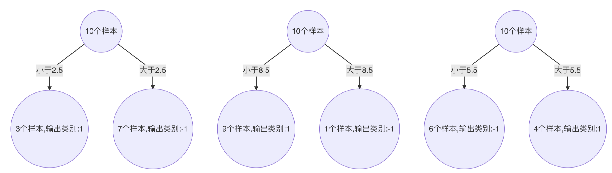


#### 5. 如何解读强学习器

- **集成学习本质**：
  - 强学习器不是单一决策规则，而是三个弱分类器的加权投票
  - 每个弱分类器的投票权重不同（α₁=0.4236, α₂=0.6496, α₃=0.7514）
  - 最终决策取决于加权和的正负号
- **决策过程**：
  - 对于输入 $x$，计算加权得分：$H(x) = 0.4236G_1(x) + 0.6496G_2(x) + 0.7514G_3(x)$
  - 如果 $H(x) > 0$，预测为正类（1）
  - 如果 $H(x) < 0$，预测为负类（-1）
- **模型优势**：
  - 组合多个简单决策边界形成复杂决策边界
  - 对训练数据中的噪声和异常值更鲁棒
  - 相比单一弱分类器，具有更强的泛化能力


**计算示例**

以 $x=3$ 为例（真实标签为 -1）：

- 计算弱分类器输出：
  - $G_1(3) = -1$（因为 3 > 2.5）
  - $G_2(3) = 1$（因为 3 ≤ 8.5）
  - $G_3(3) = 1$（因为 3 ≤ 5.5）
- 计算加权和：
  $H(3) = 0.4236 \times (-1) + 0.6496 \times (1) + 0.7514 \times (1) = -0.4236 + 0.6496 + 0.7514 = 0.9774$
- 应用符号函数：
  $G(3) = \text{sign}(0.9774) = 1$

结果：预测为正类（1），但真实标签为 -1 → 错误分类


### 3.4 AdaBoost实战葡萄酒数据

**数据集说明**
葡萄酒分为白葡萄酒和红葡萄酒两类，本分析基于白葡萄酒数据集，包含13个关键特征：

- 固定酸度、挥发性酸度、柠檬酸、残留糖、氯化物
- 游离二氧化硫、总二氧化硫、密度、pH值、硫酸盐
- 酒精、质量等

**分析目标**
通过酒的物理化学性质与质量的关系，识别影响葡萄酒质量的关键特征及其作用机制。

```python
# === 数据准备 ===
import pandas as pd
from sklearn.preprocessing import LabelEncoder
from sklearn.model_selection import train_test_split

# 加载数据并修改列名
df_wine = pd.read_csv('data/wine.data')
df_wine.columns = [
    'Class label', 'Alcohol', 'Malic acid', 'Ash', 
    'Alcalinity of ash', 'Magnesium', 'Total phenols',
    'Flavanoids', 'Nonflavanoid phenols', 'Proanthocyanins',
    'Color intensity', 'Hue', 'OD280/OD315', 'Proline'
]

# 数据预处理
df_wine = df_wine[df_wine['Class label'] != 1]  # 移除类别1
X = df_wine[['Alcohol', 'Hue']].values          # 选择关键特征
y = LabelEncoder().fit_transform(df_wine['Class label'])  # 标签编码 (2,3)→(0,1)

# 划分数据集
X_train, X_test, y_train, y_test = train_test_split(
    X, y, test_size=0.4, random_state=1
)

# === 模型训练与评估 ===
from sklearn.tree import DecisionTreeClassifier
from sklearn.ensemble import AdaBoostClassifier
from sklearn.metrics import accuracy_score

# 决策树模型
tree = DecisionTreeClassifier(
    criterion='entropy', 
    max_depth=1, 
    random_state=0
)
tree.fit(X_train, y_train)

# 评估决策树
tree_train_acc = accuracy_score(y_train, tree.predict(X_train))
tree_test_acc = accuracy_score(y_test, tree.predict(X_test))
print(f'决策树 训练集/测试集准确率: {tree_train_acc:.3f}/{tree_test_acc:.3f}')
# 输出: 决策树 训练集/测试集准确率: 0.845/0.854

# AdaBoost模型
ada = AdaBoostClassifier(
    base_estimator=tree,
    n_estimators=500,
    learning_rate=0.1,
    random_state=0
)
ada.fit(X_train, y_train)

# 评估AdaBoost
ada_train_acc = accuracy_score(y_train, ada.predict(X_train))
ada_test_acc = accuracy_score(y_test, ada.predict(X_test))
print(f'AdaBoost 训练集/测试集准确率: {ada_train_acc:.3f}/{ada_test_acc:.3f}')
# 输出: AdaBoost 训练集/测试集准确率: 1.000/0.875
```

**关键结论**

- **性能对比**
  - 决策树：训练集准确率 84.5%，测试集准确率 85.4%
  - AdaBoost：训练集准确率 100%，测试集准确率 87.5%
- **模型特性分析**
  - AdaBoost 完美拟合训练数据，测试性能显著优于单层决策树
  - 决策树呈现明显过拟合倾向（训练/测试差距小但准确率低）
  - AdaBoost 通过集成学习有效提升泛化能力

> **核心发现**：AdaBoost 通过组合多个弱分类器（单层决策树），显著降低了过拟合风险，相比单一决策树模型测试准确率提升 2.1%，验证了集成学习在葡萄酒质量预测中的有效性。


## 4、GBDT 

###  4.1 提升树（Boosting Tree）

**核心思想**

- **类比解释**：假设预测一个人年龄（真实值30岁）
  - 第一棵树预测20岁 → 误差10岁
  - 第二棵树拟合残差预测6岁 → 误差4岁
  - 第三棵树拟合残差预测3岁 → 误差1岁
  - 最终预测：20+6+3=29岁（接近真实值）

> 通过拟合残差可将多个弱学习器组成一个强学习器，这就是提升树的最朴素思想

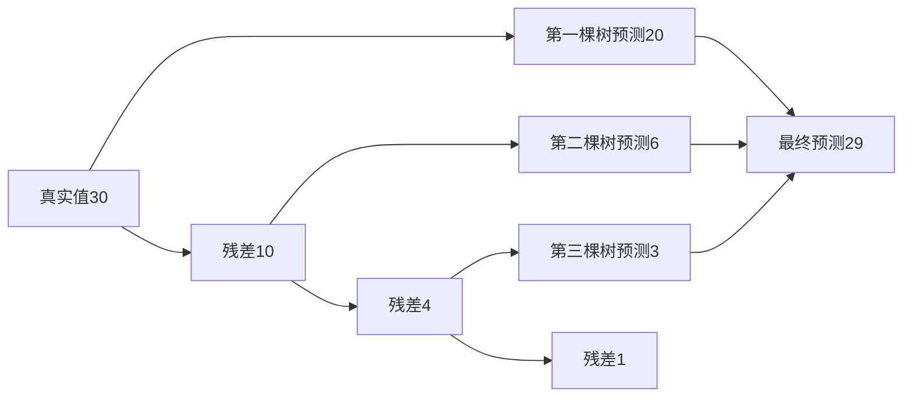
```mermaid
graph LR
A[真实值30] --> B[第一棵树预测20]
A --> C[残差10]
C --> D[第二棵树预测6]
C --> E[残差4]
E --> F[第三棵树预测3]
E --> G[残差1]
B --> H[最终预测29]
D --> H
F --> H
```


### 4.2 梯度提升树

#### 4.2.1 改进点

| 对比项       | 传统提升树     | 梯度提升树           |
| :----------- | :------------- | :------------------- |
| **拟合目标** | 残差           | 损失函数的负梯度     |
| **损失函数** | 仅支持平方损失 | 支持任意可导损失函数 |
| **泛化能力** | 一般           | 更强                 |


#### 4.2.2 核心假设

- 前一轮迭代得到的强学习器：$$ f_{t-1}(x) $$
- 损失函数：$$ L(y, f_{t-1}(x)) $$
- 本轮迭代目标：找到弱学习器 $$ h_t(x) $$  
- 最小化损失：  
   $$
   L(y, f_t(x)) = L(y, f_{t-1}(x) + h_t(x))
   $$


#### 4.2.3 平方损失函数的推导
当损失函数为平方损失时：  
$$
L(y, f_t(x)) = \left( y - f_t(x) \right)^2 = \left( y - f_{t-1}(x) - h_t(x) \right)^2
$$

对 $$ h_t(x) $$ 求偏导：  
$$
\frac{\partial L}{\partial h_t(x)} = -2 \left( y - f_{t-1}(x) - h_t(x) \right)
$$

令偏导为零解得：  
$$
y - f_{t-1}(x) - h_t(x) = 0 \implies \textcolor{blue}{h_t(x) = y - f_{t-1}(x)}
$$


**负梯度的本质**

损失函数为平方损失时，负梯度表达式为：  
$$
-\frac{\partial L(y, f(x_i))}{\partial f(x_i)} = \textcolor{red}{y_i - f(x_i)}
$$

**关键结论**：  

- 在回归问题中，GBDT 拟合的负梯度等价于残差 $$ \textcolor{red}{y_i - f(x_i)} $$。
- 在分类问题中（如使用 LogLoss），拟合目标变为该损失函数的负梯度值。

> 解释
>
> 1. **最优解**：上述方程的解 $h_t(x) = y - f_{t-1}(x)$ 表示在当前样本上，弱学习器 $h_t(x)$ 应该拟合的目标值就是残差（真实值 $y$ 与当前模型预测值 $f_{t-1}(x)$ 的差）。
>
> 2. **残差拟合**：在平方损失下，负梯度（即损失函数关于 $f_{t-1}(x)$ 的负梯度）恰好等于残差：
>
> $$
> \frac{\partial L(y, f_{t-1}(x))}{\partial f_{t-1}(x)} = y - f_{t-1}(x)
> $$
>
> 因此，令偏导为零得到的解与用负梯度拟合的结果一致。


### 4.3 GBDT例子

| 时间   | 1    | 2    | 3    | 4    | 5    | 6    | 7    | 8    | 9    | 10   |
| :----- | :--- | :--- | :--- | :--- | :--- | :--- | :--- | :--- | :--- | :--- |
| 目标值 | 5.56 | 5.70 | 5.91 | 6.40 | 6.80 | 7.05 | 8.90 | 8.70 | 9.00 | 9.05 |


#### 4.3.1 **初始化弱学习器（CART树）**

通过最小化**平方误差损失函数**确定初始预测值：
$$
L(y, f(x)) = \frac{1}{2} \sum_{i=1}^{n} (y_i - f(x_i))^2
$$
对损失函数求导并令导数为零：

$$
\begin{aligned}
\frac{\partial L}{\partial f(x_i)} &= \sum_{i=1}^{n} (y_i - f(x_i)) = 0 \\
\Rightarrow \sum_{i=1}^{n} f(x_i) &= \sum_{i=1}^{n} y_i \\
\Rightarrow f(x_i) &= \frac{\sum_{i=1}^{n} y_i}{n}
\end{aligned}
$$

**计算结果**

- **计算目标值总和**：

$$
\sum y_i = 5.56 + 5.70 + 5.91 + 6.40 + 6.80 + 7.05 + 8.90 + 8.70 + 9.00 + 9.05 = 73.07
$$

- **计算初始预测值**：

$$
f(x_i) = \frac{73.07}{10} = 7.307 \approx 7.31
$$

- **初始输出**：所有样本的初始预测值均为 **7.31**


#### 4.3.2 构建第一个弱学习器（CART树）

**样本数据与负梯度计算**

梯度提升中，负梯度定义为目标值与预测值之差：  
$$
-\left[ \frac{\partial L(y, f(x_i))}{\partial f(x_i)} \right] = y_i - f(x_i)
$$

>
> 其中 $L$ 为平方损失函数 $L(y, f(x_i)) = \frac{1}{2}(y_i - f(x_i))^2$。


初始预测值 $f(x_i) = 7.31$（所有样本相同），目标值 $y_i$ 给定。负梯度计算结果如下表（保留两位小数）：

| $x$                   | 1     | 2     | 3     | 4     | 5     | 6     | 7    | 8    | 9    | 10   |
| --------------------- | ----- | ----- | ----- | ----- | ----- | ----- | ---- | ---- | ---- | ---- |
| 目标值 $y_i$          | 5.56  | 5.70  | 5.91  | 6.40  | 6.80  | 7.05  | 8.90 | 8.70 | 9.00 | 9.05 |
| 预测值 $f(x_i)$       | 7.31  | 7.31  | 7.31  | 7.31  | 7.31  | 7.31  | 7.31 | 7.31 | 7.31 | 7.31 |
| 负梯度 $y_i - f(x_i)$ | -1.75 | -1.61 | -1.40 | -0.91 | -0.51 | -0.26 | 1.59 | 1.39 | 1.69 | 1.74 |


**切分点选择与平方损失计算**

CART 树通过枚举切分点（基于 $x$）并最小化平方损失选择最佳分裂。平方损失定义为：  
$$
\text{Loss} = \sum_{\text{left}} (y_i - c_L)^2 + \sum_{\text{right}} (y_i - c_R)^2
$$
其中 $c_L$ 和 $c_R$ 分别为左、右子集的样本均值（回归树中作为预测值）。


各切分点的平方损失计算结果如下（保留两位小数），**最小损失为 1.93（切分点 6.5）**：

| 切分点   | 1.5   | 2.5   | 3.5  | 4.5  | 5.5  | 6.5      | 7.5  | 8.5   | 9.5   |
| -------- | ----- | ----- | ---- | ---- | ---- | -------- | ---- | ----- | ----- |
| 平方损失 | 15.72 | 12.08 | 8.37 | 5.78 | 3.91 | **1.93** | 8.01 | 11.74 | 15.74 |

**计算过程示例（切分点 1.5）**

- **数据划分**：

   - 左子集 ($x \leq 1.5$): $[x=1] \rightarrow \{5.56\}$
   - 右子集 ($x > 1.5$): $[x=2,3,4,5,6,7,8,9,10] \rightarrow \{5.70, 5.91, 6.40, 6.80, 7.05, 8.90, 8.70, 9.00, 9.05\}$

- **子集预测值（均值）**：
   - $c_L = 5.56$（左子集仅一个样本）
   - $c_R = \frac{5.70 + 5.91 + 6.40 + 6.80 + 7.05 + 8.90 + 8.70 + 9.00 + 9.05}{9} = \frac{67.51}{9} = 7.5011$

- **平方损失计算**：
   - 左子集损失: $(5.56 - 5.56)^2 = 0$

   - 右子集损失:  

     $(5.70 - 7.5011)^2 + (5.91 - 7.5011)^2 + (6.40 - 7.5011)^2 + (6.80 - 7.5011)^2 + (7.05 - 7.5011)^2$  

     $+ (8.90 - 7.5011)^2 + (8.70 - 7.5011)^2 + (9.00 - 7.5011)^2 + (9.05 - 7.5011)^2$  

     $= (-1.8011)^2 + (-1.5911)^2 + (-1.1011)^2 + (-0.7011)^2 + (-0.4511)^2$ 


     $+ (1.3989)^2 + (1.1989)^2 + (1.4989)^2 + (1.5489)^2$  

     $= 3.245 + 2.532 + 1.212 + 0.491 + 0.203 + 1.956 + 1.437 + 2.246 + 2.399 = 15.721 \approx 15.72$


**最佳切分点与决策树构建**

- **最佳切分点**: 6.5（平方损失最小，为 1.93）。

- **划分规则**：
  - $x \leq 6.5$ → 左子叶（样本 $x=1,2,3,4,5,6$）。
  - $x > 6.5$ → 右子叶（样本 $x=7,8,9,10$）。
  
- **子叶预测值（均值）**：
  
  - 左子叶 ($x \leq 6.5$):  
    $$
    c_L = \frac{-1.75 -1.61 -1.40 -0.91 -0.51 -0.26}{6} = \frac{-6.44}{6}  \approx 1.07
    $$
  
  - 右子叶 ($x > 6.5$):  
    $$
    c_R = \frac{1.59 + 1.39 + 1.69 + 1.74}{4} = \frac{6.41}{4} \approx 1.60
    $$

> 在梯度提升树（Gradient Boosting Tree）中，子叶预测值**是子叶中负梯度（残差）的均值**，而不是原始目标值的均值。以下是关键解释：
>
> **核心逻辑**
>
> - **负梯度的本质** 
>
>    当前模型（初始预测值 $7.31$）的残差：  $r_i = y_i - f(x_i) = \text{负梯度}$
>
> - **CART树的拟合目标**  
>
>    弱学习器（CART树）的目标是拟合这些残差$r_i$，而非原始目标值$y_i$。
>
> - **子叶输出值的计算**  
>
>    对于每个叶子节点，预测值为该节点内所有样本的**残差（负梯度）的均值**：  $\text{子叶输出值} = \frac{1}{N_{\text{leaf}}} \sum_{i \in \text{leaf}} r_i$

> **结论**
>
> | 概念             | 计算依据          | 示例值 (左子叶) | 示例值 (右子叶) |
> | :--------------- | :---------------- | :-------------- | :-------------- |
> | **子叶输出值**   | 负梯度的均值      | -1.0733         | 1.6025          |
> | **更新后预测值** | 初始值 + 子叶输出 | 6.2367          | 8.9125          |
> | **目标值均值**   | 原始 $y_i$ 的均值 | 6.2367          | 8.9125          |
>
> - **CART 树直接输出的是负梯度的均值**（残差的均值）。
> - 表格中的 "子叶预测值" 6.24 和 8.91 实际是**更新后的模型预测值**，而非树的直接输出。


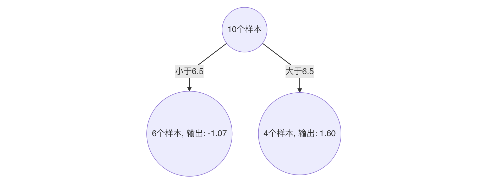


#### 4.3.3 构建第二个弱学习器（CART树）

当前模型的残差（负梯度）计算结果如下：

| $x$            | 1     | 2     | 3     | 4     | 5     | 6     | 7     | 8     | 9    | 10   |
| -------------- | ----- | ----- | ----- | ----- | ----- | ----- | ----- | ----- | ---- | ---- |
| 目标值（残差） | -1.75 | -1.61 | -1.40 | -0.91 | -0.51 | -0.26 | 1.59  | 1.39  | 1.69 | 1.74 |
| 预测值         | -1.07 | -1.07 | -1.07 | -1.07 | -1.07 | -1.07 | 1.60  | 1.60  | 1.60 | 1.60 |
| 新负梯度       | -0.68 | -0.54 | -0.33 | 0.16  | 0.56  | 0.81  | -0.01 | -0.21 | 0.09 | 0.14 |

> **注**：新负梯度 = 目标值（残差） - 预测值


**切分点选择与平方损失计算**

各切分点的平方损失计算结果如下（**最小损失为0.79，切分点3.5**）：

| 切分点   | 1.5  | 2.5  | 3.5      | 4.5  | 5.5  | 6.5  | 7.5  | 8.5  | 9.5  |
| -------- | ---- | ---- | -------- | ---- | ---- | ---- | ---- | ---- | ---- |
| 平方损失 | 1.42 | 1.00 | **0.79** | 1.13 | 1.66 | 1.93 | 1.93 | 1.90 | 1.91 |

**计算过程示例**（切分点3.5）

- **数据划分**：
   - 左子集($x \leq 3.5$): $\{-1.75, -1.61, -1.40\}$
   - 右子集($x > 3.5$): $\{-0.91, -0.51, -0.26, 1.59, 1.39, 1.69, 1.74\}$

- **子集预测值（均值）**：
   - $c_L = \frac{-1.75-1.61-1.40}{3} = -1.5867$
   - $c_R = \frac{-0.91-0.51-0.26+1.59+1.39+1.69+1.74}{7} = 0.5186$

- **平方损失计算**：
   - 左子集损失: $(-1.75+1.5867)^2 + (-1.61+1.5867)^2 + (-1.40+1.5867)^2 = 0.0266 + 0.0005 + 0.0348 = 0.0619$
   - 右子集损失: $(-0.91-0.5186)^2 + \cdots + (1.74-0.5186)^2 = 2.0406 + \cdots + 1.4916 = 0.7281$
   - 总损失: $0.0619 + 0.7281 = 0.79$


**最佳切分点与决策树构建**

- **最佳切分点**: 3.5（平方损失最小，为0.79）
- **划分规则**：
  - $x \leq 3.5$ → 左子叶（样本$x=1,2,3$）
  - $x > 3.5$ → 右子叶（样本$x=4,5,6,7,8,9,10$）
- **子叶输出值（残差均值）**：
  - 左子叶: $-0.52$
  - 右子叶: $0.22$


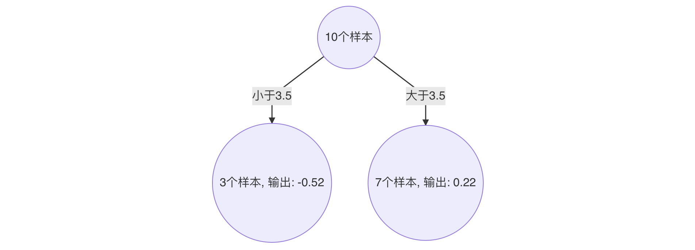

#### 4.3.4 构建第三个弱学习器（CART树）

当前模型的残差（负梯度）计算结果如下：

| $x$            | 1     | 2     | 3     | 4     | 5    | 6    | 7     | 8     | 9     | 10    |
| -------------- | ----- | ----- | ----- | ----- | ---- | ---- | ----- | ----- | ----- | ----- |
| 目标值（残差） | -0.68 | -0.54 | -0.33 | 0.16  | 0.56 | 0.81 | -0.01 | -0.21 | 0.09  | 0.14  |
| 预测值         | -0.52 | -0.52 | -0.52 | 0.22  | 0.22 | 0.22 | 0.22  | 0.22  | 0.22  | 0.22  |
| 新负梯度       | -0.16 | -0.02 | 0.19  | -0.06 | 0.34 | 0.59 | -0.23 | -0.43 | -0.13 | -0.08 |

> **计算公式**：新负梯度 = 目标值（残差） - 预测值


**切分点选择与平方损失计算**

各切分点的平方损失计算结果如下（**最小损失为0.47，切分点6.5**）：

| 切分点   | 1.5  | 2.5  | 3.5  | 4.5  | 5.5  | 6.5      | 7.5  | 8.5  | 9.5  |
| -------- | ---- | ---- | ---- | ---- | ---- | -------- | ---- | ---- | ---- |
| 平方损失 | 0.76 | 0.77 | 0.79 | 0.79 | 0.76 | **0.47** | 0.59 | 0.76 | 0.78 |


以 6.5 作为切分点损失最小，构建决策树如下：

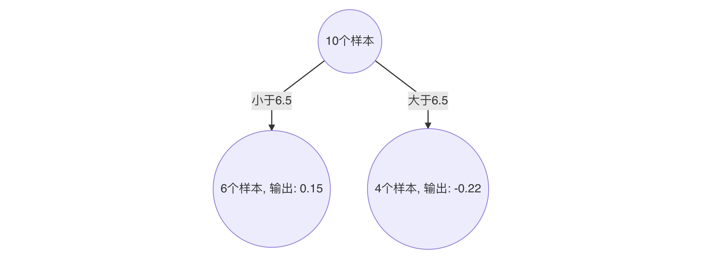

#### 4.3.5 最终强学习器

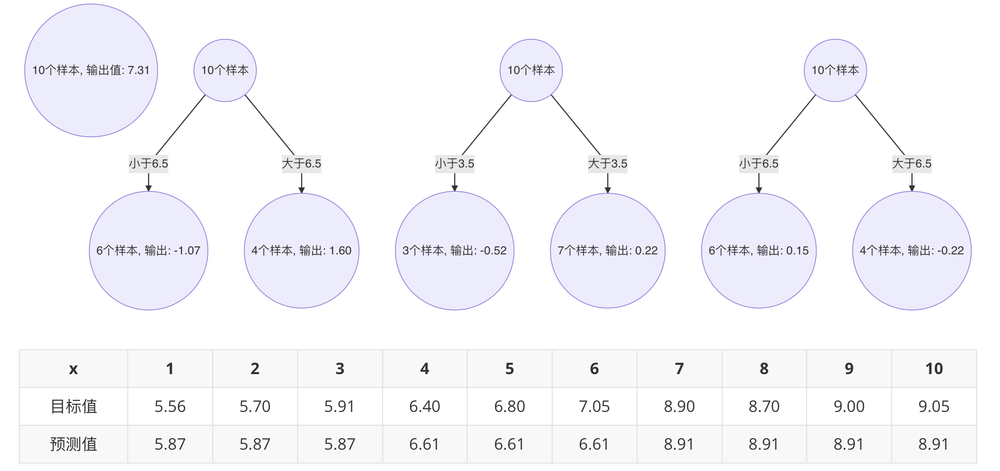


#### 4.3.6 GBDT算法流程

##### a. 初始化弱学习器

计算目标值的均值作为初始预测值：  $f_0(x) = \bar{y} = \frac{1}{N}\sum_{i=1}^{N} y_i$

**示例**：初始预测值 $7.31$


##### b. 迭代构建学习器（$m=1$ 到 $M$）

对于每轮迭代：

**计算负梯度（伪残差）**$r_{im} = y_i - f_{m-1}(x_i)$  

**第一轮残差示例**：  

$[-1.75, -1.61, -1.40, -0.91, -0.51, -0.26, 1.59, 1.39, 1.69, 1.74]$


**训练CART树**

最小化平方损失选择切分点：  

$\min_{s} \left[ \min_{c_L} \sum_{x_i \in R_L} (r_{im} - c_L)^2 + \min_{c_R} \sum_{x_i \in R_R} (r_{im} - c_R)^2 \right]$

**切分点选择示例**：

| 切分点 | 1.5  | 2.5  | 3.5  | 4.5  | 5.5  | 6.5  | 7.5  | 8.5  | 9.5  |
| ------ | ---- | ---- | ---- | ---- | ---- | ---- | ---- | ---- | ---- |
| 损失   | 1.42 | 1.00 | 0.79 | 1.13 | 1.66 | 1.93 | 1.93 | 1.90 | 1.91 |


**计算叶节点输出**

$c_{jm} = \frac{1}{|R_j|}\sum_{x_i \in R_j} r_{im}$

**示例**：
- 左叶节点：$-1.0733$
- 右叶节点：$1.6025$


**更新模型**

$f_m(x) = f_{m-1}(x) + \eta \cdot h_m(x)$  

（通常 $\eta=1$）


##### c. 终止条件

- 达到最大迭代次数 $M$
- 或损失变化 $<\epsilon$


##### d. 预测未知样本

$\hat{y} = f_0(x) + \sum_{m=1}^{M} h_m(x)$

**预测示例**（$x=1$）：  $7.31 + (-1.0733) + (-1.5867) + (-0.0033) ≈ 4.65$


### 4.4 泰坦尼克号案例实战

```python
### 4.4 泰坦尼克号案例实战
# 该案例是在随机森林的基础上修改的，可以对比理解

# 1. 数据导入
# 1.1 导入必要库
import pandas as pd

# 1.2 利用pandas的read.csv读取泰坦尼克号数据集
titanic = pd.read_csv("../data/泰坦尼克号数据集.csv")
titanic.info()  # 查看数据集信息

# 2. 人工选择特征 pclass, age, sex
X = titanic[['Pclass', 'Age', 'Sex']]
y = titanic['Survived']

# 3. 特征工程
# 3.1 数据的填补 - 用平均值填充Age缺失值
X['Age'].fillna(X['Age'].mean(), inplace=True)

# 3.2 数据的切分
from sklearn.model_selection import train_test_split
X_train, X_test, y_train, y_test = train_test_split(X, y, test_size=0.25, random_state=22)

# 3.3 将数据转化为特征向量(sex含有字符串，不能训练，作用与pd.get_dummies类似)
from sklearn.feature_extraction import DictVectorizer
vec = DictVectorizer(sparse=False)
X_train = vec.fit_transform(X_train.to_dict(orient='records'))
X_test = vec.transform(X_test.to_dict(orient='records'))

# 4. 使用单一的决策树进行模型的训练及预测分析
from sklearn.tree import DecisionTreeClassifier
dtc = DecisionTreeClassifier()
dtc.fit(X_train, y_train)
dtc_y_pred = dtc.predict(X_test)
print("Decision Tree Score:", dtc.score(X_test, y_test))

# 5. 随机森林进行模型的训练和预测分析
from sklearn.ensemble import RandomForestClassifier
rfc = RandomForestClassifier(random_state=9)
rfc.fit(X_train, y_train)
rfc_y_pred = rfc.predict(X_test)
print("Random Forest Score:", rfc.score(X_test, y_test))

# 6. GBDT进行模型的训练和预测分析
from sklearn.ensemble import GradientBoostingClassifier
gbc = GradientBoostingClassifier()
gbc.fit(X_train, y_train)
gbc_y_pred = gbc.predict(X_test)
print("GBDT Score:", gbc.score(X_test, y_test))

# 7. 性能评估
from sklearn.metrics import classification_report
print("\nDecision Tree Classification Report:")
print(classification_report(dtc_y_pred, y_test))

print("\nRandom Forest Classification Report:")
print(classification_report(rfc_y_pred, y_test))

print("\nGBDT Classification Report:")
print(classification_report(gbc_y_pred, y_test))
```


## 5、XGBoost

XGBoost（极端梯度提升树）是集成学习方法的王牌算法，在Kaggle等数据挖掘比赛中，大部分获胜者都使用了XGBoost。该算法在绝大多数的回归和分类问题上表现十分顶尖。

### 5.1 XGBoost算法思想

XGBoost是对GBDT（梯度提升决策树）的改进，主要创新点包括：

- **泰勒二阶展开**：求解损失函数数值时使用泰勒二阶展开，提高了精度
- **正则化项**：在损失函数中加入了正则化项，防止过拟合
- **自定义分裂指标**：自创树节点分裂指标，该指标从损失函数推导而来，同时考虑了树的复杂度


**模型优化原理**

构建最优模型的方法是最小化训练数据的损失函数：

$$
\min \frac{1}{N} \sum_{i=1}^{N} L(y_i, f(x_i))
$$

其中：  
- $L(y_i, f(x_i))$ 是预测值和真实值的损失函数  
- $N$ 是样本数量  


这种方法训练得到的模型复杂度较高，很容易出现过拟合。为了降低模型复杂度并防止过拟合，XGBoost在损失函数中添加了正则化项 $\Omega(f)$：
$$
\min \frac{1}{N} \sum_{i=1}^{N} L(y_i, f(x_i)) + \Omega(f)
$$

这种方法有效提高了模型对未知数据的泛化能力。


### 5.2 XGboost的目标函数

XGBoost (Extreme Gradient Boosting) 是对梯度提升树的改进，在损失函数中加入了正则化项：
$$
obj(\theta) = \sum_{i}^{n} L(y_i, \hat{y}_i) + \sum_{k=1}^{K} \Omega(f_k)
$$

> 目标函数的第一项表示整个强学习器的损失，第二部分表示强学习器中 $K$ 个弱学习器的复杂度。
>


XGBoost 每一个弱学习器的复杂度主要从两个方面来考量：
$$
\Omega(f) = \gamma T + \frac{1}{2} \lambda \|w\|^2
$$

- $\gamma T$ 中的 $T$ 表示一棵树的叶子结点数量，$\gamma$ 是对该项的调节系数  
- $\lambda \|w\|^2$ 中的 $w$ 表示叶子结点输出值组成的向量，$\lambda$ 是对该项的调节系数


#### 5.2.1 模型复杂度的介绍

假设我们要预测一家人对电子游戏的喜好程度，考虑到年轻和年长者相比，年轻更可能喜欢电子游戏，以及男性和女性相比，男性更喜欢电子游戏，故先根据年龄大小区分小孩和大人，然后再通过性别区分开是男是女，逐一给各人在电子游戏喜好程度上打分，如下图所示:


**预测过程**:  

- 训练出2棵树（tree1和tree2），类似GBDT的原理，两棵树的结论相加为最终结果。  
  - 小男孩的预测分数：$2 + 0.9 = 2.9$  
  - 爷爷的预测分数：$-1 + 0.9 = -0.1$  


如下树tree1的复杂度表示为：


#### 5.2.2 泰勒公式展开

进行 $t$ 次迭代的学习模型的目标函数如下为：
$$
obj^{(t)} = \sum_{i=1}^{n} L \left( y_i, \hat{y}_i^{(t)} \right) + \sum_{k=1}^{t} \Omega (f_k)= \sum_{i=1}^{n} L \left( y_i, \hat{y}_i^{(t-1)} + f_t(x_i) \right) + \sum_{k=1}^{t-1} \Omega (f_k) + \Omega (f_t)
$$
我们直接对目标函数求解比较困难，通过泰勒展开将目标函数换一种近似的表示方式。


##### **a、泰勒展开**  

将一个函数在某一点处展开成无限项的多项式表达式  
$$
f(x + \Delta x) = f(x) + f'(x) \cdot \Delta x + \frac{1}{2} f''(x) \cdot \Delta x^2 + \ldots + \frac{1}{n!} f^{(n)}(x) \cdot \Delta x^n
$$

- **一阶泰勒展开**  
  $$
  f(x + \Delta x) \approx f(x) + f'(x) \cdot \Delta x
  $$

- **二阶泰勒展开**  
  $$
  f(x + \Delta x) \approx f(x) + f'(x) \cdot \Delta x + \frac{1}{2} f''(x) \cdot \Delta x^2
  $$


接下来对 $y^{(t-1)}$ 进行泰勒二阶展开，得到如下近似表示的公式：
$$
obj^{(t)} \approx \sum_{i=1}^m \left[ L \left( y_i, \hat{y}_i^{(t-1)} \right) + g_i f_t (x_i) + \frac{1}{2} h_i f_t^2 (x_i) \right] + \sum_{k=1}^{t-1} \Omega (f_k) + \Omega (f_t)
$$

其中，$g_i$ 和 $h_i$ 分别为损失函数的一阶导、二阶导：

$$
g_i = \partial_{\hat{y}^{(t-1)}} L \left( y_i, \hat{y}^{(t-1)} \right)
$$

$$
h_i = \partial^2_{\hat{y}^{(t-1)}} L \left( y_i, \hat{y}^{(t-1)} \right)
$$


##### b、**化简目标函数**

观察目标函数，发现以下两项表示 $t-1$ 个弱学习器构成学习器的目标函数，都是常数，我们可以将其去掉：

$$
obj^{(t)} \approx \sum_{i=1}^{m} \left[L(y_i, y_i^{(t-1)}) + g_if_t(x_i) + \frac{1}{2}h_if_t^2(x_i)\right] + \sum_{k=1}^{t-1} \Omega(f_k) + \Omega(f_t)
$$

简化后得到：

$$
obj^{(t)} \approx \sum_{i=1}^{m} \left[g_if_t(x_i) + \frac{1}{2}h_if_t^2(x_i)\right] + \Omega(f_t)
$$

进一步展开正则项 $\Omega(f_t)$：

$$
obj^{(t)} \approx \sum_{i=1}^{m} \left[g_if_t(x_i) + \frac{1}{2}h_if_t^2(x_i)\right] + \gamma T + \frac{1}{2}\lambda \|w\|^2
$$

> 这个公式中只有 f<sub>t</sub> ，该公式可以理解为，当前这棵树如何构建能够降低损失。

> **说明：**
>
> - **常数项移除**：  
>    - $L(y_i, y_i^{(t-1)})$ 和 $\sum_{k=1}^{t-1} \Omega(f_k)$ 是前 $t-1$ 轮的损失和正则项，在当前轮次 $t$ 中为常数，不影响优化。
> - **正则项分解**：  
>    - $\Omega(f_t) = \gamma T + \frac{1}{2}\lambda \|w\|^2$，其中 $T$ 是叶子节点数，$\|w\|^2$ 是叶子权重向量的 $L_2$ 范数。
> - **符号说明**：  
>    - $g_i$ 和 $h_i$ 分别为损失函数的一阶和二阶梯度（泰勒展开系数）。
>    - f<sub>t</sub>(x<sub>i</sub>) 表示样本的预测值


现在，我们发现公式的各个部分考虑的角度不同，有的从样本角度来看，例如：f<sub>t</sub>(x<sub>i</sub>) ，有的从叶子结点的角度来看，例如：T、||w||<sup>2</sup>。我们下面就要将其转换为相同角度的问题，这样方便进一步合并项、化简公式。我们统一将其转换为从叶子角度的问题：


例如：10 个样本，落在 D 结点 3 个样本，落在 E 结点 2 个样本，落在 F 结点 2 个样本，落在 G 结点 3 个样本

1. D 结点计算： w1 * gi1 + w1 * gi2 + w1 * gi3 = (gi1 + gi2 + gi3) * w1 

2. E 结点计算： w2 * gi4 + w2 * gi5 = (gi4 + gi5) * w2 

3. F 结点计算： w3 * gi6 + w3 * gi6 = (gi6 + gi7) * w3 
4. G 节点计算：w4 * gi8 + w4 * gi9 + w4 * gi10 = (gi8 + gi9 + gi10) * w4


g<sub>i</sub> f<sub>t</sub>(x<sub>i</sub>)  表示样本的预测值，我们将其转换为如下形式：


* w<sub>j</sub> 表示第 j 个叶子结点的值
* g<sub>i</sub> 表示每个样本的一阶导

h<sub>i</sub>f<sub>t</sub><sup>2</sup>(x<sub>i</sub>) 转换从叶子结点的问题，如下：


λ||w||<sup>2</sup> 由于本身就是从叶子角度来看，我们将其转换一种表示形式：


我们重新梳理下整理后的公式，如下：

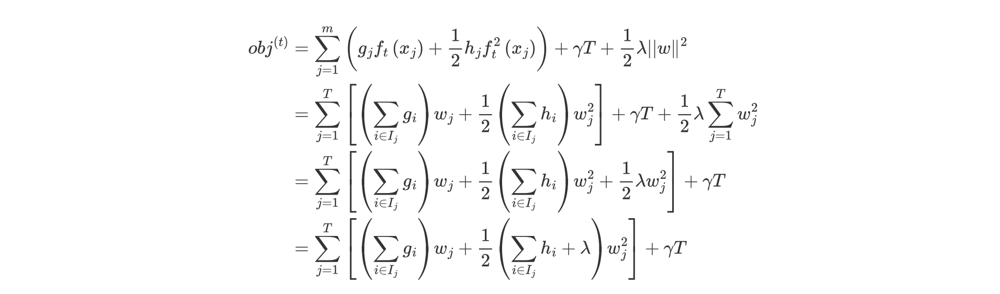

上面的公式太复杂了，我们令：


Gi 表示样本的一阶导之和，Hi 表示样本的二阶导之和，当确定损失函数时，就可以通过计算得到结果。

现在我们的公式变为：


- 对叶子结点求导

此时，公式可以看作是关于叶子结点 w 的一元二次函数，我们可以对 w 求导并令其等于 0，可得到 w 的最优值，将其代入到公式中，即可再次化简上面的公式。


将 w<sub>j</sub> 代入到公式中，即可得到：

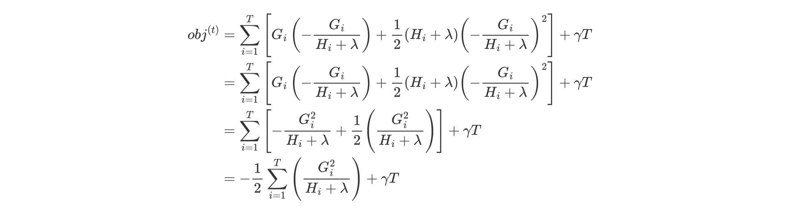

-  XGBoost的树构建方法

该公式也叫做打分函数 (scoring function)，它可以从树的损失函数、树的复杂度两个角度来衡量一棵树的优劣。

这个公式，我们怎么用呢？

当我们构建树时，可以用来选择树的最佳划分点。


其过程如下：

1. 对树中的每个叶子结点尝试进行分裂
2. 计算分裂前 - 分裂后的分数：
   1. 如果gain > 0，则分裂之后树的损失更小，我们会考虑此次分裂
   2. 如果gain< 0，说明分裂后的分数比分裂前的分数大，此时不建议分裂
3. 当触发以下条件时停止分裂：
   1. 达到最大深度
   2. 叶子结点样本数量低于某个阈值
   3. 等等...

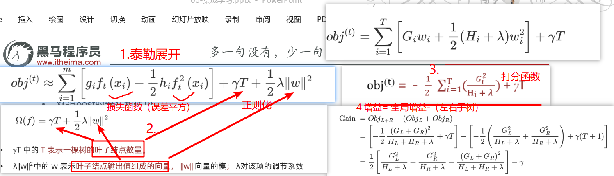

### XGboost API

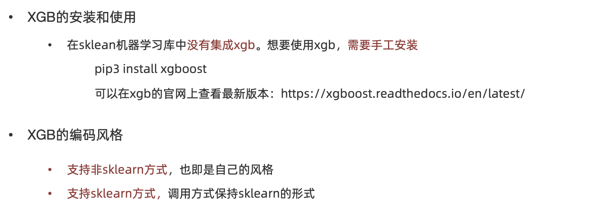

```python
bst = XGBClassifier(n_estimators, max_depth, learning_rate, objective)
```

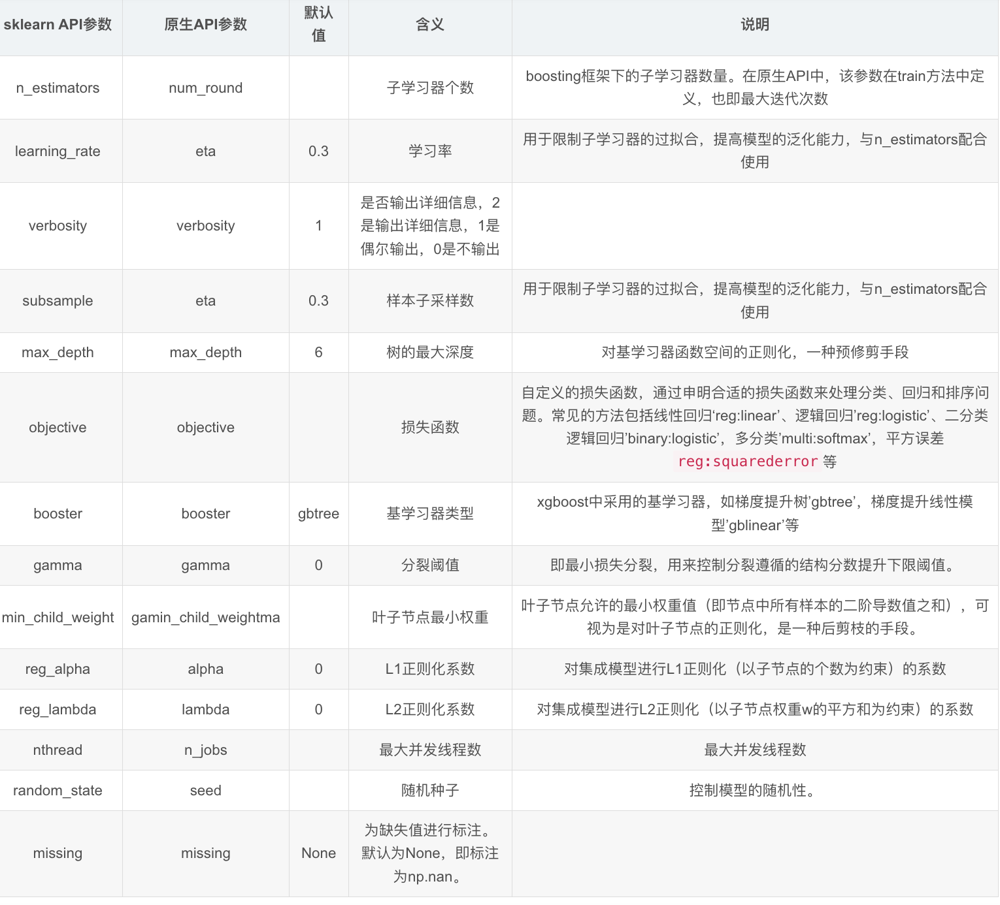

### 红酒品质预测

#### 数据集介绍

数据集共包含 11 个特征，共计 3269 条数据. 我们通过训练模型来预测红酒的品质, 品质共有 6 个各类别，分别使用数字: 1、2、3、4、5 来表示。

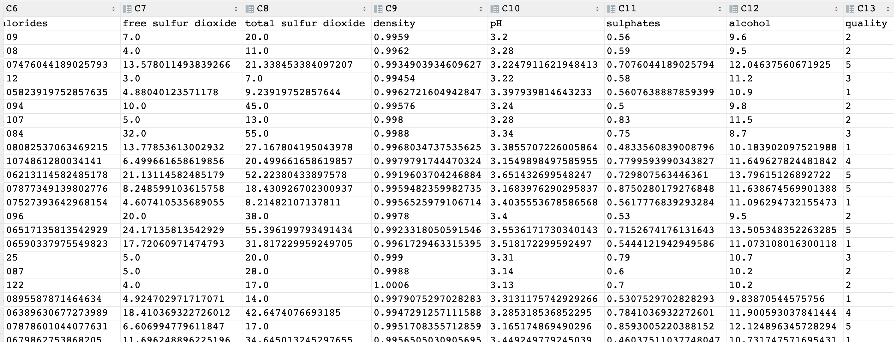

#### 案例实现

-  导入需要的库文件

```python
import joblib
import numpy as np
import xgboost as xgb
import pandas as pd
import numpy as np
from collections import Counter
from sklearn.model_selection import train_test_split
from sklearn.metrics import classification_report
from sklearn.model_selection import StratifiedKFold
```

-  数据基本处理

```python
def test01():

    # 1. 加载训练数据
    data = pd.read_csv('data/红酒品质分类.csv')
    x = data.iloc[:, :-1]
    y = data.iloc[:, -1] - 3

    # 2. 数据集分割
    x_train, x_valid, y_train, y_valid = train_test_split(x, y, test_size=0.2, stratify=y, random_state=22)

    # 3. 存储数据
    pd.concat([x_train, y_train], axis=1).to_csv('data/红酒品质分类-train.csv')
    pd.concat([x_valid, y_valid], axis=1).to_csv('data/红酒品质分类-valid.csv')
```

- 模型基本训练

```python
def test02():

    # 1. 加载训练数据
    train_data = pd.read_csv('data/红酒品质分类-train.csv')
    valid_data = pd.read_csv('data/红酒品质分类-valid.csv')

    # 训练集
    x_train = train_data.iloc[:, :-1]
    y_train = train_data.iloc[:, -1]

    # 测试集
    x_valid = valid_data.iloc[:, :-1]
    y_valid = valid_data.iloc[:, -1]

    # 2. XGBoost模型训练
    estimator = xgb.XGBClassifier(n_estimators=100,
                                  objective='multi:softmax',
                                  eval_metric='merror',
                                  eta=0.1,
                                  use_label_encoder=False,
                                  random_state=22)
    estimator.fit(x_train, y_train)

    # 3. 模型评估
    y_pred = estimator.predict(x_valid)
    print(classification_report(y_true=y_valid, y_pred=y_pred))

    # 4. 模型保存
    joblib.dump(estimator, 'model/xgboost.pth')
```

- 模型参数调优

```python
# 样本不均衡问题处理
from sklearn.utils import class_weight
classes_weights = class_weight.compute_sample_weight(class_weight='balanced',y=y_train)
# 训练的时候，指定样本的权重
estimator.fit(x_train, y_train,sample_weight = classes_weights)
y_pred = estimator.predict(x_valid)
print(classification_report(y_true=y_valid, y_pred=y_pred))

# 交叉验证，网格搜索
train_data = pd.read_csv('data/红酒品质分类-train.csv')
valid_data = pd.read_csv('data/红酒品质分类-valid.csv')

# 训练集
x_train = train_data.iloc[:, :-1]
y_train = train_data.iloc[:, -1]

# 测试集
x_valid = valid_data.iloc[:, :-1]
y_valid = valid_data.iloc[:, -1]

spliter = StratifiedKFold(n_splits=5, shuffle=True)
# 2. 定义超参数
param_grid = {'max_depth': np.arange(3, 5, 1),
              'n_estimators': np.arange(50, 150, 50),
              'eta': np.arange(0.1, 1, 0.3)}
estimator = xgb.XGBClassifier(n_estimators=100,
                              objective='multi:softmax',
                              eval_metric='merror',
                              eta=0.1,
                              use_label_encoder=False,
                              random_state=22)
cv = GridSearchCV(estimator,param_grid,cv=spliter)
y_pred = cv.predict(x_valid)
print(classification_report(y_true=y_valid, y_pred=y_pred))
```
