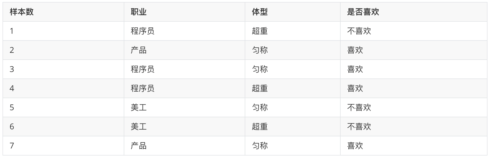
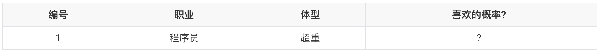
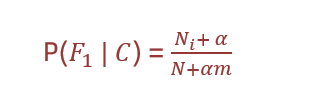
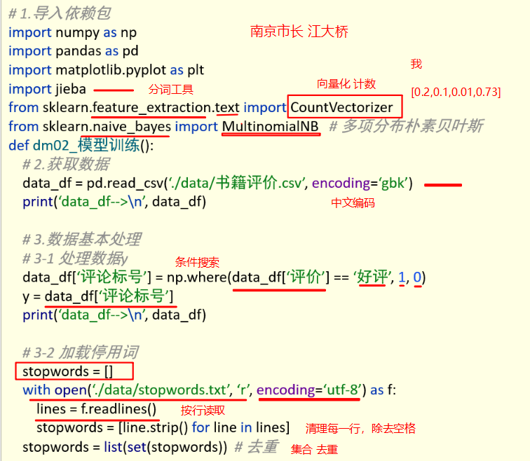
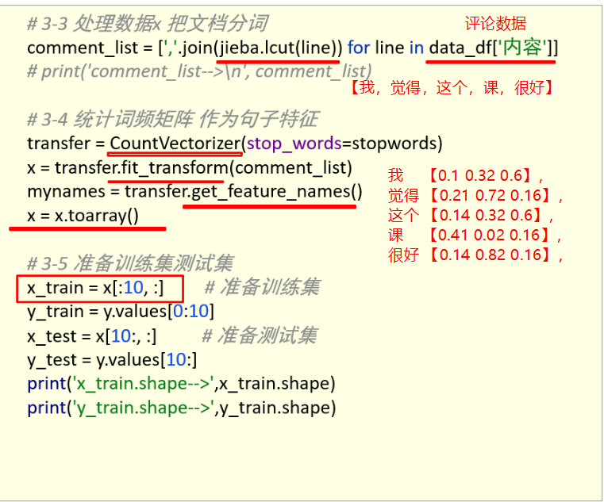
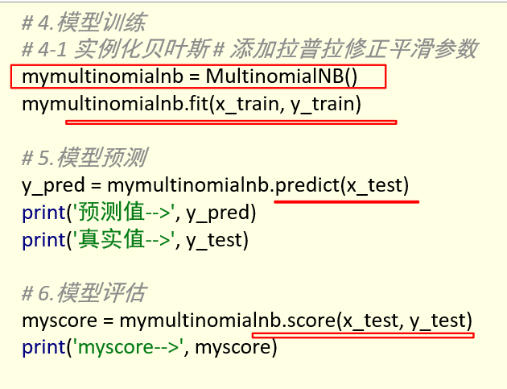

# 朴素贝叶斯

## 朴素贝叶斯介绍

1. 复习常见概率的计算
2. 知道贝叶斯公式
3. 了解朴素贝叶斯是什么
4. 了解拉普拉斯平滑系数的作用


###  【知道】常见的概率公式



**条件概率：** 表示事件A在另外一个事件B已经发生条件下的发生概率，P(A|B)


在女神喜欢的条件下，职业是程序员的概率？


1. 女神喜欢条件下，有 2、3、4、7 共 4 个样本
2. 4 个样本中，有程序员 3、4 共 2 个样本
3. 则 P(程序员|喜欢) = 2/4 = 0.5

**联合概率：** 表示多个条件同时成立的概率，P(AB)   =  P(A)   P(B|A)    
特征条件独立性假设：P(AB) = P(A) P(B)

职业是程序员并且体型匀称的概率？


1. 数据集中，共有 7 个样本	
2. 职业是程序员有 1、3、4 共 3 个样本，则其概率为：3/7
3. 在职业是程序员，体型是匀称有 3  共 1 个样本，则其概率为：1/3
4. 则即是程序员又体型匀称的概率为：3/7 \* 1/3 = 1/7

**联合概率 + 条件概率：**

在女神喜欢的条件下，职业是程序员、体重超重的概率？  P(AB|C) = P(A|C) P(B|AC)


1. 在女神喜欢的条件下，有 2、3、4、7 共 4 个样本
2. 在这 4 个样本中，职业是程序员有 3、4 共 2 个样本，则其概率为：2/4=0.5
3. 在在 2 个样本中，体型超重的有 4 共 1 个样本，则其概率为：1/2 = 0.5
4. 则 P(程序员, 超重|喜欢) = 0.5 \* 0.5 = 0.25


> 简言之：
> 条件概率：在去掉部分样本的情况下，计算某些样本的出现的概率，表示为：P(B|A)
> 联合概率：多个事件同时发生的概率是多少，表示为：P(AB) = P(B)*P(A|B)


### 【理解】贝叶斯公式


1. P(C) 表示 C 出现的概率
2. P(W|C) 表示 C 条件 W 出现的概率
3. P(W) 表示 W 出现的概率





1. P(C|W) = P(喜欢|程序员，超重)
2. P(W|C) = P(程序员，超重|喜欢)
3. P(C) = P(喜欢)
4. P(W) = P(程序员，超重)

<br />

1. 根据训练样本估计先验概率P(C)：P(喜欢) = 4/7
2. 根据条件概率P(W|C)调整先验概率：P(程序员,超重|喜欢) = 1/4
3. 此时我们的后验概率P(C|W)为：P(程序员,超重|喜欢) \* P(喜欢) = 4/7 \* 1/4 = 1/7 
4. 那么该部分数据占所有既为程序员，又超重的人中的比例是多少呢？
   1. P(程序员,超重) = P(程序员) \* P(超重|程序员) = 3/7 \* 2/3 = 2/7
   2. P(喜欢|程序员, 超重) = 1/7 ➗ 2/7 = 0.5


### 【理解】朴素贝叶斯

我们发现，在前面的贝叶斯概率计算过程中，需要计算 P(程序员,超重|喜欢) 和 P(程序员, 超重) 等联合概率，为了简化联合概率的计算，朴素贝叶斯在贝叶斯基础上增加：**特征条件独立假设**，即：特征之间是互为独立的。

此时，联合概率的计算即可简化为：

1. P(程序员,超重|喜欢)  = P(程序员|喜欢) \* P(超重|喜欢)
2. P(程序员,超重) = P(程序员) \* P(超重)

### 【知道】拉普拉斯平滑系数

由于训练样本的不足，导致概率计算时出现 0 的情况。为了解决这个问题，我们引入了拉普拉斯平滑系数。



1. α 是拉普拉斯平滑系数，一般指定为 1
2. N<sub>i</sub> 是 F1 中符合条件 C 的样本数量
3. N 是在条件 C 下所有样本的总数
4. m 表示**所有独立样本**的总数

我们只需要知道为了避免概率值为 0，我们在分子和分母分别加上一个数值，这就是拉普拉斯平滑系数的作用。


## 【案例】情感分析

**学习目标：**

1.知道朴素贝叶斯的API

2.能够应用朴素贝叶斯实现商品评论情感分析

### 【知道】api介绍

- sklearn.naive_bayes.MultinomialNB(alpha = 1.0)
  - 朴素贝叶斯分类
  - alpha：拉普拉斯平滑系数

### 【实践】商品评论情感分析

已知商品评论数据，根据数据进行情感分类（好评、差评


####  步骤分析

- 1）获取数据
- 2）数据基本处理
  - 2.1） 取出内容列，对数据进行分析
  - 2.2） 判定评判标准
  - 2.3） 选择停用词
  - 2.4） 把内容处理，转化成标准格式
  - 2.5） 统计词的个数
  - 2.6）准备训练集和测试集
- 3）模型训练
- 4）模型评估

#### 代码实现

```python
import pandas as pd
import numpy as np
import jieba
import matplotlib.pyplot as plt
from sklearn.feature_extraction.text import CountVectorizer
from sklearn.naive_bayes import MultinomialNB
```

- 1）获取数据

```python
# 加载数据
data = pd.read_csv("./data/书籍评价.csv", encoding="gbk")
data
```

- 2）数据基本处理

```python
# 2.1） 取出内容列，对数据进行分析
content = data["内容"]
content.head()

# 2.2） 判定评判标准 -- 1好评;0差评
data.loc[data.loc[:, '评价'] == "好评", "评论标号"] = 1  # 把好评修改为1
data.loc[data.loc[:, '评价'] == '差评', '评论标号'] = 0

# data.head()
good_or_bad = data['评价'].values  # 获取数据
print(good_or_bad)
# ['好评' '好评' '好评' '好评' '差评' '差评' '差评' '差评' '差评' '好评' '差评' '差评' '差评']

# 2.3） 选择停用词
# 加载停用词
stopwords=[]
with open('./data/stopwords.txt','r',encoding='utf-8') as f:
    lines=f.readlines()
    print(lines)
    for tmp in lines:
        line=tmp.strip()
        print(line)
        stopwords.append(line)
# stopwords  # 查看新产生列表

#对停用词表进行去重
stopwords=list(set(stopwords))#去重  列表形式
print(stopwords)

# 2.4） 把“内容”处理，转化成标准格式
comment_list = []
for tmp in content:
    print(tmp)
    # 对文本数据进行切割
    # cut_all 参数默认为 False,所有使用 cut 方法时默认为精确模式
    seg_list = jieba.cut(tmp, cut_all=False)
    print(seg_list)  # <generator object Tokenizer.cut at 0x0000000007CF7DB0>
    seg_str = ','.join(seg_list)  # 拼接字符串
    print(seg_str)
    comment_list.append(seg_str)  # 目的是转化成列表形式
# print(comment_list)  # 查看comment_list列表。

# 2.5） 统计词的个数
# 进行统计词个数
# 实例化对象
# CountVectorizer 类会将文本中的词语转换为词频矩阵
con = CountVectorizer(stop_words=stopwords)
# 进行词数统计
X = con.fit_transform(comment_list)  # 它通过 fit_transform 函数计算各个词语出现的次数
name = con.get_feature_names_out()  # 通过 get_feature_names_out()可获取词袋中所有文本的关键字
print(X.toarray())  # 通过 toarray()可看到词频矩阵的结果
print(name)

# 2.6）准备训练集和测试集
# 准备训练集   这里将文本前10行当做训练集  后3行当做测试集
x_train = X.toarray()[:10, :]
y_train = good_or_bad[:10]
# 准备测试集
x_text = X.toarray()[10:, :]
y_text = good_or_bad[10:]
```

- 3）模型训练

```python
# 构建贝叶斯算法分类器
mb = MultinomialNB(alpha=1)  # alpha 为可选项，默认 1.0，添加拉普拉修/Lidstone 平滑参数
# 训练数据
mb.fit(x_train, y_train)
# 预测数据
y_predict = mb.predict(x_text)
#预测值与真实值展示
print('预测值：',y_predict)
print('真实值：',y_text)
```

- 4）模型评估

```python
mb.score(x_text, y_text)
```

## 作业

1.使用思维导图整理朴素贝叶斯的内容


2.动手实现商品评论情感分析案例


## 课堂笔记








# 特征降维

**学习目标：**

1. 理解特征降维的作用
2. 知道低方差过滤法
3. 知道相关系数法
4. 掌握PCA 进行降维

## 特征降维简介

用于训练的数据集特征对模型的性能有着极其重要的作用。如果训练数据中包含一些不重要的特征，可能导致模型的泛化性能不佳。例如：

1.  某些特征的取值较为接近，其包含的信息较少
2.  我们希望特征独立存在，对预测产生影响，具有相关性的特征可能并不会给模型带来更多的信息，但是并不是说相关性完全无用。

**降维** 是指在某些限定条件下，降低特征个数， 我们接下来介绍集中特征降维的方法：

低方差过滤法，相关系数法，PCA（主成分分析）降维法。


## 低方差过滤法

我们知道:

1. 特征方差小：某个特征大多样本的值比较相近
2. 特征方差大：某个特征很多样本的值都有差别

**低方差过滤法** 指的是删除方差低于某些阈值的一些特征。

```python
sklearn.feature_selection.VarianceThreshold(threshold=0.0)
Variance.fit_transform(X)
#X:numpy array格式的数据[n_samples,n_features]
```

在数据集中，删除方差低于 threshold 的特征将被删除，默认值是保留所有非零方差特征，即删除所有样本中具有相同值的特征。

**示例代码:**

```python
from sklearn.feature_selection import VarianceThreshold
import pandas as pd


# 1. 读取数据集
data = pd.read_csv('data/垃圾邮件分类数据.csv')
print(data.shape) # (971, 25734)


# 3. 使用方差过滤法
transformer = VarianceThreshold(threshold=0.1)
data = transformer.fit_transform(data)
print(data.shape) # (971, 1044)
```

## 主成分分析（PCA）


PCA 通过对数据维数进行压缩，尽可能降低原数据的维数（复杂度），损失少量信息，在此过程中可能会舍弃原有数据、创造新的变量。

```python
from sklearn.decomposition import PCA
from sklearn.datasets import load_iris

# 1. 加载数据集
x, y = load_iris(return_X_y=True)
print(x[:5])

# [[5.1 3.5 1.4 0.2]
#  [4.9 3.  1.4 0.2]
#  [4.7 3.2 1.3 0.2]
#  [4.6 3.1 1.5 0.2]
#  [5.  3.6 1.4 0.2]]

# 2. 保留指定比例的信息
transformer = PCA(n_components=0.95)
x_pca = transformer.fit_transform(x)
print(x_pca[:5])
# [[-2.68412563  0.31939725]
#  [-2.71414169 -0.17700123]
#  [-2.88899057 -0.14494943]
#  [-2.74534286 -0.31829898]
#  [-2.72871654  0.32675451]]


# 3. 保留指定数量特征
transformer = PCA(n_components=2)
x_pca = transformer.fit_transform(x)
print(x_pca[:5])

# [[-2.68412563  0.31939725]
# [-2.71414169 -0.17700123]
# [-2.88899057 -0.14494943]
# [-2.74534286 -0.31829898]
# [-2.72871654  0.32675451]]
```


##  相关系数法

相关系数的计算主要有: 皮尔逊相关系数、斯皮尔曼相关系数。特征之间的相关系数法可以反映变量之间相关关系密切程度。

皮尔逊相关系数的计算公式:


斯皮尔曼相关系数计算公式:


上面的公式中， d_i为样本中不同特征在数据中排序的序号差值，计算举例如下所示


```python
import pandas as pd
from sklearn.feature_selection import VarianceThreshold
from scipy.stats import pearsonr
from scipy.stats import spearmanr
from sklearn.datasets import load_iris


# 1. 读取数据集(鸢尾花数据集)
data = load_iris()
data = pd.DataFrame(data.data, columns=data.feature_names)

# 2. 皮尔逊相关系数
corr = pearsonr(data['sepal length (cm)'], data['sepal width (cm)'])
print(corr, '皮尔逊相关系数:', corr[0], '不相关性概率:', corr[1])
# (-0.11756978413300204, 0.15189826071144918) 皮尔逊相关系数: -0.11756978413300204 不相关性概率: 0.15189826071144918

# 3. 斯皮尔曼相关系数
corr = spearmanr(data['sepal length (cm)'], data['sepal width (cm)'])
print(corr, '斯皮尔曼相关系数:', corr[0], '不相关性概率:', corr[1])
# SpearmanrResult(correlation=-0.166777658283235, pvalue=0.04136799424884587) 斯皮尔曼相关系数: -0.166777658283235 不相关性概率: 0.04136799424884587


```

## 作业

1.完成特征降维部分内容的思维导图


2.动手实现低方差过滤法、主成分分析法和相关系数法


## 课堂笔记

