## 1、支持向量机

### 1.1 小故事

在很久以前的情人节，大侠要去救他的爱人，但魔鬼和他玩了一个游戏。魔鬼在桌子上似乎有规律放了两种颜色的球，说：***你用一根棍分开它们？要求：尽量在放更多球之后，仍然适用。***


于是大侠这样放，干的不错！

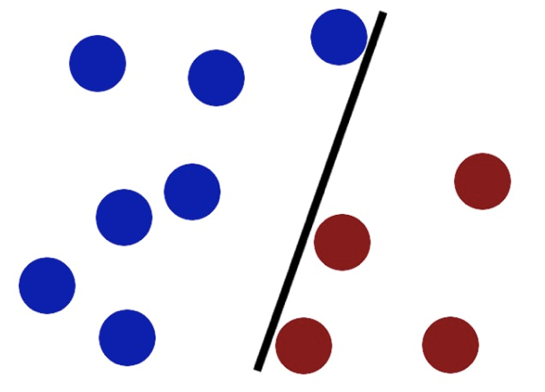

然后魔鬼，又在桌上放了更多的球，似乎有一个球站错了阵营。

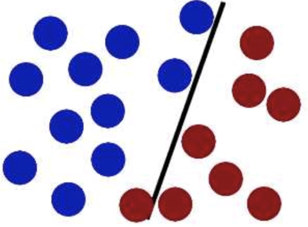

怎么办？？

把分解的小棍儿变粗。

> **SVM就是试图把棍放在最佳位置，好让在棍的两边有尽可能大的间隙。**

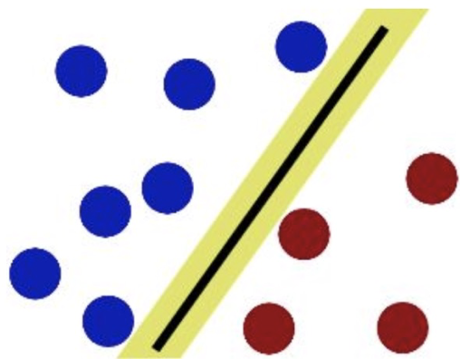

现在即使魔鬼放了更多的球，棍仍然是一个好的分界线。

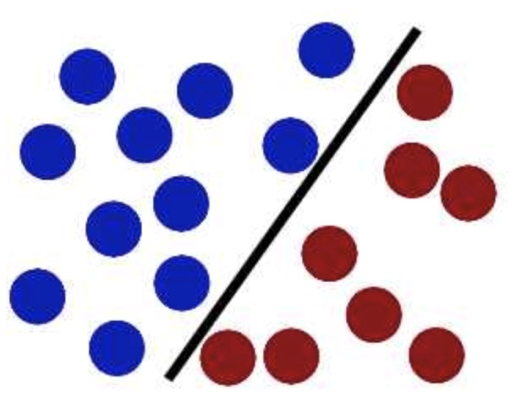

然后，在SVM 工具箱中有另一个更加重要的技巧（ **trick**）。 魔鬼看到大侠已经学会了一个trick，于是魔鬼给了大侠一个新的挑战。


现在，大侠没有棍可以很好帮他分开两种球了，现在怎么办呢？

当然像所有武侠片中一样大侠桌子一拍，球飞到空中。然后，凭借大侠的轻功，大侠抓起一张纸，插到了两种球的中间。

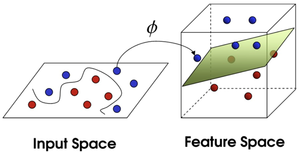

现在，从魔鬼的角度看这些球，这些球看起来像是被一条曲线分开了。

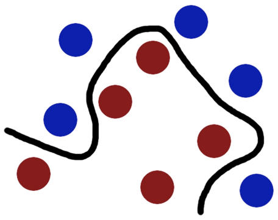

再之后，无聊的大人们，把上面的物体起了别名：

| 故事元素 | 实际含义               |
| :------- | :--------------------- |
| 球       | 数据（data）           |
| 棍子     | 分类器（classifier）   |
| 最大间隙 | 最优化（optimization） |
| 拍桌子   | 核方法（kernelling）   |
| 纸       | 超平面（hyperplane）   |

> 案例来源：http://bytesizebio.net/2014/02/05/support-vector-machines-explained-well/
>

### 1.2 SVM的定义

**SVM**全称是**supported vector machine**（支持向量机），即寻找到一个超平面使样本分成两类，并且间隔最大。


SVM能够执行线性或非线性分类、回归，甚至是异常值检测任务。是机器学习领域最受欢迎的模型之一。**SVM特别适用于中小型复杂数据集的分类**。


### 1.3 超平面最大间隔

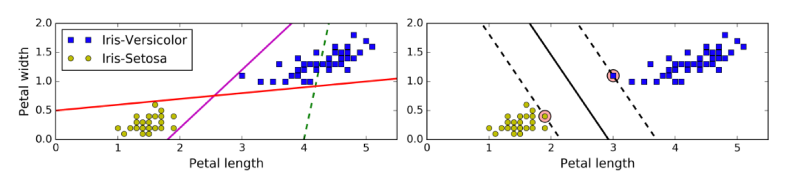

上左图显示了三种可能的线性分类器的决策边界：

虚线所代表的模型表现非常糟糕，甚至都无法正确实现分类。其余两个模型在这个训练集上表现堪称完美，但是**它们的决策边界与实例过于接近，导致在面对新实例时，表现可能不会太好**。

**右图中的实线代表SVM分类器的决策边界**，不仅分离了两个类别，且**尽可能远离最近的训练实例**。


### 1.4 硬间隔

如果样本线性可分，在所有样本分类都正确的情况下，寻找最大间隔，这就是硬间隔

如果出现异常值、或者样本不能线性可分，此时硬间隔无法实现。

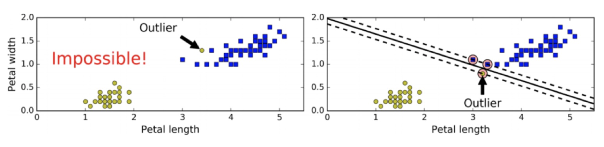

当有一个额外异常值的鸢尾花数据，左图的数据根本找不出硬间隔，而右图最终显示的决策边界与我们之前所看到的无异常值时的决策边界也大不相同，可能无法很好地泛化。


### 1.5 软间隔和惩罚系数

允许部分样本，在最大间隔之内，甚至在错误的一边，寻找最大间隔，这就是软间隔

目标是**尽可能在保持间隔宽阔和限制间隔违例之间找到良好的平衡**。

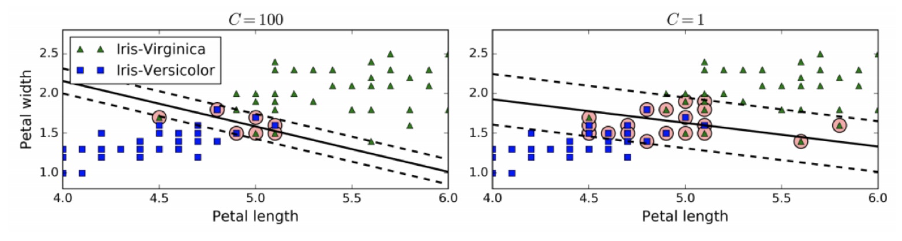

通过惩罚系数C来控制这个平衡：C值越小，则间隔越宽，但是间隔违例也会越多。

左边使用了高C值，分类器的错误样本（间隔违例）较少，但是间隔也较小。

右边使用了低C值，间隔大了很多，但是位于间隔上的实例也更多。


### 1.6 核函数

核函数将原始输入空间映射到新的特征空间，使得原本线性不可分的样本在核空间可分


## 2、支持向量机API使用

### 2.1 支持向量机的API

```python
class sklearn.svm.LinearSVC(C=1.0)
```

C:惩罚系数，类似于线性回归中的正则化系数。

LinearSVC API的使用方式：

```python
from sklearn.svm import LinearSVC
mysvc = LinearSVC(C=30)
mysvc.fit(X_standard, y)
print(mysvc.score(X_standard, y))
```

### 2.2 案例实现

加载鸢尾花数据, 使用SVM对鸢尾花数据进行分类。选取前两个类别和前两个特征

```python
import numpy as np
import matplotlib.pyplot as plt

from sklearn import datasets
X,y = datasets.load_iris(return_X_y = True)
X = X[y<2,:2] # 取前两个特征,取前两个类别(二分类)
y = y[y<2]

# 数据可视化
plt.scatter(X[y==0,0],X[y==0,1],color = 'red')
plt.scatter(X[y==1,0],X[y==1,1],color = 'blue')
plt.show()
```

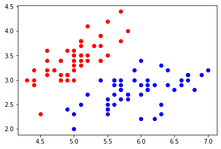

数据标准化

```python
from sklearn.preprocessing import StandardScaler

std_scaler = StandardScaler()
X_standard = std_scaler.fit_transform(X)
```

训练SVC模型, 首先我们设置一个比较大的C值

```python
from sklearn.svm import LinearSVC
svc = LinearSVC(C=30)
svc.fit(X_standard,y)
```

绘制决策边界

```python
def plot_decision_boundary(model,axis):
    x0,x1 = np.meshgrid(
        np.linspace(axis[0],axis[1],int((axis[1]-axis[0])*100)).reshape(-1,1),
        np.linspace(axis[2],axis[3],int((axis[3]-axis[2])*100)).reshape(-1,1)
    )
    X_new = np.c_[x0.ravel(),x1.ravel()]
    y_predict = model.predict(X_new)
    zz = y_predict.reshape(x0.shape)

    from matplotlib.colors import ListedColormap
    custom_map = ListedColormap(["#EF9A9A","#FFF59D","#90CAF9"])
    plt.contourf(x0,x1,zz,linewidth=5,cmap=custom_map)
```


```python
plot_decision_boundary(svc,axis=[-3,3,-3,3])
plt.scatter(X_standard[y==0,0],X_standard[y==0,1])
plt.scatter(X_standard[y==1,0],X_standard[y==1,1])
plt.show()
```

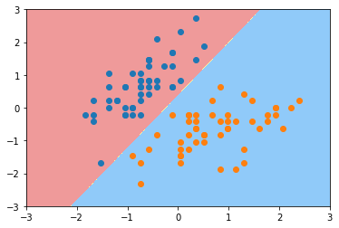

测试参数C的影响, 将C调小,再次绘制决策边界

```python
svc2 = LinearSVC(C=0.1)
svc2.fit(X_standard,y)
plot_decision_boundary(svc2,axis=[-3,3,-3,3])
plt.scatter(X_standard[y==0,0],X_standard[y==0,1])
plt.scatter(X_standard[y==1,0],X_standard[y==1,1])
plt.show()
```

svc对象中也有coef_ 和 intercept参数，分别代表特征前面的系数和决策边界的截距

利用这两个参数将间隔区间绘制出来

```python
def plot_decision_boundary_svc(model,axis):
    x0,x1 = np.meshgrid(
        np.linspace(axis[0],axis[1],int((axis[1]-axis[0])*100)).reshape(-1,1),
        np.linspace(axis[2],axis[3],int((axis[3]-axis[2])*100)).reshape(-1,1)
    )
    X_new = np.c_[x0.ravel(),x1.ravel()]
    y_predict = model.predict(X_new)
    zz = y_predict.reshape(x0.shape)

    from matplotlib.colors import ListedColormap
    custom_map = ListedColormap(["#EF9A9A","#FFF59D","#90CAF9"])

    plt.contourf(x0,x1,zz,linewidth=5,cmap=custom_map)


    w= model.coef_[0]
    b = model.intercept_[0]
    # w0* x0 + w1* x1+ b = 0
    #=>x1 = -w0/w1 * x0 - b/w1
    plot_x = np.linspace(axis[0],axis[1],200)
    up_y = -w[0]/w[1]* plot_x - b/w[1]+ 1/w[1]
    down_y = -w[0]/w[1]* plot_x - b/w[1]-1/w[1]
    up_index =(up_y >= axis[2])&(up_y <= axis[3])
    down_index =(down_y>= axis[2])&(down_y<= axis[3])
    plt.plot(plot_x[up_index],up_y[up_index],color="black")
    plt.plot(plot_x[down_index],down_y[down_index],color="black")
```

绘制间隔区间

```python
plot_decision_boundary_svc(svc,axis=[-3,3,-3,3])
plt.scatter(X_standard[y==0,0],X_standard[y==0,1])
plt.scatter(X_standard[y==1,0],X_standard[y==1,1])
plt.show()
```

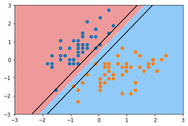

```python
plot_decision_boundary_svc(svc2,axis=[-3,3,-3,3])
plt.scatter(X_standard[y==0,0],X_standard[y==0,1])
plt.scatter(X_standard[y==1,0],X_standard[y==1,1])
plt.show()
```

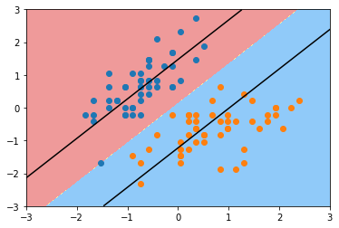

从上面的例子中可以看出, C值变小, 我们的间隔区间变大从hard margin 变成了soft margin


## 3、SVM算法原理

### 3.1 目标函数确定


**SVM思想**：要去求一组参数（$w,b$）,使其构建的超平面函数能够最优地分离两个集合。样本空间中任意点$x$到超平面（$w,b$）的距离可写成：
$$
r = \frac{|w^T x + b|}{||w||}
$$

> **推导过程：**

> **1. 超平面的定义**
>
> 超平面由参数 $(w, b)$ 定义，其方程为：
> $$
> w^T x + b = 0
> $$
> 其中：
>
> - $w$ 是法向量（决定超平面的方向），
> - $b$ 是偏置项（决定超平面的位置）。
>
> 
>
> **2. 点到平面的距离公式（几何推导）**
>
> 设：
>
> - 点 $x_0$ 是空间中的一个任意点，
> - 点 $x_p$ 是超平面上离 $x_0$ 最近的点（即 $x_0$ 在超平面上的投影）。
>
> 由于 $x_p$ 在超平面上，满足：
> $$
> w^T x_p + b = 0
> $$
>
> 向量 $x_0 - x_p$ 与法向量 $w$ 平行（因为 $x_p$ 是投影点），所以：
> $$
> x_0 - x_p = k \cdot \frac{w}{\|w\|}
> $$
> 其中：
>
> - $k$ 是一个标量，
> - $\frac{w}{\|w\|}$ 是 $w$ 的单位方向向量。
>
> 距离 $d$ 就是 $\|x_0 - x_p\|$，即：
> $$
> d = |k|
> $$
>
> 
>
> **3. 计算 $k$**
>
> 将 $x_0 - x_p = k \cdot \frac{w}{\|w\|}$ 代入超平面方程：
> $$
> w^T \left(x_0 - k \cdot \frac{w}{\|w\|}\right) + b = 0
> $$
> 展开：
> $$
> w^T x_0 - k \cdot \frac{w^T w}{\|w\|} + b = 0
> $$
> 由于 $w^T w = \|w\|^2$，所以：
> $$
> w^T x_0 + b - k \cdot \|w\| = 0
> $$
> 解得：
> $$
> k = \frac{w^T x_0 + b}{\|w\|}
> $$
>
> 因此，距离为：
> $$
> d = |k| = \frac{|w^T x_0 + b|}{\|w\|}
> $$
>
> 
>
> **4. 结论**
>
> 任意点 $x$ 到超平面 $w^T x + b = 0$ 的距离为：
> $$
> \boxed{r = \frac{|w^T x + b|}{\|w\|}}
> $$
>


欲找到具有最大间隔的划分超平面，也就是要找到能满足下式中约束的参数$w$和$b$，使得间隔$y$最大。

$$
\begin{cases}
w^T x_i + b \geq +1, & y_i = +1; \\
w^T x_i + b \leq -1, & y_i = -1.
\end{cases}
$$

距离超平面最近的几个训练样本点使上式等号成立，他们被称为“支持向量”，两个异类支持向量到超平面的距离之和为：
$$
\gamma = \frac{2}{||w||}
$$


SVM 我们要求解的目标是：在能够将所有样本能够正确分割开的基础上，求解最大间隔。

1. 最大间隔距离表示：

$$
\gamma = \frac{2}{\|w\|}
$$

2. 训练样本能够正确分类：

$$
\begin{cases}
w^T x_i + b \geq +1, & y_i = +1 \\
w^T x_i + b \leq -1, & y_i = -1
\end{cases}
$$

我们希望在将所有样本正确分类的情况，实现间隔最大化。所以，我们的目标函数可以写为：
$$
\max_{w,b} \frac{2}{\|w\|}
$$

$$
s.t.\quad y_i \left( w^T x_i + b \right) \geq 1, i = 1, 2, \cdots, m
$$

**我们可以将其转换为最小化问题**：
$$
\min_{w,b} \frac{1}{2} \|w\|^2
$$

$$
s.t. \quad y_i \left( w^T x_i + b \right) \geq 1, i = 1, 2, \cdots, m
$$

> - $\|w\|$ 范数为：$\sqrt{w_1^2 + w_2^2 + \ldots + w_n^2}$，加上平方之后将根号去掉，不影响优化目标。
> - $\frac{1}{2}$ 是为了求导的时候，能够将系数去掉。


- **约束条件优化问题转换**

添加核函数，将目标函数转换为以下形式
$$
\min_{w,b} \frac{1}{2} \| w \|^2
$$

$$
s.t.\quad \sum_{i=1}^n (1 - y_i(w^T \cdot \Phi(x_i) + b)) \leq 0
$$

目标函数是一个带有约束条件的优化问题，不太容易直接求解，所以先使用拉格朗日乘子法将其转换为多元极值问题，其转换过程如下:
$$
R(x) = f(x) + a g(x)
$$
$f(x)$ 是我们的原问题，$g(x)$ 为原问题的约束条件。构建拉格朗日函数：其中 $a_i$ 为拉格朗日乘子（相当于 $\lambda_i$）

拉格朗日乘子法构建的拉格朗日函数将目标优化函数和优化约束条件放在了一起，从而将带约束的极值问题转换为不带约束极值问题。

我们的问题可以转化为
$$
L(w, b, \alpha) = \frac{1}{2} \| w \|^2 - \sum_{i=1}^n \alpha_i \left( y_i \left( w^T \cdot \Phi(x_i) + b \right) - 1 \right)
$$
要想求得极小值，上式后半部分应该取的极大值，最后转换成对偶问题
$$
\min_{w,b} \max_{\alpha} L(w, b, \alpha) \iff \max_{\alpha} \min_{w,b} L(w, b, \alpha)
$$


-  **对偶问题转换**

对 $w$ 求偏导，并令其等于 0：
$$
\frac{\partial L}{\partial w} = w - \sum_{i=1}^{n} \alpha_i y_i \varphi (x_i) = 0
$$
得出：
$$
w = \sum_{i=1}^{n} \alpha_i y_i \varphi (x_i)
$$
对 $b$ 求偏导：
$$
\frac{\partial L}{\partial b} = -\sum_{i=1}^{n} \alpha_i y_i = 0
$$
即：
$$
\sum_{i=1}^{n} \alpha_i y_i = 0
$$
将对 $w$、$b$ 求偏导的结果带入到原拉格朗日公式中：

$$
\begin{aligned}
L(w, b, \alpha) &= \frac{1}{2} ||w||^2 - \sum_{i=1}^{n} a_i (y_i (w^T \varphi(x_i) + b) - 1) \\
&= \frac{1}{2} w^T w - \sum_{i=1}^{n} a_i y_i w^T \varphi(x_i) - b \sum_{i=1}^{n} a_i y_i + \sum_{i=1}^{n} a_i \\
&= \frac{1}{2} w^T w - \sum_{i=1}^{n} a_i y_i w^T \varphi(x_i) + \sum_{i=1}^{n} a_i \\
&= \frac{1}{2} w^T \sum_{i=1}^{n} a_i y_i \varphi(x_i) - w^T \sum_{i=1}^{n} a_i y_i \varphi(x_i) + \sum_{i=1}^{n} a_i \\
&= \sum_{i=1}^{n} a_i - \frac{1}{2} \left( \sum_{i=1}^{n} a_i y_i \varphi(x_i) \right)^T \cdot \sum_{i=1}^{n} a_i y_i \varphi(x_i) \\
&= \sum_{i=1}^{n} a_i -\frac{1}{2}  \sum_{i=1}^{n} \sum_{j=1}^{n} a_i a_j y_i y_j \varphi^T(x_i) \varphi(x_j)
\end{aligned}
$$

此时，求解当 $\alpha$ 是什么值时，该值会变得很大，当求出 $\alpha$ 值，再求解 $w, b$ 值。此时，就变成了极大极小值问题。


- **确定超平面**

求解当 $\alpha$ 什么值时公式值最大
$$
a^* = \arg \max_{\alpha} \left( \sum_{i=1}^n \alpha_i - \frac{1}{2} \sum_{i=1}^{n} \sum_{j=1}^{n} \alpha_i \alpha_j y_i y_j \Phi^T (x_i) \Phi (x_j) \right)
$$
将上面的问题转换为极小值问题：
$$
\min_{\alpha} \frac{1}{2} \sum_{i=1}^n \sum_{j=1}^n \alpha_i \alpha_j y_i y_j (\Phi (x_i) \cdot \Phi (x_j)) - \sum_{i=1}^n \alpha_i
$$

$$
s.t.\quad \sum_{i=1}^n \alpha_i y_i = 0
$$

$$
\alpha_i \geq 0, \quad i = 1, 2, \ldots, n
$$

将训练样本带入上面公式，求解出 $\alpha$ 值。然后，将 $\alpha$ 值代入下面公式计算 $w, b$ 的值：
$$
w^* = \sum_{i=1}^N \alpha_i^* y_i \Phi (x_i)
$$

$$
b^* = y_j - \sum_{i=1}^N \alpha_i^* y_i (\Phi (x_i) \cdot \Phi (x_j))
$$

最后求得分离超平面：
$$
w^* \Phi (x) + b^* = 0
$$


> **支持向量机(SVM)中偏置项 $b^*$ 的计算公式推导**
>
> - **根据支持向量的定义**  
>
>    对于任意支持向量 $x_k$（满足 $\alpha_k > 0$），其函数间隔为 1：
>    $$
>    y_k \left( w^* \cdot \Phi(x_k) + b^* \right) = 1
>    $$
>    其中 $w^* = \sum_{i=1}^N \alpha_i^* y_i \Phi(x_i)$。
>
> - **代入 $w^*$ 的表达式**  
>    $$
>    y_k \left( \sum_{i=1}^N \alpha_i^* y_i \Phi(x_i) \cdot \Phi(x_k) + b^* \right) = 1
>    $$
>    两边乘以 $y_k$ 得：
>    $$
>    \sum_{i=1}^N \alpha_i^* y_i \Phi(x_i) \cdot \Phi(x_k) + b^* = y_k
>    $$
>
> - **解出 $b^*$**  
>    $$
>    b^* = y_k - \sum_{i=1}^N \alpha_i^* y_i \Phi(x_i) \cdot \Phi(x_k)
>    $$
>    通常对所有支持向量取平均：
>    $$
>    b^* = \frac{1}{|S|} \sum_{k \in S} \left( y_k - \sum_{i=1}^N \alpha_i^* y_i \Phi(x_i) \cdot \Phi(x_k) \right)
>    $$
>    其中 $S$ 是支持向量的集合。
>
> 关键点
>
> - **核函数简化**：内积 $\Phi(x_i) \cdot \Phi(x_j)$ 可替换为核函数 $K(x_i, x_j)$
> - **支持向量的作用**：仅依赖支持向量（$\alpha_k > 0$ 的样本）计算 $b^*$
>
> 最终公式
> $$
> b^* = y_k - \sum_{i=1}^N \alpha_i^* y_i K(x_i, x_k)
> $$
> （实际实现时对所有支持向量取平均）


## 4、核函数

### 4.1 核函数的作用

核函数，是将原始输入空间映射到新的特征空间，从而，使得原本线性不可分的样本可能在核空间可分。

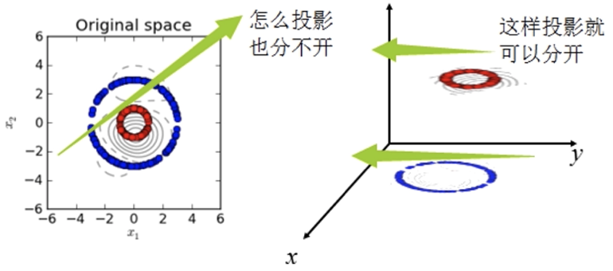

下图所示的两类数据，分别分布为两个圆圈的形状，这样的数据本身就是线性不可分的，此时该如何把这两类数据分开呢?

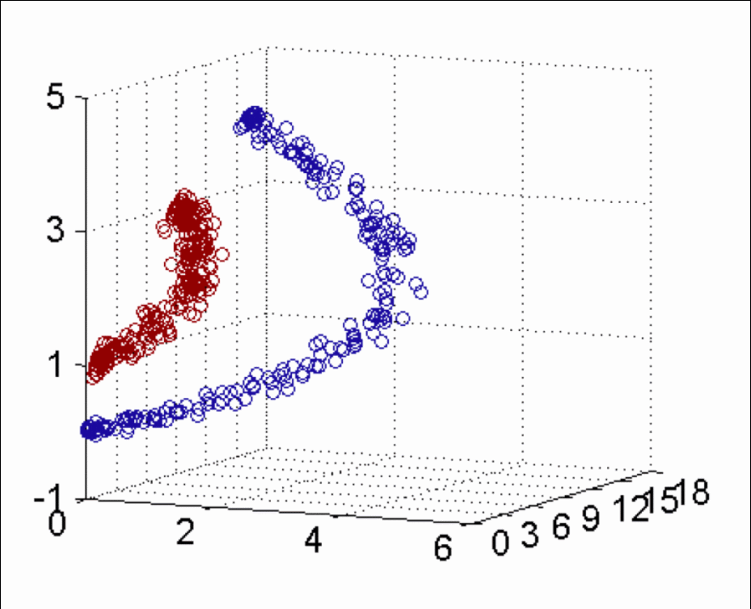


### 4.2 核函数的分类

当存在线性不可分的场景时，我们需要使用核函数来提高训练样本的维度、或者将训练样本投向高维

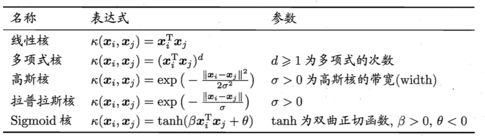

高斯核函数使用较多。

1. 线性核：一般是不增加数据维度，而是预先计算内积，提高速度
2. 多项式核：一般是通过增加多项式特征，提升数据维度，并计算内积
3. 高斯核（RBF、径向基函数）：一般是通过将样本投射到无限维空间，使得原来不可分的数据变得可分。


### 4.3 高斯核函数

高斯核函数(RBF)，其中γ 为超参数

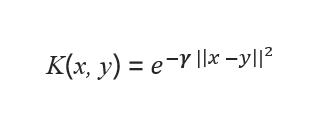

gamma是超参数，作用与标准差相反，gamma越大，高斯分布越窄,gamma越小，高斯分布越宽

举个例子：


任务:找到一种方法，用一条线将数据完美分类。如果只从1维的角度考虑，这是一项不可能完成的任务，但可以用升维度的办法来解决问题。

让我们引入一个函数 f(x)，图像如下图所示。 将 x 的每个值映射到其对应的输出。使得所有蓝点在Y轴的输出更大，而红点在Y轴的输出偏小。此时，我们可以使用一条水平线将数据完美分类。

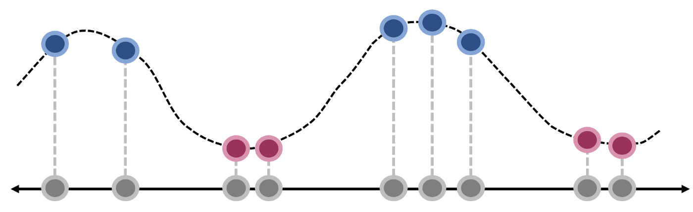

这个解决方案看起来很“巧妙”，我们可以借助径向基函数 (RBF) 来实现


### 4.4 高斯核的API

准备数据

```python
import numpy as np
import matplotlib.pyplot as plt
```

```python
from sklearn import datasets
X,y = datasets.make_moons(noise=0.15,random_state=22)
plt.scatter(X[y==0,0],X[y==0,1])
plt.scatter(X[y==1,0],X[y==1,1])
plt.show()
```

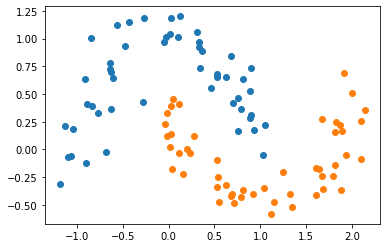

创建Pipeline：数据标准化，创建高斯核SVC对象，gamma默认为1

```python
from sklearn.preprocessing import StandardScaler
from sklearn.svm import SVC
from sklearn.pipeline import Pipeline

def RBFKernelSVC(gamma = 1.0):
    return Pipeline([
        ('std_scaler',StandardScaler()),
        ('svc',SVC(kernel='rbf',gamma=gamma))
    ])
```

模型训练

```python
svc = RBFKernelSVC(gamma=1.0)
svc.fit(X,y)
```

>`Pipeline(steps=[('std_scaler', StandardScaler()), ('svc', SVC(gamma=1.0))])`

绘制决策边界

```python
def plot_decision_boundary(model,axis):
    x0,x1 = np.meshgrid(
        np.linspace(axis[0],axis[1],int((axis[1]-axis[0])*100)).reshape(-1,1),
        np.linspace(axis[2],axis[3],int((axis[3]-axis[2])*100)).reshape(-1,1)
    )
    X_new = np.c_[x0.ravel(),x1.ravel()]
    y_predict = model.predict(X_new)
    zz = y_predict.reshape(x0.shape)

    from matplotlib.colors import ListedColormap
    custom_map = ListedColormap(["#EF9A9A","#FFF59D","#90CAF9"])

    plt.contourf(x0,x1,zz,linewidth=5,cmap=custom_map)
```

```python
plot_decision_boundary(svc,axis=[-1.5,2.5,-1.0,1.5])
plt.scatter(X[y==0,0],X[y==0,1])
plt.scatter(X[y==1,0],X[y==1,1])
plt.show()
```

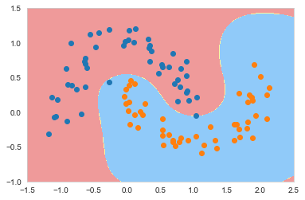

上图结果与多项式核有些类似，我们尝试调整gamma观察效果，首先将gamma调大

```python
svc_100 = RBFKernelSVC(gamma=100)
svc_100.fit(X,y)
```

```python
plot_decision_boundary(svc_100,axis=[-1.5,2.5,-1.0,1.5])
plt.scatter(X[y==0,0],X[y==0,1])
plt.scatter(X[y==1,0],X[y==1,1])
plt.show()
```

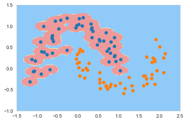

从上面的结果中发现，gamma越大我们的模型对数据点的拟合度越强，上图的结果明显过拟合了，为了进一步验证这个结论，我们稍微调小gamma 让它等于10

```python
svc_10 = RBFKernelSVC(gamma=10)
svc_10.fit(X,y)
```

```python
plot_decision_boundary(svc_10,axis=[-1.5,2.5,-1.0,1.5])
plt.scatter(X[y==0,0],X[y==0,1])
plt.scatter(X[y==1,0],X[y==1,1])
plt.show()
```

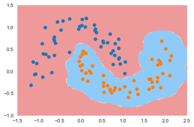

从上面的结果中看出调小gamma之后,过拟合程度有所减弱。我们再次将gamma调小

```python
svc_05 = RBFKernelSVC(gamma=0.5)
svc_05.fit(X,y)
```

```python
plot_decision_boundary(svc_05,axis=[-1.5,2.5,-1.0,1.5])
plt.scatter(X[y==0,0],X[y==0,1])
plt.scatter(X[y==1,0],X[y==1,1])
plt.show()
```

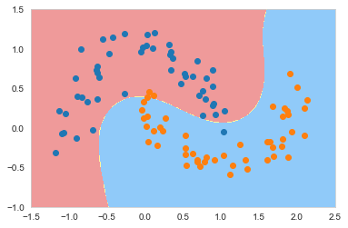

```python
svc_10 = RBFKernelSVC(gamma=0.1)
svc_10.fit(X,y)
```

```python
plot_decision_boundary(svc_01,axis=[-1.5,2.5,-1.0,1.5])
plt.scatter(X[y==0,0],X[y==0,1])
plt.scatter(X[y==1,0],X[y==1,1])
plt.show()
```

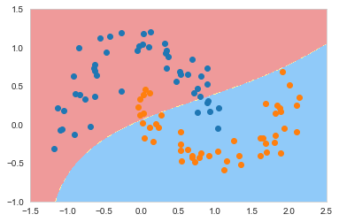

从上面的结果中看出，当gamma=0.1的时候，结果已经接近线性SVC了。此时模型已经欠拟合了。自此我们可以得出结论

- gamma越大，模型过拟合风险越高
- gamma越小，模型欠拟合风险越高


