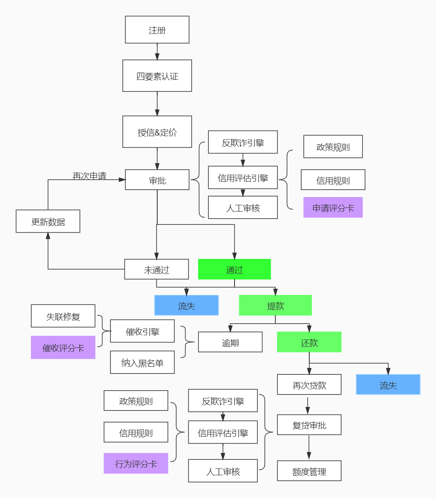
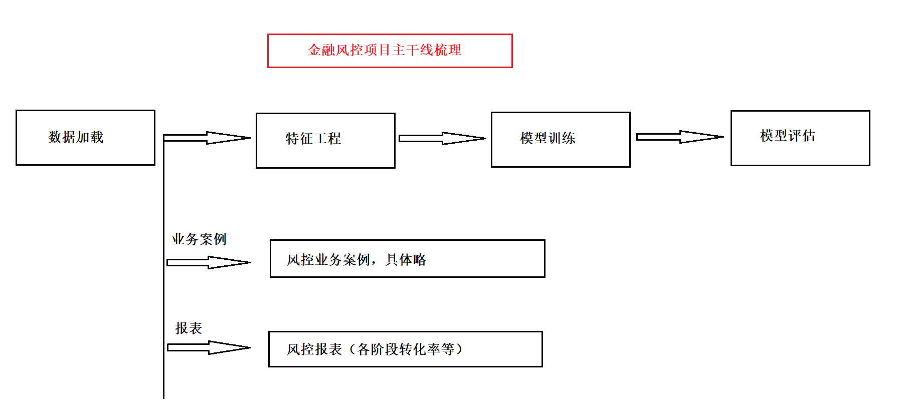
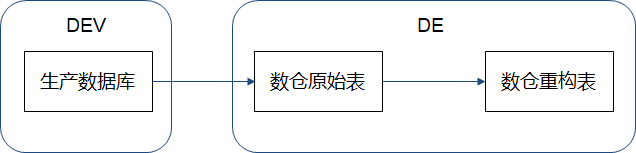
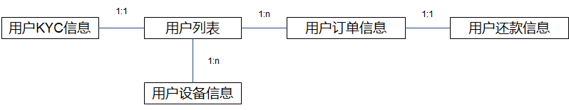
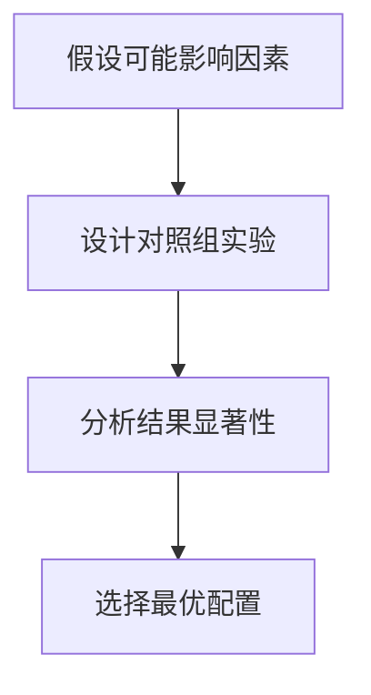

## 1、风控建模概述

### 1.1 互联网金融风控体系

#### 1.1.1 信贷审批业务基本流程

- **四要素认证**：银行卡持有人姓名、身份证号、银行卡号、手机号

- **流程**：申请 → 审批 → 放款 → 还款 → 再次申请 → 复贷审批
  - 审批环节：规则与模型
  - 还款环节：逾期→催收




#### 1.1.2 风控体系三大组成部分

- **用户数据**
  - 数据类型：
    - 用户基本信息（联系人、通讯录、学历等）
    - 用户行为信息（APP操作行为，注册，点击位置...）
    - 用户授权信息（运营商、学信网等）
    - 外部接入信息（芝麻信用分等）
  - 数据来源：
    - 免费运营商数据
    - 安卓可爬取的手机信息
    - 收费征信数据
    - 特定场景自有数据（电商、物流等）
- **策略体系**
  - 反欺诈规则
  - 准入规则（年龄、地域、讯录，行为规则等）
  - 运营商规则（通话记录）
  - 风险名单（黑名单、失信名单，法院名单等）
  - 网贷规则（多头借贷，白户等）
- **机器学习模型**：

|        | 贷前准入     | 贷中管理                         | 贷后催收   |
| ------ | ------------ | -------------------------------- | ---------- |
| 信用   | 申请评分卡   | 行为评分卡                       | 催收评分卡 |
| 反欺诈 | 申请反欺诈   | 交易反欺诈                       |            |
| 运营   | 用户响应模型 | 用户流失模型、用户分群、用户画像 | 失联修复   |
| 其他   |              | 套现识别、洗钱识别               |            |


## 2、风控建模流程



### 2.1 评分卡简介

| 评分卡类型                        | 应用阶段 | 重要性   | Y值定义特点          |
| :-------------------------------- | :------- | :------- | :------------------- |
| A卡（**Application score card**） | 贷前     | 最重要   | 逾期天数截断         |
| B卡（**Behavior score card**）    | 贷中     | 中等     | 逾期天数截断         |
| C卡（**Collection score card**）  | 贷后     | 最不重要 | 可能根据催收效果定义 |

> 风控模型其中包含了A/B/C卡。模型可以采用相同算法，一般以逾期天数来区分正负样本，也就是目标值Y的取值（0或1）。C卡因为用途不同Y的取值可能有区别：
>
> - 公司有内催，有外催。外催回款率低，单价贵
> - 可以根据是否被内催催回来定义C卡的Y。


### 2.2 机器学习模型的完整工程流程

项目主要流程：**项目准备期** → **特征工程** → **模型构建** → **上线运营**

#### **项目准备期**

- **明确需求**
- **模型设计**
   - 业务抽象：将业务问题转化为分类/回归问题
   - 标签定义：确定目标值
- **样本设计**：明确样本采集和标注方式


#### **特征工程**

- **数据处理**  
   - 挑选合适样本，保证代表性
   - 匹配、构建全部基础信息作为特征
- **特征构建**：设计和构造有效的特征
- **特征评估**：评估特征的有效性与重要性


#### **模型构建**

- **模型训练**：使用训练集进行模型训练
- **模型评估**：通过验证集或测试集评估模型性能
- **模型调优**：根据评估结果调整模型参数与结构


#### **上线运营**

- **模型交付**：将最终模型交付给业务系统
- **模型部署**：将模型部署到生产环境
- **模型监控**：实时监控模型运行状态与效果


### 2.3 项目准备期

#### **1. 明确需求**

- 目标人群：新客户、优质老客户、逾期老客户
- 给与产品：额度，利率
- 市场策略：冷启动，开拓市场，改善营收
- 使用时限：紧急使用，长期部署
- 举例
  - 业务需要针对全新客户开放一个小额现金贷产品，抢占新市场
  - 针对高风险薄数据新客的申请评分卡


#### 2. 模型设计

##### **业务抽象成分类/回归问题**

- 问题转化为分类问题或回归问题
- 风控场景下问题通常都可以转化为二分类问题
- 举例说明：
  - 信用评分模型期望用于预测一个用户是否会逾期，逾期用户1
  - 营销模型期望用于预测一个用户被营销后是否会来贷款，没贷用户1

  - 失联模型期望用于预测一个用户是否会失联，失联用户1

> 风控业务中，只有欺诈检测不是二分类问题。因为样本数量不足，可能是一个无监督学习模型


##### **模型算法**

- 规则模型
- 逻辑回归、集成学习、SVM、KNN、决策树

- 模型输入

  - 数据源
  - 时间跨度


#### **3. Y标签定义**

**正负样本的构建原则**

- 原始数据通常只包含当前逾期情况，需要人为构建负样本
- 通过设定逾期阈值来区分正负样本：
  - **Y=1（负样本/违约客户）**：逾期超过15天的客户
  - **Y=0（正样本/正常客户）**：逾期<5天和没有逾期的客户


**灰样本的处理方法**

- **定义**：逾期5～15天之间的样本称为"灰样本"
- **处理方式**：
  - 从训练样本中移除灰样本，使样本分布更接近二项分布，有利于模型学习
  - 将灰样本放入测试集中，用于验证模型对这些"边界案例"的区分能力


**样本分类总结**

| 逾期天数范围 | 样本类别 | 处理方式     | 标签 |
| :----------- | :------- | :----------- | :--- |
| 0-5天        | 正样本   | 用于模型训练 | Y=0  |
| 5-15天       | 灰样本   | 用于模型测试 | 无   |
| >15天        | 负样本   | 用于模型训练 | Y=1  |


#### 4. 样本选取标准

**核心原则**

- **代表性**：样本需充分代表总体，如消费贷客群数据不能直接用到小额现金贷场景
- **充分性**：正负样本均不少于1500个，随着样本量的增加，模型的效果会显著提升（理想范围1500-50000）
- **时效性**：样本观测时间应尽量接近实际应用时间节点
- **排除性**：剔除不符合规定的用户（欺诈用户、无还款表现用户等）

> 评分卡建模通常要求正负样本的数量>=1500，但当总样本量超过50000个时，许多模型的效果不再随着样本量的增加而有显著提升，而且数据处理与模型训练过程通常较为耗时。


**样本量处理**

| 样本情况      | 处理方法             | 注意事项                               |
| :------------ | :------------------- | :------------------------------------- |
| 样本量>50,000 | 欠采样处理           | 由于负样本通常较少，通常仅对正样本进行 |
| 负样本不足    | 过采样或代价敏感加权 | 保持数据分布平衡                       |

**欠采样方法对比**

- **随机欠采样**：直接减少正样本数量

- **分层抽样**：保持开发/验证样本/时间外样本中正负比例一致

- **等比伪抽样**：调整正负样本比例为1:1

  - *需为采样样本添加权重*（如采样1/4则权重设为4）

    > 需要注意的是，采样后需要为正样本添加权重。如正样本采样为原来的1/4，则为采样后的正样本增加权重为4，负样本权重保持为1。因为在后续计算模型检验指标及预期坏账时，需要将权重带入计算逻辑，才可以还原真实情况下的指标估计值，否则预期结果与实际部署后的结果会有明显偏差。


#### 5. 观察期与表现期设计

**定义与关系**

| 概念   | 定义                     | 示例               |
| :----- | :----------------------- | :----------------- |
| 观察期 | 用户申请前的历史数据窗口 | 12个月历史行为数据 |
| 表现期 | 定义好坏标签的时间窗口   | 3个月还款表现      |

**关键关系**：观察期(X) + 表现期(Y) → 通过算法训练得到最终模型


**不同评分卡应用**

| 评分卡类型 | 观察期客群   | 观察期           | 表现期      |
| :--------- | :----------- | :--------------- | ----------- |
| 申请评分卡 | 新客户       | 申请时点前一年   | FPD30       |
| 行为评分卡 | 未逾期老客户 | 当期某一日前一年 | DPD60       |
| 催收评分卡 | 逾期老客户   | 当期还款日前一年 | DPD1->DPD30 |


#### 6. 训练数据测试数据划分

数据集在建模前需要划分为3个子集：
- 开发样本（Develop）:开发样本与验证样本使用分层抽样划分，保证两个数据集中负样本占比相同
- 验证样本（Valuation）: 开发样本与验证样本的比例为6:4
- 时间外样本（Out of Time，OOT）: 通常使用整个建模样本中时间最近的数据, 用来验证模型对未来样本的预测能力，以及模型的跨时间稳定性。


### 2.4 特征工程

#### **1. 数据调研**

##### 1.1 数据分类与内容

明确对目标人群有哪些可用数据, 明确数据获取逻辑

| **数据类别**       | **具体数据项**                                               |
| :----------------- | :----------------------------------------------------------- |
| **用户KYC数据**    | 姓名、年龄、性别、所在地、婚姻状况、工作状况、收入状况、资产状况 |
| **App行为数据**    | 填表时长、页面逗留时长、填写速度、填写准确度                 |
| **外部第三方数据** | 违法记录、诉讼记录、人行征信、芝麻信用分、外部黑名单、多头数据 |
| **用户授权数据**   | 运营商、公积金、社保、学历、飞机/火车/宾馆记录、婚恋社交、电商及支付行为 |
| **设备采集数据**   | App列表、GPS、联系人、短信、通讯记录                         |
| **内部自有数据**   | 银行（存/理财/借贷/支付）、电商（支付/购物/社交）、关系图（设备/手机号码/地理/相似度） |


##### 1.2 数据质量评估表

明确数据的质量，覆盖度，稳定性

| **指标**   | 1月  | 2月  | 3月  | 4月  | 5月  | **合计** |
| :--------- | :--- | :--- | :--- | :--- | :--- | :------- |
| 总样本     | 100  | 200  | 300  | 400  | 500  | 1500     |
| 覆盖样本   | 50   | 100  | 250  | 300  | 400  | 1100     |
| **覆盖度** | 50%  | 50%  | 83%  | 75%  | 80%  | 73%      |

**关键结论**：

- 覆盖度需持续监控，建议目标≥80%（3月后达标）。
- 低覆盖月份（1-2月）需排查数据采集问题。


#### 2. 特征构建

##### **2.1 常见误区**

- 看到数据后立即构建特征，缺乏前期规划。


##### 2.2 构建特征前的准备工作

| **步骤**               | **说明**                                                     |
| :--------------------- | :----------------------------------------------------------- |
| **明确数据源与数据表** | 画出E-R视图，确认数据来源（生产数据库、数仓原始表、数仓重构表）。 |
| **评估特征的样本集**   | -A卡样本集没有内部信贷数据 - B卡样本集不能包含逾期数据 - C卡样本集不能包含按时还款的数据 |
| **制定特征框架**       | 与团队讨论，确保全面覆盖数据使用维度。                       |
| **数据来源优先级**     | 优先使用数仓工程师加工的重构表，确保逻辑统一；实时数据需与生产数据库一致。 |




##### 2.3 数据表关系示例

> 画出类ER图  数据关系 一对一，一对多，多对多

- **核心表**：用户列表（需作为SQL查询的起点，避免直接去重其他表字段）。

  > 不能出现**SELECT** **DISTINCT** user_id **FROM** order_table

- **关联表**：

  - 用户KYC信息（1:1）
  - 用户订单信息（1:N）
  - 用户还款信息（1:N）
  - 用户设备信息（1:N）




##### 2.4 特征框架设计（RFM维度）

如何从原始数据中构建特征：指定特征框架，确保对数据使用维度进行了全面思考。每个属性都可以从R（Recency） F（Frequency） M（Monetary）三个维度思考，来构建特征

| **数据属性** | **R (Recency)**                | **F (Frequency)**                  | **M (Monetary)**            | **补充**                    |
| :----------- | :----------------------------- | :--------------------------------- | :-------------------------- | :-------------------------- |
| **GPS**      | 最近GPS所在省市区              | 出现最多的省市区                   | 省市区的GDP、人口等统计信息 | 是否授权GPS、连续无GPS天数  |
| **时间**     | 最近一天/周/月的GPS数          | 过去六天/周/月的GPS平均数          | None                        | 分时段统计（早/晚、工作日） |
| **地址**     | 最近GPS距离家庭/工作地点的距离 | 出现最多GPS距离家庭/工作地点的距离 | GPS序列离家庭/工作地点      |                             |


##### 2.5 特征构建方法分类

| **类型**             | **描述**                               | **示例**                                |
| :------------------- | :------------------------------------- | :-------------------------------------- |
| **用户静态信息特征** | 用户的基础属性，如姓名、性别、年龄等。 | 用户年龄分段（18-25, 26-35等）          |
| **时间戳范围特征**   | 某一时刻点的数据快照。                 | 当前存款额、最大逾期天数                |
| **时间序列特征**     | 某段时间内的行为数据。                 | 过去1个月GPS轨迹、过去6个月银行流水记录 |


#### 3. 特征评估

**什么是好的特征？**

好的特征需要满足以下评估指标：

- **覆盖率高**：更多用户都能使用到该特征。
- 稳定性好：在后续较长时间内可以持续使用。
  - *PSI (Population Stability Index)* 用于衡量特征的稳定性。
- 区分度好：好坏用户的特征值差别大。
  - *IV (Information Value)* 用于衡量特征的区分能力。

此外，可以用模型的评估指标来评估单个特征，如单特征 AUC、单特征 KS。可以拿效果最好的单特征的AUC，KS来估计模型的效果


**特征评估报告表**

| 特征名称 | 全量样本覆盖度 | 带标签样本缺失率 | 零值率 | AUC  | KS   | IV         |
| -------- | -------------- | ---------------- | ------ | ---- | ---- | ---------- |
| 示例特征 | 高             | 低               | 低     | 高   | 大   | 合适范围内 |

> **关键概念解释**
>
> - 覆盖度（Coverage）
>
>   - **定义**：在全量样本上，有多少用户有这个特征。
>
>   - **说明**：全量样本指包含不带标签的所有样本。
>
> - 缺失率（Missing Rate）
>
>   - **定义**：带标签样本的缺失率，和全量样本的覆盖度作对比。
>
>   - **建议**：如果差别不是很大，说明选择的是合适的特征。
>
> - 零值率（Zero Rate）
>   - **说明**：很多特征是计数特征，比如电商消费单数、通信记录数、GPS 数据等。如果零值太多，说明该特征效果不好。
>
> 特征筛选建议：删除风险趋势不合理或逻辑错误的特征，用常识和业务逻辑进行筛查与评估。


### 2.5 模型构建

#### **1. 实验设计**

- **目标**：训练模型时有很多可能的因素会影响模型效果，我们需要通过设计实验去验证哪些因素会提升模型效果

- **方法**



#### **2. 模型评估标准**

好的模型需要满足的条件：
- 稳定，在后续较长时间可以持续使用     **PSI**
- 区分度好，好坏用户的信用分差别大    **AUC, KS**

| **评估维度** | **指标**                | **要求**                     | **工具/方法**        |
| :----------- | :---------------------- | :--------------------------- | :------------------- |
| 稳定性       | PSI (群体稳定性指数)    | PSI < 0.1（低漂移）          | 跨时间分数分布对比   |
| 区分度       | AUC (ROC曲线下面积)     | AUC > 0.7（较好区分）        | ROC曲线分析          |
| 区分度       | KS (Kolmogorov-Smirnov) | KS > 0.3（显著区分好坏用户） | 好坏用户分数分布对比 |


#### **3. 关键报表分析**

##### **3.1 区分度分析表**

（评估模型在不同分段捕捉“坏人”的能力）

| 分数段  | 总人数 | 坏人数 | 坏人率 | KS值 |
| :------ | :----- | :----- | :----- | :--- |
| 300-550 | –      | –      | –      | –    |
| 550-600 | –      | –      | –      | –    |
| 600-700 | –      | –      | –      | –    |
| 700-750 | –      | –      | –      | –    |
| 750-800 | –      | –      | –      | –    |
| 800-850 | –      | –      | –      | –    |
| 850-950 | –      | –      | –      | –    |

**解读要点**：

- 高分段坏人率应显著低于低分段。
- KS值需随分数段递增而增大。


##### **3.2 跨时间稳定性表**

（验证模型在不同时间段的可靠性）

| 分数段         | 测试集1 | 测试集2 | 线上1期 | 线上2期 | ...  |
| :------------- | :------ | :------ | :------ | :------ | :--- |
| 300-550        | 10%     | 10%     | –       | –       | –    |
| 550-600        | 20%     | 20%     | –       | –       | –    |
| 600-700        | 20%     | 20%     | –       | –       | –    |
| 700-750        | 25%     | 25%     | –       | –       | –    |
| 750-800        | 20%     | 20%     | –       | –       | –    |
| 800-850        | 4%      | 4%      | –       | –       | –    |
| 850-950        | 1%      | 1%      | –       | –       | –    |
| **决策点比例** | 50%     | 50%     | –       | –       | –    |
| **总用户数**   | 3000    | 2000    | –       | –       | –    |
| **平均分**     | 730     | 725     | –       | –       | –    |
| **PSI**        | –       | 0.01    | –       | –       | –    |

**关键结论**：

- 若PSI < 0.1，说明模型稳定性良好。
- 各分数段比例跨期差异应小于5%。


### 2.6 上线运营


#### **1. 模型交付**

##### 1.1 交付流程

| 步骤 | 关键内容                                                 |
| :--- | :------------------------------------------------------- |
| 1    | 提交特征和模型报表                                       |
| 2    | 离线结果质量复核（检查缺失、重复、存储位置、文件名规范） |
| 3    | 保存模型文件，确定版本号与提交时间                       |
| 4    | 负责人审批并通知业务方                                   |
| 5    | 线上部署、案例调研、持续监控                             |

##### 1.2 报告内容对比

| **特征报告**                  | **模型报告**                  |
| :---------------------------- | :---------------------------- |
| 1. 特征项目需求               | 1. 模型项目需求               |
| 2. 特征任务列表               | 2. 模型任务列表               |
| 3. 特征项目时间表             | 3. 模型项目时间表             |
| 4. 类ER图                     | 4. 模型设计                   |
| 5. 样本设计                   | 5. 样本设计                   |
| 6. 特征框架                   | 6. 训练流程与实验设计         |
| 7. 每周开发进度               | 7. 每周开发进度               |
| 8. 每周讨论反馈和改进意见笔记 | 8. 每周讨论反馈和改进意见笔记 |
| 9. 特征项目交付说明           | 9. 交付说明                   |
| 10. 特征项目总结              | 10. 模型项目总结              |


#### 2. 模型部署

- **环境一致性**：确保开发、测试、生产环境配置一致。

- **部署方式**：使用PMML文件或Flask API进行部署。

- **验证要求**：✅ 必须对一批客户对比离线与线上打分结果，确保一致性。


#### **3. 模型监控**

| **类型** | **监控指标**                    | **工具/方法**        |
| :------- | :------------------------------ | :------------------- |
| 特征监控 | 特征稳定性（PSI、缺失率）       | 统计对比、自动化告警 |
| 模型监控 | 模型稳定性（分数分布、AUC衰减） | 时序分析、AB测试     |


## 3、业务规则挖掘

### 规则挖掘简介

- 两种常见的风险规避手段
  - AI模型
  - 规则

- 如何使用规则进行风控
  - 使用一系列判断逻辑对客户群体进行区分，不同群体逾期风险有显著差别
    - 举例：多头借贷数量是否超过一定数量
  - 如果一条规则将用户划分到高风险组，则直接拒绝，如果划分到低风险组则进入到下一规则

- 规则和AI模型的优缺点
  - 规则，可以快速使用，便于业务人员理解，但判断相对简单粗暴一些，单一维度不满足条件直接拒绝
  - AI模型，开发周期长，对比使用规则更复杂，但更灵活，用于对风控精度要求高的场景
- 可以通过AI模型辅助建立规则引擎，决策树很适合规则挖掘的场景

### 规则挖掘案例

- 案例背景

  - 某互联网公司拥有多个业务板块，每个板块下都有专门的贷款产品

    - 外卖平台业务的骑手可以向平台申请“骑手贷”
    - 电商平台业务的商户可以申请“网商贷”
    - 网约车业务的司机可以向平台申请“司机贷”
  
  - 公司有多个类似的场景，共用相同的规则引擎及申请评分卡，贷款人都是该公司的兼职人员
  
  - 近期发现，“司机贷”的逾期率较高
  
    - 整个金融板块30天逾期率为1.5%
    - “司机贷”产品的30天逾期超过了5%
- 期望解决方案

  - 现有的风控架构趋于稳定
  - 希望快速开发快速上线，解决问题
    - 尽量不使用复杂的方法
    - 考虑使用现有数据挖掘出合适的业务规则

- 数据字典

  | 变量类型 | 基础变量名            | 释义                                                         |
  | :------- | --------------------- | ------------------------------------------------------------ |
  | 数值型   | oil_amount            | 加油升数                                                     |
  |          | discount_amount       | 折扣金额                                                     |
  |          | sale_amount           | 促销金额                                                     |
  |          | amount                | 总金额                                                       |
  |          | pay_amount            | 实际支付金额                                                 |
  |          | coupon_amount         | 优惠券金额                                                   |
  |          | payment_coupon_amount | 支付优惠券金额                                               |
  | 分类型   | channel_code          | 渠道                                                         |
  |          | oil_code              | 油品品类（规格）                                             |
  |          | scene                 | 场景                                                         |
  |          | source_app            | 来源端口（1货车帮、2微信）                                   |
  |          | call_source           | 订单来源(1:中化扫描枪 2:pos 3:找油网  4:油掌柜5：司机自助加油 6 油站线) |
  |          | class_new             | 用户评级                                                     |
  | 日期时间 | create_dt             | 账户创建时间                                                 |
  |          | oil_actv_dt           | 放款时间                                                     |
  | 标签     | bad_ind               | 正负样本标记                                                 |

- 加载数据

```python
import pandas as pd
import numpy as np
data = pd.read_excel('../data/rule_data.xlsx')
data.head()
```

><font color ='red'>显示结果：</font>
>
>|      |      uid | oil_actv_dt |  create_dt | total_oil_cnt | pay_amount_total | class_new | bad_ind | oil_amount | discount_amount | sale_amount |    amount | pay_amount | coupon_amount | payment_coupon_amount | channel_code | oil_code | scene | source_app | call_source |
>| ---: | -------: | ----------: | ---------: | ------------: | ---------------: | --------: | ------: | ---------: | --------------: | ----------: | --------: | ---------: | ------------: | --------------------: | -----------: | -------: | ----: | ---------: | ----------: |
>|    0 | A8217710 |  2018-08-19 | 2018-08-17 |         275.0 |       48295495.4 |         B |       0 |    3308.56 |       1760081.0 |   1796001.0 | 1731081.0 |  8655401.0 |           1.0 |                   1.0 |            1 |        3 |     2 |          0 |           3 |
>|    1 | A8217710 |  2018-08-19 | 2018-08-16 |         275.0 |       48295495.4 |         B |       0 |    4674.68 |       2487045.0 |   2537801.0 | 2437845.0 | 12189221.0 |           1.0 |                   1.0 |            1 |        3 |     2 |          0 |           3 |
>|    2 | A8217710 |  2018-08-19 | 2018-08-15 |         275.0 |       48295495.4 |         B |       0 |    1873.06 |        977845.0 |    997801.0 |  961845.0 |  4809221.0 |           1.0 |                   1.0 |            1 |        2 |     2 |          0 |           3 |
>|    3 | A8217710 |  2018-08-19 | 2018-08-14 |         275.0 |       48295495.4 |         B |       0 |    4837.78 |       2526441.0 |   2578001.0 | 2484441.0 | 12422201.0 |           1.0 |                   1.0 |            1 |        2 |     2 |          0 |           3 |
>|    4 | A8217710 |  2018-08-19 | 2018-08-13 |         275.0 |       48295495.4 |         B |       0 |    2586.38 |       1350441.0 |   1378001.0 | 1328441.0 |  6642201.0 |           1.0 |                   1.0 |            1 |        2 |     2 |          0 |           3 |
>

- 查看class_new 

```python
data.class_new.unique()
```

><font color ='red'>显示结果：</font>
>
>```python
>array(['B', 'E', 'C', 'A', 'D', 'F'], dtype=object)
>```

- 原始数据的特征太少，考虑在原始特征基础上衍生出一些新的特征来，将特征分成三类分别处理
  - 数值类型变量：按照id分组后，采用多种方式聚合，衍生新特征
  - 分类类型变量，按照id分组后，聚合查询条目数量，衍生新特征
  - 其它：日期时间类型，是否违约（标签），用户评级等不做特征衍生处理

```python
org_list = ['uid','create_dt','oil_actv_dt','class_new','bad_ind']
agg_list = ['oil_amount','discount_amount','sale_amount','amount','pay_amount','coupon_amount','payment_coupon_amount']
count_list = ['channel_code','oil_code','scene','source_app','call_source']
```

- 创建数据副本，保留底表，并查看缺失情况

```python
df = data[org_list].copy()
df[agg_list] = data[agg_list].copy()
df[count_list] = data[count_list].copy()
df.isna().sum()
```

><font color ='red'>显示结果：</font>
>
>```shell
>uid                         0
>create_dt                4944
>oil_actv_dt                 0
>class_new                   0
>bad_ind                     0
>oil_amount               4944
>discount_amount          4944
>sale_amount              4944
>amount                   4944
>pay_amount               4944
>coupon_amount            4944
>payment_coupon_amount    4946
>channel_code                0
>oil_code                    0
>scene                       0
>source_app                  0
>call_source                 0
>dtype: int64
>```

- 查看数值型变量的分布情况

```
df.describe()
```

><font color ='red'>显示结果：</font>
>
>|       |      bad_ind |   oil_amount | discount_amount |  sale_amount |       amount |   pay_amount | coupon_amount | payment_coupon_amount | channel_code |     oil_code |        scene |   source_app |  call_source |
>| ----: | -----------: | -----------: | --------------: | -----------: | -----------: | -----------: | ------------: | --------------------: | -----------: | -----------: | -----------: | -----------: | -----------: |
>| count | 50609.000000 | 45665.000000 |    4.566500e+04 | 4.566500e+04 | 4.566500e+04 | 4.566500e+04 |  45665.000000 |          45663.000000 | 50609.000000 | 50609.000000 | 50609.000000 | 50609.000000 | 50609.000000 |
>|  mean |     0.017764 |   425.376107 |    1.832017e+05 | 1.881283e+05 | 1.808673e+05 | 9.043344e+05 |      0.576853 |            149.395397 |     1.476378 |     1.617894 |     1.906519 |     0.306072 |     2.900729 |
>|   std |     0.132093 |   400.596244 |    2.007574e+05 | 2.048742e+05 | 1.977035e+05 | 9.885168e+05 |      0.494064 |            605.138823 |     1.511470 |     3.074166 |     0.367280 |     0.893682 |     0.726231 |
>|   min |     0.000000 |     1.000000 |    0.000000e+00 | 0.000000e+00 | 1.000000e+00 | 5.000000e+00 |      0.000000 |              0.000000 |     0.000000 |     0.000000 |     0.000000 |     0.000000 |     0.000000 |
>|   25% |     0.000000 |   175.440000 |    6.039100e+04 | 6.200100e+04 | 5.976100e+04 | 2.988010e+05 |      0.000000 |              1.000000 |     1.000000 |     0.000000 |     2.000000 |     0.000000 |     3.000000 |
>|   50% |     0.000000 |   336.160000 |    1.229310e+05 | 1.279240e+05 | 1.209610e+05 | 6.048010e+05 |      1.000000 |              1.000000 |     1.000000 |     0.000000 |     2.000000 |     0.000000 |     3.000000 |
>|   75% |     0.000000 |   557.600000 |    2.399050e+05 | 2.454010e+05 | 2.360790e+05 | 1.180391e+06 |      1.000000 |            100.000000 |     1.000000 |     0.000000 |     2.000000 |     0.000000 |     3.000000 |
>|   max |     1.000000 |  7952.820000 |    3.916081e+06 | 3.996001e+06 | 3.851081e+06 | 1.925540e+07 |      1.000000 |          50000.000000 |     6.000000 |     9.000000 |     2.000000 |     3.000000 |     4.000000 |
>

- 缺失值填充
  - 对creat_dt做补全，用oil_actv_dt来填补
  - 截取申请时间和放款时间不超过6个月的数据（考虑数据时效性）

```python
#定义一个函数，用来填充时间为空的字段
def time_isna(x,y):
    if str(x) == 'NaT':
        x = y
    return x

df2 = df.sort_values(['uid','create_dt'],ascending = False)

#进行时间填充
df2['create_dt'] = df2.apply(lambda x: time_isna(x.create_dt,x.oil_actv_dt),axis = 1)

#计算时间的差值，考虑到数据的时效性，选择最近6个月的数据
df2['dtn'] = (df2.oil_actv_dt - df2.create_dt).apply(lambda x :x.days)
df = df2[df2['dtn']<180]
df.head()
```

><font color ='red'>显示结果：</font>
>
>|       |                uid |  create_dt | oil_actv_dt | class_new | bad_ind | oil_amount | discount_amount | sale_amount | amount | pay_amount | coupon_amount | payment_coupon_amount | channel_code | oil_code | scene | source_app | call_source |  dtn |
>| ----: | -----------------: | ---------: | ----------: | --------: | ------: | ---------: | --------------: | ----------: | -----: | ---------: | ------------: | --------------------: | -----------: | -------: | ----: | ---------: | ----------: | ---: |
>| 50608 | B96436391985035703 | 2018-10-08 |  2018-10-08 |         B |       0 |        NaN |             NaN |         NaN |    NaN |        NaN |           NaN |                   NaN |            6 |        9 |     2 |          3 |           4 |    0 |
>| 50607 | B96436391984693397 | 2018-10-11 |  2018-10-11 |         E |       0 |        NaN |             NaN |         NaN |    NaN |        NaN |           NaN |                   NaN |            6 |        9 |     2 |          3 |           4 |    0 |
>| 50606 | B96436391977217468 | 2018-10-17 |  2018-10-17 |         B |       0 |        NaN |             NaN |         NaN |    NaN |        NaN |           NaN |                   NaN |            6 |        9 |     2 |          3 |           4 |    0 |
>| 50605 | B96436391976480892 | 2018-09-28 |  2018-09-28 |         B |       0 |        NaN |             NaN |         NaN |    NaN |        NaN |           NaN |                   NaN |            6 |        9 |     2 |          3 |           4 |    0 |
>| 50604 | B96436391972106043 | 2018-10-19 |  2018-10-19 |         A |       0 |        NaN |             NaN |         NaN |    NaN |        NaN |           NaN |                   NaN |            6 |        9 |     2 |          3 |           4 |    0 |
>

- 将用户按照id编号排序，并保留最近一次申请时间，确保每个用户有一条记录

```python
base = df[org_list]
base['dtn'] = df['dtn']
base = base.sort_values(['uid','create_dt'],ascending = False)
base = base.drop_duplicates(['uid'],keep = 'first')
base.shape
```

><font color ='red'>显示结果：</font>
>
>(11099, 6)

- 特征衍生
  - 对连续统计型变量进行函数聚合
  - 方法包括对历史特征值计数、求历史特征值大于0的个数、求和、求均值、求最大值、求最小值、求方差、求极差等

```python
gn = pd.DataFrame()
for i in agg_list:
    tp = df.groupby('uid').apply(lambda df:len(df[i])).reset_index()
    tp.columns = ['uid',i + '_cnt']
    if gn.empty:
        gn = tp
    else:
        gn = pd.merge(gn,tp,on = 'uid',how = 'left')
    #求历史特征值大于0的个数
    tp = df.groupby('uid').apply(lambda df:np.where(df[i]>0,1,0).sum()).reset_index()
    tp.columns = ['uid',i + '_num']
    if gn.empty:
        gn = tp
    else:
        gn = pd.merge(gn,tp,on = 'uid',how = 'left')
    #求和
    tp = df.groupby('uid').apply(lambda df:np.nansum(df[i])).reset_index()
    tp.columns = ['uid',i + '_tot']
    if gn.empty:
        gn = tp
    else:
        gn = pd.merge(gn,tp,on = 'uid',how = 'left')
    #求平均值
    tp = df.groupby('uid').apply(lambda df:np.nanmean(df[i])).reset_index()
    tp.columns = ['uid',i + '_avg']
    if gn.empty:
        gn = tp
    else:
        gn = pd.merge(gn,tp,on = 'uid',how = 'left')
    #求最大值
    tp = df.groupby('uid').apply(lambda df:np.nanmax(df[i])).reset_index()
    tp.columns = ['uid',i + '_max']
    if gn.empty:
        gn = tp
    else:
        gn = pd.merge(gn,tp,on = 'uid',how = 'left')
    #求最小值
    tp = df.groupby('uid').apply(lambda df:np.nanmin(df[i])).reset_index()
    tp.columns = ['uid',i + '_min']
    if gn.empty:
        gn = tp
    else:
        gn = pd.merge(gn,tp,on = 'uid',how = 'left')
    #求方差
    tp = df.groupby('uid').apply(lambda df:np.nanvar(df[i])).reset_index()
    tp.columns = ['uid',i + '_var']
    if gn.empty:
        gn = tp
    else:
        gn = pd.merge(gn,tp,on = 'uid',how = 'left')
    #求极差
    tp = df.groupby('uid').apply(lambda df:np.nanmax(df[i]) -np.nanmin(df[i]) ).reset_index()
    tp.columns = ['uid',i + '_ran']
    if gn.empty:
        gn = tp
    else:
        gn = pd.merge(gn,tp,on = 'uid',how = 'left')
```

- 查看衍生结果

```
gn.columns
```

><font color ='red'>显示结果：</font>
>
>```python
>Index(['uid', 'oil_amount_cnt', 'oil_amount_num', 'oil_amount_tot',
>       'oil_amount_avg', 'oil_amount_max', 'oil_amount_min',
>       'oil_amount_var_x', 'oil_amount_var_y', 'discount_amount_cnt',
>       'discount_amount_num', 'discount_amount_tot', 'discount_amount_avg',
>       'discount_amount_max', 'discount_amount_min', 'discount_amount_var_x',
>       'discount_amount_var_y', 'sale_amount_cnt', 'sale_amount_num',
>       'sale_amount_tot', 'sale_amount_avg', 'sale_amount_max',
>       'sale_amount_min', 'sale_amount_var_x', 'sale_amount_var_y',
>       'amount_cnt', 'amount_num', 'amount_tot', 'amount_avg', 'amount_max',
>       'amount_min', 'amount_var_x', 'amount_var_y', 'pay_amount_cnt',
>       'pay_amount_num', 'pay_amount_tot', 'pay_amount_avg', 'pay_amount_max',
>       'pay_amount_min', 'pay_amount_var_x', 'pay_amount_var_y',
>       'coupon_amount_cnt', 'coupon_amount_num', 'coupon_amount_tot',
>       'coupon_amount_avg', 'coupon_amount_max', 'coupon_amount_min',
>       'coupon_amount_var_x', 'coupon_amount_var_y',
>       'payment_coupon_amount_cnt', 'payment_coupon_amount_num',
>       'payment_coupon_amount_tot', 'payment_coupon_amount_avg',
>       'payment_coupon_amount_max', 'payment_coupon_amount_min',
>       'payment_coupon_amount_var_x', 'payment_coupon_amount_var_y'],
>      dtype='object')
>```

- 对dstc_lst变量求distinct个数

```python
gc = pd.DataFrame()
for i in count_list:
    tp = df.groupby('uid').apply(lambda df: len(set(df[i]))).reset_index()
    tp.columns = ['uid',i + '_dstc']
    if gc.empty:
        gc = tp
    else:
        gc = pd.merge(gc,tp,on = 'uid',how = 'left')
```

- 将变量组合在一起

```python
fn = pd.merge(base,gn,on= 'uid')
fn = pd.merge(fn,gc,on= 'uid') 
fn.shape
```

><font color ='red'>显示结果：</font>
>
>(11099, 67)

- merge过程中可能会出现缺失情况，填充缺失值

```
fn = fn.fillna(0)
fn.head(100)
```

><font color ='red'>显示结果：</font>
>
>|      |                uid |  create_dt | oil_actv_dt | class_new | bad_ind |  dtn | oil_amount_cnt | oil_amount_num | oil_amount_tot | oil_amount_avg |  ... | payment_coupon_amount_max | payment_coupon_amount_min | payment_coupon_amount_var_x | payment_coupon_amount_var_y | payment_coupon_amount_var | channel_code_dstc | oil_code_dstc | scene_dstc | source_app_dstc | call_source_dstc |
>| ---: | -----------------: | ---------: | ----------: | --------: | ------: | ---: | -------------: | -------------: | -------------: | -------------: | ---: | ------------------------: | ------------------------: | --------------------------: | --------------------------: | ------------------------: | ----------------: | ------------: | ---------: | --------------: | ---------------: |
>|    0 | B96436391985035703 | 2018-10-08 |  2018-10-08 |         B |       0 |    0 |              1 |              0 |           0.00 |           0.00 |  ... |                       0.0 |                       0.0 |                         0.0 |                         0.0 |                       0.0 |                 1 |             1 |          1 |               1 |                1 |
>|    1 | B96436391984693397 | 2018-10-11 |  2018-10-11 |         E |       0 |    0 |              1 |              0 |           0.00 |           0.00 |  ... |                       0.0 |                       0.0 |                         0.0 |                         0.0 |                       0.0 |                 1 |             1 |          1 |               1 |                1 |
>|    2 | B96436391977217468 | 2018-10-17 |  2018-10-17 |         B |       0 |    0 |              1 |              0 |           0.00 |           0.00 |  ... |                       0.0 |                       0.0 |                         0.0 |                         0.0 |                       0.0 |                 1 |             1 |          1 |               1 |                1 |
>|    3 | B96436391976480892 | 2018-09-28 |  2018-09-28 |         B |       0 |    0 |              1 |              0 |           0.00 |           0.00 |  ... |                       0.0 |                       0.0 |                         0.0 |                         0.0 |                       0.0 |                 1 |             1 |          1 |               1 |                1 |
>
>100 rows × 67 columns

- 训练决策树模型

```python
x = fn.drop(['uid','oil_actv_dt','create_dt','bad_ind','class_new'],axis = 1)
y = fn.bad_ind.copy()
from sklearn import tree
dtree = tree.DecisionTreeRegressor(max_depth = 2,min_samples_leaf = 500,min_samples_split = 5000)
dtree = dtree.fit(x,y)
```

- 输出决策树图像，并作出决策 
  - 需要安装 Graphviz 软件，下载地址http://www.graphviz.org/download/
    - 下载之后需要配置环境变量，把安装目录如`C:/Programming/Graphviz/bin/`
  - 需要安装两个python库
    - pip install graphviz -i https://pypi.tuna.tsinghua.edu.cn/simple
    - pip install pydotplus -i https://pypi.tuna.tsinghua.edu.cn/simple

```python
#1.相比复杂，但比较友好的方式
import pydotplus 
from IPython.display import Image
from six import StringIO
#import os
#os.environ["PATH"] += os.pathsep + 'C:/Programming/Graphviz/bin/'
#with open("dt.dot", "w") as f:
#    tree.export_graphviz(dtree, out_file=f)
dot_data = StringIO()
tree.export_graphviz(dtree, out_file=dot_data,
                         feature_names=x.columns,
                         class_names=['bad_ind'],
                         filled=True, rounded=True,
                         special_characters=True)
graph = pydotplus.graph_from_dot_data(dot_data.getvalue()) 
Image(graph.create_png())

#2.另外一种画图方式，简单
from sklearn.tree import plot_tree
import matplotlib.pyplot as plt
plot_tree(model,feature_names=x.columns,
                         class_names=['bad_ind'],
                         filled=True, rounded=True)
plt.show()
```

><font color ='red'>显示结果：</font>
>
>


- 利用结果划分用户

```python
group_1 = fn.loc[(fn.amount_tot>48077.5)&(fn.amount_cnt>3.5)].copy()
group_1['level'] = 'past_A'
group_2 = fn.loc[(fn.amount_tot>48077.5)&(fn.amount_cnt<=3.5)].copy()
group_2['level'] = 'past_B'
group_3 = fn.loc[fn.amount_tot<=48077.5].copy()
group_3['level'] = 'past_C'
```

- 如果拒绝past_C类客户，则可以使整体负样本占比下降至0.021
- 如果将past_B也拒绝掉，则可以使整体负样本占比下降至0.012
- 至于实际对past_A、past_B、past_C采取何种策略，要根据利率来做线性规划，从而实现风险定价


## 小结

- 信贷审批业务的基本流程

  - 申请→ 审批 → 放款→ 还款 → 再次申请 → 复贷审批

    ​            ↙↘	                     ↘                              ↙↘	

  ​          规则         模型	                逾期→催收     规则         模型	

- ABC评分卡

  - A申请，B行为，C催收
  - 针对客群不同，可用数据不同，Y定义不同

- 风控建模的流程

  - 项目准备  →   特征工程   →   建模   →   上线运营

    明确需求         数据处理        模型训练     模型交付

    模型设计         特征构建        模型评价     模型部署

    样本设计         特征评估        模型调优     模型监控

- 评分卡模型正负样本定义方法

  - 一般习惯Y = 1 为坏用户（违约）
  - Y=1 选取：用DPD30，DPD15.... （根据具体业务情况）做截断，删除灰色部分用户
  - 未逾期，或逾期5天以内作为好用户

- 如何构建特征，如何评估特征

  - 特征构建
    - 画出E-R图，知道数据在哪些表中保存，表与表之间关系
    - 知道那些数据可以用
    - 单个特征从三个维度RFM考虑生成新特征
    - 用户时间截面特征
    - 用户时间序列特征
  - 特征评估
    - 覆盖度
    - 稳定性   PSI
    - 区分度   IV  单特征AUC/KS

- 规则引擎如何工作

  - 使用一系列判断逻辑对客户群体进行区分，不同群体逾期风险有显著差别
  - 可以通过机器学习模型，辅助规则挖掘