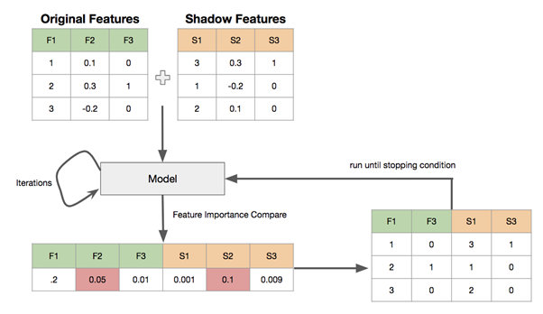

## 1、单特征分析

衡量好特征通常从以下几个角度：覆盖度，区分度，相关性，稳定性

### 1.1覆盖度

#### 1.1.1 覆盖度的定义与应用场景
*   **核心定义：** 覆盖度 = 非空的样本数 / 总的样本数。
*   **应用时机：** 采集类、授权类、第三方数据在使用前**必须**分析覆盖度。
    *   **采集类数据示例：** 如 APP list（Android 手机覆盖率可达 90%）。
    *   **授权类数据示例：** 如爬虫数据（覆盖率可能仅 20%-30%）、GPS（某些产品要求必须授权，覆盖率取决于用户授权率）。


#### 1.1.2 覆盖度的计算维度

覆盖度通常在以下两个用户群体层面上计算：
- **全体存量客户**
- **全体有信贷标签客户**


#### 1.1.3 衍生指标

*   **缺失率：** 通常指在 **全体有信贷标签用户** 上的覆盖度（即 `1 - 覆盖度`）。它直接反映了目标建模群体中特征数据的缺失程度。
*   **零值率：** 在信贷领域，数据缺失时常用“**零**”进行填充。因此，统计“零值”样本的比例（零值率）非常重要，它可能包含真实零值和填充的缺失值。


#### 1.1.4 覆盖度的提升

*   随着业务发展成熟，数据覆盖度通常会逐步改善。
*   可以通过制定特定的**运营策略**来主动提升关键特征的覆盖度（例如，优化用户授权引导流程）。

**总结**

> **覆盖度 = 非空的样本数 / 总的样本数。** 它是评估特征数据可用性和代表性的基础指标，直接影响特征的有效性和模型稳定性。


### 1.2 区分度

**定义**：评估特征对好坏用户（如信贷中的正常/逾期客户）的区分能力

**评估方法**：

- 单特征作为模型：使用 AUC、KS 指标
- **信贷领域常用指标**：Information Value (IV)
  - **IV 物理意义**：量化特征对好坏用户分布的区分程度
    - IV 值 ↗ → 区分度强
    - IV 值 ↘ → 区分度弱

**IV 计算公式**
$$
IV = \sum_{k} \left( p_{\text{good}}^k - p_{\text{bad}}^k \right) \ln \left( \frac{p_{\text{good}}^k}{p_{\text{bad}}^k} \right) = \sum_{k} \left( p_{\text{good}}^k - p_{\text{bad}}^k \right) \cdot \text{WOE}_k
$$

> **关键关系**：IV 计算中的对数部分即为 WOE（Weight of Evidence）


**IV 计算示例**

| 婚姻状态 | good 人数 | bad 人数 | p_good | p_bad | p_good - p_bad | ln(p_good/p_bad) | IV        |
| :------- | :-------- | :------- | :----- | :---- | :------------- | :--------------- | :-------- |
| 未婚     | 40        | 30       | 50%    | 37.5% | 0.125          | 0.2877           | **0.036** |
| 已婚     | 30        | 40       | 37.5%  | 50%   | -0.125         | -0.2877          | **0.036** |
| 其他     | 10        | 10       | 12.5%  | 12.5% | 0              | 0                | **0**     |
| **总计** | 80        | 80       | 100%   | 100%  | —              | —                | **0.072** |

> 注：数据为简化示例，非真实业务数据。


**IV 值应用规范**

| IV 范围         | 区分能力 | 使用策略                                                     |
| :-------------- | :------- | :----------------------------------------------------------- |
| **< 0.02**      | 弱       | 建模时不使用（树模型如 XGBoost、LightGBM 对IV值要求不高）    |
| **[0.02, 0.5]** | 强       | 可放入模型                                                   |
| **> 0.5**       | 极强     | **单独作为风控规则使用**，不参与模型训练（避免过拟合和模型可解释性降低） |


**关键业务建议**

- **建模原则**
  - 优先组合多个**弱区分度特征**（IV ∈ [0.02, 0.5)），通过模型集成提升预测能力 → **适用于评分卡模型**
- **连续变量处理**
  - 离散化（分箱）后再计算 IV → 推荐 **3-5 箱**
  - 分箱结果显著影响 IV 值（需结合业务调整分箱策略）

**小结**：IV 的实用区间为 **[0.02, 0.5]**，低于或高于该区间需针对性处理。


### 1.3 相关性

#### 1.3.1 基本概念

线性回归模型假设自变量x₁, x₂, ..., xₚ之间不存在严格的线性关系。为此需要进行相关性分析：

- 去除特征列之间相关性高的列
- 去除特征列和标签列之间相关性低的列
- 对相关系数较大的特征进行筛选，只保留其中对标签区分贡献度最大的特征，即保留IV值较大的特征


#### **1.3.2 常用相关系数**

- 皮尔逊(Pearson)相关系数
- 斯皮尔曼(Spearman)相关系数
- 肯德尔(Kendall)相关系数


#### 1.3.3 相关系数选择指南

| 变量类型1                | 变量类型2                | 推荐相关系数      |
| :----------------------- | :----------------------- | :---------------- |
| 连续型数值变量(正态分布) | 连续型数值变量(正态分布) | Pearson           |
| 连续型数值变量(非正态)   | 连续型数值变量           | Spearman或Kendall |
| 有序分类变量             | 有序分类变量             | Spearman          |
| 分类变量                 | 连续数值变量             | Kendall           |

**适用性总结**：Kendall > Spearman > Pearson


#### 1.3.4 计算方法

```python
import pandas as pd

df = pd.DataFrame({'A':[5,91,3], 'B':[90,15,66], 'C':[93,27,3]})

# 计算不同相关系数
df.corr()          # 皮尔逊
df.corr('spearman') # 斯皮尔曼
df.corr('kendall')  # 肯德尔
```


**使用toad库进行特征筛选**

可以使用toad库来过滤大量的特征，高缺失率、低iv和高度相关的特征一次性过滤掉

```python
import toad
data = pd.read_csv('./data/germancredit.csv')
data.replace({'good':0, 'bad':1}, inplace=True)

# 按缺失率>0.5, IV值<0.05, 相关性>0.7筛选特征
selected_data, drop_list = toad.selection.select(
    data, 
    target='creditability', 
    empty=0.5, 
    iv=0.05, 
    corr=0.7, 
    return_drop=True
)

print('保留特征:', selected_data.shape[1], 
      '缺失删除:', len(drop_list['empty']), 
      '低IV删除:', len(drop_list['iv']), 
      '高相关删除:', len(drop_list['corr']))
```

筛选结果示例

```
保留特征: 12 
缺失删除: 0 
低IV删除: 9 
高相关删除: 0
```

**小结**

- **特征列与标签列**：相关性低的去掉
- **特征列之间**：相关性高的去掉


### 1.4 稳定性

特征稳定性主要通过计算不同时间段内同一类用户特征的分布差异来评估，是特征选择的重要指标之一。

#### 1.4.1 群体稳定性指标(PSI)

**Population Stability Index (PSI)** 是衡量特征稳定性的主要指标：

- 当两个时间段的特征分布差异大 → PSI值大
- 当两个时间段的特征分布差异小 → PSI值小


#### 1.4.2 PSI计算公式

$$
\rm{PSI = \sum_{k}(p^{k}_{actual}-p^{k}_{expect})\ln{\frac{p^{k}_{actual}}{p^{k}_{expect}}}}
$$

**PSI与IV的比较**

| 指标 | 评估对象               | 应用场景       |
| :--- | :--------------------- | :------------- |
| IV   | 好坏用户分布差异       | 特征区分度评估 |
| PSI  | 不同时间段特征分布差异 | 特征稳定性评估 |

虽然计算公式相似，但应用场景和评估目标不同。


### 1.5 总结

#### 1.5.1 优质特征的四大标准

- **覆盖度高**
  - 缺失率低
  - 零值率低
- **区分度高**
  - IV值高（【0.02-0.5】）
- **稳定性强**
  - PSI值小
- **相关性合理**
  - 特征之间相关性不宜过大


#### 1.5.2 使用toad库进行特征筛选

可以使用toad库来做单特征筛选，从IV，缺失率，相关性三个维度，一次性筛选出复合条件的好特征来

```python
import toad

# 基础配置（需根据业务调整）
CONFIG = {
    'target': 'y',          # 标签列名
    'missing_thresh': 0.5,  # 缺失率阈值
    'iv_thresh': 0.05,      # IV值阈值 
    'corr_thresh': 0.7,     # 相关性阈值
    'return_drop': True     # 返回被删除特征
}

# 执行特征筛选
selected_data, drop_log = toad.selection.select(
    data,
    **CONFIG
)

# 结果分析
print(f"保留特征: {selected_data.shape[1]}")
print(f"因缺失率删除: {len(drop_log['empty'])}")
print(f"因低IV删除: {len(drop_log['iv'])}")
print(f"因高相关删除: {len(drop_log['corr'])}")
```


## 2、多特征筛选

**目的**：从大量特征中筛选有效子集，解决以下问题：

- 模型训练效率降低
- 样本需求量增加
- 计算与存储成本升高

**常用方法**：

| 方法名称         | 核心思想                       | 特点                 |
| :--------------- | :----------------------------- | :------------------- |
| **星座特征**     | 基于天文星座的启发式规则       | 直观但科学性待验证   |
| **Boruta**       | 随机森林阴影特征对比           | 全局最优，计算量大   |
| **方差膨胀系数** | 检测多重共线性（VIF>10需剔除） | 仅过滤冗余特征       |
| **递归特征消除** | 迭代剔除最不重要的特征         | 需配合模型性能评估   |
| **L1惩罚项**     | 通过正则化迫使稀疏解           | 自动压缩无效特征系数 |


###  2.1 星座特征

**核心思想**：将“星座”作为**无用特征基准线**，剔除重要性持续低于星座的特征。

**操作步骤**

- **加入基准**：在原始特征中**强制加入“星座”特征**。
- **多次训练**：重复训练模型（如随机森林、XGBoost），记录每次的特征重要性排序。
- **剔除规则**：若某特征**所有轮次的重要性均低于星座**，则标记为无效并剔除。

> **特点**
>
> - **优点**：简单直观，无需额外计算。
> - **注意**：依赖模型稳定性，建议至少训练3次以上取交集。


### 2.2 Boruta

Boruta 通过**比较真实特征与随机打乱顺序的“阴影特征”的重要性**，迭代地剔除不重要的真实特征。

#### 2.2.1 安装与依赖

- 网址：

```url
https://github.com/scikit-learn-contrib/boruta_py
```

- 安装：

```python
pip install Boruta -i https://pypi.tuna.tsinghua.edu.cn/simple
```


#### 2.2.2 核心原理

- 构造阴影特征
  - 对每个真实特征 **R**，随机打乱其取值顺序得到阴影特征 **S**。
  - 拼接得到新特征矩阵 **N = [R, S]**。
- 训练模型
  - 使用能输出 `feature_importances_` 的模型（RandomForest / LightGBM / XGBoost 等）。
  - 计算所有特征的重要性。
- 比较并筛选
  - 取阴影特征重要性的最大值 **s_max**。
  - 真实特征中重要性 < **s_max** 的视为不重要，直接删除。
- 迭代
  - 重复上述过程，直到满足停止条件（达到最大迭代次数或所有真实特征都被确认/拒绝）。



#### 2.2.3 完整案例代码

##### 1. 加载数据

```python
import numpy as np
import pandas as pd
import joblib
from sklearn.ensemble import RandomForestClassifier
from boruta import BorutaPy

# 读取数据（215,257 × 79）
pd_data = joblib.load('../data/train_woe.pkl')

# 去掉 ID 与目标列
pd_x = pd_data.drop(['SK_ID_CURR', 'TARGET'], axis=1)
X = pd_x.values            # 特征矩阵（numpy）
y = pd_data['TARGET'].values.ravel()  # 目标向量（一维）
```

> ⚠️ BorutaPy **只接受 numpy 数组**，务必使用 `.values`。

><font color='red'>显示结果：</font>
>
>|        | SK_ID_CURR | TARGET | AMT_GOODS_PRICE | REGION_POPULATION_RELATIVE | DAYS_BIRTH | DAYS_EMPLOYED | DAYS_REGISTRATION | DAYS_ID_PUBLISH | REGION_RATING_CLIENT_W_CITY | REG_CITY_NOT_LIVE_CITY |  ... | p_NAME_SELLER_INDUSTRY_Connectivity | p_NAME_YIELD_GROUP_XNA | p_NAME_YIELD_GROUP_high | p_NAME_YIELD_GROUP_low_action | p_NAME_YIELD_GROUP_low_normal | p_PRODUCT_COMBINATION_Card Street | p_PRODUCT_COMBINATION_Cash Street: high | p_PRODUCT_COMBINATION_Cash X-Sell: high | p_PRODUCT_COMBINATION_Cash X-Sell: low | p_PRODUCT_COMBINATION_POS industry with interest |
>| -----: | ---------: | -----: | --------------: | -------------------------: | ---------: | ------------: | ----------------: | --------------: | --------------------------: | ---------------------: | ---: | ----------------------------------: | ---------------------: | ----------------------: | ----------------------------: | ----------------------------: | --------------------------------: | --------------------------------------: | --------------------------------------: | -------------------------------------: | -----------------------------------------------: |
>| 125406 |     245429 |      0 |        0.610118 |                   0.016406 |   0.301190 |      0.092078 |         -0.099822 |        0.275679 |                   -0.020586 |              -0.048048 |  ... |                            0.053257 |               0.383810 |                0.065650 |                      0.073290 |                      0.164891 |                         -0.063697 |                               -0.028915 |                               -0.033661 |                               0.083527 |                                        -0.065841 |
>|   8155 |     109510 |      0 |       -0.366495 |                  -0.410334 |  -0.440745 |     -0.608958 |          0.164707 |        0.193847 |                   -0.536494 |              -0.048048 |  ... |                           -0.065479 |              -0.090837 |               -0.132787 |                      0.073290 |                     -0.241145 |                         -0.063697 |                               -0.028915 |                               -0.033661 |                               0.083527 |                                        -0.348529 |
>| 154053 |     278546 |      0 |        0.038650 |                   0.016406 |   0.301190 |      0.371651 |          0.075169 |        0.060654 |                   -0.020586 |              -0.048048 |  ... |                           -0.065479 |              -0.090837 |               -0.132787 |                     -0.316556 |                     -0.241145 |                         -0.063697 |                               -0.028915 |                               -0.033661 |                               0.083527 |                                        -0.348529 |
>| 300963 |     448668 |      0 |       -0.366495 |                  -0.158446 |   0.301190 |     -0.171601 |          0.075169 |       -0.057870 |                   -0.020586 |              -0.048048 |  ... |                           -0.065479 |              -0.090837 |               -0.132787 |                     -0.316556 |                      0.164891 |                         -0.063697 |                               -0.028915 |                               -0.033661 |                               0.083527 |                                        -0.348529 |
>| 269546 |     412373 |      0 |       -0.366495 |                  -0.410334 |  -0.051704 |     -0.171601 |         -0.099822 |       -0.297834 |                   -0.536494 |              -0.048048 |  ... |                            0.053257 |              -0.090837 |                0.110022 |                     -0.152116 |                      0.164891 |                         -0.063697 |                               -0.028915 |                               -0.033661 |                              -0.239387 |                                         0.084509 |
>|    ... |        ... |    ... |             ... |                        ... |        ... |           ... |               ... |             ... |                         ... |                    ... |  ... |                                 ... |                    ... |                     ... |                           ... |                           ... |                               ... |                                     ... |                                     ... |                                    ... |                                              ... |
>| 298994 |     446376 |      0 |       -0.050233 |                   0.016406 |  -0.440745 |     -0.451249 |         -0.377708 |       -0.297834 |                   -0.020586 |              -0.048048 |  ... |                            0.053257 |              -0.040815 |                0.110022 |                      0.073290 |                     -0.241145 |                         -0.063697 |                               -0.028915 |                               -0.033661 |                               0.083527 |                                         0.084509 |
>| 269429 |     412242 |      0 |       -0.050233 |                   0.016406 |  -0.440745 |      0.253381 |          0.075169 |        0.060654 |                   -0.020586 |              -0.048048 |  ... |                           -0.065479 |              -0.090837 |               -0.132787 |                      0.073290 |                      0.164891 |                         -0.063697 |                               -0.028915 |                               -0.033661 |                               0.083527 |                                        -0.348529 |
>|     16 |     100020 |      0 |        0.268859 |                   0.268275 |   0.301190 |      0.253381 |         -0.099822 |       -0.057870 |                   -0.020586 |               0.459100 |  ... |                           -0.065479 |              -0.090837 |                0.110022 |                      0.073290 |                      0.164891 |                         -0.063697 |                               -0.028915 |                               -0.033661 |                               0.083527 |                                         0.084509 |
>|  97169 |     212804 |      0 |        0.038650 |                   0.016406 |  -0.440745 |     -0.451249 |          0.075169 |       -0.057870 |                   -0.536494 |              -0.048048 |  ... |                           -0.065479 |              -0.090837 |                0.110022 |                      0.073290 |                      0.164891 |                         -0.063697 |                               -0.028915 |                               -0.033661 |                               0.083527 |                                         0.084509 |
>|  90581 |     205165 |      0 |       -0.050233 |                  -0.043274 |   0.301190 |      0.092078 |          0.075169 |        0.060654 |                   -0.020586 |              -0.048048 |  ... |                           -0.065479 |              -0.090837 |               -0.132787 |                      0.073290 |                      0.164891 |                         -0.063697 |                               -0.028915 |                               -0.033661 |                               0.083527 |                                        -0.348529 |
>
>215257 rows × 79 columns
##### 2. 配置 Boruta

```python
# 定义基模型
rf = RandomForestClassifier(
        n_jobs=-1,
        class_weight='balanced',
        max_depth=5)
'''
BorutaPy function
estimator : 所使用的分类器，
n_estimators : 分类器数量, 默认值 = 1000，auto是基于数据集自动判定
max_iter : 最大迭代次数, 默认值 = 100
'''

# 初始化 Boruta
feat_selector = BorutaPy(
        estimator=rf,
        n_estimators='auto',   # 自动决定树的数量
        max_iter=100,          # 最大迭代次数
        random_state=1)

# 拟合
feat_selector.fit(X, y)
```

##### 3. 查看结果

```python
# 生成结果表,feat_selector.support_ # 返回特征是否有用，false可以去掉
pd_ft_select = pd.DataFrame({
        'feature': pd_x.columns.tolist(),
        'selected': feat_selector.support_})

# 未选中的特征（可删除）
unselected = pd_ft_select[pd_ft_select['selected'] == False]
print(unselected)
```

  ><font color='red'>显示结果：</font>
  >
  > >
  > >| feature | selected                                         |      |
  > >| ------- | ------------------------------------------------ | ---- |
  > >| 0       | AMT_GOODS_PRICE                                  | True |
  > >| 1       | REGION_POPULATION_RELATIVE                       | True |
  > >| 2       | DAYS_BIRTH                                       | True |
  > >| 3       | DAYS_EMPLOYED                                    | True |
  > >| 4       | DAYS_REGISTRATION                                | True |
  > >| ...     | ...                                              | ...  |
  > >| 72      | p_PRODUCT_COMBINATION_Card Street                | True |
  > >| 73      | p_PRODUCT_COMBINATION_Cash Street: high          | True |
  > >| 74      | p_PRODUCT_COMBINATION_Cash X-Sell: high          | True |
  > >| 75      | p_PRODUCT_COMBINATION_Cash X-Sell: low           | True |
  > >| 76      | p_PRODUCT_COMBINATION_POS industry with interest | True |
  > >
  > >77 rows × 2 columns
  > >
  > >| feature | selected                         |       |
  > >| ------- | -------------------------------- | ----- |
  > >| 27      | b_CREDIT_DAY_OVERDUE             | False |
  > >| 33      | b_AMT_CREDIT_SUM_OVERDUE         | False |
  > >| 37      | b_CREDIT_TYPE_Microloan          | False |
  > >| 38      | b_CREDIT_TYPE_Mortgage           | False |
  > >| 42      | pos_cash_paid_late_12_cnt        | False |
  > >| 55      | p_NAME_CASH_LOAN_PURPOSE_Repairs | False |
  > >| 60      | p_CODE_REJECT_REASON_SCOFR       | False |

##### 4. 小结

| 指标       | 含义                                              |
| :--------- | :------------------------------------------------ |
| `support_` | True → 该特征被保留；False → 可删除               |
| `ranking_` | 数值越大越不重要。通常保留 `ranking_ == 1` 的特征 |


### 方差膨胀系数（VIF）

- 方差膨胀系数 Variance inflation factor (VIF)

  - 如果一个特征是其他一组特征的线性组合，则不会在模型中提供额外的信息，可以去掉

  - 评估共线性程度
    $$
    \rm{x_i=1+\sum_{k\ne{i}}\beta_{k}x_{k}}
    $$

  - VIF计算：$\rm{VIF=\frac{1}{1-R^2}}$

  - R^2^是线性回归中的决定系数，反映了回归方程解释因变量变化的百分比

  - 上面的式子中, R²代表了预测值和真实值拟合的拟合程度，既考虑了预测值与真实值的差异，同时也兼顾了真实值的离散程度

    - R²<0.5 → 弱拟合
    - 0.5 ≤ R² ≤ 0.8 → 中度拟合
    - R² > 0.8 强拟合

    > 
    >
    > 上面的公式中y = 真实值, $\hat{y}$  = 模型预测值, $\bar{y}$  = 真实值的平均值
    >
    > 注意：理论上 R² < 0 是可能的，但是只出现在模型特别差的情况，因此不予讨论

    当R²越大，拟合的越好，说明$x_i$这个特征能被其它特征线性表示，当VIF超过某个阈值的时候，可以考虑把这个$x_i$删除

  - VIF越大说明拟合越好，该特征和其他特征组合共线性越强，就越没有信息量，可以剔除

- 案例：

  - 加载数据

  ```python
  import numpy as np
  import pandas as pd 
  import joblib
  #statsmodels是统计学相关的库
  from statsmodels.stats.outliers_influence import variance_inflation_factor
  pd_data = joblib.load('../data/train_woe.pkl')
  #去掉ID和目标值
  pd_x = pd_data.drop(['SK_ID_CURR', 'TARGET'], axis=1)
  ```

  - 计算方差膨胀系数

  ```python
  #定义计算函数
  def checkVIF_new(df):
      lst_col = df.columns
      #x = np.matrix(df)
      x = df.values
      #这里i传入的是索引，从第0个特征开始，顺序计算所有特征的方差膨胀系数
      VIF_list = [variance_inflation_factor(x,i) for i in range(x.shape[1])]
      VIF = pd.DataFrame({'feature':lst_col,"VIF":VIF_list})
      max_VIF = max(VIF_list)
      return VIF
  df_vif = checkVIF_new(pd_x)
  df_vif
  ```

><font color='red'>显示结果：</font>
>|      |                                          feature | VIF      |
>| ---: | -----------------------------------------------: | -------- |
>|    0 |                                  AMT_GOODS_PRICE | 1.164528 |
>|    1 |                       REGION_POPULATION_RELATIVE | 1.835830 |
>|    2 |                                       DAYS_BIRTH | 3.278163 |
>|    3 |                                    DAYS_EMPLOYED | 1.658723 |
>|    4 |                                DAYS_REGISTRATION | 1.177438 |
>|  ... |                                              ... | ...      |
>|   73 |          p_PRODUCT_COMBINATION_Cash Street: high | 2.384278 |
>|   74 |          p_PRODUCT_COMBINATION_Cash X-Sell: high | 1.926074 |
>|   75 |           p_PRODUCT_COMBINATION_Cash X-Sell: low | 2.102989 |
>|   76 | p_PRODUCT_COMBINATION_POS industry with interest | 2.036221 |
>
>77 rows × 2 columns

  - 选取方差膨胀系数 > 3的features

```python
df_vif[df_vif['VIF'] > 3]
```

><font color='red'>显示结果：</font>
>
>|      |                     feature |      VIF |
>| ---: | --------------------------: | -------: |
>|    2 |                  DAYS_BIRTH | 3.278163 |
>|   11 | YEARS_BEGINEXPLUATATION_AVG | 4.536902 |
>|   12 |              FLOORSMAX_MEDI | 5.418642 |
>|   13 |              TOTALAREA_MODE | 5.211742 |
>|   16 |  AMT_REQ_CREDIT_BUREAU_YEAR | 4.172515 |
>|   18 |  NAME_INCOME_TYPE_Pensioner | 3.416916 |
>|   23 |      EMERGENCYSTATE_MODE_No | 3.836772 |
>|   27 |        b_CREDIT_DAY_OVERDUE |      inf |
>|   33 |    b_AMT_CREDIT_SUM_OVERDUE |      inf |
>|   35 |      b_CREDIT_TYPE_Car loan | 3.127171 |
>|   38 |      b_CREDIT_TYPE_Mortgage |      inf |
>|   65 |        p_NAME_PORTFOLIO_POS | 3.273039 |
>|   68 |      p_NAME_YIELD_GROUP_XNA | 4.237860 |
>

总结：VIF越大，说明拟合越好，该特征和其他特征组合共线性越强，建议剔除。


###  RFE递归特征消除 (Recursive Feature Elimination)

- 使用排除法的方式训练模型，把模型性能下降最少的那个特征去掉，反复上述训练直到达到指定的特征个数、

  - sklearn.feature_selection.RFE

- 案例

  - 使用RFE，选择features

  ```python
  #如下的案例可以快速出结果
  from sklearn.svm import LinearSVC
  from sklearn.datasets import load_iris
  from sklearn.feature_selection import RFE
  X,y = load_iris(return_X_y=True)
  #分类模型，C是正则化参数，用于控制模型复杂度和泛化能力，默认是1.0
  lscv = LinearSVC(C=0.01)
  # n_features_to_select 要选几个特征,  step 一次删掉几个
  selector = RFE(lscv,n_features_to_select=2,step=1)
  selector.fit(X,y)
  # support_ 返回False的可以被删除, 返回True的留下
  selector.support_
  # 获取顺序 序号越大的是优先被删除的
  selector.ranking_
  ```

  ><font color='red'>显示结果：</font>
  >
  >~~~
  >array([False,  True,  True, False])
  >~~~


### 基于L1的特征选择 (L1-based feature selection)

- 使用L1范数作为惩罚项的线性模型(Linear models)会得到稀疏解：大部分特征对应的系数为0
- 希望减少特征维度用于其它分类器时，可以通过 feature_selection.SelectFromModel 来选择不为0的系数


案例

```python
from sklearn.svm import LinearSVC
from sklearn.datasets import load_iris
from sklearn.feature_selection import SelectFromModel
iris = load_iris()
X, y = iris.data, iris.target
X.shape
```

><font color='red'>显示结果：</font>
>
>(150, 4)

```python
#Prefer dual=False when n_samples > n_features.（当样本数量比特征数量多时，设置为False即可）
lsvc = LinearSVC(C=0.01, penalty="l1", dual=False).fit(X, y)
model = SelectFromModel(lsvc, prefit=True)
X_new = model.transform(X)
X_new.shape
```

><font color='red'>显示结果：</font>
>
>```shell
>(150, 3)
>```

总结：我们一般不会单独去实现L1特征选择，不过我们在选择线性模型时如果使用L1进行正则化，就相当于已经用L1来帮我们做特征选择了。


## assets/day04特征监控

### 内部特征监控

释义：对内部的数据特征进行监控。

- 前端监控（授信之前）：特征稳定性
  - 大多数情况下，随着业务越来越稳定，缺失率应该呈现逐渐降低的趋势
  - 如下表所示，Week3缺失率突然增加到28%，大概率是数据采集或传输过程出问题了
  - PSI，特征维度的PSI如果>0.1可以观察一段时间

| 特征名称 | Week  1 | Week 2 | Week 3 | ...  |
| -------- | ------- | ------ | ------ | ---- |
| 缺失率   | 1%      | 2%     | 28%    |      |
| 零值率   | 20%     | 23%    | 18%    |      |
| PSI      | -       | 0.02   | 0.3    |      |

- 后端监控（放款之后）：特征区分度
  - AUC/KS 波动在10%以内
  - KS 如果是线上A卡 0.2是合格的水平
  - IV值的波动稍大可以容忍，和分箱相关，每周数据分布情况可能不同，对IV影响大一些

| 特征名称 | Week  1 | Week 2 | Week 3 | ...  |
| -------- | ------- | ------ | ------ | ---- |
| AUC      | 0.64    | 0.66   | 0.62   |      |
| KS       | 22%     | 23%    | 20%    |      |
| IV       | 0.05    | 0.07   | 0.04   |      |

- 分箱样本比例

| 特征名称 | Week  1 | Week 2 | Week 3 | ...  |
| -------- | ------- | ------ | ------ | ---- |
| 分箱1    | 10%     | 20%    | 15%    |      |
| 分箱2    | 50%     | 60%    | 75%    |      |
| 分箱3    | 40%     | 20%    | 10%    |      |

- 分箱风险区分：要重视每个特征的**风险趋势单调性**
  - 每一箱 的bad_rate有波动，容忍度相对高一些
  - 要**高度重视不同箱之间风险趋势发生变化**，如分箱1，分箱2，在week2和week3 风险趋势发生了变化
  - 如果**风险趋势单调性**发生变化，要考虑特征是不是要进行迭代

| 特征名称 | Week  1 | Week 2 | Week 3 | ...  |
| -------- | ------- | ------ | ------ | ---- |
| 分箱1    | 30%     | 26%    | 20%    |      |
| 分箱2    | 10%     | 17%    | 23%    |      |
| 分箱3    | 5%      | 7%     | 6%     |      |


### 外部特征评估

释义：对外部（外来的）数据特征进行评估。

- 数据评估标准

  覆盖度、区分度、稳定性

- 使用外部数据的时候需要注意

  避免未来信息：使用外部数据的时候，可能出现训练模型的时候效果好，上线之后效果差

  - 取最近一个时间周期的数据
  - 之前3~4个月或者更长时间的数据做验证，看效果是不是越来越差

- 外部数据覆盖度如何计算

  - 交集用户数 / 内部用户数
  - 需要对内部所有用户调用外部数据？
    - 如果外部数据免费，那么全部调用，但付费的三方数据要在有必要的时候在调用
    - 在计算外部数据覆盖度前，首先应该明确什么客群适合这个第三方数据
    - 内部缺少数据且这个第三方数据能提升区分度，那这个第三方数据才有用
  - 覆盖度 = 交集用户数 / 内部目标客群

- 避免内部数据泄露

  - 如果需要把数据交给外部公司，让对方匹配一定要将内部信息做Hash处理再给对方匹配

  

  - 匹配上的是共有的数据，匹配不上的外部无法得知其身份

- 避免三方公司对结果美化

  - 内部自己调用接口测覆盖度直接调用即可
  - 如果是把样本交给外部公司让对方匹配，一定要加假样本
    - 这样他们只能匹配出结果，但无法得知真实的覆盖度
    - 只有内部公司能区分出真假样本，从而计算出真实覆盖度
    - 如果覆盖度高于真实样本比例，说明结果作假

- 评分型外部数据

  区分度和稳定性的分析方法同单特征的分析一样

  区分度：AUC, KS, IV, 风险趋势

  稳定性: PSI

- 内部特征训练的模型效果 vs 内部特征+外部特征训练的模型效果

  - AUC有 2~3个点的提升就很好了

- 黑名单型外部数据

  - 使用混淆矩阵评估区分度
  
    |        | 外部命中 | 外部未命中 |
    | ------ | -------- | ---------- |
    | 内部坏 | TP       | FN         |
    | 内部好 | FP       | TN         |
    
    
    
    
    
  - Precision: 外部命中的尽可能多的是内部的坏客户
  
  - Recall: 内部的坏客户尽可能多的命中外部名单

- 外部数据是否具有可回溯性无法得知，所以尽可能取最近的样本去测

  早期接入数据后要密切关注线上真实的区分度表现


## assets/day04

~~~shell
#1.完成toad案例

#2.完成相关性案例

#3.完成Boruta算法案例

#4.理解算法原理、概念、逻辑等
~~~


