## 1、版本控制简介

### 1. 人肉版本控制 VS 版本控制软件

| 人肉（手动）               | 版本控制软件         |
| -------------------------- | -------------------- |
| 复制-粘贴-重命名           | 几行命令 / 点击即可  |
| 文件名看不出改动内容       | 内置 diff，改动高亮  |
| 硬盘坏了就完了             | 任意历史版本一键恢复 |
| 多人合并靠吼，并且容易出错 | 分支合并自动完成     |


### 2. 三大版本控制系统演进

#### 2.1 本地版本控制系统

> 单机、单用户

- 优点：比手动复制强
- 缺点：
  - 不支持多人协作
  - 数据库损坏 = 历史全灭

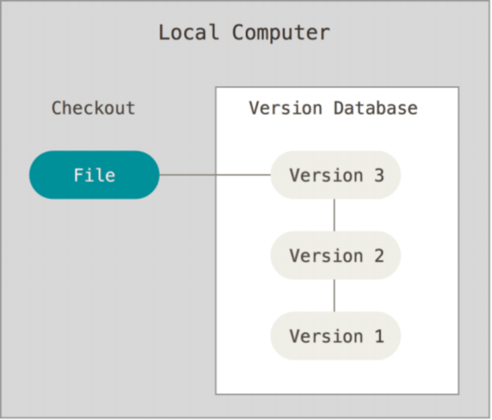

#### 2.2 集中式版本控制系统（SVN）

> Server-Client 架构，服务器保存文件的所有更新记录，客户端只保留最新的文件版本

- 优点：支持多人协作
- 缺点：
  - 必须联网提交
  - 中心服务器一挂，全员停工
  - 数据库损坏 = 历史全灭

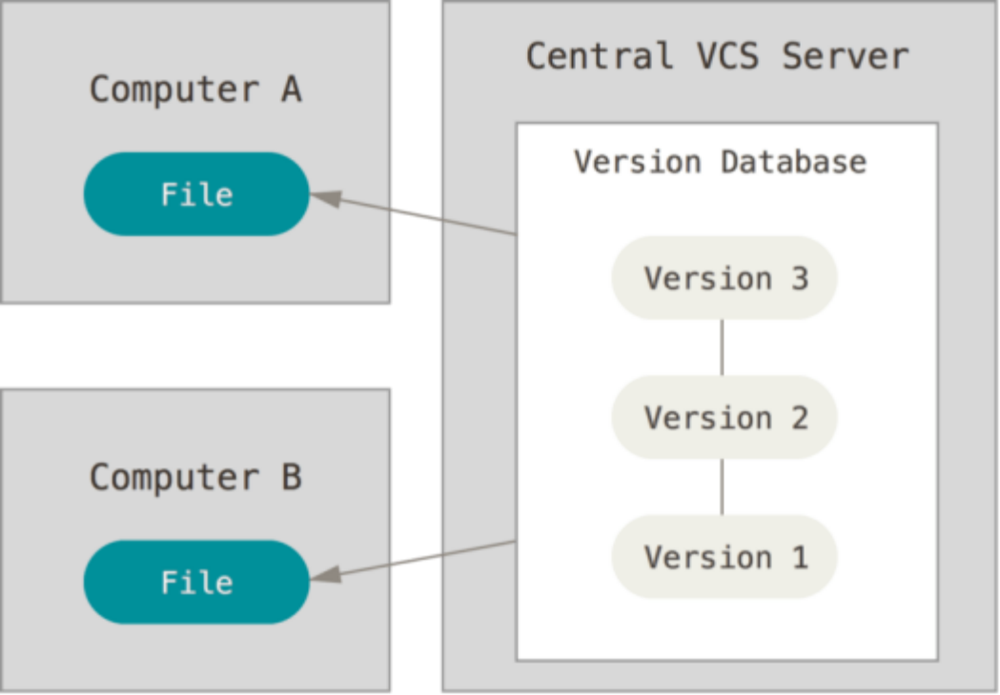

#### 2.3 分布式版本控制系统（Git）

> 人人都有一个完整仓库，服务器保存文件的所有更新版本，客户端是服务器的完整备份，并不是只保留文件的最新版本

- 优点：
  - 支持多人协作
  - 离线也能提交
  - 服务器坏了，任意客户端都能恢复

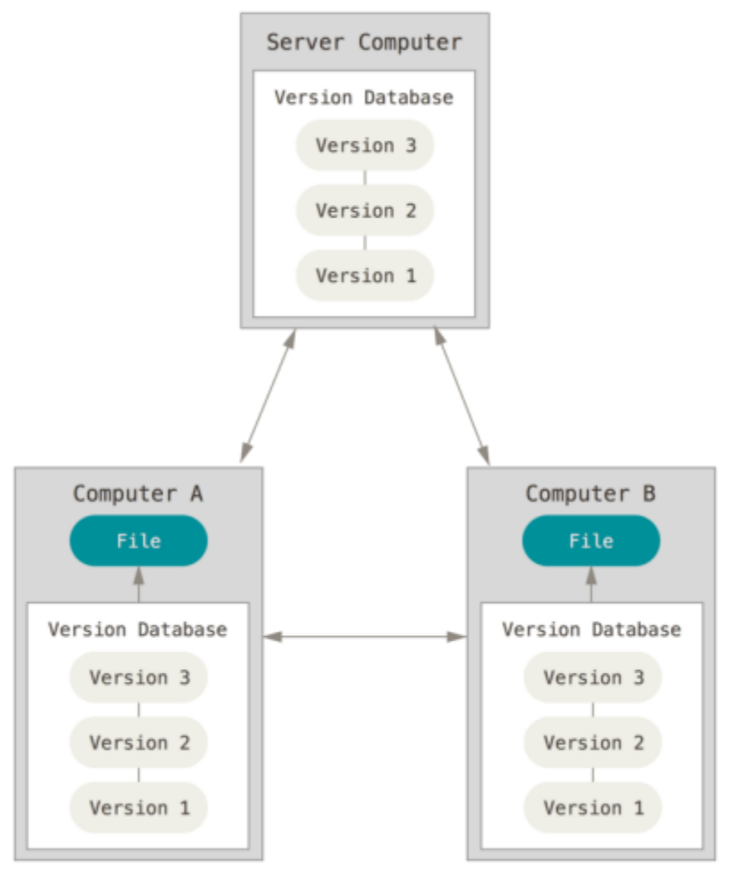

### 3. 使用版本控制软件的 5 大好处

- **操作简单** — 命令少、界面点选即可
- **对比方便** — 内置 diff，改动一目了然
- **轻松回溯** — 文件 / 项目一键回滚
- **永不丢失** — 误删也能找回
- **协作顺畅** — 分支合并，冲突自动提示


## 2、Git简介

### 1. Git 是什么？

> **Git = 最先进的分布式版本控制系统**
> 项目越大、人越多，Git 越快、越稳。

| 核心差异 | 传统工具     | Git                       |
| -------- | ------------ | ------------------------- |
| 记录方式 | 差异比对     | **直接快照**              |
| 网络依赖 | 经常需要联网 | **本地即可完成 90% 操作** |
| 断网场景 | 停工         | **继续提交、分支、回滚**  |


### 2. Git 的安装

在开始使用 Git 管理项目的版本之前，需要将它安装到计算机上。可以使用浏览器访问如下的网址，根据自己的操作系统，选择下载对应的 Git 安装包：

1️⃣ 打开官网 → [git-scm.com/downloads](https://git-scm.com/downloads)

2️⃣ 选系统 → Windows / macOS / Linux 一键安装

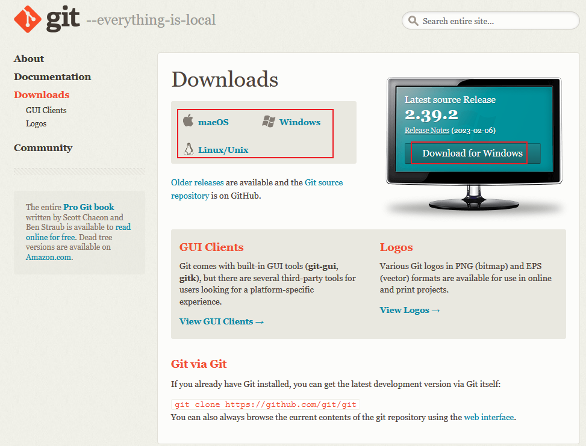

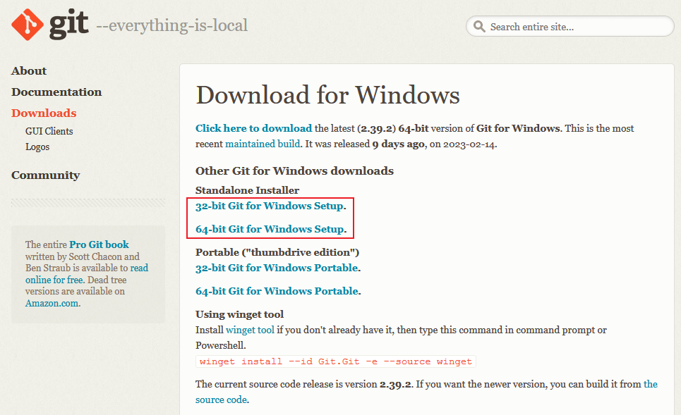

3️⃣ 一路 Next（可顺带装 Git GUI 或 TortoiseGit 中文包）
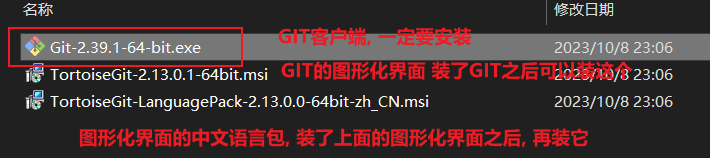


#### **Pycharm 中配置git**

> ⚙️ PyCharm / VSCode 等 IDE 会自动识别 Git 路径，无需额外配置。


### 3. 概念区分

| 名称              | 本质         | 典型用途           |
| ----------------- | ------------ | ------------------ |
| **Git**           | 工具         | 本地版本控制       |
| **GitHub**        | 国外托管平台 | 开源项目、全球协作 |
| **Gitee**         | 国内托管平台 | 访问更快、中文友好 |
| **GitLab / 工蜂** | 企业私仓     | 公司内部源码管理   |


### 4. git架构

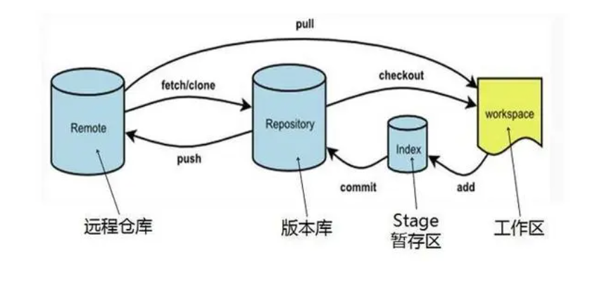

| 区域     | 作用     | 常用命令                    |
| -------- | -------- | --------------------------- |
| 工作区   | 写代码   | `git add` → 放入暂存区      |
| 暂存区   | 临时快照 | `git commit` → 生成版本     |
| 本地仓库 | 完整历史 | `git push` → 上传到远程     |
| 远程仓库 | 云端备份 | `git pull` / `clone` → 下载 |

> 解释：
>
> 仓库：简单理解，就是文件夹。
> 本地仓库：文件夹在本地创建的。图示就是版本库。
> 远程仓库：代码托管平台上。github、gitee、gitlab、工蜂
> 工作区：就是干活的地方。在哪个分支干活，哪里就是工作区。
> 暂存区：只是暂存代码而已，如果代码OK，没有问题，则一定要commit（提交）。


#### 日常开发 5 步循环

1. **git pull** —— 开始工作前同步最新代码
2. **写代码** —— 在工作区任意修改
3. **git add** —— 把改动放进暂存区
4. **git commit** —— 生成一个新版本
5. **git push** —— 推送到远程仓库

> ⚠️ 禁止直接往主分支（master/main）提交带 Bug 的代码；先在个人分支测试。


### 5. git的分支

#### 5.1 分支的概念与作用

> **分支 = 平行宇宙，互不干扰，随时合并，**可以保持代码库的**主分支干净整洁**，并且方便开发人员在不同的功能或任务之间进行切换。

- 以当前代码为起点，复制一份独立历史
- 开发、测试、修复都在各自宇宙完成
- 完成后再把宇宙合并回主线

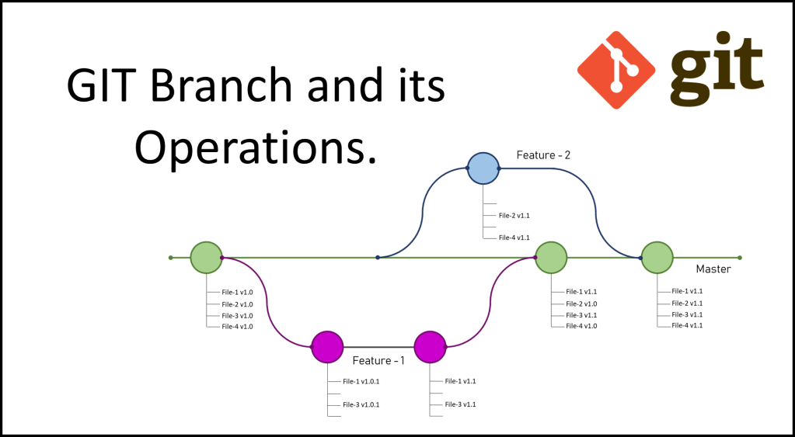

#### 5.2 分支的三大日常用途

| 场景       | 分支名示例            | 目的         |
| ---------- | --------------------- | ------------ |
| 新功能开发 | `feature/login`       | 不污染主线   |
| 紧急修复   | `hotfix/payment-bug`  | 快速上线补丁 |
| 技术实验   | `experiment/ai-model` | 试完可扔     |
| 发布版本   | `master`              | 发布软件版本 |

在进行多人协作开发的时候，  为了防止互相干扰，提高协同开发的体验，建议每个开发者都基于分支进行项目功能的开发，例如：

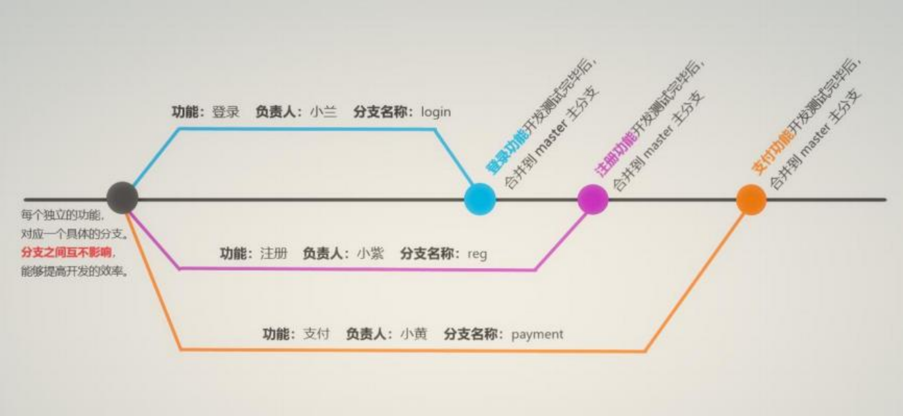

#### 5.3 主分支(master)

在初始化本地 Git 仓库的时候，  Git 默认已经帮我们创建了一个名字叫做 master 的分支。通常我们把这个 master 分支叫做主分支。在实际工作中，  master 主分支的作用是：  用来保存和记录整个项目已完成的功能代码。因此，不允许程序员直接在 master 分支上修改代码，因为这样做的风险太高，容易导致整个项目崩溃。

> **master 只存「可发布」代码，禁止直接修改**

- 所有功能必须从 master 拉取新分支
- 开发完 → 测试完 → 合并回 master
- 确保 master 永远稳定可上线

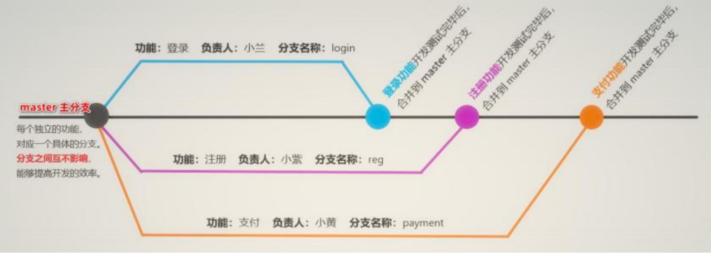 


#### 5.4 功能分支

由于程序员不能直接在 master 分支上进行功能的开发，所以就有了功能分支的概念。功能分支指的是专门用来开发新功能的分支，它是临时从 master 主分支上分叉出来的，当新功能开发且测试 完毕后，最终需要合并到 master 主分支上，如图所示：

- 每人一条分支，互不阻塞
- 合并前通过 Pull Request 评审

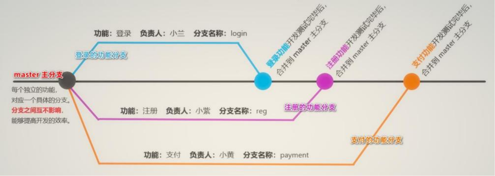


### 6. 项目托管平台的介绍与应用

专门用于免费存放开源项目源代码的网站，叫做开源项目托管平台。目前世界上比较出名的开源项目托管平台 主要有以下 3 个：

| 平台       | 特点                 | 适合场景           |
| ---------- | -------------------- | ------------------ |
| **GitHub** | 全球最大、开源为主   | 公开项目、贡献他人 |
| **GitLab** | 私有部署、权限精细   | 企业内部私仓       |
| **Gitee**  | 国内访问快、中文界面 | 国内团队、教学     |


 Github 是全球最大的开源项目托管平台。只支持 Git 作为唯一的版本控制工具，GitHub可以：

①  关注自己喜欢的开源项目，为其点赞打 call

② 为自己喜欢的开源项目做贡献(Pull Request)

③ 和开源项目的作者讨论 Bug和提需求  (Issues)

④  把喜欢的项目复制一份作为自己的项目进行修改(Fork)

⑤  创建属于自己的开源项目

⑥ etc…


### 7. 本次实战：Gitee 三步上车

1️⃣ 注册 → 把用户名改为「组号_姓名拼音」
2️⃣ 添加 SSH 公钥 → 打通本地与云端
3️⃣ 接受邀请链接 → 成为项目开发者


### 8. SSH 公钥配置

| 步骤       | 命令/操作                                        |
| ---------- | ------------------------------------------------ |
| ① 生成密钥 | `ssh-keygen -t rsa`（一路回车）                  |
| ② 找到公钥 | `C:\Users\你的用户名\.ssh\id_rsa.pub`            |
| ③ 复制粘贴 | 打开文件 → 复制全部 → 粘贴到 Gitee「SSH 公钥」框 |

> 配置完后，就可以从Gitee远程仓库拉取代码到本地了。
>


---


### 9. Git 协作开发流程（基于 PyCharm）

#### 9.1 项目准备阶段

**1.1 克隆仓库**

- **方式一：命令行**

  ```bash
  git clone <仓库地址>
  ```

- **方式二：PyCharm 图形界面**

  - 打开 PyCharm → 点击 **Get from VCS**
  - 输入仓库 URL（如 HTTPS 或 SSH）
  - 选择本地目录 → 点击 **Clone**


**1.2 配置 Git**

- 打开 PyCharm → `Settings` → `Version Control` → `Git`
- 设置 Git 可执行路径（如：`C:\Program Files\Git\cmd\git.exe`）
- 点击 **Test** 确保配置成功


- 打开版本控制功能，弹出窗口中选择Git


#### 9.2 分支管理

**2.1 创建并切换分支**

- 在 PyCharm 右下角点击分支名 → `New Branch`
- 命名规范：`group_01`、`develop_<姓名>` 等
- 创建后立即执行一次 `push`，远端才会出现该分支

**2.2 切换分支**

- 点击右下角分支名 → 选择目标分支 → `Checkout`


#### 9.3 开发流程

**3.1 日常开发建议**

- **开发前**：先执行 `git pull` 拉取最新代码
- **开发中**：
  - 修改代码 → `commit` → `push`
  - 可多次 `commit`，但**不要 push 有 bug 的代码**
  - `.idea/` 目录下的文件**不要提交**

**3.2 提交操作**

| 操作   | 作用             | 快捷键/路径        |
| ------ | ---------------- | ------------------ |
| Commit | 提交到本地仓库   | `Ctrl + K`         |
| Push   | 推送到远端仓库   | `Ctrl + Shift + K` |
| Pull   | 拉取远端最新代码 | `Ctrl + T`         |


#### 9.4 合并分支（Merge）

**4.1 合并流程**

- 假设要将 `develop_ym` 合并到 `develop`：
  1. 切换到目标分支（如 `develop`）
  2. 右键项目 → `Git` → `Merge into Current`
  3. 选择源分支（如 `develop_ym`）→ 点击 **Merge**
  4. 合并完成后，执行 `push` 推送到远端

**4.2 冲突解决**

- 若出现冲突，PyCharm 会弹出冲突文件列表
- 处理方式：
  - **Accept Yours**：保留你的版本
  - **Accept Theirs**：保留他人版本
  - **Merge**：手动合并
- 解决后需再次 `commit` 和 `push`


#### 9.5版本回退与快照

**5.1 回退到某次提交**

- 打开 `Git Log`（右下角 → `Show History`）
- 右键某次提交 → `Checkout Revision`
- 可查看历史代码，或基于此创建新分支


**5.2 撤销提交**

- `Undo Commit`：撤销最近一次本地提交（未 push）
- `Revert Commit`：撤销已 push 的提交（会生成新 commit）


#### 9.6 项目结构建议

| 文件夹名 | 用途说明                    |
| -------- | --------------------------- |
| `code/`  | 存放 `.py` 和 `.ipynb` 文件 |
| `PD/`    | 项目文档（需求、设计等）    |
| `Memo/`  | 开发问题记录与解决方案      |

##### 

#### 9.7 注意事项（⚠️）

- 每次开发前务必 `pull`，避免冲突
- 不要在 `master` 分支上直接开发
- 合并前确保源分支已 `commit` + `push`
- 使用 `.gitignore` 忽略 `.idea/`、`__pycache__/` 等文件
