## 1、神经网络的构成

### 1.1 神经元

> **神经元作用**：加权和+激活函数（激活函数为网络引入非线性，使其可逼近任意函数。）

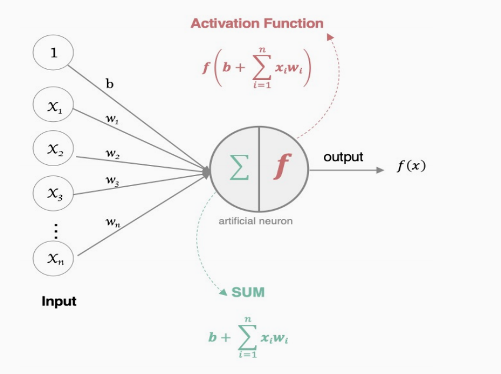


### 1.2 神经网络

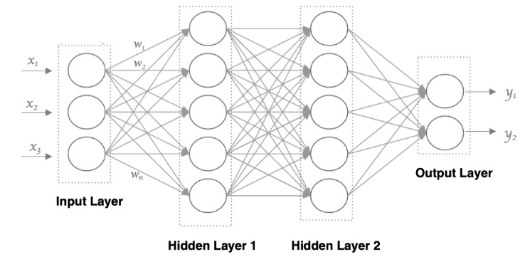

| 层级   | 作用         | 关键公式                                                     | 备注                 |
| ------ | ------------ | ------------------------------------------------------------ | -------------------- |
| 输入层 | 接收原始数据 | `batch_size * 每个数据的维度`                                | 维度需与特征数一致   |
| 隐藏层 | 特征抽象     | `激活(加权和)`                                               | 可有多层             |
| 输出层 | 给出预测     | 二分类：`sigmoid(z)`；多分类：`softmax(z)`；回归：`identity(z)` | 维度需与任务目标一致 |

- **特点**：
  - 同层神经元无连接
  - 全连接：相邻层两两相连
  - 第N-1层神经元的输出就是第N层神经元的输入。
  - 每个连接都有一个权重值（w系数和b系数）


### 1.3 激活函数

**作用**：对每层输出进行 **非线性变换**，使神经网络能拟合任意复杂曲线。

- **无激活函数** → 网络退化为 **单层线性模型**，只能拟合直线（平面）。

- **有激活函数** → 引入非线性，可逼近任意复杂函数，显著提升模型表达能力。

> 激活函数通过“非线性开关”让神经网络真正“深度”起来，否则再多层也只是线性组合。


#### 1. sigmoid激活函数 

**数学定义**

**Sigmoid** 激活函数的公式为：
$$
f(x) = \frac{1}{1 + e^{-x}}
$$
其导数公式为：
$$
f'(x) = f(x)(1 - f(x))
$$
**sigmoid** 激活函数的函数图像如下:

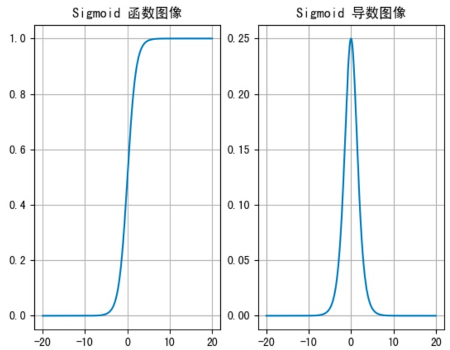

**特性分析**

- **输出范围**：将任意输入映射到 (0,1) 区间，概率值
- **敏感区间**：
  - 输入在 [-6, 6] 时输出有明显差异
  - 输入在 [-3, 3] 时效果最佳
- **梯度问题**：
  - 导数范围 (0, 0.25)
  - 当 |x| > 6 时，导数接近0，导致梯度消失
- **局限性**：
  - 通常5层内就会出现梯度消失
  - 不以0为中心
  - 实践中使用较少，一般仅用于二分类输出层

> **总结**
>
> Sigmoid 的梯度消失本质源于其导数的上限和连乘效应，而 5 层是一个经验阈值，超过后梯度衰减会显著影响训练。这一问题是推动 ReLU 等激活函数普及的关键原因之一。

```python
import torch
import matplotlib.pyplot as plt

# 函数图像
x = torch.linspace(-20,20,1000)
y = torch.sigmoid(x)

plt.plot(x,y)
plt.grid()
plt.show()

# 导函数图像
x = torch.linspace(-20,20,1000,requires_grad=True)
torch.sigmoid(x).sum().backward()  # 这里使用 sum() 是因为 backward() 只能对标量（单个数值）进行自动求导。torch.sigmoid(x) 返回的是一个向量（张量），不能直接调用 backward()。通过 .sum() 把所有元素加起来变成一个标量，这样才能进行反向传播，计算 x.grad。==这里sum()的作用是把1000个sigmoid输出值加起来得到一个标量，然后backward()计算这个标量相对于原始1000个输入值的梯度，结果存储在x.grad中。

plt.plot(x.detach(),x.grad)  # 这里使用 x.detach() 是为了从计算图中分离 x，防止在绘图时无意中影响梯度计算或反向传播。x.detach() 得到的是一个不带梯度信息的张量，适合用于可视化。这样可以安全地将 x 作为横坐标，x.grad 作为纵坐标进行绘图。
plt.grid()
plt.show()
```


#### 2. tanh激活函数

**数学定义**

- **函数表达式：**

$$
f(x) = \frac{1 - e^{-2x}}{1 + e^{-2x}}
$$

- **导数公式：**

$$
f'(x) = 1 - f^2(x)
$$

- **Tanh 的函数图像、导数图像如下：**

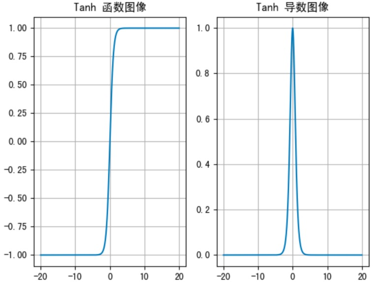

**特性分析**

| 特性         | 描述                                                         |
| ------------ | ------------------------------------------------------------ |
| **输出范围** | (-1, 1)，以 0 为中心对称                                     |
| **饱和区间** | 当输入值 < -3 或 > 3 时，输出趋近于 -1 或 1                  |
| **导数范围** | (0, 1)，在饱和区导数趋近于 0，易导致梯度消失                 |
| **优势**     | 相比 **Sigmoid**，**Tanh** 以 0 为中心，梯度更大，收敛更快   |
| **劣势**     | 两侧导数趋近于 0，仍可能引发梯度消失问题                     |
| **使用建议** | 隐藏层中要使用指数型激活函数时，就选择**tanh**，输出层可搭配 **Sigmoid** 使用 |

```python
import torch
import matplotlib.pyplot as plt

# 函数图像
x = torch.linspace(-20,20,1000)
y = torch.tanh(x)
plt.plot(x,y)
plt.grid()
plt.show()

# 导函数图像
x = torch.linspace(-20,20,1000,requires_grad= True)
torch.tanh(x).sum().backward()
plt.plot(x.detach(),x.grad)
plt.grid()
plt.show()
```

> `detach()`通常在以下几种情况下需要使用：
>
> - 需要从计算图中分离张量，防止其继续参与反向传播。例如：只想用当前张量的值做可视化或后续计算，但不希望其梯度被追踪和累积。
> - 在训练过程中，想要保存某一时刻的中间结果用于后续分析或显示，但不希望影响梯度计算。
> - 在自定义损失函数或复杂网络结构时，部分分支不需要反向传播梯度，可以用 detach() 断开梯度流。
>
> 简单来说，detach() 让张量变成“叶子节点”，后续操作不会影响原有的计算图和梯度。常见于可视化、推理、冻结部分网络参数等场景。


#### 3. relu激活函数

**数学定义**

- **函数表达式：**

$$
\text{ReLU}(x) = \max(0, x) = 
\begin{cases} 
x, & x > 0 \\
0, & x \leq 0 
\end{cases}
$$

- **导数公式：**

$$
\frac{\partial \text{ReLU}(x)}{\partial x} =
\begin{cases} 
1, & x > 0 \\
0, & x < 0 
\end{cases}
$$

- **relu 的函数图像、导数图像如下：**

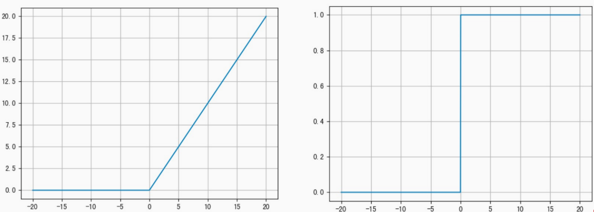


**ReLU 特性速览**

> **隐藏层使用，使用场景最多**

| 优点                                               | 缺点                                                         |
| -------------------------------------------------- | ------------------------------------------------------------ |
| 1. 计算量小（函数计算、求导计算简单）              | 1. 神经元死亡（dying ReLU）：若某权重长期使输入 < 0，则对应梯度恒为 0，参数无法更新 |
| 2. 正区间梯度恒为 1，不会梯度消失                  | 2. 输出均值 > 0，可能导致偏移（可使用 Leaky-ReLU / P-ReLU 改进） |
| 3. 当某一部分神经元输出为0，神经元死亡，缓解过拟合 | 3. 当大部分神经元输出为0，从头开始或换激活函数leakyrelu      |


**与Sigmoid/Tanh对比**

| 特性       | ReLU           | Sigmoid      | Tanh         |
| :--------- | :------------- | :----------- | :----------- |
| 计算复杂度 | 极低           | 高（含指数） | 高（含指数） |
| 梯度消失   | 正区间无衰减   | 严重         | 较严重       |
| 输出范围   | $[0, +\infty)$ | $(0, 1)$     | $(-1, 1)$    |
| 死亡神经元 | 存在风险       | 无           | 无           |

```python
import torch
import matplotlib.pyplot as plt

# 函数图像
x = torch.linspace(-20,20,1000)
y = torch.relu(x)
plt.plot(x,y)
plt.grid()
plt.show()

# 导函数图像
x = torch.linspace(-20,20,1000,requires_grad= True)
torch.relu(x).sum().backward()
plt.plot(x.detach(),x.grad)
plt.grid()
plt.show()
```


#### 4. softmax

Softmax 用于**多分类**场景，是 sigmoid 在二分类基础上的推广。  其核心作用是将网络输出的 *logits* 映射为 **(0, 1)** 区间的概率，并保证所有类别概率之和为 1。

**计算公式**
$$
\text{softmax}(z_i) = \frac{e^{z_i}}{\sum_{j=1}^{K} e^{z_j}}
$$

其中：
- $z_i$ 为第 $i$ 类的 logit；
- $K$ 为类别总数；

**示例**

给定 logits  
$$
\mathbf{z} = [0.2,\; 0.02,\; 0.15,\; 0.15,\; 1.3,\; 0.5,\; 0.06,\; 1.1,\; 0.05,\; 3.75]
$$

经 Softmax 后得到的概率分布，选择概率最大的作为结果：

| 类别 | 概率       |
| ---- | ---------- |
| 0    | 0.0212     |
| 1    | 0.0177     |
| 2    | 0.0202     |
| 3    | 0.0202     |
| 4    | 0.0638     |
| 5    | 0.0287     |
| 6    | 0.0185     |
| 7    | 0.0522     |
| 8    | 0.0183     |
| 9    | **0.7392** |

> 最终预测结果：类别 **9**（概率最大）。

```python
scores = torch.tensor([0.2, 0.02, 0.15, 0.15, 1.3, 0.5, 0.06, 1.1, 0.05, 3.75])
print(torch.softmax(scores, dim=0))  # dim=0表示在第0维度（也就是张量的第一个维度）上进行softmax计算
```


#### 5.  其他常见的激活函数


#### 6. 激活函数选择

**隐藏层**

- **优先选择**：ReLU
- **次选方案**：若ReLU效果不佳，尝试LeakyReLU、ELU等变体
- **注意事项**：使用ReLU的时候，需要警惕 **Dead ReLU** 问题（神经元永久失活）
- **谨慎使用**：
  - 减少Sigmoid的使用（梯度消失风险高）
  - 可尝试Tanh（但需关注梯度消失问题）

**输出层**

| **任务类型** | **激活函数** | **说明**                             |
| ------------ | ------------ | ------------------------------------ |
| 二分类       | Sigmoid      | 一个神经元：输出概率（0~1）          |
| 多分类       | Softmax      | 几分类就几个神经元：输出类别概率分布 |
| 回归         | Identity     | 线性输出（即不使用激活）             |


### 1.4 参数初始化

#### 1. Pytorch初始化对象与默认值

| 对象   | 推荐默认值            | 备注             |
| ------ | --------------------- | ---------------- |
| weight | Xavier / Kaiming 正态 | 取决于激活函数   |
| bias   | 全 0                  | 极少数场景用全 1 |


#### 2. 权重初始化方法总览

| 名称                | 适用激活函数                  | 分布形式 | 公式 / 区间                                               | PyTorch 代码示例                         |
| ------------------- | ----------------------------- | -------- | --------------------------------------------------------- | ---------------------------------------- |
| **Xavier (Glorot)** | tanh、sigmoid 等对称饱和激活  | 正态     | `std = sqrt(2 / (fan_in + fan_out))`                      | `nn.init.xavier_normal_(w)`              |
|                     |                               | 均匀     | `[-limit, limit]`，`limit = sqrt(6 / (fan_in + fan_out))` | `nn.init.xavier_uniform_(w)`             |
| **Kaiming (He)**    | ReLU、Leaky-ReLU 等非饱和激活 | 正态     | `std = sqrt(2 / fan_in)`                                  | `nn.init.kaiming_normal_(w)`             |
|                     |                               | 均匀     | `[-limit, limit]`，`limit = sqrt(6 / fan_in)`             | `nn.init.kaiming_uniform_(w)`            |
| 随机正态            | 通用（需小方差）              | 正态     | `N(0, 1)` 或自定义 `mean, std`                            | `nn.init.normal_(w, 0, 1)`               |
| 随机均匀            | 通用                          | 均匀     | `U(-limit, limit)` ， `limit = 1/sqrt(fan_in)`            | `nn.init.uniform_(w)`                    |
| 固定值              | 调试 / 不推荐                 | 常数     | 任意值 c                                                  | `nn.init.constant_(w, c)`                |
| 全 0 / 全 1         | 一般不用                      | 常数     | 0 或 1                                                    | `nn.init.zeros_(w)` / `nn.init.ones_(w)` |


#### 3. 偏置初始化方法

| 方法 | 值   | 场景说明               | PyTorch 代码示例    |
| ---- | ---- | ---------------------- | ------------------- |
| 全 0 | 0    | 默认 & 最常用          | `nn.init.zeros_(b)` |
| 全 1 | 1    | 某些门控单元初始化需求 | `nn.init.ones_(b)`  |


#### 4. 速用代码片段

```python
import torch.nn as nn

layer = nn.Linear(5, 3)

# 权重 Xavier 正态，偏置 0
nn.init.xavier_normal_(layer.weight)
nn.init.zeros_(layer.bias)

# 权重 Kaiming 均匀，偏置 0
nn.init.kaiming_uniform_(layer.weight)
nn.init.zeros_(layer.bias)
```

> **小结**
>
> - **Xavier** → 对称饱和激活（tanh / sigmoid）。
> - **Kaiming** → 非饱和激活（ReLU 家族）。在现代深度学习中，由于ReLU系列激活函数更常用，Kaiming初始化应用更广泛。
> - **bias** → 默认全 0，几乎无需修改。

> **矩阵形状与神经网络变换**：
>
> 在神经网络中，权重矩阵与输入向量的矩阵乘法遵循严格的形状规则：
>
> 矩阵乘法规则：如果矩阵A形状为(m, n)，矩阵B形状为(n, p)则A×B结果矩阵形状为(m, p)
>
> 神经网络应用实例：
>
> 10维输入到5维输出的变换：
>
> - 输入向量：(10, 1) - 列向量
> - 权重矩阵：(5, 10)
> - 输出向量：(5, 1) - 通过(5, 10) × (10, 1) = (5, 1)
> - 每一行权重对应一个输出神经元，与所有输入元素连接


### 1.5 模型构建

**PyTorch 中构建网络的基本流程**

在 PyTorch 中，定义深度神经网络的核心是继承 `nn.Module` 并实现以下两个方法：

- **`__init__` 方法**
  - 定义网络层结构（如全连接层、卷积层）
  - 初始化权重参数
- **`forward` 方法**
  - 定义数据前向传播逻辑
  - 自动调用，无需手动触发
  - 配置优化器（注：学习率通常由优化器配置）


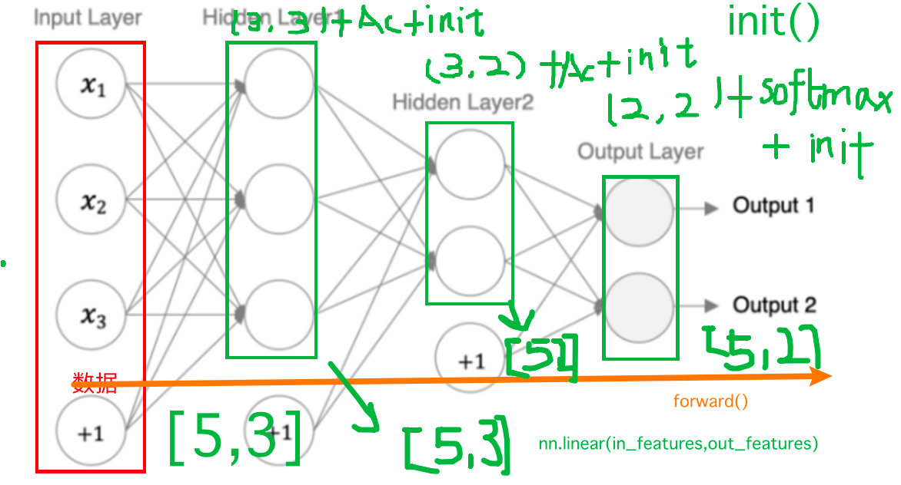

```python
import torch
import torch.nn as nn
from torchsummary import summary


class Model(nn.Module):
    """
    一个简单的三层全连接神经网络：
    输入层(3) → 隐藏层1(3, sigmoid) → 隐藏层2(2, relu) → 输出层(2, softmax)
    """

    def __init__(self):
        """
        初始化网络层和权重参数
        """
        super().__init__()

        # 隐藏层1：3 → 3，激活函数 sigmoid
        self.layer1 = nn.Linear(in_features=3, out_features=3)
        nn.init.kaiming_normal_(self.layer1.weight)  
        nn.init.zeros_(self.layer1.bias)  # 偏置通常初始化为0

        # 隐藏层2：3 → 2，激活函数 relu
        self.layer2 = nn.Linear(in_features=3, out_features=2)
        nn.init.xavier_uniform_(self.layer2.weight)  # Xavier适用于sigmoid/tanh
        nn.init.zeros_(self.layer2.bias)  # 统一偏置初始化

        # 输出层：2 → 2，激活函数 softmax（二分类）
        self.out = nn.Linear(in_features=2, out_features=2)
        nn.init.xavier_uniform_(self.out.weight)  # 修正：保ß
        nn.init.zeros_(self.out.bias)

    def forward(self, x):
        """
        前向传播逻辑
        :param x: 输入张量，形状 [batch_size, 3]
        :return: 输出张量，形状 [batch_size, 2]
        """
        # 隐藏层1：线性变换 + sigmoid
        x = torch.sigmoid(self.layer1(x))

        # 隐藏层2：线性变换 + ReLU
        x = torch.relu(self.layer2(x))

        # 输出层：线性变换 + softmax（沿最后一维归一化）
        x = torch.softmax(self.out(x), dim=-1)

        return x


if __name__ == "__main__":
    # 实例化模型
    model = Model()

    # 测试输入：生成10个样本，每个样本3个特征
    x = torch.randn(10, 3)

    # 前向传播
    output = model(x)
    print("输出张量形状:", output.shape)  # 应输出 torch.Size([10, 2])

    # 打印模型结构和参数统计（batch_size=8，输入特征维度=3）
    summary(model, input_size=(3,), batch_size=8)

    # 打印所有参数名称和值
    for name, param in model.named_parameters():
        print(f"参数名称: {name}, 形状: {param.shape}, 值:\n{param.data}\n")
```

> 在你的代码中，`input_size=(3,)` 参数是传递给 torchsummary.summary() 函数的，用于指定模型输入的形状。
> 让我详细解释一下：
> input_size 参数告诉 summary() 函数模型期望的输入数据形状
> 在你的例子中，(3,) 表示每个样本有3个特征
> 为什么是 (3,) 而不是 [10, 3]：
> input_size 只需要指定单个样本的形状，不包括批量大小
> 你的测试数据 x = torch.randn(10,3) 中，10是批量大小，3是每个样本的特征数
> 所以 input_size 设置为 (3,)，表示每个样本有3个特征
> 工作原理：
> summary() 函数使用这个 input_size 创建一个测试输入张量，然后通过模型前向传播，记录每一层的输出形状和参数数量。最终生成模型结构的详细摘要
> 在你的模型中：
> 输入层 layer1 接收形状为 (3,) 的输入，输出形状为 (3,)
> 中间层 layer2 接收形状为 (3,) 的输入，输出形状为 (2,)
> 输出层 out 接收形状为 (2,) 的输入，输出形状为 (2,)
> 这与你在 summary() 输出中看到的每层输出形状 [8, 3]、[8, 2]、[8, 2] 一致（其中8是 batch_size 参数指定的批量大小）。


### 1.6 神经网络优缺点

**优点**

- 精度高：在多数任务上超越传统方法，甚至人类
- 通用性强：可逼近任意非线性函数
- 生态成熟：框架、库、教程、社区极其丰富

**缺点**

- 黑箱特性：难以解释内部机制
- 训练成本高：耗时、耗算力
- 调参复杂：网络结构 + 超参数需精细调整
- 数据饥渴：小数据集易过拟合


## 2、损失函数

在深度学习中，**损失函数**用来衡量模型参数的质量，其方式是**比较网络输出与真实输出的差异**。


### 2.1 多分类任务损失函数：Softmax + 交叉熵

#### 1. **公式**

给定 **one-hot** 标签 $y$ 和 logits $f(x)$，Softmax 交叉熵损失为：

$$
L = -\sum_{i=1}^{n} y_i \log\!\Bigl(S\bigl(f(x_i)\bigr)\Bigr)
$$

- $S$：Softmax 激活函数  
- $y$：真实概率分布（one-hot）  
- $f(x)$：模型输出的 logits / score分数


#### 2. 概率角度理解

最小化「正确类别」对应的预测概率的负对数：

$$
\text{Loss} = -\log(\text{正确类别的概率})
$$
**示例**

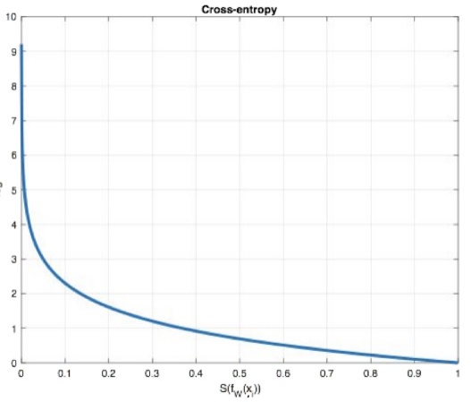

| 正确类别概率 | 损失              |
| ------------ | ----------------- |
| 0.7          | -log(0.7) ≈ 0.357 |


#### 3. PyTorch 实现：`nn.CrossEntropyLoss`

```python
import torch
import torch.nn as nn

# 真实标签（类别索引，int64），可以是热编码后的结果也可以不进行热编码
y_true = torch.tensor([1, 2], dtype=torch.int64)
# y_true = torch.tensor([[0, 1, 0], [0, 0, 1]], dtype=torch.float32)

# 模型输出的 logits（未经过 Softmax）
y_pred = torch.tensor([[0.2, 0.6, 0.2],
                       [0.1, 0.8, 0.1]], dtype=torch.float32)

# 实例化损失函数
loss_fn = nn.CrossEntropyLoss()

# 计算损失
loss = loss_fn(y_pred, y_true)
print("Loss:", loss.item())
```

> 注意：`nn.CrossEntropyLoss` 内部已包含 Softmax，所以在前向传播的时候，主要不要重复使用Softmax。


### 2.2 二分类任务损失函数：Sigmoid + 交叉熵

#### 1. 公式

使用 **Sigmoid** 将输出转为概率 $\hat{y}$，二分类交叉熵损失为：

$$
L = -y \log \hat{y} - (1 - y) \log(1 - \hat{y})
$$

- $y$：真实标签（0 或 1）
- $\hat{y}$：Sigmoid 输出的预测概率


#### 2. PyTorch 实现：`nn.BCELoss`

```python
import torch
import torch.nn as nn

# 真实标签
y_true = torch.tensor([0, 1, 0, 1], dtype=torch.float32)

# Sigmoid 输出的预测概率
y_pred = torch.tensor([0.1, 0.9, 0.2, 0.8], dtype=torch.float32)

# 实例化损失函数
loss_fn = nn.BCELoss()

# 计算损失
loss = loss_fn(y_pred, y_true).item()
print("Loss:", loss)
```

> 注意：`BCELoss` 要求输入已经是 Sigmoid 后的概率。


| 任务类型 | 激活函数 | 损失函数             | PyTorch 类            |
| -------- | -------- | -------------------- | --------------------- |
| 多分类   | Softmax  | Cross-Entropy        | `nn.CrossEntropyLoss` |
| 二分类   | Sigmoid  | Binary Cross-Entropy | `nn.BCELoss`          |


**CrossEntropyLoss中，y_pred用float32，y_true用long（int64）**

CrossEntropyLoss的工作原理：

```python
# 内部计算过程（简化版）
log_probs = log_softmax(y_pred)  # 对预测值应用log_softmax
# 使用y_true作为索引选择对应类别的log概率
selected_log_probs = log_probs[range(len(y_true)), y_true]  # y_true必须是整数索引
loss = -selected_log_probs.mean()
```

由于需要使用y_true作为数组索引，所以它必须是整数类型（long）。

而如果使用one-hot编码，y_true参与计算，就和下面一样，需要使用float32


**BCELoss中，y_pred和y_true都用float32**

BCELoss的数学公式为：

```python
loss = -[y * log(p) + (1-y) * log(1-p)]
```

其中：

- y 是真实标签（0或1）
- p 是预测概率（0到1之间）
- 在数学计算中，y和p需要进行算术运算（乘法、加法等），为了保证计算的精度和一致性，PyTorch要求两者都是float类型。

PyTorch在底层实现时，需要对输入进行数值计算。如果y_true是int类型而y_pred是float类型，就需要进行类型转换，这会增加额外的计算开销。直接要求两者都是float类型可以避免这种类型转换。


### 2.3 回归损失

#### 1. MAE

| 名称         | 别名    | 公式                                                         | PyTorch 接口  |
| ------------ | ------- | ------------------------------------------------------------ | ------------- |
| 平均绝对误差 | L1 Loss | $\text{MAE}(y, \hat y) = \frac{1}{n}\sum_{i=1}^n|y_i - \hat y_i| $ | `nn.L1Loss()` |

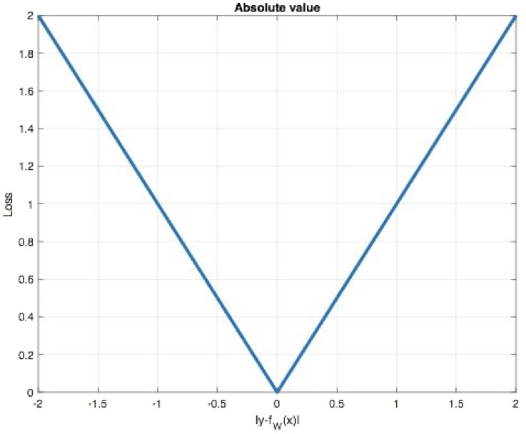

**特点：**

- **稀疏性**：由于 L1 范数天然具有稀疏特性，常被当作正则项加入其他损失函数。
- **梯度不光滑**：在原点不可导，导致优化时可能“跳过”极小值。

```python
import torch.nn as nn

y_pred = torch.tensor([1.0, 1.0, 1.9], dtype=torch.float32)
y_true = torch.tensor([2.0, 2.0, 2.0], dtype=torch.float32)

loss = nn.L1Loss()
my_loss = loss(y_pred, y_true).numpy()
print("MAE:", my_loss)          # 输出: 0.3667
```


#### 2. MSE

| 名称     | 别名    | 公式                                                         | PyTorch 接口   |
| -------- | ------- | ------------------------------------------------------------ | -------------- |
| 均方误差 | L2 Loss | $\displaystyle \text{MSE} = \frac{1}{n}\sum_{i=1}^{n}(y_i - f_\theta(x_i))^2$ | `nn.MSELoss()` |

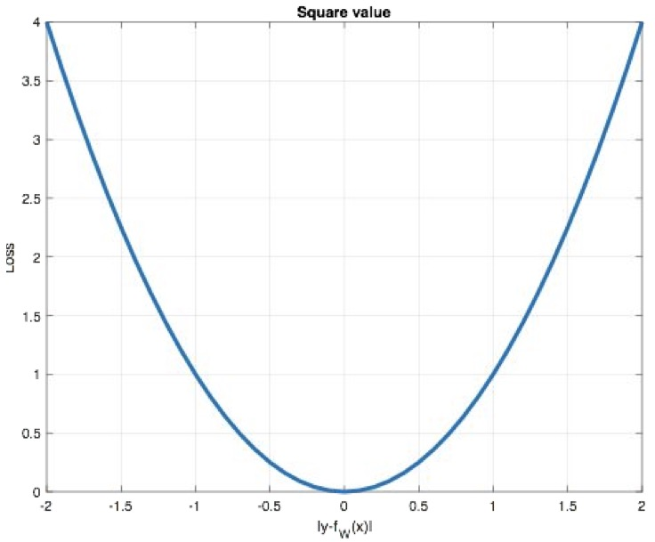

**特点：**

- **正则化应用：**L2 loss 常作为正则化项（如Ridge回归中的权重惩罚项）。
- **梯度爆炸风险：**当预测值与目标值差异过大时，平方误差会导致梯度急剧增大（梯度爆炸）。

```python
y_pred = torch.tensor([1.0, 1.0, 1.9], dtype=torch.float32)
y_true = torch.tensor([2.0, 2.0, 2.0], dtype=torch.float32)

loss = nn.MSELoss()
my_loss = loss(y_pred, y_true).numpy()
print("MSE:", my_loss)          # 输出: 0.1367
```


#### 3. Smooth L1 Loss

| 名称           | 别名         | 公式                                                         | PyTorch 接口        |
| -------------- | ------------ | ------------------------------------------------------------ | ------------------- |
| Smooth L1 Loss | 光滑 L1 损失 | $\text{Smooth}_{L_1}(x) =  \begin{cases} 0.5 x^2 & \text{if } |x| < 1 \\ |x| - 0.5 & \text{otherwise} \end{cases}$ | `nn.SmoothL1Loss()` |

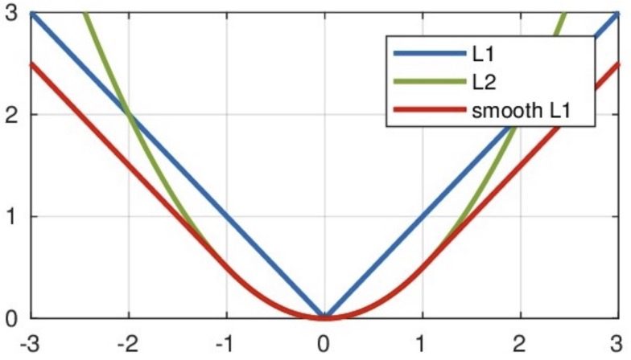

**特点：**

- **区间 $[-1,1]$**：  退化为 L2 损失（二次函数），解决 L1 在零点不可导的不光滑问题。
- **区间外**：  退化为 L1 损失（线性函数），抑制离群点带来的梯度爆炸风险。

```python
y_pred = torch.tensor([0.6, 0.4], dtype=torch.float32)
y_true = torch.tensor([0.0, 3.0], dtype=torch.float32)

loss = nn.SmoothL1Loss()
my_loss = loss(y_pred, y_true).numpy()
print("Smooth L1:", my_loss)    # 输出: 1.55
```


#### 4. 快速对比

| 指标           | MAE (L1) | MSE (L2) | Smooth L1 |
| -------------- | -------- | -------- | --------- |
| 对异常值敏感度 | 中等     | 高       | 低        |
| 零点可导性     | ❌        | ✅        | ✅         |
| 梯度爆炸风险   | 低       | 高       | 低        |


## 3、网络优化方法

### 3.1 梯度下降算法回顾

#### 1. 核心思想

梯度下降法是通过迭代调整网络参数，使损失函数最小化的优化方法。

- **梯度方向**：函数增长最快的方向
- **负梯度方向**：函数减少最快的方向
- **参数更新公式**：

$$
W_{\mathrm{new}} = W_{\mathrm{old}} - \eta \cdot \frac{\partial J}{\partial W}
$$

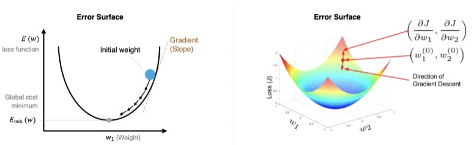

> **学习率 η 的选择**
>
> - 太小：训练缓慢
> - 太大：可能跳过最优解，进入无限的训练中。解决的方法就是，<font color='red'>**学习率也需要随着训练的进行而变化**</font>。


#### 2. 训练过程中的关键概念

| **术语**       | **定义**                            |
| -------------- | ----------------------------------- |
| **Epoch**      | 使用全部数据对模型进行一次完整训练  |
| **Batch Size** | 每次训练使用的样本数量              |
| **Iteration**  | 使用一个 Batch 数据进行一次参数更新 |

**示例**：

- 数据集大小：50000
- Batch Size：256
- 每个 Epoch 的 Iteration 数量：⌈50000/256⌉=196

> 注：上述示例中， Iteration 个数为 N / B + 1 是针对未整除的情况。整除则是 N / B。


#### 3. 梯度下降的三种方式

| **方式**                       | **Batch Size** | **特点**         |
| ------------------------------ | -------------- | ---------------- |
| 批量梯度下降 (Batch GD)        | 全部数据       | 稳定，但计算量大 |
| 随机梯度下降 (SGD)             | 1              | 更新频繁，震荡大 |
| 小批量梯度下降 (Mini-Batch GD) | \[1, N)        | 折中方案，最常用 |


### 3.2 反向传播算法

#### 1. 前向传播

数据从输入层逐层传递到输出层，计算预测值。

#### 2. 反向传播

利用损失函数，从后往前计算各参数的梯度，并更新参数。

#### **3. 案例**

**反向传播对神经网络中的各个节点的权重进行更新**。一个简单的神经网络用来举例：激活函数为sigmoid

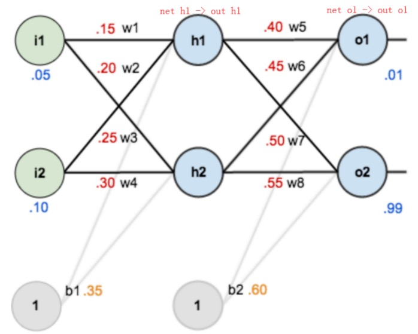


> #### 1. **神经网络结构**
> - **输入层**：两个输入节点 $i_1$ 和 $i_2$（假设输入值为 $i_1 = 0.05$，$i_2 = 0.1$）。
> - **隐藏层**：两个节点 $h_1$ 和 $h_2$，激活函数为 Sigmoid。
>   - 权重：$w_1 = 0.15$，$w_2 = 0.2$（$h_1$ 的输入权重）；$w_3 = 0.25$，$w_4 = 0.3$（$h_2$ 的输入权重）。
>   - 偏置：$b_1 = 0.35$。
> - **输出层**：两个节点 $o_1$ 和 $o_2$，激活函数为 Sigmoid。
>   - 权重：$w_5 = 0.4$，$w_6 = 0.45$（$o_1$ 的输入权重）；$w_7 = 0.5$，$w_8 = 0.55$（$o_2$ 的输入权重）。
>   - 偏置：$b_2 = 0.6$。
>   - 目标值：$target_{o1} = 0.01$，$target_{o2} = 0.99$。
>
> #### 2. **前向传播过程**
> - **隐藏层计算**：
>   $$
>   net_{h1} = w_1 \cdot i_1 + w_2 \cdot i_2 + b_1 = 0.15 \cdot 0.05 + 0.2 \cdot 0.1 + 0.35 = 0.3775
>   $$
>   $$
>   out_{h1} = \frac{1}{1 + e^{-net_{h1}}} = 0.593269992
>   $$
>   $$
>   out_{h2} = 0.596884378 \quad \text{（类似计算）}
>   $$
> - **输出层计算**：
>   $$
>   net_{o1} = w_5 \cdot out_{h1} + w_6 \cdot out_{h2} + b_2 = 0.4 \cdot 0.593269992 + 0.45 \cdot 0.596884378 + 0.6 = 1.105905967
>   $$
>   $$
>   out_{o1} = \frac{1}{1 + e^{-net_{o1}}} = 0.75136507
>   $$
>   $$
>   out_{o2} = 0.772928465 \quad \text{（类似计算）}
>   $$
> - **总误差计算**：
>   $$
>   E_{total} = \sum \frac{1}{2}(target - output)^2 = E_{o1} + E_{o2} = 0.274811083 + 0.023560026 = 0.298371109
>   $$
>
> #### 3. **反向传播过程**
> - **目标**：通过链式法则计算误差对各权重的偏导，并更新权重。
> - **学习率**：$\eta = 0.5$。
>
> ##### (1) 更新输出层权重 $w_5$：
> $$
> \frac{\partial E_{total}}{\partial w_5} = \frac{\partial E_{total}}{\partial out_{o1}} \cdot \frac{\partial out_{o1}}{\partial net_{o1}} \cdot \frac{\partial net_{o1}}{\partial w_5}
> $$
> - 计算各部分：
>   $$
>   \frac{\partial E_{total}}{\partial out_{o1}} = -(target_{o1} - out_{o1}) = 0.74136507
>   $$
>   $$
>   \frac{\partial out_{o1}}{\partial net_{o1}} = out_{o1}(1 - out_{o1}) = 0.186815602
>   $$
>   $$
>   \frac{\partial net_{o1}}{\partial w_5} = out_{h1} = 0.593269992
>   $$
> - 最终偏导：
>   $$
>   \frac{\partial E_{total}}{\partial w_5} = 0.74136507 \cdot 0.186815602 \cdot 0.593269992 = 0.082167041
>   $$
> - 权重更新：
>   $$
>   w_5^+ = w_5 - \eta \cdot \frac{\partial E_{total}}{\partial w_5} = 0.4 - 0.5 \cdot 0.082167041 = 0.35891648
>   $$
>
> ##### (2) 更新隐藏层权重 $w_1$：
> $$
> \frac{\partial E_{total}}{\partial w_1} = \left( \sum_{o} \frac{\partial E_{total}}{\partial out_{o}} \cdot \frac{\partial out_{o}}{\partial net_{o}} \cdot \frac{\partial net_{o}}{\partial out_{h1}} \right) \cdot \frac{\partial out_{h1}}{\partial net_{h1}} \cdot \frac{\partial net_{h1}}{\partial w_1}
> $$
> - 计算各部分：
>   - 对于 $o_1$：
>     $$
>     \frac{\partial net_{o1}}{\partial out_{h1}} = w_5 = 0.4
>     $$
>   - 对于 $o_2$：
>     $$
>     \frac{\partial net_{o2}}{\partial out_{h1}} = w_7 = 0.5
>     $$
>   - 其他项类似 $w_5$ 的计算。
> - 最终偏导：
>   $$
>   \frac{\partial E_{total}}{\partial w_1} = 0.000438568
>   $$
> - 权重更新：
>   $$
>   w_1^+ = w_1 - \eta \cdot \frac{\partial E_{total}}{\partial w_1} = 0.15 - 0.5 \cdot 0.000438568 = 0.149780716
>   $$
>
> #### 4. **关键公式总结**
> - **Sigmoid 导数**：
>   $$
>   \frac{\partial out}{\partial net} = out(1 - out)
>   $$
> - **输出层权重更新**：
>   $$
>   \frac{\partial E}{\partial w_j} = -(target - out) \cdot out(1 - out) \cdot out_{h}
>   $$
> - **隐藏层权重更新**：
>   $$
>   \frac{\partial E}{\partial w_i} = \left( \sum \frac{\partial E}{\partial out_{o}} \cdot \frac{\partial out_{o}}{\partial net_{o}} \cdot w_{o \to h} \right) \cdot out_{h}(1 - out_{h}) \cdot input_i
>   $$
>
> #### 5. **注意事项**
> - 反向传播需从输出层逐层向前计算。
> - 对于隐藏层，误差需累加所有输出节点的影响。
> - 学习率 $\eta$ 的选择影响收敛速度和稳定性。
>
> 通过以上步骤，可以逐步更新神经网络的所有权重，使误差逐渐减小。


### 3.3 梯度下降优化方法

#### 1. 问题背景

梯度下降算法在训练神经网络时，常会遇到以下问题：

| 问题类型       | 描述说明                            | 图示特征        |
| -------------- | ----------------------------------- | --------------- |
| **平缓区域**   | 梯度值很小，参数更新缓慢            | 曲线平缓        |
| **鞍点**       | 梯度为0，但不是极值点，参数无法优化 | 梯度为0但非极值 |
| **局部最小值** | 陷入局部最优，无法跳出              | 局部谷底        |

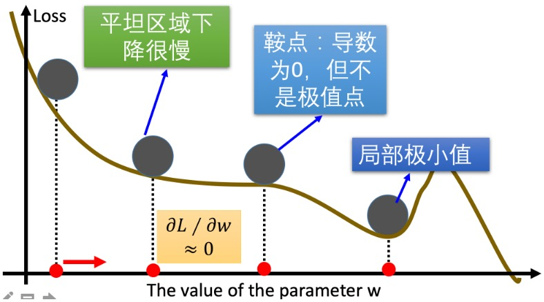

> 对于这些问题, 出现了一些对梯度下降算法的优化方法，例如：Momentum、AdaGrad、RMSprop、Adam 等
>


#### 2.  优化方法总览

| 优化方法     | 核心思想                       | 解决问题       |
| ------------ | ------------------------------ | -------------- |
| **Momentum** | 引入动量，使用指数加权平均梯度 | 平缓、鞍点     |
| **AdaGrad**  | 自适应学习率，按参数维度调整   | 梯度稀疏       |
| **RMSProp**  | 改进AdaGrad，使用指数加权平均  | 学习率过快衰减 |
| **Adam**     | 结合Momentum与RMSProp的优点    | 综合性能最优   |


#### 3. 指数加权平均（Exponential Weighted Average）

**✅ 概念说明**

指数加权平均是一种对历史数据加权平均的方法，**越近的数据权重越高**，越远的数据权重越低。

**✅ 数学公式**
$$
S_t = 
\begin{cases}
Y_1, & t=0 \\
\beta \cdot S_{t-1} + (1-\beta) \cdot Y_t, & t>0
\end{cases}
$$


- $S_t$：t时刻的指数加权平均值
- $Y_t$：t时刻的实际值
- $β$：平滑系数（0 < β < 1），越大越平滑

✅ 示例代码（PyTorch）

```python
import torch
import matplotlib.pyplot as plt

torch.manual_seed(0)
ELEMENT_NUMBER = 30
temperature = torch.randn(ELEMENT_NUMBER) * 10

def exponential_weighted_average(beta=0.9):
    exp_avg = []
    for idx, temp in enumerate(temperature, 1):
        if idx == 1:
            exp_avg.append(temp)
        else:
            new_temp = exp_avg[-1] * beta + (1 - beta) * temp
            exp_avg.append(new_temp)
    return exp_avg

plt.plot(range(1, 31), temperature, label='Original', color='red')
plt.plot(range(1, 31), exponential_weighted_average(0.9), label='EWA β=0.9', color='blue')
plt.scatter(range(1, 31), temperature)
plt.legend()
plt.show()
```


### 3.4 动量法（Momentum）

**✅ 核心思想**

使用**指数加权平均梯度**替代当前梯度，减少震荡，加速收敛，缓解鞍点停滞问题。

**✅ 动量梯度计算公式：**
$$
\begin{align*}
D_t &= \beta \cdot D_{t-1} + (1-\beta) \cdot  w_t \\\\
\end{align*}
$$

| 符号      | 含义说明                               |
| --------- | -------------------------------------- |
| $D_t$     | 当前时刻的**动量梯度**（指数加权平均） |
| $D_{t-1}$ | 上一时刻的历史梯度加权平均值           |
| $w_t$     | 当前时刻的实际梯度值                   |
| $\beta$   | 动量系数（通常设为 0.9）               |

**✅ 参数更新公式：**
$$
\begin{align*}
w_{t+1} &= w_t - \alpha \cdot D_t
\end{align*}
$$

- $α$：学习率（learning rate）
- $D_t$：动量梯度（而非原始梯度）


**✅动量算法优势**

**克服鞍点停滞**

> **当处于鞍点时，当前梯度为 0，普通梯度下降无法更新参数。**

- **动量算法**利用**历史梯度积累**的动量继续更新参数，从而**跳出鞍点**。

```tex
📌 举例：
当前梯度 = 0（鞍点）
但历史动量 ≠ 0 → 参数继续更新 → 有机会跳出鞍点
```


**减少梯度震荡**

> **普通梯度下降（SGD）使用 mini-batch，每次选取少数的样本梯度确定前进方向，梯度方向不稳定，导致训练震荡。使得训练时间编长**

- **动量算法**通过**指数加权平均**平滑梯度变化，使更新方向更加稳定，**减少震荡**。

```tex
📌 举例：
SGD方向：← → ← → ← →（震荡）
Momentum方向：→ → → →（平滑）
```

| 问题场景     | 动量算法作用         | 机制说明             |
| ------------ | -------------------- | -------------------- |
| **鞍点停滞** | 利用历史动量继续更新 | 指数加权平均积累动量 |
| **梯度震荡** | 平滑更新方向         | 减少 mini-batch 波动 |
| **收敛缓慢** | 加速收敛             | 动量持续推动参数前进 |


✅ **示例代码（PyTorch）**

```python
w = torch.tensor([1.0], requires_grad=True)
optimizer = torch.optim.SGD([w], lr=0.01, momentum=0.9)

for step in range(2):
    optimizer.zero_grad()
    y = ((w ** 2) / 2.0).sum()
    y.backward()
    optimizer.step()
    print(f"第{step+1}次：梯度={w.grad.item():.6f}, 权重={w.detach().item():.6f}")
```


### 3.5 AdaGrad

✅ 核心思想


AdaGrad 为不同参数分量自适应调整学习率——**梯度大的维度学习率小，梯度小的学习率大**；整体学习率随训练逐渐减小。

✅ 更新公式

| 步骤 | 操作内容                                                     |
| ---- | ------------------------------------------------------------ |
| 1    | **初始化**：学习率 `α`、参数 `θ`、极小常数 `ε = 1e-6`        |
| 2    | **初始化**：梯度累积变量 `s = 0`                             |
| 3    | **采样小批量**：从训练集采样 `m` 个样本，计算梯度 `g`        |
| 4    | **累积平方梯度**：`s = s + g ⊙ g`（`⊙` 为逐元素乘）          |
| 5    | **自适应学习率**：$\alpha = \frac{\alpha}{\sqrt{s} + \sigma}$ |
| 6    | **参数更新**：$\theta = \theta - \frac{\alpha}{\sqrt{s }+ \sigma} \cdot g$ |
| 7    | **重复**：回到步骤 3 继续训练                                |

⚠️ 缺点：

> 学习率可能过早衰减为0，导致后期训练停滞，难以收敛到最优解。

✅ 优点：

> 一句话总结：AdaGrad 在**高维稀疏场景**下，用极小的实现代价实现了**“每个参数一个学习率”**的效果，显著减轻了调参负担并加快了早期收敛。

```python
import torch

def test02():
    # 1. 初始化参数
    w = torch.tensor([1.0], requires_grad=True, dtype=torch.float32)
    y = ((w ** 2) / 2.0).sum()

    # 2. 实例化 AdaGrad 优化器
    optimizer = torch.optim.Adagrad([w], lr=0.01)

    # 3. 第一次更新
    optimizer.zero_grad()
    y.backward()
    optimizer.step()
    print(f"第1次：梯度 w.grad = {w.grad.numpy():.6f}, 更新后的权重 = {w.detach().numpy()[0]:.6f}")

    # 4. 第二次更新
    y = ((w ** 2) / 2.0).sum()
    optimizer.zero_grad()
    y.backward()
    optimizer.step()
    print(f"第2次：梯度 w.grad = {w.grad.numpy():.6f}, 更新后的权重 = {w.detach().numpy()[0]:.6f}")

test02()
```

> **AdaGrad 为什么在高维稀疏场景下表现好：**
>
> ✅ 对**频繁特征**（如常见词）：
>
> - 历史梯度平方和 *G**t*[*i*] 累积很快
> - 学习率 *G**t*[*i*]*η* 快速下降
> - → 避免因频繁更新导致震荡或过调（over-correction）
>
> ✅ 对**稀疏特征**（如罕见词）：
>
> - 历史梯度平方和 *G**t*[*i*] 很小（因为很少更新）
> - 学习率保持较大
> - → 即使只出现一次，也能获得较大幅度的更新，**更容易被学习到**
>
> 🎯 这种“**对稀疏特征更友好**”的机制，正是 AdaGrad 在高维稀疏场景中表现突出的核心原因。


### 3.6 RMSProp

✅ 核心思想

RMSProp 在 AdaGrad 基础上引入**指数加权移动平均（EMA）**，用 **β·s + (1-β)·g²** 替代 AdaGrad 的“累加平方梯度”，从而避免学习率过早衰减。

✅ 更新公式

| 步骤 | 操作内容                                                     |
| ---- | ------------------------------------------------------------ |
| 1    | **初始化**：学习率 `α`、参数 `θ`、极小常数 `ε = 1e-6`        |
| 2    | **初始化**：梯度累积变量 `s = 0`                             |
| 3    | **采样小批量**：从训练集采样 `m` 个样本，计算梯度 `g`        |
| 4    | **指数加权平均**：`s = β·s + (1-β)·g ⊙ g`                    |
| 5    | **自适应学习率**：$\alpha = \frac{\alpha}{\sqrt{s} + \sigma}$ |
| 6    | **参数更新**：$\theta = \theta - \frac{\alpha}{\sqrt{s} + \sigma} \cdot g$ |
| 7    | **重复**：回到步骤 3                                         |

```python
import torch

def test03():
    # 1. 初始化参数
    w = torch.tensor([1.0], requires_grad=True, dtype=torch.float32)
    y = ((w ** 2) / 2.0).sum()

    # 2. 实例化 RMSProp 优化器
    # alpha 对应论文中的 β（动量系数）
    optimizer = torch.optim.RMSprop([w], lr=0.01, alpha=0.9)

    # 3. 第一次更新
    optimizer.zero_grad()
    y.backward()
    optimizer.step()
    print(f"第1次：梯度 w.grad = {w.grad.numpy()[0]:.6f}, 更新后的权重 = {w.detach().numpy()[0]:.6f}")

    # 4. 第二次更新
    y = ((w ** 2) / 2.0).sum()
    optimizer.zero_grad()
    y.backward()
    optimizer.step()
    print(f"第2次：梯度 w.grad = {w.grad.numpy()[0]:.6f}, 更新后的权重 = {w.detach().numpy()[0]:.6f}")

test03()
```

| 对比维度   | AdaGrad                | RMSProp                    |
| ---------- | ---------------------- | -------------------------- |
| 累积方式   | 累加所有历史平方梯度   | 指数加权平均               |
| 学习率趋势 | 单调递减，可能过早衰减 | 可自适应回升，避免过早衰减 |
| 适用场景   | 稀疏数据（早期有效）   | 非稀疏/稠密数据（更通用）  |
| 超参数     | `α`, `ε`               | `α`, `β`, `ε`（多一个 β）  |


### 3.7 Adam

✅ 核心思想

结合 **Momentum**（动量） 和 **RMSProp**（自适应学习率），是目前最常用、效果最好的优化器。

✅ 更新公式（简化版）

| 符号                  | 含义                                             |
| --------------------- | ------------------------------------------------ |
| $g_t$                 | 当前 mini-batch 算出的原始梯度                   |
| $m_t$                 | 一阶动量（梯度的指数加权平均，Momentum 思想）    |
| $v_t$                 | 二阶动量（梯度平方的指数加权平均，RMSProp 思想） |
| $\hat m_t,\ \hat v_t$ | 偏差修正后的一阶、二阶动量                       |
| $\alpha$              | 全局学习率                                       |
| $\varepsilon$         | 极小常数（防除 0，一般 1e-8）                    |

1️⃣ 计算一阶动量（Momentum）
$$
m_t = \beta_1 m_{t-1} + (1-\beta_1)\,g_t
$$


> 把历史梯度与当前梯度做加权平均，得到「平滑后的梯度方向」，减少震荡。


2️⃣ 计算二阶动量（RMSProp）
$$
v_t = \beta_2 v_{t-1} + (1-\beta_2)\,g_t^{2}
$$


> 把历史梯度平方与当前梯度平方做加权平均，得到「各维度梯度的量级估计」，用来自适应调整学习率：
> 梯度大的方向步长自动变小，梯度小的方向步长自动变大。


3️⃣ 偏差修正（Bias Correction）
$$
\hat m_t = \frac{m_t}{1-\beta_1^{\,t}}, \quad
\hat v_t = \frac{v_t}{1-\beta_2^{\,t}}
$$


> 刚开始训练时 *m*,*v* 都偏向 0，需要把估计值放大来抵消冷启动偏差。
> 训练多步后 $β_t$→0，修正几乎不起作用。


4️⃣ 参数更新
$$
w_{t+1} = w_t - \frac{\alpha} {\sqrt{\hat v_t} + \varepsilon} \hat m_t
$$


> 用「修正后的一阶动量」作为方向，用「修正后的二阶动量」作为步长缩放，完成一步更新。


✅ 一句话总结

Adam = **Momentum**（平滑梯度方向） + **RMSProp**（自适应学习率） + **Bias Correction**（冷启动修正）。

✅ 小结：Adam 的优势

| 优点维度         | 说明                                        |
| ---------------- | ------------------------------------------- |
| **自适应学习率** | 每个参数独立调整学习率，无需人工精细调参    |
| **动量加速**     | 利用一阶动量抑制震荡，加速收敛              |
| **偏差修正**     | 训练初期自动修正动量偏差，更稳健            |
| **通用性强**     | 适用于大多数深度学习任务（CV、NLP、语音等） |

> 结论：Adam 是目前最常用的“开箱即用”优化器之一，在中小规模数据和中等规模模型上表现尤为出色。


```python
import torch

def test04():
    # 1. 初始化参数
    w = torch.tensor([1.0], requires_grad=True)
    y = ((w ** 2) / 2.0).sum()

    # 2. 实例化 Adam 优化器
    optimizer = torch.optim.Adam([w], lr=0.01, betas=(0.9, 0.99))

    # 3. 第一次更新
    optimizer.zero_grad()
    y.backward()
    optimizer.step()
    print(f"第1次：梯度 w.grad = {w.grad.numpy()[0]:.6f}, 更新后的权重 = {w.detach().numpy()[0]:.6f}")

    # 4. 第二次更新
    y = ((w ** 2) / 2.0).sum()
    optimizer.zero_grad()
    y.backward()
    optimizer.step()
    print(f"第2次：梯度 w.grad = {w.grad.numpy()[0]:.6f}, 更新后的权重 = {w.detach().numpy()[0]:.6f}")

test04()
```


### 3.8 学习率衰减

#### 1. 学习率衰减策略速查表

| 策略         | 触发方式            | 数学形式                | PyTorch API                                 | 关键参数说明                  |
| ------------ | ------------------- | ----------------------- | ------------------------------------------- | ----------------------------- |
| 等间隔衰减   | 每 N 个 epoch       | `lr = lr * gamma`       | `StepLR(optimizer, step_size, gamma)`       | `step_size` 为固定间隔        |
| 指定间隔衰减 | 仅在给定 epoch 列表 | `lr = lr * gamma`       | `MultiStepLR(optimizer, milestones, gamma)` | `milestones` 为可变间隔列表   |
| 指数衰减     | 每个 epoch 都执行   | `lr = lr * gamma^epoch` | `ExponentialLR(optimizer, gamma)`           | `gamma` 为指数底（<1 则衰减） |


#### 2. 示例

```python
import torch
import matplotlib.pyplot as plt

# 初始化参数
lr0 = 0.1          # 初始学习率
iter = 100         # 每个epoch的迭代次数
epoches = 200      # 总训练轮数

# 创建训练数据
x = torch.tensor([1.0])
w = torch.tensor([1.0], requires_grad=True)  # 需要计算梯度的权重参数
y = torch.tensor([1.0])

# 定义优化器和学习率调度器
optimizer = torch.optim.SGD([w], lr=lr0, momentum=0.9)
# scheduler = torch.optim.lr_scheduler.StepLR(optimizer, step_size=50, gamma=0.8)
# scheduler_lr=torch.optim.lr_scheduler.MultiStepLR(optimizer,milestones=[20,60,90,135,180],gamma=0.8)
scheduler_lr=torch.optim.lr_scheduler.ExponentialLR(optimizer,gamma=0.99)

# 用于记录学习率变化的列表
epoch_list, lr_list = [], []

# 训练循环
for epoch in range(epoches):
    # 记录当前学习率
    lr_list.append(scheduler.get_last_lr())
    epoch_list.append(epoch)
    
    # 每个epoch中的迭代
    for i in range(iter):
        # 前向传播计算损失
        loss = ((w * x - y) ** 2) * 0.5
        
        # 反向传播
        optimizer.zero_grad()
        loss.backward()
        optimizer.step()
    
    # 更新学习率
    scheduler.step()

# 绘制学习率变化曲线
plt.plot(epoch_list, lr_list)
plt.grid()
plt.show()
```


## 4、正则化

### 1️⃣ 正则化（Regularization）

- **目的**：缓解**过拟合**，提升模型在**新样本上的泛化能力**。
- **适用场景**：神经网络表示能力强，易过拟合。
- **常用策略**：
  - 范数惩罚（如L1、L2正则化）
  - Dropout（随机失活）
  - 特殊网络层（如BN层）


### 2️⃣ Dropout（随机失活）

- **原理**：训练时以概率 `p` 随机“关闭”神经元（激活置0），其余神经元输出按 `1/(1-p)` 缩放。

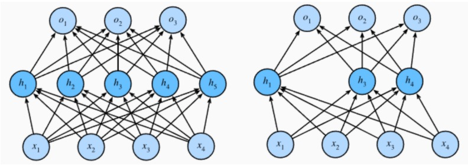

- **作用**：
  - 相当于每次训练一个子网络，减少神经元间的共适应，防止过拟合。
  - **测试时**：Dropout不生效，使用完整网络。

- **PyTorch 示例**：

```python
import torch
import torch.nn as nn

# 初始化Dropout层（失活概率p=0.4）
dropout = nn.Dropout(p=0.4)

# 输入数据（模拟某层权重）
inputs = torch.randint(0, 10, size=[1, 4]).float()

# 未失活的线性层输出
layer = nn.Linear(4, 5)
y = layer(inputs)
print("未失活输出:\n", y)
# 输出示例: tensor([[-0.8369, -5.5720, 0.2258, 3.4256, 2.1919]])

# 失活后的输出（部分激活变为0，其余按1/(1-0.4)缩放）
y_dropped = dropout(y)
print("失活后输出:\n", y_dropped)
# 输出示例: tensor([[-1.3949, -9.2866, 0.3763, 0.0000, 3.6531]])
```


### 3️⃣ 批量归一化（Batch Normalization, BN层）

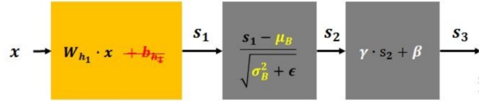

- **步骤**：

  1. **标准化**：对批次数据计算均值 `μ_B` 和方差 `Var(x)`，进行标准化。
  2. **重构**：通过可学习参数 `γ`（缩放）和 `β`（平移）恢复表达能力。

- **公式**：
  $$
  f(x) = \gamma \cdot \frac{X - \mu_{B}}{\sqrt{Var(x) + \epsilon}} + \beta
  $$
  

  - `ε`（epsilon）：避免除零，通常设为 `1e-5`。
  - $\gamma$ 是缩放参数，$\beta$ 是偏移参数，是可学习的参数，它相当于对标准化后的值做了一个**线性变换**
  - $\mu_{B}$ 是当前批次的均值
  - $Var(x)$ 是当前批次的方差

- **作用**：

  - 加速训练收敛，缓解梯度消失/爆炸。
  - 轻微正则化效果（因批次噪声）。

- **应用**：计算机视觉领域广泛使用（如CNN中），具体使用方法我们到后面在给大家进行介绍。


### 4️⃣ 总结速记

| **策略**    | **核心思想**               | **关键参数**       | **训练/测试差异**          |
| ----------- | -------------------------- | ------------------ | -------------------------- |
| **正则化**  | 限制模型复杂度，防止过拟合 | L1/L2系数          | 无差异                     |
| **Dropout** | 随机失活神经元             | 失活概率 `p`       | **训练时生效，测试时关闭** |
| **BN层**    | 标准化+重构批次数据        | `γ`, `β`（可学习） | **训练和测试统计量不同**   |

```tex
过拟合 ←→ 正则化策略 → 提升泛化能力
         ├── Dropout（随机失活）
         ├── BN层（标准化+重构）
         └── 范数惩罚（L1/L2）
```


## 5、案例

### 1. 项目背景

小明创办了一家手机公司，需估算二手手机的**价格区间**（而非实际价格）。为此收集了包含**20项功能特征**的二手手机销售数据，目标是通过深度学习建立**分类模型**。

### 2. 数据特征说明

| **类别**     | **特征名称**   | **含义**                 | **单位/类型**       |
| ------------ | -------------- | ------------------------ | ------------------- |
| **电池**     | battery\_power | 电池总能量               | 毫安时（mAh）       |
|              | talk\_time     | 单次充电最长通话时间     | 小时                |
| **网络**     | blue           | 是否支持蓝牙             | 布尔（0/1）         |
|              | four\_g        | 是否支持4G               | 布尔（0/1）         |
|              | three\_g       | 是否支持3G               | 布尔（0/1）         |
|              | wifi           | 是否支持Wi-Fi            | 布尔（0/1）         |
| **处理器**   | clock\_speed   | 微处理器主频             | GHz                 |
|              | n\_cores       | 处理器内核数             | 整数                |
| **存储**     | int\_memory    | 内部存储容量             | GB                  |
|              | ram            | 运行内存                 | MB                  |
| **摄像头**   | pc             | 主摄像头像素             | 百万像素（MP）      |
|              | fc             | 前置摄像头像素           | 百万像素（MP）      |
| **屏幕**     | px\_height     | 像素分辨率高度           | 像素                |
|              | px\_width      | 像素分辨率宽度           | 像素                |
|              | sc\_h          | 屏幕高度                 | cm                  |
|              | sc\_w          | 屏幕宽度                 | cm                  |
|              | touch\_screen  | 是否为触屏               | 布尔（0/1）         |
| **设计**     | dual\_sim      | 是否支持双卡             | 布尔（0/1）         |
|              | mobile\_wt     | 手机重量                 | 克（g）             |
|              | m\_dep         | 手机厚度                 | cm                  |
| **目标变量** | price\_range   | 价格区间（0低价至3高价） | 分类标签（0/1/2/3） |

### 3. 项目目标

通过深度学习解决**分类问题**：

> 输入手机功能特征 → 预测价格区间（0/1/2/3）


```python
import torch
from torch.utils.data import TensorDataset
from torch.utils.data import DataLoader
import torch.nn as nn
import torch.optim as optim
from sklearn.datasets import make_regression
from sklearn.model_selection import train_test_split
import matplotlib.pyplot as plt
import numpy as np
import pandas as pd
import time
from torchsummary import summary

# 1.数据集
def create_dataset():
    data = pd.read_csv('/Users/mac/Desktop/AI 17期深度学习/02.code/02-神经网络/data/手机价格预测.csv')
    x = data.iloc[:,:-1]
    y = data.iloc[:,-1]
    x = x.astype(np.float32)
    y = y.astype(np.int64)
    x_train,x_test,y_train,y_test=train_test_split(x,y,test_size=0.2)
    train_dataset=TensorDataset(torch.from_numpy(x_train.values),torch.from_numpy(y_train.values))
    valid_dataset=TensorDataset(torch.from_numpy(x_test.values),torch.from_numpy(y_test.values))
    return train_dataset,valid_dataset,x_train.shape,x_test.shape

# 2.模型
class Model(nn.Module):
    def __init__(self):
        super(Model, self).__init__()
        self.layer1 = nn.Linear(20,64)
        self.layer2 = nn.Linear(64,32)
        self.layer3 = nn.Linear(32,4)

    def forward(self,x):
        x1 =self.layer1(x)
        x1_s=torch.relu(x1)
        x2 = self.layer2(x1_s)
        x2_s = torch.relu(x2)
        out =self.layer3(x2_s)  # 一定不要加softmaxß
        return out


# 3.训练
def train():
    train_dataset, valid_dataset, train_shape, test_shape = create_dataset()
    model = Model()

    loss = nn.CrossEntropyLoss()

    opt = optim.SGD(model.parameters(),lr=0.001,momentum=0.9)

    for epoch in range(10):
        dataloader =DataLoader(train_dataset,shuffle=True,batch_size=16)
        loss_total = 0
        iter = 0
        for x,y in dataloader:
            pre =model(x)
            loss_values = loss(pre,y)
            loss_total += loss_values.item()
            iter+=1
            opt.zero_grad()
            loss_values.backward()
            opt.step()

        print(loss_total/(iter+0.01))


    torch.save(model.state_dict(),'/Users/mac/Desktop/AI 17期深度学习/02.code/02-神经网络/data/phone2.pth')


# 4.预测

def test():
    train_dataset, valid_dataset, train_shape, test_shape = create_dataset()
    model = Model()
    model.load_state_dict(torch.load('/Users/mac/Desktop/AI 17期深度学习/02.code/02-神经网络/data/phone2.pth'))

    dataloader =DataLoader(valid_dataset,batch_size=8,shuffle=False)

    c_num = 0
    for x,y in dataloader:
        out = model(x)
        y_pred =torch.argmax(out,dim=1)
        num = (y_pred==y).sum()
        c_num+=num

    print(c_num/len(valid_dataset))

if __name__ == '__main__':
    train_dataset,valid_dataset,train_shape,test_shape=create_dataset()
    # print(train_shape)
    # print(test_shape)

    # model = Model()
    # summary(model,input_size=(20,),batch_size=4,device='cpu')
    # train()
    test()
```

> 后续优化方向（训练已经达到96.5%准确率）：
>
> - 优化方法由 SGD 调整为 Adam
> - 调整训练轮次
> - 增加网络深度, 即: 增加网络参数量
> - 对数据数据进行标准化&学习率由 1e-3 调整为 1e-4？
