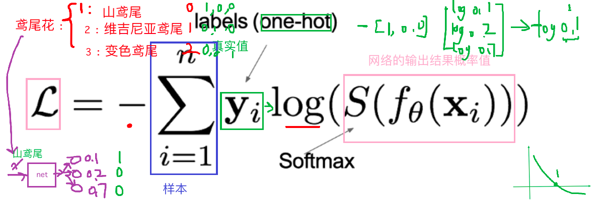

## 1、神经网络的构成

### 1.1 神经元

> 加权和+激活函数（激活函数为网络引入非线性，使其可逼近任意函数。）


### 1.2 神经网络


| 层级   | 作用         | 关键公式                                                     | 备注                 |
| ------ | ------------ | ------------------------------------------------------------ | -------------------- |
| 输入层 | 接收原始数据 | 数据                                                         | 维度需与特征数一致   |
| 隐藏层 | 特征抽象     | `激活(加权和)`                                               | 可有多层             |
| 输出层 | 给出预测     | 二分类：`sigmoid(z)`；多分类：`softmax(z)`；回归：`identity(z)` | 维度需与任务目标一致 |

- **特点**：
  - 同层神经元无连接
  - 全连接：相邻层两两相连
  - 第N-1层神经元的输出就是第N层神经元的输入。
  - 每个连接都有一个权重值（w系数和b系数）


### 1.3 激活函数

作用：对每层输出进行 **非线性变换**，使神经网络能拟合任意复杂曲线。

- **无激活函数** → 网络退化为 **单层线性模型**，只能拟合直线（平面）。

- **有激活函数** → 引入非线性，可逼近任意复杂函数，显著提升模型表达能力。

> 激活函数通过“非线性开关”让神经网络真正“深度”起来，否则再多层也只是线性组合。


#### 1. sigmoid激活函数 

**数学定义**

Sigmoid 激活函数的公式为：
$$
f(x) = \frac{1}{1 + e^{-x}}
$$
其导数公式为：
$$
f'(x) = f(x)(1 - f(x))
$$
sigmoid 激活函数的函数图像如下:


**特性分析**

- **输出范围**：将任意输入映射到 (0,1) 区间，概率值
- **敏感区间**：
  - 输入在 [-6, 6] 时输出有明显差异
  - 输入在 [-3, 3] 时效果最佳
- **梯度问题**：
  - 导数范围 (0, 0.25)
  - 当 |x| > 6 时，导数接近0，导致梯度消失
- **局限性**：
  - 通常5层内就会出现梯度消失
  - 不以0为中心
  - 实践中使用较少，一般仅用于二分类输出层

> **总结**
>
> Sigmoid 的梯度消失本质源于其导数的上限和连乘效应，而 5 层是一个经验阈值，超过后梯度衰减会显著影响训练。这一问题是推动 ReLU 等激活函数普及的关键原因之一。

```python
import torch
import matplotlib.pyplot as plt

# 函数图像
x = torch.linspace(-20,20,1000)
y = torch.sigmoid(x)

plt.plot(x,y)
plt.grid()
plt.show()

# 导函数图像
x = torch.linspace(-20,20,1000,requires_grad=True)
torch.sigmoid(x).sum().backward()  # 这里使用 sum() 是因为 backward() 只能对标量（单个数值）进行自动求导。torch.sigmoid(x) 返回的是一个向量（张量），不能直接调用 backward()。通过 .sum() 把所有元素加起来变成一个标量，这样才能进行反向传播，计算 x.grad。

plt.plot(x.detach(),x.grad)  # 这里使用 x.detach() 是为了从计算图中分离 x，防止在绘图时无意中影响梯度计算或反向传播。x.detach() 得到的是一个不带梯度信息的张量，适合用于可视化。这样可以安全地将 x 作为横坐标，x.grad 作为纵坐标进行绘图。
plt.grid()
plt.show()
```


#### 2. tanh激活函数

**数学定义**

- **函数表达式：**

$$
f(x) = \frac{1 - e^{-2x}}{1 + e^{-2x}}
$$

- **导数公式：**

$$
f'(x) = 1 - f^2(x)
$$

- **Tanh 的函数图像、导数图像如下：**


**特性分析**

| 特性         | 描述                                                         |
| ------------ | ------------------------------------------------------------ |
| **输出范围** | (-1, 1)，以 0 为中心对称                                     |
| **饱和区间** | 当输入值 < -3 或 > 3 时，输出趋近于 -1 或 1                  |
| **导数范围** | (0, 1)，在饱和区导数趋近于 0，易导致梯度消失                 |
| **优势**     | 相比 Sigmoid，Tanh 以 0 为中心，梯度更大，收敛更快           |
| **劣势**     | 两侧导数趋近于 0，仍可能引发梯度消失问题                     |
| **使用建议** | 隐藏层中要使用指数型激活函数时，就选择tanh，输出层可搭配 Sigmoid 使用 |

```python
import torch
import matplotlib.pyplot as plt

# 函数图像
x = torch.linspace(-20,20,1000)
y = torch.tanh(x)
plt.plot(x,y)
plt.grid()
plt.show()

# 导函数图像
x = torch.linspace(-20,20,1000,requires_grad= True)
torch.tanh(x).sum().backward()
plt.plot(x.detach(),x.grad)
plt.grid()
plt.show()
```

> detach() 通常在以下几种情况下需要使用：
> 需要从计算图中分离张量，防止其继续参与反向传播。例如：只想用当前张量的值做可视化或后续计算，但不希望其梯度被追踪和累积。
> 在训练过程中，想要保存某一时刻的中间结果用于后续分析或显示，但不希望影响梯度计算。
> 在自定义损失函数或复杂网络结构时，部分分支不需要反向传播梯度，可以用 detach() 断开梯度流。
> 简单来说，detach() 让张量变成“叶子节点”，后续操作不会影响原有的计算图和梯度。常见于可视化、推理、冻结部分网络参数等场景。


#### 3. relu激活函数

**数学定义**

- **函数表达式：**

$$
\text{ReLU}(x) = \max(0, x) = 
\begin{cases} 
x, & x > 0 \\
0, & x \leq 0 
\end{cases}
$$

- **导数公式：**

$$
\frac{\partial \text{ReLU}(x)}{\partial x} =
\begin{cases} 
1, & x > 0 \\
0, & x < 0 
\end{cases}
$$

- **relu 的函数图像、导数图像如下：**


**ReLU 特性速览**

> **隐藏层使用，最多**

| 优点                                               | 缺点                                                         |
| -------------------------------------------------- | ------------------------------------------------------------ |
| 1. 计算量小（函数计算、求导计算简单）              | 1. 神经元死亡（dying ReLU）：若某权重长期使输入 < 0，则对应梯度恒为 0，参数无法更新 |
| 2. 正区间梯度恒为 1，不会梯度消失                  | 2. 输出均值 > 0，可能导致偏移（可使用 Leaky-ReLU / P-ReLU 改进） |
| 3. 当某一部分神经元输出为0，神经元死亡，缓解过拟合 | 3. 当大部分神经元输出为0，从头开始或换激活函数leakyrelu      |


**与Sigmoid/Tanh对比**

| 特性       | ReLU           | Sigmoid      | Tanh         |
| :--------- | :------------- | :----------- | :----------- |
| 计算复杂度 | 极低           | 高（含指数） | 高（含指数） |
| 梯度消失   | 正区间无衰减   | 严重         | 较严重       |
| 输出范围   | $[0, +\infty)$ | $(0, 1)$     | $(-1, 1)$    |
| 死亡神经元 | 存在风险       | 无           | 无           |

```python
import torch
import matplotlib.pyplot as plt

# 函数图像
x = torch.linspace(-20,20,1000)
y = torch.relu(x)
plt.plot(x,y)
plt.grid()
plt.show()

# 导函数图像
x = torch.linspace(-20,20,1000,requires_grad= True)
torch.relu(x).sum().backward()
plt.plot(x.detach(),x.grad)
plt.grid()
plt.show()
```


#### 4. softmax

Softmax 用于**多分类**场景，是 sigmoid 在二分类基础上的推广。  其核心作用是将网络输出的 *logits* 映射为 **(0, 1)** 区间的概率，并保证所有类别概率之和为 1。

**计算公式**
$$
\text{softmax}(z_i) = \frac{e^{z_i}}{\sum_{j=1}^{K} e^{z_j}}
$$

其中：
- $z_i$ 为第 $i$ 类的 logit；
- $K$ 为类别总数；

**示例**

给定 logits  
$$
\mathbf{z} = [0.2,\; 0.02,\; 0.15,\; 0.15,\; 1.3,\; 0.5,\; 0.06,\; 1.1,\; 0.05,\; 3.75]
$$

经 Softmax 后得到的概率分布，选择概率最大的作为结果：

| 类别 | 概率       |
| ---- | ---------- |
| 0    | 0.0212     |
| 1    | 0.0177     |
| 2    | 0.0202     |
| 3    | 0.0202     |
| 4    | 0.0638     |
| 5    | 0.0287     |
| 6    | 0.0185     |
| 7    | 0.0522     |
| 8    | 0.0183     |
| 9    | **0.7392** |

> 最终预测结果：类别 **9**（概率最大）。

```python
scores = torch.tensor([0.2, 0.02, 0.15, 0.15, 1.3, 0.5, 0.06, 1.1, 0.05, 3.75])
print(torch.softmax(scores, dim=0))
```


#### 5.  其他常见的激活函数


#### 6. 激活函数选择

**隐藏层**

- **优先选择**：ReLU
- **次选方案**：若ReLU效果不佳，尝试LeakyReLU、ELU等变体
- **注意事项**：使用ReLU的时候，需要警惕 **Dead ReLU** 问题（神经元永久失活）
- **谨慎使用**：
  - 减少Sigmoid的使用（梯度消失风险高）
  - 可尝试Tanh（但需关注梯度饱和问题）

**输出层**

| **任务类型** | **激活函数** | **说明**                 |
| ------------ | ------------ | ------------------------ |
| 二分类       | Sigmoid      | 输出概率（0~1）          |
| 多分类       | Softmax      | 输出类别概率分布         |
| 回归         | Identity     | 线性输出（即不使用激活） |


### 1.4 参数初始化

#### 1. 初始化对象与默认值

| 对象   | 推荐默认值            | 备注             |
| ------ | --------------------- | ---------------- |
| weight | Xavier / Kaiming 正态 | 取决于激活函数   |
| bias   | 全 0                  | 极少数场景用全 1 |


#### 2. 权重初始化方法总览

| 名称                | 适用激活函数                  | 分布形式 | 公式 / 区间                                               | PyTorch 代码示例                 |
| ------------------- | ----------------------------- | -------- | --------------------------------------------------------- | -------------------------------- |
| **Xavier (Glorot)** | tanh、sigmoid 等对称饱和激活  | 正态     | `std = sqrt(2 / (fan_in + fan_out))`                      | `nn.init.xavier_normal_(w)`      |
|                     |                               | 均匀     | `[-limit, limit]`，`limit = sqrt(6 / (fan_in + fan_out))` | `nn.init.xavier_uniform_(w)`     |
| **Kaiming (He)**    | ReLU、Leaky-ReLU 等非饱和激活 | 正态     | `std = sqrt(2 / fan_in)`                                  | `nn.init.kaiming_normal_(w)`     |
|                     |                               | 均匀     | `[-limit, limit]`，`limit = sqrt(6 / fan_in)`             | `nn.init.kaiming_uniform_(w)`    |
| 随机正态            | 通用（需小方差）              | 正态     | `N(0, 1)` 或自定义 `mean, std`                            | `nn.init.normal_(w, 0, 1)`       |
| 随机均匀            | 通用                          | 均匀     | `U(-limit, limit)` ， `limit = 1/sqrt(fan_in)`            | `nn.init.uniform_(w)`            |
| 固定值              | 调试 / 不推荐                 | 常数     | 任意值 c                                                  | `nn.init.constant_(w, c)`        |
| 全 0 / 全 1         | 一般不用                      | 常数     | 0 或 1                                                    | `nn.init.zeros_(w)` / `ones_(w)` |


#### 3. 偏置初始化方法

| 方法 | 值   | 场景说明               | PyTorch 代码示例    |
| ---- | ---- | ---------------------- | ------------------- |
| 全 0 | 0    | 默认 & 最常用          | `nn.init.zeros_(b)` |
| 全 1 | 1    | 某些门控单元初始化需求 | `nn.init.ones_(b)`  |


#### 4. 速用代码片段

```python
import torch.nn as nn

layer = nn.Linear(5, 3)

# 权重 Xavier 正态，偏置 0
nn.init.xavier_normal_(layer.weight)
nn.init.zeros_(layer.bias)

# 权重 Kaiming 均匀，偏置 0
nn.init.kaiming_uniform_(layer.weight)
nn.init.zeros_(layer.bias)
```

> **小结**
>
> - **Xavier** → 对称饱和激活（tanh / sigmoid）。
> - **Kaiming** → 非饱和激活（ReLU 家族）。
> - **bias** → 默认全 0，几乎无需修改。


### 1.5 模型构建

**PyTorch 中构建网络的基本流程**

在 PyTorch 中，定义深度神经网络的核心是继承 `nn.Module` 并实现以下两个方法：

- **`__init__` 方法**
  - 定义网络层结构（如全连接层）
  - 初始化权重参数
- **`forward` 方法**
  - 定义数据前向传播逻辑
  - 自动调用，无需手动触发
  - 可在此方法中定义学习率（注：学习率通常由优化器配置，此处描述可能有误）


```python
import torch
import torch.nn as nn
from torchsummary import summary


class Model(nn.Module):
    """
    一个简单的三层全连接神经网络：
    输入层(3) → 隐藏层1(3, sigmoid) → 隐藏层2(2, relu) → 输出层(2, softmax)
    """

    def __init__(self):
        """
        初始化网络层和权重参数
        """
        super().__init__()

        # 隐藏层1：3 → 3，激活函数 sigmoid
        self.layer1 = nn.Linear(in_features=3, out_features=3)
        nn.init.kaiming_normal_(self.layer1.weight)  
        nn.init.zeros_(self.layer1.bias)  # 偏置通常初始化为0

        # 隐藏层2：3 → 2，激活函数 relu
        self.layer2 = nn.Linear(in_features=3, out_features=2)
        nn.init.xavier_uniform_(self.layer2.weight)  # Xavier适用于sigmoid/tanh
        nn.init.zeros_(self.layer2.bias)  # 统一偏置初始化

        # 输出层：2 → 2，激活函数 softmax（二分类）
        self.out = nn.Linear(in_features=2, out_features=2)
        nn.init.xavier_uniform_(self.out.weight)  # 修正：保ß
        nn.init.zeros_(self.out.bias)

    def forward(self, x):
        """
        前向传播逻辑
        :param x: 输入张量，形状 [batch_size, 3]
        :return: 输出张量，形状 [batch_size, 2]
        """
        # 隐藏层1：线性变换 + sigmoid
        x = torch.sigmoid(self.layer1(x))

        # 隐藏层2：线性变换 + ReLU
        x = torch.relu(self.layer2(x))

        # 输出层：线性变换 + softmax（沿最后一维归一化）
        x = torch.softmax(self.out(x), dim=-1)

        return x


if __name__ == "__main__":
    # 实例化模型
    model = Model()

    # 测试输入：生成10个样本，每个样本3个特征
    x = torch.randn(10, 3)

    # 前向传播
    output = model(x)
    print("输出张量形状:", output.shape)  # 应输出 torch.Size([10, 2])

    # 打印模型结构和参数统计（batch_size=8，输入特征维度=3）
    summary(model, input_size=(3,), batch_size=8)

    # 打印所有参数名称和值
    for name, param in model.named_parameters():
        print(f"参数名称: {name}, 形状: {param.shape}, 值:\n{param.data}\n")
```

> 在你的代码中，input_size=(3,) 参数是传递给 torchsummary.summary() 函数的，用于指定模型输入的形状。
> 让我详细解释一下：
> 作用：
> input_size 参数告诉 summary() 函数模型期望的输入数据形状
> 在你的例子中，(3,) 表示每个样本有3个特征
> 为什么是 (3,) 而不是 [10, 3]：
> input_size 只需要指定单个样本的形状，不包括批量大小
> 你的测试数据 x = torch.randn(10,3) 中，10是批量大小，3是每个样本的特征数
> 所以 input_size 设置为 (3,)，表示每个样本有3个特征
> 工作原理：
> summary() 函数使用这个 input_size 创建一个测试输入张量
> 然后通过模型前向传播，记录每一层的输出形状和参数数量
> 最终生成模型结构的详细摘要
> 在你的模型中：
> 输入层 layer1 接收形状为 (3,) 的输入，输出形状为 (3,)
> 中间层 layer2 接收形状为 (3,) 的输入，输出形状为 (2,)
> 输出层 out 接收形状为 (2,) 的输入，输出形状为 (2,)
> 这与你在 summary() 输出中看到的每层输出形状 [8, 3]、[8, 2]、[8, 2] 一致（其中8是 batch_size 参数指定的批量大小）。


### 1.6 神经网络优缺点

**优点**

- 精度高：在多数任务上超越传统方法，甚至人类
- 通用性强：可逼近任意非线性函数
- 生态成熟：框架、库、教程、社区极其丰富

**缺点**

- 黑箱特性：难以解释内部机制
- 训练成本高：耗时、耗算力
- 调参复杂：网络结构 + 超参数需精细调整
- 数据饥渴：小数据集易过拟合


## 2、损失函数

在深度学习中，**损失函数**用来衡量模型参数的质量，其方式是**比较网络输出与真实输出的差异**。


### 2.1 多分类任务损失函数：Softmax + 交叉熵



#### 1. **公式**

给定 one-hot 标签 $y$ 和 logits $f(x)$，Softmax 交叉熵损失为：

$$
L = -\sum_{i=1}^{n} y_i \log\!\Bigl(S\bigl(f(x_i)\bigr)\Bigr)
$$

- $S$：Softmax 激活函数  
- $y$：真实概率分布（one-hot）  
- $f(x)$：模型输出的 logits / score分数


#### 2. 概率角度理解

最小化「正确类别」对应的预测概率的负对数：

$$
\text{Loss} = -\log(\text{正确类别的概率})
$$
**示例**


| 正确类别概率 | 损失              |
| ------------ | ----------------- |
| 0.7          | -log(0.7) ≈ 0.357 |


#### 3. PyTorch 实现：`nn.CrossEntropyLoss`

```python
import torch
import torch.nn as nn

# 真实标签（类别索引，int64），可以是热编码后的结果也可以不进行热编码
y_true = torch.tensor([1, 2], dtype=torch.int64)
# y_true = torch.tensor([[0, 1, 0], [0, 0, 1]], dtype=torch.float32)

# 模型输出的 logits（未经过 Softmax）
y_pred = torch.tensor([[0.2, 0.6, 0.2],
                       [0.1, 0.8, 0.1]], dtype=torch.float32)

# 实例化损失函数
loss_fn = nn.CrossEntropyLoss()

# 计算损失
loss = loss_fn(y_pred, y_true)
print("Loss:", loss.item())
```

> 注意：`nn.CrossEntropyLoss` 内部已包含 Softmax


### 2.2 二分类任务损失函数：Sigmoid + 交叉熵

#### 1. 公式

使用 Sigmoid 将输出转为概率 $\hat{y}$，二分类交叉熵损失为：

$$
L = -y \log g - (1 - y) \log(1 - g)
$$

- $y$：真实标签（0 或 1）
- $\hat{y}$：Sigmoid 输出的预测概率


#### 2. PyTorch 实现：`nn.BCELoss`

```python
import torch
import torch.nn as nn

# 真实标签
y_true = torch.tensor([0., 1., 0.])

# Sigmoid 输出的预测概率
y_pred = torch.tensor([0.6901, 0.5459, 0.2469], requires_grad=True)

# 实例化损失函数
loss_fn = nn.BCELoss()

# 计算损失
loss = loss_fn(y_pred, y_true).detach().numpy()
print("Loss:", loss)
```

> 注意：`BCELoss` 要求输入已经是 Sigmoid 后的概率。


| 任务类型 | 激活函数 | 损失函数             | PyTorch 类            |
| -------- | -------- | -------------------- | --------------------- |
| 多分类   | Softmax  | Cross-Entropy        | `nn.CrossEntropyLoss` |
| 二分类   | Sigmoid  | Binary Cross-Entropy | `nn.BCELoss`          |


### 2.3 回归损失

#### 1. MAE

| 名称         | 别名    | 公式                                                         | PyTorch 接口  |
| ------------ | ------- | ------------------------------------------------------------ | ------------- |
| 平均绝对误差 | L1 Loss | $\text{MAE}(y, \hat y) = \frac{1}{n}\sum_{i=1}^n|y_i - \hat y_i| $ | `nn.L1Loss()` |


**特点：**

- **稀疏性**：由于 L1 范数天然具有稀疏特性，常被当作正则项加入其他损失函数。
- **梯度不光滑**：在原点不可导，导致优化时可能“跳过”极小值。

```python
import torch.nn as nn

y_pred = torch.tensor([1.0, 1.0, 1.9], requires_grad=True)
y_true = torch.tensor([2.0, 2.0, 2.0], dtype=torch.float32)

loss = nn.L1Loss()
my_loss = loss(y_pred, y_true).detach().numpy()
print("MAE:", my_loss)          # 输出: 0.3667
```


#### 2. MSE

| 名称     | 别名    | 公式                                                         | PyTorch 接口   |
| -------- | ------- | ------------------------------------------------------------ | -------------- |
| 均方误差 | L2 Loss | $\displaystyle \text{MSE} = \frac{1}{n}\sum_{i=1}^{n}(y_i - f_\theta(x_i))^2$ | `nn.MSELoss()` |


**特点：**

- **正则化应用：**L2 loss 常作为正则化项（如Ridge回归中的权重惩罚项）。
- **梯度爆炸风险：**当预测值与目标值差异过大时，平方误差会导致梯度急剧增大（梯度爆炸）。

```python
y_pred = torch.tensor([1.0, 1.0, 1.9], requires_grad=True)
y_true = torch.tensor([2.0, 2.0, 2.0], dtype=torch.float32)

loss = nn.MSELoss()
my_loss = loss(y_pred, y_true).detach().numpy()
print("MSE:", my_loss)          # 输出: 0.1367
```


#### 3. Smooth L1 Loss

| 名称           | 别名         | 公式                                                         | PyTorch 接口        |
| -------------- | ------------ | ------------------------------------------------------------ | ------------------- |
| Smooth L1 Loss | 光滑 L1 损失 | $\text{Smooth}_{L_1}(x) =  \begin{cases} 0.5 x^2 & \text{if } |x| < 1 \\ |x| - 0.5 & \text{otherwise} \end{cases}$ | `nn.SmoothL1Loss()` |


**特点：**

- **区间 $[-1,1]$**：  退化为 L2 损失（二次函数），解决 L1 在零点不可导的不光滑问题。
- **区间外**：  退化为 L1 损失（线性函数），抑制离群点带来的梯度爆炸风险。

```python
y_pred = torch.tensor([0.6, 0.4], requires_grad=True)
y_true = torch.tensor([0.0, 3.0], dtype=torch.float32)

loss = nn.SmoothL1Loss()
my_loss = loss(y_pred, y_true).detach().numpy()
print("Smooth L1:", my_loss)    # 输出: 1.55
```


#### 4. 快速对比

| 指标           | MAE (L1) | MSE (L2) | Smooth L1 |
| -------------- | -------- | -------- | --------- |
| 对异常值敏感度 | 中等     | 高       | 低        |
| 零点可导性     | ❌        | ✅        | ✅         |
| 梯度爆炸风险   | 低       | 高       | 低        |


## 3、网络优化方法

### 3.1 梯度下降算法回顾

#### 1. 核心思想

梯度下降法是通过迭代调整网络参数，使损失函数最小化的优化方法。

- **梯度方向**：函数增长最快的方向
- **负梯度方向**：函数减少最快的方向
- **参数更新公式**：

$$
W_{\mathrm{new}} = W_{\mathrm{old}} - \eta \cdot \frac{\partial J}{\partial W}
$$


> **学习率 η 的选择**
>
> - 太小：训练缓慢
> - 太大：可能跳过最优解，进入无限的训练中。解决的方法就是，**学习率也需要随着训练的进行而变化**。


#### 2. 训练过程中的关键概念

| **术语**       | **定义**                            |
| -------------- | ----------------------------------- |
| **Epoch**      | 使用全部数据对模型进行一次完整训练  |
| **Batch Size** | 每次训练使用的样本数量              |
| **Iteration**  | 使用一个 Batch 数据进行一次参数更新 |

**示例**：

- 数据集大小：50000
- Batch Size：256
- 每个 Epoch 的 Iteration 数量：⌈50000/256⌉=196

> 注：上述示例中， Iteration 个数为 N / B + 1 是针对未整除的情况。整除则是 N / B。


#### 3. 梯度下降的三种方式

| **方式**                       | **Batch Size** | **特点**         |
| ------------------------------ | -------------- | ---------------- |
| 批量梯度下降 (Batch GD)        | 全部数据       | 稳定，但计算量大 |
| 随机梯度下降 (SGD)             | 1              | 更新频繁，震荡大 |
| 小批量梯度下降 (Mini-Batch GD) | \[1, N)        | 折中方案，最常用 |


### 3.2 反向传播算法

#### 1. 前向传播

数据从输入层逐层传递到输出层，计算预测值。

#### 2. 反向传播

利用损失函数，从后往前计算各参数的梯度，并更新参数。

#### **3. 案例**

**反向传播对神经网络中的各个节点的权重进行更新**。一个简单的神经网络用来举例：激活函数为sigmoid


> #### 1. **神经网络结构**
> - **输入层**：两个输入节点 $i_1$ 和 $i_2$（假设输入值为 $i_1 = 0.05$，$i_2 = 0.1$）。
> - **隐藏层**：两个节点 $h_1$ 和 $h_2$，激活函数为 Sigmoid。
>   - 权重：$w_1 = 0.15$，$w_2 = 0.2$（$h_1$ 的输入权重）；$w_3 = 0.25$，$w_4 = 0.3$（$h_2$ 的输入权重）。
>   - 偏置：$b_1 = 0.35$。
> - **输出层**：两个节点 $o_1$ 和 $o_2$，激活函数为 Sigmoid。
>   - 权重：$w_5 = 0.4$，$w_6 = 0.45$（$o_1$ 的输入权重）；$w_7 = 0.5$，$w_8 = 0.55$（$o_2$ 的输入权重）。
>   - 偏置：$b_2 = 0.6$。
>   - 目标值：$target_{o1} = 0.01$，$target_{o2} = 0.99$。
>
> #### 2. **前向传播过程**
> - **隐藏层计算**：
>   $$
>   net_{h1} = w_1 \cdot i_1 + w_2 \cdot i_2 + b_1 = 0.15 \cdot 0.05 + 0.2 \cdot 0.1 + 0.35 = 0.3775
>   $$
>   $$
>   out_{h1} = \frac{1}{1 + e^{-net_{h1}}} = 0.593269992
>   $$
>   $$
>   out_{h2} = 0.596884378 \quad \text{（类似计算）}
>   $$
> - **输出层计算**：
>   $$
>   net_{o1} = w_5 \cdot out_{h1} + w_6 \cdot out_{h2} + b_2 = 0.4 \cdot 0.593269992 + 0.45 \cdot 0.596884378 + 0.6 = 1.105905967
>   $$
>   $$
>   out_{o1} = \frac{1}{1 + e^{-net_{o1}}} = 0.75136507
>   $$
>   $$
>   out_{o2} = 0.772928465 \quad \text{（类似计算）}
>   $$
> - **总误差计算**：
>   $$
>   E_{total} = \sum \frac{1}{2}(target - output)^2 = E_{o1} + E_{o2} = 0.274811083 + 0.023560026 = 0.298371109
>   $$
>
> #### 3. **反向传播过程**
> - **目标**：通过链式法则计算误差对各权重的偏导，并更新权重。
> - **学习率**：$\eta = 0.5$。
>
> ##### (1) 更新输出层权重 $w_5$：
> $$
> \frac{\partial E_{total}}{\partial w_5} = \frac{\partial E_{total}}{\partial out_{o1}} \cdot \frac{\partial out_{o1}}{\partial net_{o1}} \cdot \frac{\partial net_{o1}}{\partial w_5}
> $$
> - 计算各部分：
>   $$
>   \frac{\partial E_{total}}{\partial out_{o1}} = -(target_{o1} - out_{o1}) = 0.74136507
>   $$
>   $$
>   \frac{\partial out_{o1}}{\partial net_{o1}} = out_{o1}(1 - out_{o1}) = 0.186815602
>   $$
>   $$
>   \frac{\partial net_{o1}}{\partial w_5} = out_{h1} = 0.593269992
>   $$
> - 最终偏导：
>   $$
>   \frac{\partial E_{total}}{\partial w_5} = 0.74136507 \cdot 0.186815602 \cdot 0.593269992 = 0.082167041
>   $$
> - 权重更新：
>   $$
>   w_5^+ = w_5 - \eta \cdot \frac{\partial E_{total}}{\partial w_5} = 0.4 - 0.5 \cdot 0.082167041 = 0.35891648
>   $$
>
> ##### (2) 更新隐藏层权重 $w_1$：
> $$
> \frac{\partial E_{total}}{\partial w_1} = \left( \sum_{o} \frac{\partial E_{total}}{\partial out_{o}} \cdot \frac{\partial out_{o}}{\partial net_{o}} \cdot \frac{\partial net_{o}}{\partial out_{h1}} \right) \cdot \frac{\partial out_{h1}}{\partial net_{h1}} \cdot \frac{\partial net_{h1}}{\partial w_1}
> $$
> - 计算各部分：
>   - 对于 $o_1$：
>     $$
>     \frac{\partial net_{o1}}{\partial out_{h1}} = w_5 = 0.4
>     $$
>   - 对于 $o_2$：
>     $$
>     \frac{\partial net_{o2}}{\partial out_{h1}} = w_7 = 0.5
>     $$
>   - 其他项类似 $w_5$ 的计算。
> - 最终偏导：
>   $$
>   \frac{\partial E_{total}}{\partial w_1} = 0.000438568
>   $$
> - 权重更新：
>   $$
>   w_1^+ = w_1 - \eta \cdot \frac{\partial E_{total}}{\partial w_1} = 0.15 - 0.5 \cdot 0.000438568 = 0.149780716
>   $$
>
> #### 4. **关键公式总结**
> - **Sigmoid 导数**：
>   $$
>   \frac{\partial out}{\partial net} = out(1 - out)
>   $$
> - **输出层权重更新**：
>   $$
>   \frac{\partial E}{\partial w_j} = -(target - out) \cdot out(1 - out) \cdot out_{h}
>   $$
> - **隐藏层权重更新**：
>   $$
>   \frac{\partial E}{\partial w_i} = \left( \sum \frac{\partial E}{\partial out_{o}} \cdot \frac{\partial out_{o}}{\partial net_{o}} \cdot w_{o \to h} \right) \cdot out_{h}(1 - out_{h}) \cdot input_i
>   $$
>
> #### 5. **注意事项**
> - 反向传播需从输出层逐层向前计算。
> - 对于隐藏层，误差需累加所有输出节点的影响。
> - 学习率 $\eta$ 的选择影响收敛速度和稳定性。
>
> 通过以上步骤，可以逐步更新神经网络的所有权重，使误差逐渐减小。


### sgd

#### 动量法

优化梯度-》使用梯度的指数加权平均

使用最多 +学习率衰减策略

#### AdaGrad （知道）

优化学习率-》使用梯度平方和，随着迭代次数的增加减小

学习率下降过快


#### RMSProp

优化学习率-》使用梯度平方的指数加权平均，随着迭代次数的增加减小


#### Adam

adamw

动量+ RMsProp

优化梯度-》使用梯度的指数加权平均

优化学习率-》使用梯度平方的指数加权平均，随着迭代次数的增加减小

（当你对网络任务不熟悉的时候，可以选择）


### 学习率衰减

- 等间隔
- 指定间隔（常用+动量法）
- 指数
- 。。。。。


## 正则化

- 随机失活
- BN层

## 案例


```python
import torch
from torch.utils.data import TensorDataset
from torch.utils.data import DataLoader
import torch.nn as nn
import torch.optim as optim
from sklearn.datasets import make_regression
from sklearn.model_selection import train_test_split
import matplotlib.pyplot as plt
import numpy as np
import pandas as pd
import time
from torchsummary import summary

# 1.数据集
def create_dataset():
    data = pd.read_csv('/Users/mac/Desktop/AI 17期深度学习/02.code/02-神经网络/data/手机价格预测.csv')
    x = data.iloc[:,:-1]
    y = data.iloc[:,-1]
    x = x.astype(np.float32)
    y = y.astype(np.int64)
    x_train,x_test,y_train,y_test=train_test_split(x,y,test_size=0.2)
    train_dataset=TensorDataset(torch.from_numpy(x_train.values),torch.from_numpy(y_train.values))
    valid_dataset=TensorDataset(torch.from_numpy(x_test.values),torch.from_numpy(y_test.values))
    return train_dataset,valid_dataset,x_train.shape,x_test.shape

# 2.模型
class Model(nn.Module):
    def __init__(self):
        super(Model, self).__init__()
        self.layer1 = nn.Linear(20,64)
        self.layer2 = nn.Linear(64,32)
        self.layer3 = nn.Linear(32,4)

    def forward(self,x):
        x1 =self.layer1(x)
        x1_s=torch.relu(x1)
        x2 = self.layer2(x1_s)
        x2_s = torch.relu(x2)
        out =self.layer3(x2_s)  # 一定不要加softmaxß
        return out


# 3.训练
def train():
    train_dataset, valid_dataset, train_shape, test_shape = create_dataset()
    model = Model()

    loss = nn.CrossEntropyLoss()

    opt = optim.SGD(model.parameters(),lr=0.001,momentum=0.9)

    for epoch in range(10):
        dataloader =DataLoader(train_dataset,shuffle=True,batch_size=16)
        loss_total = 0
        iter = 0
        for x,y in dataloader:
            pre =model(x)
            loss_values = loss(pre,y)
            loss_total += loss_values.item()
            iter+=1
            opt.zero_grad()
            loss_values.backward()
            opt.step()

        print(loss_total/(iter+0.01))


    torch.save(model.state_dict(),'/Users/mac/Desktop/AI 17期深度学习/02.code/02-神经网络/data/phone2.pth')


# 4.预测

def test():
    train_dataset, valid_dataset, train_shape, test_shape = create_dataset()
    model = Model()
    model.load_state_dict(torch.load('/Users/mac/Desktop/AI 17期深度学习/02.code/02-神经网络/data/phone2.pth'))

    dataloader =DataLoader(valid_dataset,batch_size=8,shuffle=False)

    c_num = 0
    for x,y in dataloader:
        out = model(x)
        y_pred =torch.argmax(out,dim=1)
        num = (y_pred==y).sum()
        c_num+=num

    print(c_num/len(valid_dataset))

if __name__ == '__main__':
    train_dataset,valid_dataset,train_shape,test_shape=create_dataset()
    # print(train_shape)
    # print(test_shape)

    # model = Model()
    # summary(model,input_size=(20,),batch_size=4,device='cpu')
    # train()
    test()
```

