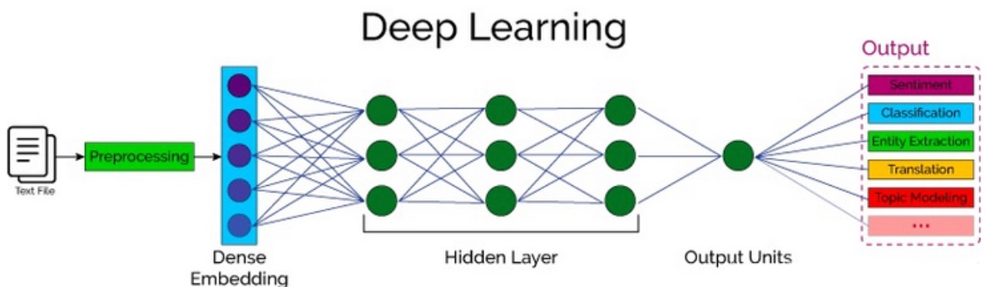
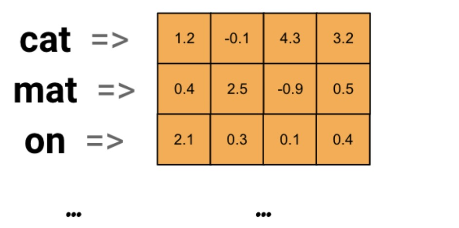
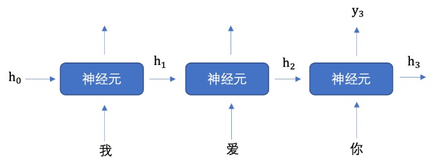
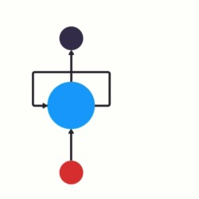
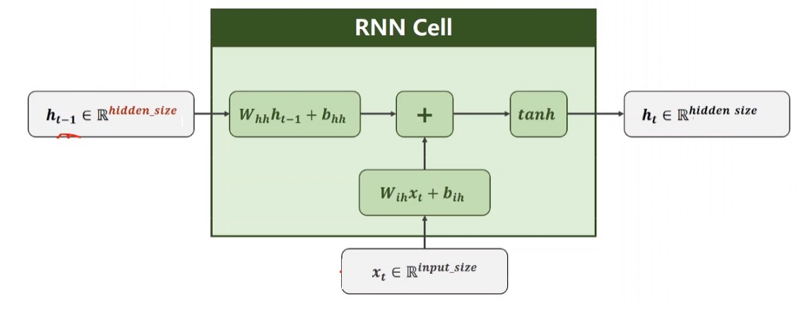

## 1、自然语言处理概述

### 1.1 自然语言处理

**自然语言处理**（Natural Language Processing, NLP）

> 让计算机“理解”并“生成”人类语言（汉语、英语、法语等）。


### 1.2 核心挑战

| 语言数据特点   | 带来的困难           |
| -------------- | -------------------- |
| **非结构化**   | 无法直接矩阵运算     |
| **歧义性**     | 一词多义、指代、语序 |
| **上下文相关** | 长程依赖、隐含知识   |


### 1.3 技术路线总览



| 环节     | 关键技术                | 示例工具                  |
| -------- | ----------------------- | ------------------------- |
| 预处理   | 分词、去噪、归一化      | jieba / spaCy             |
| 数值化   | Embedding / Tokenizer   | Word2Vec / BERT Tokenizer |
| 深度学习 | RNN / CNN / Transformer | PyTorch / TensorFlow      |
| 下游任务 | 分类、翻译、问答        | seq2seq / BERT / GPT      |


### 1.4 典型流程示例

| 阶段      | 输入 → 输出             | 维度示意                       |
| --------- | ----------------------- | ------------------------------ |
| 文本      | “我爱北京天安门”        | `str`                          |
| 分词      | \[“我”, “爱”, …]        | `List[str]`                    |
| Token-ID  | \[101, 2769, …]         | `List[int]`                    |
| Embedding | `[[0.2,-0.1,…], …]`     | `[seq_len, 768]`               |
| 模型      | Dense → Hidden → Output | `[batch, num_classes]`         |
| 任务      | 情感分类 / 机器翻译     | `positive / “I love Beijing.”` |

> 一句话理解：把「文字」先变「向量」，再让「模型」学「语义」。


## 2、词嵌入

### 2.1 什么是词嵌入？  

> **词嵌入** 就是把 **词 → 向量**，让神经网络可计算。

#### **1. 原理**

- 构建矩阵  V ∈ ℝ (词表大小×向量维度)

-  每个词 = 矩阵中一行向量

例：100 个词，128 维 → 矩阵形状 100×128

| 维度     | 说明                                     |
| -------- | ---------------------------------------- |
| **输入** | 离散的词（如“北京”）                     |
| **输出** | 连续的稠密向量（如 128 维浮点向量）      |
| **作用** | 将文本转为可计算的数值表示，捕捉语义关系 |


#### **2. 向量示例**




### 2.2 PyTorch 词嵌入 API  

```python
nn.Embedding(
    num_embeddings,   # 词表大小
    embedding_dim     # 每个词的向量维度
)
```


### 2.3 标准流程（4 步）  

1️⃣ 分词 + 建表：文本 → jieba 分词 → 去重 → 词表

```tex
北京  冬奥  的  进度条  已经  ...  归途
```

> 词表 = {词: 唯一索引}

2️⃣ 构建矩阵

```python
embed = nn.Embedding(num_embeddings=len(词表),
                     embedding_dim=128)   # 128 维
```

3️⃣ 查向量：输入索引 → 取出对应行 → 得到词向量

```
北京 → 索引 0 → embed([0]) → [0.4, ‑0.2, ...]
```

 一句话总结：**先分词、再建表、后查向量**。

> 1. **分词** → 2. **去重建词表** → 3. **构建 Embedding 层** → 4. **查向量**
>


### 2.4 完整代码示例  

```python
import torch
import torch.nn as nn
import jieba

# 1. 原始文本
text = "北京冬奥的进度条已经过半，不少外国运动员在完成自己的比赛后踏上归途。"

# 2. 分词并去重（保留顺序）
words = jieba.lcut(text)
unique_words = sorted(set(words), key=words.index)  # 去重+保序
word2idx = {w: i for i, w in enumerate(unique_words)}

# 3. 构建 Embedding 层
embed = nn.Embedding(num_embeddings=len(unique_words), embedding_dim=4)

# 4. 查看每个词的向量
for word in unique_words:
    idx = torch.tensor([word2idx[word]])
    vec = embed(idx).squeeze()  # 去掉batch维度
    print(f"{word:>4} -> {vec.detach().numpy()}")
```

> **运行结果**  
>
> | 词   | 4 维向量                          |
> | ---- | --------------------------------- |
> | 北京 | [ 0.4924  1.9053  0.5551 -0.4056] |
> | 冬奥 | [-0.7237 -0.3153 -1.0946  0.5241] |
> | 归途 | [-0.8221  0.4773  1.0013 -0.1903] |
>


## 3、RNN

### 3.1 RNN核心思想  

文本天生具备**序列特性**

> “我爱你” ≠ “你爱我”
> “爱”必须跟在“我”之后，“你”必须跟在“爱”之后；顺序一旦颠倒，语义完全改变。

为捕获这种时序依赖，引入**循环神经网络（Recurrent Neural Network, RNN）**，专为处理**序列数据**而生。


### 3.2 RNN计算流程  

#### **1. RNN核心机制**



- **隐藏状态h**：记忆历史信息的向量
- **输入组成**：[上一时刻的h] + [当前输入（如"爱"的向量）]
- **输出**：[当前h（传给下一步）] + [当前预测（如"你"的概率）]


#### **2. 神经元复用机制**

> 以上内容画了 3 个神经元, 但是实际上只有一个神经元，"我爱你" 三个字是重复输入到同一个神经元中。




```
h0 ──→ RNN_Cell ──→ h1 ──→ RNN_Cell ──→ h2 ──→ 全连接 → 预测“你”
        ↑“我”                    ↑“爱”
```

> 首先初始化出第一个隐藏状态h0，**一般都是全0的一个向量**，然后将 "我" 进行词嵌入，转换为向量的表示形式，送入到第一个时间步，然后输出隐藏状态 h1，然后将 h1 和 "爱" 输入到第二个时间步，得到隐藏状态 h2, 将 h2 送入到全连接网络，得到 "你" 的预测概率。


#### 3. 单个 RNN 神经元内部计算流程 



**核心公式：**
$$
h_t = \tanh(W_{ih} \cdot x_t + b_{ih} + W_{hh} \cdot h_{t-1} + b_{hh})
$$


**符号说明**

| 符号                                                       | 含义                               |
| ---------------------------------------------------------- | ---------------------------------- |
| $x_t \in \mathbb{R}^{input\_size}$                         | 当前时刻的输入向量                 |
| $h_{t-1} \in \mathbb{R}^{hidden\_size}$                    | 上一时刻的隐藏状态                 |
| $h_t \in \mathbb{R}^{hidden\_size}$                        | 当前时刻的隐藏状态（即神经元输出） |
| $W_{ih} \in \mathbb{R}^{hidden\_size \times input\_size}$  | 输入到隐藏状态的权重矩阵           |
| $b_{ih} \in \mathbb{R}^{hidden\_size}$                     | 输入到隐藏状态的偏置向量           |
| $W_{hh} \in \mathbb{R}^{hidden\_size \times hidden\_size}$ | 隐藏状态到隐藏状态的权重矩阵       |
| $b_{hh} \in \mathbb{R}^{hidden\_size}$                     | 隐藏状态到隐藏状态的偏置向量       |

**关键点总结**

- **循环结构**：隐藏状态  $h_t$  同时作为当前输出和下一时刻的输入。
- **参数共享**：同一组权重矩阵 \( $W_{ih}$, $W_{hh}$ \) 在每个时间步复用。
- **非线性**：`tanh` 用于引入非线性，增强模型表达能力。


#### 4. PyTorch API 速查表  

**API 调用**  

```python
rnn = nn.RNN(input_size=128, hidden_size=256, num_layers=1)
```

| 参数        | 说明                     | 示例值 |
| ----------- | ------------------------ | ------ |
| input_size  | 词向量维度               | 128    |
| hidden_size | 隐藏层维度（即输出维度） | 256    |
| num_layers  | 堆叠层数（默认 1）       | 1      |


#### 5. 输入/输出张量结构  

**基本调用方式**

```python
output, hn = rnn(x, h0)
```

**输入参数说明**

| 参数 | 形状                               | 含义                                                         |
| ---- | ---------------------------------- | ------------------------------------------------------------ |
| `x`  | `[seq_len, batch, input_size]`     | 输入序列张量：<br>- `seq_len`：句子长度，也就是词语个数<br>- `batch`：批次大小，也就是句子的个数<br>- `input_size`：每个时间步输入的特征维度（如词向量维度） |
| `h0` | `[num_layers, batch, hidden_size]` | 初始隐藏状态：<br>- `num_layers`：RNN 层数（堆叠层数）<br>- `batch`：批次大小<br>- `hidden_size`：隐藏层维度 |

**输出结果说明**

| 输出     | 形状                               | 含义                                             |
| -------- | ---------------------------------- | ------------------------------------------------ |
| `output` | `[seq_len, batch, hidden_size]`    | 每个时间步的隐藏状态输出（即所有时间步的 `h_t`） |
| `hn`     | `[num_layers, batch, hidden_size]` | 最后一个时间步的隐藏状态（即最后一层的 `h_T`）   |

维度关系图示

```plaintext
输入 x:         [seq_len, batch, input_size]
                ↓
RNN层           → 逐个时间步处理
                ↓
输出 output:    [seq_len, batch, hidden_size]
隐藏状态 hn:    [num_layers, batch, hidden_size]
```


#### 6. 完整代码示例  

```python
import torch
import torch.nn as nn

def demo():
    rnn = nn.RNN(input_size=128, hidden_size=256, num_layers=1)
    # 5 个词，32 条句子，128 维词向量
    # 第一个数字: 表示句子长度,也就是词语个数 # 第二个数字: 批量个数，也就是句子的个数 # 第三个数字: 词向量维度
    x = torch.randn(5, 32, 128)
    h0 = torch.zeros(1, 32, 256)      # 初始隐藏状态置零
    output, hn = rnn(x, h0)

    print("output shape:", output.shape)   # torch.Size([5, 32, 256])
    print("hn shape   :", hn.shape)        # torch.Size([1, 32, 256])

if __name__ == "__main__":
    demo()
```


## 4、文本生成案例

> **项目需求：**文本生成是一种常见的自然语言处理任务，输入一个开始词能够预测出后面的词序列。本案例将会使用循环神经网络来实现周杰伦歌词生成任务。

### **阶段 1：数据预处理**
#### **1.1 获取数据集并构建词表**

> 项目背景：我们收集了周杰伦从第一张专辑《Jay》到第十张专辑《跨时代》中的歌词，用于训练神经网络模型。训练完成后，模型可用于创作新歌词。

**目标**：分词、去重、建立词到索引的映射  

```python
import jieba
import torch
from torch.utils.data import DataLoader

def build_vocab():
    """构建词汇表：分词、去重、建立词到索引的映射"""
    file_name = 'data/jaychou_lyrics.txt'
    unique_words = []  # 去重后的词列表
    all_words = []     # 所有句子分词结果（二维列表）

    # 遍历文件，逐行分词
    for line in open(file_name, 'r', encoding='utf-8'):
        words = jieba.lcut(line.strip())  # 分词（返回列表）
        all_words.append(words)
        for word in words:
            if word not in unique_words:
                unique_words.append(word)
        # unique_words.extend([w for w in words if w not in unique_words])  # 去重，不能使用这个方法，unique_words不会动态更新

    # 构建映射
    word_to_index = {word: idx for idx, word in enumerate(unique_words)}
    corpus_idx = [word_to_index[w] for words in all_words for w in words + [' ']]  # 添加句子结束符
    # 对于每个 words（一个句子的分词列表）
    # 将这个句子转换为 words + [' ']，即在原句子末尾添加一个空格字符
    # 然后对这个新列表中的每个元素 w（包括空格字符），都通过 word_to_index[w] 查找其对应的索引
    # 空格字符' '也会被当作一个词汇，通过 word_to_index 查找其索引值。如果空格字符在词汇表中，就能找到对应的索引；如果不在，将会抛出 KeyError 异常。
    return unique_words, word_to_index, len(unique_words), corpus_idx
```
**输出**：

- 词数量：`5703`  
- 示例词表：`{'想要': 0, '有': 1, '直升机': 2, ...}`


### **阶段 2：构建数据集对象**
#### **2.1 Dataset 类**

> 我们在训练的时候，为了便于读取语料，我们会构建一个 Dataset 对象

**目标**：将文本转为训练样本（输入序列和预测目标）  
```python
class LyricsDataset(torch.utils.data.Dataset):
    """自定义数据集：将文本转为训练样本"""
    def __init__(self, corpus_idx, num_chars):
        self.corpus_idx = corpus_idx  # 所有词的索引列表
        self.num_chars = num_chars    # 每个样本的序列长度
        self.number = len(corpus_idx) // num_chars  # 总样本数（向下取整）

    def __len__(self):
        return self.number  # 返回样本数（非词数）

    def __getitem__(self, idx):
        """获取第idx个样本：输入序列x和目标序列y"""
        # 一定要这个，损失才小
        start = min(max(idx, 0), self.word_count - self.num_chars - 2)
        # start = idx * self.num_chars  # 起始位置
        x = self.corpus_idx[start : start + self.num_chars]       # 输入序列
        y = self.corpus_idx[start + 1 : start + self.num_chars + 1]  # 目标序列（右移1位）
        return torch.tensor(x), torch.tensor(y)
```
**示例**：  

输入 `x = [0, 1, 2, 3, 40]` → 目标 `y = [1, 2, 3, 40, 0]`


### **阶段 3：构建网络模型**
#### **3.1 模型结构**
**目标**：**词嵌入层**(用于将语料转换为词向量) → **RNN**(提取句子语义) → **全连接层**(输出对词典中每个词的预测概率)  

```python
import torch.nn as nn

class TextGenerator(nn.Module):
    """歌词生成模型：嵌入层 + RNN + 全连接层"""
    def __init__(self, word_count):
        super().__init__()
        self.ebd = nn.Embedding(word_count, 128)  # 词嵌入：词表大小→128维向量
        self.rnn = nn.RNN(128, 128, 1)            # RNN：输入128维，隐藏层128维，1层
        self.out = nn.Linear(128, word_count)     # 全连接：128维→词表大小（预测概率）

    def forward(self, inputs, hidden):
        """前向传播：输入形状(batch, seq_len)"""
        embed = self.ebd(inputs).transpose(0, 1)  # 输出(seq_len, batch, 128)
        output, hidden = self.rnn(embed, hidden)  # RNN输出：(seq_len, batch, 256)
        output = self.out(output.reshape(-1, 128))  # 输出：(seq_len*batch, word_count)
        return output, hidden

    def init_hidden(self, batch_size):
        """初始化隐藏状态：形状(层数, batch, 隐藏维度)"""
        return torch.zeros(1, batch_size, 128)
```


### **阶段 4：训练模型**
#### **4.1 训练流程**
**目标**：交叉熵损失 + Adam 优化  

```python
import time

def train():
    """训练模型：交叉熵损失 + Adam优化器"""
    unique_words, word_to_index, word_count, corpus_idx = build_vocab()
    dataset = LyricsDataset(corpus_idx, 32)  # 每个样本32个词
    model = TextGenerator(word_count)
    criterion = nn.CrossEntropyLoss()  # 多分类交叉熵
    optimizer = torch.optim.Adam(model.parameters(), lr=1e-3)

    for epoch in range(10):
        dataloader = DataLoader(dataset, shuffle=True, batch_size=8)  # 批次大小2
        total_loss = 0
        start_time = time.time()

        for x, y in dataloader:
            hidden = model.init_hidden(8)  # 每批次重置隐藏状态
            output, _ = model(x, hidden)   # 前向传播
            # y:[batch,seq_len]->[seq_len,batch]->[seq_len*batch]
						y = torch.transpose(y, 0, 1).contiguous().view(-1)  # （展平y）
            loss = criterion(output, y)  # 计算损失
            
            optimizer.zero_grad()  # 清零梯度
            loss.backward()        # 反向传播
            optimizer.step()       # 更新参数
            total_loss += loss.item()

        print(f"epoch {epoch+1} | loss: {total_loss/len(dataloader):.5f} | time: {time.time()-start_time:.2f}s")
        torch.save(model.state_dict(), f'data/lyrics_model_{epoch+1}.pth')  # 保存模型
```
**输出**：  
`epoch 10 loss: 0.10058`


### **阶段 5：生成歌词**
#### **5.1 预测函数**
**目标**：输入起始词，生成长度为 `N` 的歌词  

```python
def predict(start_word, sentence_length):
    """生成歌词：输入起始词，迭代预测后续词"""
    unique_words, word_to_index, word_count, _ = build_vocab()
    index_to_word = {v: k for k, v in word_to_index.items()}  # 索引到词的映射

    model = TextGenerator(word_count)
    model.load_state_dict(torch.load('data/lyrics_model_10.pth'))  # 加载训练好的模型
    model.eval()  # 推理模式（关闭Dropout等）

    hidden = model.init_hidden(1)  # 隐藏状态（batch=1）
    word_idx = word_to_index.get(start_word, 0)  # 起始词索引（默认0）
    result = [word_idx]

    for _ in range(sentence_length):
        output, hidden = model(torch.tensor([[word_idx]]), hidden)  # 预测下一个词
        word_idx = torch.argmax(output).item()  # 取概率最大的词
        result.append(word_idx)

    print(''.join(index_to_word[i] for i in result))  # 拼接为字符串

# 示例：生成50个词的歌词
if __name__ == "__main__":
    predict('想要', 50)
```
**示例**：  输入 `predict('分手', 50)` →  

**输出**：  

> 分手的话像语言暴力  
>
> 我已无能为力再提起决定中断熟悉  
>
> ...（后续歌词）


### **总结**
1. **构建词表**：分词 → 去重 → 映射索引。  
2. **数据集**：滑动窗口生成输入-目标对。  
3. **模型**：嵌入层 + RNN + 全连接层。  
4. **训练**：交叉熵损失 + Adam 优化。  
5. **生成**：迭代预测下一个词。


