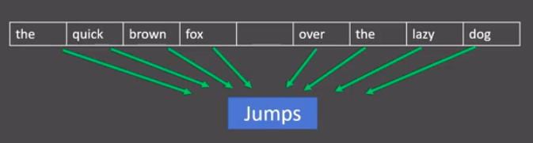
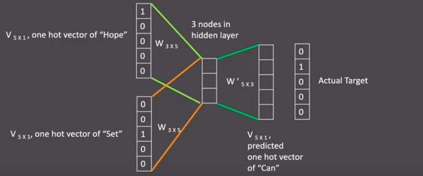
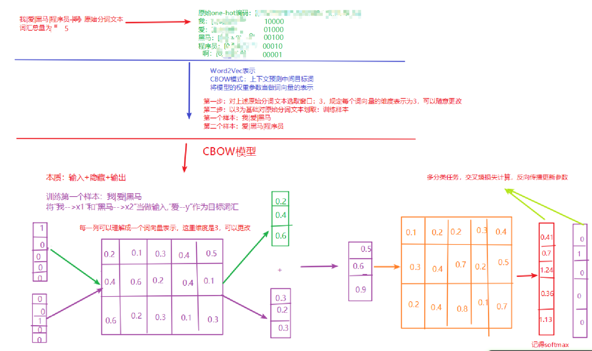

## 1、自然语言处理入门

### 1.1 NLP定义

**自然语言处理**（**Natural Language Processing**，简称**NLP**）：计算机科学与语言学交叉领域，研究「计算机 ⟺ 人类语言」的转换。


### 1.2 NLP发展简史

```properties
1950: 图灵提出：机器能够思考吗？这一划时代的问题，标志着人类语言学与计算机科学正式交汇。
1957-1970: NLP领域形成两大阵营：基于规则的方法 + 基于统计的方法
1994-1999: 统计方法占上风，概率计算全面渗透到 NLP 各任务。
2000-2008: 机器学习快速崛起，成为 NLP 主流技术路线。
2015-2023: 人工智能时代来临，深度学习深刻改写 NLP 未来。
2023年至今: 大模型AIGC时代
```


### 1.3 NLP应用场景

```properties
语音识别（例：科大讯飞语音识别技术）
机器翻译
搜索引擎
智能对话
...
```


## 2、文本预处理

### 2.1 文本预处理概述

#### **1. 文本预处理及作用：**

对中文文本进行数据预处理，来符合模型输入的要求

- 将文本转化为模型可接受的**张量格式**
- 规范张量尺寸，提升模型效果
- 指导**超参数选择**，优化评估指标


#### 2. 文本预处理的主要环节

| 主要环节           | 内容                              |
| ------------------ | --------------------------------- |
| 文本处理的基本方法 | 分词、词性标注、命名实体识别      |
| 文本张量表示       | One-hot、Word2Vec、Word Embedding |
| 语料数据分析       | 标签分布、句子长度、词频统计      |
| 特征处理           | n-gram、长度规范                  |
| 数据增强           | 回译法                            |


### 2.2 文本处理的基本方法

#### 1. 分词（Tokenization）

**✅ 分词的意义**

- **定义**：将连续的字序列，按一定规则切分为独立词序列。
- **原因**：
  - 模型训练前必须分词，**词是理解语义的基本单元**。
  - 英文有空格自然切分，**中文无空格，需借助工具**。


**✅ 常用分词工具：jieba**

**1️⃣ 精确模式（默认）**

- 按人类表达习惯尽可能**精确切分**。
- 适合文本分析。

```python
import jieba

content = "传智教育是一家上市公司，旗下有黑马程序员品牌。我是在黑马这里学习人工智能"

# 精确模型（默认）：试图将句子最精确地切开，适合文本分析。
jieba.cut(content, cut_all=False)  # cut_all默认为False，代表精确模式。

# 将返回一个生成器对象
<generator object Tokenizer.cut at 0x7f8d9053e650>

# 若需直接返回列表内容, 使用jieba.lcut即可
jieba.lcut(content, cut_all=False)
['传智', '教育', '是', '一家', '上市公司', '，', '旗下', '有', '黑马', '程序员', '品牌', '。', '我', '是', '在', '黑马', '这里', '学习', '人工智能']
```


**2️⃣ 全模式**

- 尽可能**扫描出所有可能的词**，速度快但冗余多。

```python
# 若需直接返回列表内容, 使用jieba.lcut即可
jieba.lcut(content, cut_all=True)

['传', '智', '教育', '是', '一家', '上市', '上市公司', '公司', '', '', '旗下', '下有', '黑马', '程序', '程序员', '品牌', '', '', '我', '是', '在', '黑马', '这里', '学习', '人工', '人工智能', '智能']

# 注意1：人工智能全模型分成三个词
# 注意2：逗号和句号也给分成了词
```


**3️⃣ 搜索引擎模式**

- 在精确模式基础上，对**长词再次切分**，适用于搜索引擎构建索引。

```python
import jieba

content = "传智教育是一家上市公司，旗下有黑马程序员品牌。我是在黑马这里学习人工智能"
jieba.cut_for_search(content)

# 将返回一个生成器对象
<generator object Tokenizer.cut_for_search at 0x7f8d90e5a550>

# 若需直接返回列表内容, 使用jieba.lcut_for_search即可
jieba.lcut_for_search(content)

['传智', '教育', '是', '一家', '上市', '公司', '上市公司', '，', '旗下', '有', '黑马', '程序', '程序员', '品牌', '。', '我', '是', '在', '黑马', '这里', '学习', '人工', '智能', '人工智能']

# 对'程序员'等较长词汇都进行了再次分词.
```


**4️⃣ 支持中文繁体分词**

```python
import jieba

content = "煩惱即是菩提，我暫且不提"
jieba.lcut(content)
['煩惱', '即', '是', '菩提', '，', '我', '暫且', '不', '提']
```


**5️⃣ 用户自定义词典**

如果用户指定的词典，那么jieba优先根据词典里面的词进行分词

- **作用**：提高特定领域词汇识别准确性。
- **格式**：每行一个词，可添加词频、词性（可选）

示例词典（userdict.txt）：

```properties
# 格式：word1 freq1 word_type1
黑马程序员 5 n
传智教育 6 n
人工智能 7 nz
学习 3
上市 3 
```

```python
import jieba

sentence = '传智教育是一家上市公司，旗下有黑马程序员品牌。我是在黑马这里学习人工智能'
# 1 没有使用用户自定义词典
mydata = jieba.lcut(sentence, cut_all=False)
print('mydata-->', mydata)

# 2 使用用户自定义词典
jieba.load_userdict("./userdict.txt")
mydata2 = jieba.lcut(sentence, cut_all=False)
print('mydata2-->', mydata2)

# 没有使用用户自定义词典的分词效果
mydata--> ['传智', '教育', '是', '一家', '上市公司', '，', '旗下', '有', '黑马', '程序员', '品牌', '。', '我', '是', '在', '黑马', '这里', '学习', '人工智能']

# 使用用户自定义词典的分词效果
mydata2--> ['传智教育', '是', '一家', '上市公司', '，', '旗下', '有', '黑马程序员', '品牌', '。', '我', '是', '在', '黑马', '这里', '学习', '人工智能']
```


**✅ 总结对比表**

| 模式           | 特点描述                 | 适用场景           |
| -------------- | ------------------------ | ------------------ |
| 精确模式       | 精确切分，无冗余         | 文本分析、默认推荐 |
| 全模式         | 切出所有可能词，存在冗余 | 快速粗粒度分析     |
| 搜索引擎模式   | 精确模式+长词再切分      | 搜索引擎索引构建   |
| 自定义词典支持 | 提升专名、术语识别准确性 | 垂直领域文本处理   |


#### 2. 命名实体识别(NER)

**✅ 定义**

- **命名实体（Named Entity）**：
  - 指**人名、地名、机构名、专有名词**等具有特定意义的实体。
  - 示例：周杰伦（人名）、黑山县（地名）、孔子学院（机构名）、24辊方钢矫直机（专业设备名）
- **命名实体识别（NER）**：
  - 从文本中**识别并提取**出上述命名实体的过程。
  - 英文：**Named Entity Recognition（NER）**


**✅ 示例说明**

文本：

> 鲁迅，浙江绍兴人，五四新文化运动的重要参与者，代表作《朝花夕拾》。

识别结果：

```properties
鲁迅(人名) / 浙江绍兴(地名)人 / 五四新文化运动(专有名词) / 重要参与者 / 代表作 / 朝花夕拾(专有名词)
```


**✅ 作用与意义**

- **人类理解文本的基础单元**之一，与词汇同等重要。
- **NLP高阶任务的基础环节**：如信息抽取、问答系统、知识图谱构建等。

> 实现方式：**模型训练**（后续项目中详细展开）


#### 3. 词性标注（Part-Of-Speech tagging）

✅ 定义

- **词性（Part-of-Speech）**：
  - 根据**语法特征和词汇意义**对词语进行的分类。
  - 常见词性（共14种）：
    - 名词（n）、动词（v）、形容词（a）、副词（d）、代词（r）、介词（p）等。
- **词性标注（POS Tagging）**：
  - 为文本中**每个词汇标注其对应词性**的过程。


✅ 示例说明

文本：

> 我爱自然语言处理

词性标注结果：

| 词汇     | 词性 | 含义          |
| -------- | ---- | ------------- |
| 我       | r    | 人称代词      |
| 爱       | v    | 动词          |
| 自然语言 | n    | 名词          |
| 处理     | vn   | 动名词/名动词 |


✅ 作用与意义

- 以**分词为基础**，从语法角度进一步理解文本。
- **NLP高阶任务的重要基础环节**，如：句法分析、语义角色标注、信息抽取等。


✅ 使用jieba实现词性标注

```python
import jieba.posseg as pseg

content = "我爱北京天安门"
result = pseg.lcut(content)

# 输出示例：
# [pair('我', 'r'), pair('爱', 'v'), pair('北京', 'ns'), pair('天安门', 'ns')]
```


> **复习：张量切片的维度计算**
>
> ```python
> a = torch.randn(3,3,4)
> # 有几个冒号就是几维，省略代表有冒号
> print(a[:1].shape)      # torch.Size([1, 3, 4])
> print(a[:1,:,:].shape)  # torch.Size([1, 3, 4])
> print(a[:1,:2].shape)   # torch.Size([1, 2, 4])
> print(a[1,:2,3].shape)  # torch.Size([2])
> print(a[:,2,:2].shape)  # torch.Size([3, 2])
> ```


### 2.3 文本张量表示

**文本张量表示的意义**

将文本转换为向量（数字）的形式，使得模型能够识别进而实现训练，一般是进行**词向量的表示**。


**实现方式**

- One-Hot
- Word2Vec
- Word Embedding


#### 1. One-Hot 词向量表示

**定义**

- 针对每一个词汇，都会用一个向量表示。
- 向量的长度为 **n**，n 代表去重之后的词汇总量。
- 向量中只有 **0 和 1** 两种数字，俗称**独热编码**或**01编码**。


**代码实现：生成 One-Hot 编码**

思路分析：

- 准备语料（词汇表）`vocabs`
- 实例化词汇映射器 `Tokenizer`，拟合文本数据（内部生成 `index_word` 和 `word_index`）
- 查询单词索引，赋值 `zero_list`，生成 One-Hot
- 使用 `joblib` 保存映射器

代码示例：

```python
import jieba
# 导入keras中的词汇映射器Tokenizer
from tensorflow.keras.preprocessing.text import Tokenizer
# 导入用于对象保存与加载的joblib
import joblib


def dm_onehot_gen():

    # 1 准备语料 vocabs
    vocabs = {"周杰伦", "陈奕迅", "王力宏", "李宗盛", "吴亦凡", "鹿晗"}

    # 2 实例化词汇映射器Tokenizer, 使用映射器拟合现有文本数据 (内部生成 index_word word_index)
    # 2-1 注意idx序号-1
    mytokenizer = Tokenizer()
    mytokenizer.fit_on_texts(vocabs)

    # 3 查询单词idx 赋值 zero_list，生成onehot
    for vocab in vocabs:
        zero_list = [0] * len(vocabs)
        idx = mytokenizer.word_index[vocab] - 1
        zero_list[idx] = 1
        print(vocab, '的onehot编码是', zero_list)

    # 4 使用joblib工具保存映射器 joblib.dump()
    mypath = './mytokenizer'
    joblib.dump(mytokenizer, mypath)
    print('保存mytokenizer End')

    # 注意5-1 字典没有顺序 onehot编码没有顺序 []-有序 {}-无序 区别
    # 注意5-2 字典有的单词才有idx idx从1开始
    # 注意5-3 查询没有注册的词会有异常 eg: 狗蛋
    print(mytokenizer.word_index)
    print(mytokenizer.index_word)
```


**使用已保存的 One-Hot 编码**

代码示例：

```python
# 思路分析
# 1 加载已保存的词汇映射器Tokenizer joblib.load(mypath)
# 2 查询单词idx 赋值zero_list，生成onehot 以token为'李宗盛'
# 3 token = "狗蛋" 会出现异常
def dm_onehot_use():

    vocabs = {"周杰伦", "陈奕迅", "王力宏", "李宗盛", "吴亦凡", "鹿晗"}

    # 1 加载已保存的词汇映射器Tokenizer joblib.load(mypath)
    mypath = './mytokenizer'
    mytokenizer = joblib.load(mypath)

    # 2 编码token为"李宗盛"  查询单词idx 赋值 zero_list，生成onehot
    token = "李宗盛"
    zero_list = [0] * len(mytokenizer.word_index)
    idx = mytokenizer.word_index[token] - 1
    zero_list[idx] = 1
    print(token, '的onehot编码是', zero_list)
```


**One-Hot 编码的缺点**

- **割裂了词与词之间的联系**（无法体现语义相似性）
- **维度灾难**：如果词汇量 n 过大，会导致占用大量内存（维度爆炸）


#### 2. Word2Vec模型

- **模型介绍：**Word2vec 是一种无监督词向量训练方法，通过训练一个浅层神经网络，把网络权重当作词的稠密向量表示。

- **两种训练方式**：`cbow`、`skipgram`


##### CBOW介绍

> 给一段文本，选择一定的窗口（一般为奇数），然后利用上下文预测中间目标词



分析：图中窗口大小为9, 使用前后4个词汇对目标词汇进行预测.


**实现过程：**

- **训练语料**：Hope **can** set you free
- **窗口大小**：3 ⇒ 上下文各取 1 词
- **目标词**：can


1️⃣ 构造首个训练样本

| 角色     | 词汇 | One-hot 维度 |
| -------- | ---- | ------------ |
| 上下文词 | Hope | 5×1          |
| 上下文词 | set  | 5×1          |
| 目标词   | can  | 5×1          |


2️⃣ 前向传播

在模型训练时， Hope，can，set等词汇都使用它们的one-hot编码. 如图所示: 每个one-hot编码的单词与各自的变换矩阵(即参数矩阵3x5, 这里的3是指最后得到的词向量维度)相乘之后再相加, 得到上下文表示矩阵(3x1).


接着, 将上下文表示矩阵与变换矩阵(参数矩阵5x3, 所有的变换矩阵共享参数)相乘, 得到5x1的结果矩阵, 它将与我们真正的目标矩阵即can的one-hot编码矩阵(5x1)进行损失L的计算。




- 共享权重矩阵
  - 输入层 → 隐藏层：`W`  3×5
  - 隐藏层 → 输出层：`W'` 5×3
- 计算流程
  1. `h = W · (Hope + set)`                 (3×1)
  2. `ŷ = W' · h`                           (5×1)
  3. 损失 `L = CrossEntropy(ŷ, can_onehot)`


3️⃣ 反向传播 & 参数更新

- 根据 `L` 同时更新 `W` 与 `W'`。

- 窗口右滑，生成下一个样本 → 重复直至遍历完整语料。


4️⃣ 训练结束后的产物

- 最终得到的 **W(3×5)** 即为词向量矩阵。
- 任意词 `v` 的 Word2Vec 表示：`vec(v) = W · onehot(v)` (3×1)。




