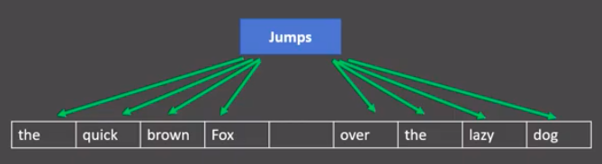
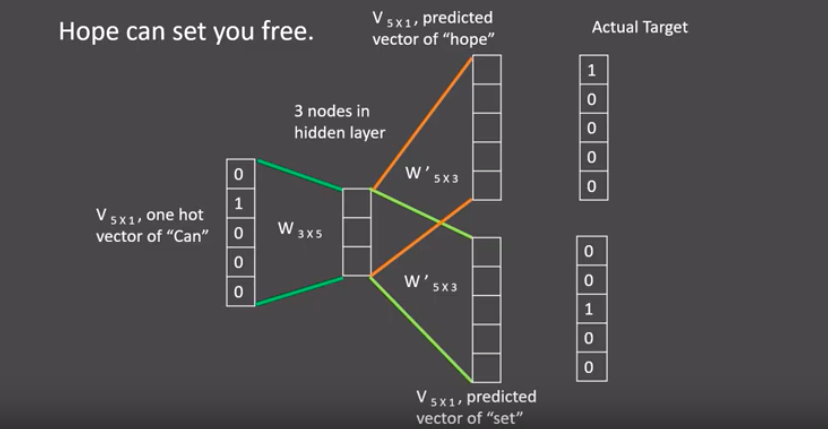
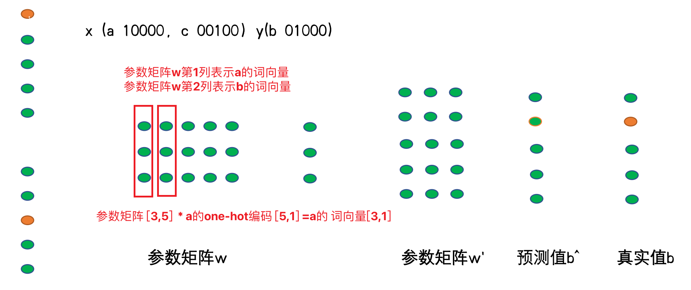

## 1、文本张量表示

### 1.1 word2vec之skipgram方式：

skipgram模式：给定一段用于训练的文本语料, 再选定某段长度(窗口，**一般为奇数**)作为研究对象, 使用目标词汇预测上下文词汇。



#### 1 训练样本

- 语料：`Hope can set you free`
- 窗口大小：3
- 首个样本：`Hope can set`
  - 输入词：`can`
  - 输出词：`Hope`、`set`

#### 2 网络结构

- 输入：词 `can` 的 one-hot 向量（5×1）
- 隐藏层权重：W₁（3×5）→ 得到 3×1 的词向量
- 输出层权重：W₂（5×3）→ 产生 5×1 的 logits
- 损失：与 `Hope`、`set` 的 one-hot 向量比较，反向传播更新 W₁、W₂




#### 3 训练流程

- 窗口按序滑动，生成新样本
- 重复步骤 2 更新参数
- 遍历完整语料后，最终 W₁（3×5）即为词向量矩阵

#### 4 获取词向量

任意词的 W₁（3×5）×  one-hot（5×1） → 3×1 向量（其中词向量的维度是**人为规定的**），即该词的 Word2Vec 表示




### 1.2 Fasttext实现word2vec的训练

基本过程：

- 导包：`fasttext`
- 获取数据集
- 训练和保存
- 加载使用


#### 1 数据获取 & 预处理

| 步骤         | 命令 / 说明                                                  |
| ------------ | ------------------------------------------------------------ |
| **原始数据** | `http://mattmahoney.net/dc/enwik9.zip`（已放 `/root/data/`） |
| **解压**     | `unzip /root/data/enwik9.zip` → `/root/data/enwik9`          |
| **去噪**     | `perl wikifil.pl data/enwik9 > data/fil9`（已执行，用来清除XML/HTML格式的内容） |
| **查看**     | `head -c 80 data/fil9` → `anarchism originated as a term of abuse first …` |


#### 2 训练、保存、加载

```python
# 导入fasttext
import fasttext

def dm_fasttext_train_save_load():
    # 1 使用train_unsupervised(无监督训练方法) 训练词向量
    mymodel = fasttext.train_unsupervised('./data/fil9')
    print('训练词向量 ok')

    # 2 save_model()保存已经训练好词向量 
    # 注意，该行代码执行耗时很长 
    mymodel.save_model("./data/fil9.bin")
    print('保存词向量 ok')

    # 3 模型加载
    mymodel = fasttext.load_model('./data/fil9.bin')
    print('加载词向量 ok')


# 步骤1运行效果如下：
有效训练词汇量为124M, 共218316个单词
Read 124M words
Number of words:  218316
Number of labels: 0
Progress: 100.0% words/sec/thread:   53996 lr:  0.000000 loss:  0.734999 ETA:   0h 0m
```


#### 3 取词向量 & 质量检验

```python
# 词向量（100 维）
vec = model.get_word_vector('the')
print(vec.shape)          # (100,)
print(vec[:5])            # [-0.03087516  0.09221972  0.17660329  0.17308897  0.12863874]

# 最近邻
model.get_nearest_neighbors('sports')
# [(0.841, 'sportsnet'), (0.813, 'sport'), ...]
model.get_nearest_neighbors('music')
# [(0.890, 'emusic'), (0.846, 'musicmoz'), ...]
model.get_nearest_neighbors('dog')
# [(0.845, 'catdog'), (0.748, 'dogcow'), ...]
```


#### 4 常用超参数

| 名称     | 含义     | 默认值       | 建议             |
| -------- | -------- | ------------ | ---------------- |
| `model`  | 训练模式 | `'skipgram'` | 或 `'cbow'`      |
| `dim`    | 嵌入维度 | `100`        | 大语料可设 `300` |
| `epoch`  | 迭代次数 | `5`          | 大数据可减少     |
| `lr`     | 学习率   | `0.05`       | 可调 `[0.01, 1]` |
| `thread` | 线程数   | `12`         | 与 CPU 核数一致  |

示例：

```python
model = fasttext.train_unsupervised(
    'data/fil9',
    model='cbow',
    dim=300,
    epoch=1,
    lr=0.1,
    thread=8
)
```


### 1.3 WordEmbedding词向量

**定义**：将词映射到指定维度的空间：词向量的一种表示方法

| 范围                    | 定义                                                         |
| ----------------------- | ------------------------------------------------------------ |
| **广义 Word Embedding** | 任何将词汇映射到稠密向量的方法（例：Word2Vec、FastText）。   |
| **狭义 Word Embedding** | 特指神经网络中的 `nn.Embedding` 层权重矩阵，随模型一起训练。 |

**实现过程**：

```python
# 1. 分词
import jieba
from tensorflow.keras.preprocessing.text import Tokenizer
import torch.nn as nn
from torch.utils.tensorboard import SummaryWriter

sentences = ["传智教育是一家上市公司，旗下有黑马程序员品牌。我是在黑马这里学习人工智能",
             "我爱自然语言处理"]
word_list = [jieba.lcut(s) for s in sentences]

# 2. Token → id
tok = Tokenizer()
tok.fit_on_texts(word_list)
vocab = list(tok.index_word.values())          # 词汇表
ids     = tok.texts_to_sequences(word_list)    # 句子转 id

# 3. 创建 Embedding 层
EMB_DIM = 8
embed = nn.Embedding(num_embeddings=len(vocab), embedding_dim=EMB_DIM)
# print("embd--->", embd)
# print('nn.Embedding层词向量矩阵-->', embd.weight.data, embd.weight.data.shape, type(embd.weight.data))

# 4. 写 TensorBoard
writer = SummaryWriter()
writer.add_embedding(embed.weight.data, metadata=vocab)
writer.close()

# 5. 启动 TensorBoard,通过tensorboard观察词向量相似性
# cd 程序的当前目录下执行下面的命令
# tensorboard --logdir=runs --host 0.0.0.0
# 浏览器访问 http://127.0.0.1:6006

print('从nn.Embedding层中根据idx拿词向量')
# 6 从nn.Embedding层中根据idx拿词向量
for idx in range(len(tok.index_word)):
  tmpvec = embd(torch.tensor(idx))
  print('%4s'%(mytokenizer.index_word[idx+1]), tmpvec.detach().numpy())

# 根据词来获取词向量 
vec = embed(torch.tensor(tok.word_index['黑马']-1)).detach().numpy() 
```


## 2 文件数据分析

**定义**：文本数据分析能够有效帮助我们理解数据语料, **快速检查出语料可能存在的问题**, 并指导之后模型训练过程中一些超参数的选择


**数据说明**

| 文件                  | 说明                              |
| --------------------- | --------------------------------- |
| `./cn_data/train.tsv` | 训练集，两列：`sentence`, `label` |
| `./cn_data/dev.tsv`   | 验证集，格式同上                  |
| 标签                  | 0 = 消极，1 = 积极                |


### 2.1 获取标签数量分布

```properties
在深度学习模型评估中: 我们一般使用ACC作为评估指标, 若想将ACC的基线定义在50%左右, 则需要我们的正负样本比例维持在1:1左右, 否则就要进行必要的数据增强或数据删减. 上图中训练和验证集正负样本都稍有不均衡, 可以进行一些数据增强.
```

**代码实现**：

```python
import seaborn as sns
import pandas as pd
import matplotlib.pyplot as plt


def dm_label_sns_countplot():

    # 1 设置显示风格plt.style.use('fivethirtyeight')
    plt.style.use('fivethirtyeight')

    # 2 pd.read_csv 读训练集 验证集数据
    train_data = pd.read_csv(filepath_or_buffer = './cn_data/train.tsv', sep='\t')
    dev_data = pd.read_csv(filepath_or_buffer = './cn_data/dev.tsv', sep='\t')

    # 3 sns.countplot() 统计label标签的0、1分组数量
    sns.countplot(x='label', data = train_data)

    # 4 画图展示 plt.title() plt.show()
    plt.title('train_label')
    plt.show()

    # 验证集上标签的数量分布
    # 3-2 sns.countplot() 统计label标签的0、1分组数量
    sns.countplot(x='label', data = dev_data)

    # 4-2 画图展示 plt.title() plt.show()
    plt.title('dev_label')
    plt.show()
```

**典型结果**

| 数据集 | 0(消极) | 1(积极) | 观察     |
| ------ | ------- | ------- | -------- |
| Train  | ≈1 200  | ≈1 400  | 轻度失衡 |
| Dev    | ≈ 300   | ≈ 500   | 同上     |

> 若正负比例明显偏离 1:1，可考虑
>
> - 数据增强（回译、EDA）
> - 过采样 / 欠采样
> - 调整类别权重


### 2.2 获取句子长度分布

```properties
获取句子长度分布作用: 通过绘制句子长度分布图, 可以得知我们的语料中大部分句子长度的分布范围, 因为模型的输入要求为固定尺寸的张量，合理的长度范围对之后进行句子截断补齐(规范长度)起到关键的指导作用.
```

**代码实现**：

```python
def dm_len_sns_countplot_distplot():
    
    # 1 设置显示风格plt.style.use('fivethirtyeight')
    plt.style.use('fivethirtyeight')

    # 2 pd.read_csv 读训练集 验证集数据
    train_data = pd.read_csv(filepath_or_buffer='./cn_data/train.tsv', sep='\t')
    dev_data = pd.read_csv(filepath_or_buffer='./cn_data/dev.tsv', sep='\t')

    # 3 求数据长度列 然后求数据长度的分布
    train_data['sentence_length'] =  list( map(lambda x: len(x), train_data['sentence']))

    # 4 绘制数据长度分布图-柱状图
    sns.countplot(x='sentence_length', data=train_data)
    # sns.countplot(x=train_data['sentence_length'])
    plt.xticks([]) # x轴上不要提示信息
    # plt.title('sentence_length countplot')
    plt.show()

    # 5 绘制数据长度分布图-曲线图
    sns.displot(x='sentence_length', data=train_data)
    # sns.displot(x=train_data['sentence_length'])
    plt.yticks([]) # y轴上不要提示信息
    plt.show()

    # 验证集
    # 3 求数据长度列 然后求数据长度的分布
    dev_data['sentence_length'] = list(map(lambda x: len(x), dev_data['sentence']))

    # 4 绘制数据长度分布图-柱状图
    sns.countplot(x='sentence_length', data=dev_data)
    # sns.countplot(x=dev_data['sentence_length'])
    plt.xticks([])  # x轴上不要提示信息
    # plt.title('sentence_length countplot')
    plt.show()

    # 5 绘制数据长度分布图-曲线图
    sns.displot(x='sentence_length', data=dev_data)
    # sns.displot(x=dev_data['sentence_length'])
    plt.yticks([])  # y轴上不要提示信息
    plt.show()
```

**典型结论**

- **训练集**：长度集中在 20–60 字符
- **验证集**：长度集中在 20–40 字符

> 据此可设 `max_len=60`（或 80）兼顾覆盖率与效率。


### 2.3 获取正负样本长度散点图分布

```properties
作用: 通过查看正负样本长度散点图, 可以有效定位异常点的出现位置, 帮助我们更准确进行人工语料审查.
```

**代码实现**：

```python
def dm03_sns_stripplot():
    
    # 1 设置显示风格plt.style.use('fivethirtyeight')
    plt.style.use('fivethirtyeight')

    # 2 pd.read_csv 读训练集 验证集数据
    train_data = pd.read_csv(filepath_or_buffer='./cn_data/train.tsv', sep='\t')
    dev_data = pd.read_csv(filepath_or_buffer='./cn_data/dev.tsv', sep='\t')

    # 3 求数据长度列 然后求数据长度的分布
    train_data['sentence_length'] = list(map(lambda x: len(x), train_data['sentence']))

    # 4 统计正负样本长度散点图 （对train_data数据，按照label进行分组，统计正样本散点图）
    sns.stripplot(y='sentence_length', x='label', data=train_data)
    plt.show()

    sns.stripplot(y='sentence_length', x='label', data=dev_data)
    plt.show()
```

**结果速览：**

| 数据集    | 发现                                        |
| --------- | ------------------------------------------- |
| **Train** | 正样本出现极端值（≈ 3500 字符）→ 需人工审查 |
| **Dev**   | 无明显异常                                  |

> 异常长文本可能为垃圾或拼接内容，清洗后可提升模型稳定性。


### 2.4 获取不同词汇总数统计

**代码实现：**

```python
# 导入jieba用于分词
# 导入chain方法用于扁平化列表
import jieba
from itertools import chain

# 进行训练集的句子进行分词, 并统计出不同词汇的总数
# map(lambda x: jieba.lcut(x), train_data['sentence'])会对每个句子进行分词，返回多个列表，而chain(*)则将这些列表"扁平化"成一个单一的迭代器，最后通过list()转换为一个包含所有词汇的列表。简单来说，chain在这里的作用就是将多个分词列表合并成一个大的词汇列表。
train_vocab = set(chain(*map(lambda x: jieba.lcut(x), train_data["sentence"])))
print("训练集共包含不同词汇总数为：", len(train_vocab))

# 进行验证集的句子进行分词, 并统计出不同词汇的总数
valid_vocab = set(chain(*map(lambda x: jieba.lcut(x), valid_data["sentence"])))
print("训练集共包含不同词汇总数为：", len(valid_vocab))
```

**结果速览：**

| 数据集     | 代码片段                                                     | 词表大小 |
| ---------- | ------------------------------------------------------------ | -------- |
| **训练集** | `train_vocab = set(chain(*map(jieba.lcut, train_df['sentence'])))` | 12 147   |
| **验证集** | `valid_vocab = set(chain(*map(jieba.lcut, valid_df['sentence'])))` | 6 857    |
