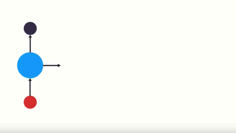
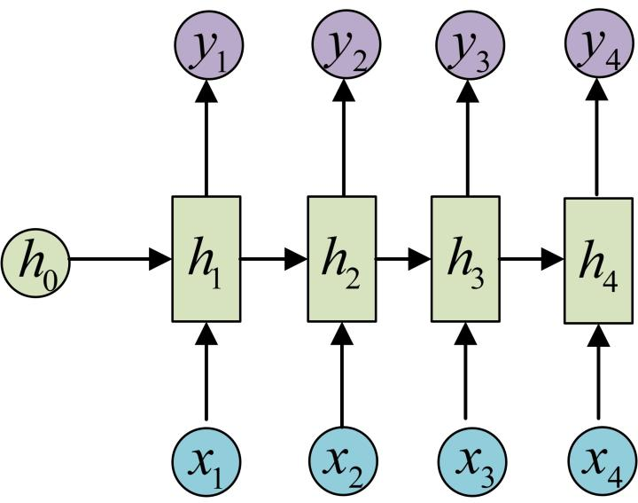
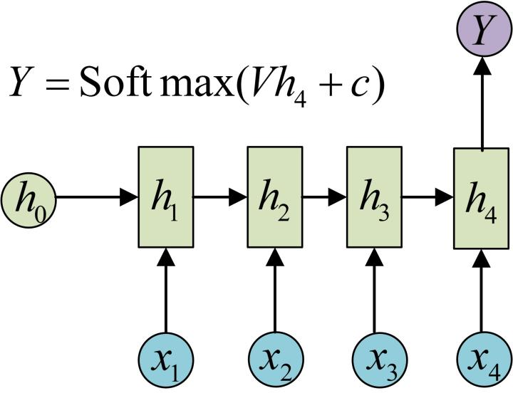
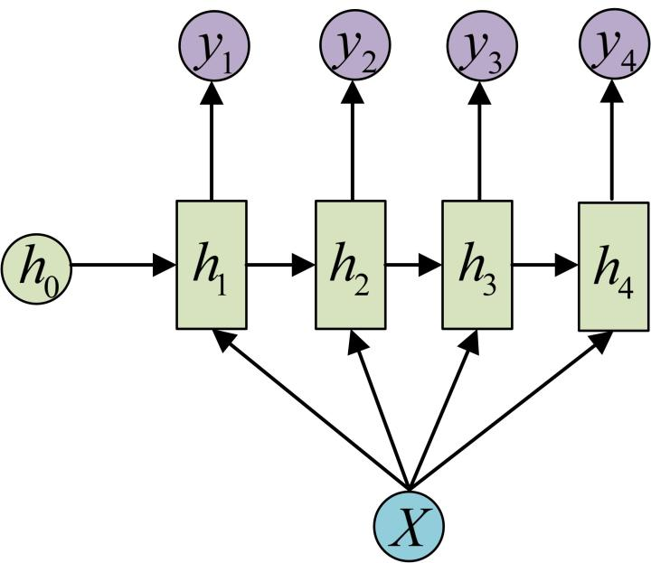
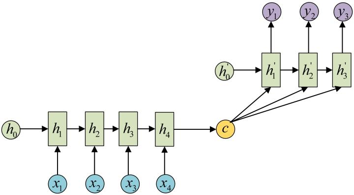
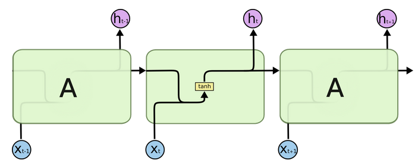
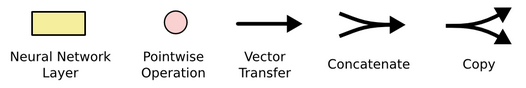
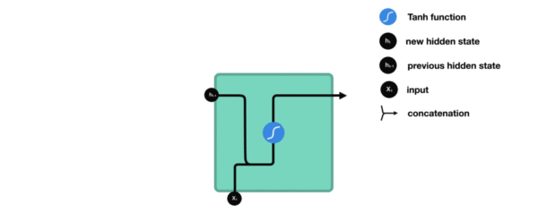
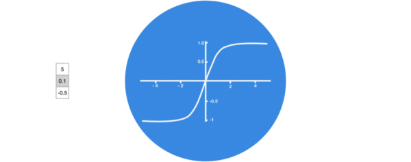

## 1、文本预处理

### 1.1 获取数据集形容词词云

```properties
作用:根据高频形容词词云显示, 我们可以对当前语料质量进行简单评估, 同时对违反语料标签含义的词汇进行人工审查和修正, 来保证绝大多数语料符合训练标准
```

```python
"""生成并展示对应的词云，便于快速评估语料质量。"""
import pandas as pd
import jieba.posseg as pseg
from wordcloud import WordCloud
from itertools import chain
import matplotlib.pyplot as plt

# --------------------------------------------------
# 1. 对单条文本提取形容词
# --------------------------------------------------

def get_a_list(text):
    """使用 jieba 的词性标注功能提取形容词（词性标记为 'a'）"""
    r = []
    # 使用jieba的词性标注方法切分文本 找到形容词存入到列表中返回
    for g in pseg.lcut(text):  # pseg.lcut 返回形如 [pair('美丽', 'a'), pair('天空', 'n'), ...]
        if g.flag == "a":
            r.append(g.word)
    return r

# --------------------------------------------------
# 2. 根据形容词列表生成词云
# --------------------------------------------------
def  get_word_cloud(keywords_list):
    """接收形容词列表，生成并显示词云"""
    
    # 实例化词云生成器对象
    wordcloud = WordCloud(font_path="./SimHei.ttf", max_words=100, background_color='white')
    # 准备数据
    keywords_string = " ".join (keywords_list)
    # 产生词云
    wordcloud.generate(keywords_string)

    # 画图
    plt.figure()
    plt.imshow(wordcloud, interpolation="bilinear")
    plt.axis('off')
    plt.show()


# --------------------------------------------------
# 3. 主流程：分别对训练集正 / 负样本绘制词云
# --------------------------------------------------

def dm_word_cloud():
    """读取训练集，分别生成正负样本的形容词词云"""
    
    # 读取训练集
    train_data = pd.read_csv(filepath_or_buffer='./cn_data/train.tsv', sep='\t')
    
    # ---------- 正样本 ----------
    p_train_data = train_data[train_data['label'] == 1 ]['sentence']

    # 把每条句子的形容词列表打平成一维列表
    p_a_train_vocab = list(chain(*map(lambda x: get_a_list(x) , p_train_data)))

    # 调用绘制词云函数
    get_word_cloud(p_a_train_vocab)

    # ---------- 负样本 ----------
    n_train_data = train_data[train_data['label'] == 0 ]['sentence']

    n_a_train_vocab = chain(*map(lambda x: get_a_list(x) , n_train_data)  )

    # 调用绘制词云函数
    get_word_cloud(n_a_train_vocab)
```


### 1.2 文本特征处理

```properties
文本特征处理的作用:文本特征处理包括为语料添加具有普适性的文本特征, 如:n-gram特征, 以及对加入特征之后的文本语料进行必要的处理, 如: 长度规范,这些特征处理工作能够有效的将重要的文本特征加入模型训练中, 增强模型评估指标。
```

**常见方法**

- 添加 n-gram 特征
- 文本长度规范

#### 1.2.1 添加N-gram特征

**定义：**给定一段文本序列, 其中`n`个词或字的相邻共现特征即**n-gram**特征, 常用的**n-gram**特征是**bi-gram**和**tri-gram**特征, 分别对应`n`为2和3。

**示例**

- 原始分词列表`["是谁", "敲动", "我心"]`
- 数值映射（假设）`[1, 34, 21]`
- 添加 bi-gram 特征
  - “是谁”+“敲动” → `1000`
  - “敲动”+“我心” → `1001`
- 最终特征序列
  `[1, 34, 21, 1000, 1001]`

代码：

```python
# 一般n-gram中的n取2或者3, 这里取2为例
ngram_range = 2

def create_ngram_set(input_list):
    """
    从数值列表中提取所有 n-gram 特征（以元组形式返回）。
    
    参数
    ----
    input_list : list[int]
        已映射为整数的分词列表，元素范围建议 1‒25000。
    
    返回
    ----
    set[tuple[int, ...]]
        所有不重复的 n-gram 元组集合。
    
    示例
    ----
    >>> create_ngram_set([1, 3, 2, 1, 5, 3])
    {(1, 3),(3, 2),(2, 1),(1, 5),(5, 3)}
    """ 
    return set(zip(*[input_list[i:] for i in range(ngram_range)]))
```


#### 1.2.2 文本长度规范及其作用

**作用**

- 绝大多数深度学习模型要求 **输入张量尺寸固定**（即每条文本长度一致）。
- 因此，需根据语料长度分布，选择一个 **合理长度 `cutlen`**（通常覆盖约 90 % 的句子）。
- **超长文本** → 截断
- **不足文本** → 用 `0` 填充


**实现代码**：

```python
from tensorflow.keras.preprocessing.sequence import pad_sequences

# cutlen 由语料长度分布分析得出，这里假设覆盖 90 % 句子所需最短长度为 10
cutlen = 10

def padding(x_train):
    """
    对输入文本张量进行长度规范（截断 / 填充至 cutlen）

    参数
    ----
    x_train : list[list[int]]
        已映射为整数的分词列表集合，形如：
        [[1, 32, 32, 61],
         [2, 54, 21, 7, 19]]

    返回
    ----
    numpy.ndarray
        形状为 (样本数, cutlen) 的二维数组，不足补 0，超长截断
    """
    # 直接使用 Keras 提供的 pad_sequences 完成截断与填充
    return pad_sequences(x_train, maxlen=cutlen, padding='post', truncating='post')  #  post默认是后比如补齐或者截断，pre:默认在前面补齐或者截断
```

**调用示例**

```python
# 假设 x_train 中有两条文本
x_train = [
    [1, 23, 5, 32, 55, 63, 2, 21, 78, 32, 23, 1],  # 长度 12 > cutlen，将被截断
    [2, 32, 1, 23, 1]                              # 长度 5  < cutlen，将被补 0
]

res = padding(x_train)
print(res)
```

**输出效果**

```protobuf
[[ 1 23  5 32 55 63  2 21 78 32]   # 截断至 10
 [ 2 32  1 23  1  0  0  0  0  0]]  # 填充至 10
```


### 1.3 文本数据增强方法

##### 1. 定义

回译数据增强目前是文本数据增强方面效果较好的增强方法, 一般基于google、有道等翻译接口, 将文本数据翻译成另外一种语言(**一般选择小语种**)，之后再翻译回原语言, 即可认为得到与与原语料同标签的新语料, 新语料加入到原数据集中即可认为是对原数据集数据增强.

##### 2. 优势

- 实现简单，调用翻译 API 即可
- 生成语料质量高，语义基本保持一致

##### 3. 主要问题

- **短文本重复率高**：短句在多语翻译后仍可能与原句高度相似，未能有效扩大特征空间

##### 4. 解决方案

- **多跳翻译**：中文 → 韩文 → 日文 → 英文 → 中文
- **经验上限**：连续翻译 ≤ 3 次，否则效率低、语义失真


##### 5. 代码实现（基于有道翻译接口）

```python
import requests

def back_translate(text: str,
                   src: str = "zh-CHS",
                   mid: str = "en",
                   ) -> str:
    """
    回译数据增强：src -> mid -> src
    :param text: 原始中文文本
    :param src: 源语言代码（默认中文）
    :param mid: 中间语言代码（默认英文）
    :return: 回译后的中文文本
    """
    url = "http://fanyi.youdao.com/translate"

    # 第一次翻译：src -> mid
    data1 = {
        "from": src,
        "to": mid,
        "i": text,
        "doctype": "json"
    }
    res1 = requests.post(url, params=data1).json()
    text_mid = res1["translateResult"][0]["tgt"]

    # 第二次翻译：mid -> src
    data2 = {
        "from": mid,
        "to": src,
        "i": text_mid,
        "doctype": "json"
    }
    res2 = requests.post(url, params=data2).json()
    text_back = res2["translateResult"][0]["tgt"]

    return text_back


# =========== 调用示例 ===========
if __name__ == "__main__":
    original = "这个价格非常便宜"
    augmented = back_translate(original)
    print("原始文本:", original)
    print("回译文本:", augmented)
```


## 2、RNN模型

**1.1 定义**

**RNN**（Recurrent Neural Network，循环神经网络）

- **输入**：序列数据（如句子）。
- **特点**：网络内部具有“循环”结构，能够捕捉序列元素之间的**关系特征**。
- **输出**：通常也是序列，且长度可与输入相同或不同。

> 当前时间步的输入：当前时间步的输入+上一时间步的隐层输出


**1.2 单层 RNN 结构示意**


> 与传统前馈网络不同，RNN 的 **Hidden** 层不仅输出到下一层，还会**循环**回自身，形成“记忆”。


**1.3 按时间步展开（Unfold）**



> **循环机制**：上一时间步的隐状态 $H_{t-1}$ 会作为额外输入，与当前输入 $X_t$ 共同决定当前隐状态 $H_t$ 及输出 $O_t$。


### 2.1 RNN 的作用

**1. 适用场景**

利用序列内部依赖，特别适合**连续性**数据：

- 自然语言（文本、对话）
- 语音信号
- 时间序列（股票、传感器）

**2. NLP 典型任务**

- 文本分类
- 情感分析
- 意图识别
- 机器翻译
- 语言模型 / 文本生成

**小结**

- RNN 通过**循环结构**将历史信息持续传递，天然适配序列任务。
- 在 NLP 中，RNN 及其变体（LSTM、GRU、Transformer）已成为意图识别、机器翻译等任务的核心技术。


### 2.2 RNN模型的分类

#### 1. 按 输入-输出结构 划分

| 结构类型             | 示意图      | 特点                        | 典型应用                 |
| -------------------- | ----------- | --------------------------- | ------------------------ |
| **N vs N**           | `N → … → N` | 输入序列长度 = 输出序列长度 | 诗歌、对联生成           |
| **N vs 1**           | `N → 1`     | 输入序列任意长，输出单个值  | 文本分类、情感分析       |
| **1 vs N**           | `1 → … → N` | 输入单个值，输出任意长序列  | 图片 → 文字              |
| **N vs M** (Seq2Seq) | `N → … → M` | 输入与输出长度可不同        | 机器翻译、摘要、阅读理解 |


##### N vs N-RNN

- **最基础** 的 RNN 结构。
- 由于 **输入长度 = 输出长度**，适用面较窄，常用于 **等长文本生成**（如藏头诗、对联）。



##### N vs 1-RNN

- 在 **最后一个时间步的隐状态 $h_T$** 上做线性变换，再经 **Sigmoid / Softmax** 得到唯一输出：

$$
y = \text{Softmax}(Wh_T + b)
$$

- 广泛用于 **文本分类**、**意图识别** 等任务。



##### 1 vs N-RNN

- 把 **单个输入向量**（如图片特征）作为 **每一时间步的额外条件**，与上一时刻隐状态一起参与计算
- 典型场景：**图片生成文字任务**。



##### N vs M-RNN（Seq2Seq）

- 由 **编码器 (Encoder)** + **解码器 (Decoder)** 组成：
  - 编码器将 **任意长输入序列** 压缩为 **上下文向量 c**。
  - 解码器以 **c** 为初始状态，逐步生成 **任意长输出序列**。
- 最早用于 **机器翻译**，现已扩展到 **摘要、对话、阅读理解** 等。




#### 2. 按 内部构造 划分

| 类型     | 说明                                  |
| -------- | ------------------------------------- |
| 传统 RNN | 最朴素的循环结构，梯度消失/爆炸风险高 |
| LSTM     | 引入门控机制，解决长期依赖问题        |
| Bi-LSTM  | 双向 LSTM，同时建模前后文信息         |
| GRU      | 门控单元简化版，参数更少，训练更快    |
| Bi-GRU   | 双向 GRU，兼顾速度与性能              |


## 3、传统RNN模型

### 3.1 结构示意



> 结构解释图：



**符号说明**

- **h(t-1)**：上一时间步的隐状态（Hidden State）
- **x(t)**：当前时间步的输入向量
- **h(t)**：当前时间步输出的隐状态，作为下一时间步的输入之一


### 3.2 计算流程（Step-by-Step）

1. **拼接**：将 $x(t)$ 与 $h(t-1)$ 按列拼接成新向量
   $$
   z_t = [x_t; h_{t-1}]
   $$
   

   

2. **线性变换**：拼接后的向量经过全连接层

$$
u_t = Wz_t + b
$$

3. **非线性激活**：使用 **tanh** 压缩数值范围

$$
h_t = \tanh(u_t)
$$


### 3.3 最终公式

$$
h_t = \tanh(W[x_t; h_{t-1}] + b)
$$


### 3.4 激活函数 tanh 的作用

- **值域压缩**：将输出限制在 (-1, 1) 之间，防止梯度爆炸
- **非线性映射**：为网络引入非线性，增强对复杂序列关系的表达能力




  **RNN模型实现**

  ```python
  import torch
  import torch.nn as nn
  
  # ------------------------------------------------------------
  # 1. 定义模型
  # ------------------------------------------------------------
  # input_size  : 每个时间步输入的特征维度（词向量维度）
  # hidden_size : 隐藏层神经元个数
  # num_layers  : 隐藏层数量，默认 1
  rnn = nn.RNN(input_size=5, hidden_size=6, num_layers=1)
  
  # 如果想加深网络，可改成：
  # rnn = nn.RNN(input_size=5, hidden_size=6, num_layers=2)
  
  # ------------------------------------------------------------
  # 2. 构造输入
  # ------------------------------------------------------------
  # 维度含义：(seq_len, batch_size, input_size)
  # - seq_len    : 序列长度（一个句子有多少词 / 字符）
  # - batch_size : 批次样本数量
  # - input_size : 词向量维度
  input = torch.randn(4, 3, 5)    # 例如 一个句子4个词、3 条句子、5 维向量
  
  # ------------------------------------------------------------
  # 3. 构造初始隐藏状态 h0
  # ------------------------------------------------------------
  # 维度含义：(num_layers * num_directions, batch_size, hidden_size)
  # - num_layers * num_directions  对于单向 RNN 通常等于 num_layers
  h0 = torch.randn(1, 3, 6)
  
  # 若 num_layers 改为 2，则 h0 第一维也要改成 2：
  # h0 = torch.randn(2, 3, 6)
  
  # ------------------------------------------------------------
  # 4. 一次性输入整个序列
  # ------------------------------------------------------------
  output, hn = rnn(input, h0)
  
  print("【一次性输入】")
  print(f"output 形状: {output.shape}")
  print(f"output 数值: {output}\n")
  print(f"hn     形状: {hn.shape}")
  print(f"hn     数值: {hn}\n")
  
  # ------------------------------------------------------------
  # 5. 逐词输入（循环时间步）
  # ------------------------------------------------------------
  seq_len = input.shape[0]
  h = h0  # 用同一初始隐藏状态
  
  print("【逐词输入】")
  for idx in range(seq_len):
      # 取第 idx 个时间步：(1, batch_size, input_size)
      step_input = input[idx].unsqueeze(0)
      output, h = rnn(step_input, h)
  
      print(f"第 {idx + 1} 个时间步")
      print(f"  output 形状: {output.shape}, 数值: {output}")
      print(f"  h      形状: {h.shape}, 数值: {h}\n")
  ```
