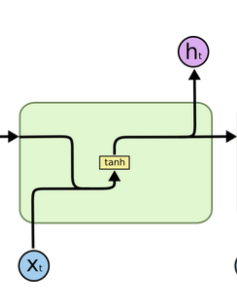
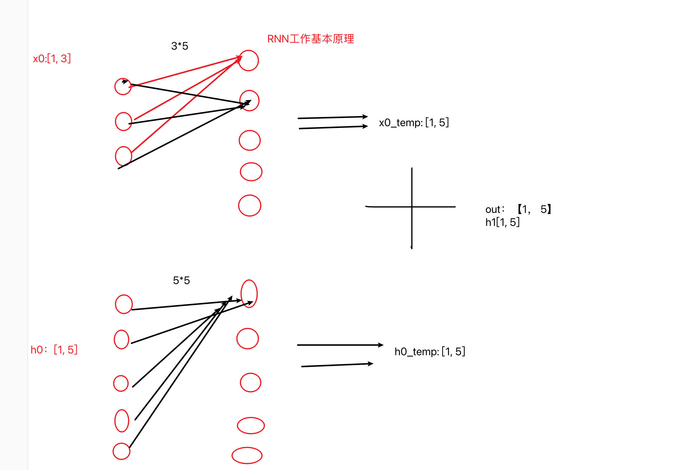
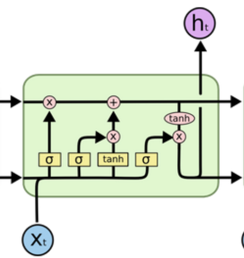
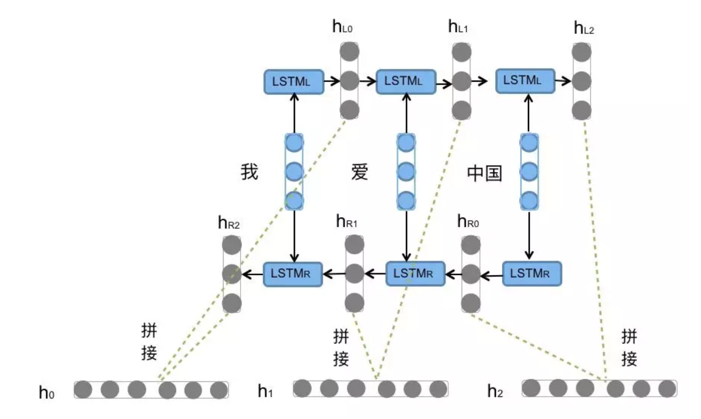
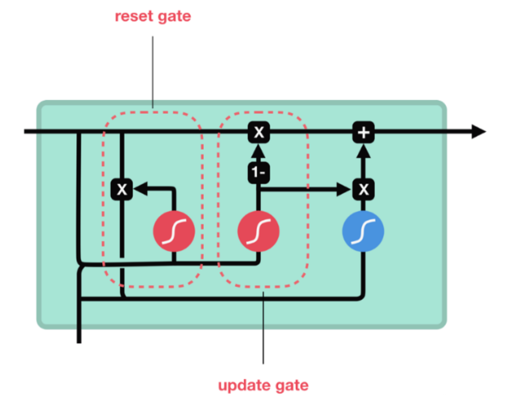

## RNN及其变体

### RNN模型

- 定义：

```properties
循环神经网络：一般接受的一序列进行输入，输出也是一个序列
```

- 作用和应用场景：

```properties
RNN擅长处理连续语言文本，机器翻译、文本生成、文本分类、摘要生成
```

- RNN模型的分类

  - 根据输入与输出结构

  ```properties
  N Vs N : 输入和输出等长，应用场景：对联生成；词性标注；NER
  N Vs 1 : 输入N，输出为单值，应用场景：文本分类
  1 Vs N : 输入是一个，输出为N，应用场景：图片文本生成
  N Vs M : 输入和输出不等长，应用场景：文本翻译、摘要总结
  ```

  - 根据RNN内部结构

  ```properties
  传统RNN
  LSTM
  BI-LSTM
  GRU
  BI-GRU
  ```

------

### 传统RNN模型

- 内部结构

  - 输入：当前时间步xt和上一时间步输出的ht-1
  - 输出：ht和ot （一个时间步内：ht=ot）

  

  ------

  

- ------

  多层RNN的解析

  

- RNN模型实现

  ```python
  # 输入数据长度发生变化
  def  dm_rnn_for_sequencelen():
      '''
      第一个参数：input_size(输入张量x的维度)
      第二个参数：hidden_size(隐藏层的维度， 隐藏层的神经元个数)
      第三个参数：num_layer(隐藏层的数量)
      '''
      rnn = nn.RNN(5, 6, 1) #A
      '''
      第一个参数：sequence_length(输入序列的长度)
      第二个参数：batch_size(批次的样本数量)
      第三个参数：input_size(输入张量的维度)
      '''
      input = torch.randn(20, 3, 5) #B
      '''
      第一个参数：num_layer * num_directions(层数*网络方向)
      第二个参数：batch_size(批次的样本数)
      第三个参数：hidden_size(隐藏层的维度， 隐藏层神经元的个数)
      '''
      h0 = torch.randn(1, 3, 6) #C
  
      # [20,3,5],[1,3,6] --->[20,3,6],[1,3,6]
      output, hn = rnn(input, h0)  #
  
      print('output--->', output.shape)
      print('hn--->', hn.shape)
      print('rnn模型--->', rnn)
  
  # 程序运行效果如下： 
  output---> torch.Size([20, 3, 6])
  hn---> torch.Size([1, 3, 6])
  rnn模型---> RNN(5, 6)
  
  ```

### LSTM模型

- 内部结构
  - 遗忘门
  - 输入门
  - 细胞状态
  - 输出门
- BI-LSTM模型：



- LSTM模型代码实现

  ```python
  import torch
  import torch.nn as nn
  def dm02_lstm_for_direction():
      '''
      第一个参数：input_size(输入张量x的维度)
      第二个参数：hidden_size(隐藏层的维度， 隐藏层的神经元个数)
      第三个参数：num_layer(隐藏层的数量)
      bidirectional = True
      #
      '''
      lstm = nn.LSTM(5, 6, 1, batch_first = True)
  
      '''
      input
      第一个参数：batch_size(批次的样本数量)
      第二个参数：sequence_length(输入序列的长度)
      第三个参数：input_size(输入张量的维度)
      '''
      input = torch.randn(4, 10, 5)
  
      '''
      hn和cn
      第一个参数：num_layer * num_directions(层数*网络方向)
      第二个参数：batch_size(批次的样本数)
      第三个参数：hidden_size(隐藏层的维度， 隐藏层神经元的个数)
      '''
      h0 = torch.zeros(1, 4, 6)
      c0 = torch.zeros(1, 4, 6)
  
      # 数据送入模型
      output, (hn, cn) = lstm(input, (h0, c0))
      print(f'output-->{output.shape}')
      print(f'hn-->{hn.shape}')
      print(f'cn-->{cn.shape}')
  ```

- BI-LSTM

```properties
定义: 不改变原始的LSTM模型内部结构，只是将文本从左到右计算一遍，再从右到左计算一遍，把最终的输出结果拼接得到模型的完整输出
```



### GRU模型

- 内部结构
  - 更新门
  - 重制门
- GRU模型：



- GRU模型代码实现

  ```python
  # coding:utf-8
  import torch
  import torch.nn as nn
  
  # 模型参数发生变化对其他输入参数的影响
  def  dm01_gru_():
      '''
      第一个参数：input_size(输入张量x的维度)
      第二个参数：hidden_size(隐藏层的维度， 隐藏层的神经元个数)
      第三个参数：num_layer(隐藏层的数量)
      # batch_first = True，代表batch_size 放在第一位
      '''
      gru = nn.GRU(5, 6, 1, batch_first=True)
      print(gru.all_weights)
      print(gru.all_weights[0][0].shape)
      print(gru.all_weights[0][1].shape)
  
      '''
      第一个参数：batch_size(批次的样本数量)
      第二个参数：sequence_length(输入序列的长度)
      第三个参数：input_size(输入张量的维度)
      '''
      input = torch.randn(4, 3, 5)
  
      '''
      第一个参数：num_layer * num_directions(层数*网络方向)
      第二个参数：batch_size(批次的样本数)
      第三个参数：hidden_size(隐藏层的维度， 隐藏层神经元的个数)
      '''
  
      h0 = torch.randn(1, 4, 6)
  
      # 将数据送入模型得到结果
      output, hn = gru(input, h0)
      print(f'output--》{output}')
      print(f'hn--》{hn}')
  
  if __name__ == '__main__':
      dm01_gru_()
  ```

- BI-GRU

```properties
定义: 不改变原始的GRU模型内部结构，只是将文本从左到右计算一遍，再从右到左计算一遍，把最终的输出结果拼接得到模型的完整输出
```

- 优缺点
  - 优点：相比LSTM，结构较为简单，能够和lstm一样缓解梯度消失问题
  - 缺点：RNN系列模型不能实现并行运算，数据量大的话，效率比较低


