## 1、RNN变体

### 1.1 LSTM模型

#### 1. 定义

**LSTM**（Long Short-Term Memory）也称长短时记忆结构。它是传统 RNN 的变体，**能够捕捉长序列语义关联并缓解梯度消失/爆炸**。结构更复杂，核心由 4 部分组成：

- 遗忘门
- 输入门
- 细胞状态
- 输出门


#### 2. LSTM的内部结构图

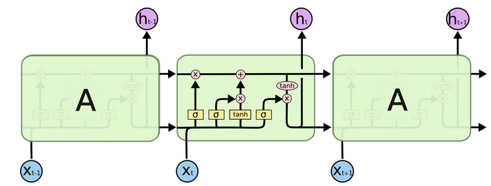

##### 1. 遗忘门（Forget Gate）

- 遗忘门结构

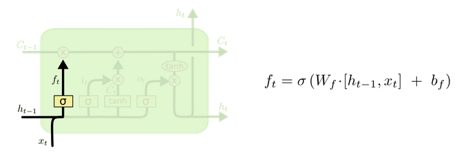

- 计算公式
  $$
  f_t = σ(W_f · [h_{t-1}, x_t] + b_f)
  $$
  
- 结构要点

  - 将当前输入 $x_t$ 与上一时刻隐藏状态 $h_{t-1}$ 拼接 ➡ 全连接层 ➡ **Sigmoid** 激活➡得到$f_t$。
  - $f_t$ 被看作“门值”，决定遗忘多少上一时刻细胞状态 $C_{t-1}$ 的信息。


- 激活函数sigmiod的作用

> 用于帮助调节流经网络的值, sigmoid函数将值压缩在0和1之间

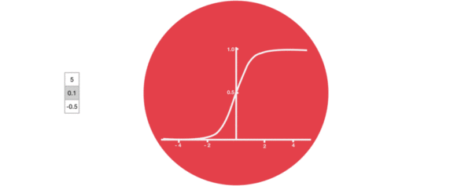

- 工作流示意

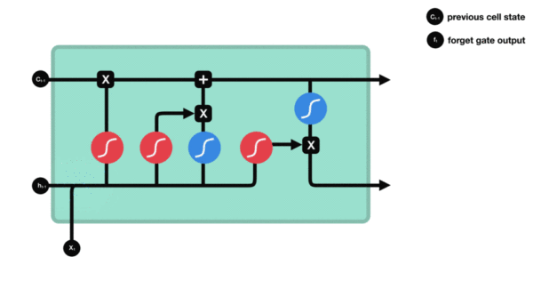


##### 2. 输入门（Input Gate）

- 输入门结构

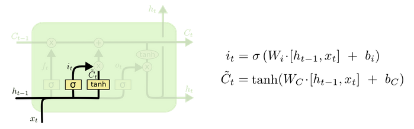

- 计算公式
  $$
  i_t = \sigma(W_i \cdot [h_{t-1}, x_t] + b_i) \quad \text{(门值，决定保留多少新信息)}\\
  \\\tilde{C}_t = \tanh(W_c \cdot [h_{t-1}, x_t] + b_c)\quad \text{(候选细胞状态)}
  $$
  

- 结构要点
  - 第一个公式用于产生输入门的门控值，其形式与遗忘门公式相似，主要区别在于作用的目标不同。该公式的作用是确定需要对多少输入信息进行过滤。
  - 第二个公式则与传统RNN的内部结构计算一致，但在LSTM中，它得到的是当前细胞状态，而非经典RNN中的隐含状态。


- 工作流示意

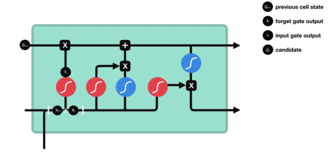

##### 3. 细胞状态更新（Cell State Update）

- 细胞状态更新图

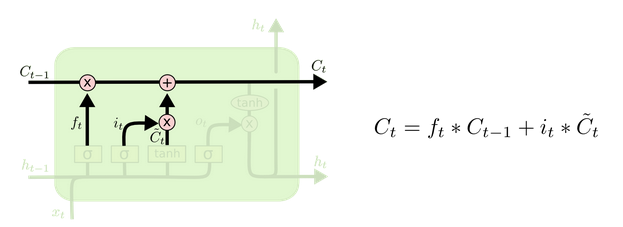


- 计算公式

$$
C _ { t } = f _ { t } * C _ { t - 1 } + i _ { t } * \tilde { C } _ { t }
$$


- 结构要点
  - 无全连接层，仅逐元素乘、加操作。
  - $f_t$ 对旧信息做“遗忘”，$i_t$ 对新信息做“写入”。
  - 更新后的 $C_t$ 作为下一时刻输入的一部分。


- 工作流示意

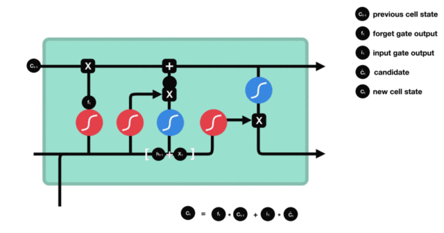

##### 4. 输出门（Output Gate）

- 输出门结构图

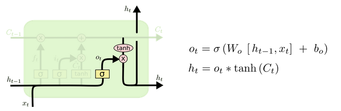


- 计算公式

$$
o_t = \sigma\left(W_o\ [ h_{t-1}, x_t]\ +\ b_o\right)\\
\\h_t = o_t * \tanh\left(C_t\right)
$$


- 结构要点
  - 计算模式与遗忘门、输入门相同。
  - 用更新后的 $C_t$ 经 **tanh** 激活，再与门值 $o_t$ 逐元素相乘，得到当前隐藏状态 $h_t$。
  - $h_t$ 成为下一时刻的输入之一。


- 工作流示意

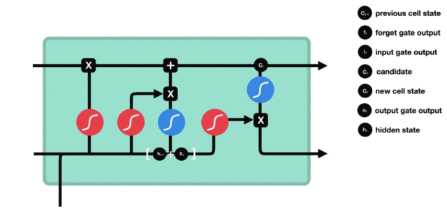


#### 3. BI-LSTM模型：

Bi-LSTM（Bidirectional LSTM，双向 LSTM）并未改变 LSTM 内部的任何结构，而是将标准 LSTM **按两个相反方向各运行一次**，再把两者的输出 **拼接** 作为最终结果。

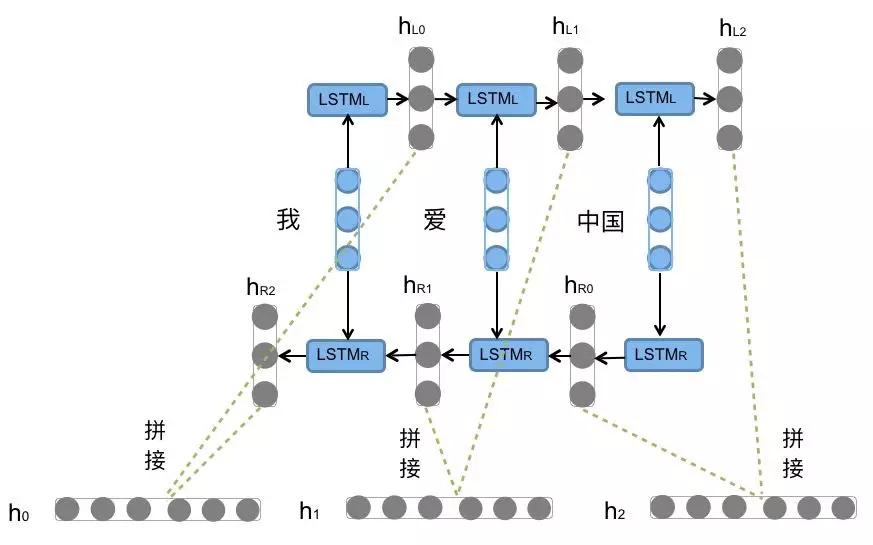

> 【Bi-LSTM 结构示意】
>
> 输入序列：我爱中国
> 处理方式：
>
> - 从左 → 右：正向 LSTM
> - 从右 → 左：反向 LSTM
>
> 将两次得到的张量拼接 → 最终输出

- 优点
  - 能同时捕捉语法中的前置/后置特征
  - 增强语义关联

- 代价
  - 参数量与计算复杂度 **≈ ×2**
  - 需结合语料规模与算力评估后决定是否使用


#### 4. 使用Pytorch构建LSTM模型

```python
import torch
import torch.nn as nn


def dm02_lstm_for_direction():
    """
    构建并运行一个 LSTM 示例。
    关键参数：
        input_size     : 每个时间步输入向量x的维度
        hidden_size    : 隐藏层的维度，隐藏层神经元个数
        num_layers     : LSTM 隐藏层堆叠层数
        batch_first    : 若 True，输入/输出张量形状为 (batch, seq, feature)
        bidirectional  : 若 True，则使用双向 LSTM
    """

    # 1. 定义网络
    lstm = nn.LSTM(
        input_size=5,      # 每个时间步的输入维度
        hidden_size=6,     # 隐藏层神经元个数
        num_layers=1,      # LSTM 层数
        batch_first=True,  # 输入/输出 shape 为 (batch, seq, feature)
    )

    # 2. 构造随机输入
    
    #    shape: (batch_size, sequence_length, input_size)
    '''
    input
    	第一个参数：batch_size(批次的样本数量)
    	第二个参数：sequence_length(输入序列的长度)
    	第三个参数：input_size(输入张量的维度)
    '''
    x = torch.randn(4, 10, 5)

    # 3. 初始化隐藏状态 h0 与细胞状态 c0
    #    shape: (num_layers * num_directions, batch_size, hidden_size)
    '''
    hn和cn
    	第一个参数：num_layer * num_directions(层数*网络方向)
    	第二个参数：batch_size(批次的样本数)
    	第三个参数：hidden_size(隐藏层的维度， 隐藏层神经元的个数)
    '''
    num_directions = 2 if lstm.bidirectional else 1
    h0 = torch.zeros(lstm.num_layers * num_directions, 4, 6)
    c0 = torch.zeros(lstm.num_layers * num_directions, 4, 6)

    # 4. 前向传播
    output, (hn, cn) = lstm(x, (h0, c0))

    # 5. 打印输出信息
    print(f"output shape : {output.shape}")  # (batch, seq, hidden_size * num_directions)
    print(f"hn     shape : {hn.shape}")      # (num_layers * num_directions, batch, hidden_size)
    print(f"cn     shape : {cn.shape}")      # 同上


if __name__ == "__main__":
    dm02_lstm_for_direction()
```


#### 5. LSTM优缺点

| 维度 | 描述                                                         |
| ---- | ------------------------------------------------------------ |
| 优势 | 门控结构（输入门、遗忘门、输出门）显著缓解长序列中的梯度消失或爆炸，效果优于传统 RNN |
| 缺点 | 结构复杂，参数量与计算量大，在相同算力下训练效率低于传统 RNN |

> **为什么门控结构能缓解长序列中的梯度消失 / 爆炸？**
>
> 一句话总结：  LSTM 把“连乘”变成了“累加”，梯度在时序上不再被反复乘以 0–1 之间的小数，而是可以沿一条“加法高速公路”直接回传，因此显著缓解了梯度消失 / 爆炸。
>
> **1. 传统 RNN 的梯度为什么消失**
>
> 反向传播时，时刻 $t$ 的梯度要乘上  
> $$
> \prod_{k=t}^{1} \frac{\partial h_k}{\partial h_{k-1}}
> $$
> 因为 $\frac{\partial h_k}{\partial h_{k-1}}$ 里包含 $\tanh'(\cdot)\in(0,1)$ 和权重矩阵 $W$，多次相乘后要么迅速衰减（消失），要么绝对值过大（爆炸）。
>
> **2. LSTM 在数学上做了什么**
>
> 门控结构把隐藏状态拆成两条通路：
>
> - **细胞状态** $C_t$：更新公式是**加法**  
>   $$
>   C_t = f_t \odot C_{t-1} + i_t \odot g_t
>   $$
>   其中 $f_t,i_t \in (0,1)$。
>
> - **候选状态**  
>   $$
>   g_t = \tanh\!\bigl(W_g [h_{t-1}, x_t] + b_g\bigr)
>   $$
>
> 反向求导时  
> $$
> \frac{\partial C_t}{\partial C_{t-1}} = f_t \quad(\text{元素级})
> $$
> 当 $f_t \approx 1$ 时，梯度可直接沿 $C$ 这条“加法路径”**线性**地传回任意远的时间步，不受连乘小数的累积衰减；  
>
> 当 $f_t \approx 0$ 时，梯度被“遗忘”，实现选择性截断，从而抑制爆炸。
>
> **3. 门控的具体作用**
>
> | 门               | 功能说明                                                     |
> | ---------------- | ------------------------------------------------------------ |
> | **遗忘门** $f_t$ | 决定保留多少旧信息，给梯度一条稳定的加法通道。               |
> | **输入门** $i_t$ | 控制新信息写入多少，避免一次性把梯度全部截断。               |
> | **输出门** $o_t$ | 把 $C_t$ 映射到隐藏状态 $h_t$，保证非线性表达能力，同时不破坏 $C_t$ 的梯度流。 |
>
> 因此，门控机制让 LSTM 在需要长程依赖时保持梯度（$f_t \approx 1$），在需要短程依赖时遗忘梯度（$f_t \approx 0$），从而显著缓解长序列中的梯度消失或爆炸。


### 1.2 GRU模型

#### 1. 定义

GRU（Gated Recurrent Unit：门控循环单元）是传统RNN的一种变体，与LSTM类似，能够有效捕捉长序列数据中的语义关联，缓解梯度消失或爆炸的问题。
相较于LSTM，GRU结构更简单，计算更高效。

**核心结构：**GRU主要由以下两部分组成：

- **更新门（Update Gate）**
- **重置门（Reset Gate）**


#### 2. GRU内部结构图

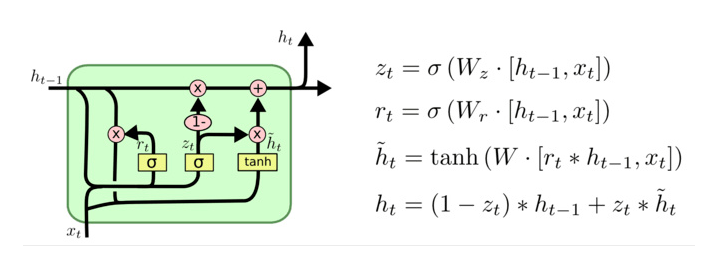

##### 1. 计算流程与公式说明

| 步骤           | 描述                                                         | 公式                                                    |
| -------------- | ------------------------------------------------------------ | ------------------------------------------------------- |
| ① 计算更新门   | 拼接当前输入 $x_t$ 与上一隐藏状态 $h_{t-1}$，经线性变换与Sigmoid激活 | $z_t = \sigma(W_z \cdot [h_{t-1}, x_t])$                |
| ② 计算重置门   | 同上，但权重矩阵不同                                         | $r_t = \sigma(W_r \cdot [h_{t-1}, x_t])$                |
| ③ 重置隐藏状态 | 重置门控制上一隐藏状态保留程度                               | $\tilde{h}_t = \tanh(W \cdot [r_t \odot h_{t-1}, x_t])$ |
| ④ 更新隐藏状态 | 更新门控制新旧信息融合程度                                   | $h_t = (1 - z_t) \odot h_{t-1} + z_t \odot \tilde{h}_t$ |

注：

- *σ* 表示Sigmoid激活函数
- ⊙ 表示逐元素乘法（element-wise multiplication）


##### 2. 更新门与重置门机制详解

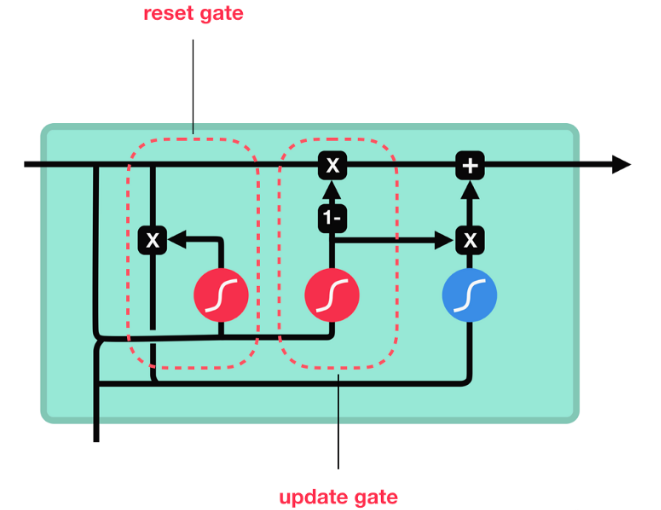

- **更新门（Update Gate）**：决定当前隐藏状态中有多少新信息需要保留，多少旧信息需要遗忘。
- **重置门（Reset Gate）**：决定上一时刻隐藏状态中有多少信息需要被忽略或重置。

当更新门值趋近于 **1** 时，当前输入的新信息占主导；

当更新门值趋近于 **0** 时，上一时刻的隐藏状态几乎被完全保留。


#### 3. Bi-GRU（双向GRU）简介

Bi-GRU与Bi-LSTM的逻辑相同，都是不改变其内部结构， 而是将模型应用两次且方向不同， 再将两次得到的LSTM结果进行拼接作为最终输出。


#### 4. 使用Pytorch构建GRU模型

```python
"""
演示 PyTorch 中 GRU 模块的基本用法：
1. 如何构造 GRU 网络
2. 如何构造输入张量 input 和初始隐藏状态 h0
3. 前向计算后得到的 output 与 hn 的维度含义
"""

import torch
import torch.nn as nn


def demo_gru():

    # -------------------------------------------------
    # 1. 构造 GRU 层
    # -------------------------------------------------
    # 参数说明：
    #   input_size  : 每个时间步输入向量x的维度
    #   hidden_size : 隐藏状态的维度（也是输出的维度）
    #   num_layers  : GRU 层数
    #   batch_first : True → 输入张量形状为 (batch, seq_len, input_size)
    gru = nn.GRU(input_size=5,
                 hidden_size=6,
                 num_layers=1,
                 batch_first=True)

    # 打印 GRU 的所有权重矩阵（用于调试或查看参数名）
    print("GRU 权重列表:", gru.all_weights)
    # 查看第一层权重 W_ih 和 W_hh 的形状
    print("W_ih 形状:", gru.all_weights[0][0].shape)  # (3*hidden_size, input_size)
    print("W_hh 形状:", gru.all_weights[0][1].shape)  # (3*hidden_size, hidden_size)

    # -------------------------------------------------
    # 2. 构造输入张量与初始隐藏状态
    # -------------------------------------------------
    # 输入张量 input 形状：(batch_size, sequence_length, input_size)
    batch_size = 4
    seq_len = 3
    input_size = 5
    input = torch.randn(batch_size, seq_len, input_size)

    # 初始隐藏状态 h0 形状：(num_layers * num_directions, batch_size, hidden_size)
    # 此处 num_directions = 1（单向 GRU），num_layers = 1
    h0 = torch.randn(1, batch_size, 6)

    # -------------------------------------------------
    # 3. 前向计算
    # -------------------------------------------------
    output, hn = gru(input, h0)

    # -------------------------------------------------
    # 4. 打印结果
    # -------------------------------------------------
    # output 形状：(batch_size, seq_len, hidden_size)
    # 包含每个时间步最后一层的隐藏状态
    print("output 形状:", output.shape)
    print("output:\n", output)

    # hn 形状：(num_layers * num_directions, batch_size, hidden_size)
    # 包含最后一个时间步的隐藏状态，可用于继续 RNN 或作为编码结果
    print("hn 形状:", hn.shape)
    print("hn:\n", hn)


if __name__ == "__main__":
    # 脚本入口
    demo_gru()
```


#### 5. GRU 优缺点

**优势**

- 与 LSTM 作用相同：在捕捉长序列的语义关联时，能够有效抑制梯度消失或爆炸，效果优于传统 RNN。
- 计算更高效：相比 LSTM，GRU 参数更少、计算复杂度更低，训练速度更快。

劣势

- 梯度问题依旧存在：仍无法完全解决梯度消失，极端长序列下表现受限。
- 无法并行计算：作为 RNN 变体，GRU 继承了 RNN 的时序递归结构，导致计算无法并行化；随着数据量和模型规模的增长，这一瓶颈愈发突出。
