## 1、注意力机制的由来：解决了什么问题？

### 1.1 背景：Seq2Seq 模型在机器翻译中的应用

在引入注意力机制之前，我们先简单了解**Seq2Seq（Sequence to Sequence）**模型在机器翻译中的基本流程。

**示例：中→英翻译**

**输入**：欢迎来北京

**输出**：welcome to Beijing

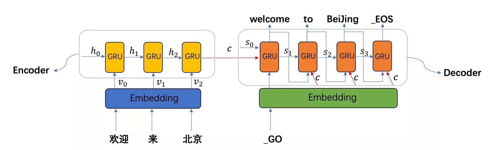

**模型结构**：

- **Encoder（编码器）**：将输入序列（如中文）编码为一个**中间语义向量 c**。
- **Decoder（解码器）**：基于向量 c 和每一步的隐状态，逐步生成目标序列（如英文）。

**流程图示意**：

```
欢迎 来 北京 → Encoder → 语义向量 c → Decoder → welcome to Beijing
```


### 1.2 原始 Seq2Seq 模型存在的问题：

- **长句处理困难：**输入序列过长时，编码器难以将所有信息压缩到一个固定长度的向量中，导致信息丢失，翻译准确率下降。
- **缺乏上下文相关性：**模型在生成每个词时，**没有区分输入序列中不同词的重要性**，无法灵活关注与当前输出最相关的部分。


## 2、什么是注意力机制

### **2.1 Attention概念：**

> “注意力机制”实际上就是想将人的感知方式、注意力的行为应用在机器上，让机器学会去感知数据中的重要和不重要的部分。

注意力机制（Attention Mechanism）最早应用于**视觉领域**，后在 2017 年随着 **Transformer** 模型的提出，被广泛应用于**自然语言处理（NLP）**和**计算机视觉（CV）**等领域。

其核心思想是：**模仿人类的注意力行为**，让模型在处理数据时，**聚焦于最关键的信息**，忽略次要内容。


**举例说明：**当我们看到一张图片时，大脑并不会一次性处理所有细节，而是**快速聚焦于最显眼的部分**。

> 图片中有“锦江饭店”字样，人眼会首先注意到它，而忽略电话号码、行人、背景招牌等信息。


### 2.2 在机器翻译中的应用：

注意力机制让模型在翻译每个词时，**动态地“关注”输入序列中最相关的部分**，而不是死板地依赖一个固定向量。

例如：翻译“欢迎来北京”时，生成“welcome”时更关注“欢迎”，生成“Beijing”时更关注“北京”。

| 项目       | 传统 Seq2Seq         | 引入注意力机制后             |
| ---------- | -------------------- | ---------------------------- |
| 信息处理   | 固定向量压缩全部信息 | 动态关注输入的不同部分       |
| 长句表现   | 容易信息丢失         | 保留更多细节，提升准确率     |
| 上下文理解 | 无差别处理所有词     | 有侧重地理解词与词之间的关系 |


## 3、注意力机制的分类与实现

**注意力机制的核心思想是：**

> 为每一个输入项（如图像区域、句子中的词）分配一个**权重**，表示模型对该部分的**关注程度**。
> 通过这种方式，模型可以**模拟人类注意力的聚焦行为**，提升性能，同时**降低计算量**。


### 3.1 注意力机制的三种类型

| 类型         | 特点                           | 权重范围               | 优点                         | 缺点                       |
| ------------ | ------------------------------ | ---------------------- | ---------------------------- | -------------------------- |
| **软注意力** | 对所有输入项加权求和           | 权重为 0~1 的连续值    | 信息全面，平滑处理           | 计算量大                   |
| **硬注意力** | 只选择部分输入项               | 权重为 0 或 1          | 节省计算资源                 | 可能丢失重要信息，训练困难 |
| **自注意力** | 输入内部元素之间互相计算注意力 | 权重由输入内部关系决定 | 捕捉长距离依赖，支持并行计算 | 模型结构复杂               |


### 3.2 Soft Attention（最常见）

> ✅ **重点**：注意力机制是**通用技术**，不依赖特定模型。以下以 **Encoder-Decoder 框架** 为例说明。

#### 3.2.1 普通 Encoder-Decoder 框架（无注意力）

**结构图示意**：

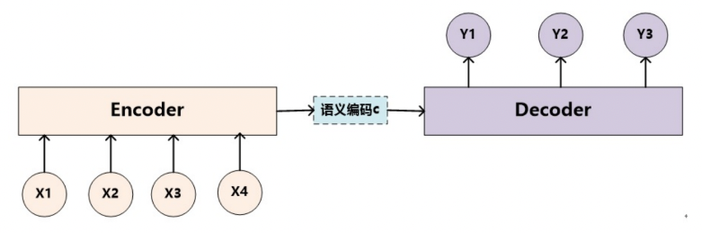

**特点**：

- 所有输入信息压缩为**一个固定向量 C**
- 解码器每一步都使用**相同的 C**
- **无区分地**对待输入序列中的所有词

**问题**：

> 无论生成哪个词，模型都“一视同仁”地看待输入，**缺乏重点**，翻译质量差。


#### 3.2.2 加入 Attention 的 Encoder-Decoder 框架

**动机示例**：

输入英文句子：**Tom chase Jerry**
目标中文翻译：**汤姆 追逐 杰瑞**

- 生成“杰瑞”时，显然 **Jerry** 更重要
- 普通模型中，所有词对“杰瑞”的贡献相同，**不合理**

**引入注意力后**：

- 为每个目标词分配一个**输入词的注意力权重**
- 示例：生成“杰瑞”时的注意力分布为：
  - (Tom, 0.3)
  - (chase, 0.2)
  - (Jerry, 0.5)

**结构图示意**：

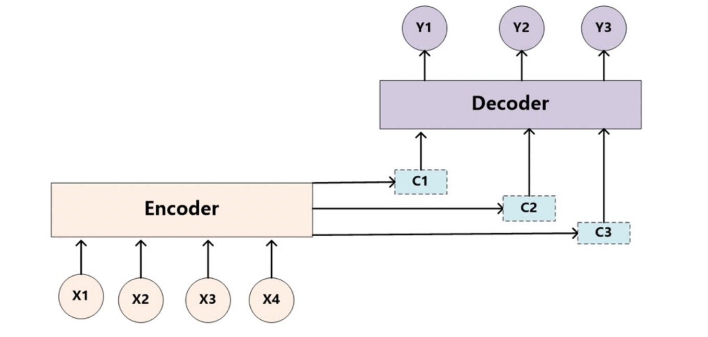

每个 $Ci$ 是对输入词的**加权语义表示**，权重由注意力机制动态计算。


**示例图解：计算 $C_{\text{汤姆}}$**

以生成中文词“汤姆”为例，其上下文向量 $C_{\text{汤姆}}$ 的计算如下：

| 源词  | 编码表示            | 注意力权重 |
| ----- | ------------------- | ---------- |
| Tom   | $f_2(\text{Tom})$   | 0.6        |
| Chase | $f_2(\text{Chase})$ | 0.2        |
| Jerry | $f_2(\text{Jerry})$ | 0.2        |

则：

$$
C_{\text{汤姆}} = 0.6 \cdot f_2(\text{Tom}) + 0.2 \cdot f_2(\text{Chase}) + 0.2 \cdot f_2(\text{Jerry})
$$

这一过程可形象表示为：

$$
C(\text{汤姆}) = g\left(
0.6 \cdot f(\text{Tom}) +
0.2 \cdot f(\text{Chase}) +
0.2 \cdot f(\text{Jerry})
\right)
$$


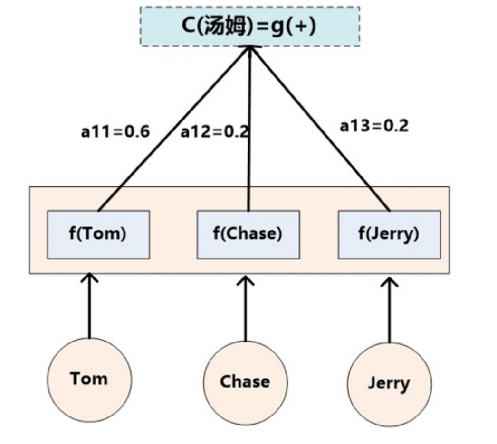


#### 3.2.3 如何计算注意力权重？

为便于说明，我们假设在 **Encoder-Decoder** 框架中，**Encoder** 和 **Decoder** 均采用 **RNN** 模型，结构如下图所示：

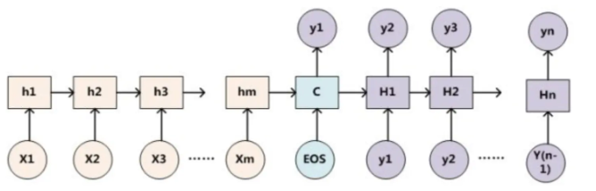

**注意力分配概率分布的计算过程**

注意力机制的核心是：在生成目标词 $y_i$ 时，计算其对源端每个词 $x_j$ 的“对齐程度”即注意力权重。


**注意力权重计算流程**：

- 对 Decoder 当前状态 $H_{i-1}$ 与 Encoder 各隐状态 $h_j$ 计算相似度
- 得到注意力得分 $F(h_j, H_{i-1})$
- 使用 Softmax 归一化得分
- 得到注意力权重 $a_{ij}$
- 用权重对 Encoder 的输出加权求和
- 得到当前时刻的上下文向量 $C_i$

           a_{i1}=0.6               a_{i2}=0.2           a_{i3}=0.2
                ↓                        ↓                    ↓
        ┌----------------┐      ┌---------------┐     ┌---------------┐
        │  F(h₁, H_{i-1})     │  F(h₂, H_{i-1})    │   F(h₃, H_{i-1}) 
        └----------------┘      └---------------┘     └---------------┘
                ↓                        ↓                    ↓
        ┌-------------------------------------------------------------┐
        │                         Softmax 归一化                     
        └-------------------------------------------------------------┘
                                         ↓
                     注意力概率分布 [a_{i1}, a_{i2}, a_{i3}]


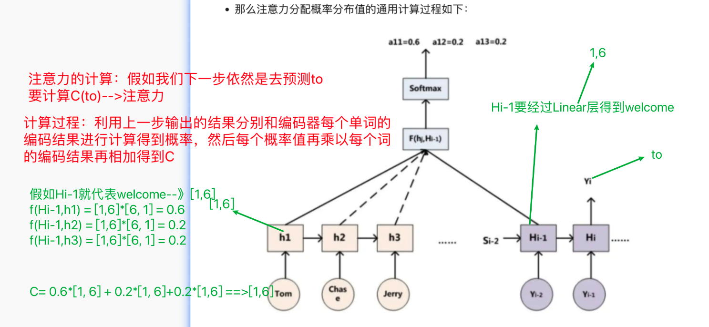

**术语说明**

| 符号              | 含义                                                       |
| :---------------- | :--------------------------------------------------------- |
| $h_j$             | 源端 (Source) 第 $j$ 个词的隐层状态 (Encoder 输出)         |
| $H_{i-1}$         | 目标端 (Target) 第 $i-1$ 个词的隐层状态 (Decoder 前一时刻) |
| $F(h_j, H_{i-1})$ | 注意力打分函数，衡量目标词 $y_i$ 对源词 $x_j$ 的关注程度   |
| $a_{ij}$          | 归一化后的注意力权重，表示生成 $y_i$ 时对 $x_j$ 的关注概率 |

> 上面就是经典的 Soft Attention 模型的基本思想，区别只是函数 $F$ 会有所不同。


#### 3.2.4 Attention机制的本质思想

Attention机制可以看作是一种**加权求和**的过程：

- **Target** 中的每个单词，是对 **Source** 中所有单词的**加权求和**；
- 权重表示 **Source 中每个单词对 Target 中当前单词的重要程度**。

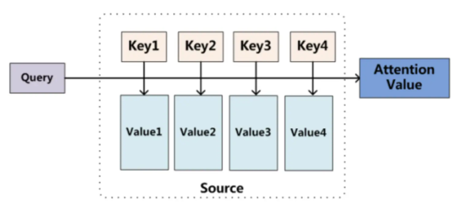

**形式化描述：**

给定：

- Source 中的一系列数据对（Key, Value）；
- Target 中的某个元素 Query；

计算步骤如下：

1. 计算 Query 与每个 Key 的**相似度**或**相关性**；
2. 得到一组**权重系数**；
3. 对对应的 Value 进行**加权求和**，得到最终的 Attention 值。


**数学表达：**
$$
\text{Attention}(\text{Query}, \text{Source}) = \sum \text{Similarity}(\text{Query}, \text{Key}_i) \cdot \text{Value}_i
$$
**Attention计算的三阶段**

Attention 的计算过程可分为以下三步：

**阶段一：相似度计算**

```
Query → [F(Q, K1), F(Q, K2), F(Q, K3), F(Q, K4)] → [s1, s2, s3, s4]
```

- 计算 Query 与每个 Key 的相似度，得到 Attention Score。

**阶段二：归一化**

```
[s1, s2, s3, s4] → Softmax → [a1, a2, a3, a4]
```

- 对 Attention Score 进行 Softmax 归一化，得到权重矩阵。

**阶段三：加权求和**

```
[a1, a2, a3, a4] × [Value1, Value2, Value3, Value4] → Attention Value
```

- 将权重与对应的 Value 加权求和，得到最终的 Attention 表示。

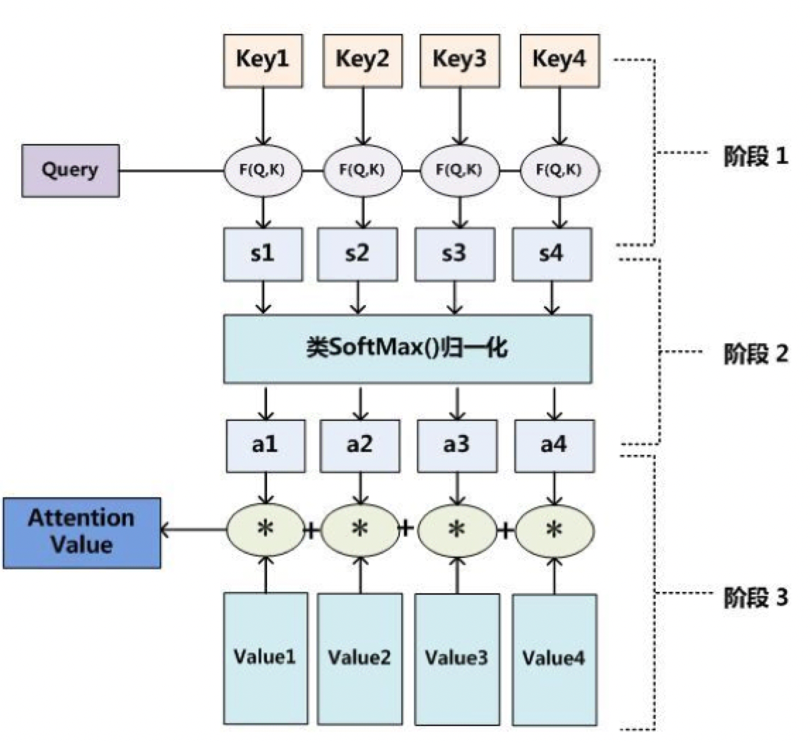


### 3.3 Hard Attention（硬性注意力）

**Soft Attention（软性注意力）** 是通过注意力分布对所有输入向量进行**加权求和**来融合信息。而 **Hard Attention（硬性注意力）** 则不采用加权方式，而是**直接选择一个输入向量**作为输出。具体有两种策略：

| 策略编号 | 策略名称       | 操作方式                                           |
| -------- | -------------- | -------------------------------------------------- |
| 策略一   | **最大值选择** | 选择注意力分布中**得分最高**的输入向量作为输出。   |
| 策略二   | 随机采样       | 根据注意力分布进行**随机采样**，采样结果作为输出。 |

**问题与限制：**

- 硬性注意力通过以上两种方式选择Attention的输出，这会使得最终的损失函数与注意力分布之间的函数关系**不可导**，导致损失函数与注意力分布之间**无法反向传播**；因此，Hard Attention 通常需要借助**强化学习**进行训练；
- 实际应用中，**Soft Attention 更常用**。


### 3.4 Self Attention（自注意力）

Self Attention 是 Google 在 **Transformer** 模型中提出的机制。

**与普通 Attention 的区别：**

| 类型           | Query 来源         | Key/Value 来源     | 说明         |
| -------------- | ------------------ | ------------------ | ------------ |
| 普通 Attention | Target             | Source             | 跨序列对齐   |
| Self Attention | Source/Target 自身 | Source/Target 自身 | 序列内部建模 |

**特点：**

- 计算方式与普通 Attention 相同，只是 **Query、Key、Value 都来自同一序列**；
- 可理解为 **Target = Source** 的特殊情况；
- 用于建模**序列内部元素之间的关系**。

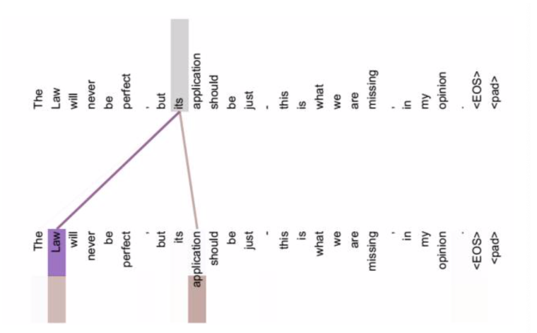

**Self Attention 的优势**

**1. 捕捉长距离依赖更高效**

- **传统 RNN/LSTM**：需按顺序逐步计算，**距离越远，信息损耗越大**；
- **Self Attention**：可**一步计算任意两个 token 之间的关系**，无需依赖序列顺序。

**2. 更好的语义建模能力**

- 能直接捕捉**远距离的语义关联**；
- 例：在句子中准确识别 **“its” 指代的是 “Law”**（指代消解）。

**3. 并行计算能力强**

- 不依赖序列顺序，**可并行处理整个序列**，训练效率更高。

**小结对比表：**

| 特性           | RNN/LSTM       | Self Attention |
| -------------- | -------------- | -------------- |
| 长距离依赖建模 | 弱（逐步传递） | 强（直接连接） |
| 计算顺序       | 有序           | 无序（可并行） |
| 信息损耗       | 随距离增加     | 不随距离变化   |
| 语义捕捉能力   | 有限           | 强（全局视角） |


## 4、注意力机制规则

### 4.1 基本定义

注意力机制需要三个输入：

- **Q（Query）**：查询张量
- **K（Key）**：键张量
- **V（Value）**：值张量

通过计算公式得到注意力结果，表示 Query 在 Key 和 Value 作用下的注意力表示。

- **自注意力（Self-Attention）**：当 Q = K = V
- **一般注意力**：当 Q、K、V 不相等


### 4.2 Seq2Seq 架构中的注意力机制（以翻译为例）

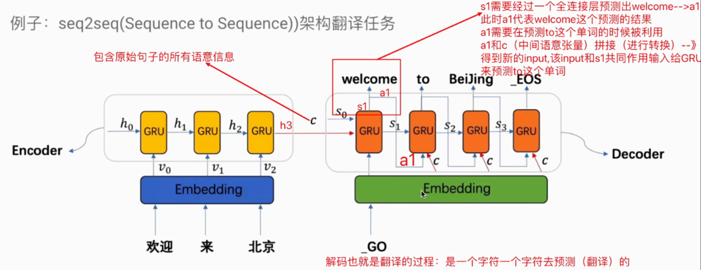

#### 4.2.1 模型结构

- **Encoder（编码器）**：处理输入序列（如中文）
- **Decoder（解码器）**：生成输出序列（如英文）
- **中间语义张量 c**：编码器输出的上下文信息

> **C 的三种表示方式：**
>
> **第一种表示方式：平均值法**
>
> - 将三个单词经过RNN编码之后的结果（每个为 [1, 6]）**相加**。
> - 然后**除以 3**，得到平均值。
> - 该平均值作为语义张量 **C**，形状仍为 **[1, 6]**。
>
> **第二种表示方式：末状态法（Encoo）**
>
> - 直接使用**最后一个单词的隐藏状态 Hₙ** 来表示语义张量 **C**。
> - 形状为 **[1, 6]**。
>
> #### 第三种表示方式：**拼接法**
>
> - 将三个单词经过RNN编码之后的结果**按维度拼接**。
> - 得到的语义张量 **C** 形状为 **[3, 6]**。


#### 4.2.2 注意力机制的两种应用方式

##### ✅ 方式一：tensorflow版本(传统方式)

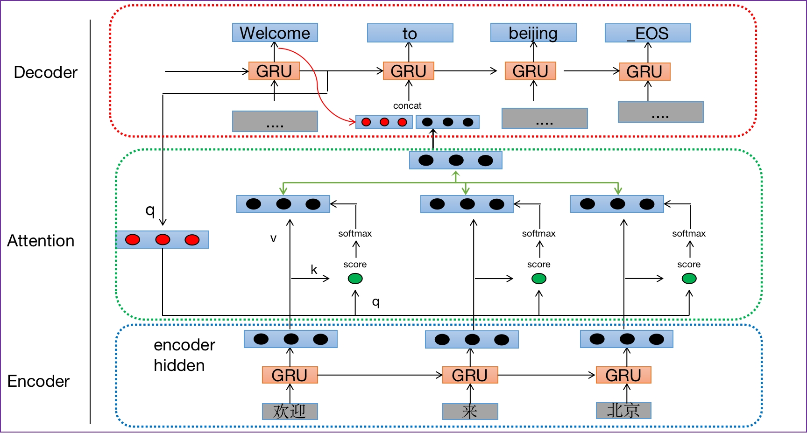

- **Q（Query）**：解码器每一步的输出或当前输入x
- **K（Key）**：编码器每个时间步的输出组合
- **V（Value）**：编码器每个时间步的输出组合


##### ✅ 方式二：PyTorch 改进版

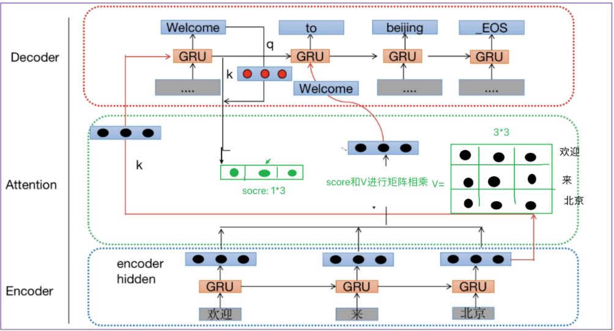

- **Q（Query）**：解码器每一步的输出或当前输入
- **K（Key）**：解码器上一步的隐藏层输出
- **V（Value）**：编码器每个时间步的输出组合


### 4.3 注意力机制计算规则（常见三种）

| 计算方式                            | 公式                                                         |
| :---------------------------------- | :----------------------------------------------------------- |
| 拼接 + 线性变换 + Softmax           | $\text{Attention}(Q, K, V) = \text{softmax}(\text{Linear}([Q, K])) \cdot V$ |
| 拼接 + 线性 + tanh + 求和 + Softmax | $\text{Attention}(Q, K, V) = \text{softmax}(\sum(\tanh(\text{Linear}([Q, K])))) \cdot V$ |
| 点积 + 缩放 + Softmax (乘型注意力)  | $\text{Attention}(Q, K, V) = \text{Softmax}\left(\frac{Q \cdot K^T}{\sqrt{d_k}}\right) \cdot V$ |

> dk为缩放系数

> 注：若 Q、K、V 为三维张量（batch × seq × dim），使用 `bmm`（批量矩阵乘法）进行计算。

```python
# 如果参数1形状是(b × n × m), 参数2形状是(b × m × p), 则输出为(b × n × p)
>>> input = torch.randn(10, 3, 4)
>>> mat2 = torch.randn(10, 4, 5)
>>> res = torch.bmm(input, mat2)
>>> res.size()
torch.Size([10, 3, 5])
```


## 5、注意力机制实现步骤

```properties
基本步骤
第一步: 根据注意力计算规则, 对Q，K，V进行相应的计算.
第二步: 根据第一步采用的计算方法, 如果是拼接方法，则需要将Q与第一步的计算结果再进行拼接, 如果是转置点积, 一般是自注意力, Q与V相同, 则不需要进行与Q的拼接.
第三步: 最后为了使整个attention机制按照指定尺寸输出, 使用线性层作用在第二步的结果上做一个线性变换, 得到最终对Q的注意力表示.
```


注意力机制实现步骤（深度学习中）:

```properties
第一步: 按照注意力规则，对Q、K、V进行注意力的计算
第二步: 如果第一步是拼接操作，需要将Q和第一步计算的结果进行再次拼接，如果是点乘运算，Q和K、V相等,一般属于自注意力，不需要拼接
第三步: 我们需要将第二步的结果，进行线性变化，按照指定输出维度进行结果的表示
```


**代码实现：**

```properties
# coding:utf-8
import torch
import torch.nn as nn
import torch.nn.functional as F

# 实现注意力的计算
# 实现注意力的计算：要按照讲义上说明的注意力计算步骤

class MyAtten(nn.Module):
    def __init__(self, query_size, key_size, value_size1, value_size2, output_size):
        super().__init__()
        # 定义属性
        self.query_size = query_size
        self.key_size = key_size
        self.value_size1 = value_size1
        self.value_size2 = value_size2
        self.output_size = output_size
        # 定义第一个全连接层作用：得到注意力计算的权重分数
        # 因为Q和K需要拼接才送入Linear层，因此该Linear层的输入维度：query_size+key_size
        # 该Linear输出维度是value_size1的原因是为了和value进行矩阵相乘
        self.atten = nn.Linear(self.query_size+self.key_size, value_size1)

        # 定义第二个全连接层作用：按照注意力计算的计算步骤的第三步，需要按照指定维度输出注意力结果，线形变换
        # 该Linear接受的输入，是Q和第一步计算的结果拼接后的张量
        self.linear = nn.Linear(self.query_size + self.value_size2, self.output_size)

    def forward(self, Q, K , V):
        # 1.按照注意力计算第一规则：Q和K先进行拼接,经过Linear层，再经过softmax得到权重分数
        # Q[0]--》[1, 32];K[0]--》[1, 32]-->cat之后[1, 64]；atten_weight代表权重分数:[1, 32]
        atten_weight = F.softmax(self.atten(torch.cat((Q[0], K[0]), dim=-1)), dim=-1)
        # 2.需要将第1步计算的atten_weight-->[1, 32]和V矩阵相乘：V--》[1, 32, 64]
        # temp--》[1, 1, 32] * [1, 32, 64]-->[1, 1, 64] # 第一步根据第一个注意力计算规则得到结果
        temp = torch.bmm(atten_weight.unsqueeze(dim=0), V)
        # 3.因为第一步有拼接操作，所以我们进行第二步：将Q和temp进行再次拼接
        # output是Q[0]-->[1, 32]和temp[0]-->[1, 64]拼接后的结果==》[1, 96]
        output = torch.cat((Q[0], temp[0]), dim=-1)
        # 4.我们需要根据计算步骤的第三步，对第3步拼接后的结果进行线形变化，因此需要linear
        # result-->[1, 1, 32]
        result = self.linear(output).unsqueeze(dim=0)

        return result, atten_weight


class MyAtten2(nn.Module):
    def __init__(self, query_size, key_size, value_size1, value_size2, output_size):
        super().__init__()
        # 定义属性
        self.query_size = query_size
        self.key_size = key_size
        self.value_size1 = value_size1
        self.value_size2 = value_size2
        self.output_size = output_size
        # 定义第一个全连接层作用：得到注意力计算的权重分数
        # 因为Q和K需要拼接才送入Linear层，因此该Linear层的输入维度：query_size+key_size
        # 该Linear输出维度是value_size1的原因是为了和value进行矩阵相乘
        self.atten = nn.Linear(self.query_size+self.key_size, value_size1)

        # 定义第二个全连接层作用：按照注意力计算的计算步骤的第三步，需要按照指定维度输出注意力结果，线形变换
        # 该Linear接受的输入，是Q和第一步计算的结果拼接后的张量
        self.linear = nn.Linear(self.query_size + self.value_size2, self.output_size)

    def forward(self, Q, K , V):
        # 1.按照注意力计算第一规则：Q和K先进行拼接,经过Linear层，再经过softmax得到权重分数
        # Q--》[1, 1, 32];K--》[1, 1, 32]-->cat之后[1, 1, 64]；atten_weight代表权重分数:[1, 1, 32]
        atten_weight = F.softmax(self.atten(torch.cat((Q, K), dim=-1)), dim=-1)
        # 2.需要将第1步计算的atten_weight-->[1, 32]和V矩阵相乘：V--》[1, 32, 64]
        # temp--》[1, 1, 32] * [1, 32, 64]-->[1, 1, 64] # 第一步根据第一个注意力计算规则得到结果
        temp = torch.bmm(atten_weight, V)
        # 3.因为第一步有拼接操作，所以我们进行第二步：将Q和temp进行再次拼接
        # output是Q-->[1, 1, 32]和temp-->[1,1, 64]拼接后的结果==》[1,1, 96]
        output = torch.cat((Q, temp), dim=-1)
        # 4.我们需要根据计算步骤的第三步，对第3步拼接后的结果进行线形变化，因此需要linear
        # result-->[1, 1, 32]
        result = self.linear(output)

        return result, atten_weight

if __name__ == '__main__':
    Q = torch.randn(1, 1, 32) # 32-->query_size
    K = torch.randn(1, 1, 32) # 32-->key_size
    V = torch.randn(1, 32, 64) # 32-->value_size1, 64-->value_size2

    # 实例化对象
    # my_attention = MyAtten(query_size=32, key_size=32, value_size1=32, value_size2=64, output_size=32)
    my_attention2 = MyAtten2(query_size=32, key_size=32, value_size1=32, value_size2=64, output_size=32)
    result, atten_weight =  my_attention2(Q, K, V)
    print(f'result--->{result.shape}')
    print(f'atten_weight--->{atten_weight.shape}')
```


> 拓展：矩阵乘法`mm`、`bmm`、`matmul`的区别：
>
> 简单来说：
>
> - `mm`：**只**用于**2D**矩阵的乘法。
> - `bmm`：用于**3D**张量中**批量**矩阵的乘法。
> - `matmul`：是前两者的**超集**，可以用于各种维度的矩阵乘法，并且支持**广播**机制。
>
> ### 1. torch.mm 
>
> 这是最严格、最基础的矩阵乘法函数。
>
> - **输入**：必须是两个**2D**张量（即标准的矩阵）。
> - **功能**：执行标准的矩阵乘法。如果第一个矩阵是 `(n × m)`，第二个矩阵是 `(m × p)`，那么输出就是 `(n × p)`。
> - **不支持广播**。
>
> **示例：**
>
> ```python
> import torch
> 
> # 两个2D矩阵
> a = torch.randn(2, 3)  # 形状 [2, 3]
> b = torch.randn(3, 4)  # 形状 [3, 4]
> 
> result = torch.mm(a, b)
> print(result.shape)  # 输出: torch.Size([2, 4])
> ```
>
> **错误示例：**
>
> ```python
> a_3d = torch.randn(5, 2, 3)
> b_3d = torch.randn(5, 3, 4)
> result = torch.mm(a_3d, b_3d) # 报错！mm期望的是2D输入，但得到了3D。
> ```
>
> ### 2. torch.bmm
>
> `bmm` 是 `mm` 的批量版本，专为处理3D张量设计。
>
> - **输入**：必须是两个**3D**张量。
> - **功能**：假设第一个张量的形状是 `(b, n, m)`，第二个张量的形状是 `(b, m, p)`。`bmm` 会对这两个张量的**每一个样本**（即第一个维度 `b` 下的每一个2D矩阵）执行矩阵乘法。
> - **输出**：形状为 `(b, n, p)`。
> - **不支持广播**：两个输入张量的**第一个维度（批量大小`b`）必须完全相同**。
>
> **示例：**
>
> ```python
> # 两个3D张量，第一个维度是批量大小
> a = torch.randn(5, 2, 3)  # 5个 [2x3] 的矩阵
> b = torch.randn(5, 3, 4)  # 5个 [3x4] 的矩阵
> 
> result = torch.bmm(a, b)
> print(result.shape)  # 输出: torch.Size([5, 2, 4])，即5个 [2x4] 的矩阵
> ```
>
> ### 3. torch.matmul 
>
> `matmul` 是功能最全面的矩阵乘法函数，是官方推荐使用的。它的行为会根据输入张量的维度自动调整，并且支持广播。
>
> - **输入**：可以是1D、2D或更高维度的张量。
> - **功能**：
>   - 如果两个输入都是**1D**，返回点积（标量）。
>   - 如果两个输入都是**2D**，行为与 `torch.mm` 完全相同。
>   - 如果**第一个输入是1D，第二个是2D**，会在1D张量前增加一个维度（使其变为2D），进行矩阵乘法后再移除增加的维度。
>   - 如果**第一个输入是2D，第二个是1D**，会在1D张量后增加一个维度（使其变为2D），进行矩阵乘法后再移除增加的维度。
>   - 如果两个输入都是**3D或更高维**，其行为类似于批量矩阵乘法，并且**支持广播**。这是它与 `bmm` 最关键的区别。
>
> **广播示例（`matmul` 比 `bmm` 强大的地方）：**
>
> ```python
> # 情况A：和bmm一样，批量维度相同
> a = torch.randn(5, 2, 3)
> b = torch.randn(5, 3, 4)
> result = torch.matmul(a, b)
> print(result.shape)  # torch.Size([5, 2, 4])
> 
> # 情况B：matmul支持广播！这是bmm做不到的。
> a = torch.randn(5, 2, 3)
> # b 的批量维度是1，matmul会将其广播到5
> b = torch.randn(1, 3, 4) # 或者 torch.randn(3, 4) 也能广播
> result = torch.matmul(a, b)
> print(result.shape)  # torch.Size([5, 2, 4])
> ```
>
> 在上面的情况B中，`b` 被“广播”成了 `(5, 3, 4)`，然后与 `a` 进行批量矩阵乘法。
>
> ### 总结对比表
>
> | 特性         | `torch.mm`     | `torch.bmm`            | `torch.matmul`               |
> | :----------- | :------------- | :--------------------- | :--------------------------- |
> | **输入维度** | 严格2D         | 严格3D                 | 任意维度（1D+）              |
> | **主要用途** | 单个矩阵乘法   | 批量矩阵乘法           | 通用矩阵乘法                 |
> | **广播**     | **不支持**     | **不支持**             | **支持**                     |
> | **推荐度**   | 较低，功能单一 | 中等，用于明确的3D输入 | **高**，功能全面，是默认选择 |
