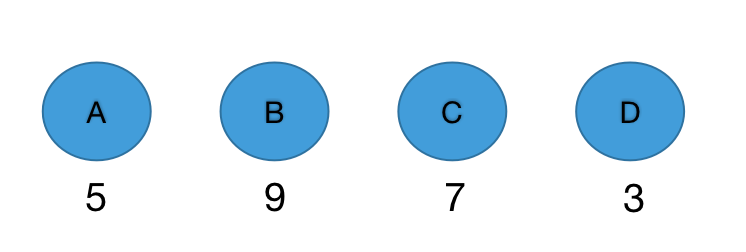
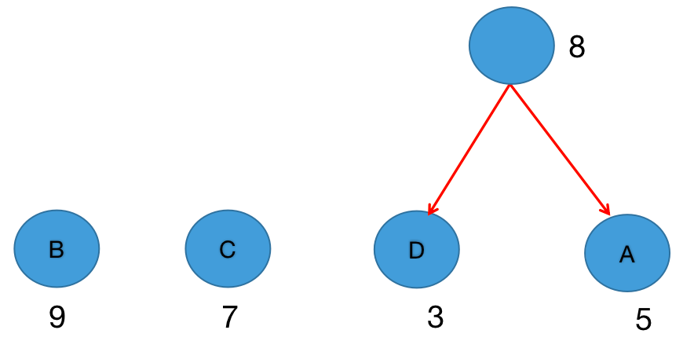
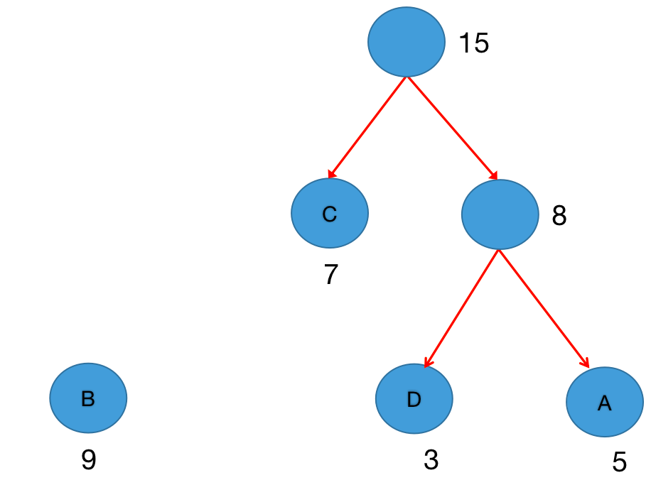
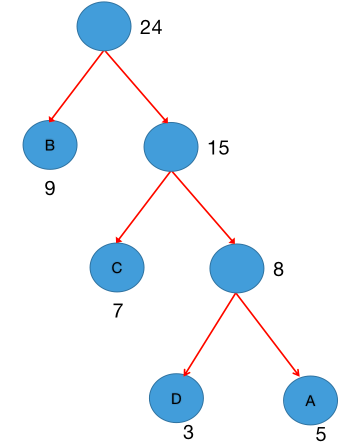
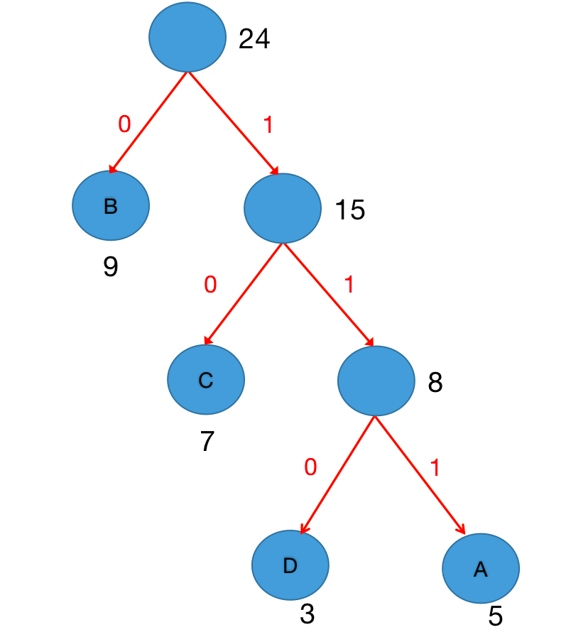
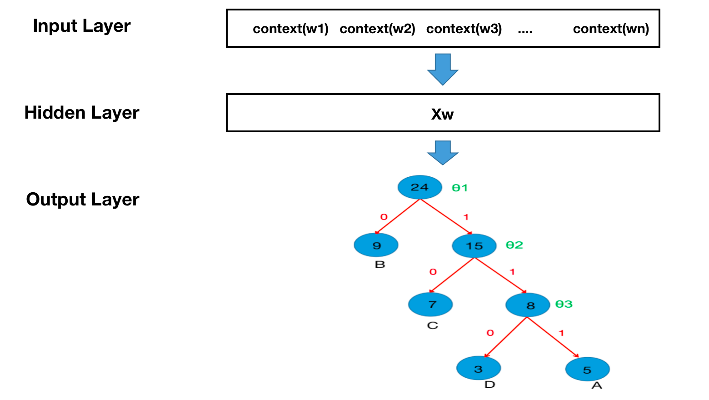

## 1 FastText 工具介绍

### 1.1 FastText 的作用

FastText 是 NLP 工程中常用的工具包，主要具备以下两个功能：

- **文本分类**
- **训练词向量**


### 1.2 FastText 的优势

FastText 的最大优势在于：**在保持较高精度的同时，训练和预测速度非常快**。

**优势原因如下：**

- **模型结构简单**：FastText 模型本身具有非常简洁的网络结构。
- **层次 Softmax**：在训练词向量时，采用层次 Softmax 结构，有效提升在超多类别场景下的性能。
- **N-gram 特征提取**：由于模型结构过于简单，无法捕捉词序特征，因此通过引入 N-gram 特征来弥补这一缺陷，从而提升精度。


### 1.3 FastText 的安装

```properties
pip install fasttext
```


## 2 fasttext模型架构

### 2.1 FastText 模型架构

FastText 的模型架构与 Word2Vec 中的 **CBOW** 模型类似，但两者的目标不同：

- **CBOW**：通过上下文预测中间词；
- **FastText**：通过上下文预测标签（用于文本分类）。


**模型结构分为三层：**

- **输入层（Input Layer）：**文档经过 Embedding 后的向量，包含 **N-gram 特征**。
- **隐藏层（Hidden Layer）：**对输入向量进行 **求和平均**。
- **输出层（Output Layer）：**输出文档对应的 **标签（Label）**。

> 注：模型结构简单，但通过引入 N-gram 特征，有效提升了性能。


### 2.2 层次softmax

为提高多分类任务中的计算效率，FastText 使用 **哈夫曼树（Huffman Tree）** 构建 **层次 Softmax**，替代传统 Softmax。

#### 2.2.1 哈夫曼树简介

- **定义**：带权路径长度最短的二叉树，又称最优二叉树。
- **特点**：**权值越大的节点，距离根节点越近**。

#### 2.2.2 相关概念

| 概念                            | 说明                                                         |
| ------------------------------- | ------------------------------------------------------------ |
| **二叉树**                      | 每个节点最多有两个子树（左、右），且子树有顺序               |
| **叶子节点**                    | 没有子节点的节点                                             |
| **路径长度**                    | 从一个节点到另一个节点所经过的分支数                         |
| **带权路径长度**                | 路径长度 × 节点权值                                          |
| **WPL（Weighted Path Length）** | 所有叶子节点的带权路径长度之和，WPL 最小的二叉树即为哈夫曼树 |

#### 2.2.3 构建哈夫曼树

假设有四个标签：A、B、C、D，其出现频率如下：



**构建步骤：**

1. 每次选择权值最小的两个节点合并，生成新节点；
2. 新节点的权值为子节点权值之和；
3. 重复上述过程，直到只剩一棵树。


- 第一次合并建树



- 第二次合并建树



- 第三次合并建树



> 注：权值越大，离根越近；新增节点数为 `n-1`（n 为叶子数）

#### 2.2.4 哈夫曼编码

- **规则**：左分支为 `0`，右分支为 `1`
- 从根节点到叶子节点的路径即为该节点的编码



**示例编码：**

| 标签 | 编码 |
| ---- | ---- |
| B    | 0    |
| D    | 110  |
| A    | 111  |
| C    | 10   |


#### 2.2.5 梯度计算与条件概率



以标签 D 为例，其编码为 110 ，从根到 D 的路径经过 3 次二分类：

每次分支可视为一次 **逻辑回归** 二分类：

- 正类（1）：使用 `Sigmoid` 函数计算概率
- 负类（0）：`1 - Sigmoid`

**条件概率公式：**
$$
P(\text{Label}|\text{Context}) = \prod_{j=2}^{l} P(d_j|X, \theta_{j-1})
$$


其中：
$$
P(d_j|X, \theta_{j-1}) = [\sigma(X^T\theta_{j-1})]^{d_j} \cdot [1 - \sigma(X^T\theta_{j-1})]^{1-d_j}
$$
**损失函数（对数似然）：**
$$
\mathcal{L} = -\frac{1}{M} \sum_{\text{label} \in \text{labels}} \log P(\text{label}|\text{context})
$$
有了损失函数之后, 接下来就是对其中的$X$，$θ$进行求导，并更新。


#### 2.2.6 层次 Softmax 的优势

| 方法         | 时间复杂度  |
| ------------ | ----------- |
| 传统 Softmax | $O(L)$      |
| 层次 Softmax | $O(\log L)$ |

> 其中 *L* 为标签数量。通过二叉树结构显著降低计算复杂度，尤其适用于 **标签数量庞大** 的场景。

###  

### 2.3 负采样（Negative Sampling）

#### 2.3.1 负采样原理

在训练神经网络时，通常需要输入训练样本并不断调整权重，以提高预测准确性。以 **Skip-Gram 模型** 为例，训练词向量时若词汇表大小为 **10,000**，使用传统 **Softmax** 计算概率时：

- 需要计算 **10,000 个输出概率**；
- 每个概率都需进行 **反向传播更新参数**；
- 计算代价极高，训练速度极慢。


✅ 负采样的核心思想：

> **每次仅更新部分权重**，而不是所有输出神经元对应的权重，从而大幅降低计算量。


**📌 举例说明：**

- 输入词（input word）：`"hello"`
- 输出词（output word）：`"man"`
- 词汇表大小：10,000（即输出层有 10,000 个神经元）

**传统方法：**

- 期望输出：`"man"` 对应神经元输出为 **1**，其余 9,999 个输出为 **0**
- 所有 10,000 个神经元都参与损失计算与权重更新

**负采样方法：**

- 仅更新：
  - **正样本**（positive word）：`"man"`
  - **负样本**（negative words）：随机选取 **5~20 个** 非目标词（如 `"cat"`、`"the"` 等）
- 例如：选择 5 个负样本，则总共只更新 **6 个输出神经元**
- 若隐层-输出层权重矩阵为 **300 × 10,000**，则：
  - 传统方法：更新 **300 × 10,000 = 3,000,000** 个权重
  - 负采样：仅更新 **300 × 6 = 1,800** 个权重
  - **计算量降低至 0.06%**，训练效率大幅提升


#### 2.3.2 负采样的优势

| 优势                   | 说明                                           |
| ---------------------- | ---------------------------------------------- |
| ✅ **提高训练速度**     | 仅计算部分样本的损失，简化计算过程             |
| ✅ **增强模型鲁棒性**   | 引入负样本模拟真实噪声，提升模型对干扰的容忍度 |
| ✅ **适用于大规模数据** | 在大语料上表现尤为出色，训练更高效             |


## 3 fasttext文本分类：使用 FastText 进行烹饪问答分类

### 3.1 文本分类简介

**什么是文本分类？**

文本分类是将文档（如邮件、评论、短信、产品评价等）分配到一个或多个类别中的过程。现代文本分类通常基于 **机器学习方法**，从带标签的训练数据中学习分类规则。


**文本分类的类型**

| 类型             | 说明                     | 示例                                       |
| ---------------- | ------------------------ | ------------------------------------------ |
| **二分类**       | 文本被分到两个互斥类别中 | 判断评论是“好评”还是“差评”                 |
| **单标签多分类** | 文本属于多个类别中的一个 | 判断人名来自哪个国家                       |
| **多标签多分类** | 文本可同时属于多个类别   | 一段描述可能涉及“美食”和“游戏”两个兴趣标签 |


### 3.2 文本分类流程

整体流程如下：

- **获取数据**
- **划分训练集与验证集**
- **训练模型**
- **预测与评估**
- **模型调优**
- **模型保存与重加载**


#### 3.2.1 获取数据

本案例使用 Facebook AI 实验室提供的 **烹饪问答数据集**，路径如下：

```properties
/root/data/cooking/cooking.stackexchange.txt
```

**数据格式说明：**

每行数据包含：

- 一系列标签（以 `_label_` 开头）
- 一段文本内容

**示例：**

```
_label_sauce _label_cheese How much does potato starch affect a cheese sauce recipe?
```

> 表示该文本有两个标签：`sauce` 和 `cheese`，后面是问题内容。


#### 3.2.2 划分训练集与验证集

数据集规模：

```bash
$ wc cooking.stackexchange.txt
# 输出：15404 行，约 17M 数据
```


划分命令：

```bash
# 前 12404 行作为训练集
$ head -n 12404 cooking.stackexchange.txt > cooking.train

# 后 3000 行作为验证集
$ tail -n 3000 cooking.stackexchange.txt > cooking.valid
```


#### 3.2.3 训练模型

使用 FastText 的 `train_supervised` 方法进行训练：

```python
import fasttext

model = fasttext.train_supervised(input="data/cooking/cooking.train")
```


训练输出示例：

```
Read 0M words
Number of words: 14543
Number of labels: 735
Progress: 100.0% words/sec/thread: 60162
lr: 0.000000 avg.loss: 10.056812 ETA: 0h 0m 0s
```


#### 3.2.4 模型预测与评估

示例预测：

```python
>>> model.predict("which baking dish is best to bake a banana bread ?")
(('_label_baking',), array([0.06550845]))
```

```python
>>> model.predict("Why not put knives in the dishwasher?")
(('_label_food-safety',), array([0.07541209]))
```

> 预测结果符合常识，但概率值较低，说明模型置信度不高。


**在验证集上评估：**

```python
>>> model.test("data/cooking/cooking.valid")
(3000, 0.124, 0.0541)
```

- 样本数：3000
- 精度（Precision）：12.4%
- 召回率（Recall）：5.41%

> ✅ 模型初步训练完成，但效果较差，后续可通过调参、清理数据等方式优化。


#### 3.2.5 模型调优

##### 1. 原始数据预处理

**问题分析：**

原始数据中存在以下问题：

- 标点符号与单词相连（如 `North-America`）
- 大小写不统一（如 `Arctic` vs `arctic`）

> 增加词汇冗余，影响模型提取规律


**预处理目标：**

- 分离标点符号与单词
- 统一为小写形式

命令示例：

```bash
$ cat cooking.stackexchange.txt \
  | sed -e "s/\([.!?,'/()]\)/ \1 /g" \
  | tr "[:upper:]" "[:lower:]" \
  > cooking.preprocessed.txt

$ head -n 12404 cooking.preprocessed.txt > cooking.pre.train
$ tail -n 3000 cooking.preprocessed.txt > cooking.pre.valid
```


**效果对比：**

| 处理前                                               | 处理后                                                 |
| :--------------------------------------------------- | :----------------------------------------------------- |
| `_label_fish Arctic char available in North-America` | `_label_fish arctic char available in north - america` |


##### 2. 重新训练与测试

```python
>>> model = fasttext.train_supervised(input="data/cooking/cooking.pre.train")
```

训练结果：

- 词汇数减少：14,543 → **8,952**
- 平均损失下降：**10.05 → 9.96**
- 验证集结果：

```python
>>> model.test("data/cooking/cooking.pre.valid")
(3000, 0.161, 0.0696)
```

> ✅ 精度和召回率均有提升！


##### 3. 增加训练轮数（epoch）

默认 epoch = 5，增加至 25：

```python
>>> model = fasttext.train_supervised(input="cooking.pre.train", epoch=25)
```

结果：

- 平均损失：**9.96 → 7.20**
- 验证集结果：

```python
(3000, 0.4207, 0.1819)
```

> ✅ 精度提升至 **42%**，召回率提升至 **18%**


##### 4. 调整学习率（lr）

默认 lr = 0.1，调整为 1.0：

```python
>>> model = fasttext.train_supervised(input="cooking.pre.train", lr=1.0, epoch=25)
```

结果：

- 平均损失：**7.20 → 4.27**
- 验证集结果：

```python
(3000, 0.4763, 0.2060)
```

> ✅ 精度提升至 **47.6%**，召回率提升至 **20.6%**


##### 5. 增加 N-gram 特征

设置 `wordNgrams=2`，引入 2-gram 特征：

```python
>>> model = fasttext.train_supervised(input="cooking.pre.train", lr=1.0, epoch=25, wordNgrams=2)
```

结果：

- 平均损失：**4.27 → 3.18**
- 验证集结果：

```python
(3000, 0.4923, 0.2129)
```

> ✅ 精度提升至 **49.2%**，召回率提升至 **21.3%**


##### 6. 修改损失函数（使用层次 softmax）

将损失函数从默认 `softmax` 改为 `hs`（Hierarchical Softmax）：

```python
>>> model = fasttext.train_supervised(input="cooking.pre.train", lr=1.0, epoch=25, wordNgrams=2, loss="hs")
```

结果：

- 平均损失：**3.18 → 2.22**
- 训练速度显著提升（words/sec/thread 从 6 万提升至 **134 万**）
- 验证集结果：

```python
(3000, 0.483, 0.2089)
```

> ✅ 精度略有波动，但训练时间大幅缩短！


##### 7. 自动超参数调优

手动调节和寻找超参数是非常困难的，因为参数之间可能相关，并且不同数据集需要的超参数也不同，因此可以使用fasttext的autotuneValidationFile参数进行自动超参数调优。

使用 FastText 提供的自动调参功能：

```python
>>> model = fasttext.train_supervised(
        input="cooking.pre.train",
        autotuneValidationFile="cooking.pre.valid",
        autotuneDuration=600
    )
```

结果：

- 随机搜索 38 组参数
- 最优验证得分：**0.376**
- 使用最优参数重新训练后：
  - 平均损失：**2.22 → 1.88**
  - 模型性能进一步提升


##### 8. 实际生产中多标签多分类问题的损失计算方式

❓ 为什么不用 softmax 或 hs？

- **softmax** 和 **hs（层次 softmax）** 只能 **最大化一个标签的输出概率**
- 但在 **多标签多分类** 场景中，一段文本可能同时属于多个类别
- 因此，我们需要为 **每个标签单独训练一个二分类器**


✅ 解决方案：使用 `loss='ova'`（One-vs-All）

- 每个标签都作为一个独立的二分类任务
- 统一语料下同时训练多个二分类模型
- 更适合输出 **多个标签**


⚙️ 模型训练参数设置

```python
>>> model = fasttext.train_supervised(
        input="data/cooking/cooking.pre.train",
        lr=0.2,              # 学习率不宜过大
        epoch=25,
        wordNgrams=2,
        loss='ova'           # 使用 One-vs-All 损失
    )
```

训练输出：

```
Read 0M words
Number of words:  8952
Number of labels: 735
Progress: 100.0% words/sec/thread: 65044
lr: 0.000000 avg.loss: 7.713312
```


🔍 模型预测：输出多个标签

```python
>>> model.predict(
        "Which baking dish is best to bake a banana bread ?",
        k=-1,         # 输出所有可能的标签
        threshold=0.5 # 只显示概率大于 0.5 的标签
    )
```

预测结果：

```python
(
    (u'__label__baking', u'__label__bananas', u'__label__bread'),
    array([1.00000, 0.939923, 0.592677])
)
```

✅ 结果解读

- 模型成功识别出输入文本与以下标签相关：
  - `baking`（烘焙）
  - `bananas`（香蕉）
  - `bread`（面包）
- 每个标签都有较高的预测概率，符合多标签分类的预期


📌 总结

| 项目         | 说明                                              |
| :----------- | :------------------------------------------------ |
| **损失函数** | `loss='ova'`：每个标签独立训练二分类器            |
| **学习率**   | 设置为 0.2，避免梯度更新过大                      |
| **预测方式** | 设置 `k=-1` 和 `threshold=0.5` 输出多个高概率标签 |
| **适用场景** | 多标签分类任务，如标签推荐、主题识别等            |


##### 9. 模型保存与重加载

保存模型：

```python
>>> model.save_model("data/model/model_cooking.bin")
```

加载模型：

```python
>>> model = fasttext.load_model("data/model/model_cooking.bin")
```

加载后预测：

```python
>>> model.predict("Which baking dish is best to bake a banana bread ?", k=-1, threshold=0.5)
```

> ✅ 模型加载后功能完全一致，可用于部署或后续分析！


##### 总结：模型优化路径一览

| 优化步骤         | 精度（Precision） | 召回率（Recall） | 说明             |
| :--------------- | :---------------- | :--------------- | :--------------- |
| 原始模型         | 12.4%             | 5.4%             | 基础模型         |
| 数据预处理       | 16.1%             | 6.9%             | 清洗标点与大小写 |
| 增加 epoch       | 42.0%             | 18.2%            | 增加训练轮数     |
| 提高学习率       | 47.6%             | 20.6%            | 加快收敛         |
| 增加 N-gram      | 49.2%             | 21.3%            | 捕捉上下文信息   |
| 使用层次 softmax | 48.3%             | 20.9%            | 提升训练速度     |
| 自动调参         | 优化中            | 优化中           | 自动搜索最优参数 |
| 使用 ova         | 多标签输出        | 多标签输出       | 适合多标签分类   |


## 4 FastText 训练词向量

#### 4.1 词向量简介

##### 4.1.1 什么是词向量？

- 用 **向量** 表示词汇（或字符）是现代 NLP 的核心方法；
- 能捕捉词汇之间的 **语义关系**；
- 可提升下游任务（如分类、聚类、检索等）的效果。


##### 4.1.2 训练词向量的基本流程

- **获取数据**
- **训练词向量**
- **设定超参数**
- **检验模型效果**
- **保存与重加载模型**


#### 4.2 实现步骤

##### 4.2.1 数据介绍

- 数据集：**英文维基百科部分网页信息**
- 原始数据：`/root/data/enwik9.zip`
- 预处理后的数据：`/root/data/fil9`

示例：查看前 80 个字符

```bash
$ head -c 80 data/fil9
anarchism originated as a term of abuse first used against early working class
```

> ✅ 数据已分词，空格分隔，适合直接训练词向量。


##### 4.2.2 训练词向量

使用 FastText 的 `train_unsupervised` 方法进行无监督训练：

```python
>>> import fasttext
>>> model = fasttext.train_unsupervised('data/fil9')
```

> ⚠️ 注意：训练耗时较长，建议加载预训练模型：

```python
>>> model = fasttext.load_model("data/fil9.bin")
```

训练结果：

```
Read 124M words
Number of words: 218316
Number of labels: 0
Progress: 100.0% words/sec/thread: 53996
```

获取词向量：

```python
>>> model.get_word_vector("the")
array([-0.03087516,  0.09221972,  0.17660329, ...,  0.23726143], dtype=float32)
```


##### 4.2.3 超参数设定

训练词向量时可调整以下参数：

| 参数名   | 含义         | 默认值       | 建议范围                 |
| :------- | :----------- | :----------- | :----------------------- |
| `model`  | 训练模式     | `'skipgram'` | `'skipgram'` 或 `'cbow'` |
| `dim`    | 词向量维度   | 100          | 大语料可设为 200~300     |
| `epoch`  | 数据循环次数 | 5            | 大数据可设为 1~3         |
| `lr`     | 学习率       | 0.05         | 建议 [0.01, 1]           |
| `thread` | 线程数       | 12           | 建议与 CPU 核数一致      |

示例：使用 CBOW + 300 维 + 更少轮数

```python
>>> model = fasttext.train_unsupervised('data/fil9', "cbow", dim=300, epoch=1, lr=0.1)
```


##### 4.2.4 模型效果检验

通过查看词汇的 **邻近词** 判断词向量质量：

示例：

```python
>>> model.get_nearest_neighbors('sports')
[(0.8414, 'sportsnet'), (0.8134, 'sport'), (0.8100, 'sportsline')]

>>> model.get_nearest_neighbors('music')
[(0.8908, 'emusic'), (0.8464, 'musicmoz'), (0.8444, 'musics')]

>>> model.get_nearest_neighbors('dog')
[(0.8456, 'catdog'), (0.7480, 'dogcow'), (0.7289, 'dogs')]
```

> ✅ 邻近词汇均与目标词语义相关，说明词向量质量良好。


##### 4.2.5 模型保存与重加载

保存模型：

```python
>>> model.save_model("data/fil9.bin")
```

加载模型：

```python
>>> model = fasttext.load_model("data/fil9.bin")
>>> model.get_word_vector("the")
array([..., dtype=float32)
```

> ✅ 加载后模型功能完全一致，可用于后续任务（如相似度计算、聚类等）。


#### 4.3 总结：训练词向量的关键要点

| 步骤         | 关键内容                                         |
| :----------- | :----------------------------------------------- |
| ✅ 数据准备   | 预处理成分词格式，空格分隔                       |
| ✅ 模型训练   | 使用 `train_unsupervised`，可选 skipgram 或 cbow |
| ✅ 超参数调优 | 控制维度、学习率、轮数、线程数                   |
| ✅ 效果评估   | 通过 `get_nearest_neighbors` 主观判断语义质量    |
| ✅ 模型保存   | 使用 `save_model` 和 `load_model` 实现持久化     |


## 5 词向量迁移

#### 5.1 什么是词向量迁移？

- 使用在 **大型语料库**（如 Wikipedia、Common Crawl）上预训练好的词向量模型；
- 无需从零训练，节省时间与计算资源；
- 可直接用于下游任务（如分类、聚类、相似度计算等）。


#### 5.2 FastText 提供的预训练词向量

FastText 官方提供了两种预训练词向量模型，支持多种语言：

| 类型                         | 语料来源            | 训练模式 | 维度 | 语言数 | 查看地址                                                    |
| :--------------------------- | :------------------ | :------- | :--- | :----- | :---------------------------------------------------------- |
| **Common Crawl + Wikipedia** | Common Crawl + Wiki | CBOW     | 300D | 157种  | [链接](https://fasttext.cc/docs/en/crawl-vectors.html)      |
| **Wikipedia**                | Wikipedia           | Skipgram | 300D | 294种  | [链接](https://fasttext.cc/docs/en/pretrained-vectors.html) |


#### 5.3 使用步骤概览

- **下载 `.bin.gz` 模型文件**
- **解压为 `.bin` 文件**
- **加载模型并获取词向量**
- **通过邻近词检验语义质量**


#### 5.4 实战演示：使用中文词向量模型

##### ✅ 4.1 下载模型

```bash
wget https://dl.fbaipublicfiles.com/fasttext/vectors-crawl/cc.zh.300.bin.gz
```


##### ✅ 4.2 解压模型

```bash
gunzip cc.zh.300.bin.gz
# 得到 cc.zh.300.bin
```


##### ✅ 4.3 加载模型并查看词向量

```python
>>> import fasttext
>>> model = fasttext.load_model("cc.zh.300.bin")

>>> model.words[:100]
['的', '。', '是', '一', '，', '、', '不', '了', '在', '人', ... ]

>>> model.get_word_vector("音乐")
array([-6.81843981e-02,  3.84048335e-02,  4.63239700e-01, ... ], dtype=float32)
```


##### ✅ 4.4 邻近词语义检验

通过 `get_nearest_neighbors` 检验词向量质量：

示例 1：音乐

```python
>>> model.get_nearest_neighbors("音乐")
[
    (0.6703, '乐曲'),
    (0.6569, '音乐会'),
    (0.6565, '声乐')
]
```

示例 2：美术

```python
>>> model.get_nearest_neighbors("美术")
[
    (0.7247, '艺术'),
    (0.7165, '绘画'),
    (0.6741, '霍廷霄')
]
```

示例 3：周杰伦

```python
>>> model.get_nearest_neighbors("周杰伦")
[
    (0.6995, '杰伦'),
    (0.6967, '周董'),
    (0.6859, '陈奕迅')
]
```


#### 5.5 总结：词向量迁移的优势

| 优点           | 说明                                   |
| :------------- | :------------------------------------- |
| **高效**       | 无需训练，直接加载使用                 |
| **多语言支持** | 支持 157~294 种语言                    |
| **高质量语义** | 基于大规模语料训练，语义关系准确       |
| **易集成**     | 与 FastText API 完全兼容，支持下游任务 |
