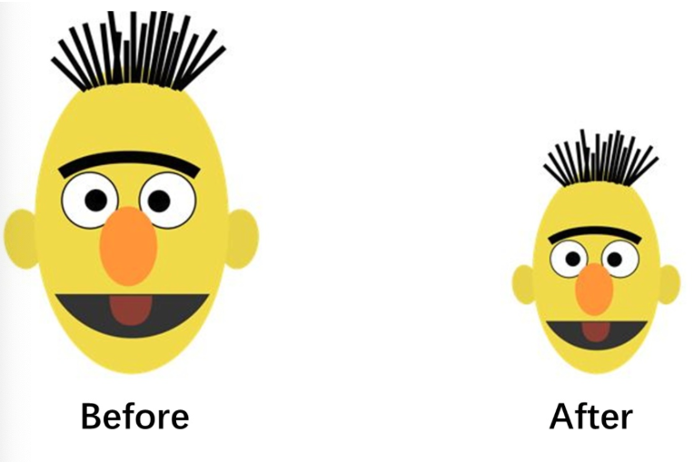
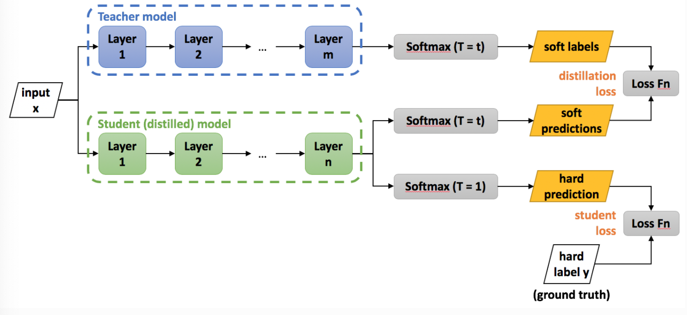
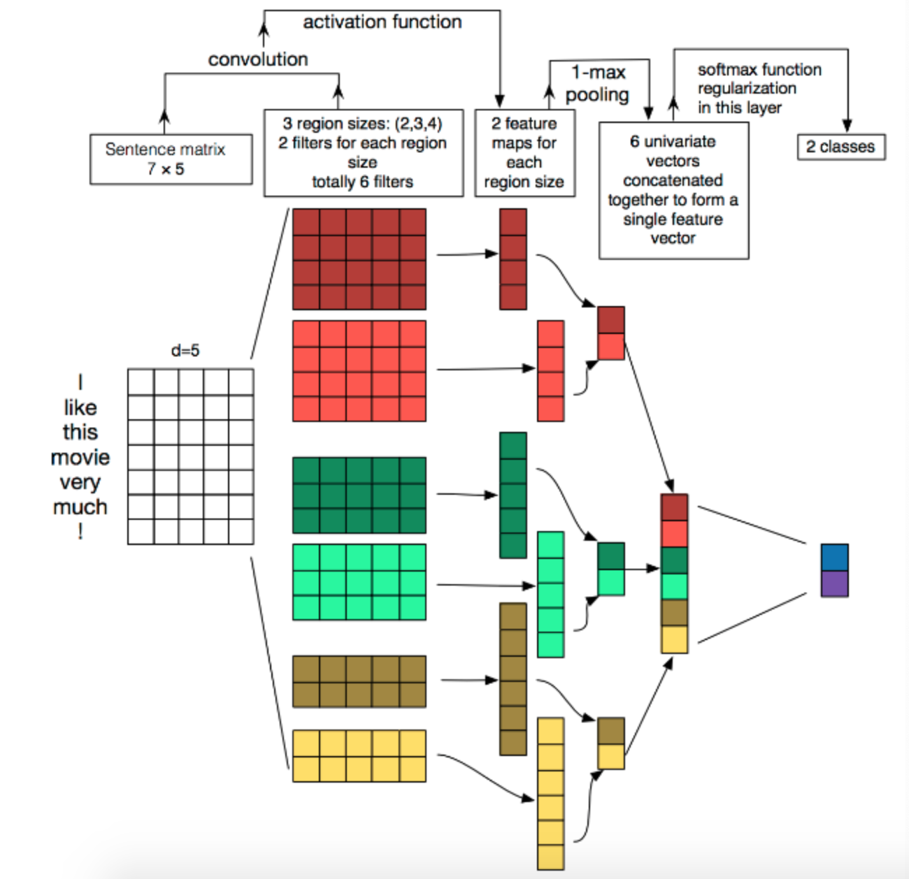
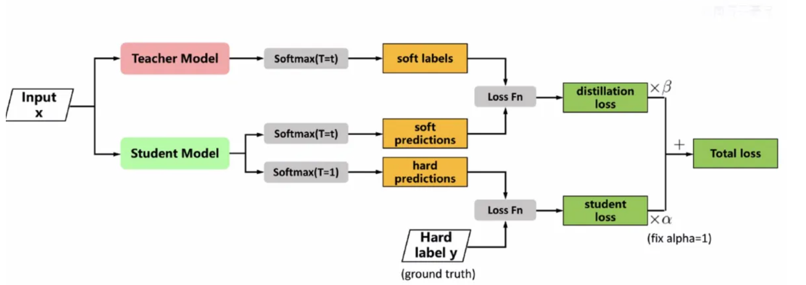

## 1 模型量化

### 1.1 什么是模型的量化

- **通俗理解**：
  模型量化就是将模型参数的精度降低，用更少的比特位（如 `torch.qint8`）代替原来的高精度（如 `torch.float32`），从而**减小模型体积**并**加快推理速度**。
- **类比说明**：
  就像图像压缩一样，原始模型（float32）像素高、看得清晰；量化模型（int8）像素低、模糊，但仍能准确识别内容。


- **PyTorch 支持**：
  使用动态量化（`DynamicQuantization`）即可快速实现。


### 1.2 PyTorch 中的模型量化流程（以 BERT 为例）

#### 1.2.1 修改配置文件：设置设备为 CPU

> ❗ **量化操作只能在 CPU 上进行**，若在 GPU 上运行会报错：
>
> ```properties
> RuntimeError: Could not run 'quantized::linear_prepack' with arguments from the 'cuda' backend
> ```

**文件路径**：`04-bert/src/models/bert.py`

```python
class Config:
    def __init__(self):
        # 模型训练/预测时使用 GPU（默认注释掉）
        # self.device = torch.device("cuda" if torch.cuda.is_available() else "cpu")

        # 模型量化时必须使用 CPU
        self.device = 'cpu'
```


#### 1.2.2 模型量化实现代码

**文件路径**：`04-bert/src/run1.py`

✅ 导入必要模块

```python
import torch
import numpy as np
from train_eval import test
from importlib import import_module
import argparse
from utils import build_dataset, build_iterator
```

✅ 主函数：加载模型并量化

```python
# 命令行参数解析：指定模型类型，默认为 bert
parser = argparse.ArgumentParser(description="Chinese Text Classification")
parser.add_argument("--model", type=str, default="bert", help="choose a model: bert")
args = parser.parse_args()

if __name__ == "__main__":
    if args.model == "bert":
        model_name = "bert"
        x = import_module("models." + model_name)
        config = x.Config()

        # 设置随机种子，保证实验可重复
        np.random.seed(1)
        torch.manual_seed(1)
        torch.cuda.manual_seed_all(1)
        torch.backends.cudnn.deterministic = True

        # 加载数据集并构建迭代器
        print("Loading data for Bert Model...")
        train_data, dev_data, test_data = build_dataset(config)
        train_iter = build_iterator(train_data, config)
        dev_iter = build_iterator(dev_data, config)
        test_iter = build_iterator(test_data, config)

        # 实例化模型并加载预训练参数（注意：必须加载到 CPU）
        model = x.Model(config)
        print(model)
        model.load_state_dict(torch.load(config.save_path, map_location='cpu'))

        # 对模型进行动态量化（仅量化 Linear 层）
        quantized_model = torch.quantization.quantize_dynamic(
            model, {torch.nn.Linear}, dtype=torch.qint8
        )
        print(quantized_model)

        # 测试量化模型性能
        test(config, quantized_model, test_iter)

        # 保存量化后的模型
        torch.save(quantized_model, config.save_path2)
```


### 1.3 量化效果展示

#### 1.3.1 模型结构变化（Linear → DynamicQuantizedLinear）

| 模块名         | 量化前                                      | 量化后                                           |
| :------------- | :------------------------------------------ | :----------------------------------------------- |
| `pooler.dense` | `Linear(in_features=768, out_features=768)` | `DynamicQuantizedLinear(..., dtype=torch.qint8)` |
| `fc`           | `Linear(in_features=768, out_features=10)`  | `DynamicQuantizedLinear(..., dtype=torch.qint8)` |


#### 1.3.2 模型性能对比

| 指标        | 量化前 | 量化后                |
| :---------- | :----- | :-------------------- |
| **F1 分数** | 93.64% | 91.92%                |
| **准确率**  | 高     | 91.92%（下降不到 2%） |

> ✅ 虽然性能略有下降，但仍在可接受范围内，说明 **BERT 模型鲁棒性较强**。


#### 1.3.3 模型大小对比

| 模型文件                     | 大小        |
| :--------------------------- | :---------- |
| 原始模型 `bert.pt`           | **409.2MB** |
| 量化模型 `bert_quantized.pt` | **152.6MB** |

> ✅ 模型体积减少 **256.6MB**，压缩效果显著！


## 2 模型蒸馏

### 2.1 什么是模型蒸馏？

在工业级应用中，除了要求模型具备良好的预测效果外，还希望其**资源消耗尽可能小**，包括：

- 存储空间
- 算力需求

为了提升模型效果，通常采用以下两种方案：

- **使用更大规模的参数**
- **使用集成模型**（将多个弱模型组合）

> ⚠️ 但上述方法往往**计算开销大**，不利于线上部署。


**模型压缩的动机**：我们希望得到一个**体积小、速度快**的模型，同时**保持甚至提升性能**。


**知识蒸馏（Knowledge Distillation）：**

- 是一种**知识迁移**方法：将复杂模型（教师模型）学到的知识，传递给简单模型（学生模型）。
- 由 **Hinton 于 2015 年提出**，2019 年后广泛应用。
- 目前已成为**既前沿又实用**的模型压缩与部署优化手段。




### 2.2 知识蒸馏的原理与算法

#### **2.2.1 教师模型（Teacher Model）**

- **定义**：复杂、高性能的大型深度神经网络。
- **特点**：参数量大，能学习复杂的特征和关系。


#### **2.2.2 学生模型（Student Model）**

- **定义**：结构简化、参数较少的小型模型。
- **特点**：适合部署在资源受限的环境中（如移动端、嵌入式设备）。


#### 2.2.3 蒸馏过程（Distillation）

蒸馏过程包含两个分支：

- **软标签分支**：教师模型通过 softmax 输出“软目标”（soft targets），作为学生模型的学习对象。
- **硬标签分支**：真实标签（ground truth）用于指导学生模型的训练。


**蒸馏架构图：**




### 2.3 损失函数与公式推导

#### 2.3.1 总体损失函数：

我们对知识蒸馏进行公式化处理：先训练好一个精度较高的 **Teacher** 网络（一般是复杂度较高的大规模预测训练模型），然后将 **Teacher** 网络的预测结果 $q$ 作为 **Student** 网络的“学习目标”，来训练 **Student** 网络（一般是速度较快的小规模模型），最终使得 Student 网络的结果 $p$ 接近于 $q$。蒸馏训练的总损失函数如下：

$$
L = (1 - \alpha) \cdot \text{CE}(y, p) + \alpha \cdot \text{CE}(q, p)
$$

- 上式中 $\text{CE}$ 是**交叉熵损失**（Cross Entropy）
- $y$ 是真实标签
- $q$ 是 Teacher 网络的输出结果
- $p$ 是 Student 网络的输出结果
- *α*：平衡两项损失的权重系数（通常取 0.8）


#### 2.3.2 Softmax-T：温度缩放机制

为了生成“软标签”，引入**温度参数 T**对 softmax 进行平滑处理
$$
p_i = \frac{\exp\left(\frac{z_i}{T}\right)}{\sum_{j} \exp\left(\frac{z_j}{T}\right)}
$$

其中：

- $z_i$ 是神经网络 softmax 前的输出 logits
- $p_i$：软化后的概率分布（软目标）

- *T*：温度参数，控制分布的**平滑程度**


温度 *T* 的影响：

| 温度 *T* 值 | 效果说明                                   |
| :---------- | :----------------------------------------- |
| *T*=1       | 原始 softmax，输出标准概率分布             |
| *T*→0       | 分布趋于 one-hot，最大值趋近 1，其余趋近 0 |
| *T* 越大    | 分布越平缓，保留更多类别间相似性信息       |
| *T*→∞       | 分布趋于均匀分布，所有类别概率接近相等     |

> ✅ 实际应用中，*T* 通常设置为 **3~5**，以生成更有信息量的软标签。

> **为什么需要蒸馏温度T？**
>
> 简单来说，**蒸馏温度 `T` 是一个控制模型“知识”模糊程度的超参数。它不是为了物理上的加热，而是一个纯粹的数学工具，用于从复杂的大模型（教师模型）中提取更丰富、更通用的“知识”给小巧的模型（学生模型）。**
>
> 下面我们分步来详细解释：
>
> **1. 没有温度 `T` 时发生了什么？（`T=1` 的标准Softmax）**
>
> 在普通的分类神经网络中，最后一层通常是一个 **Softmax 函数**，它将模型的原始输出（称为 logits）转换为概率分布。
>
> - **Logits (`z_i`)**：模型对于每个类别的原始预测分数。分数越高，表示模型认为该类别可能性越大。
> - **Softmax 概率 (`p_i`)**：将 logits 转化为概率，所有类别的概率之和为 1。
>
> **标准 Softmax 公式 (T=1)：**$p_i = exp(z_i) / (∑_j exp(z_j))$
>
> **问题在于**：当使用标准的 Softmax (即 T=1) 时，对于一张已经能被教师模型正确分类的图片，正确的那个类别对应的 logit 会远大于其他类别。经过 Softmax 后，**正确的类别概率会非常接近 1（比如 0.99），而其他所有类别的概率都无限接近 0**。
>
> 这就像一个非常自信（甚至傲慢）的老师，他只说：“答案是 A，其他选项都是垃圾，不值一提。” 这种概率分布被称为 **“硬目标”（Hard Targets）**。
>
> 对于学生模型来说，从这个“硬目标”里能学到的信息非常有限：
>
> - 它只知道要尽力去模仿那个概率为 0.99 的类别。
> - 它学不到 **“其实类别 B 和类别 A 也有几分相似，而类别 C 和 A 完全不像”** 这种更有价值的**暗知识**。
>
> **2. 引入温度 `T` 后如何工作？**
>
> 知识蒸馏的核心思想就是让教师模型提供这种“暗知识”。温度 `T` 就是实现这一目标的钥匙。
>
> 我们修改 Softmax 函数，引入温度参数 `T`：
>
> **带温度参数的 Softmax 公式：**$p_i = exp(z_i / T) / (∑_j exp(z_j / T))$
>
> **温度 `T` 的作用是“平滑”或“软化”概率分布：**
>
> - **当 `T = 1` 时**：就是标准的 Softmax，输出原始的“硬”概率分布。
> - **当 `T > 1` 时**：
>   - 我们对所有的 logits `z_i` 都除以一个大于 1 的数 `T`，这相当于**压缩了 logits 之间的差距**。
>   - 原本很大的 logit 会变小，原本很小的 logit（负值）的绝对值也会变小。
>   - 经过 Softmax 后，**没有一个概率会特别接近 1，所有类别的概率分布会变得更加“平缓”和“模糊”**。正确的类别可能有 0.7 的概率，而一些相似的错误类别也可能有 0.2、0.1 的概率。
>   - 这个平滑后的分布被称为 **“软目标”（Soft Targets）**。
> - **当 `T -> 无穷大` 时**：所有 logits 的效果都被无限缩小，输出概率将接近**均匀分布**（每个类别的概率都相等）。
> - **当 `T < 1` 时**：效果相反，会使概率分布更加“尖锐”，自信度被放大。这在蒸馏中很少使用。
>
> **3. 为什么“软目标”更好？—— “暗知识”的传递**
>
> 这个由高温 `T` 产生的“软目标”包含了远比“硬目标”丰富的信息：
>
> 1. **类别间的关系**：学生模型不仅知道“正确答案是 A”，还知道“B 是第二好的选择，C 是最不可能的”。例如，在分辨“宝马”和“奔驰”时，教师模型可能会给“奥迪”一个稍高的错误概率，而给“猫”一个极低的概率。这种**不同错误类别之间的相对关系**是极其宝贵的知识，能帮助学生模型更好地学习决策边界。
> 2. **防止过拟合**：“硬目标”可能包含教师模型在特定训练数据上学到的一些噪声。而“软目标”提供了一个更通用、更平滑的概率分布，能帮助学生模型更好地泛化到新数据上。
> 3. **提供更丰富的梯度**：在“硬目标”中，除了正确类别，其他类别的梯度几乎为零。而在“软目标”中，许多类别都有非零的概率，这意味着反向传播时，学生模型可以从多个类别中获得梯度信号，学习效率更高。
>
> ---


## 3 模型蒸馏的实践

### 3.1 项目结构

```
05-bert_distil/
├── data/                      # 数据集与预训练模型
│   ├──bert_pretrain/          # BERT预训练相关文件
│   ├──data/          				 # 数据集
├── src/
│   ├── models/
│   │   ├── bert.py            # BERT模型结构
│   │   └── textCNN.py         # TextCNN模型结构
│   ├── saved_dict/            # 模型权重保存路径
│   ├── run.py                 # 主函数入口
│   ├── train_eval.py          # 训练与评估逻辑
│   └── utils.py               # 工具函数（重点）
```


### 3.2 数据准备

> 数据集和预训练模型与 BERT 章节一致，此处不再赘述。


### 3.3 工具类函数（`utils.py`）

#### 3.3.1 构建词汇表：`build_vocab()`

✅ 功能说明：

- 将文本中的单词映射为索引，构建词汇表。
- 支持按词频筛选高频词，按词频降序排序，仅保留出现次数 ≥ min_freq 的词汇
- 添加特殊符号：`[UNK]`、`[PAD]`、`[CLS]`。


📌 特殊符号定义：

```python
UNK, PAD, CLS = "[UNK]", "[PAD]", "[CLS]"  # 未知词、填充符、分类符
MAX_VOCAB_SIZE = 10000  # 限制词汇表最大容量
```


✅函数实现：

```python
def build_vocab(file_path, tokenizer, max_size, min_freq):
    """
    构建词汇表函数。

    参数：
        file_path (str): 文本数据路径
        tokenizer (function): 分词器函数
        max_size (int): 词汇表最大容量
        min_freq (int): 最小词频阈值

    返回：
        vocab_dic (dict): 单词到索引的映射字典
    """
    vocab_dic = {}  # 存储词频

    with open(file_path, "r", encoding="UTF-8") as f:
        for line in tqdm(f):
            line = line.strip()
            if not line:
                continue
            content = line.split("\t")[0]  # 取第一列文本内容
            for word in tokenizer(content):
                vocab_dic[word] = vocab_dic.get(word, 0) + 1

    # 按词频排序并筛选高频词
    vocab_list = sorted(
        [item for item in vocab_dic.items() if item[1] >= min_freq],
        key=lambda x: x[1],
        reverse=True
    )[:max_size]

    # 构建词汇索引字典
    vocab_dic = {word_count[0]: idx for idx, word_count in enumerate(vocab_list)}

    # 添加特殊符号
    vocab_dic.update({
        UNK: len(vocab_dic),
        PAD: len(vocab_dic) + 1,
        CLS: len(vocab_dic) + 2
    })

    return vocab_dic
```


#### 3.3.2 构建 CNN 数据集：`build_dataset_CNN()`

✅ 功能说明：

- 为 TextCNN 模型构建训练和测试数据集。
- 支持字符级分词。
- 自动填充或截断序列。


✅ 函数实现：

```python
def build_dataset_CNN(config):
    """
    构建适用于 TextCNN 的数据集。

    参数：
        config: 配置对象，包含路径、参数等

    返回：
        vocab, train, dev, test: 词汇表及三个数据集
    """
    # 字符级分词器
    tokenizer = lambda x: [y for y in x]

    # 若词汇表已存在则加载，否则重新构建
    if os.path.exists(config.vocab_path):
        vocab = pkl.load(open(config.vocab_path, "rb"))
    else:
        vocab = build_vocab(
            config.train_path,
            tokenizer=tokenizer,
            max_size=MAX_VOCAB_SIZE,
            min_freq=1
        )
        pkl.dump(vocab, open(config.vocab_path, "wb"))
        print(f"Vocab size: {len(vocab)}")

    # 加载数据集的辅助函数
    def load_dataset(path, pad_size=32):
        contents = []
        with open(path, "r", encoding="UTF-8") as f:
            for line in tqdm(f):
                line = line.strip()
                if not line:
                    continue
                content, label = line.split("\t")
                token = tokenizer(content)
                seq_len = len(token)

                # 填充或截断
                if pad_size:
                    if len(token) < pad_size:
                        token.extend([PAD] * (pad_size - len(token)))
                    else:
                        token = token[:pad_size]
                    	seq_len = pad_size

                # 转换为索引
                words_line = [vocab.get(word, vocab.get(UNK)) for word in token]
                contents.append((words_line, int(label), seq_len))
        return contents

    # 加载训练集、验证集、测试集
    train = load_dataset(config.train_path, config.pad_size)
    dev = load_dataset(config.dev_path, config.pad_size)
    test = load_dataset(config.test_path, config.pad_size)

    return vocab, train, dev, test
```


#### 3.3.3 其他工具函数（略）

> 其余函数如 `build_dataset()`、`build_iterator()`、`get_time_dif()` 与 BERT 章节一致，此处不再赘述。


## 4 模型类

### 4.1 Teacher模型（BERT）

Teacher模型采用 **BERT**，用于实现一个**基于BERT的文本分类模型**，包含配置信息和模型结构。


**文件路径：**

```
05-bert_distil/src/models/bert.py
```


**✅ 工具包导入：**

```python
import torch
import torch.nn as nn
import os
from transformers import BertModel, BertTokenizer, BertConfig
```


#### 4.1.1 配置类 `Config`

该类定义了模型训练和数据处理所需的全部参数。

```python
class Config(object):
    def __init__(self):
        """
        配置类：包含模型和训练所需的各种参数
        """
        self.model_name = "bert"  # 模型名称

        # 数据集路径
        self.data_path = "/Users/mac/Desktop/投满分项目/03-code/04-bert/data/data1/"
        self.train_path = self.data_path + "train.txt"  # 训练集
        self.dev_path = self.data_path + "dev.txt"      # 验证集
        self.test_path = self.data_path + "test.txt"    # 测试集

        # 类别列表
        with open(self.data_path + "class.txt", 'r', encoding='utf-8') as f:
            self.class_list = [x.strip() for x in f.readlines()]

        # 模型保存路径
        self.save_path = "/Users/mac/Desktop/投满分项目/03-code/04-bert/src/saved_dict"
        if not os.path.exists(self.save_path):
            os.makedirs(self.save_path)
        self.save_path += '/' + self.model_name + ".pt"

        # 训练设备（GPU优先）
        self.device = torch.device("cuda" if torch.cuda.is_available() else "cpu")

        # 模型参数
        self.num_classes = len(self.class_list)  # 类别数
        self.num_epochs = 2                      # 训练轮数
        self.batch_size = 128                    # mini-batch大小
        self.pad_size = 32                       # 每句话处理长度（短填长切）
        self.learning_rate = 5e-5                # 学习率

        # BERT预训练模型路径与配置
        self.bert_path = "/Users/mac/Desktop/投满分项目/03-code/04-bert/data/bert_pretrained"
        self.tokenizer = BertTokenizer.from_pretrained(self.bert_path)
        self.bert_config = BertConfig.from_pretrained(self.bert_path + '/bert_config.json')
        self.hidden_size = 768  # BERT隐藏层大小
```


#### 4.1.2 模型类 `Model`

该类继承自 `nn.Module`，实现了一个**基于BERT的文本分类模型**。

```python
class Model(nn.Module):
    def __init__(self, config):
        """
        初始化模型：加载预训练BERT模型，定义分类网络层
        """
        super(Model, self).__init__()
        
        # 加载预训练BERT模型
        self.bert = BertModel.from_pretrained(config.bert_path, config=config.bert_config)
        
        # 定义全连接层，用于文本分类
        self.fc = nn.Linear(config.hidden_size, config.num_classes)

    def forward(self, x):
        """
        前向传播：
        - x: 输入数据，包含 [句子token_ids, 句子长度, mask]
        - 返回分类结果
        """
        context = x[0]  # 输入的句子token_ids
        mask = x[2]     # 对padding部分进行mask，padding位置为0

        # 使用BERT提取句向量（pooled_output）
        _, pooled = self.bert(context, attention_mask=mask, return_dict=False)

        # 分类层输出
        out = self.fc(pooled)  #softmax也属于激活函数，一般回归任务不适用激活函数，二分类任务使用 Sigmoid 激活函数，多分类使用 Softmax 激活函数
        return out
```


### 4.2 Student 模型（TextCNN）

Student 模型采用 **TextCNN** 架构，用于实现轻量级的文本分类任务。


**textCNN模型的架构图：**




**文件路径：**

```
05-bert_distil/src/models/textcnn.py
```


**✅ 工具包导入：**

```python
import torch
import torch.nn as nn
import torch.nn.functional as F
import os
```


#### 4.2.1 配置类 `Config`

该类用于集中管理模型训练所需的**参数、路径和超参数**。

```python
class Config(object):
    def __init__(self):
        """
        配置类：包含模型训练所需的各种参数和路径
        """
        self.model_name = "textcnn"

        # 数据集路径
        self.data_path = "/Users/mac/Desktop/投满分项目/03-code/05-bert_distil/data/"
        self.train_path = self.data_path + "train.txt"  # 训练集
        self.dev_path = self.data_path + "dev.txt"      # 验证集
        self.test_path = self.data_path + "test.txt"    # 测试集

        # 类别列表
        with open(self.data_path + "class.txt", 'r', encoding='utf-8') as f:
            self.class_list = [x.strip() for x in f.readlines()]

        # 词表路径
        self.vocab_path = self.data_path + "vocab.pkl"

        # 模型保存路径
        self.save_path = "/Users/mac/Desktop/投满分项目/03-code/05-bert_distil/src/saved_dict/"
        if not os.path.exists(self.save_path):
            os.makedirs(self.save_path)
        self.save_path += self.model_name + ".pt"

        # 训练设备（优先使用GPU）
        self.device = torch.device("cuda" if torch.cuda.is_available() else "cpu")

        # 超参数设置
        self.dropout = 0.5                    # Dropout比例
        self.require_improvement = 1000       # 若超过1000个batch无提升，则提前结束训练
        self.num_classes = len(self.class_list)  # 类别数
        self.n_vocab = 0                      # 词表大小，运行前赋值
        self.num_epochs = 3                   # 训练轮数
        self.batch_size = 128                 # mini-batch大小
        self.pad_size = 32                    # 每句话处理长度（短填长切）
        self.learning_rate = 1e-3             # 学习率
        self.embed = 300                      # 词向量维度
        self.filter_sizes = (2, 3, 4)         # 卷积核尺寸
        self.num_filters = 256                # 每种卷积核的数量
```


#### 4.2.2 模型类 `Model`

该类继承自 `nn.Module`，实现了一个**标准的 TextCNN 文本分类模型**。

```python
class Model(nn.Module):
    def __init__(self, config):
        """
        初始化模型结构：包括词嵌入层、多个卷积层、池化层、Dropout层和全连接层
        """
        super(Model, self).__init__()

        # 词嵌入层：将词索引映射为词向量
        self.embedding = nn.Embedding(config.n_vocab, config.embed, padding_idx=config.n_vocab - 1)  # padding_idx 视情况而定

        # 多个卷积层：不同大小的卷积核用于提取不同范围的局部特征
        self.convs = nn.ModuleList(
            [nn.Conv2d(1, config.num_filters, (k, config.embed)) for k in config.filter_sizes]
        )

        # Dropout层：防止过拟合
        self.dropout = nn.Dropout(config.dropout)

        # 全连接层：输出分类结果
        self.fc = nn.Linear(config.num_filters * len(config.filter_sizes), config.num_classes)

    def conv_and_pool(self, x, conv):
        """
        卷积 + 激活 + 池化操作
        :param x: 输入特征图
        :param conv: 卷积层
        :return: 池化后的特征向量
        """
        # [batch_size, num_filters, seq_len - kernel_height + 1, 1] -> [batch_size, num_filters, seq_len - kernel_height + 1]
        x = F.relu(conv(x)).squeeze(3)          # 卷积后激活，并去掉最后一维
        # [batch_size, num_filters, 1] ->  [batch_size, num_filters]
        x = F.max_pool1d(x, x.size(2)).squeeze(2)  # 最大池化，提取最强特征
        return x

    def forward(self, x):
        """
        前向传播逻辑
        :param x: 输入数据，x[0] 为句子token，x[1] 为句子长度
        :return: 分类结果
        """
        # 词嵌入：将token转为向量
        out = self.embedding(x[0])              # [batch_size, seq_len, embed_dim]
        out = out.unsqueeze(1)                  # 增加通道维度：[batch_size, 1, seq_len, embed_dim]

        # 多卷积核提取特征并拼接[batch_size, num_filters * len(filter_sizes)]
        out = torch.cat([self.conv_and_pool(out, conv) for conv in self.convs], 1)  

        # Dropout + 全连接层输出
        out = self.dropout(out)
        out = self.fc(out)
        return out
```

> **Dropout 失活一般在哪些网络层后添加？**
>
> **1. Dropout 的作用**
>
> Dropout 是一种正则化技术，通过**随机失活部分神经元**（即暂时移除其连接），减少模型对特定神经元的依赖，从而**防止过拟合**。
> 其核心在于干扰前向传播和反向传播的确定性，迫使网络学习更鲁棒的特征。
>
> **2. 网络层的分类与特点**
>
> | 网络层类型                   | 特点描述                                                     | 是否加 Dropout          |
> | :--------------------------- | :----------------------------------------------------------- | :---------------------- |
> | **全连接层（Dense）**        | 参数最多，神经元连接密集，最容易过拟合                       | ✅ **主要应用对象**      |
> | **卷积层（Conv）**           | 参数较少（共享权重），局部连接结构本身具有一定正则化效果，过拟合风险较低 | ❌ **通常不加**          |
> | **池化层（Pooling）**        | 无参数，仅下采样，不涉及权重更新                             | ❌ **加 Dropout 无意义** |
> | **归一化层（如 BatchNorm）** | 通过归一化激活值加速收敛并轻微正则化，作用机制与 Dropout 冲突 | ❌ **一般不同时使用**    |
>
> **3. Dropout 的添加位置逻辑**
>
> | 添加位置       | 说明                                                         | 失活率建议     |
> | :------------- | :----------------------------------------------------------- | :------------- |
> | **全连接层后** | 全连接层参数占比极高（如 VGG 的 FC 层占 90% 以上），是过拟合的主要来源，**必须添加** | 0.5（典型值）  |
> | **卷积层后**   | 除非数据量极小且网络极深（如医学图像小样本），否则**不添加** | 一般不添加     |
> | **输入层**     | 可作为数据增强手段，**非必须**                               | 0.1 ~ 0.2      |
> | **输出层前**   | 若末端为全连接分类器，**最后一层不加**，在其**前一层全连接后添加** | 视网络结构而定 |
>
> ✅ **结论**
>
> > **Dropout 主要在全连接层（Dense 层）后添加**，卷积层和池化层后通常不添加，归一化层不与 Dropout 同时使用。
> 
> ---


## 5 编写训练函数、测试函数、评估函数


文件：`train_eval.py`

**功能**：定义训练、评估、测试函数，支持知识蒸馏（Teacher-Student）训练。


**✅ 导入依赖库**

```python
import numpy as np
import torch
import torch.nn as nn
import torch.nn.functional as F
from sklearn import metrics
import time
from utils import get_time_dif
from transformers.optimization import AdamW
from tqdm import tqdm
import math
import logging
```


**训练的架构图：**


**模型蒸馏的基本训练步骤：**

| 步骤            | 关键动作        | 输入/素材         | 输出/目标          | 技术要点                   |
| :-------------- | :-------------- | :---------------- | :----------------- | :------------------------- |
| 1. 准备教师模型 | 训练/加载大模型 | BERT（大）        | 高准确率教师       | 选用在任务上已收敛的大模型 |
| 2. 生成软目标   | 教师模型推理    | 训练集样本        | 软标签（概率分布） | 保留温度 T=1 的原始 logits |
| 3. 准备学生模型 | 初始化小模型    | TextCNN（小）     | 待训练学生         | 参数量远小于教师模型       |
| 4. 联合训练     | 双损失优化      | 硬标签 + 软标签   | 训练好的学生       | 损失 = α·CE(硬) + β·KL(软) |
| 4.1 硬标签损失  | 交叉熵          | 真实标签          | 缩小与真值差距     | 保证基础分类正确           |
| 4.2 软标签损失  | KL 散度         | 教师软标签        | 模仿教师分布       | 温度 T>1 平滑后再计算 KL   |
| 5. 温度调度     | 调整 T 值       | 初始 T→逐渐降至 1 | 更平滑 → 更尖锐    | 先高 T 学分布，后低 T 精调 |


### 5.1 获取 Teacher 模型输出（软标签）

```python
def fetch_teacher_outputs(teacher_model, train_iter):
    """
    使用 Teacher 模型对训练集进行推理，生成软标签（soft targets）。

    参数:
        teacher_model: 已训练好的教师模型（如 BERT）
        train_iter: 训练集的 DataLoader（注意 batch_size 和顺序要与 Student 一致）

    返回:
        teacher_outputs: List[torch.Tensor]，每个批次对应的 Teacher 输出（logits）
    """
    teacher_model.eval()  # 设置为评估模式，关闭 dropout 和梯度计算
    teacher_outputs = []

    with torch.no_grad():  # 禁用梯度，提升推理速度
        for data_batch, labels_batch in tqdm(train_iter, desc="Teacher Inference"):
            outputs = teacher_model(data_batch)  # 获取 logits
            teacher_outputs.append(outputs)

    return teacher_outputs
```

> ⚠️ 注意：Teacher 和 Student 的 DataLoader 必须保持 `batch_size` 和样本顺序一致，确保软标签与输入样本对齐！


### 5.2 定义损失函数




在知识蒸馏（Knowledge Distillation）过程中，损失函数的设计尤为关键。

- 通常使用的交叉熵损失函数（`F.cross_entropy`）有一个限制：
  它要求标签（label）必须是 one-hot 格式。
- 然而，教师网络（Teacher Network）输出的 soft targets 是概率分布形式，与 one-hot 格式不匹配，因此不能直接使用交叉熵损失。

为解决这一问题，采用 **KL 散度（Kullback–Leibler Divergence）** 作为 soft targets 的损失函数。
PyTorch 中的 KL 散度损失函数（如 `nn.KLDivLoss`）支持接收概率分布形式的标签，因此更适合处理教师模型的输出。


**蒸馏损失函数的实现步骤**

- **定义损失函数**：
  - `loss_fn`：标准的交叉熵损失函数，用于训练 BERT 等模型及计算 Student 模型的损失。
  - `criterion`：KL 散度损失函数，用于处理软标签（soft targets）。
  - `loss_fn_kd`：知识蒸馏损失函数，结合软损失与硬损失。
- **超参数设置**：
  - `alpha`：控制软损失（来自教师模型）与硬损失（来自真实标签）之间的权重。
  - `T`（温度参数）：用于软化 softmax 输出，控制教师模型输出分布的平滑程度。
- **输出处理**：
  - 对学生模型的输出进行 `log_softmax` 处理。
  - 对教师模型的输出进行 `softmax` 处理（通常使用温度 `T`）。
- **损失计算**：
  - **软损失（Soft Loss）**：计算学生模型输出分布与教师模型输出分布之间的 KL 散度。
  - **硬损失（Hard Loss）**：计算学生模型输出与真实标签之间的交叉熵损失。
  - **总损失（Total Loss）**：$\text{loss} = \alpha \cdot \text{soft\_loss} + (1 - \alpha) \cdot \text{hard\_loss}  $


```python
# 普通交叉熵损失（用于训练 Teacher 或单独训练 Student）
def loss_fn(outputs, labels):
    """
    标准交叉熵损失函数，适用于硬标签训练。

    参数:
        outputs: 模型输出 logits，形状 [batch_size, num_classes]
        labels: 真实标签，形状 [batch_size]

    返回:
        loss: 标量
    """
    return nn.CrossEntropyLoss()(outputs, labels)


# KL 散度损失（用于软标签蒸馏, 要求student输入为log-probabilities,软目标为probabilities）
criterion = nn.KLDivLoss()


def loss_fn_kd(outputs, labels, teacher_outputs, alpha=0.8, T=2):
    """
    知识蒸馏损失函数：结合软标签（Teacher）和硬标签（Ground Truth）

    参数:
        outputs: Student 模型输出 logits
        labels: 真实标签（硬标签）
        teacher_outputs: Teacher 模型输出 logits
        alpha: 软标签损失的权重
        T: 温度参数，控制分布平滑程度

    返回:
        KD_loss: 总损失（软损失 + 硬损失）
    """
    # 1. 计算软标签损失（使用 KL 散度）
    soft_log_probs = F.log_softmax(outputs / T, dim=1)  # Student log-probs
    soft_targets = F.softmax(teacher_outputs / T, dim=1)  # Teacher probs
    soft_loss = criterion(soft_log_probs, soft_targets)

    # 2. 计算硬标签损失（标准交叉熵）
    hard_loss = F.cross_entropy(outputs, labels)

    # 3. 加权总损失（注意：软损失需乘以 T^2 以修正梯度缩放）
    KD_loss = alpha * (T ** 2) * soft_loss + (1 - alpha) * hard_loss

    return KD_loss
```


### 5.3 Teacher 模型训练函数

该函数用于训练教师模型（如 BERT），流程如下：

1. 初始化训练参数，设置模型为训练模式；
2. 使用 `AdamW` 优化器，分组设置权重衰减；
3. 迭代训练，每个 batch 执行前向传播、损失计算、反向传播；
4. 每 400 个 batch 打印训练信息，并在验证集评估；
5. 保存验证集上表现最好的模型；
6. 训练完成后在测试集上评估。

```python
import time
import torch
from tqdm import tqdm
from sklearn import metrics
from transformers import AdamW

def train(config, model, train_iter, dev_iter, test_iter):
    """
    教师模型训练函数

    参数：
    - config: 配置对象，包含超参数
    - model: 要训练的模型
    - train_iter: 训练集迭代器
    - dev_iter: 验证集迭代器
    - test_iter: 测试集迭代器
    """

    # 记录训练开始时间
    start_time = time.time()

    # 设置模型为训练模式
    model.train()

    # 获取模型参数并分组（设置权重衰减）
    param_optimizer = list(model.named_parameters())
    no_decay = ['bias', 'LayerNorm.bias', 'LayerNorm.weight']

    optimizer_grouped_parameters = [
        {
            'params': [p for n, p in param_optimizer if not any(nd in n for nd in no_decay)],
            'weight_decay': 0.01
        },
        {
            'params': [p for n, p in param_optimizer if any(nd in n for nd in no_decay)],
            'weight_decay': 0.0
        }
    ]

    # 初始化优化器
    optimizer = AdamW(optimizer_grouped_parameters, lr=config.learning_rate)

    # 记录最佳验证损失
    dev_best_loss = float('inf')

    # 开始训练
    for epoch in range(config.num_epochs):
        print(f"Epoch [{epoch + 1}/{config.num_epochs}]")
        total_batch = 0

        for i, (trains, labels) in enumerate(tqdm(train_iter)):
            
            # 前向传播
            outputs = model(trains)

            # 计算损失
            loss = loss_fn(outputs, labels)
            
            # 梯度清零
            model.zero_grad()

            # 反向传播并更新参数
            loss.backward()
            optimizer.step()

            total_batch += 1

            # 每 400 个 batch 打印一次训练信息
            if total_batch % 400 == 0 and total_batch > 0:
                true = labels.data.cpu()
                predic = torch.max(outputs.data, 1)[1].cpu()
                train_acc = metrics.accuracy_score(true, predic)

                # 验证集评估
                dev_acc, dev_loss = evaluate(config, model, dev_iter)

                # 保存最佳模型
                if dev_loss < dev_best_loss:
                    dev_best_loss = dev_loss
                    torch.save(model.state_dict(), config.save_path)
                    improve = '*'
                else:
                    improve = ''

                # 打印训练信息
                time_dif = get_time_dif(start_time)
                msg = (f"Iter: {total_batch:>6}, Train Loss: {loss.item():>5.2}, "
                       f"Train Acc: {train_acc:>6.2%}, Val Loss: {dev_loss:>5.2}, "
                       f"Val Acc: {dev_acc:>6.2%}, Time: {time_dif}")
                print(msg)

                # 重新设置模型为训练模式
                model.train()

    # 训练完成后在测试集上评估
    test(config, model, test_iter)
```


### 5.4 知识蒸馏训练函数

使用教师模型（如 BERT）指导 CNN 学生模型训练，流程如下：

1. 设置 CNN 为训练模式，BERT 为评估模式；
2. 获取教师模型输出作为软标签；
3. 每个 batch 计算蒸馏损失（软标签 + 硬标签），反向传播，更新参数；
4. 每 400 个 batch 打印信息并验证；
5. 保存最佳 CNN 模型；
6. 训练完成后测试 CNN 模型。

```python
def train_kd(cnn_config, bert_model, cnn_model,
             bert_train_iter, cnn_train_iter, cnn_dev_iter, cnn_test_iter):
    """
    知识蒸馏训练函数

    参数：
    - cnn_config: CNN 模型配置
    - bert_model: 教师模型（BERT）
    - cnn_model: 学生模型（CNN）
    - bert_train_iter: BERT 训练数据
    - cnn_train_iter: CNN 训练数据
    - cnn_dev_iter: CNN 验证数据
    - cnn_test_iter: CNN 测试数据
    """
		
    # 记录训练开始时间
    start_time = time.time()

    # 获取 CNN 模型参数并分组
    param_optimizer = list(cnn_model.named_parameters())
    no_decay = ['bias', 'LayerNorm.bias', 'LayerNorm.weight']

    optimizer_grouped_parameters = [
        {
            'params': [p for n, p in param_optimizer if not any(nd in n for nd in no_decay)],
            'weight_decay': 0.01
        },
        {
            'params': [p for n, p in param_optimizer if any(nd in n for nd in no_decay)],
            'weight_decay': 0.0
        }
    ]

    optimizer = AdamW(optimizer_grouped_parameters, lr=cnn_config.learning_rate)

    dev_best_loss = float('inf')

    # 设置模型模式
    cnn_model.train()
    bert_model.eval()

    # 获取教师模型输出
    teacher_outputs = fetch_teacher_outputs(bert_model, bert_train_iter)

    # 开始训练
    for epoch in range(cnn_config.num_epochs):
        print(f"Epoch [{epoch + 1}/{cnn_config.num_epochs}]")
        total_batch = 0

        for i, (trains, labels) in enumerate(tqdm(cnn_train_iter)):

            # 前向传播
            outputs = cnn_model(trains)

            # 计算蒸馏损失
            loss = loss_fn_kd(outputs, labels, teacher_outputs[i])

            # 梯度清零
            cnn_model.zero_grad()
            
            # 反向传播
            loss.backward()
            optimizer.step()

            total_batch += 1

            # 每 400 个 batch 打印信息
            if total_batch % 400 == 0 and total_batch > 0:
                true = labels.data.cpu()
                predic = torch.max(outputs.data, 1)[1].cpu()
                train_acc = metrics.accuracy_score(true, predic)

                dev_acc, dev_loss = evaluate(cnn_config, cnn_model, cnn_dev_iter)

                if dev_loss < dev_best_loss:
                    dev_best_loss = dev_loss
                    torch.save(cnn_model.state_dict(), cnn_config.save_path)
                    improve = '*'
                else:
                    improve = ''

                time_dif = get_time_dif(start_time)
                msg = (f"Iter: {total_batch:>6}, Train Loss: {loss.item():>5.2}, "
                       f"Train Acc: {train_acc:>6.2%}, Val Loss: {dev_loss:>5.2}, "
                       f"Val Acc: {dev_acc:>6.2%}, Time: {time_dif}")
                print(msg)

                cnn_model.train()

    # 测试最终模型
    test(cnn_config, cnn_model, cnn_test_iter)
```


### 5.5 评估与测试函数

用于在验证集或测试集上评估模型性能，返回准确率、损失、分类报告和混淆矩阵（测试集）。

```python
def evaluate(config, model, data_iter, test=False):
    """
    模型评估函数：在验证集或测试集上评估模型性能。

    参数：
    - config: 配置对象，包含类别名称等设置
    - model: 要评估的模型
    - data_iter: 数据迭代器（验证集或测试集）
    - test: 是否为测试集，True 表示测试集，False 表示验证集

    返回：
    - acc: 准确率
    - avg_loss: 平均损失
    - report: 分类报告（仅测试集返回）
    - confusion: 混淆矩阵（仅测试集返回）
    """

    # 设置模型为评估模式（关闭 dropout 等）
    model.eval()

    loss_total = 0  # 累计损失
    predict_all = np.array([], dtype=int)  # 预测结果
    labels_all = np.array([], dtype=int)   # 真实标签

    # 不计算梯度，加快推理速度
    with torch.no_grad():
        for texts, labels in data_iter:
            # 前向传播：模型预测输出
            outputs = model(texts)

            # 计算交叉熵损失
            loss = F.cross_entropy(outputs, labels)
            loss_total += loss.item()  # 累计损失值

            # 获取真实标签（CPU 格式）
            labels = labels.data.cpu().numpy()

            # 获取预测标签（最大概率对应的类别）
            predic = torch.max(outputs.data, 1)[1].cpu().numpy()

            # 收集所有预测和标签，用于后续计算指标
            labels_all = np.append(labels_all, labels)
            predict_all = np.append(predict_all, predic)

    # 计算准确率
    acc = metrics.accuracy_score(labels_all, predict_all)

    # 如果是测试集，还返回分类报告和混淆矩阵
    if test:
        report = metrics.classification_report(
            labels_all, predict_all,
            target_names=config.class_list,  # 类别名称
            digits=4  # 保留4位小数
        )
        confusion = metrics.confusion_matrix(labels_all, predict_all)
        return acc, loss_total / len(data_iter), report, confusion
    else:
        # 验证集只返回准确率和平均损失
        return acc, loss_total / len(data_iter)


def test(config, model, test_iter):
    """
    模型测试函数：加载最佳模型并在测试集上进行最终评估。

    参数：
    - config: 配置对象，包含模型保存路径等
    - model: 模型结构（未加载权重）
    - test_iter: 测试集数据迭代器
    """

    # 加载训练过程中保存的最佳模型权重
    model.load_state_dict(
        torch.load(config.save_path, map_location='cpu')
    )

    # 设置模型为评估模式
    model.eval()

    # 记录测试开始时间
    start_time = time.time()

    # 调用 evaluate 函数进行测试集评估
    test_acc, test_loss, test_report, test_confusion = evaluate(
        config, model, test_iter, test=True
    )

    # 打印测试结果
    msg = f"Test Loss: {test_loss:>5.2}, Test Acc: {test_acc:>6.2%}"
    print(msg)
    print("Precision, Recall and F1-Score...")
    print(test_report)
    print("Confusion Matrix...")
    print(test_confusion)

    # 打印耗时
    time_dif = get_time_dif(start_time)
    print("Time usage:", time_dif)
```


## 6 编写运行主函数

**文件路径：**

```
05-bert_distil/src/run.py
```

具体任务是通过命令行参数 `--task` 指定的方式进行，可以选择训练BERT模型（`trainbert`）或者训练使用知识蒸馏的TextCNN模型（`train_kd`）。


```python
"""
Chinese Text Classification
支持两种训练模式：
1. trainbert     : 直接训练 BERT
2. train_kd      : 以 BERT 为 Teacher，TextCNN 为 Student 做知识蒸馏
"""

import numpy as np
import torch
from train_eval import train, train_kd                       # 训练函数
from importlib import import_module                          # 动态导入模型
import argparse
from utils import build_dataset, build_iterator, build_dataset_cnn  # 数据工具


# -------------------- 1. 命令行解析 -------------------- #
parser = argparse.ArgumentParser(description="Chinese Text Classification")
parser.add_argument(
    "--task",
    type=str,
    default="train_kd",
    choices=["trainbert", "train_kd"],
    help="选择任务：trainbert 或 train_kd（默认）"
)
args = parser.parse_args()


# -------------------- 2. 主入口 -------------------- #
if __name__ == "__main__":
    # 固定随机种子，保证可复现
    np.random.seed(1)
    torch.manual_seed(1)
    torch.cuda.manual_seed_all(1)
    torch.backends.cudnn.deterministic = True

    # ---------- 2.1 BERT 单独训练 ---------- #
    if args.task == "trainbert":
        print("【任务】直接训练 BERT")
        model_name = "bert"
        x = import_module(f"models.{model_name}")   # 动态导入 bert 包
        config = x.Config()                         # 读取 bert 配置

        # 构建数据
        train_data, dev_data, test_data = build_dataset(config)
        train_iter = build_iterator(train_data, config)
        dev_iter   = build_iterator(dev_data,   config)
        test_iter  = build_iterator(test_data,  config)

        # 实例化 & 训练
        model = x.Model(config).to(config.device)
        train(config, model, train_iter, dev_iter, test_iter)

    # ---------- 2.2 知识蒸馏 ---------- #
    elif args.task == "train_kd":
        print("【任务】BERT → TextCNN 知识蒸馏")

        # ---- 2.2.1 导入 Teacher（BERT） ---- #
        bert_module = import_module("models.bert")
        bert_config = bert_module.Config()

        # ---- 2.2.2 导入 Student（TextCNN） ---- #
        cnn_module = import_module("models.textCNN")
        cnn_config = cnn_module.Config()

        # ---- 2.2.3 构建数据 ---- #
        # Teacher 只需要训练集（用于生成软标签）
        bert_train_data, *_ = build_dataset(bert_config)
        bert_train_iter = build_iterator(bert_train_data, bert_config)

        # Student 需要完整数据
        vocab, cnn_train_data, cnn_dev_data, cnn_test_data =build_dataset_cnn(cnn_config)
        cnn_train_iter = build_iterator(cnn_train_data, cnn_config)
        cnn_dev_iter   = build_iterator(cnn_dev_data,   cnn_config)
        cnn_test_iter  = build_iterator(cnn_test_data,  cnn_config)
        cnn_config.n_vocab = len(vocab)          # 更新词表大小

        # ---- 2.2.4 实例化模型 ---- #
        bert_model = bert_module.Model(bert_config).to(bert_config.device)  # Teacher
        bert_model.load_state_dict(torch.load(bert_config.save_path))

        cnn_model  = cnn_module.Model(cnn_config).to(cnn_config.device)     # Student

        # ---- 2.2.5 开始蒸馏 ---- #
        print("Teacher & Student 已加载，开始蒸馏训练...")
        train_kd(
            bert_config, cnn_config,
            bert_model, cnn_model,
            bert_train_iter,
            cnn_train_iter, cnn_dev_iter, cnn_test_iter
        )

    else:
        raise ValueError(f"未知任务：{args.task}")
```


### **6.1 训练 Teacher 模型**

**启动方式：**

```bash
# 修改 run.py 中的参数
parser.add_argument("--task", type=str, default='trainbert', help="choose a task")

# 或直接命令行运行
python run.py --task trainbert
```


**训练结果：**

- **Test Accuracy:** `93.64%`
- **Test Loss:** `0.2`

**分类指标（Precision / Recall / F1-Score）：**

| 类别          | Precision | Recall | F1-Score | Support |
| :------------ | :-------- | :----- | :------- | :------ |
| finance       | 0.9246    | 0.9320 | 0.9283   | 1000    |
| realty        | 0.9484    | 0.9370 | 0.9427   | 1000    |
| stocks        | 0.8787    | 0.8980 | 0.8882   | 1000    |
| education     | 0.9511    | 0.9730 | 0.9619   | 1000    |
| science       | 0.9236    | 0.8950 | 0.9091   | 1000    |
| society       | 0.9430    | 0.9270 | 0.9349   | 1000    |
| politics      | 0.9267    | 0.9100 | 0.9183   | 1000    |
| sports        | 0.9780    | 0.9780 | 0.9780   | 1000    |
| game          | 0.9514    | 0.9600 | 0.9557   | 1000    |
| entertainment | 0.9390    | 0.9540 | 0.9464   | 1000    |

- **Macro Avg:** 0.9365 / 0.9364 / 0.9364
- **Weighted Avg:** 0.9365 / 0.9364 / 0.9364

> ✅ **结论：** Teacher 模型在测试集上表现优异，准确率达 **93.64%**。


### **6.2 训练 Student 模型（知识蒸馏）**

**关键配置参数：**

```python
self.num_epochs = 3
self.filter_sizes = (2, 3, 4)
self.num_filters = 512
```


**启动方式：**

```bash
# 修改 run.py 中的参数
parser.add_argument("--task", type=str, default='train_kd', help="choose a task")

# 或直接命令行运行
python run.py --task train_kd
```


**训练结果：**

- **Test Accuracy:** `89.89%`

**分类指标：**

| 类别          | Precision | Recall | F1-Score | Support |
| :------------ | :-------- | :----- | :------- | :------ |
| finance       | 0.9297    | 0.8730 | 0.9005   | 1600    |
| realty        | 0.9341    | 0.9070 | 0.9283   | 1600    |
| stocks        | 0.8183    | 0.8780 | 0.8471   | 1600    |
| education     | 0.9564    | 0.9430 | 0.9496   | 1600    |
| science       | 0.8964    | 0.8220 | 0.8576   | 1008    |
| society       | 0.8359    | 0.9220 | 0.8768   | 1600    |
| politics      | 0.8920    | 0.8590 | 0.8752   | 1600    |
| sports        | 0.9436    | 0.9540 | 0.9488   | 1600    |
| game          | 0.9263    | 0.9050 | 0.9155   | 1600    |
| entertainment | 0.8736    | 0.9260 | 0.8996   | 1806    |

- **Macro Avg:** 0.9066 / 0.8989 / 0.8991
- **Weighted Avg:** 0.9066 / 0.8989 / 0.8991

> ✅ **结论：** Student 模型在测试集上准确率为 **89.89%**，相比 Teacher 模型略有下降，但仍保持良好性能。


### **6.3 调参训练 Student 模型**

**🔧 超参数调整详情：**

| 参数名     | 原始值    | 调参后值         |
| :--------- | :-------- | :--------------- |
| 训练轮数   | 3         | **30**           |
| 卷积核尺寸 | (2, 3, 4) | **(2, 3, 4, 5)** |
| 卷积核数量 | 512       | **1024**         |


**▶️ 启动方式：**

```bash
# 修改 run.py 中的参数
parser.add_argument("--task", type=str, default='train_kd', help="choose a task")

# 或直接命令行运行
python run.py --task train_kd
```


**📊 调参后模型评估结果**

测试集表现：

- **Test Accuracy:** `91.25%` ✅（较上次提升 **1.36%**）

分类指标（Precision / Recall / F1-Score）：

| 类别          | Precision | Recall | F1-Score | Support |
| :------------ | :-------- | :----- | :------- | :------ |
| finance       | 0.9165    | 0.9050 | 0.9107   | 1600    |
| realty        | 0.9311    | 0.9320 | 0.9315   | 1600    |
| stocks        | 0.8912    | 0.8440 | 0.8670   | 1000    |
| education     | 0.9532    | 0.9570 | 0.9551   | 1600    |
| science       | 0.8836    | 0.8730 | 0.8783   | 1600    |
| society       | 0.8866    | 0.9270 | 0.9062   | 1600    |
| politics      | 0.9841    | 0.8770 | 0.8984   | 1600    |
| sports        | 0.9733    | 0.9470 | 0.9600   | 1600    |
| game          | 0.9467    | 0.9240 | 0.9352   | 1600    |
| entertainment | 0.9168    | 0.9390 | 0.9247   | 1600    |

- **Macro Avg:** 0.9135 / 0.9125 / 0.9126
- **Weighted Avg:** 0.9135 / 0.9125 / 0.9126


📦 **模型对比总结**

| 模型                | 大小     | 测试准确率 | 说明                 |
| :------------------ | :------- | :--------- | :------------------- |
| BERT (Teacher)      | 409.2 MB | 93.64%     | 原始大模型，性能最佳 |
| textCNN (Student-1) | 11.3 MB  | 89.89%     | 轻量模型，初步蒸馏   |
| textCNN (Student-2) | 23.1 MB  | 91.25%     | 调参后最优蒸馏模型 ✅ |


### **6.4 结论：知识蒸馏效果总结**

**1. 模型大小显著压缩：**

- BERT 模型：409.2 MB
- 最优 textCNN 模型：23.1 MB
- **压缩率：** 仅为原来的 **5.65%**，**缩小约 17.7 倍** ✅

**2. 准确率损失可控：**

- BERT 准确率：93.64%
- textCNN 准确率：91.25%
- **准确率下降仅为 2.39%**，在可接受范围内 ✅


📌 总结：

通过知识蒸馏，我们成功将大模型（BERT）压缩为轻量级模型（textCNN），在显著减少模型体积的同时，保持了较高的准确率，非常适合部署在资源受限环境中。
