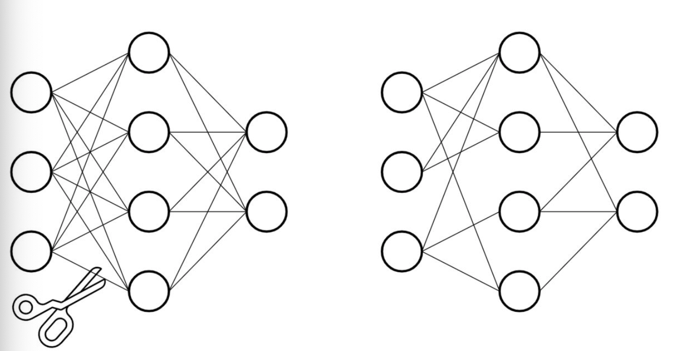
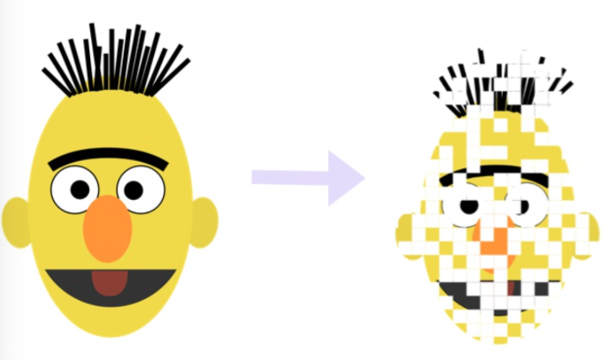

## 1 什么是模型的剪枝？

- **背景**：
  深度神经网络的大型预训练模型通常拥有庞大的参数量，才能达到 SOTA（State of the Art）的效果。然而，生物神经网络却是通过**大量稀疏连接**来完成复杂的意识活动。

- **灵感来源**：
  模仿生物神经网络的稀疏性，将大型网络中的**稠密连接**转变为**稀疏连接**，并**同样达到SOTA的效果**，这就是**模型剪枝（Pruning）**的核心思想。

  

- **PyTorch 支持**：
  PyTorch 提供了 `torch.nn.utils.prune` 模块，支持以下几种剪枝方式：

  - 对特定网络模块的剪枝（Pruning Model）
  - 多参数模块的剪枝（Pruning Multiple Parameters）
  - 全局剪枝（Global Pruning）
  - 用户自定义剪枝（Custom Pruning）

  > ⚠️ 注意：PyTorch 版本需在 **1.4.0 以上** 才支持剪枝操作。





## 2 对特定网络模块的剪枝（Pruning Model）

### 2.1 导入必要的库

```python
import torch
from torch import nn
import torch.nn.utils.prune as prune
import torch.nn.functional as F
```


### 2.2 定义 LeNet 网络结构

创建一个网络, 我们以经典的LeNet来示例：

```python
device = torch.device("cuda" if torch.cuda.is_available() else "cpu")

class LeNet(nn.Module):
    def __init__(self):
        super(LeNet, self).__init__()
        # 第一个卷积层：输入通道1（灰度图），输出通道6，卷积核3x3
        self.conv1 = nn.Conv2d(1, 6, 3)
        # 第二个卷积层：输入通道6，输出通道16，卷积核3x3
        self.conv2 = nn.Conv2d(6, 16, 3)
        # 全连接层：输入维度16*5*5，输出维度120
        self.fc1 = nn.Linear(16 * 5 * 5, 120)
        # 全连接层：输入维度120，输出维度84
        self.fc2 = nn.Linear(120, 84)
        # 输出层：输入维度84，输出维度10（分类数）
        self.fc3 = nn.Linear(84, 10)

    def forward(self, x):
        x = F.max_pool2d(F.relu(self.conv1(x)), (2, 2))  # 卷积+激活+池化
        x = F.max_pool2d(F.relu(self.conv2(x)), 2)
        x = x.view(-1, int(x.nelement() / x.shape[0]))   # 展平，x的维度为[B, C, H, W]
        x = F.relu(self.fc1(x))
        x = F.relu(self.fc2(x))
        x = self.fc3(x)
        return x

# 实例化模型并移动到设备（CPU/GPU）
model = LeNet().to(device=device)
```


### 2.3 查看模块参数（以 conv1 为例）

```python
module = model.conv1
print(list(module.named_parameters()))
```

**输出结果**：包含 `weight` 和 `bias` 两个参数。

```
[('weight', Parameter containing:
tensor([[[[ 0.0853, -0.0203, -0.0784],
          [ 0.3327, -0.0904, -0.0374],
          [-0.0037, -0.2629, -0.2536]]],


        [[[ 0.1313,  0.0249,  0.2735],
          [ 0.0630,  0.0625, -0.0468],
          [ 0.3328,  0.3249, -0.2640]]],


        [[[ 0.1931, -0.2246,  0.0102],
          [ 0.3319,  0.1740, -0.0799],
          [-0.0195, -0.1295, -0.0964]]],


        [[[ 0.3005,  0.2704,  0.3162],
          [-0.2560,  0.0295,  0.2605],
          [-0.1056, -0.0730,  0.0436]]],


        [[[-0.3205,  0.1927, -0.0761],
          [ 0.0142, -0.0562, -0.3087],
          [ 0.1202,  0.1119, -0.1336]]],


        [[[ 0.0568,  0.1142,  0.3079],
          [ 0.2000, -0.1661, -0.2935],
          [-0.1652, -0.2606, -0.0559]]]], device='cuda:0', requires_grad=True)), ('bias', Parameter containing:
tensor([ 0.1085, -0.1044,  0.1366,  0.3240, -0.1522,  0.1630], device='cuda:0',
       requires_grad=True))]
```


### 2.4 查看模块的 Buffer（剪枝前为空）

```python
print(list(module.named_buffers()))
```

**输出结果：**

```
# 这里面打印出一个空列表, 至于这个空列表代表什么含义? 剪枝操作后同学们就明白了!
[]
```


### 2.5 执行剪枝操作（以随机非结构化剪枝为例）

```python
# 对 conv1 的 weight 参数进行剪枝，剪枝比例为 30%
# 第一个参数: module, 代表要进行剪枝的特定模块, 之前我们已经制定了module=model.conv1, 说明这里要对第一个卷积层执行剪枝.
# 第二个参数: name, 指定要对选中的模块中的哪些参数执行剪枝。这里设定为name="weight", 意味着对连接网络中的weight剪枝, 而不对bias剪枝.
# 第三个参数: amount, 指定要对模型中多大比例的参数执行剪枝。amount是一个介于0.0-1.0的float数值, 或者一个正整数指定剪裁掉多少条连接边.
prune.random_unstructured(module, name="weight", amount=0.3)
```


### 2.6 再次查看参数和 Buffer

```python
print(list(module.named_parameters()))
print(list(module.named_buffers()))
```

**变化说明**：

- 原来的 `weight` 参数被替换为 `weight_orig`（原始权重）
- `module.named_buffers()`新增了 `weight_mask`（剪枝掩码，0 表示剪枝，1 表示保留）

```
[('bias', Parameter containing:
tensor([ 0.1861,  0.2483, -0.3235,  0.0667,  0.0790,  0.1807], device='cuda:0',
       requires_grad=True)), ('weight_orig', Parameter containing:
tensor([[[[-0.1544, -0.3045,  0.1339],
          [ 0.2605, -0.1201,  0.3060],
          [-0.2502, -0.0023, -0.0362]]],


        [[[ 0.3147, -0.1034, -0.1772],
          [-0.2250, -0.1071,  0.2489],
          [ 0.2741, -0.1926, -0.2046]]],


        [[[-0.1022, -0.2210, -0.1349],
          [-0.2938,  0.0679,  0.2485],
          [ 0.1108, -0.0564, -0.3328]]],


        [[[-0.0464,  0.0138,  0.0283],
          [-0.3205,  0.0184,  0.0521],
          [ 0.2219, -0.2403, -0.2881]]],


        [[[ 0.3320, -0.0684, -0.1715],
          [-0.0381,  0.1819,  0.1796],
          [-0.3321, -0.2684, -0.0477]]],


        [[[-0.1638, -0.0969,  0.0077],
          [ 0.0906,  0.2051,  0.2174],
          [-0.2174,  0.1875, -0.2978]]]], device='cuda:0', requires_grad=True))]
[('weight_mask', tensor([[[[1., 0., 1.],
          [1., 0., 1.],
          [1., 0., 1.]]],


        [[[0., 0., 0.],
          [0., 1., 1.],
          [0., 0., 1.]]],


        [[[1., 1., 1.],
          [0., 1., 1.],
          [1., 1., 1.]]],


        [[[1., 1., 1.],
          [1., 1., 1.],
          [1., 1., 1.]]],


        [[[1., 1., 1.],
          [1., 0., 1.],
          [1., 1., 0.]]],


        [[[1., 0., 1.],
          [0., 0., 1.],
          [1., 1., 0.]]]], device='cuda:0'))]
```


### 2.7 查看剪枝后的 `weight` 属性

```python
print(module.weight)
```

**说明**：

- `module.weight` 是 `weight_orig` 与 `weight_mask` 逐元素相乘的结果
- 被剪掉的权重值为 0
- 注意：**`weight` 不再是模型的参数（parameter），而是一个普通属性（attribute）**

```
tensor([[[[-0.1544, -0.0000,  0.1339],
          [ 0.2605, -0.0000,  0.3060],
          [-0.2502, -0.0000, -0.0362]]],


        [[[ 0.0000, -0.0000, -0.0000],
          [-0.0000, -0.1071,  0.2489],
          [ 0.0000, -0.0000, -0.2046]]],


        [[[-0.1022, -0.2210, -0.1349],
          [-0.0000,  0.0679,  0.2485],
          [ 0.1108, -0.0564, -0.3328]]],


        [[[-0.0464,  0.0138,  0.0283],
          [-0.3205,  0.0184,  0.0521],
          [ 0.2219, -0.2403, -0.2881]]],


        [[[ 0.3320, -0.0684, -0.1715],
          [-0.0381,  0.0000,  0.1796],
          [-0.3321, -0.2684, -0.0000]]],


        [[[-0.1638, -0.0000,  0.0077],
          [ 0.0000,  0.0000,  0.2174],
          [-0.2174,  0.1875, -0.0000]]]], device='cuda:0',
       grad_fn=<MulBackward0>)
```


### 2.8 对 `bias` 执行 L1 非结构化剪枝

```python
# 对 conv1 层的 bias 参数执行剪枝，剪掉绝对值最小的 3 个参数
# 第一个参数: module, 代表剪枝的对象, 此处代表LeNet中的conv1
# 第二个参数: name, 代表剪枝对象中的具体参数, 此处代表偏置量
# 第三个参数: amount, 代表剪枝的数量, 可以设置为0.0-1.0之间表示比例, 也可以用正整数表示剪枝的参数绝对数量
prune.l1_unstructured(module, name="bias", amount=3)

# 查看剪枝后的参数和 buffer
print("剪枝后的参数：")
print(list(module.named_parameters()))

print("\n剪枝后的 buffers（掩码）：")
print(list(module.named_buffers()))

print("\n剪枝后的 bias 值（已掩码）：")
print(module.bias)
```

- **模型参数中**：
  - 除了原有的 `weight_orig`，还新增了 `bias_orig`；
- **缓冲区（`named_buffers`）中**：
  - 同时出现了 `weight_mask` 和 `bias_mask`，用于起到掩码张量的作用。

```
[('weight_orig', Parameter containing:
tensor([[[[-0.0159, -0.3175, -0.0816],
          [ 0.3144, -0.1534, -0.0924],
          [-0.2885, -0.1054, -0.1872]]],


        [[[ 0.0835, -0.1258, -0.2760],
          [-0.3174,  0.0669, -0.1867],
          [-0.0381,  0.1156,  0.0078]]],


        [[[ 0.1416, -0.2907, -0.0249],
          [ 0.1018,  0.1757, -0.0326],
          [ 0.2736, -0.1980, -0.1162]]],


        [[[-0.1835,  0.1600,  0.3178],
          [ 0.0579, -0.0647, -0.1039],
          [-0.0160, -0.0715,  0.2746]]],


        [[[-0.2314, -0.1759, -0.1820],
          [-0.0594,  0.2355, -0.2087],
          [ 0.0216,  0.0066, -0.0624]]],


        [[[-0.2772,  0.1479, -0.0983],
          [-0.3307, -0.2360, -0.0596],
          [ 0.2785,  0.0648,  0.2869]]]], device='cuda:0', requires_grad=True)), ('bias_orig', Parameter containing:
tensor([-0.1924, -0.1420, -0.0235,  0.0325,  0.0188,  0.0120], device='cuda:0',
       requires_grad=True))]
**************************************************
[('weight_mask', tensor([[[[0., 0., 0.],
          [1., 1., 1.],
          [1., 0., 1.]]],


        [[[1., 0., 1.],
          [1., 0., 1.],
          [1., 0., 1.]]],


        [[[1., 1., 0.],
          [1., 1., 1.],
          [1., 1., 1.]]],


        [[[1., 1., 1.],
          [1., 0., 0.],
          [0., 1., 0.]]],


        [[[1., 1., 1.],
          [1., 1., 1.],
          [0., 1., 1.]]],


        [[[1., 1., 1.],
          [0., 0., 1.],
          [1., 1., 0.]]]], device='cuda:0')), ('bias_mask', tensor([1., 1., 0., 1., 0., 0.], device='cuda:0'))]
**************************************************
tensor([-0.1924, -0.1420, -0.0000,  0.0325,  0.0000,  0.0000], device='cuda:0',
       grad_fn=<MulBackward0>)
**************************************************
```


### 2.9 模型剪枝后的结构变化（`state_dict` 对比）

对于一个模型来说，不管是它原始的参数, 拥有的属性值，还是剪枝的mask buffers参数，全部都存储在模型的状态字典中, 即`state_dict()`中，将模型初始的状态字典打印出来

```python
# 打印原始模型的 state_dict 键名
print("原始模型 state_dict 键名：")
print(model.state_dict().keys())

# 对 conv1 的 weight 和 bias 都进行剪枝
prune.random_unstructured(module, name="weight", amount=0.3)
prune.l1_unstructured(module, name="bias", amount=3)

# 打印剪枝后的 state_dict 键名
print("\n剪枝后模型 state_dict 键名：")
print(model.state_dict().keys())
```

> ✅ 剪枝后：
>
> - 原始参数 `weight` → `weight_orig`
> - 原始参数 `bias` → `bias_orig`
> - 新增掩码：`weight_mask`, `bias_mask`

```
odict_keys(['conv1.weight', 'conv1.bias', 'conv2.weight', 'conv2.bias', 'fc1.weight', 'fc1.bias', 'fc2.weight', 'fc2.bias', 'fc3.weight', 'fc3.bias'])
**************************************************
odict_keys(['conv1.weight_orig', 'conv1.bias_orig', 'conv1.weight_mask', 'conv1.bias_mask', 'conv2.weight', 'conv2.bias', 'fc1.weight', 'fc1.bias', 'fc2.weight', 'fc2.bias', 'fc3.weight', 'fc3.bias'])
```


### 2.10 永久化剪枝（`remove` 操作）

通过module中的参数weight_orig和weight_mask进行剪枝，本质上属于置零遮掩，让权重连接失效。这个remove是无法undo的, 也就是说一旦执行就是对模型参数的永久改变。

```python
# 打印 remove 前的参数和 buffer
print("remove 前的参数：")
print(list(module.named_parameters()))

print("\nremove 前的 buffers：")
print(list(module.named_buffers()))

print("\nremove 前的 weight（掩码后）：")
print(module.weight)

# 执行 remove，永久保留剪枝后的 weight，并删除 mask
prune.remove(module, 'weight')

# 打印 remove 后的参数和 buffer
print("\nremove 后的参数：")
print(list(module.named_parameters()))

print("\nremove 后的 buffers：")
print(list(module.named_buffers()))
```

**永久化后的变化总结:** 

对模型的`weight`执行`remove`操作后，模型参数集合中只剩下`bias_orig`了，`weight_orig`消失， 变成了`weight`， 说明针对`weight`的剪枝已经永久化生效。 对于named_buffers张量打印可以看出，只剩下bias_mask了，因为针对weight做掩码的weight_mask已经生效完毕，不再需要保留了。

| 项目          | remove 前        | remove 后           |
| :------------ | :--------------- | :------------------ |
| `weight`      | 掩码结果（临时） | 永久保留（无 mask） |
| `weight_orig` | 原始权重（保留） | ❌ 被删除            |
| `weight_mask` | 掩码矩阵（保留） | ❌ 被删除            |
| `bias`        | 掩码结果（临时） | 保留（未 remove）   |
| `bias_orig`   | 原始偏置（保留） | 保留（未 remove）   |
| `bias_mask`   | 掩码矩阵（保留） | 保留（未 remove）   |

> `prune.remove()` 是将剪枝结果**永久写入模型参数**的关键一步，执行后掩码不再保留，模型体积可真正减小。


## 3 多参数模块的剪枝(Pruning multiple parameters)

```python
# 实例化模型并移动到设备（CPU/GPU）
model = LeNet().to(device=device)

# 打印初始模型的所有状态字典（即所有参数名）
print("初始模型 state_dict 键：")
print(model.state_dict().keys())
print('*' * 50)

# 打印初始模型的缓冲区（buffers）名称，剪枝前为空
print("初始模型 named_buffers 键：")
print(dict(model.named_buffers()).keys())
print('*' * 50)

# 遍历模型的所有子模块，按类型进行剪枝
for name, module in model.named_modules():
    # 对所有卷积层执行 L1 非结构化剪枝，剪掉 20% 的权重
    if isinstance(module, torch.nn.Conv2d):
        prune.l1_unstructured(module, name="weight", amount=0.2)
    # 对所有全连接层执行 Ln 结构化剪枝，剪掉 40% 的权重（n=2 表示 L2 范数）
    elif isinstance(module, torch.nn.Linear):
        prune.ln_structured(module, name="weight", amount=0.4, n=2)

# 打印剪枝后的缓冲区名称（此时应有各层的 weight_mask）
print("剪枝后 named_buffers 键：")
print(dict(model.named_buffers()).keys())
print('*' * 50)

# 打印剪枝后的 state_dict 键（weight 已变为 weight_orig 和 weight_mask）
print("剪枝后 state_dict 键：")
print(model.state_dict().keys())
```

✅ 结论（多参数剪枝）

- 所有参与剪枝的层的 `weight` 参数被替换为：
  - `weight_orig`（原始权重）
  - `weight_mask`（剪枝掩码）
- 初始 `named_buffers()` 为空，剪枝后包含所有参与剪枝层的 `weight_mask`

```
odict_keys(['conv1.weight', 'conv1.bias', 'conv2.weight', 'conv2.bias', 'fc1.weight', 'fc1.bias', 'fc2.weight', 'fc2.bias', 'fc3.weight', 'fc3.bias'])
**************************************************
dict_keys([])
**************************************************
dict_keys(['conv1.weight_mask', 'conv2.weight_mask', 'fc1.weight_mask', 'fc2.weight_mask', 'fc3.weight_mask'])
**************************************************
odict_keys(['conv1.bias', 'conv1.weight_orig', 'conv1.weight_mask', 'conv2.bias', 'conv2.weight_orig', 'conv2.weight_mask', 'fc1.bias', 'fc1.weight_orig', 'fc1.weight_mask', 'fc2.bias', 'fc2.weight_orig', 'fc2.weight_mask', 'fc3.bias', 'fc3.weight_orig', 'fc3.weight_mask'])
```


## 4 全局剪枝（Global Pruning）

✅背景：局部剪枝的局限性

- 前两种剪枝策略本质上属于 **局部剪枝（Local Pruning）**；
- 需要程序员 **逐层定义剪枝比例**，操作繁琐；
- 剪枝效果 **高度依赖经验**，且 **难以保证最优**。


✅ 全局剪枝（Global Pruning）优势

- **更通用、更智能**；
- **从整个网络出发**，统一排序后剪除最小权值；
- **整体设定剪枝比例**（如全局剪除 20% 参数）；
- **各层剪枝比例不同**，由模型自身参数分布决定。

> 使用全局剪枝策略时，**不是每层都剪 20%**，而是**整体剪 20%**，具体每层剪多少由算法自动决定。


🔹 全局剪枝代码示例

```python
# 重新实例化模型
model = LeNet().to(device=device)

# 打印初始模型的状态字典
print("初始模型 state_dict 键：")
print(model.state_dict().keys())
print('*' * 50)

# 定义参与全局剪枝的参数集合（此处选择所有层的 weight）
parameters_to_prune = (
    (model.conv1, 'weight'),
    (model.conv2, 'weight'),
    (model.fc1, 'weight'),
    (model.fc2, 'weight'),
    (model.fc3, 'weight'),
)

# 执行全局剪枝：在整个模型中剪掉 20% 的参数（L1 非结构化剪枝）
prune.global_unstructured(
    parameters_to_prune,
    pruning_method=prune.L1Unstructured,
    amount=0.2,
)

# 打印剪枝后的状态字典
print("全局剪枝后 state_dict 键：")
print(model.state_dict().keys())
```

```
odict_keys(['conv1.weight', 'conv1.bias', 'conv2.weight', 'conv2.bias', 'fc1.weight', 'fc1.bias', 'fc2.weight', 'fc2.bias', 'fc3.weight', 'fc3.bias'])
**************************************************
odict_keys(['conv1.bias', 'conv1.weight_orig', 'conv1.weight_mask', 'conv2.bias', 'conv2.weight_orig', 'conv2.weight_mask', 'fc1.bias', 'fc1.weight_orig', 'fc1.weight_mask', 'fc2.bias', 'fc2.weight_orig', 'fc2.weight_mask', 'fc3.bias', 'fc3.weight_orig', 'fc3.weight_mask'])
```


🔹 打印各层稀疏度（观察剪枝分布）

```python
# 打印每一层的稀疏度（即被剪枝为0的比例）
print("各层稀疏度：")
print("Sparsity in conv1.weight: {:.2f}%".format(
    100. * float(torch.sum(model.conv1.weight == 0)) / float(model.conv1.weight.nelement())
))
print("Sparsity in conv2.weight: {:.2f}%".format(
    100. * float(torch.sum(model.conv2.weight == 0)) / float(model.conv2.weight.nelement())
))
print("Sparsity in fc1.weight: {:.2f}%".format(
    100. * float(torch.sum(model.fc1.weight == 0)) / float(model.fc1.weight.nelement())
))
print("Sparsity in fc2.weight: {:.2f}%".format(
    100. * float(torch.sum(model.fc2.weight == 0)) / float(model.fc2.weight.nelement())
))
print("Sparsity in fc3.weight: {:.2f}%".format(
    100. * float(torch.sum(model.fc3.weight == 0)) / float(model.fc3.weight.nelement())
))

# 打印整个模型的全局稀疏度
total_params = (
    model.conv1.weight.nelement() +
    model.conv2.weight.nelement() +
    model.fc1.weight.nelement() +
    model.fc2.weight.nelement() +
    model.fc3.weight.nelement()
)
total_zeros = (
    torch.sum(model.conv1.weight == 0) +
    torch.sum(model.conv2.weight == 0) +
    torch.sum(model.fc1.weight == 0) +
    torch.sum(model.fc2.weight == 0) +
    torch.sum(model.fc3.weight == 0)
)

print("Global sparsity: {:.2f}%".format(100. * float(total_zeros) / float(total_params)))
```

```
Sparsity in conv1.weight: 1.85%
Sparsity in conv2.weight: 7.87%
Sparsity in fc1.weight: 21.99%
Sparsity in fc2.weight: 12.56%
Sparsity in fc3.weight: 9.17%
Global sparsity: 20.00%
```


## 5 用户自定义剪枝（Custom Pruning）

🔍 什么是自定义剪枝？

- 不依赖 PyTorch 内置的剪枝方法（如 `l1_unstructured`、`ln_structured` 等）；
- **程序员自己定义剪枝规则**；
- 通过继承 `prune.BasePruningMethod` 类，**实现自定义掩码逻辑**；
- 通常只需实现：
  - `__init__()`：初始化参数；
  - `compute_mask()`：定义如何生成掩码（mask）。


**🔧 步骤一：定义自定义剪枝类**

```python
import torch.nn.utils.prune as prune

# 自定义剪枝类，必须继承自 prune.BasePruningMethod
class MyselfPruningMethod(prune.BasePruningMethod):
    # 剪枝类型：unstructured（非结构化剪枝）
    PRUNING_TYPE = "unstructured"

    # 核心函数：定义如何生成掩码
    def compute_mask(self, t, default_mask):
        mask = default_mask.clone()  # 复制默认掩码（全1）
        # 自定义规则：每隔一个参数掩码掉一个（即50%剪枝）
        mask.view(-1)[::2] = 0
        return mask
```


🔧 步骤二：封装为易用函数

```python
# 封装自定义剪枝方法，便于调用
def myself_unstructured_pruning(module, name):
    MyselfPruningMethod.apply(module, name)
    return module
```


🧪 步骤三：使用自定义剪枝

```python
import time
from torch import nn

# 实例化模型
model = LeNet().to(device=device)

# 记录开始时间
start = time.time()

# 对 model.fc3 的 bias 执行自定义剪枝
myself_unstructured_pruning(model.fc3, name="bias")

# 打印生成的 bias_mask（掩码张量）
print("生成的 bias_mask：")
print(model.fc3.bias_mask)

# 打印剪枝耗时
duration = time.time() - start
print(f"自定义剪枝耗时：{duration * 1000:.2f} ms")
```


✅ 输出结果示例：

```text
生成的 bias_mask：
tensor([0., 1., 0., 1., 0., 1., 0., 1., 0., 1.], device='cuda:0')
自定义剪枝耗时：1.72 ms
```


✅ 结论总结：

- 掩码 `bias_mask` 完全按照自定义规则生成（0 和 1 交替）；
- 后续执行 `remove()` 操作后，`bias_orig` 中对应位置将被永久剪除；
- 在 GPU 上执行效率极高，**仅需约 1.7ms**；
- 自定义剪枝 **灵活、轻量、可扩展**，适合特殊结构化需求。