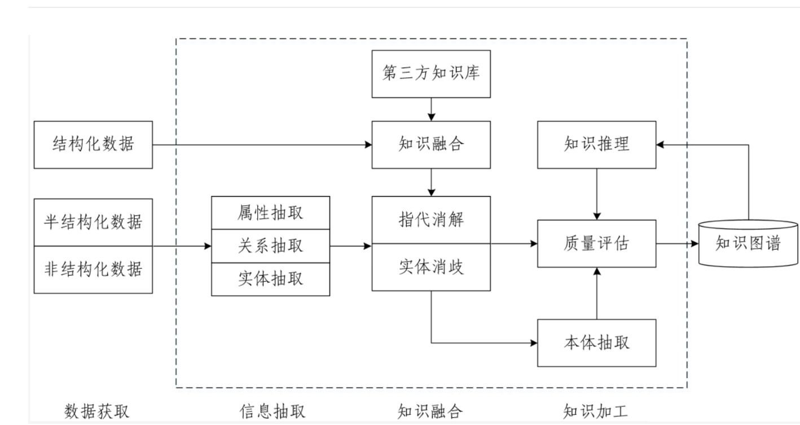
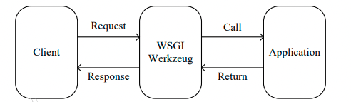
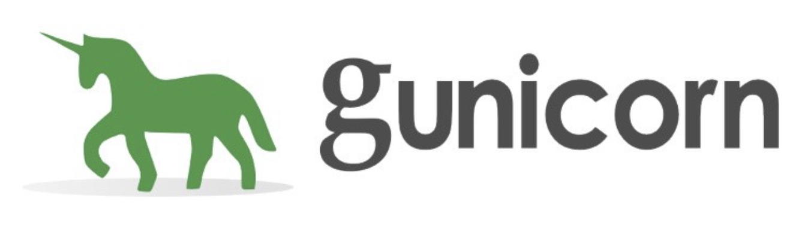

## 1 知识图谱介绍

### 1.1 什么是知识图谱

```properties
 知识图谱（Knowledge Graph）是人工智能的重要分支技术，它在2012年由谷歌提出.
 知识图谱就是用图的形式将知识表示出来. 图中的结点代表语义实体或概念，边代表结点间的各种语义关系.
```

- 形式

  

### 1.2 知识图谱的应用场景

知识图谱的应用领域非常广泛，包括但不限于以下方面：
| 应用领域           | 知识图谱的具体应用                                           |
| ------------------ | ------------------------------------------------------------ |
| 搜索引擎           | 提供智能搜索结果，通过语义理解和实体关联，帮助用户更准确地找到所需信息。 |
| 智能助手和虚拟助手 | 提供智能语音交互和问答系统，通过自然语言处理和语义理解，实现更智能的语音交互。 |
| 金融领域           | 用于风险评估、信用评级、欺诈检测等，通过分析金融数据和实体关系，提升智能化水平。 |
| 医疗领域           | 用于医学知识库构建、疾病诊断、药物研发等，通过医学知识的语义关联和整合，提升智能化水平。 |
| 教育领域           | 用于教育资源整合、个性化学习等，通过知识关联和学习分析，提升教育教学的智能化水平。 |
| 电商领域           | 用于商品推荐、用户画像分析等，通过分析用户行为和兴趣，提升个性化推荐能力。 |
| 社交网络           | 用于社交网络的语义理解和关系挖掘，通过监测和分析用户行为，提升服务质量和用户体验。 |
| 物联网领域         | 用于智能家居、智能交通等，通过数据融合和智能化处理，提升物联网应用的智能化水平。 |


### 1.3 知识图谱的技术架构

​	


#### 1.3.1 数据获取

目前，知识图谱的数据源按来源渠道可分为两类：

- **业务内部数据**：通常存储在行业内部数据库中，以结构化形式存在，属于非公开或半公开数据。
- **网络公开数据**：通过网页抓取获得，通常为非结构化数据。

按数据结构划分，可分为以下三类：

- **结构化数据**
- **半结构化数据**
- **非结构化数据**

针对不同数据类型，采用相应处理方法。


#### 1.3.2 信息抽取

信息抽取的关键是从异构数据源中自动提取信息，生成候选知识单元。主要挑战在于处理非结构化数据，需借助自然语言处理（NLP）技术。关键技术包括：

**实体抽取（Entity Extraction）**

- **定义**：从文本中识别具有特定意义的命名实体（如人物、地点、组织、日期、货币等）。
- **方法**：采用命名实体识别（NER）技术，结合规则、统计模型或深度学习模型进行识别与标注。

**关系抽取（Relation Extraction）**

- **定义**：识别并提取文本中不同实体之间的关系（如作者关系、工作关系、亲属关系等）。
- **方法**：基于监督学习，使用有标签数据训练模型，采用统计或深度学习方法识别关系。

**属性抽取（Attribute Extraction）**

- **定义**：提取与实体相关的属性信息（如人物职业、地点经纬度等）。
- **方法**：使用规则匹配、统计方法或深度学习模型提取属性。

> 注：属性可视为实体与属性值之间的名词性关系，因此属性抽取可转化为关系抽取任务。


#### 1.3.3 知识融合

知识融合旨在将来自不同来源、格式、结构的异构数据整合为一致的知识图谱，主要解决以下问题：

- **消除冗余**：合并重复实体或关系，确保图谱精简。
- **统一表达**：将不同表示方式的相同概念或关系统一标准化。
- **解决冲突**：处理不同数据源间的矛盾，通过可信度评估选择保留版本。
- **知识扩展**：从多源数据中挖掘新知识，丰富图谱内容。

**关键技术包括：**

- 指代消解
- 实体消歧（实体链接）
- 实体统一（实体对齐）
- 关系对齐

> 后续章节将详细分析上述技术。


#### 1.4.4 知识加工

经过信息抽取与知识融合后，获得一系列基本事实表达，但尚未构成完整知识体系。需通过质量评估（部分需人工甄别）筛选合格内容，最终纳入知识库，确保知识图谱的准确性与可靠性。


## 2 工具介绍

### 2.1 Doccano数据标注平台

**Doccano** 是一款开源的文本标注工具，旨在简化和加速文本标注任务，支持构建高质量的训练数据集，广泛应用于机器学习与自然语言处理项目。


**主要功能特点：**

- **多种标注类型**：支持命名实体识别（NER）、文本分类、关系抽取等常见任务，按需选择标注类型。
- **协作标注**：支持多人协同标注，标注人员可独立标注同一数据，并进行交互与讨论，提升一致性与准确性。
- **快速导入导出**：支持 CSV、JSON、TXT 等格式导入原始数据，标注完成后可导出为标准格式，便于后续建模与分析。

> 具体标注方法将在下节课详细介绍。


### 2.2 Flask web服务框架


**Flask** 是一个轻量级的 Python Web 框架，因其简洁灵活而广受欢迎，也是 PyTorch 官方推荐的部署框架之一。**Flask**的基本模式为在程序里将一个视图函数分配给一个URL，每当用户访问这个URL时，系统就会执行给该URL分配好的视图函数，获取函数的返回值，其工作过程见图：




**项目中的作用：**

- 封装模型逻辑
- 提供 API 接口服务


**安装命令：**

```bash
pip install flask
```


**Flask 基本使用方法**

示例代码：

```python
# 导入Flask类
from flask import Flask

# 创建一个该类的实例app, 参数为__name__, 这个参数是必需的，这样Flask才能知道在哪里可找到模板和静态文件等东西。
app = Flask(__name__)

# 使用route()装饰器来告诉Flask触发函数的URL
@app.route('/')
def hello_world():
    """请求指定的url后，执行的主要逻辑函数"""
    return 'Hello, World!'  # 在用户浏览器中显示信息：'Hello, World!'

# 启动服务
if __name__ == '__main__':
    app.run(host="0.0.0.0", port=5000)
```

**启动方式：**

```bash
python app.py
```

**访问效果：**在浏览器中访问 `http://0.0.0.0:5000`，页面将显示：

```
Hello, World!
```


### 2.3 Gunicorn服务组件

**Gunicorn** 是一个高性能的 Python WSGI UNIX HTTP 服务组件，源自 Ruby 的 Unicorn 项目，具有轻量、高效、易用的特点。

**项目中的作用：**

- 与 Flask 配合使用，提供稳定、高性能的服务支持
- 有效降低请求丢包率，提升并发处理能力



**安装命令：**

```bash
pip install gunicorn
```

**启动 Flask 服务（单进程示例）：**

```bash
gunicorn -w 1 -b 0.0.0.0:5000 app:app
```

- `-w 1`：启动 1 个 worker 进程
- `-b`：指定绑定的 IP 和端口
- `app:app`：指定 Flask 应用对象（位于 `app.py` 中的 `app`）

**后台运行（可选）：**

```bash
nohup gunicorn -w 1 -b 0.0.0.0:5000 app:app 2>&1 &
```


### 2.4 Neo4j图数据库

**Neo4j** 是一款高性能的图数据库，采用图结构存储数据，擅长处理复杂关系查询，是知识图谱项目的核心存储与查询引擎。

> 后续章节将对其安装、配置与使用进行详细介绍。
