## 1 知识图谱介绍

### 1.1 什么是知识图谱

```properties
 知识图谱（Knowledge Graph）是人工智能的重要分支技术，它在2012年由谷歌提出.
 知识图谱就是用图的形式将知识表示出来. 图中的结点代表语义实体或概念，边代表结点间的各种语义关系.
```

- 形式

  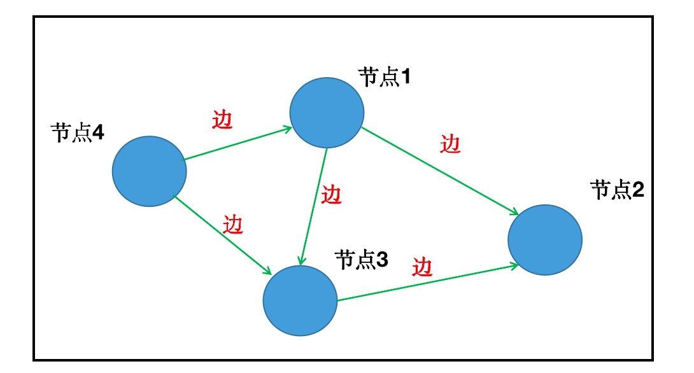

### 1.2 知识图谱的应用场景

知识图谱的应用领域非常广泛，包括但不限于以下方面：
| 应用领域           | 知识图谱的具体应用                                           |
| ------------------ | ------------------------------------------------------------ |
| 搜索引擎           | 提供智能搜索结果，通过语义理解和实体关联，帮助用户更准确地找到所需信息。 |
| 智能助手和虚拟助手 | 提供智能语音交互和问答系统，通过自然语言处理和语义理解，实现更智能的语音交互。 |
| 金融领域           | 用于风险评估、信用评级、欺诈检测等，通过分析金融数据和实体关系，提升智能化水平。 |
| 医疗领域           | 用于医学知识库构建、疾病诊断、药物研发等，通过医学知识的语义关联和整合，提升智能化水平。 |
| 教育领域           | 用于教育资源整合、个性化学习等，通过知识关联和学习分析，提升教育教学的智能化水平。 |
| 电商领域           | 用于商品推荐、用户画像分析等，通过分析用户行为和兴趣，提升个性化推荐能力。 |
| 社交网络           | 用于社交网络的语义理解和关系挖掘，通过监测和分析用户行为，提升服务质量和用户体验。 |
| 物联网领域         | 用于智能家居、智能交通等，通过数据融合和智能化处理，提升物联网应用的智能化水平。 |


### 1.3 知识图谱的技术架构

​	


#### 1.3.1 数据获取

目前，知识图谱的数据源按来源渠道可分为两类：

- **业务内部数据**：通常存储在行业内部数据库中，以结构化形式存在，属于非公开或半公开数据。
- **网络公开数据**：通过网页抓取获得，通常为非结构化数据。

按数据结构划分，可分为以下三类：

- **结构化数据**
- **半结构化数据**
- **非结构化数据**

针对不同数据类型，采用相应处理方法。


#### 1.3.2 信息抽取

信息抽取的关键是从异构数据源中自动提取信息，生成候选知识单元。主要挑战在于处理非结构化数据，需借助自然语言处理（NLP）技术。关键技术包括：

**实体抽取（Entity Extraction）**

- **定义**：从文本中识别具有特定意义的命名实体（如人物、地点、组织、日期、货币等）。
- **方法**：采用命名实体识别（NER）技术，结合规则、统计模型或深度学习模型进行识别与标注。

**关系抽取（Relation Extraction）**

- **定义**：识别并提取文本中不同实体之间的关系（如作者关系、工作关系、亲属关系等）。
- **方法**：基于监督学习，使用有标签数据训练模型，采用统计或深度学习方法识别关系。

**属性抽取（Attribute Extraction）**

- **定义**：提取与实体相关的属性信息（如人物职业、地点经纬度等）。
- **方法**：使用规则匹配、统计方法或深度学习模型提取属性。

> 注：属性可视为实体与属性值之间的名词性关系，因此属性抽取可转化为关系抽取任务。


#### 1.3.3 知识融合

知识融合旨在将来自不同来源、格式、结构的异构数据整合为一致的知识图谱，主要解决以下问题：

- **消除冗余**：合并重复实体或关系，确保图谱精简。
- **统一表达**：将不同表示方式的相同概念或关系统一标准化。
- **解决冲突**：处理不同数据源间的矛盾，通过可信度评估选择保留版本。
- **知识扩展**：从多源数据中挖掘新知识，丰富图谱内容。

**关键技术包括：**

- 指代消解
- 实体消歧（实体链接）
- 实体统一（实体对齐）
- 关系对齐

> 后续章节将详细分析上述技术。


#### 1.4.4 知识加工

经过信息抽取与知识融合后，获得一系列基本事实表达，但尚未构成完整知识体系。需通过质量评估（部分需人工甄别）筛选合格内容，最终纳入知识库，确保知识图谱的准确性与可靠性。


## 2 工具介绍

### 2.1 项目应用工具概览

#### 2.1.1 Doccano数据标注平台

**Doccano** 是一款开源的文本标注工具，旨在简化和加速文本标注任务，支持构建高质量的训练数据集，广泛应用于机器学习与自然语言处理项目。


**主要功能特点：**

- **多种标注类型**：支持命名实体识别（NER）、文本分类、关系抽取等常见任务，按需选择标注类型。
- **协作标注**：支持多人协同标注，标注人员可独立标注同一数据，并进行交互与讨论，提升一致性与准确性。
- **快速导入导出**：支持 CSV、JSON、TXT 等格式导入原始数据，标注完成后可导出为标准格式，便于后续建模与分析。


#### 2.1.2 Flask web服务框架


**Flask** 是一个轻量级的 Python Web 框架，因其简洁灵活而广受欢迎，也是 PyTorch 官方推荐的部署框架之一。**Flask**的基本模式为在程序里将一个视图函数分配给一个URL，每当用户访问这个URL时，系统就会执行给该URL分配好的视图函数，获取函数的返回值，其工作过程见图：


**项目中的作用：**

- 封装模型逻辑
- 提供 API 接口服务


**安装命令：**

```bash
pip install flask
```


**Flask 基本使用方法**

示例代码：

```python
# 导入Flask类
from flask import Flask

# 创建一个该类的实例app, 参数为__name__, 这个参数是必需的，这样Flask才能知道在哪里可找到模板和静态文件等东西。
app = Flask(__name__)

# 使用route()装饰器来告诉Flask触发函数的URL
@app.route('/')
def hello_world():
    """请求指定的url后，执行的主要逻辑函数"""
    return 'Hello, World!'  # 在用户浏览器中显示信息：'Hello, World!'

# 启动服务
if __name__ == '__main__':
    app.run(host="0.0.0.0", port=5000)
```

**启动方式：**

```bash
python app.py
```

**访问效果：**在浏览器中访问 `http://0.0.0.0:5000`，页面将显示：

```
Hello, World!
```


#### 2.1.3 Gunicorn服务组件

**Gunicorn** 是一个高性能的 Python WSGI UNIX HTTP 服务组件，源自 Ruby 的 Unicorn 项目，具有轻量、高效、易用的特点。

**项目中的作用：**

- 与 Flask 配合使用，提供稳定、高性能的服务支持
- 有效降低请求丢包率，提升并发处理能力


**安装命令：**

```bash
pip install gunicorn
```

**启动 Flask 服务（单进程示例）：**

```bash
gunicorn -w 1 -b 0.0.0.0:5000 app:app
```

- `-w 1`：启动 1 个 worker 进程
- `-b`：指定绑定的 IP 和端口
- `app:app`：指定 Flask 应用对象（位于 `app.py` 中的 `app`）

**后台运行（可选）：**

```bash
nohup gunicorn -w 1 -b 0.0.0.0:5000 app:app 2>&1 &
```


#### 2.1.4 Neo4j图数据库

**Neo4j** 是一款高性能的图数据库，采用图结构存储数据，擅长处理复杂关系查询，是知识图谱项目的核心存储与查询引擎。

> 后续章节将对其安装、配置与使用进行详细介绍。


### 2.2 Doccano 安装与使用指南

**✅ 一、Doccano 简介**

- **全称**：Document Annotation
- **用途**：开源文本标注工具，适用于：
  - 命名实体识别（NER）
  - 情感分析
  - 文本分类
  - 序列到序列任务
- **优势**：
  - 操作便捷
  - 支持多人协作
  - 支持多种标注格式（TextLine、JSONL、CoNLL 等）


**🛠️ 二、安装步骤（需在虚拟环境中进行）**

**1. 安装 Doccano**

```bash
pip install doccano
```

**2. 初始化数据库**

```bash
doccano init
```

**3. 创建超级用户（管理员）**

```bash
doccano createuser --username admin --password 1234
```


**🚀 三、启动服务**

**1. 启动 Web 服务（端口 8000）**

```bash
doccano webserver --port 8000
```

**2. 启动任务队列（另开一个终端）**

```bash
doccano task
```


**🌐 四、访问与登录**

- 打开浏览器访问：[http://127.0.0.1:8000](http://127.0.0.1:8000/)
- 点击「快速开始」→ 使用管理员账号登录（如 admin/1234）


**📁 五、创建项目**

- 登录后进入「项目」页面
- 点击左上角「创建」按钮
- 填写项目名称、描述，选择任务类型（如 NER、文本分类等）
- 可选功能：
  - 允许项目成员创建标签
  - 允许重叠标注
  - 启用关系标注（用于关系抽取）


**📥 六、导入数据集**

**1. 进入「数据集」标签页**

**2. 点击「操作」→「导入数据集」**

支持格式说明：

| 格式     | 说明                  |
| :------- | :-------------------- |
| TextFile | 整个 txt 文件作为一页 |
| TextLine | 每行作为一页（推荐）  |
| JSONL    | 每行一个 JSON 对象    |
| CoNLL    | 用于依存句法分析      |

> ✅ 推荐使用 **TextLine** 格式，编码为 **UTF-8**，避免空行。


**🏷️ 七、添加标签（Label）**

- 进入「标签」页面
- 点击「操作」→「创建标签」
- 设置：
  - 标签名（如 People、Location）
  - 快捷键（如 p 对应 People）
  - 颜色（可选）

> ⚠️ 此步骤仅为配置标签，非实际标注。


**👥 八、添加成员（多人协作）**

1. **创建新用户**

- 访问：http://127.0.0.1:8000/admin/
- 登录管理员账号 → 添加用户（如 小明）

2. **分配角色**

- 返回项目页面 →「成员」标签
- 点击「添加成员」→ 搜索用户（如 小明）
- 设置角色：
  - 标注员（仅可标注）
  - 项目管理员（可配置项目）
  - 审查员（可审核标注）


**📖 九、添加标注指南（可选但推荐）**

- 进入「指南」页面
- 添加标注规则说明（如 NER 实体定义、情感分类标准）
- 有助于统一标注标准，提升数据质量


**✍️ 十、开始标注**

- 使用标注员账号（如 小明）登录
- 点击「开始标注」
- 选中文本 → 弹出标签选择框 → 选择标签或按快捷键（如 p）


**📤 十一、导出标注结果**

- 管理员账号登录
- 进入「数据集」页面
- 点击「操作」→「导出数据集」
- 选择格式（如 JSONL）
- 可选：仅导出已审核文档

**导出示例（JSONL）：**

```json
{"id":12,"text":"马云是阿里巴巴的创始人，总部位于杭州。","label":[[0,2,"People"],[3,7,"Company"],[16,18,"Location"]]}
```


### 2.3 知识查询语言介绍

#### 2.3.1 知识图谱查询语言概览

> 查询与检索是知识图谱的核心能力之一，选择合适的查询语言至关重要。

| 查询语言    | 适用场景                   | 特点                           |
| :---------- | :------------------------- | :----------------------------- |
| **SQL**     | 传统关系型数据库           | 表结构、强 schema、join 关联   |
| **SPARQL**  | RDF 图数据                 | W3C 标准、图匹配、声明式       |
| **Gremlin** | 属性图（Apache TinkerPop） | 图遍历、灵活、适合复杂路径查询 |
| **Cypher**  | 属性图（Neo4j）            | 简洁、强大、专为图优化         |


#### 2.3.2 各语言详细介绍

**SQL（结构化查询语言）**

- ✅ 优点：
  - 工程师熟悉
  - 强 schema 定义
- ❌ 缺点：
  - 属性值多值时需拆表
  - 多跳关联查询性能差
  - 不适合三元组结构的知识图谱

> 📌 **结论**：SQL 不适合高效处理知识图谱中的多跳关系查询。


**SPARQL（W3C 标准 RDF 查询语言）**

- ✅ 特点：
  - 声明式语言（只需描述目标，不需指定步骤）
  - 借鉴 SQL 语法
  - 基于图匹配机制
- 📅 发布时间：2008 年成为 W3C 推荐标准

✅ 示例：查询图书名称

```sparql
SELECT ?title
WHERE {
  org:book dc:title ?title .
}
```

> 📌 **结论**：适合 RDF 数据模型，语法简洁，但后续课程重点使用 **Cypher**。


**Gremlin（Apache TinkerPop 图遍历语言）**

- ✅ 特点：
  - 属性图模型（实体在表中，关系是指针）
  - 图遍历为核心
  - 擅长路径查询（如：最短路径、几度关系）

**示例：查询“gremlin 的朋友的朋友”的姓名**

```groovy
g.V().has("name", "gremlin").out("knows").out("knows").values("name")
```

> 📌 **结论**：适合图结构复杂、路径分析任务，学习曲线略陡。

🔗 官网：[http://tinkerpop.apache.org](http://tinkerpop.apache.org/)


**Cypher（Neo4j 专用图查询语言）**

- ✅ 特点：
  - 声明式语言
  - 借鉴 SQL、SPARQL、Python/Haskell 的语义
  - 专为图结构优化，语法简洁直观
  - Neo4j 官方推荐语言

> 📌 **结论**：**本课程重点讲解语言**，适合高效查询、更新和管理图数据。


**总结对比表**

| 特性/语言 | SQL        | SPARQL       | Gremlin    | Cypher            |
| :-------- | :--------- | :----------- | :--------- | :---------------- |
| 数据模型  | 表结构     | RDF 三元组   | 属性图     | 属性图            |
| 查询方式  | 集合操作   | 图匹配       | 图遍历     | 图匹配            |
| 多跳查询  | ❌ 低效     | ✅            | ✅          | ✅                 |
| 学习难度  | 低         | 中           | 高         | 低~中             |
| 应用场景  | 传统数据库 | RDF 知识图谱 | 图遍历分析 | 图数据库（Neo4j） |


### 2.4 Neo4j图数据库

#### 2.4.1 Neo4j 介绍

**Neo4j** 是由 **Java** 实现的开源 **NoSQL 图数据库**，自 **2003 年**开始研发，于 **2007 年**发布首个版本。如今，Neo4j 已被全球数十万家公司和组织广泛采用。


**核心特点：**

- 实现了**专业数据库级别的图数据模型存储**。
- 与普通的图处理框架或内存级数据库不同，Neo4j 提供了**完整的数据库特性**，包括：
  - **ACID 事务支持**
  - **集群支持**
  - **备份与故障转移**

> 适用于**企业级生产环境**下的各类应用场景。


**版本说明：**

| 版本类型   | 特点说明                                                   |
| :--------- | :--------------------------------------------------------- |
| **企业版** | 需付费授权，提供**高可用性**、**热备份**等企业级性能支持。 |
| **社区版** | 免费使用，但**仅支持单点部署**，适合开发测试或小型项目。   |


**Neo4j 图数据库核心概念**

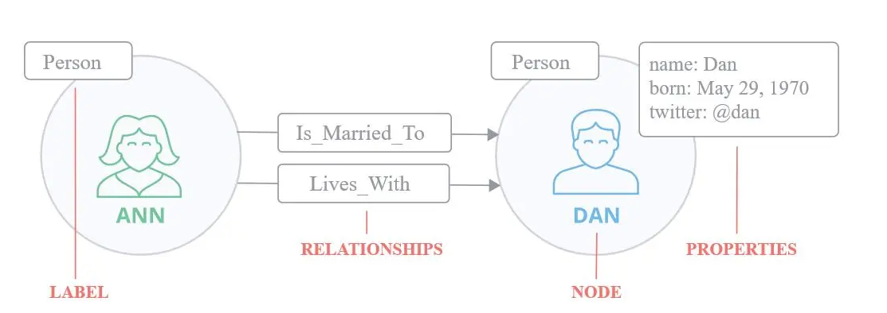

Neo4j 使用图模型来表示和存储数据，核心概念包括：

**1. 节点（Node）**

- **定义**：图中的基本数据单元。
- **特点**：
  - 可包含一个或多个 **属性**（键值对）。
  - 可有一个或多个 **标签**（用于分类）。
- **类比**：可类比为关系型数据库中的“表”，标签类似“表名”，属性类似“字段”。


**2. 关系（Relationship）**

- **定义**：连接两个节点的边，具有方向性。
- **特点**：
  - 可包含属性（键值对）。
  - 用于表示节点之间的语义连接（如 `Is_Married_To`、`Lives_With`）。


**3. 属性（Property）**

- **定义**：节点或关系中存储的数据。
- **特点**：
  - 由键（字符串）和值组成。
  - 可建立索引或约束，支持复合索引。


**4. 标签（Label）**

- **定义**：用于将节点分组。
- **特点**：
  - 一个节点可有多个标签。
  - 标签可被索引，提升查询效率。


#### 2.4.2 Cypher介绍与使用

##### 1 create命令

- 创建图数据中的节点
- 演示:

```python
# 创建命令格式: 
# 此处create是关键字, 创建节点名称node_name, 节点标签Node_Label, 放在小括号里面()
# 后面把所有属于节点标签的属性放在大括号'{}'里面, 依次写出属性名称: 属性值, 不同属性用逗号','分隔
# 例如下面命令创建一个节点e, 节点标签是Employee, 拥有id, name, salary, deptnp四个属性: 
CREATE (e:Employee{id:222, name:'Bob', salary:6000, deptnp:12}）
```

- 效果

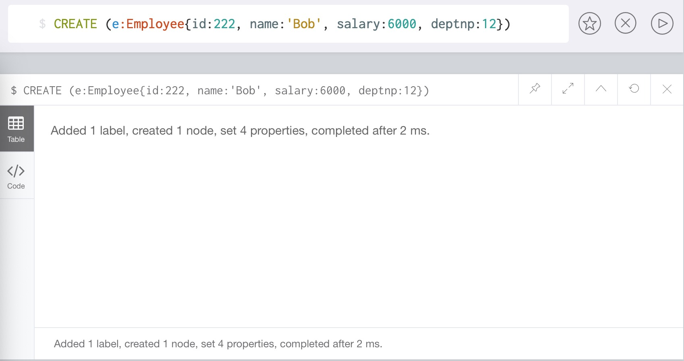


##### 2 match命令

- 匹配(查询)已有数据
- 演示:

```python
# match命令专门用来匹配查询, 节点名称: 节点标签, 依然放在小括号内, 然后使用return语句返回查询结果, 和SQL很相似. 
MATCH (e:Employee) RETURN e.id, e.name, e.salary, e.deptno

MATCH (n) return n # 查询所有结点
```

- 效果

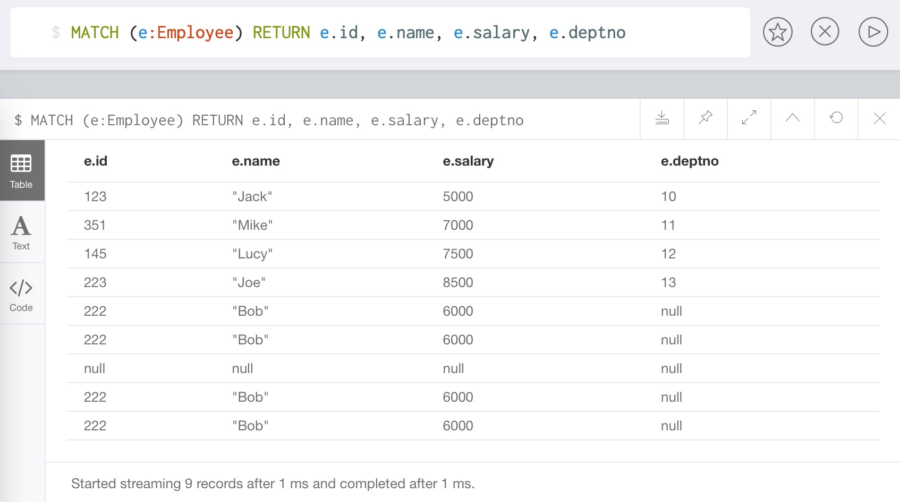


##### 3 merge命令

- 若节点存在, 则等效与**match**命令; 节点不存在, 则等效于**create**命令.
- 演示:

```python
MERGE (e:Employee {id:146, name:'Lucer', salary:3500, deptno:16})
```

- 效果:

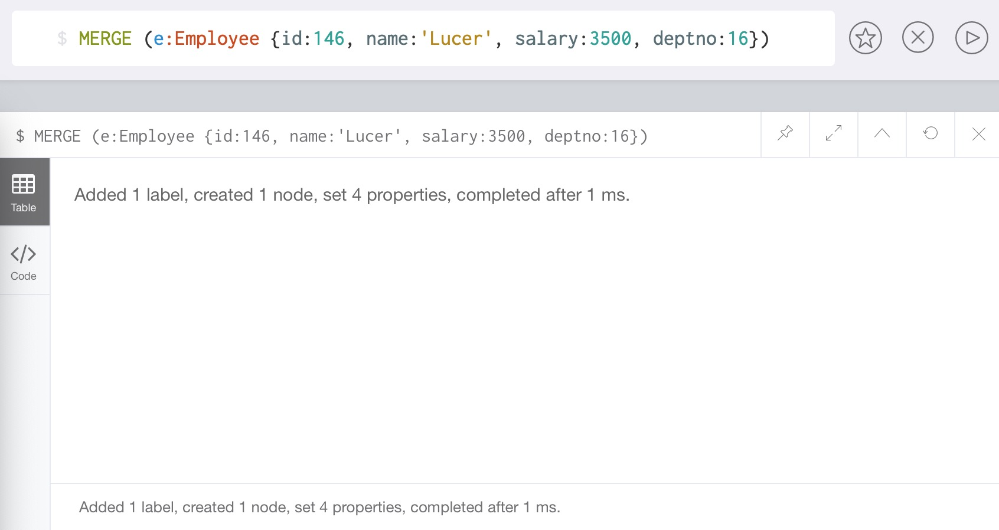


- 然后再次用merge查询, 发现数据库中的数据并没有增加, 因为已经存在相同的数据了, merge匹配成功.
- 演示:

```python
MERGE (e:Employee {id:146, name:'Lucer', salary:3500, deptno:16})
```

- 效果:

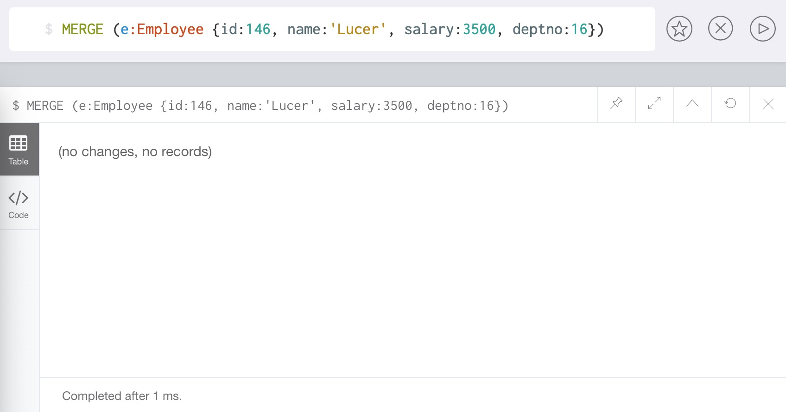


##### 4 使用create创建关系

- 总是创建新节点，同时创建有方向性的关系, 否则报错.
- 演示:

```python
# 创建一个节点p1到p2的有方向关系, 这个关系r的标签为Buy, 代表p1购买了p2, 方向为p1指向p2
CREATE (p1:Profile1)-[r:Buy]->(p2:Profile2)
```

- 效果:

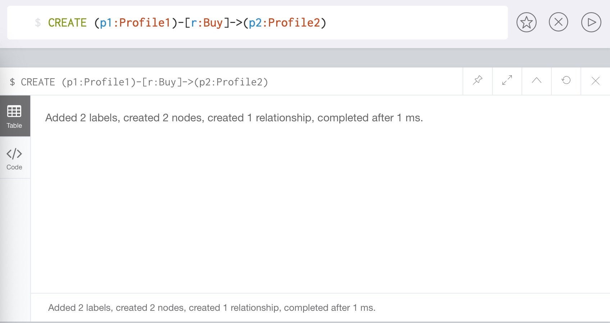


##### 5 使用merge创建关系

- 看是否有匹配的节点，然后可以创建有/无方向性的关系.
- 演示:

```python
# 创建一个节点p1到p2的无方向关系, 这个关系r的标签为miss, 代表p1-miss-p2, 方向为相互的
MERGE (p1:Profile1)-[r:miss]-(p2:Profile2)
```

- 效果:

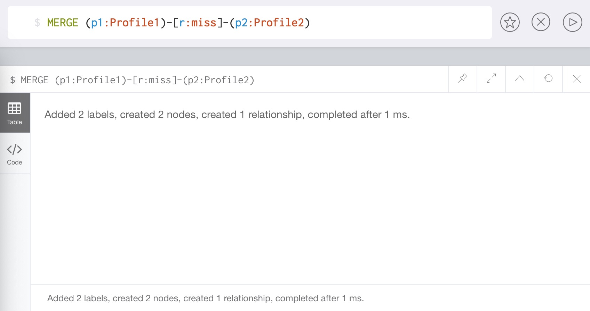


##### 6 where命令

- 类似于SQL中的添加查询条件.
- 演示:

```python
# 查询节点Employee中, id值等于123的那个节点
MATCH (e:Employee) WHERE e.id=123 RETURN e
```

- 效果:

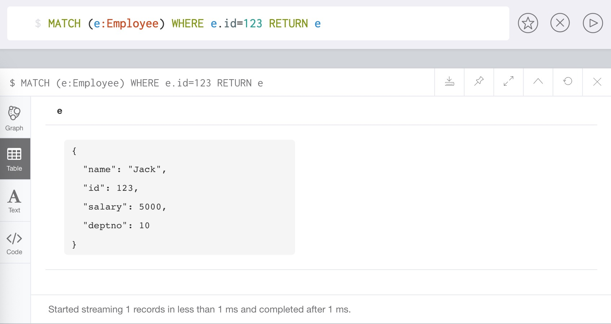


##### 7 delete命令

- 删除节点/关系及其关联的属性.
- 演示:

```python
# 注意: 删除节点的同时, 也要删除关联的关系边
MATCH (p1:Profile1)-[r]-(p2:Profile2) DELETE p1, r, p2
```

- 效果:

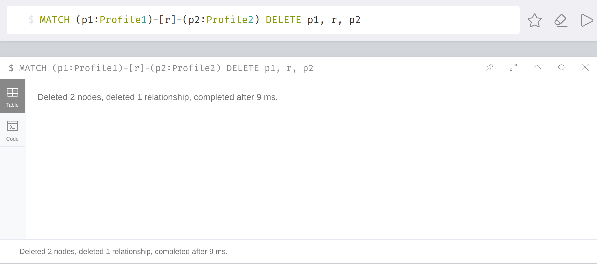


##### 8 sort命令

- Cypher命令中的排序使用的是order by.
- 演示:

```python
# 匹配查询标签Employee, 将所有匹配结果按照id值升序排列后返回结果
MATCH (e:Employee) RETURN e.id, e.name, e.salary, e.deptno ORDER BY e.id

# 如果要按照降序排序, 只需要将ORDER BY e.salary改写为ORDER BY e.salary DESC
MATCH (e:Employee) RETURN e.id, e.name, e.salary, e.deptno ORDER BY e.salary DESC
```

- 效果:

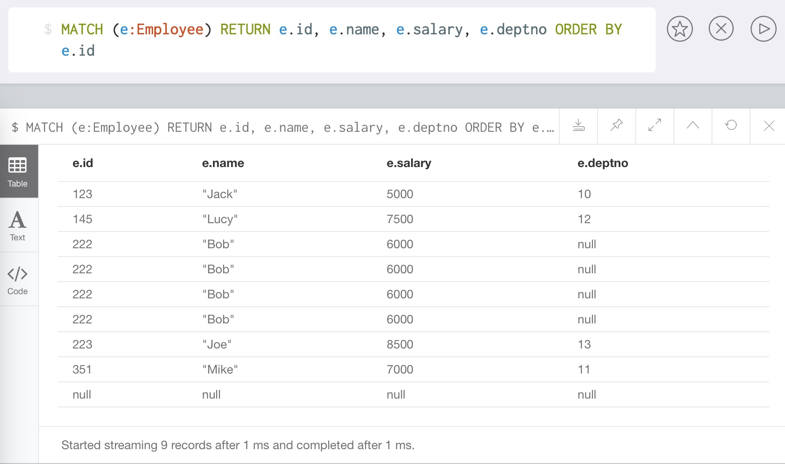


##### 9 字符串函数:

**1 toUpper()函数**

- 将一个输入字符串转换为大写字母.
- 演示:

```python
MATCH (e:Employee) RETURN e.id, toUpper(e.name), e.salary, e.deptno
```

- 效果:

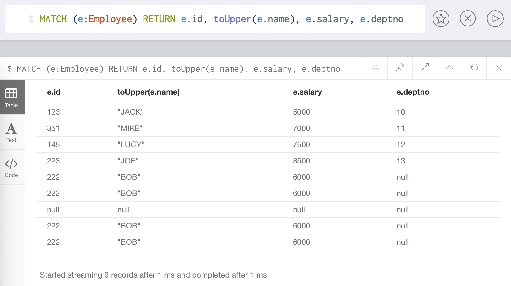


**2 toLower()函数**

- 将一个输入字符串转换为小写字母.
- 演示:

```python
MATCH (e:Employee) RETURN e.id, toLower(e.name), e.salary, e.deptno
```

- 效果:

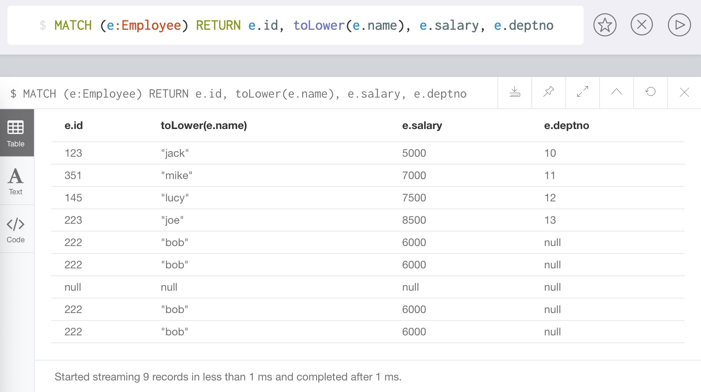


**3 substring()函数**

- 返回一个子字符串.
- 演示:

```python
# 输入字符串为input_str, 返回从索引start_index开始, 到要提取的字符数量，如果省略则提取到字符串末尾
substring(input_str, start_index, length)

# 示例代码, 返回员工名字的前两个字母
MATCH (e:Employee) RETURN e.id, substring(e.name,0,2), e.salary, e.deptno
```

- 效果:

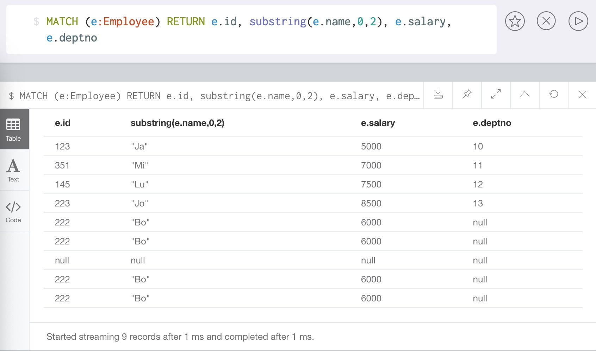


**4 replace()函数**

- 替换掉子字符串.
- 演示:

```python
# 输入字符串为input_str, 将输入字符串中符合origin_str的部分, 替换成new_str
replace(input_str, origin_str, new_str)

# 示例代码, 将员工名字替换为添加后缀_HelloWorld
MATCH (e:Employee) RETURN e.id, replace(e.name,e.name,e.name + "_HelloWorld"), e.salary, e.deptno
# 还原
MATCH (e:Employee) RETURN e.id, replace(e.name, "_HelloWorld", ""), e.salary, e.deptno
```

- 效果:

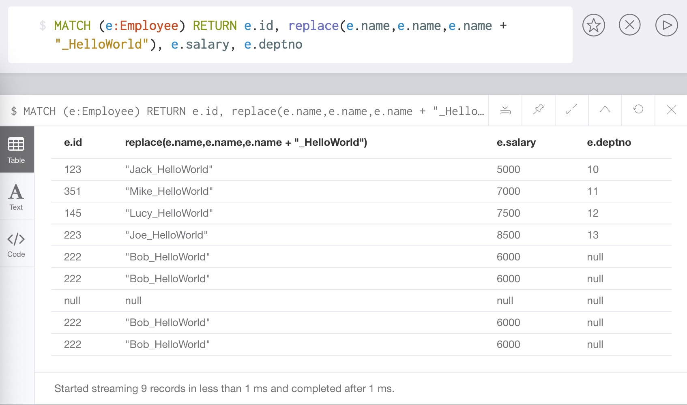


##### 10 聚合函数

**1 count()函数**

- 返回由match命令匹配成功的条数.
- 演示:

```python
# 返回匹配标签Employee成功的记录个数
MATCH (e:Employee) RETURN count( * )
```

- 效果:

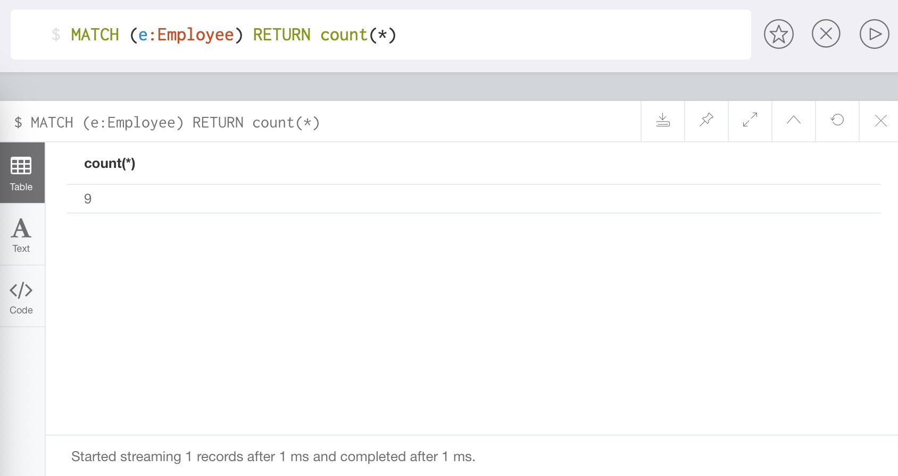


**2 max()函数**

- 返回由match命令匹配成功的记录中的最大值.
- 演示:

```python
# 返回匹配标签Employee成功的记录中, 最高的工资数字
MATCH (e:Employee) RETURN max(e.salary)
```

- 效果:


**3 min()函数**

- 返回由match命令匹配成功的记录中的最小值.
- 演示:

```python
# 返回匹配标签Employee成功的记录中, 最低的工资数字
MATCH (e:Employee) RETURN min(e.salary)
```

- 效果:

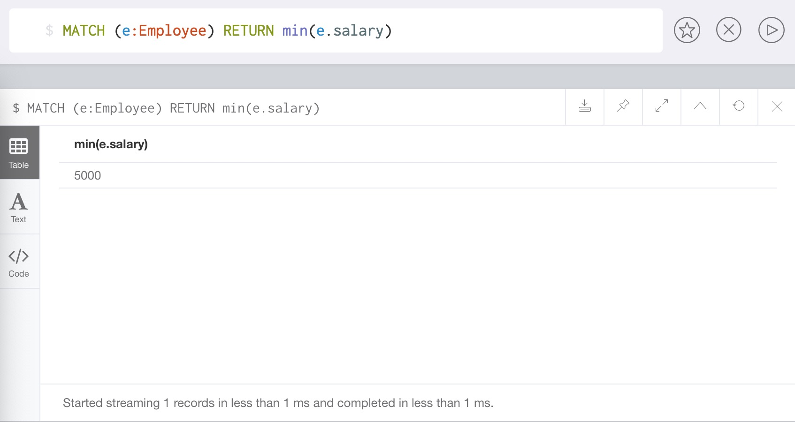


**4 sum()函数**

- 返回由match命令匹配成功的记录中某字段的全部加和值.
- 演示:

```python
# 返回匹配标签Employee成功的记录中, 所有员工工资的和
MATCH (e:Employee) RETURN sum(e.salary)
```

- 效果:


**5 avg()函数**

- 返回由match命令匹配成功的记录中某字段的平均值.
- 演示:

```python
# 返回匹配标签Employee成功的记录中, 所有员工工资的平均值
MATCH (e:Employee) RETURN avg(e.salary)
```

- 效果:

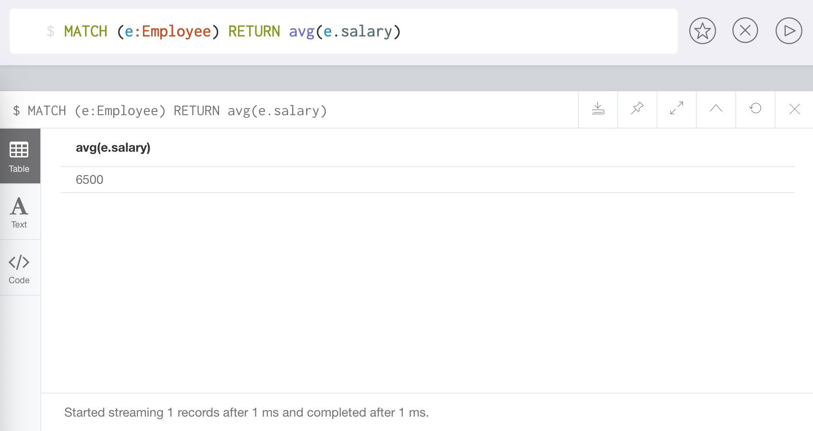


##### 11 索引index

- Neo4j支持在节点或关系属性上的索引, 以提高查询的性能.
- 可以为具有相同标签名称的所有节点的属性创建索引.

**1 创建索引**

- 使用create index on来创建索引.
- 演示:

```python
# 创建节点Employee上面属性id的索引
CREATE INDEX ON:Employee(id)
```

- 效果:


**2 删除索引**

- 使用drop index on来删除索引.
- 演示:

```
# 删除节点Employee上面属性id的索引
DROP INDEX ON:Employee(id)
```

- 效果:

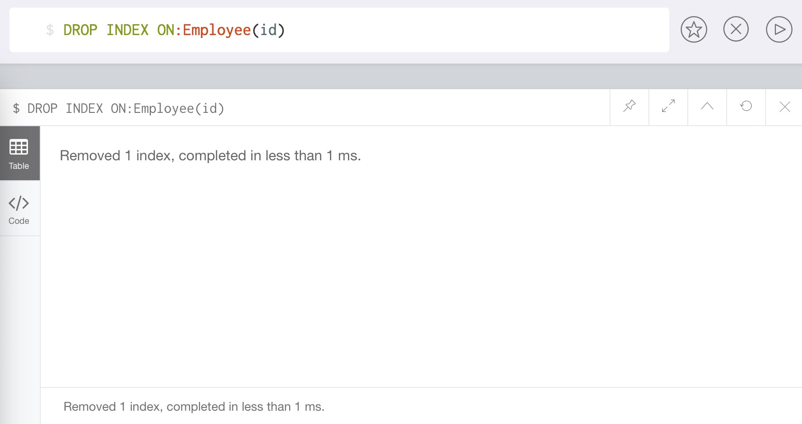
