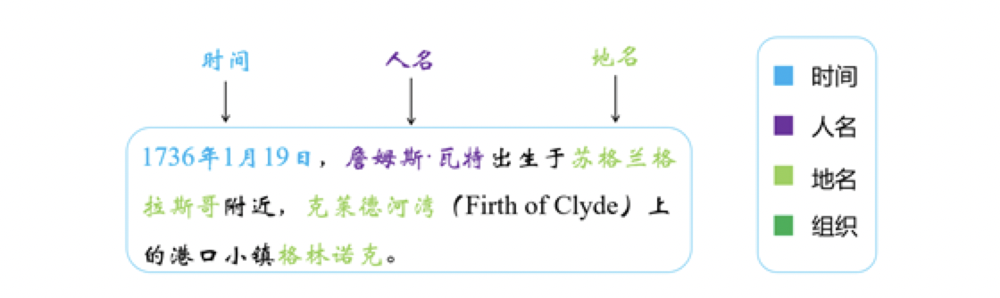

## 1 实体抽取基本知识

### 1.1 什么是命名实体识别（NER）

**实体**：文本中承载信息的语义单元，是文本语义理解的基础。

- 常见实体类型包括：人名、地名、机构名、时间、日期、货币、百分比。

- 示例句子：

  

  - 时间实体：1736年1月19日
  - 人名实体：詹姆斯·瓦特
  - 地名实体：苏格兰、格拉斯哥、克莱德河湾、格林诺克

**NER任务目标**：从文本中识别出这些命名性实体，并将其分类到指定类别。


### 1.2 命名实体识别的方法

#### 1.2.1 基于规则的方法

- **适用场景**：适用于文本结构较为规范、实体有明显上下文的场景（如价格抽取）。
- **优点**：
  - 简单、快速
- **缺点**：
  - 适用性差
  - 维护成本高，随语料复杂度增加，规则可能冲突，系统难以维护

> 示例：
> 若价格格式统一为“数字+元”，可用正则表达式 `\d+\.?\d+元` 抽取。
> 若出现“一千八百万”、“伍佰贰拾圆”、“2000万元”等多样表达，则需不断修改规则。


#### 1.2.2 基于传统机器学习的方法

- **基本流程**：
  1. 人工选择特征（如词性、上下文、词缀等）
  2. 选择并训练统计模型
  3. 使用模型预测实体
- **常用标注方法**：
  - IO
  - BIO
  - BIOES

| 文本序列 | IO标注 | BIO标注 | BIOES标注 |
| :------- | :----- | :------ | :-------- |
| 瓦       | I-PER  | B-PER   | B-PER     |
| 特       | I-PER  | I-PER   | E-PER     |
| 出       | O      | O       | O         |
| 生       | O      | O       | O         |
| 于       | O      | O       | O         |
| 苏       | I-LOC  | B-LOC   | B-LOC     |
| 格       | I-LOC  | I-LOC   | I-LOC     |
| 兰       | I-LOC  | I-LOC   | E-LOC     |

- **常用模型**：
  - 支持向量机（SVM）
  - 隐马尔可夫模型（HMM）
  - 条件随机场（CRF）
- **优点**：
  - 灵活、健壮
  - 可移植到其他领域
- **缺点**：
  - 依赖人工设计特征
  - 依赖分词等自然语言处理工具，性能受限


#### 1.2.3 基于深度学习的方法

- **特点**：
  - 无需人工设计特征
  - 减少对预处理工具的依赖
  - 常用模型：CNN、RNN、LSTM、BiLSTM-CRF（最常用）
- **优点**：
  - 准确率和召回率较高
- **缺点**：
  - 强烈依赖大量人工标注数据
  - 标注语料缺乏是训练的主要瓶颈


✅**三种方法的对比：**

| 方法类型          | 优点                   | 缺点                         |
| :---------------- | :--------------------- | :--------------------------- |
| 基于规则          | 简单直观、可控性强     | 覆盖有限、维护成本高         |
| 基于统计/机器学习 | 灵活、可迁移           | 依赖特征工程、需大量标注数据 |
| 基于深度学习      | 准确率高、无需人工特征 | 依赖大规模标注语料           |


### 1.3 NER评测标准

命名实体识别的性能通常通过以下三个指标评估：

- **准确率（Precision）**：  
  
  - 所有预测为正的样本中，实际为正的比例  
    $$
    Precision = \frac{TP}{TP + FP}
    $$
  
- **召回率（Recall）**：  
  
  - 所有实际为正的样本中，被正确预测为正的比例  
    $$
    Recall = \frac{TP}{TP + FN}
    $$
  
- **F1值**：  
  
  - 准确率和召回率的调和平均数
    $$
    F1 = \frac{2 \times Precision \times Recall}{Precision + Recall}
    $$
  
  

### 1.4 NER面临的挑战

- **标签重叠问题**：
  - 当前模型通常假设每个词只能属于一个标签，无法处理一个词对应多个实体类型的情况。
  - 多标签实体抽取仍是未来研究的重要方向。
- **实体类别扩展问题**：
  - 当前方法多集中于传统实体（如人名、地名、机构名）。
  - 实际应用中实体类型更多，且缺乏标注数据，限制了模型的泛化能力。


## 2 基于规则实现NER

### 2.1 基于规则实现NER的原理

- **核心思想**：人工构造规则模板，结合词典、正则表达式等方式进行实体匹配。

- **特点：**简单，但是针对复杂任务，效果不好

- **实现步骤：**

  | 方法名称         | 说明                     |
  | :--------------- | :----------------------- |
  | **领域字典匹配** | 构建领域词典，匹配关键词 |
  | **正则表达式**   | 定义模式，提取结构化实体 |


### 2.2 案例分析：识别机构名

📌 规则设计：

- 若词语后紧跟 **“公司”、“集团”**，则可能是**机构名的结束**
- 若词语为地名（词性为`ns`），则可能是**机构名的开始**

📌 实现步骤：

1. 构建词典：`['公司', '有限公司', '大学', '政府', '人民政府', '总局']`
2. 对文本进行**序列标注**：
   - 词典词 → 标记为 `S`（开始）或 `E`（结束）
   - 其他词 → 标记为 `O`
3. 使用正则表达式 `"S+O*E+"` 提取机构名

```python
import jieba
import jieba.posseg as pseg
import re

# 机构关键词词典
org_tag = ['公司', '有限公司', '大学', '政府', '人民政府', '总局']

def extract_org(text):
    # 使用jieba进行分词和词性标注
    words_flags = pseg.lcut(text)
    
    words = []      # 存储分词结果
    features = []   # 存储每个词的标签（用于规则匹配）

    for word, flag in words_flags:
        words.append(word)

        # 如果当前词是机构关键词，标记为E（结束）
        if word in org_tag:
            features.append('E')
        # 如果是地名（jieba中'ns'表示地名），标记为S（起始）
        elif flag == 'ns':
            features.append('S')
        # 其他词标记为O（无关）
        else:
            features.append('O')

    # 将标签列表拼接成字符串，便于正则匹配
    labels = "".join(features)

    # 定义正则：匹配一个或多个S，后跟任意个O，再跟一个或多个E
    pattern = re.compile(r'S+O*E+')

    # 找到所有匹配的实体标签段
    match_label = re.finditer(pattern, labels)

    # 根据匹配结果提取原始文本中的机构名
    match_list = []
    for match in match_label:
        start = int(match.start())
        end = int(match.end())
        match_list.append("".join(words[start:end]))

    return match_list

# 测试文本
text = "可在接到本决定书之日起六十日内向中国国家市场监督管理总局申请行政复议，杭州海康威视数字技术股份有限公司"

# 输出识别结果
print(extract_org(text))
# 输出结果：
# ['中国国家市场监督管理总局', '杭州海康威视数字技术股份有限公司']
```


## 3 基于BiLSTM+CRF实现NER

### 3.1 BiLSTM+CRF模型介绍

**BiLSTM + CRF** 是一种常用于**命名实体识别（NER）** 的深度学习模型，其核心目标是：

> 从一段自然语言文本中识别出具有特定意义的实体（如人名、地名、组织名等），并标注其**位置**与**类型**。

NER 本质上是一个**序列标注问题**。例如：

- 输入文本：`我是中国人`
- 输出标签：`O O B I I`（BIO 标注体系）
  - `B`：实体的开始
  - `I`：实体的中间或结尾
  - `O`：非实体部分

根据标签序列 `O O B I I`，可解码出分词结果：`我 / 是 / 中国人`。

> ✅ 序列标注广泛应用于：中文分词、语音识别、机器翻译、命名实体识别等任务，而常见的序列标注模型包括HMM, CRF, RNN, LSTM, GRU等模型。 


#### **3.1.1 模型架构概览：**


#### 3.1.2 核心组件详解

**1. BiLSTM：双向长短期记忆网络**

- **单向 LSTM**：只能捕捉从前向后的上下文信息。
- **BiLSTM**：同时建模**前向**与**反向**信息，更全面地理解文本语义。
- 输出：每个词对应一个隐藏状态向量，作为后续预测的“发射分数”基础。

> ✅ BiLSTM 输出 → 经 Linear 层 → 得到每个词对应每个标签的得分（即发射分数）


**2. CRF：条件随机场（Conditional Random Field）**

**作用：**

CRF 层接收 BiLSTM 输出的**发射分数**（每个位置对每个标签的得分），并建模**标签之间的转移约束**（如：`B-Person` 后不能接 `I-Organization`），从而在所有可能路径中找到**全局最优的标签序列**。


示例：可能的路径

```properties
路径1：B-Person → I-Person → O → ... → I-Organization
路径2：B-Organization → I-Person → O → ... → I-Person
路径3：B-Organization → I-Organization → O → ... → O
```

CRF 通过**维特比算法（Viterbi）** 找出**概率最大、最合理**的一条路径作为最终输出。


✅**模型流程总结**

1. **输入文本** → 分词 → 词向量（Embedding）
2. **BiLSTM** 提取上下文特征 → 输出隐藏状态
3. **Linear 层** 将隐藏状态映射为标签发射分数
4. **CRF 层** 基于发射分数 + 转移约束 → 解码最优标签序列
5. **输出结果**：每个词对应的实体标签

| 模块         | 优势说明                                             |
| :----------- | :--------------------------------------------------- |
| **BiLSTM**   | 捕捉双向上下文，语义理解更强                         |
| **CRF**      | 建模标签间依赖，避免非法标签组合，提升整体准确率     |
| **联合训练** | 端到端训练，整体优化，效果优于单独使用 BiLSTM 或 CRF |


### 3.2 CRF原理

#### 3.2.1 线性 CRF 的定义

> **目标**：建模输入序列 $X = [x_1, x_2, ..., x_n]$ 到输出标签序列 $Y = [y_1, y_2, ..., y_n]$ 的条件概率分布 $P(Y|X)$。

若在给定输入序列 $X$ 的条件下，输出序列 $Y$ 满足**马尔可夫性**：

$$
P(y_i | X, y_1, ..., y_{i-1}, y_{i+1}, ..., y_n) = P(y_i | X, y_{i-1}, y_{i+1})
$$

则称 $P(Y|X)$ 为**线性CRF**。


**🔍 关键点：**

- 输入序列 $X$ 和输出序列 $Y$ 是**线性结构**
- 每个标签 $y_i$ 仅依赖于：
  - 当前输入 $x_i$
  - 相邻标签 $y_{i-1}, y_{i+1}$
- 大大简化了建模 **CRF** 的复杂度


#### 3.2.2 两个核心概念：发射分数 & 转移分数

| 概念         | 含义说明                                                     |
| ------------ | ------------------------------------------------------------ |
| **发射分数** | 每个输入词 $x_i$ 对应各个标签的得分（由 BiLSTM + Linear 层输出） |
| **转移分数** | 标签之间的转移得分（如 `B-Person → I-Person` 是高概率转移）  |


##### 1 **发射分数（Emission Score）**


**生成流程：**`文本序列 → Embedding → BiLSTM → Linear → Emission Score`

- **输入**：词向量矩阵（shape: $[n, \text{embedding\_size}]$）
- **BiLSTM 输出**：上下文向量矩阵（shape: $[n, \text{context\_size}]$）
- **Linear 层**：线性变换 $y = XW + b$
  - $W \in [\text{context\_size}, \text{tag\_size}]$
  - 输出：**发射分数矩阵**（shape: $[n, \text{tag\_size}]$）

> ✅ 每行表示一个词对所有标签的得分，用于后续 CRF 解码。


##### 2 转移分数（Transition Score）

**转移矩阵 $T$（可学习参数）：**


这个转移分数矩阵是CRF中的一个**可学习的参数矩阵**，它的存在能够帮助我们显示地去建模标签之间的转移关系，提高命名实体识别的准确率。

> ✅ 矩阵竖着理解，数值高表示常见转移（如 `B-Person → I-Person`）


**转移分数计算：**

路径：`B-Person → I-Person → O → O → B-Organization → I-Organization`

$$
\text{Score} = T_{I\text{-}P,B\text{-}P} + T_{O,I\text{-}P}+T_{O,O}+T_{B\text{-}O,O}+T_{I\text{-}O,B\text{-}O}
$$


#### 3.2.3 CRF 的损失函数设计

### 目标：
最大化**真实路径**的概率 $P(Y_{\text{real}} | X)$

### 概率形式：

$$
P(Y|X) = \frac{e^{S_{\text{real}}}}{\sum_{j=1}^{N} e^{S_j}}
$$

- $S_{\text{real}}$：真实路径得分
- $\sum e^{S_j}$：所有可能路径的得分和（归一化项）

### 损失函数（负对数似然）：

$$
\mathcal{L} = \log\left(\sum_{j=1}^{N} e^{S_j}\right) - S_{\text{real}}
$$

> ✅ 训练目标：最小化该损失 → 提高真实路径的相对概率


- CRF在NER任务中的作用：

  - 可以对标签序列之间起到约束左右
  - 核心特征：转移概率矩阵和发射概率矩阵（来自于BiLSTM模型）

- CRF建模的损失函数

  - 简单概括：真实路径分数/所有路径分数之和
  - 具体公式：

  <div align=center></div>

- 这个损失函数包含两部分：

  - 单条真实路径的分数𝑆𝑟𝑒𝑎𝑙和归一化项𝑙𝑜𝑔(𝑒𝑆1+𝑒𝑆2+...+𝑒𝑆𝑁)，
  - 即将全部的路径分数进行𝑙𝑜𝑔_𝑠𝑢𝑚_𝑒𝑥𝑝操作，即先将每条路径分数𝑆𝑖进行𝑒𝑥𝑝(𝑆𝑖)，然后再将所有的项加起来，最后取𝑙𝑜𝑔值。

- 注意：

  - 使用前向算法计算所有路径分数。
  - 前向算法和穷举所有路径的算法在时间复杂度上的差异显著：假设序列长度为 n，每个位置可能有 k 个标签：
    - 穷举法：时间复杂度为 O(k^n)	
    - 前向算法：时间复杂度为 O(n* k^2)，
  - 使用维特比算法预测最优路径
    - 其复杂度和前向算法一样

------

## 3 BiLSTM+CRF项目完整实现

### 基本步骤：

- 数据预处理
- 构建模型
- 模型训练和验证
- 模型预测

### 数据预处理

#### 构造序列标注数据

- 需要对上述的origin数据进行处理，进行序列标注，选择标注方式：BIO，目的：对句子中的每个token都要标记上对应的标签，并统计所有tokens（去重后）并保存

  > 举例说明：
  >
  > - 未标注前：
  >
  > ```text
  > ['以', '咳', '嗽', '，', '咳', '痰', '，', '发', '热', '为', '主', '症', '。']
  > ```
  >
  > - 标注后：
  >
  > ```text
  > ['O', 'B-SIGNS', 'I-SIGNS', 'O', 'B-SIGNS', 'I-SIGNS', 'O', 'B-SIGNS', 'I-SIGNS', 'O', 'O', 'O', 'O']
  > ```

- 构造序列标注数据

  - 代码路径：/MedicalKB/Ner/LSTM_CRF/utils/data_process.py
  - 在data_process.py脚本中，定义一个TransferData类，实现数据格式的转换
  - 具体代码：

  ```python
  import json
  import os
  from collections import Counter
  os.chdir('..')
  cur = os.getcwd()
  print('当前数据处理默认工作目录：', cur)
  
  
  class TransferData():
      def __init__(self):
          self.label_dict = json.load(open(os.path.join(cur, 'data/labels.json')))
          self.seq_tag_dict = json.load(open(os.path.join(cur,'data/tag2id.json')))
          self.origin_path = os.path.join(cur, 'data_origin')
          self.train_filepath = os.path.join(cur, 'data/train.txt')
  
      def transfer(self):
          with open(self.train_filepath, 'w', encoding='utf-8') as fr:
              for root, dirs, files in os.walk(self.origin_path):
                  for file in files:
                      filepath = os.path.join(root, file)
                      if 'original' not in filepath:
                          continue
                      label_filepath = filepath.replace('.txtoriginal','')
                      print(filepath, '\t\t', label_filepath)
                      res_dict = self.read_label_text(label_filepath)
                      with open(filepath, 'r', encoding='utf-8')as f:
                          content = f.read().strip()
                          for indx, char in enumerate(content):
                              char_label = res_dict.get(indx, 'O')
                              fr.write(char + '\t' + char_label + '\n')
  
      def read_label_text(self, label_filepath):
          res_dict = {}
          for line in open(label_filepath, 'r', encoding='utf-8'):
              # line--》[右髋部\t21\t23\t身体部位]
              res = line.strip().split('\t')
              # res-->['右髋部', '21', '23', '身体部位']
              start = int(res[1])
              end = int(res[2])
              label = res[3]
              label_tag = self.label_dict.get(label)
              for i in range(start, end + 1):
                  if i == start:
                      tag = "B-" + label_tag
                  else:
                      tag = "I-" + label_tag
                  res_dict[i] = tag
          return res_dict
  
  
  if __name__ == '__main__':
      handler = TransferData()
      handler.transfer()
     
  ```

  > 经过数据转换后，我们会得到一个train.txt文档，此时，对于所有origin中的数据，都实现了BIO标注
  >
  > ```text
  > 咳	B-SIGNS
  > 痰	I-SIGNS
  > ，	O
  > 发	B-SIGNS
  > 热	I-SIGNS
  > ，	O
  > 饮	O
  > 食	O
  > 、	O
  > 睡	O
  > 眠	O
  > 尚	O
  > 可	O
  > ```

------

------

#### 编写Config类项目文件配置代码

- Config类文件路径为:/MedicalKB/Ner/LSTM_CRF/config.py

------

- config文件目的: 配置项目常用变量，一般这些变量属于不经常改变的，比如: 训练文件路径、模型训练次数、模型超参数等等

```python
import os
import torch
import json


class Config(object):
    def __init__(self):
      	# 如果是windows或者linux电脑（使用GPU）
        # self.device = "cuda:0" if torch.cuda.is_available() else "cpu:0"
        # M1芯片及其以上的电脑（使用GPU）
        self.device = 'mps'
        self.train_path = '/MedicalKB/Ner/LSTM_CRF/data/train.txt'
        self.vocab_path = '/MedicalKB/Ner/LSTM_CRF/vocab/vocab.txt'
        self.embedding_dim = 300
        self.epochs = 5
        self.batch_size = 8
        self.hidden_dim = 256
        self.lr = 2e-3 # crf的时候，lr可以小点，比如1e-3
        self.dropout = 0.2
        self.model = "BiLSTM_CRF" # 可以只用"BiLSTM"
        self.tag2id = json.load(open('/MedicalKB/Ner/LSTM_CRF/data/tag2id.json'))

if __name__ == '__main__':
    conf = Config()
    print(conf.train_path)
    print(conf.tag2id)
```

------

#### 编写数据处理相关函数

- 构造数据预处理函数，分为两步骤：
  - 1.构造样本x以及标签y数据对，以及获取vocabs
  - 2.构造数据迭代器

------

##### 构造(x,y)样本对，以及获取vocabs

- 因为在第二步构造序列标注数据时，没有对样本进行明确的分割，这里我们采用标点符号为分隔符，构造不同的(x, y)样本对
- 代码实现：
  - 路径：/MedicalKB/Ner/LSTM_CRF/utils/common.py

```python
from LSTM_CRF.config import *
conf = Config()

'''构造数据集'''

def build_data():
    datas = []
    sample_x = []
    sample_y = []
    vocab_list = ["PAD", 'UNK']
    for line in open(conf.train_path, 'r', encoding='utf-8'):
        line = line.rstrip().split('\t')
        if not line:
            continue
        char = line[0]
        if not char:
            continue
        cate = line[-1]
        sample_x.append(char)
        sample_y.append(cate)
        if char not in vocab_list:
            vocab_list.append(char)
        if char in ['。', '?', '!', '！', '？']:
            datas.append([sample_x, sample_y])
            sample_x = []
            sample_y = []
    word2id = {wd: index for index, wd in enumerate(vocab_list)}
    write_file(vocab_list, conf.vocab_path)
    return datas, word2id


'''保存字典文件'''


def write_file(wordlist, filepath):
    with open(filepath, 'w', encoding='utf-8') as f:
        f.write('\n'.join(wordlist))


if __name__ == '__main__':
    datas, word2id = build_data()
    print(len(datas))
    print(datas[:4])
    print(word2id)
    print(len(word2id))
```

------

