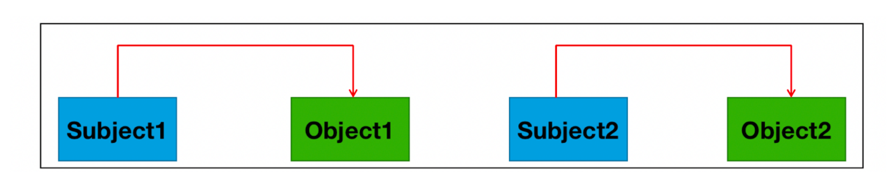
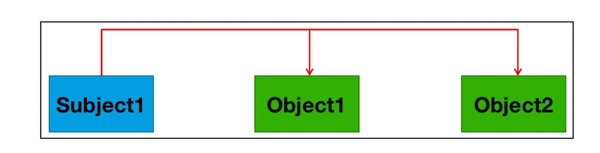
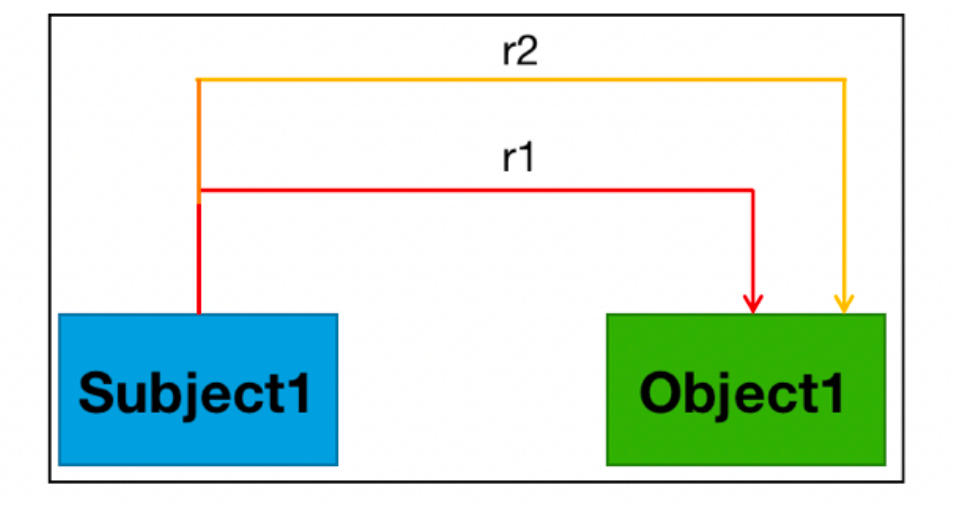
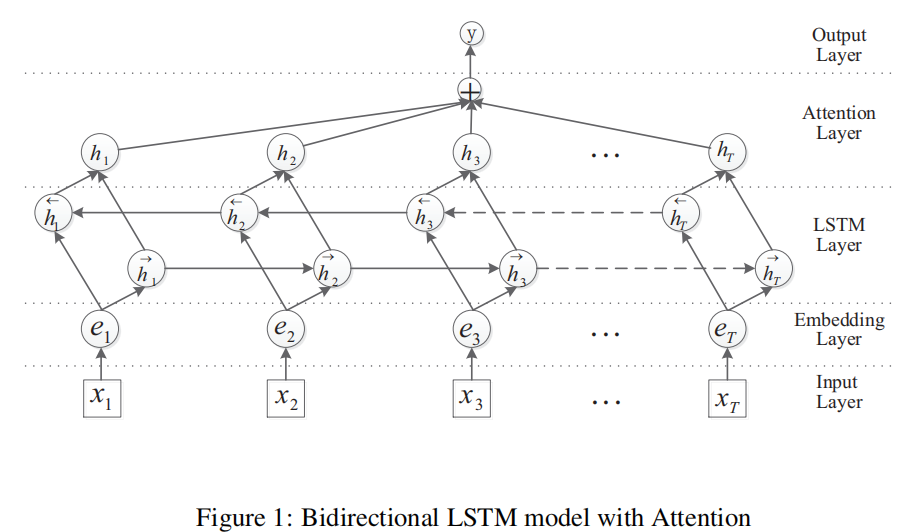
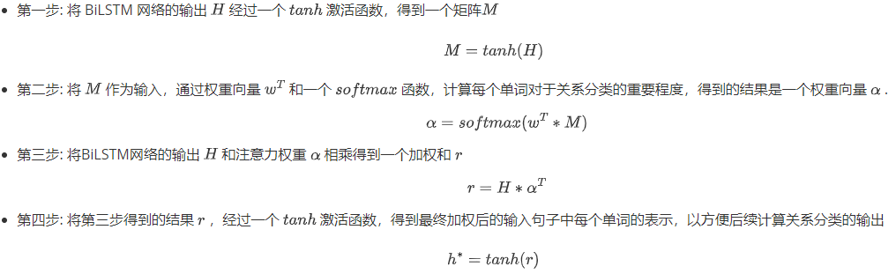

## 1 关系抽取基本知识

### 1.1 什么是关系抽取？

> **定义**：从文本中抽取出 `(主体, 关系, 客体)` 三元组（subject, relation, object）。

- **输入**：句子 S，含实体 A 与 B
- **输出**：预测关系 r ∈ R（预定义关系集合）
- **形式化**：三元组 `<S, P, O>`
  - S：主体实体
  - P：关系谓词
  - O：客体实体


### 1.2 任务特点

| 特点           | 说明                                                         |
| :------------- | :----------------------------------------------------------- |
| **领域多**     | 医学、金融、百科等，各领域 schema 差异大                     |
| **数据来源广** | 结构化（表格）、半结构化（维基百科、百度百科）、无结构（纯文本） |
| **关系复杂**   | 一对实体可能存在多种关系，或一种关系对应多对实体             |


### 1.3 评价指标

| 指标          | 公式                | 含义                         |
| :------------ | :------------------ | :--------------------------- |
| **Precision** | TP / (TP + FP)      | 预测为正的样本中，多少是对的 |
| **Recall**    | TP / (TP + FN)      | 所有正样本中，多少被找回     |
| **F1**        | 2 · P · R / (P + R) | 精准与召回的调和平均         |


### 1.4 主流方法一览

| 方法         | 核心思想         | 优点             | 缺点                     |
| :----------- | :--------------- | :--------------- | :----------------------- |
| **规则**     | 人工写模板/正则  | 快速、可解释     | 泛化差、维护成本高       |
| **Pipeline** | 先NER → 再RC     | 模块化、易调试   | 误差累积、实体缺失影响大 |
| **Joint**    | 一体化输出三元组 | 全局优化、误差小 | 模型复杂、训练难         |

> 后续章节分别展开代码实战。


### 1.5 常见问题类型

- 正常（normal）

```properties
一对实体只有一种关系
eg: “《人间》是王菲演唱歌曲“中存在1种关系:  (王菲-歌手-人间)
```



- 单一实体关系重叠问题（seo）

```properties
一个实体存在多种关系
eg:“叶春叙出生于浙江，毕业于黄埔军校”中存在两种关系:  (叶春叙-毕业院校-黄埔军校) 、 (叶春叙-出生地-浙江)
```



- 实体对重叠问题（epo）

```properties
一对实体存在多种关系
eg: “周星驰导演了《功夫》，并担任男主角”中存在2种关系:  (周星驰-演员-《功夫》) 、 (周星驰-导演-《功夫》) 
```




## 2 规则方法实现关系抽取

### 2.1 什么是规则关系抽取？

> **核心思想**：
> 由领域专家**人工定义关键词/模板/正则**，直接从文本中匹配并生成三元组
> `<实体1, 关系, 实体2>`。

- 看似“低技术”，实则**短平快**，在**垂直小场景**下效果往往优于复杂模型
- 关键在于**规则设计质量**


### 2.2 原理三步骤

| 步骤           | 任务                       | 示例                            |
| :------------- | :------------------------- | :------------------------------ |
| ① 定义关系集合 | 列出目标关系及其触发词     | `夫妻关系 ← {结婚, 婚礼, 领证}` |
| ② 句子清洗     | 只保留**实体**与**触发词** | 去掉时间、介词等无关成分        |
| ③ 三元组组装   | 按顺序匹配实体与关系       | `杨幂 → 夫妻关系 → 刘恺威`      |


### 2.3 代码实战（Python + jieba）

```python
import jieba.posseg as pseg

# 需要进行关系抽取的样本数据
samples = [
    "2014年1月8日，杨幂与刘恺威的婚礼在印度尼西亚巴厘岛举行",
    "周星驰和吴孟达在《逃学威龙》中合作出演",
    '成龙出演了《警察故事》等多部经典电影'
]

# 定义需要抽取的关系集合：key=关系名，value=触发词列表
relations2dict = {
    '夫妻关系': ['结婚', '领证', '婚礼'],
    '合作关系': ['搭档', '合作', '签约'],
    '演员关系': ['出演', '角色', '主演']
}

# 遍历每条样本
for text in samples:
    entities   = []      # 存储抽取到的实体（人名/电影名）
    relations  = []      # 存储抽取到的关系类型
    move_name  = []      # 临时辅助：记录《》位置，用于提取电影名

    # 对当前句子做带词性的分词
    for word, flag in pseg.lcut(text):
        # 1. 人名（nr）直接加入实体列表
        if flag == 'nr':
            entities.append(word)

        # 2. 书名号（x）记录位置，提取《》内电影名
        elif flag == 'x':
            if not move_name:                 # 第一次遇到《
                move_name.append(text.index(word))
            else:                             # 第二次遇到 》
                move_name.append(text.index(word))
                # 把《》之间的文字作为电影名实体
                entities.append(text[move_name[0] + 1: move_name[1]])

        # 3. 普通词：若在任一关系触发词列表中，则记录对应关系
        else:
            for key, value in relations2dict.items():
                if word in value:
                    relations.append(key)

    # 输出结果：至少两个实体 + 至少一个关系
    if len(entities) >= 2 and len(relations) >= 1:
        print("原始文本：", text)
        print('提取结果：', entities[0] + '->' + relations[0] + '->' + entities[1])
    else:
        print("原始文本：", text)
        print('不好意思，暂时没能从文本中提取出关系结果')

    # 分隔线，便于查看
    print('*' * 80)
```


### 2.4 运行结果

```
原始文本： 2014年1月8日，杨幂与刘恺威的婚礼在印度尼西亚巴厘岛举行
提取结果： 杨幂 -> 夫妻关系 -> 刘恺威
********************************************************************************
原始文本： 周星驰和吴孟达在《逃学威龙》中合作出演
提取结果： 周星驰 -> 合作关系 -> 吴孟达
********************************************************************************
原始文本： 成龙出演了《警察故事》等多部经典电影
提取结果： 成龙 -> 演员关系 -> 警察故事
********************************************************************************
```


### 2.5 优缺点速览

| 维度         | 优点                           | 缺点                         |
| :----------- | :----------------------------- | :--------------------------- |
| **实现成本** | 无需标注 & 训练，上手快        | 人工维护规则成本高           |
| **跨领域**   | ——                             | 可移植性差，换领域需重写信元 |
| **召回率**   | 精准高（规则命中即正确）       | 召回低，未覆盖的表述会漏掉   |
| **适用场景** | 小规模、 schema 稳定、术语规范 | 大规模、开放文本表现差       |


## 3 Pipline方法实现关系抽取

### 3.1 Pipeline方法的原理

- Pipeline方法是一种**分阶段处理**的关系抽取策略：

  > **先进行实体识别，再基于识别结果进行关系分类。**

- 早期主要采用：

  - **CNN（卷积神经网络）**：利用多样性卷积核提取局部结构特征。
  - **RNN（循环神经网络）**：捕捉长距离依赖，具备序列建模能力。

- 后续发展出 **LSTM、BiLSTM** 等变体，提升对上下文的理解能力，进一步提升了关系抽取性能。


**方法流程**

1. **实体识别**：从输入句子中抽取实体。
2. **实体组合**：将识别出的实体两两配对。
3. **关系分类**：对每对实体进行关系类型的预测。

> ⚠️ 注意：实体识别与关系分类是两个**独立串联**的过程，**无交互反馈**。
>
> ```properties
> 输入文本 → 实体抽取 → 实体组合 → 关系分类 → 输出关系类型
> ```


### 3.2 BiLSTM + Attention 算法思想

#### **模型提出**

- 由 **Zhou等人（2016）** 提出；
- 论文题目：《Attention-Based Bidirectional Long Short-Term Memory Networks for Relation Classification》


#### **核心思想**

结合 **双向LSTM** 与 **注意力机制**，增强模型对句子中关键信息的捕捉能力，用于关系分类任务。

| 模块          | 功能                                                         |
| :------------ | :----------------------------------------------------------- |
| **BiLSTM**    | 同时捕捉前向与后向上下文信息                                 |
| **Attention** | 为句子中不同词汇分配权重，聚焦于句子中对关系判断更重要的词汇 |
| **输出层**    | 实现最终的关系类别预测                                       |


### 3.3 BiLSTM + Attention 模型结构



模型共分五层，结构如下：

```
Input Layer → Embedding Layer → BiLSTM Layer → Attention Layer → Output Layer
```


#### 输入层（Input Layer）

- 输入：句子（字符或单词序列）。

- 附加信息：每个词相对于两个实体的**相对位置编码**。

  - 示例句子：

    ```
    “在《逃学威龙》这部电影中周星驰和吴孟达联合出演”
    ```

  - 实体1：周星驰，实体2：吴孟达

  - 每个词计算其到两个实体的相对位置。


#### 嵌入层（Embedding Layer）

- 将词语映射为**高维向量**。
- 包含：
  - 词向量（可预训练或随机初始化）
  - 位置向量（相对实体位置的编码）


#### 双向 LSTM 层（BiLSTM Layer）

- 同时建模**前向与后向**上下文信息。
- 输出：每个词的隐藏状态表示（矩阵 H）


#### 注意力机制层（Attention Layer）

> 注意力机制能够使模型聚焦于句子中的关键信息，从而提升关系分类的性能。在本模型中，注意力机制用于**评估句子中每个单词对于关系分类的重要性**。具体而言，对于输入句子中的每个单词，注意力机制会为其分配一个权重，表示该单词在当前关系分类任务中的关键程度。这些权重随后被用于对句子中各单词的表示进行加权平均，从而生成用于关系分类的句子级表示。

本次实现中，采用了**基于注意力权重的加权平均池化**方式来聚合句子信息：

- 第一步: 将 BiLSTM 网络的输出 $H$ 经过一个 $tanh$ 激活函数，得到一个矩阵$M$

$$
M = tanh(H)
$$

- 第二步: 将 $M$ 作为输入，通过权重向量 $w^T$ 和一个 $softmax$ 函数，计算每个单词对于关系分类的重要程度，得到的结果是一个权重向量 $α$ .
  $$
  α = softmax(w^T*M)
  $$

- 第三步: 将BiLSTM网络的输出 $H$ 和注意力权重 $α$ 相乘得到一个加权和 $r$
  $$
  r = H * α^T
  $$

- 第四步: 将第三步得到的结果 $r$ ，经过一个 $tanh$ 激活函数，得到最终加权后的输入句子中每个单词的表示，以方便后续计算关系分类的输出

$$
h^* = tanh(r)
$$

> ✅ 目的：突出关键词语对关系分类的贡献。


#### 输出层（Output Layer）

- 根据任务的不同，输出层可以是分类层或回归层。在关系抽取任务中，输出层通常是一个分类层，通常为**全连接层 + Softmax**，用于预测实体间的关系类别。


### 3.4 整体代码架构图

```
Bilstm_Attention_RE/
│
├── 📂 data/                          # 数据集目录
│   ├── data_analysis.py              # 数据分析脚本
│   ├── train.txt                     # 训练集
│   ├── test.txt                      # 测试集
│   ├── relation2id.txt               # 关系映射文件
│   └── vec.txt                       # 预训练词向量
│
├── 📂 model/                         # 模型构建目录
│   └── bilstm_atten.py               # BiLSTM 模型结构定义                  
│
│── 📂 save_model/										# 模型保存路径  
│
├── 📂 utils/                         # 工具函数目录
│   ├── data_loader.py                # 数据加载器
│   └── pre_process.py                # 数据预处理
│
├── 📄 train.py                       # 模型训练入口
├── 📄 predict.py                     # 模型预测入口
└── 📄 config.py                      # 项目配置文件
```


### 3.5 数据预处理

#### 1. 查看项目数据集

- **数据来源**：
  本项目使用的是公开的 [千言数据集](https://www.luge.ai/#/)，该数据集为开源数据，可直接使用，无需额外标注。项目重点在于掌握**关系抽取**的核心思想。
- **数据路径**：
  `/home/ec2-user/Bilstm_Attention_RE/data`
- **数据集文件说明**：


**📄 relation2id.txt（关系类型文件）**

- **路径**：`/home/ec2-user/Bilstm_Attention_RE/data/relation2id.txt`

- **内容示例**：

  ```
  导演 0
  歌手 1
  作曲 2
  作词 3
  主演 4
  ```

- **说明**：共包含 5 类关系，每行两列，分别为关系名称与对应 ID，空格分隔。


**📄 train.txt（训练数据集）**

- **路径**：`/home/ec2-user/Bilstm_Attention_RE/data/train.txt`

- **样本数量**：18,267 行

- **每行格式**（4 列，空格分隔）：

  - 实体 1
  - 实体 2
  - 关系类型
  - 原始文本

- **示例**：

  ```
  今晚会在哪里醒来 黄家强 歌手 《今晚会在哪里醒来》是黄家强的一首粤语歌曲，何启弘作词，黄家强作曲编曲并演唱，收录于2007年08月01日发行的专辑《她他》中
  
  似水流年 许晓杰 作曲 似水流年，由著名作词家闫肃作词，著名音乐人许晓杰作曲，张烨演唱
  ```

  

**📄 test.txt（测试数据集）**

- **路径**：`/home/ec2-user/Bilstm_Attention_RE/data/test.txt`

- **样本数量**：5,873 行

- **格式同 train.txt**

- **示例**：

  ```
  三生三世十里桃花 安悦溪 主演 当《三生三世》4位女星换上现代装：第四，安悦溪在《三生三世十里桃花》中...
  失恋33天 白百何 主演 2011年，担任爱情片《失恋33天》的编剧，该片改编自鲍鲸鲸的同名小说...
  ```

  

#### 2. 编写 Config 类项目配置文件

- **文件路径**：`/home/ec2-user/Bilstm_Attention_RE/config.py`

- **功能说明**：
  用于配置项目中不常变动的参数，如数据路径、模型超参数、训练配置等。

- **代码示例**：

  ```python
  # coding:utf-8
  import torch
  
  class Config(object):
      def __init__(self):
          self.device = torch.device('cuda' if torch.cuda.is_available() else 'cpu')
          self.train_data_path = "/home/ec2-user/Bilstm_Attention_RE/data/train.txt"
          self.test_data_path = "/home/ec2-user/Bilstm_Attention_RE/data/test.txt"
          self.rel_data_path = "/home/ec2-user/Bilstm_Attention_RE/data/relation2id.txt"
          
          self.embedding_dim = 128  # 词向量维度
          self.pos_dim       = 32   # 位置向量维度（实体相对距离）
          self.hidden_dim = 200     # BiLSTM 隐层维度
          self.epochs        = 50   # 训练轮次
          self.batch_size    = 32   # 每批样本数
          self.max_len       = 70   # 单句最大长度（含填充）
          self.learning_rate = 1e-3 # Adam 初始学习率
  ```

  

#### 3. 编写数据处理相关函数

- **文件路径**：`/home/ec2-user/Bilstm_Attention_RE/utils/process.py`

```python
"""
关系抽取-数据预处理工具包
包含：
1. 句子→ID 序列化（填充）
2. 实体相对位置→ID 序列化（填充）
3. 读取 train / test 文件
4. 构建词表
"""
from config import Config
from itertools import chain
from collections import Counter

conf = Config()

# ------------------------------------------------------------------
# 1. 读取关系类型文件，构建 word→id 字典
# ------------------------------------------------------------------
relation2id = {}
with open(conf.rel_data_path, 'r', encoding='utf-8') as fr:
    for line in fr.readlines():
        word, id = line.rstrip().split(' ')
        if word not in relation2id:
            relation2id[word] = int(idx)  # 注意转成 int

# ------------------------------------------------------------------
# 2. 句子序列化 + 填充
# ------------------------------------------------------------------
def sent_padding(words, word2id):
    """
    将单词列表 words 转为 id 列表，并填充/截断到 max_len。
    未登录词用 'UNKNOW' 表示，填充用 'BLANK'。
    """
    ids = [word2id.get(w, word2id['UNKNOW']) for w in words]
    if len(ids) >= conf.max_len:
        return ids[:conf.max_len]
    ids.extend([word2id['BLANK']] * (conf.max_len - len(ids)))
    return ids

# ------------------------------------------------------------------
# 3. 实体相对位置→非负 ID
# ------------------------------------------------------------------
def pos(num):
    """
    把实体相对位置转成非负整数，供 pos_embedding 使用。
    范围 [-70, 70] 映射到 [0, 142]，超出部分截断。
    """
    if num < -70:
        return 0
    if -70 <= num <= 70:
        return num + 70
    return 142          # >70

# ------------------------------------------------------------------
# 4. 位置序列化 + 填充
# ------------------------------------------------------------------
def position_padding(pos_ids):
    """
    将实体相对位置列表 pos_ids 映射为非负 ID 并填充/截断到 max_len。
    """
    pos_ids = [pos(i) for i in pos_ids]
    if len(pos_ids) >= conf.max_len:
        return pos_ids[:conf.max_len]
    pos_ids.extend([142] * (conf.max_len - len(pos_ids)))
    return pos_ids

# ------------------------------------------------------------------
# 5. 读取 train / test 文件，返回所需 5 元组
# ------------------------------------------------------------------
def get_txt_data(data_path):
    """
    读取原始数据文件，返回：
    datas     : list[list[str]]   分词后句子
    labels    : list[int]         关系 id
    positionE1: list[list[int]]   相对实体 1 的位置序列
    positionE2: list[list[int]]   相对实体 2 的位置序列
    entities  : list[list[str]]   [实体1, 实体2]
    同时做简单均衡：每类关系最多保留 2000 条。
    """
    datas, labels, positionE1, positionE2, entities = [], [], [], [], []

    # 统计每类已读数量
    count_dict = {k: 0 for k in relation2id.keys()}

    with open(data_path, 'r', encoding='utf-8') as tfr:
        for line in tfr.readlines():
            line = line.strip()
            if not line:
                continue
            # 最多切 4 段，防止文本里有多余空格
            ent1, ent2, rel, text = line.split(' ', maxsplit=3)

            # 跳过不在关系集或已够 2000 的样本
            if rel not in relation2id or count_dict[rel] >= 2000:
                continue

            # 找实体位置
            try:
                idx1 = text.index(ent1)
                idx2 = text.index(ent2)
            except ValueError:
                # 实体未出现则丢弃
                continue

            sentence = list(text)
            pos1 = [i - idx1 for i in range(len(sentence))]
            pos2 = [i - idx2 for i in range(len(sentence))]

            datas.append(sentence)
            labels.append(relation2id[rel])
            positionE1.append(pos1)
            positionE2.append(pos2)
            entities.append([ent1, ent2])
            count_dict[rel] += 1

    return datas, labels, positionE1, positionE2, entities
  
# ------------------------------------------------------------------
# 6. 根据数据构建词表
# ------------------------------------------------------------------
def get_word_id(data_path):
    """
    利用 get_txt_data 读取数据，构建：
    word2id : dict[str, int]
    id2word : dict[int, str]
    并额外加入 'BLANK' 和 'UNKNOW' 两个特殊符号。
    """
    datas, *_ = get_txt_data(data_path)

    # 扁平化所有句子并去重
    vocab = list(set(chain(*datas)))
    vocab.sort()  # set是无序的，为保持结果一致，所以排序
    
    word2id = {w: i for i, w in enumerate(vocab)}
    id2word = {i: w for i, w in enumerate(vocab)}

    # 加入特殊符号
    word2id['BLANK'] = len(word2id)
    word2id['UNKNOW'] = len(word2id)
    id2word[len(id2word)] = 'BLANK'
    id2word[len(id2word)] = 'UNKNOW'

    return word2id, id2word
```


#### 4. 构建DataSet类以及Dataloader函数

- **文件路径**：`/home/ec2-user/Bilstm_Attention_RE/utils/data_loader.py`

```python
"""
数据加载模块
包含：
  1. MyDataset   – 继承自 torch.utils.data.Dataset，负责单条样本的读取
  2. collate_fn  – DataLoader 的批处理函数，完成 padding + Tensor 化
  3. get_loader_data – 对外接口，返回训练 / 测试 DataLoader
"""

import os
import torch
from torch.utils.data import DataLoader, Dataset

# 项目内部工具函数
from utils.process import get_txt_data, get_word_id, sent_padding, position_padding


# ------------------------------------------------------------------
# 1. 自定义数据集
# ------------------------------------------------------------------
class MyDataset(Dataset):
    """
    读取已预处理好的文本文件，逐条返回
    样本格式：[sequence, label, positionE1, positionE2, entities]
    """

    def __init__(self, data_path: str):
        """
        Args:
            data_path: 预处理后的 *.txt 文件路径
        """
        # get_txt_data 返回一个元组 ，其中
        # data[0] -> list of sequences
        # data[1] -> list of labels
        # data[2] -> list of positionE1
        # data[3] -> list of positionE2
        # data[4] -> list of entities
        self.data = get_txt_data(data_path)

    def __len__(self):
        return len(self.data[0])

    def __getitem__(self, index: int):
        sequence   = self.data[0][index]   # 已分词的字/词列表
        label      = int(self.data[1][index])
        position_e1 = self.data[2][index]  # 相对 e1 的位置序列
        position_e2 = self.data[3][index]  # 相对 e2 的位置序列
        entities   = self.data[4][index]   # 实体信息（可选，下游暂未用到）
        return sequence, label, position_e1, position_e2, entities


# ------------------------------------------------------------------
# 2. 批处理函数：完成 padding 并转成 Tensor
# ------------------------------------------------------------------
def collate_fn(batch):
    """
    Args:
        batch: List[Tuple]，每个 tuple 为 __getitem__ 的返回值
    Returns:
        (
            sequences_tensor,   # [batch, max_len]
            position_e1_tensor, # [batch, max_len]
            position_e2_tensor, # [batch, max_len]
            labels_tensor,      # [batch]
            max_len             # 实际最大长度，方便模型侧使用
        )
    """
    # 1. 解压 batch
    sequences = [data[0] for data in batch]
    labels = [data[1] for data in batch]
    positionE1 = [data[2] for data in batch]
    positionE2 = [data[3] for data in batch]
    entities = [data[4] for data in batch]

    # 2. 词 -> id 并 padding
    word2id, _ = get_word_id(conf.train_data_path)
    sequences_ids = [sent_padding(seq, word2id) for seq in sequences]

    # 3. 位置序列 padding
    position_e1_ids = [position_padding(pos) for pos in position_e1]
    position_e2_ids = [position_padding(pos) for pos in position_e2]

    # 4. 转 Tensor 并指定设备
    sequences_tensor = torch.tensor(sequences_ids, dtype=torch.long, device=conf.device)
    position_e1_tensor = torch.tensor(position_e1_ids, dtype=torch.long, device=conf.device)
    position_e2_tensor = torch.tensor(position_e2_ids, dtype=torch.long, device=conf.device)
    labels_tensor = torch.tensor(labels, dtype=torch.long, device=conf.device)

    return sequences_tensor, position_e1_tensor, position_e2_tensor, labels_tensor, sequences, labels, entities


# ------------------------------------------------------------------
# 3. 对外接口：返回训练集 / 测试集 DataLoader
# ------------------------------------------------------------------
def get_loader_data():
    """
    Returns:
        train_loader, test_loader
    """
    # 训练集
    train_dataset = MyDataset(conf.train_data_path)
    train_loader = DataLoader(
        dataset=train_dataset,
        batch_size=conf.batch_size,
        shuffle=True,          # 训练集建议打乱
        collate_fn=collate_fn,
        drop_last=True         # 不足一个 batch 丢弃，保证批尺寸一致
    )

    # 测试集
    test_dataset = MyDataset(conf.test_data_path)
    test_loader = DataLoader(
        dataset=test_dataset,
        batch_size=conf.batch_size,
        shuffle=False,         # 测试集无需打乱
        collate_fn=collate_fn,
        drop_last=True
    )

    return train_loader, test_loader
```


### 3.6 基于BiLSTM+Attention模型实现训练

本项目中BiLSTN+Attention模型搭建的步骤如下:
- 第一步: 编写模型类的代码
- 第二步: 编写训练函数
- 第三步: 编写使用模型预测代码的实现.


#### 1. 模型类（`bilstm_atten.py`）

- **文件路径**：`/home/ec2-user/Bilstm_Attention_RE/model/bilstm_atten.py`

```python
import torch
import torch.nn as nn
import torch.nn.functional as F
from config import Config


class BiLSTM_ATT(nn.Module):
    """
    BiLSTM + Attention 用于关系分类
    输入：句子词 id 序列 + 实体1相对位置序列 + 实体2相对位置序列
    输出：关系类别 logits
    """

    def __init__(self, conf: Config, vocab_size: int, pos_size: int, tag_size: int):
        super().__init__()
        self.conf      = conf
        self.device    = conf.device
        self.batch     = conf.batch_size
        self.hidden_dim = conf.hidden_dim

        # ---------- 嵌入层 ----------
        self.word_embed = nn.Embedding(vocab_size, conf.embedding_dim)
        self.pos1_embed = nn.Embedding(pos_size, conf.pos_dim)   # 相对实体1位置
        self.pos2_embed = nn.Embedding(pos_size, conf.pos_dim)   # 相对实体2位置

        # ---------- BiLSTM ----------
        lstm_input_size = conf.embedding_dim + conf.pos_dim * 2
        self.lstm = nn.LSTM(lstm_input_size,
                            conf.hidden_dim // 2,
                            num_layers=1,
                            batch_first=True,
                            bidirectional=True)

        # ---------- Attention ----------
        # 可训练上下文向量 w，尺寸 [batch_size, 1, hidden_dim]
        self.att_w = nn.Parameter(torch.randn(self.batch, self.hidden_dim, 1, device=self.device))

        # ---------- 输出层 ----------
        self.dropout_emb = nn.Dropout(p=0.2)
        self.dropout_lstm = nn.Dropout(p=0.2)
        self.dropout_att = nn.Dropout(p=0.2)
        
        self.fc      = nn.Linear(self.hidden_dim, tag_size)

    # ----------------------------------------------------------
    # 工具函数：生成 LSTM 初始 hidden/cell
    # ----------------------------------------------------------
    def init_hidden(self):
        h0 = torch.randn(2, self.batch, self.hidden_dim // 2, device=self.device)
        c0 = torch.randn(2, self.batch, self.hidden_dim // 2, device=self.device)
        return h0, c0

    # ----------------------------------------------------------
    # Attention 计算：返回加权句向量 [batch, hidden_dim]
    # ----------------------------------------------------------
    def attention(self, lstm_out: torch.Tensor):
        """
    	注意力池化：把 [B, L, H] 加权压缩成 [B, H]
    	本次确定维度：
        lstm_out : [4, 70, 200]
        att_w    : [4, 1, 200]
    	"""
        # 1. 非线性变换 [4, 70, 200]
        score = F.tanh(lstm_out)
		
        # 2. 计算注意力得分 [4, 70, 200] @ [4, 200, 1] → [4, 70, 1]
        score = torch.bmm(score, self.att_w)

        # 3. 归一化权重 [4, 70, 1]
        alpha = F.softmax(score, dim=1)
		
        # 4. lstm_out: [4, 70, 200]-->[4, 200, 70]
        lstm_out = torch.transpose(self.lstm_out, 1, 2)
        
        
        # 5. 计算注意力结果 [4, 200, 70] @ [4, 70, 1] → [4, 200, 1]
        att_out = torch.bmm(lstm_out , alpha)

        return att_out

    # ----------------------------------------------------------
    # 前向
    # ----------------------------------------------------------
    def forward(self, sentence, pos1, pos2):
        """
        sentence: [batch, max_len] = [4, 70]        词 id
        pos1/2  : [4, 70]                           相对位置 id
        return  : [4, tag_size]                     未归一化 logits
        """
        # 1. 嵌入并拼接
        word_emb = self.word_embed(sentence)  # [4, 70, 128]
        p1_emb   = self.pos1_embed(pos1)      # [4, 70, 32]
        p2_emb   = self.pos2_embed(pos2)      # [4, 70, 32]
        x = torch.cat([word_emb, p1_emb, p2_emb], dim=-1)  # [4, 70, 192]
        x = self.dropout_emb(x)

        # 2. BiLSTM
        hidden0 = self.init_hidden()                       # h0/c0: [2, 4, 100]
        lstm_out, _ = self.lstm(x, hidden0)                # [4, 70, 200]
		lstm_out = self.dropout_lstm(lstm_out)
        
        # 3. Attention
        att_out = F.tanh(self.attention(lstm_out))         # [4, 200, 1]
        att_out = self.dropout_att(att_out).squeeze()      # [4, 200]
        
        # 4. 输出
        logits  = self.fc(att_out)                         # [4, tag_size]
        return logits
```

> 


#### 2. 训练函数（`train.py`）

- **文件路径**：`/home/ec2-user/Bilstm_Attention_RE/train.py`

```python
"""
Pipeline 关系抽取 – 训练脚本
基于 BiLSTM+Attention 模型
"""

import os
import time
import torch
import torch.nn as nn
import torch.optim as optim
from tqdm import tqdm

from config import Config
from model.bilstm_atten import BiLSTM_ATT
from utils.data_loader import get_loader_data
from utils.process import get_word_id, relation2id


def train(conf: Config, vocab_size: int, pos_size: int, tag_size: int):
    """
    训练入口函数
    :param conf:      全局配置对象
    :param vocab_size: 词表大小
    :param pos_size:   位置编码大小（默认 143）
    :param tag_size:   关系类别数
    """
    # ---------------- 1. 数据 ----------------
    train_iter, test_iter = get_loader_data()
    print(f'[Data] 训练集 batch 数: {len(train_iter)}')

    # ---------------- 2. 模型 & 优化器 ----------------
    model = BiLSTM_ATT(conf, vocab_size, pos_size, tag_size).to(conf.device)
    optimizer = optim.Adam(model.parameters(), lr=conf.learning_rate)
    criterion = nn.CrossEntropyLoss()

    # ---------------- 3. 训练日志变量 ----------------
    start_time = time.time()
    total_loss   = 0.0   # 累计 loss
    total_correct = 0     # 累计正确样本数
    total_sample  = 0     # 累计已训样本数
    total_iter_num = 0     # 训练迭代次数

    # ---------------- 4. 训练循环 ----------------
    model.train()
    for epoch in range(conf.epochs):
        # 进度条：每个 epoch 重新初始化
        pbar = tqdm(train_iter, desc=f'Epoch {epoch}/{conf.epochs}')
        for sentences, pos1, pos2, labels, *_ in pbar:
            total_iter_num += 1

            # 4.1 前向
            logits = model(sentences, pos1, pos2)   # [batch, tag_size]
            loss   = criterion(logits, labels)      # 交叉熵

            # 4.2 反向
            optimizer.zero_grad()
            loss.backward()
            optimizer.step()

            # 4.3 统计
            total_loss   += loss.item()
            preds         = torch.argmax(logits, dim=1)
            total_correct += (preds == labels).sum().item()
            total_sample  += labels.size(0)

            # 4.4 实时显示，每25次训练，打印日志
            if total_iter_num % 25 == 0:
                tmploss = total_loss / total_iter_num
                tmpacc = total_correct / total_sample
                end_time = time.time()
                print('轮次: %d, 损失:%.6f, 时间:%d, 准确率:%.3f' % (epoch+1, tmploss, end_time-start_time, tmpacc))

        # ---------------- 5. 按 epoch 保存 ----------------
        if epoch % 10 == 0:
            torch.save(ba_model.state_dict(), './save_model/new_model_%d.bin' % epoch)

    print('[Train] 训练完成！')


if __name__ == '__main__':
    conf = Config()
    word2id, _ = get_word_id(conf.train_data_path)
    train(conf,
          vocab_size=len(word2id),
          pos_size=143,
          tag_size=len(relation2id))
```

> 结论: BiLSTM+Attention模型在训练集上的最终表现是ACC:80%
