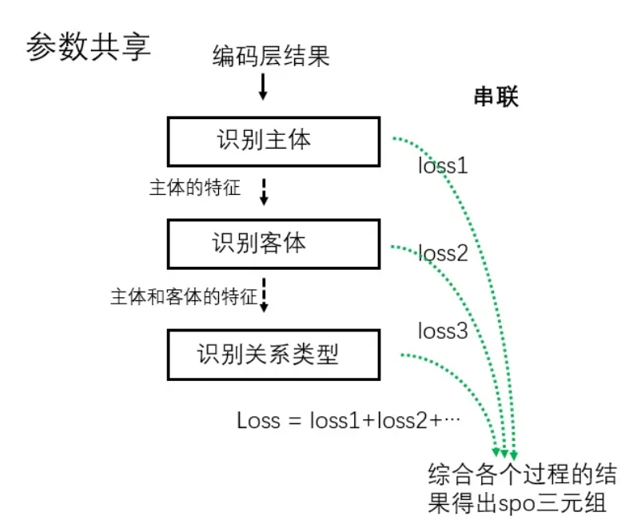
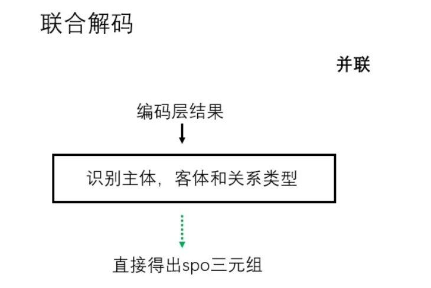
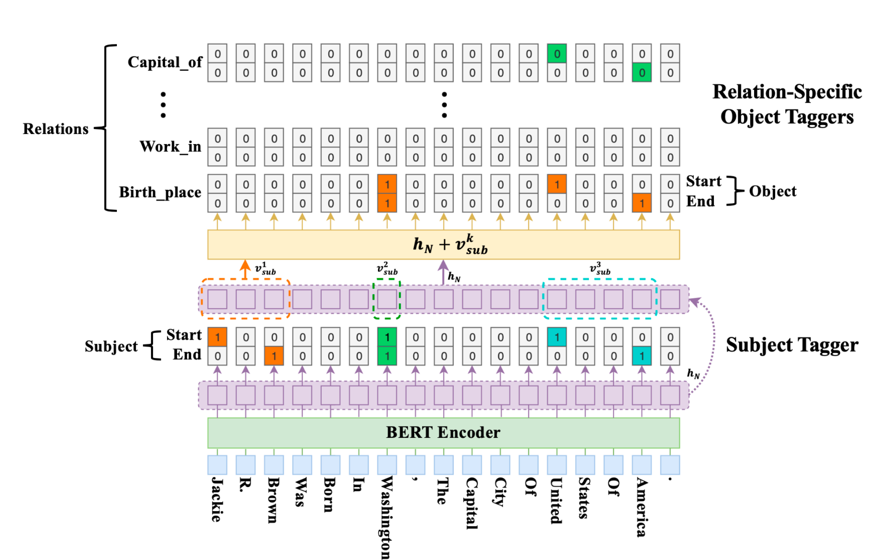
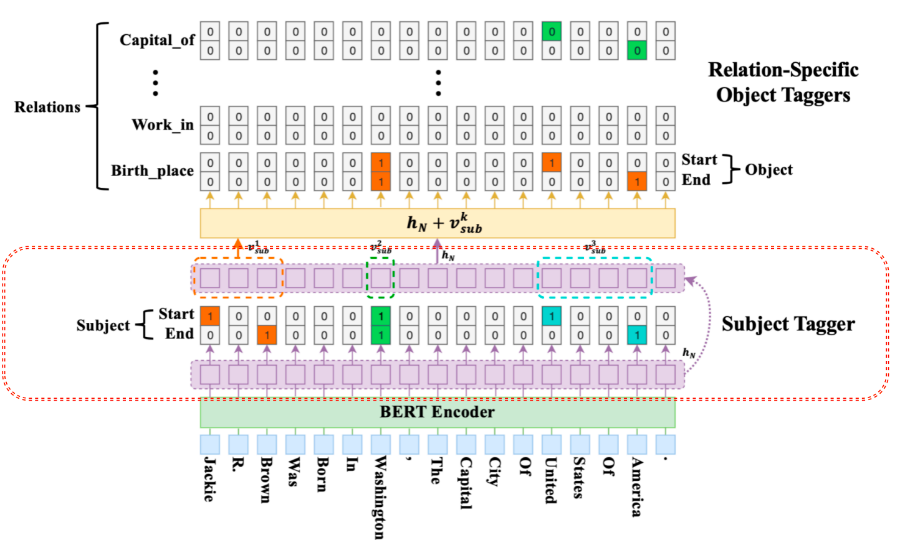
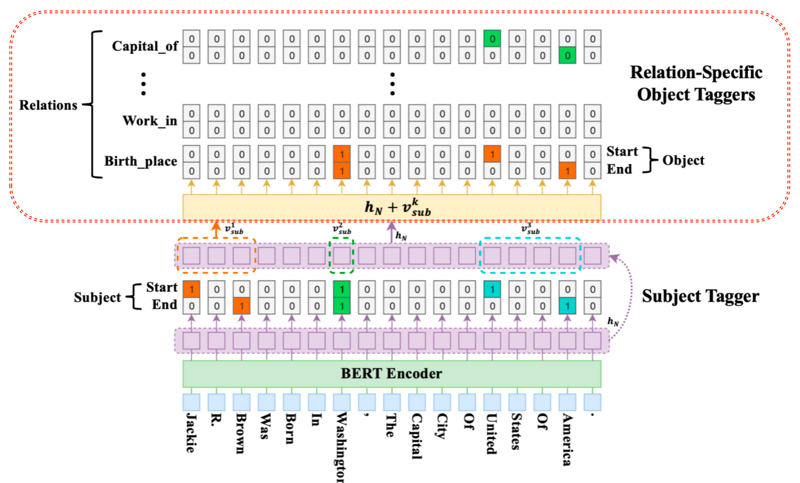

## 1. Joint方法原理

Joint联合抽取方法通过修改标注方式和模型结构，直接输出文本中包含的 (subject, relation, object) 三元组。根据解码方式不同，主要分为以下两类：

### 1.1 参数共享的联合模型

**特点**：实体抽取和关系抽取任务共享编码层参数，但解码过程异步进行，各任务独立计算损失，最终损失为各任务损失之和。

**模型结构图示**：




### 1.2 联合解码的联合模型

**特点**：头实体、关系和尾实体的抽取过程完全同步，通过统一标注体系直接生成SPO三元组。

**模型结构图示**：



**标注方式示例**：

- 假设有N种关系类型
- 采用BIOS标注法结合实体序号（1,2）
- 总标签数：`2 × 3 × N + 1`（其中1表示不属于任何关系）


**对比表格**：

| 特性           | 参数共享模型         | 联合解码模型         |
| :------------- | :------------------- | :------------------- |
| **解码方式**   | 异步解码，各任务独立 | 同步解码，统一输出   |
| **损失函数**   | 各任务损失之和       | 单一联合损失         |
| **模型复杂度** | 中等，结构清晰       | 较高，标注复杂       |
| **优势**       | 训练灵活，易调试     | 全局优化，误差传递小 |


## 2. Casrel算法思想

### 2.1 核心创新

Casrel（Cascade Relational Learning）是2020年ACL会议上提出的一种基于**参数共享**的联合抽取模型，主要解决**关系三元组重叠问题**：

- **SEO（Single Entity Overlap）**：单个实体参与多个三元组
- **EPO（Entity Pair Overlap）**：同一实体对具有多种关系

### 2.2 方法本质

Casrel属于**参数共享的联合抽取方法**，通过级联解码器分步提取三元组，有效处理实体重叠场景。


## 3. Casrel模型架构

### 3.1 整体框架

**处理流程**：编码（`bert`编码） → 头实体识别 → 关系-尾实体联合识别

**模型结构**：



### 3.2 模型细节

#### 3.2.1 头实体识别部分

**实现方式**：采用**二分类**策略，识别头实体的起始和结束位置。



**数学表达**：
$$
p_i^{start\_s} = \sigma (\mathbf{W}_{start}\mathbf{x}_i + \mathbf{b}_{start})\\p_i^{end\_s} = \sigma (\mathbf{W}_{end}\mathbf{x}_i + \mathbf{b}_{end})
$$
**处理流程**：

1. 利用一个线性层 + 一个`sigmoid`激活函数对编码后每个token进行二分类判断
2. 识别所有可能的start和end位置
3. 采用**最近匹配原则**配对生成候选头实体集合


#### 3.2.2 关系与尾实体联合识别



**特征融合机制**：

- 输入：编码向量 + 头实体特征向量
- 头实体特征：若实体含多个词，则取平均向量

**融合公式**：
$$
h'_i = h_i + (1/k) Σ_{j=start}^{end} h_j
$$

> 其中$k$为头实体长度，$h_i$为第$i$个token的编码向量。


**解码过程**：

对于识别出来的每一个subject, 对应的每一种关系会解码出其 object 的 start 和 end 索引位置，与 Subject 类似，公式如下：
$$
p_{i}^{start\_o} = \sigma(\mathbf{W}_{start}^r(\mathbf{x}_i + \mathbf{v}_{sub}^k) + \mathbf{b}_{start}^r)\\
p_{i}^{end\_o} = \sigma(\mathbf{W}_{end}^r(\mathbf{x}_i + \mathbf{v}_{sub}^k) + \mathbf{b}_{end}^r))
$$


#### 3.2.3 模型结果示例

以句子"**Jackie R. Brown was born in Washington, United States Of America**"为例：

- **头实体**：Jackie R. Brown → 识别出两个尾实体
  - 关系：`Birth_place` → 尾实体：Washington
  - 关系：`Birth_place` → 尾实体：United States Of America
- **头实体**：Washington → 识别出：
  - 关系：`Capital_of` → 尾实体：United States Of America


### 3.3 Casrel解决的问题

✅ **成功处理SEO和EPO重叠问题**，显著提升复杂文本场景下的关系抽取准确率。


## 4. 项目代码架构

**代码组织结构**：

```
relationship_extract/
├── bert-base-chinese/
├── data/                      # 数据集目录
│   ├── train.json            # 训练数据（55,433条）
│   ├── dev.json              # 验证数据（11,191条）
│   ├── test.json             # 测试数据（13,417条）
│   └── relation.json         # 关系类型定义（18类）
├── codes/
│   ├── config.py             # 配置文件
│   ├── train.py              # 训练脚本
│   ├── test.py               # 测试脚本
│   ├── predict.py            # 预测脚本
│   ├── model/
│   │   └── CasrelModel.py    # 模型定义
│   └── utils/
│       ├── process.py        # 数据处理函数
│       └── data_loader.py    # DataLoader封装
└── save_model/               # 模型保存目录
```


## 5. 数据预处理

### 5.1 数据集概览

⚠️ **数据来源**：千言数据集（http://www.luge.ai/#/），开源数据集可直接使用。实际工作中需自行标注。


**数据集统计表**：

| 数据集            | 样本数量 | 用途     | 关键字段       |
| :---------------- | :------- | :------- | :------------- |
| **train.json**    | 55,433   | 模型训练 | text, spo_list |
| **dev.json**      | 11,191   | 验证调参 | text, spo_list |
| **test.json**     | 13,417   | 效果测试 | text, spo_list |
| **relation.json** | 18       | 关系定义 | id → relation  |


**关系类型示例**（共18类）：

```json
{
  "0": "出品公司",
  "1": "国籍",
  "2": "出生地",
  "3": "民族",
  "4": "出生日期",
  "5": "毕业院校",
  "6": "歌手",
  "7": "所属专辑",
  "8": "作词",
  "9": "作曲",
  "10": "连载网站",
  "11": "作者",
  "12": "出版社",
  "13": "主演",
  "14": "导演",
  "15": "编剧",
  "16": "上映时间",
  "17": "成立日期"
}
```


**数据样例结构**：

```python
{
  "text": "《今晚会在哪里醒来》是黄家强的一首粤语歌曲...",
  "spo_list": [
    {
      "predicate": "作曲",      # 关系类型
      "object_type": "人物",    # 尾实体类型
      "subject_type": "歌曲",   # 头实体类型
      "object": "黄家强",       # 尾实体
      "subject": "今晚会在哪里醒来"  # 头实体
    }
  ]
}
```


### 5.2 配置类实现

- 文件路径: `/home/ec2-user/Casrel_RE/relationship_extract/codes/config.py`

```python
# coding:utf-8
import torch
from fastNLP import Vocabulary  # 用于构建str到int的映射
from transformers import BertTokenizer, AdamW
import json

class Config(object):
    """模型配置类：集中管理所有超参数和路径配置"""
    def __init__(self):
        # 设备配置：自动检测GPU，否则使用CPU
        self.device = torch.device('cuda' if torch.cuda.is_available() else 'cpu')
        
        # 预训练模型路径（需替换为实际路径）
        self.bert_path = "预训练模型的绝对路径"
        
        # 模型超参数
        self.num_rel = 18          # 关系类别数
        self.batch_size = 8        # 批次大小
        self.learning_rate = 1e-5  # 学习率
        self.bert_dim = 768        # BERT隐藏层维度
        self.epochs = 10           # 训练轮数
        
        # 数据路径配置（需替换为实际路径）
        self.train_data_path = "训练数据集的绝对路径"
        self.dev_data_path = "验证数据集的绝对路径"
        self.test_data_path = "测试数据集的绝对路径"
        self.rel_dict_path = "关系数据文件的绝对路径"
        
        # 加载关系词典并构建Vocabulary
        id2rel = json.load(open(self.rel_dict_path, encoding='utf8'))
        self.rel_vocab = Vocabulary(padding=None, unknown=None)
        self.rel_vocab.add_word_lst(list(id2rel.values()))  # 添加关系词表
        
        # 初始化BERT分词器
        self.tokenizer = BertTokenizer.from_pretrained(self.bert_path)
```


### 5.3 数据处理函数

- 文件路径: `/home/ec2-user/Casrel_RE/relationship_extract/codes/utils/process.py`

```python
# coding:utf-8
from codes.config import Config
import torch
from random import choice
from collections import defaultdict

conf = Config()

def find_head_idx(source, target):
    """
    在source序列中查找target子序列的起始索引位置
    :param source: 原始token id列表
    :param target: 目标实体token id列表
    :return: 起始索引，未找到返回-1
    """
    target_len = len(target)
    # 滑动窗口匹配
    for i in range(len(source)):
        if source[i: i + target_len] == target:
            return i
    return -1

def create_label(inner_triples, inner_input_ids, seq_len):
    """
    为单个样本生成训练标签张量
    :param inner_triples: spo三元组列表
    :param inner_input_ids: 输入文本的token id序列
    :param seq_len: 序列长度
    :return: 包含sub_len, sub_head2tail, sub_heads, sub_tails, obj_heads, obj_tails的张量
    """
    # 初始化标签张量（全0）
    inner_sub_heads = torch.zeros(seq_len)    # 头实体起始位置标签
    inner_sub_tails = torch.zeros(seq_len)    # 头实体结束位置标签
    inner_obj_heads = torch.zeros((seq_len, conf.num_rel))  # 尾实体起始位置+关系类型
    inner_obj_tails = torch.zeros((seq_len, conf.num_rel))  # 尾实体结束位置+关系类型
    inner_sub_head2tail = torch.zeros(seq_len)  # 头实体span掩码
    inner_sub_len = torch.tensor([1], dtype=torch.float)  # 默认头实体长度（防除0）
    
    # 构建头实体到关系-尾实体的映射字典
    s2ro_map = defaultdict(list)
    
    for inner_triple in inner_triples:
        # 将文本转换为token id
        triple = (
            conf.tokenizer(inner_triple['subject'], add_special_tokens=False)['input_ids'],
            conf.rel_vocab.to_index(inner_triple['predicate']),  # 关系转索引
            conf.tokenizer(inner_triple['object'], add_special_tokens=False)['input_ids']
        )
        
        # 查找实体在序列中的位置
        sub_head_idx = find_head_idx(inner_input_ids, triple[0])
        obj_head_idx = find_head_idx(inner_input_ids, triple[2])
        
        if sub_head_idx != -1 and obj_head_idx != -1:
            sub = (sub_head_idx, sub_head_idx + len(triple[0]) - 1)
            obj = (obj_head_idx, obj_head_idx + len(triple[2]) - 1, triple[1])  
            s2ro_map[sub].append(obj)  # 构建映射  {(3,5):[(7,8,0)]} 0是关系
    
    # 生成标签
    if s2ro_map:
        # 随机选择一个头实体作为当前样本的训练目标,多轮次全部能够训练到
        sub_head_idx, sub_tail_idx = choice(list(s2ro_map.keys()))
        
        # 标记头实体位置
        inner_sub_heads[sub_head_idx] = 1
        inner_sub_tails[sub_tail_idx] = 1
        
        # 标记头实体span掩码
        inner_sub_head2tail[sub_head_idx:sub_tail_idx + 1] = 1
        inner_sub_len = torch.tensor([sub_tail_idx + 1 - sub_head_idx], dtype=torch.float)
        
        # 标记对应关系和尾实体位置
        for ro in s2ro_map.get((sub_head_idx, sub_tail_idx), []):
            inner_obj_heads[ro[0]][ro[2]] = 1  # 尾实体起始位置
            inner_obj_tails[ro[1]][ro[2]] = 1  # 尾实体结束位置
    
    return inner_sub_len, inner_sub_head2tail, inner_sub_heads, inner_sub_tails, inner_obj_heads, inner_obj_tails

def collate_fn(data):
    """
    自定义批次数据整理函数，用于DataLoader
    :param data: 原始数据列表，每个元素为(text, spo_list)元组
    :return: 处理后的inputs和labels字典
    """
    # 分离文本和三元组
    text_list = [value[0] for value in data]
    triple_list = [value[1] for value in data]
    
    # 批量编码，自动填充到当前批次最大长度
    text = conf.tokenizer.batch_encode_plus(text_list, padding=True)
    
    batch_size = len(text['input_ids'])
    seq_len = len(text['input_ids'][0])
    
    # 初始化批次标签列表
    sub_heads, sub_tails = [], []
    obj_heads, obj_tails = [], []
    sub_len, sub_head2tail = [], []
    
    # 逐样本生成标签
    for batch_index in range(batch_size):
        inner_input_ids = text['input_ids'][batch_index]
        inner_triples = triple_list[batch_index]
        
        # 创建单个样本的标签
        results = create_label(inner_triples, inner_input_ids, seq_len)
        sub_len.append(results[0])
        sub_head2tail.append(results[1])
        sub_heads.append(results[2])
        sub_tails.append(results[3])
        obj_heads.append(results[4])
        obj_tails.append(results[5])
    
    # 转换为张量并移动到设备
    input_ids = torch.tensor(text['input_ids']).to(conf.device)
    mask = torch.tensor(text['attention_mask']).to(conf.device)
    sub_heads = torch.stack(sub_heads).to(conf.device)
    sub_tails = torch.stack(sub_tails).to(conf.device)
    sub_len = torch.stack(sub_len).to(conf.device)
    sub_head2tail = torch.stack(sub_head2tail).to(conf.device)
    obj_heads = torch.stack(obj_heads).to(conf.device)
    obj_tails = torch.stack(obj_tails).to(conf.device)
    
    # 组装输入和标签字典
    inputs = {
        'input_ids': input_ids,
        'mask': mask,
        'sub_head2tail': sub_head2tail,
        'sub_len': sub_len
    }
    labels = {
        'sub_heads': sub_heads,
        'sub_tails': sub_tails,
        'obj_heads': obj_heads,
        'obj_tails': obj_tails
    }
    
    return inputs, labels
```

> `torch.stack` 是 PyTorch 中用于**张量堆叠**的核心函数，其作用是将一组张量沿着**新维度**进行拼接。与 `torch.cat` 在**已有维度**上连接不同，`stack` 会创建一个新的维度。
>
> #### 核心区别：`stack` vs `cat`
>
> ```python
> import torch
> 
> # 准备两个形状相同的张量
> a = torch.tensor([1, 2, 3])  # shape: (3,)
> b = torch.tensor([4, 5, 6])  # shape: (3,)
> 
> # torch.stack：创建新维度
> stacked = torch.stack([a, b], dim=0)  # shape: (2, 3)
> print(stacked)
> # tensor([[1, 2, 3],
> #         [4, 5, 6]])
> 
> # torch.cat：在已有维度上连接
> catenated = torch.cat([a, b], dim=0)  # shape: (6,)
> print(catenated)
> # tensor([1, 2, 3, 4, 5, 6])
> ```
>
> #### 主要参数
>
> ```python
> torch.stack(tensors, dim=0)
> ```
>
> - **`tensors`**  ：要堆叠的张量序列（必须形状相同）
> - **`dim`**  ：指定新维度插入的位置（0 ≤ dim ≤ len(tensor.shape)）
>
> #### 典型示例
>
> #### 1. 在 batch 维度上堆叠
>
> ```python
> # 将多个样本堆叠成batch
> image1 = torch.randn(3, 224, 224)  # 单张图片
> image2 = torch.randn(3, 224, 224)
> image3 = torch.randn(3, 224, 224)
> 
> batch = torch.stack([image1, image2, image3], dim=0)
> print(batch.shape)  # torch.Size([3, 3, 224, 224])
> ```
>
> #### 2. 在不同位置插入新维度
>
> ```python
> tensors = [torch.randn(4, 5) for _ in range(3)]
> 
> # 在第0维堆叠
> print(torch.stack(tensors, dim=0).shape)  # torch.Size([3, 4, 5])
> 
> # 在第1维堆叠
> print(torch.stack(tensors, dim=1).shape)  # torch.Size([4, 3, 5])
> ```
>
> ---

### 5.4 DataLoader封装

- 代码路径: `/home/ec2-user/Casrel_RE/relationship_extract/codes/utils/data_loader.py`

```python
# coding:utf-8
from torch.utils.data import DataLoader, Dataset
from utils.process import *
from codes.config import Config

conf = Config()

class MyDataset(Dataset):
    """自定义数据集类"""
    def __init__(self, data_path):
        super().__init__()
        # 读取JSON文件，每行一个样本
        self.dataset = [json.loads(line) for line in open(data_path, encoding='utf8')]
    
    def __len__(self):
        return len(self.dataset)
    
    def __getitem__(self, index):
        """获取单个样本"""
        content = self.dataset[index]
        text = content['text']
        spo_list = content['spo_list']
        return text, spo_list

def get_data():
    """
    创建训练和评估所需的数据加载器
    :return: train_dataloader, dev_dataloader, test_dataloader
    """
    # 实例化数据集
    train_data = MyDataset(conf.train_data_path)
    dev_data = MyDataset(conf.dev_data_path)
    test_data = MyDataset(conf.test_data_path)
    
    # 创建DataLoader
    train_dataloader = DataLoader(
        dataset=train_data,
        batch_size=conf.batch_size,
        shuffle=True,              # 训练时随机打乱
        collate_fn=collate_fn,     # 自定义批次处理函数
        drop_last=True             # 丢弃不完整的最后一个批次
    )
    
    dev_dataloader = DataLoader(
        dataset=dev_data,
        batch_size=conf.batch_size,
        shuffle=True,
        collate_fn=collate_fn,
        drop_last=True
    )
    
    test_dataloader = DataLoader(
        dataset=test_data,
        batch_size=conf.batch_size,
        shuffle=True,
        collate_fn=collate_fn,
        drop_last=True
    )
    
    return train_dataloader, dev_dataloader, test_dataloader
```

> `json.load()` 和 `json.loads()` 是 Python 标准库 `json` 模块中两个用于解析 JSON 数据的核心函数，主要区别在于**数据来源不同**。
>
> #### **1. `json.loads()` — 解析字符串**
>
> - **作用**：将 **JSON 格式的字符串** 转换为 Python 对象（字典、列表等）
> - **全称**："load string"
> - **签名**：`json.loads(s, *, ...)`
> - **参数**：第一个参数是 JSON 字符串
>
> **示例**：
>
> ```python
> import json
> 
> json_string = '{"name": "Alice", "age": 30}'
> python_obj = json.loads(json_string)
> print(python_obj)  # {'name': 'Alice', 'age': 30}
> print(type(python_obj))  # <class 'dict'>
> ```
>
> #### **2. `json.load()` — 解析文件**
>
> - **作用**：从 **文件对象**（已打开的文件）中读取 JSON 数据并转换为 Python 对象
> - **全称**："load"（从文件加载）
> - **签名**：`json.load(fp, *, ...)`
> - **参数**：第一个参数是支持 `.read()` 方法的文件对象
>
> **示例**：
>
> ```python
> import json
> 
> # 从文件读取
> with open('data.json', 'r', encoding='utf-8') as f:
>     python_obj = json.load(f)
>     print(python_obj)
> ```
>
> #### **核心对比**
>
> | 特性         | `json.loads()`                   | `json.load()`                  |
> | :----------- | :------------------------------- | :----------------------------- |
> | **数据来源** | JSON 字符串 (`str`)              | 文件对象 (`file object`)       |
> | **参数类型** | `s: str`                         | `fp: file object`              |
> | **使用场景** | 处理 API 响应、字符串变量        | 处理本地 JSON 文件             |
> | **示例**     | `json.loads('{"key": "value"}')` | `json.load(open('file.json'))` |
>
> **简单总结**：API 返回的字符串用 `loads()`，本地文件用 `load()`。


## 6. Casrel模型实现

### 6.1 模型类实现

**文件路径**：`codes/model/CasrelModel.py`

```python
# coding:utf-8
import torch
import torch.nn as nn
from transformers import BertModel, AdamW
from codes.config import Config

class CasRel(nn.Module):
    """
    Casrel模型实现
    基于BERT编码，采用级联式解码器分别识别主实体和客实体+关系
    """
    def __init__(self, conf):
        super().__init__()
        # 加载预训练的BERT模型作为编码器
        self.bert = BertModel.from_pretrained(conf.bert_path)
        
        # 主实体识别层（开始/结束位置二分类）
        self.sub_heads_linear = nn.Linear(conf.bert_dim, 1)  # 预测主实体开始位置
        self.sub_tails_linear = nn.Linear(conf.bert_dim, 1)  # 预测主实体结束位置
        
        # 客实体+关系识别层（多分类，每个关系一个二分类）
        self.obj_heads_linear = nn.Linear(conf.bert_dim, conf.num_rel)  # 预测客实体开始+关系
        self.obj_tails_linear = nn.Linear(conf.bert_dim, conf.num_rel)  # 预测客实体结束+关系
    
    def get_encoded_text(self, token_ids, mask):
        """
        使用BERT编码输入文本
        
        Args:
            token_ids: token id序列 [batch_size, seq_len]
            mask: 注意力掩码 [batch_size, seq_len]
        
        Returns:
            encoded_text: 编码后的特征 [batch_size, seq_len, bert_dim]
        """
        encoded_text = self.bert(token_ids, attention_mask=mask)[0]
        return encoded_text
    
    def get_subs(self, encoded_text):
        """
        识别文本中的所有主实体位置
        
        Args:
            encoded_text: BERT编码特征 [batch_size, seq_len, bert_dim]
        
        Returns:
            pre_sub_heads: 主实体开始位置概率 [batch_size, seq_len, 1]
            pre_sub_tails: 主实体结束位置概率 [batch_size, seq_len, 1]
        """
        # 通过线性层+sigmoid得到开始/结束位置的概率
        pre_sub_heads = torch.sigmoid(self.sub_heads_linear(encoded_text))
        pre_sub_tails = torch.sigmoid(self.sub_tails_linear(encoded_text))
        return pre_sub_heads, pre_sub_tails
    
    def get_objs_for_specific_sub(self, sub_head2tail, sub_len, encoded_text):
        """
        针对特定主实体，识别客实体和关系
        
        Args:
            sub_head2tail: 主实体span标记 [batch_size, 1, seq_len]
            sub_len: 主实体长度 [batch_size, 1]
            encoded_text: BERT编码特征 [batch_size, seq_len, bert_dim]
        
        Returns:
            pred_obj_heads: 客实体开始+关系概率 [batch_size, seq_len, num_rel]
            pre_obj_tails: 客实体结束+关系概率 [batch_size, seq_len, num_rel]
        """
        # 将主实体特征与编码文本融合
        # torch.matmul实现加权求和，提取主实体部分的特征
        sub = torch.matmul(sub_head2tail, encoded_text)  # [batch_size, 1, bert_dim]
        
        sub_len = sub_len.unsqueeze(1)  # 扩展维度 [batch_size, 1, 1]
        sub = sub / sub_len  # 对主实体特征求平均
        
        # 将主实体特征加到每个token上（条件LayerNorm的简化实现）
        encoded_text = encoded_text + sub
        
        # 预测客实体的开始和结束位置（针对每种关系）
        pred_obj_heads = torch.sigmoid(self.obj_heads_linear(encoded_text))  # [batch_size, seq_len, num_rel]
        pre_obj_tails = torch.sigmoid(self.obj_tails_linear(encoded_text))
        return pred_obj_heads, pre_obj_tails
    
    def forward(self, input_ids, mask, sub_head2tail, sub_len):
        """
        模型前向传播
        
        Args:
            input_ids: token ids [batch_size, seq_len]
            mask: 注意力掩码 [batch_size, seq_len]
            sub_head2tail: 主实体span标记 [batch_size, seq_len]
            sub_len: 主实体长度 [batch_size, 1]
        
        Returns:
            result_dict: 包含所有预测结果的字典
        """
        # 1. 编码文本
        encoded_text = self.get_encoded_text(input_ids, mask)
        
        # 2. 识别主实体
        pred_sub_heads, pred_sub_tails = self.get_subs(encoded_text)
        
        # 3. 识别客实体和关系（基于主实体特征）
        sub_head2tail = sub_head2tail.unsqueeze(1)  # 扩展维度 [batch_size, 1, seq_len]
        pred_obj_heads, pred_obj_tails = self.get_objs_for_specific_sub(
            sub_head2tail, sub_len, encoded_text
        )
        
        return {
            'pred_sub_heads': pred_sub_heads,
            'pred_sub_tails': pred_sub_tails,
            'pred_obj_heads': pred_obj_heads,
            'pred_obj_tails': pred_obj_tails,
            'mask': mask
        }
    
    def compute_loss(self, pred_sub_heads, pred_sub_tails, pred_obj_heads, pred_obj_tails,
                     mask, sub_heads, sub_tails, obj_heads, obj_tails):
        """
        计算总损失（主实体损失 + 客实体损失）
        
        四个部分：
        - 主实体开始位置损失
        - 主实体结束位置损失
        - 客实体开始位置+关系损失
        - 客实体结束位置+关系损失
        """
        rel_count = obj_heads.shape[-1]  # 关系数量
        rel_mask = mask.unsqueeze(-1).repeat(1, 1, rel_count)  # 扩展掩码到关系维度
        
        # 分别计算四个部分的损失并求和
        loss_1 = self.loss(pred_sub_heads, sub_heads, mask)
        loss_2 = self.loss(pred_sub_tails, sub_tails, mask)
        loss_3 = self.loss(pred_obj_heads, obj_heads, rel_mask)
        loss_4 = self.loss(pred_obj_tails, obj_tails, rel_mask)
        
        return loss_1 + loss_2 + loss_3 + loss_4
    
    def loss(self, pred, gold, mask):
        """
        计算带掩码的二分类交叉熵损失
        
        Args:
            pred: 预测值
            gold: 真实标签
            mask: 有效位置掩码
        
        Returns:
            float: 平均损失
        """
        pred = pred.squeeze(-1)  # 移除最后一个维度
        # 使用BCELoss计算二分类损失（忽略填充位置）
        los = nn.BCELoss(reduction='none')(pred, gold)
        
        # 只计算有效位置的损失并求平均
        los = torch.sum(los * mask) / torch.sum(mask)
        return los


def load_model(conf):
    """
    加载模型并配置优化器
    
    Args:
        conf: 配置对象
    
    Returns:
        model: 模型实例
        optimizer: 优化器
        scheduler: 学习率调度器（可选）
        device: 计算设备
    """
    device = conf.device
    model = CasRel(conf)
    model.to(device)
    
    # 获取模型所有参数
    param_optimizer = list(model.named_parameters())
    
    # BERT中不需要权重衰减的参数（官方推荐）
    no_decay = ["bias", "LayerNorm.bias", "LayerNorm.weight"]
    
    # 分组设置优化器参数
    optimizer_grouped_parameters = [
        {
            "params": [p for n, p in param_optimizer if not any(nd in n for nd in no_decay)],
            "weight_decay": 0.01  # 非指定参数使用权重衰减（防止过拟合）
        },
        {
            "params": [p for n, p in param_optimizer if any(nd in n for nd in no_decay)],
            "weight_decay": 0.0   # 指定参数不使用权重衰减
        }
    ]
    
    # AdamW优化器（BERT官方推荐）
    optimizer = AdamW(optimizer_grouped_parameters, lr=conf.learning_rate, eps=10e-8)
    scheduler = None  # 可添加学习率预热
    
    return model, optimizer, scheduler, device
```

### 6.2 训练与评估工具函数

**文件路径**：`codes/utils/process.py`

Python

复制

```python
def extract_sub(pred_sub_heads, pred_sub_tails):
    """
    从预测结果中提取主实体span
    
    Args:
        pred_sub_heads: 主实体开始位置预测 [seq_len]
        pred_sub_tails: 主实体结束位置预测 [seq_len]
    
    Returns:
        list: 主实体位置列表，元素为(head, tail)元组
    """
    subs = []
    # 找出预测为1的位置索引
    heads = torch.arange(0, len(pred_sub_heads), device=conf.device)[pred_sub_heads == 1]
    tails = torch.arange(0, len(pred_sub_tails), device=conf.device)[pred_sub_tails == 1]
    
    # 配对开始和结束位置（确保end >= start）
    for head, tail in zip(heads, tails):
        if tail >= head:
            subs.append((head.item(), tail.item()))
    
    return subs


def extract_obj_and_rel(obj_heads, obj_tails):
    """
    提取客实体和关系
    
    Args:
        obj_heads: 客实体开始+关系预测 [seq_len, num_rel]
        obj_tails: 客实体结束+关系预测 [seq_len, num_rel]
    
    Returns:
        list: (关系索引, 开始位置, 结束位置) 元组列表
    """
    # 转置为 [num_rel, seq_len] 方便按关系处理
    obj_heads = obj_heads.T
    obj_tails = obj_tails.T
    rel_count = obj_heads.shape[0]
    obj_and_rels = []
    
    for rel_index in range(rel_count):
        # 对每种关系提取客实体位置
        objs = extract_sub(obj_heads[rel_index], obj_tails[rel_index])
        if objs:
            for obj in objs:
                start_index, end_index = obj
                obj_and_rels.append((rel_index, start_index, end_index))
    
    return obj_and_rels


def convert_score_to_zero_one(tensor):
    """
    将预测概率转换为0/1标签（0.5为阈值）
    
    Args:
        tensor: 预测概率张量
    
    Returns:
        tensor: 二值化张量
    """
    tensor[tensor >= 0.5] = 1  # 大于等于0.5设为1
    tensor[tensor < 0.5] = 0   # 小于0.5设为0
    return tensor
```

### 6.3 训练与验证

**文件路径**：`codes/train.py`

Python

复制

```python
def model2train(model, train_iter, dev_iter, optimizer, conf):
    """
    模型训练主函数
    
    Args:
        model: 模型实例
        train_iter: 训练数据迭代器
        dev_iter: 验证数据迭代器
        optimizer: 优化器
        conf: 配置对象
    """
    epochs = conf.epochs
    best_triple_f1 = 0  # 记录最佳F1值
    
    for epoch in range(epochs):
        # 训练一个epoch
        best_triple_f1 = train_epoch(model, train_iter, dev_iter, optimizer, best_triple_f1, epoch)
    
    # 保存最终模型
    torch.save(model.state_dict(), '../save_model/last_model.pth')


def train_epoch(model, train_iter, dev_iter, optimizer, best_triple_f1, epoch):
    """
    单个epoch的训练过程
    
    Args:
        epoch: 当前轮次
    
    Returns:
        float: 更新后的最佳F1值
    """
    for step, (inputs, labels) in enumerate(tqdm(train_iter)):
        model.train()  # 设置为训练模式
        optimizer.zero_grad()  # 清空梯度
        
        # 前向传播
        logist = model(**inputs)
        
        # 计算损失
        loss = model.compute_loss(**logist, **labels)
        
        # 反向传播与优化
        loss.backward()
        optimizer.step()
        
        # 每1500步验证一次并保存模型
        if step % 1500 == 0:
            torch.save(model.state_dict(), 
                      f'../save_model/epoch_{epoch}_model_{step}.pth')
            
            # 验证模型
            results = model2dev(model, dev_iter)
            print(results[-1])  # 打印验证结果表
            
            # 保存F1值最高的模型
            if results[-2] > best_triple_f1:
                best_triple_f1 = results[-2]
                torch.save(model.state_dict(), '../save_model/best_f1.pth')
                
                print(f'epoch:{epoch}, step:{step}, '
                      f'triple_precision:{results[3]:.4f}, '
                      f'triple_recall:{results[4]:.4f}, '
                      f'triple_f1:{results[5]:.4f}, '
                      f'train loss:{loss.item():.4f}')
    
    return best_triple_f1


def model2dev(model, dev_iter):
    """
    验证模型效果
    
    Returns:
        tuple: (sub_precision, sub_recall, sub_f1, 
                triple_precision, triple_recall, triple_f1, df)
    """
    model.eval()  # 设置为评估模式
    
    # 创建评估指标DataFrame
    df = pd.DataFrame(
        columns=['TP', 'PRED', 'REAL', 'p', 'r', 'f1'],
        index=['sub', 'triple']
    )
    df.fillna(0, inplace=True)
    
    with torch.no_grad():  # 关闭梯度计算
        for inputs, labels in tqdm(dev_iter):
            logist = model(**inputs)
            
            # 将预测概率转换为0/1标签
            pred_sub_heads = convert_score_to_zero_one(logist['pred_sub_heads'])
            pred_sub_tails = convert_score_to_zero_one(logist['pred_sub_tails'])
            pred_obj_heads = convert_score_to_zero_one(logist['pred_obj_heads'])
            pred_obj_tails = convert_score_to_zero_one(logist['pred_obj_tails'])
            
            # 真实标签也转换为0/1（确保格式一致）
            sub_heads = convert_score_to_zero_one(labels['sub_heads'])
            sub_tails = convert_score_to_zero_one(labels['sub_tails'])
            obj_heads = convert_score_to_zero_one(labels['obj_heads'])
            obj_tails = convert_score_to_zero_one(labels['obj_tails'])
            
            batch_size = inputs['input_ids'].shape[0]
            
            # 评估每个样本
            for batch_index in range(batch_size):
                # 提取预测和真实的主实体
                pred_subs = extract_sub(pred_sub_heads[batch_index].squeeze(),
                                      pred_sub_tails[batch_index].squeeze())
                true_subs = extract_sub(sub_heads[batch_index].squeeze(),
                                      sub_tails[batch_index].squeeze())
                
                # 提取预测和真实的客实体+关系
                pred_objs = extract_obj_and_rel(pred_obj_heads[batch_index],
                                              pred_obj_tails[batch_index])
                true_objs = extract_obj_and_rel(obj_heads[batch_index],
                                              obj_tails[batch_index])
                
                # 更新主实体统计
                df['PRED']['sub'] += len(pred_subs)
                df['REAL']['sub'] += len(true_subs)
                for true_sub in true_subs:
                    if true_sub in pred_subs:
                        df['TP']['sub'] += 1
                
                # 更新三元组统计
                df['PRED']['triple'] += len(pred_objs)
                df['REAL']['triple'] += len(true_objs)
                for true_obj in true_objs:
                    if true_obj in pred_objs:
                        df['TP']['triple'] += 1
    
    # 计算主实体指标
    sub_precision = df['TP']['sub'] / (df['PRED']['sub'] + 1e-9)
    sub_recall = df['TP']['sub'] / (df['REAL']['sub'] + 1e-9)
    sub_f1 = 2 * sub_precision * sub_recall / (sub_precision + sub_recall + 1e-9)
    
    # 计算三元组指标
    triple_precision = df['TP']['triple'] / (df['PRED']['triple'] + 1e-9)
    triple_recall = df['TP']['triple'] / (df['REAL']['triple'] + 1e-9)
    triple_f1 = 2 * triple_precision * triple_recall / \
                (triple_precision + triple_recall + 1e-9)
    
    return sub_precision, sub_recall, sub_f1, \
           triple_precision, triple_recall, triple_f1, df
```

### 6.4 模型测试

**文件路径**：`codes/test.py`

Python

复制

```python
def model2test(model, test_iter):
    """
    测试模型效果（与验证函数逻辑相同，用于最终评估）
    """
    model.eval()
    df = pd.DataFrame(columns=['TP', 'PRED', 'REAL', 'p', 'r', 'f1'], 
                     index=['sub', 'triple'])
    df.fillna(0, inplace=True)
    
    with torch.no_grad():
        for inputs, labels in tqdm(test_iter):
            logist = model(**inputs)
            # ...（同验证函数）
    
    return df
```

### 6.5 模型预测

**文件路径**：`codes/predict.py`

Python

复制

```python
def load_model(model_path):
    """加载训练好的模型"""
    mymodel = CasRel(conf).to(conf.device)
    mymodel.load_state_dict(torch.load(model_path))
    return mymodel


def get_inputs(sample, model):
    """
    将文本转换为模型输入格式
    
    Args:
        sample: 输入文本字符串
        model: 模型实例
    
    Returns:
        tuple: (inputs, model)
    """
    # 分词并转换为token id
    text = conf.tokenizer(sample)
    input_ids = torch.tensor([text['input_ids']]).to(conf.device)
    mask = torch.tensor([text['attention_mask']]).to(conf.device)
    
    seq_len = len(text['input_ids'])
    # 初始化主实体相关张量（预测时动态填充）
    inner_sub_head2tail = torch.zeros(seq_len)
    inner_sub_len = torch.tensor([1], dtype=torch.float)
    
    # 预测主实体位置
    model.eval()
    with torch.no_grad():
        encoded_text = model.get_encoded_text(input_ids, mask)
        sub_heads, sub_tails = model.get_subs(encoded_text)
        pred_sub_heads = convert_score_to_zero_one(sub_heads)
        pred_sub_tails = convert_score_to_zero_one(sub_tails)
        pred_subs = extract_sub(pred_sub_heads.squeeze(), pred_sub_tails.squeeze())
        
        # 如果有预测到主实体，使用第一个主实体
        if len(pred_subs) != 0:
            sub_head_idx = pred_subs[0][0]
            sub_tail_idx = pred_subs[0][1]
            inner_sub_head2tail[sub_head_idx:sub_tail_idx + 1] = 1
            inner_sub_len = torch.tensor([sub_tail_idx + 1 - sub_head_idx], dtype=torch.float)
    
    # 构建最终输入
    sub_len = inner_sub_len.unsqueeze(0).to(conf.device)
    sub_head2tail = inner_sub_head2tail.unsqueeze(0).to(conf.device)
    
    inputs = {
        'input_ids': input_ids,
        'mask': mask,
        'sub_head2tail': sub_head2tail,
        'sub_len': sub_len
    }
    return inputs, model


def model2predict(sample, model):
    """
    使用模型预测文本中的spo三元组
    
    Args:
        sample: 输入文本
        model: 加载的模型
    
    Returns:
        dict: 包含文本和spo_list的字典
    """
    # 加载关系id到文本的映射
    with open(conf.rel_dict_path, 'r', encoding='utf-8') as fr:
        rel_id2word = json.load(fr)
    
    # 获取模型输入
    inputs, model = get_inputs(sample, model)
    
    # 模型预测
    logist = model(**inputs)
    
    # 将预测概率转换为0/1标签
    pred_sub_heads = convert_score_to_zero_one(logist['pred_sub_heads'])
    pred_sub_tails = convert_score_to_zero_one(logist['pred_sub_tails'])
    pred_obj_heads = convert_score_to_zero_one(logist['pred_obj_heads'])
    pred_obj_tails = convert_score_to_zero_one(logist['pred_obj_tails'])
    
    # 将token id转换回文本
    ids = inputs['input_ids'][0]
    text_list = conf.tokenizer.convert_ids_to_tokens(ids)
    sentence = ''.join(text_list[1:-1])  # 移除[CLS]和[SEP]
    
    # 提取主实体
    pred_subs = extract_sub(pred_sub_heads[0].squeeze(), pred_sub_tails[0].squeeze())
    # 提取客实体和关系
    pred_objs = extract_obj_and_rel(pred_obj_heads[0], pred_obj_tails[0])
    
    # 后处理：过滤无效结果
    if len(pred_subs) == 0 or len(pred_objs) == 0:
        print('⚠️ 没有识别出有效结果')
        return {}
    
    # 如果客实体多于主实体，扩展主实体列表（理论上应一一对应）
    if len(pred_objs) > len(pred_subs):
        pred_subs = pred_subs * len(pred_objs)
    
    # 构建spo列表
    spo_list = []
    for sub, rel_obj in zip(pred_subs, pred_objs):
        sub_spo = {}
        
        # 提取主实体文本
        sub_head, sub_tail = sub
        sub = ''.join(text_list[sub_head: sub_tail + 1])
        if '[PAD]' in sub:  # 跳过填充部分
            continue
        
        sub_spo['subject'] = sub
        
        # 提取关系和客实体
        relation = rel_id2word[str(rel_obj[0])]  # 关系索引转文本
        obj_head, obj_tail = rel_obj[1], rel_obj[2]
        obj = ''.join(text_list[obj_head: obj_tail + 1])
        if '[PAD]' in obj:
            continue
        
        sub_spo['predicate'] = relation
        sub_spo['object'] = obj
        spo_list.append(sub_spo)
    
    return {
        'text': sentence,
        'spo_list': spo_list
    }
```

------