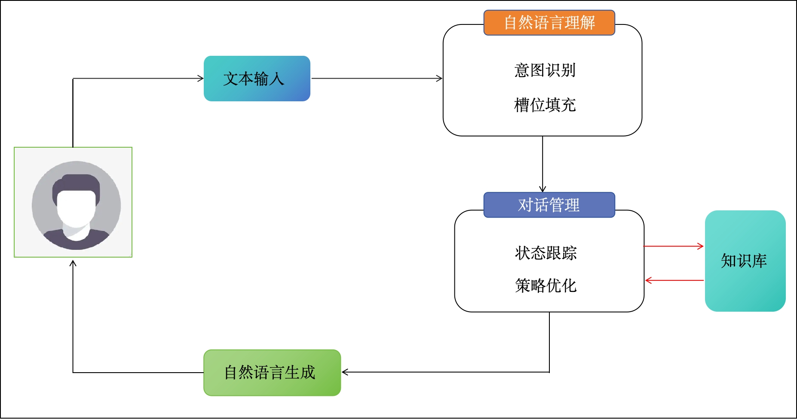

## 1 问答系统基础知识

### 1. 什么是问答系统

> **问答系统（Question Answering System, QA）** 是自然语言处理领域的关键应用，作为传统信息检索系统的高级演进，能够准确理解并清晰回答用户以自然语言形式提出的问题。


**核心特点**

- **智能理解**：深度解析用户意图，而非简单关键词匹配
- **精准回答**：直接提供答案，而非文档列表
- **自然交互**：支持对话式、多轮次的人机交流


**典型应用场景**

💡 **智能助手**：微软小冰（2014年首发）、Apple Siri、小爱同学
💡 **智能音箱**：天猫精灵、小度在家、Amazon Echo
💡 **专业服务**：医疗咨询、金融客服、技术支持

⚠️ **发展趋势**：问答系统正从通用型向垂直领域深度渗透，成为企业数字化转型的核心技术之一。


### 2. 问答系统核心框架

现代问答系统采用分层架构设计，主要包括三大核心模块：



1️⃣ 自然语言理解（NLU）

**功能定位**：将用户输入的自然语言转化为机器可处理的结构化语义表示。

**关键技术**：

- 意图识别（Intent Classification）
- 实体抽取（Named Entity Recognition）
- 语义槽填充（Slot Filling）


2️⃣ 对话管理（DM）

作为系统的中枢控制模块，包含两个核心子模块：

| 子模块           | 功能描述                                           | 输出结果                   |
| :--------------- | :------------------------------------------------- | :------------------------- |
| **对话状态跟踪** | 维护当前对话上下文，记录已获取信息和待确认项       | 对话状态（Dialogue State） |
| **策略学习**     | 基于当前状态选择最优行动策略（如提问、确认、执行） | 系统动作（System Action）  |


3️⃣ 自然语言生成（NLG）

**功能定位**：将系统决策转化为自然、流畅、符合语境的文本回复。

**生成方式**：

- **基于模板**：快速、可控，适合专业领域
- **基于模型**：灵活、多样，适合开放域对话


### 3. 问答系统分类体系

**按任务类型划分**

| 类型             | 功能定位                         | 核心特征                                 | 典型场景             | 技术侧重点         |
| :--------------- | :------------------------------- | :--------------------------------------- | :------------------- | :----------------- |
| **任务型机器人** | 完成特定任务（预订、查询、办理） | 状态驱动、多轮对话、槽位管理、事务执行   | 智能客服、业务办理   | 流程控制与集成能力 |
| **解答型机器人** | 基于知识库回答事实性问题         | 精准匹配、单轮为主、知识依赖、可解释性强 | 医疗咨询、产品FAQ    | 知识检索与推理     |
| **闲聊型机器人** | 开放域无目的对话                 | 趣味性强、个性化、上下文关联度低         | 情感陪伴、社交机器人 | 生成质量与多样性   |

**按技术方案划分**

| 方案类型               | 工作原理               | 优势                           | 局限性                         | 适用场景               |
| :--------------------- | :--------------------- | :----------------------------- | :----------------------------- | :--------------------- |
| **检索式问答**         | 搜索引擎+答案抽取      | 实现简单、响应快速、成本较低   | 依赖文档质量、弱推理能力       | 企业文档问答、社区问答 |
| **知识式问答（KBQA）** | 结构化知识库查询与推理 | 精准可靠、可解释、支持复杂推理 | 构建成本高、覆盖面有限         | 医疗、金融等专业领域   |
| **阅读理解式问答**     | 深度学习模型端到端生成 | 灵活性强、无需预定义结构       | 需要大量标注数据、黑盒不可解释 | 新闻阅读、开放域问答   |


### 4. 知识图谱与问答系统融合趋势

随着知识图谱技术的成熟，**基于知识图谱的问答系统（Knowledge-based Question Answering, KBQA）** 已成为垂直领域的核心解决方案：

**核心价值对比**

| 维度         | 传统问答系统       | KBQA系统           | 提升效果              |
| :----------- | :----------------- | :----------------- | :-------------------- |
| **准确性**   | 依赖文本相似度匹配 | 基于结构化事实查询 | 答案精准度提升60%以上 |
| **可解释性** | 黑盒决策过程       | 推理路径完全可追溯 | 增强用户信任度        |
| **推理能力** | 单跳、单文档理解   | 多跳关系推理与计算 | 支持复杂逻辑问题      |
| **知识复用** | 数据孤岛、难以共享 | 统一知识表示与访问 | 跨业务场景快速复用    |

**医疗领域应用优势**

💡 **典型案例**：在医疗场景中，KBQA系统能够：

- **快速定位疾病信息**：基于症状→疾病→治疗方案的知识路径
- **支持辅助诊断**：通过多条件组合推理提供诊断建议
- **保障回答可靠性**：所有答案均有权威医学知识支撑

⚠️ **技术挑战**：医学知识图谱构建需要领域专家深度参与，且需持续更新以反映最新医学进展。


## 2 自然语言理解NLU

### 1. 什么是意图识别？

意图识别是判断用户真实需求的过程，是问答系统的第一步决策。例如，当用户询问"今天北京天气如何"时，系统需要识别出用户在查询天气信息。

⚠️ **意图识别的本质是一个文本分类问题**，但有以下特点：

- **场景依赖性**：必须根据特定业务场景预定义意图类别
- **动态性**：同一Query在不同时期可能对应不同意图（如"战狼"在电影上映期 vs 游戏发布期）


### 2. 什么是槽位填充？

识别用户意图后，系统需要提取关键信息才能执行具体操作。槽位填充就是将用户输入中的关键信息抽取出来，填充到预定义的语义槽中。

💡 **典型场景**：用户说"订一张今天下午场次的战狼电影票"，系统识别"订电影票"意图后，需要填充以下槽位：

| 槽位名称   | 槽位值        | 是否必须 | 说明                         |
| :--------- | :------------ | :------- | :--------------------------- |
| 电影名     | 战狼          | ✅ 是     | 需澄清是战狼1还是战狼2       |
| 电影院名称 | XX影城/YY影城 | ⚠️ 预测   | 根据用户位置预测，需用户确认 |
| 时间       | 今天下午      | ✅ 是     | 需匹配具体场次               |
| 数量       | 1张           | ❌ 可选   | 默认为1张                    |
| 座位位置   | 未提供        | ❓ 追问   | 必须交互获取                 |

#### 2.1 语义槽的结构化设计

一个专业的语义槽应包含完整交互逻辑，而不仅是数据字段：

```json
{
  "订电影票": {
    "电影名": {
      "槽位值": null,
      "追问话术": "请问您需要看哪部电影？",
      "歧义澄清话术": "您想看《战狼》第几部？战狼1还是战狼2？",
      "预测接口": "/api/predict_movie_name/",
      "是否必需": true
    },
    "电影院名称": {
      "槽位值": null,
      "追问话术": "请问您要去哪个电影院？",
      "歧义澄清话术": "您想去XX影城还是YY影城？",
      "预测接口": "/api/predict_cinema/",
      "是否必需": true
    },
    "时间": {
      "槽位值": null,
      "追问话术": "请问您想什么时候观看？",
      "歧义澄清话术": "您想选择X点场还是Y点场？",
      "预测接口": "/api/predict_time/",
      "是否必需": true
    },
    "数量": {
      "槽位值": 1,  // 设置默认值
      "追问话术": "请问需要预订几张票？",
      "预测接口": "/api/predict_number/",
      "是否必需": false
    },
    "座位位置": {
      "槽位值": null,
      "追问话术": "请选择座位号：",
      "预测接口": "/api/predict_seat/",
      "是否必需": true
    }
  }
}
```

**交互流程**：

1. **识别阶段**：通过NER提取显式槽位值（如"战狼"→电影名）
2. **预测阶段**：调用预测接口补全缺失槽位（如根据LBS预测影院）
3. **澄清阶段**：当槽位值存在歧义时，触发澄清话术
4. **追问阶段**：对必需但未获取的槽位，主动发起追问


### 3. 意图识别三大技术路线

| 方法类型         | 核心原理                           | 优势                             | 劣势                             | 适用场景               |
| :--------------- | :--------------------------------- | :------------------------------- | :------------------------------- | :--------------------- |
| **规则模板**     | 人工总结正则表达式和句法模式       | 准确率高、可解释性强、零训练数据 | 召回率低、维护成本高、迁移性差   | 冷启动、精准场景       |
| **统计机器学习** | TF-IDF + SVM/LR/随机森林           | 比规则灵活、训练速度快           | 依赖人工特征工程、效果中等       | 中小规模数据集         |
| **深度学习**     | 预训练词向量 + CNN/RNN/Transformer | 端到端、泛化能力强、效果好       | 需要大量标注数据、计算资源消耗大 | 大规模数据集、复杂场景 |


#### 3.1 规则模板方法详解

⚠️ **模板构建流程**：收集Query → 分词/词性标注 → 依存句法分析 → 归纳模式 → 制定正则模板

**典型示例**：

```python
# 定义订机票意图的正则模板
# 该模板匹配：任意字符 + 地名 + (到|去|飞|飞往) + 地名 + 任意字符 + (机票|飞机票|航班) + 任意字符
flight_booking_pattern = r'.*?[地名]{到|去|飞|飞往}[地名].*?{机票|飞机票|航班}.*?' 

# 示例匹配逻辑
def match_intent(query, patterns_dict):
    """
    基于规则模板的意图匹配函数
    
    参数:
        query: 用户输入的查询语句
        patterns_dict: 意图-模板字典，如{'订机票': pattern, '查天气': pattern2}
    
    返回:
        matched_intent: 匹配到的意图名称
        confidence: 匹配置信度 (0-1之间)
    """
    for intent, pattern in patterns_dict.items():
        match_score = calculate_pattern_match(query, pattern)
        if match_score > 0.7:  # 设置匹配阈值，避免误召回
            return intent, match_score
    return None, 0.0

# 测试案例
test_query = "查询后天广州到上海的航班"
# 分词结果: ["查询", "后天", "广州", "到", "上海", "的", "航班"]
# 实体识别: 地名("广州", "上海")
# 关键词匹配: "到", "航班"
# 模板匹配度: 85% > 阈值 → 识别为"订机票"意图
```

**规则模板的优劣分析**：

- ✨ **优势**：无需标注数据、可解释性强、精准控制
- ⚠️ **劣势**：长尾query覆盖差、人工成本高、难以扩展到新领域


#### 3.2 统计机器学习方法

```python
# 传统机器学习流程示例
from sklearn.feature_extraction.text import TfidfVectorizer
from sklearn.svm import SVC

# 1. 特征工程：构建TF-IDF向量
#    需要人工设计的特征：
#    - n-gram特征（1-gram, 2-gram）
#    - 词性特征（地名、动词、名词占比）
#    - 实体类型特征（是否包含时间、地点、人名）
vectorizer = TfidfVectorizer(
    ngram_range=(1, 2),  # 同时使用1-gram和2-gram特征
    max_features=5000    # 限制特征维度
)

# 2. 模型训练
#    常用算法：SVM(高准确率)、LR(速度快)、RandomForest(抗过拟合)
clf = SVC(kernel='linear', C=1.0)  # 线性SVM适合文本分类

# 3. 预测
#    输出：意图类别 + 置信度分数
#    置信度可用于多意图判断和拒识（当所有意图分数都低时）
```

💡 **特征工程是此方法的核心**，通常需要领域专家设计上百个特征才能达到较好效果。


#### 3.3 深度学习方法

```python
import torch
import torch.nn as nn

class IntentClassifier(nn.Module):
    """
    基于BERT的意图分类器
    
    模型结构：
    BERT编码 → 池化层 → 全连接层 → Softmax输出
    
    优势：
    - 自动学习语义特征，无需人工设计
    - 利用预训练知识，小样本也能达到不错效果
    - 支持多意图、意图强度等复杂场景
    """
    
    def __init__(self, bert_model, num_intents, dropout=0.1):
        super().__init__()
        self.bert = bert_model  # 预训练的BERT模型
        self.dropout = nn.Dropout(dropout)
        self.classifier = nn.Linear(768, num_intents)  # BERT-base输出768维
        
    def forward(self, input_ids, attention_mask):
        """
        前向传播函数
        
        参数:
            input_ids: 分词后的token ID序列 [batch_size, seq_len]
            attention_mask: 注意力掩码 [batch_size, seq_len]
        
        返回:
            intent_logits: 各意图的未归一化分数 [batch_size, num_intents]
            intent_probs: 各意图的概率分布 [batch_size, num_intents]
        """
        # BERT编码：获取最后一层的隐藏状态
        outputs = self.bert(input_ids=input_ids, attention_mask=attention_mask)
        pooled_output = outputs.pooler_output  # [CLS] token的表示
        
        #  dropout防止过拟合
        pooled_output = self.dropout(pooled_output)
        
        # 分类层：映射到意图类别空间
        intent_logits = self.classifier(pooled_output)
        
        return intent_logits

# 训练注意事项：
# 1. 数据增强：使用同义词替换、随机删除等方式扩充训练集
# 2. 样本均衡：对样本少的意图使用过采样或加权损失
# 3. 多意图支持：使用多标签分类而非单标签分类
# 4. 拒识机制：增加"other"意图类别，处理未知query
```

⚠️ **意图识别的四大难点**：

1. **输入不规范**：错别字（"战郎"）、关键词堆砌（"电影 战狼 订票"）、非标准表达
2. **多意图问题**：Query信息量少导致意图模糊，如"仙剑奇侠传"可能是游戏、电视剧、小说等
3. **意图强度低**：多个意图得分相近，无法明确判断主意图
4. **时效性敏感**：相同Query在不同时间意图可能变化，如"战狼"在热映期 vs 重映期


### 4. 槽位填充实现方法

槽位填充本质上是**序列标注任务**，但与传统的命名实体识别(NER)有重要区别：

| 对比维度       | 命名实体识别(NER)            | 槽位填充(Slot Filling)                          |
| :------------- | :--------------------------- | :---------------------------------------------- |
| **标注目标**   | 通用实体（地名、人名、时间） | 业务相关槽位（出发地dept、目的地arr）           |
| **标签体系**   | PER, LOC, ORG, TIME          | 意图特定的槽位标签（如movie_name, cinema_name） |
| **上下文依赖** | 相对独立                     | 强依赖意图上下文                                |
| **歧义处理**   | 无需区分实体角色             | 需明确实体在业务中的角色（如出发地 vs 目的地）  |

**标注方式对比示例**：

```python
# 用户输入: "订一张后天从广州到北京的机票"

# ❌ 错误做法：直接使用NER标注
# 结果: [O, O, O, B-LOC, O, B-LOC, O, O]
# 问题: 无法区分广州是出发地还是目的地

# ✅ 正确做法：意图感知的槽位标注
# 结果: [O, O, O, B-dept, O, B-arr, O, O]
# 其中: dept = departure(出发地), arr = arrival(目的地)
# 优势: 精确表达业务语义，避免后续处理混淆
```