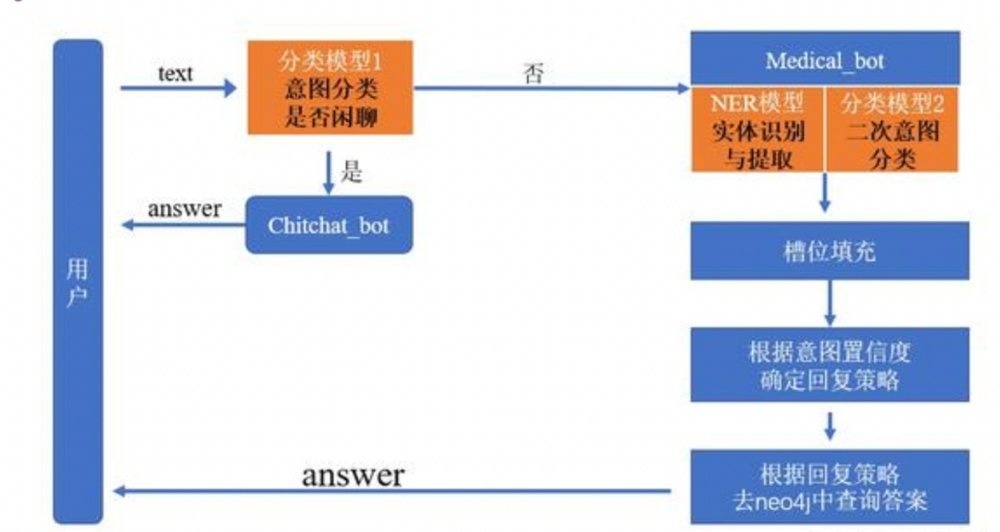

## 1 系统架构

本系统基于医疗知识图谱构建智能问答功能，采用任务型对话机器人经典框架，包含三大核心模块：



**架构说明**：

- **NLU模块**：负责意图识别和实体抽取
- **DM模块**：管理对话状态，执行对话策略
- **NLG模块**：生成自然语言回复

> 💡 **架构优势**：模块化设计便于维护扩展，支持多轮对话和意图澄清


## 2 整体实现步骤

| 模块        | 子任务       | 技术方案         | 输出结果            |
| :---------- | :----------- | :--------------- | :------------------ |
| **NLU模块** | 闲聊意图识别 | sklearn分类模型  | 6类意图预测         |
|             | 医疗意图识别 | BERT fine-tuning | 13类意图预测        |
|             | 槽位填充     | BiLSTM+CRF       | 7种实体识别         |
| **DM模块**  | 语义槽定义   | JSON配置文件     | 意图-槽位映射       |
|             | 对话策略     | 阈值判断         | accept/clarify/deny |
| **主逻辑**  | 对话流程控制 | Streamlit界面    | 交互式问答          |


## 3 NLU模块实现

### 模型一：闲聊意图识别模型

**功能定位**：快速判断用户是否为闲聊意图，避免进入复杂医疗推理流程

#### 1.1 支持意图类型

| 意图类别    | 处理策略                   | 触发场景       |
| :---------- | :------------------------- | :------------- |
| `greet`     | 随机返回问候语             | 用户打招呼     |
| `goodbye`   | 随机返回结束语             | 用户告别       |
| `deny`      | 返回否认回复               | 用户表示否定   |
| `isbot`     | 返回身份说明               | 询问机器人身份 |
| `accept`    | **关键意图**：加载澄清答案 | 用户确认问题   |
| `diagnosis` | 转入医疗Bot                | 表达诊疗需求   |

**数据样例**（`./data/train.txt`）：

```text
你好呀,greet
再见,goodbye
你错了,deny
你是谁,isbot
可以,accept
这个病可以预防吗,diagnosis
```

> 📊 **数据集**：共208条样本，覆盖6类意图


#### 1.2 模型训练与保存

```python
# -*- coding:utf-8 -*-
import os
import pickle
import random
import numpy as np
from sklearn.linear_model import LogisticRegression
from sklearn.ensemble import GradientBoostingClassifier
from sklearn.feature_extraction.text import TfidfVectorizer
from sklearn.model_selection import train_test_split

# 设置随机种子，确保实验可复现
seed = 222
random.seed(seed)
np.random.seed(seed)

def load_data(data_path):
    """加载训练数据并进行预处理
    
    参数:
        data_path: 数据文件路径
        
    返回:
        X: 文本列表（已转换为字符级空格分隔）
        y: 标签列表
    """
    X, y = [], []
    with open(data_path, 'r', encoding='utf8') as f:
        for line in f.readlines():
            # 按逗号分割文本和标签
            text, label = line.strip().split(',')
            # 将文本转为小写并按字符分割（适应中文特性）
            text = ' '.join(list(text.lower()))
            X.append(text)
            y.append(label)

    # 随机打乱数据顺序，避免顺序偏差
    index = np.arange(len(X))
    np.random.shuffle(index)
    X = [X[i] for i in index]
    y = [y[i] for i in index]
    return X, y

def run(data_path, model_save_path):
    """主训练函数：训练双模型并融合预测
    
    参数:
        data_path: 训练数据路径
        model_save_path: 模型保存目录
    """
    X, y = load_data(data_path)
    
    # 构建标签映射字典
    label_set = sorted(list(set(y)))
    label2id = {label: idx for idx, label in enumerate(label_set)}
    id2label = {idx: label for label, idx in label2id.items()}
    y = [label2id[i] for i in y]
    
    # 准备评估指标所需的信息
    label_names = sorted(label2id.items(), key = lambda kv:kv[1], reverse=False)
    target_names = [i[0] for i in label_names]
    labels = [i[1] for i in label_names]

    # 划分训练集和测试集（85%训练，15%测试）
    train_X, text_X, train_y, text_y = train_test_split(X, y, test_size=0.15, random_state=42)

    # 特征工程：使用TF-IDF提取字符级n-gram特征
    # ngram_range=(1,3): 提取1-3个字符的组合特征
    # analyzer='char': 按字符级别分析（适合中文）
    # min_df作用：去掉生僻词，降低维度，抑制噪声。
    # max_df作用：去掉高频但信息量极低的“停用词”类特征（如“的”“the”），进一步降维。
    vec = TfidfVectorizer(ngram_range=(1,3), min_df=0.0, max_df=0.9, analyzer='char')
    train_X = vec.fit_transform(train_X)  # 训练集拟合转换
    text_X = vec.transform(text_X)        # 测试集仅转换

    # ------------- 模型1：逻辑回归（LR）--------------
    # C=8: 正则化强度倒数，值越小正则化越强
    # multi_class='ovr': 一对多策略处理多分类
    LR = LogisticRegression(C=8, dual=False, n_jobs=4, max_iter=400, 
                           multi_class='ovr', random_state=122)
    LR.fit(train_X, train_y)
    
    pred = LR.predict(text_X)
    print("=== 逻辑回归模型性能 ===")
    print(classification_report(text_y, pred, target_names=target_names))
    print("混淆矩阵:\n", confusion_matrix(text_y, pred, labels=labels))
    
    # ------------- 模型2：梯度提升树（GBDT）--------------
    # n_estimators=450: 弱学习器数量
    # learning_rate=0.01: 学习率，控制每棵树贡献
    gbdt = GradientBoostingClassifier(n_estimators=450, learning_rate=0.01, 
                                     max_depth=8, random_state=24)
    gbdt.fit(train_X, train_y)
    
    pred = gbdt.predict(text_X)
    print("\n=== GBDT模型性能 ===")
    print(classification_report(text_y, pred, target_names=target_names))
    print("混淆矩阵:\n", confusion_matrix(text_y, pred, labels=labels))

    # ------------- 模型融合：概率平均--------------
    pred_prob1 = LR.predict_proba(text_X)
    pred_prob2 = gbdt.predict_proba(text_X)
    # 对两个模型的预测概率取平均，提升鲁棒性
    pred = np.argmax((pred_prob1 + pred_prob2) / 2, axis=1)
    
    print("\n=== 融合模型性能 ===")
    print(classification_report(text_y, pred, target_names=target_names))
    print("混淆矩阵:\n", confusion_matrix(text_y, pred, labels=labels))

    # 保存所有组件（模型+向量器+映射字典）
    pickle.dump(id2label, open(os.path.join(model_save_path, 'id2label.pkl'), 'wb'))
    pickle.dump(vec, open(os.path.join(model_save_path, 'vec.pkl'), 'wb'))
    pickle.dump(LR, open(os.path.join(model_save_path, 'LR.pkl'), 'wb'))
    pickle.dump(gbdt, open(os.path.join(model_save_path, 'gbdt.pkl'), 'wb'))

if __name__ == '__main__':
    run("./data/intent_recog_data.txt", "./model_file/")
```


#### 1.3 模型加载与预测

```python
# -*- coding:utf-8 -*-
import os
import pickle
import numpy as np

class CLFModel(object):
    """闲聊意图分类模型封装类
    
    功能：加载训练好的双模型，提供统一的预测接口
    """
    def __init__(self, model_save_path):
        super().__init__()
        self.model_save_path = model_save_path
        
        # 加载标签映射和向量化器
        self.id2label = pickle.load(
            open(os.path.join(self.model_save_path, 'id2label.pkl'), 'rb')
        )
        self.vec = pickle.load(
            open(os.path.join(self.model_save_path, 'vec.pkl'), 'rb')
        )
        
        # 加载两个分类器
        self.LR_clf = pickle.load(
            open(os.path.join(self.model_save_path, 'LR.pkl'), 'rb')
        )
        self.gbdt_clf = pickle.load(
            open(os.path.join(self.model_save_path, 'gbdt.pkl'), 'rb')
        )

    def predict(self, text):
        """预测单条文本的意图
        
        参数:
            text: 用户输入文本
            
        返回:
            预测的标签名称
        """
        # 文本预处理：小写化 + 字符级分词
        text = ' '.join(list(text.lower()))
        # 转换为TF-IDF特征向量
        text_vec = self.vec.transform([text])
        
        # 双模型预测并融合
        proba1 = self.LR_clf.predict_proba(text_vec)
        proba2 = self.gbdt_clf.predict_proba(text_vec)
        
        # 取平均概率最高的类别
        label = np.argmax((proba1 + proba2) / 2, axis=1)
        return self.id2label.get(label[0])

# 使用示例
if __name__ == '__main__':
    model = CLFModel('./model_file')
    print(model.predict('你是谁'))  # 输出: isbot
```


### 模型二：医疗意图识别（13类）

**功能定位**：精确识别13种医疗专业意图，支持复杂问诊场景

#### 2.1 支持的医疗意图

| ID   | 意图名称      | 查询类型     | 示例问题             |
| :--- | :------------ | :----------- | :------------------- |
| 0    | 定义          | 疾病基本概念 | "糖尿病是什么"       |
| 1    | 病因          | 致病原因     | "高血压怎么引起的"   |
| 2    | 预防          | 预防措施     | "如何预防感冒"       |
| 3    | 临床表现      | 症状描述     | "肺结核有什么症状"   |
| 4    | 相关病症      | 并发症/共病  | "糖尿病并发症"       |
| 5    | 治疗方法      | 治疗方案     | "胃炎怎么治疗"       |
| 6    | 所属科室      | 就诊科室     | "心脏病挂什么科"     |
| 7    | 传染性        | 感染传播     | "流感会传染吗"       |
| 8    | 治愈率        | 预后情况     | "肺癌治愈率"         |
| 9    | 禁忌          | 饮食禁忌     | "痛风不能吃什么"     |
| 10   | 化验/体检方案 | 检查项目     | "确诊肺炎做哪些检查" |
| 11   | 治疗时间      | 疗程周期     | "骨折多久能好"       |
| 12   | 其他          | 未分类问题   | "婴儿会有痔疮吗"     |


医疗意图识别模型的数据集位于项目以下路径：

```bash
./NLP/MedicalKB/NLU/Medical_intention/data
```

该目录包含 **3个核心文件**，构成完整的训练和推理数据体系：

| 文件名称        | 作用         | 数据量   | 格式 |
| :-------------- | :----------- | :------- | :--- |
| **`train.csv`** | 训练数据集   | 7,273条  | CSV  |
| **`test.csv`**  | 测试数据集   | 1,500+条 | CSV  |
| **`label.txt`** | 意图标签定义 | 13个类别 | 文本 |


**📊 数据格式规范**

所有CSV文件均采用 **UTF-8编码**，使用逗号`,`作为分隔符，包含以下三列：

| 列名              | 数据类型 | 说明                   | 示例                       |
| :---------------- | :------- | :--------------------- | :------------------------- |
| **`text`**        | 字符串   | 用户原始提问（已脱敏） | "肾结石用什么药效果较好？" |
| **`label_class`** | 字符串   | 意图类别中文名称       | "治疗方法"                 |
| **`label_id`**    | 整数     | 意图类别ID（0-12）     | `5`                        |

> ⚠️ **注意**：数据已做预处理，文本中的英文标点已统一，确保格式一致性


#### 2.2 配置文件

```python
# intent_config.py
import torch

class Config():
    def __init__(self):
        # 自动选择计算设备（GPU > CPU）
        self.device = "cuda" if torch.cuda.is_available() else "cpu"
        
        # 数据文件路径
        self.train_path = './data/train.csv'
        self.test_path = './data/test.csv'
        self.label_path = './data/label.txt'
        
        # 训练超参数
        self.epochs = 10        # 训练轮次
        self.lr = 2e-5          # 学习率（BERT微调常用值）
        self.batch_size = 16    # 批次大小
        self.max_len = 60       # 文本最大长度
        self.num_class = 13     # 分类类别数
        
        # 预训练模型路径
        self.bert_path = './bert-base-chinese'
```


#### 2.3 数据加载与预处理

```python
# utils/data_loader.py
from transformers import BertTokenizer
from torch.utils.data import Dataset, DataLoader

conf = Config()
tokenizer = BertTokenizer.from_pretrained(conf.bert_path)

def load_data(path):
    """加载CSV格式的训练数据
    
    返回:
        texts: 文本列表
        labels: 标签ID列表
    """
    train = pd.read_csv(path, header=0, sep=',', 
                       names=["text", "label_class", "label_id"])
    texts = train.text.to_list()
    # 将标签转为整数并存储
    labels = train.label_id.map(int).to_list()
    return texts, labels

class MyDataset(Dataset):
    """自定义数据集类，适配PyTorch DataLoader"""
    def __init__(self, data_path):
        self.texts, self.labels = load_data(data_path)

    def __len__(self):
        return len(self.texts)

    def __getitem__(self, item):
        return self.texts[item], self.labels[item]

def collate_fn(datas):
    """批处理函数：将样本列表转换为张量批次
    
    处理流程：
    1. 分离文本和标签
    2. 使用BERT tokenizer批量编码
    3. 填充/截断到统一长度
    4. 转换为PyTorch张量
    """
    batch_text = [item[0] for item in datas]
    batch_label = [item[1] for item in datas]
    
    # 批量编码：padding填充，truncation截断，max_length最大长度限制
    inputs = tokenizer.batch_encode_plus(
        batch_text,
        padding='max_length',
        truncation=True,
        max_length=conf.max_len,
        return_tensors='pt'  # 返回PyTorch张量
    )
    
    # 将数据转移到GPU/CPU设备
    input_ids = inputs["input_ids"].to(conf.device)
    attention_mask = inputs["attention_mask"].to(conf.device)
    token_type_ids = inputs["token_type_ids"].to(conf.device)
    labels = torch.tensor(batch_label, dtype=torch.long, device=conf.device)
    
    return input_ids, attention_mask, token_type_ids, labels

def get_dataloader():
    """创建训练和验证数据加载器"""
    train_dataset = MyDataset(conf.train_path)
    test_dataset = MyDataset(conf.test_path)
    train_iter = DataLoader(
        train_dataset,
        batch_size=conf.batch_size,
        collate_fn=collate_fn,    # 自定义批处理函数
        drop_last=True,           # 丢弃不足batch_size的最后一个批次
        shuffle=True              # 打乱顺序
    )
    test_iter = DataLoader(
        test_dataset,
        batch_size=conf.batch_size,
        collate_fn=collate_fn,    # 自定义批处理函数
        drop_last=True,           # 丢弃不足batch_size的最后一个批次
        shuffle=True              # 打乱顺序
    )
    return train_iter, test_iter
```


#### 2.4 模型构建

```python
# model.py
import torch.nn as nn
from transformers import BertModel

class MyModel(nn.Module):
    """基于BERT的医疗意图分类模型
    
    结构: BERT + 全连接层
    - BERT提取语义特征
    - pooler_output: BERT的[CLS] token的 pooled表示
    - Linear层映射到13个意图类别
    """
    def __init__(self, bert_path, bert_hidden, tag_size):
        super().__init__()
        # 加载预训练BERT模型
        self.bert = BertModel.from_pretrained(bert_path)
        # 分类头：768维 -> 类别数
        self.linear = nn.Linear(bert_hidden, tag_size)

    def forward(self, input_ids, attention_mask, token_type_ids):
        # 获取BERT的池化输出
        pool_output = self.bert(
            input_ids, 
            attention_mask, 
            token_type_ids
        ).pooler_output
        
        # 全连接层分类
        output = self.linear(pool_output)
        return output
```


#### 2.5 模型训练

```python
# train.py
import torch.optim as optim
from tqdm import tqdm  # 进度条库

def model2train():
    """模型训练主函数
    
    训练流程：
    1. 加载数据
    2. 初始化模型和优化器
    3. 多轮训练，每100步打印日志
    4. 每轮保存模型权重
    """
    # 获取数据迭代器
    train_iter, _ = get_dataloader()
    
    # 初始化模型并转移到设备
    my_model = MyModel(conf.bert_path, 768, conf.num_class)
    my_model = my_model.to(conf.device)
    
    # Adam优化器，学习率2e-5
    my_optim = optim.Adam(my_model.parameters(), lr=conf.lr)
    
    # 交叉熵损失函数
    criation = nn.CrossEntropyLoss()

    # 训练循环
    my_model.train()
    start_time = time.time()
    
    for epoch_idx in range(conf.epochs):
        total_num = 0    # 累计样本数
        total_loss = 0   # 累计损失
        total_acc = 0    # 累计正确数
        
        # 使用tqdm显示进度条
        for i, (input_ids, attention_mask, token_type_ids, labels) in enumerate(
            tqdm(train_iter, desc='训练集')
        ):
            # 前向传播
            outputs = my_model(input_ids, attention_mask, token_type_ids)
            
            # 计算损失
            my_loss = criation(outputs, labels)
            
            # 反向传播三步：清零梯度 -> 反向计算 -> 更新参数
            my_optim.zero_grad()
            my_loss.backward()
            my_optim.step()

            # 统计指标
            total_num += outputs.size(0)
            total_loss += my_loss.item()
            
            # 计算准确率
            acc_num = sum(torch.argmax(outputs, dim=-1) == labels).item()
            total_acc += acc_num
            
            # 每100步打印训练日志
            if i % 100 == 0:
                avg_loss = total_loss / total_num
                avg_acc = total_acc / total_num
                use_time = time.time() - start_time
                print(f'轮次: {epoch_idx+1}, 损失: {avg_loss:.4f}, '
                      f'准确率: {avg_acc:.4f}, 耗时: {use_time:.2f}s')
        
        # 保存当前轮次模型
        torch.save(
            my_model.state_dict(), 
            f'./save_model/epoch_{epoch_idx+1}.pth'
        )

if __name__ == '__main__':
    model2train()
```


#### 2.6 Flask API服务封装

```python
# api_server.py
from flask import Flask, request, jsonify

app = Flask(__name__)

# 加载标签映射
label_list = [line.strip() for line in open('./data/label.txt', 'r', encoding='utf8')]
id2label = {idx: label for idx, label in enumerate(label_list)}

# 加载模型
model = MyModel(bert_path=conf.bert_path, bert_hidden=768, tag_size=conf.num_class)
model.load_state_dict(torch.load('./save_model/epoch_10.pth'))
model = model.to(conf.device)
model.eval()  # 设置为评估模式

def model2predict(sample, model):
    """单条文本预测函数
    
    处理流程：
    1. Tokenizer编码
    2. 模型推理
    3. Softmax概率化
    4. Top-K结果提取
    """
    # 编码输入文本
    inputs = tokenizer.encode_plus(
        sample,
        padding='max_length',
        truncation=True,
        max_length=60,
        return_tensors='pt'
    )
    
    # 转移到设备
    input_ids = inputs["input_ids"].to(conf.device)
    attention_mask = inputs["attention_mask"].to(conf.device)
    token_type_ids = inputs["token_type_ids"].to(conf.device)
    
    # 推理（不计算梯度，提升速度）
    with torch.no_grad():
        logits = model(input_ids, attention_mask, token_type_ids)
    
    # 概率转换和预测
    logits = torch.softmax(logits, dim=-1)
    value, index = torch.topk(logits, k=1)  # 取最高概率
    
    return {
        "name": id2label[index.item()],      # 意图名称
        "confidence": round(float(value.item()), 3)  # 置信度
    }

@app.route("/service/api/bert_intent_recognize", methods=["POST"])
def bert_intent_recognize():
    """BERT意图识别API接口
    
    请求格式: {"text": "查询文本"}
    返回格式: {
        "success": 1,
        "result": {"name": "治疗方法", "confidence": 0.923}
    }
    """
    data = {"success": 0}
    try:
        param = request.get_json()
        text = param["text"]
        result = model2predict(text, model)
        data["result"] = result
        data["success"] = 1
    except Exception as e:
        print(f'模型调用错误: {e}')
    
    return jsonify(data)

if __name__ == '__main__':
    app.run(host='0.0.0.0', port=6001)
```

#### 2.7 API测试示例

Python

复制

```python
# test_api.py
import requests
import json

def intent_classifier(text):
    """测试API调用函数
    
    发送POST请求到本地意图识别服务
    """
    url = 'http://127.0.0.1:6001/service/api/bert_intent_recognize'
    data = {"text": text}
    headers = {'Content-Type': 'application/json; charset=utf8'}
    
    response = requests.post(url, data=json.dumps(data), headers=headers)
    if response.status_code == 200:
        response = json.loads(response.text)
        return response['result']
    else:
        return -1

# 测试用例
if __name__ == '__main__':
    result = intent_classifier("不同类型的肌无力症状表现有什么不同？")
    print(f'识别结果: {result}')
    # 预期输出: {'name': '临床表现(病症表现)', 'confidence': 0.923}
```

------

### 🔍 模型三：槽位填充（NER）

> ⚠️ **实践任务**：本模块需学员独立完成，基于BiLSTM+CRF架构实现7种医疗实体识别（疾病、症状、药物、科室、检查、食物、其他）

**技术要求**：

- 支持实体类型：`Disease`, `Symptom`, `Drug`, `Department`, `Check`, `Food`, `Other`
- API端口：`6002`
- 接口路径：`/service/api/medical_ner`

------

## DM模块：语义槽设计

**配置文件位置**：`./NLP/MedicalKB/config.py`

### 语义槽结构说明

每个意图对应一个语义槽配置，包含以下字段：

表格

复制

| 字段              | 类型     | 作用                            |
| :---------------- | :------- | :------------------------------ |
| `slot_list`       | List     | 必填槽位名称（如`["Disease"]`） |
| `slot_values`     | Dict     | 运行时存储提取的槽值            |
| `cql_template`    | Str/List | Cypher查询模板                  |
| `reply_template`  | Str      | 答案回复模板                    |
| `ask_template`    | Str      | **澄清询问模板**                |
| `intent_strategy` | Str      | 决策策略（accept/clarify/deny） |
| `deny_response`   | Str      | 拒绝回复语料                    |

### 配置代码示例

Python

复制

```python
# -*- coding:utf-8 -*-

semantic_slot = {
    "定义": {
        "slot_list": ["Disease"],  # 必填槽位：疾病名称
        "slot_values": None,
        "cql_template": "MATCH(p:疾病) WHERE p.name='{Disease}' RETURN p.desc",
        "reply_template": "'{Disease}' 是这样的：\n",
        "ask_template": "您问的是 '{Disease}' 的定义吗？",
        "intent_strategy": "",
        "deny_response": "很抱歉没有理解你的意思呢~"
    },
    # ... 其他12个意图配置 ...
}

# 意图置信度阈值配置
intent_threshold_config = {
    "accept": 0.8,    # ≥0.8直接回答
    "deny": 0.4       # <0.4拒绝回答，0.4-0.8之间澄清确认
}

# 默认回复
default_answer = """
很抱歉我还不知道回答你这个问题
你可以问我一些有关疾病的
定义、原因、治疗方法、注意事项、挂什么科室
预防、禁忌等相关问题哦~
"""

# 闲聊语料库
gossip_corpus = {
    "greet": ["hi", "你好呀", "我是智能医疗诊断机器人..."],
    "goodbye": ["再见，很高兴为您服务", "bye"],
    "deny": ["很抱歉没帮到您", "那您可以试着问我其他问题哟"],
    "isbot": ["我是小康，你的智能健康顾问"]
}
```

------

## 主逻辑模块

### modules.py：核心对话管理

**文件位置**：`./NLP/MedicalKB/modules.py`

#### 函数汇总表

表格

复制

| 函数名              | 输入       | 输出                 | 功能描述            |
| :------------------ | :--------- | :------------------- | :------------------ |
| `classifier`        | 用户文本   | 意图标签             | 闲聊意图识别        |
| `intent_classifier` | 用户文本   | 医疗意图JSON         | BERT意图识别API调用 |
| `slot_recognizer`   | 用户文本   | 槽位Dict             | NER槽位填充API调用  |
| `gossip_robot`      | 意图标签   | 回复文本             | 闲聊回复生成        |
| `medical_robot`     | 用户文本   | 回复文本             | 医疗问答主流程      |
| `semantic_parser`   | 用户文本   | 语义槽Dict           | 文本解析与填槽      |
| `get_answer`        | 语义槽Dict | 语义槽Dict（含答案） | 知识查询与策略执行  |
| `neo4j_searcher`    | Cypher查询 | 答案文本             | Neo4j图谱查询       |

#### 关键函数详解

**1. 闲聊意图识别 `classifier()`**

Python

复制

```python
def classifier(text):
    """
    快速判断是否为闲聊意图
    
    性能优势：本地sklearn模型，延迟极低（<10ms）
    """
    return clf_model.predict(text)  # 调用训练好的CLFModel
```

**2. 医疗意图识别 `intent_classifier()`**

Python

复制

```python
def intent_classifier(text):
    """
    调用BERT模型识别13类医疗意图
    
    异常处理：服务不可用时返回-1，避免系统崩溃
    """
    url = 'http://127.0.0.1:6001/service/api/bert_intent_recognize'
    data = {"text": text}
    headers = {'Content-Type': 'application/json; charset=utf8'}
    
    # 发送HTTP POST请求到意图识别服务
    response = requests.post(url, data=json.dumps(data), headers=headers)
    
    if response.status_code == 200:
        response = json.loads(response.text)
        return response['result']  # 返回{"name": "病因", "confidence": 0.95}
    else:
        return -1  # 服务异常标志位
```

**3. 语义解析 `semantic_parser()`**

Python

复制

```python
def semantic_parser(text):
    """
    核心函数：文本解析与语义槽填充
    
    决策逻辑：
    1. 调用意图识别和NER服务
    2. 检查服务可用性和数据完整性
    3. 根据意图强度选择策略（accept/clarify/deny）
    4. 填充语义槽并返回结构化信息
    """
    # 1. 并行调用两个模型服务
    intent_rst = intent_classifier(text)
    slot_rst = slot_recognizer(text)
    
    # 2. 异常处理：任一服务失败或无法识别意图
    if (intent_rst == -1 or slot_rst == -1 or 
        len(slot_rst) == 0 or 
        intent_rst.get("name") == "其他"):
        return semantic_slot.get("unrecognized")
    
    # 3. 加载意图对应的语义槽模板
    slot_info = semantic_slot.get(intent_rst.get("name"))
    slots = slot_info.get("slot_list")
    
    # 4. 槽位填充：将NER结果映射到语义槽
    slot_values = {}
    for key, value in slot_rst.items():
        # key是实体文本，value是实体类型
        if value.lower() == slots[0].lower():
            slot_values[slots[0]] = key
    
    slot_info["slot_values"] = slot_values
    
    # 5. 基于置信度选择对话策略
    conf = intent_rst.get("confidence")
    if conf >= intent_threshold_config["accept"]:      # ≥0.8 直接回答
        slot_info["intent_strategy"] = "accept"
    elif conf >= intent_threshold_config["deny"]:      # 0.4-0.8 澄清确认
        slot_info["intent_strategy"] = "clarify"
    else:                                              # <0.4 拒绝回答
        slot_info["intent_strategy"] = "deny"
    
    return slot_info
```

**4. 答案生成 `get_answer()`**

Python

复制

```python
def get_answer(slot_info):
    """
    根据语义槽和策略生成最终答案
    
    策略分支：
    - accept: 直接查询Neo4j并返回答案
    - clarify: 返回确认问题，并预存答案供后续调用
    - deny: 返回礼貌拒绝语
    """
    cql_template = slot_info.get("cql_template")
    reply_template = slot_info.get("reply_template")
    ask_template = slot_info.get("ask_template")
    slot_values = slot_info.get("slot_values")
    strategy = slot_info.get("intent_strategy")
    
    # 无槽值，直接返回默认回复
    if not slot_values:
        return slot_info

    if strategy == "accept":
        # 生成Cypher查询语句
        cql = []
        if isinstance(cql_template, list):
            for cqlt in cql_template:
                cql.append(cqlt.format(**slot_values))
        else:
            cql = cql_template.format(**slot_values)
        
        # 查询知识图谱
        answer = neo4j_searcher(cql)
        
        if not answer:
            slot_info["replay_answer"] = "唔~我装满知识的大脑此刻很贫瘠"
        else:
            # 拼接回复模板和查询结果
            pattern = reply_template.format(**slot_values)
            slot_info["replay_answer"] = pattern + answer
    
    elif strategy == "clarify":
        # 生成澄清问题
        pattern = ask_template.format(**slot_values)
        slot_info["replay_answer"] = pattern
        
        # 预查询并存储结果，供用户确认后直接使用
        cql = []
        if isinstance(cql_template, list):
            for cqlt in cql_template:
                cql.append(cqlt.format(**slot_values))
        else:
            cql = cql_template.format(**slot_values)
        
        answer = neo4j_searcher(cql)
        if answer:
            pattern = reply_template.format(**slot_values)
            slot_info["choice_answer"] = pattern + answer
    
    elif strategy == "deny":
        slot_info["replay_answer"] = slot_info.get("deny_response")
    
    return slot_info
```

**5. 知识图谱查询 `neo4j_searcher()`**

Python

复制

```python
def neo4j_searcher(cql_list):
    """
    执行Cypher查询并格式化结果
    
    支持：
    - 单条Cypher查询
    - 多条Cypher查询（List）
    - 自动处理返回的数据结构（列表/单值）
    """
    result = ""
    if isinstance(cql_list, list):
        # 多条查询：合并所有结果
        for cql in cql_list:
            rst = []
            data = graph.run(cql).data()  # 执行查询
            if not data:
                continue
            
            # 提取结果值（适配不同返回结构）
            for d in data:
                d = list(d.values())
                if isinstance(d[0], list):
                    rst.extend(d[0])  # 列表类型展开
                else:
                    rst.extend(d)     # 单值类型直接添加
            
            # 用顿号连接结果
            data = "、".join([str(i) for i in rst])
            result += data + "\n"
    else:
        # 单条查询逻辑同上
        data = graph.run(cql_list).data()
        if not data:
            return result
        
        rst = []
        for d in data:
            d = list(d.values())
            if isinstance(d[0], list):
                rst.extend(d[0])
            else:
                rst.extend(d)
        
        data = "、".join([str(i) for i in rst])
        result += data
    
    return result
```

------

### chat_app.py：Web交互界面

**技术栈**：Streamlit - 快速构建数据应用

Python

复制

```python
# -*- coding:utf-8 -*-
import streamlit as st
from modules import gossip_robot, medical_robot, classifier
from utils.json_utils import dump_user_dialogue_context, load_user_dialogue_context

def main():
    """Streamlit主函数：构建医疗问答Web界面"""
    st.title("🏥 小康医疗智能问答系统")

    # 初始化会话状态，存储对话历史
    if 'history' not in st.session_state:
        st.session_state.history = []

    # 显示历史对话（区分用户/助手）
    for chat in st.session_state.history:
        if chat['role'] == 'user':
            with st.chat_message("user"):
                st.markdown(chat['content'])
        else:
            with st.chat_message("assistant"):
                st.markdown(chat['content'])

    # 接收用户输入（底部输入框）
    if user_input := st.chat_input("请输入您的问题..."):
        # 显示用户消息
        with st.chat_message("user"):
            st.markdown(user_input)
        
        # ==================== 核心对话逻辑 ====================
        
        # 步骤1：闲聊意图识别
        user_intent = classifier(user_input)
        
        if user_intent in ["greet", "goodbye", "deny", "isbot"]:
            # 闲聊：随机选择回复
            response = gossip_robot(user_intent)
        
        elif user_intent == "accept":
            # 澄清确认：加载预存答案
            # 例如用户回复"是的"，则返回之前澄清的问题答案
            reply = load_user_dialogue_context()
            response = reply.get("choice_answer")
        
        elif user_intent == "diagnosis":
            # 医疗诊断：调用完整流程
            reply = medical_robot(user_input)
            
            # 如果有槽值，保存上下文（用于澄清）
            if reply["slot_values"]:
                dump_user_dialogue_context(reply)
            
            response = reply.get("replay_answer")
        
        else:
            # 异常情况：返回默认回复
            response = "抱歉，我不太理解您的问题。"
        
        # 步骤2：显示助手回复
        with st.chat_message("assistant"):
            st.markdown(response)
        
        # 步骤3：更新会话历史
        st.session_state.history.append({"role": "user", "content": user_input})
        st.session_state.history.append({"role": "assistant", "content": response})
        
        # 限制历史记录长度（保留最近20条）
        if len(st.session_state.history) > 20:
            st.session_state.history = st.session_state.history[-20:]

if __name__ == "__main__":
    main()
```

------

## 上线部署

### 启动服务清单

表格

复制

| 服务名称         | 启动命令                    | 端口 | 说明           |
| :--------------- | :-------------------------- | :--- | :------------- |
| **医疗意图识别** | `python api_server.py`      | 6001 | BERT模型服务   |
| **槽位填充NER**  | `python ner_api.py`         | 6002 | BiLSTM-CRF服务 |
| **知识图谱**     | `./neo4j start`             | 7474 | Neo4j数据库    |
| **主应用**       | `streamlit run chat_app.py` | 8501 | Web界面        |

### 启动顺序

bash

复制

```bash
# 1. 启动意图识别服务（在独立终端）
cd NLP/MedicalKB/NLU/Medical_intention/
python api_server.py

# 2. 启动NER服务（在独立终端）  
cd NLP/MedicalKB/NLU/NER/
python ner_api.py

# 3. 启动Neo4j（如未运行）
cd /path/to/neo4j/bin/
./neo4j start

# 4. 启动主应用（在独立终端）
cd NLP/MedicalKB/
streamlit run chat_app.py
```

💡 **提示**：生产环境建议使用进程管理工具（如PM2、Supervisor）保持服务常驻

------

## 运行效果

🖼️ **界面截图**

<div align="center">      </div>

**功能演示**：

1. **直接问答**：
   - 用户："糖尿病怎么治疗？"
   - 系统：识别意图`治疗方法`，提取实体`糖尿病`，查询图谱返回答案
2. **澄清模式**：
   - 用户："这个病能好吗？"
   - 系统：意图置信度0.65（低于0.8），回复"您问的是'糖尿病'的治愈率吗？"
   - 用户："是的"
   - 系统：加载预存答案返回答案
3. **闲聊处理**：
   - 用户："你好"
   - 系统：识别为`greet`，随机返回问候语